# 免责声明

以下在线版用户手册对所有车型以及您车辆的标准装备和选装装备进行了描述。专门为某些国家提供的特定配置在语言设定方面可能与此存在差异。请注意，您的车辆可能未配备所描述的全部功能，其中包括与安全相关的系统和功能。

如需其他车型及车型年款的印刷版用户手册，请联系梅赛德斯-奔驰授权经销商。在线版本为当前有效的用户手册版本。由于梅赛德斯-奔驰不断采用最新工艺改进其车辆及装备，以及在设计及装备方面进行变更，因此可能无法将您车辆可能发生的变更考虑在内。

另请阅读车内的印刷版用户手册、各种补充文件和电子版用户手册。

版权

保留所有权利。所有文本、图像、图形均受版权和其他知识产权保护法的约束。任何人不得复制（用于商业目的或转载），也不得进行修改用于其他网站。

# Mercedes-Benz

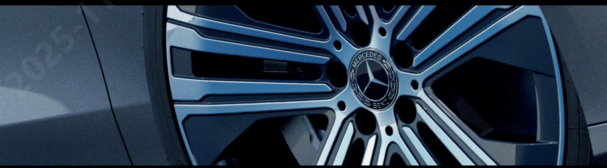

# 梅赛德斯-奔驰长轴距E级轿车和运动轿车使用说明书 (用户手册)

# 前排乘客前置气囊警告

警告 WARNING 不得在受安全气囊保护的座椅上放置后向 儿童座椅，否则可能导致死亡或严重伤書 DO NOT place rear-facing child seat on this seat with airbag. DEATH or SERIOUS INJURY can occur.

警告前排乘客前置气囊启用时的伤害 或致命伤害风险

如果前排乘客前置气囊启用，在发生事故时，前排乘客座椅上的儿童可能会被前排乘客前置气囊撞击。

任何情况下，不得在前置气囊处于启用状态的座椅上使用后向儿童约束系统，否则可能导致死亡或严重伤害。

请遵守"车内的儿童"章节的说明。

# 欢迎进入梅赛德斯-奔驰的世界

首次驾驶前，请先仔细阅读本使用说明书（用户手册），并熟悉您的车辆。为了您的安全并延长车辆使用年限，请遵守本使用说明书（用户手册）中的说明和警告。否则可能会造成人身伤害或车辆受损。

因此，使用说明书（用户手册）中所述的内容可能与车辆的装备特征或产品名称有所不同。使用说明书（用户手册）描述了以下内容：

·本使用说明书（用户手册）付印时可提供的车型以及标准和选装装备。  
·仅在某些国家和地区提供的车型以及标准和选装装备。  
·后续才提供的车型以及标准和选装装备。

请注意，您的车辆可能未配备所描述的全部功能。其中包括与安全相关的系统和功能。因此，在个别情況下，车辆的实际装备可能与描述和图示有所不同。

因此，梅赛德斯-奔驰不断改进其车辆，并因此保留对以下方面进行更改的权利：

·设计  
·装备  
·技术性能

有关最新的车辆完整信息以及所有后续上传功能的描述，请参见MBUX智能人机交互系统中的电子使用说明书（用户手册）

您的购车合同原件中列出了车辆交付时所配置的装备特征。

以下资料均为车辆的组成部分：

·MBU×智能人机交互系统中的电子使用说明书（用户手册）  
·印刷版使用说明书（用户手册）  
·保养手册  
·补充资料  
·补充文件

请务必时刻随车携带这些文件。确保随车携带所有文件或者在出售、出租或出借车辆时一同转交这些文件，并告知实际驾驶人阅读本使用说明书（用户手册），遵守本使用说明书（用户手册）中的说明和警告注意事项。

在使用前须认真阅读本使用说明书（用户手册），阅读后妥善保存，禁止对车辆进行非法改装及加装。

北京奔驰汽车有限公司

# 符号 5

# 概览. 6

驾驶室（中央显示屏） 6  
驾驶室（MBUX超级屏幕） 8  
驾驶室（插电式混合动力车辆） 10  
指示灯和警告灯（标准） 12  
指示灯和警告灯（带驾驶员摄像头） ..... 16  
上方控制面板 20  
车门操作单元和座椅调节 22  
紧急情况和故障 24

# 电子使用说明书（用户手册）.. 26

调用电子使用说明书（用户手册).. 26

# 一般说明. 27

环境保护 27  
梅赛德斯-奔驰原厂配件 27  
触摸感应式控制元件 28  
梅赛德斯-奔驰应用. 29  
操作安全 29  
将车牌安装到前车牌支架上 32  
国家/地区特定的无线电部件监管信息..32  
诊断接口 33  
具有资质的专业服务中心.. 34  
机动车注册 34  
车辆的正确使用 34  
适用于使用电子医疗辅助设备的人员  
的注意事项... 34  
默示保证.. 35  
救援卡二维码 35  
数据存储 35  
版权.. 42

# 驾驶员及乘客安全 43

要点简述. 43  
有关约束系统自动功能的信息 49  
约束系统的目的和功能 52  
安全带 56  
气囊 57

# 车内的儿童 58

要点简述 58  
重要安全注意事项 59  
用于运载儿童的合适儿童约束系统 64  
适用于安装儿童约束系统的座椅 67  
固定儿童约束系统 69  
儿童安全锁 73  
乘员存在识别 74

# 开启和关闭 75

钥匙.. 75   
电子车钥匙 78   
车门 80   
行李箱 86   
侧车窗 91   
滑动天窗 94   
遮阳帘 97   
防盗保护 98

# 座椅和存放 100

关于正确的驾驶员座椅位置的注意事  
项.. 100  
关于把手的说明 100  
座椅. 101  
方向盘... 110  
方便出入功能 112  
记功能 · 114  
杯座. 119  
插座.. 123  
在前排为移动电话无线充电 123  
安装和拆卸脚垫. 124

# 车灯和视野 125

车外照明 125  
车内照明 133  
风挡玻璃雨刮器和风挡玻璃清洗系统. 136  
后视镜.. 138  
有关汽车电子标识安装位置的信.. 141

# 智能气候控制 142

智能气候控制系统概述 142  
操作智能气候控制系统 144

# 驾驶和驻车 155

驾驶 155  
动态操控选择（DYNAMIC SELECT） ....... 167  
自动变速箱 170  
全时四轮驱动（4MATIC）功能 174  
加注燃油 174  
为高电压蓄电池充电（插电式混合动力  
车辆） 177  
驻车.. 191  
驾驶和驾驶安全系统 195  
车辆牵引说明 260

# 驾驶员显示屏. 253

有关驾驶员显示屏的注意事项 253  
关于3D驾驶员显示屏的说明 253  
驾驶员显示屏故障 253  
操作驾驶员显示屏 254  
驾驶员显示屏菜单 254  
平视显示 254  
配有48伏车载电气系统的车辆 256  
功率表功能... 256  
驾驶员显示屏上的状态指示灯  
概述 258

# MBUX智能人机交互系统 260

概述和操作 260  
系统设定 278  
插电式混合动力设定 282  
导航和交通 284  
电话. 294  
MB Apps（数字化产品和服务） 297  
梅赛德斯-奔驰紧急呼叫系统 302  
收音机和媒体， 305

音响设定. 306

# 保养和护理 307

主动保养提示系统增强版（ASSYST  
PLUS）保养时间间隔显示 307  
保养管理 308  
远程诊断 308  
发动机舱 309  
清洁和护理 314

# 故障救援. 322

紧急情况， 322   
泄气的轮胎 323   
蓄电池（车辆） 328   
牵引起动或牵引 335   
保险丝 339

# 车轮和轮胎 350

有关噪音或异常操控性的注意事. 342  
有关定期检查车轮和轮胎的注意事项.342  
有关防滑链的注意事项 342  
启用或停用防滑链模式 343  
轮胎气压. 343  
车轮更换， 346  
应急备用轮胎 354

# 技术数据， 356

车载电子设备 356  
规范无线电信息 357  
车辆铭牌，车辆识别代号（VIN）和发  
动机号码概述 358  
工作液 360  
车辆数据 366

# 显示信息和警告灯/指示灯 375

显示信息 375  
警告灯和指示灯 444

索引.. 463

本使用说明书（用户手册）中包含以下符号：

A 警告 未遵守警告注意事项造成的危险警告注意事项提醒您注意可能危及您或他人健康或生命的危险。

请遵守警告注意事项。

<table><tr><td>上 环保说明未遵守环保说明造成的环境 破坏</td></tr><tr><td>环保说明包括有关环保行为或环保弃置的 信息。 N 请遵守环保说明。</td></tr></table>

<table><tr><td>！ 注意事项未遵守有关产品质量责任的 注意事项造成的财产损失</td></tr><tr><td>产品质量责任注意事项提醒您注意可能导</td></tr><tr><td>致车辆损坏的风险。</td></tr><tr><td>请遵守有关产品质量责任的注意事项。</td></tr></table>

$\textcircled{1}$ 这些符号表示实用的操作指示或可能对您有帮助的详细信息。

说明

(→页）

# Display

有关主题的详细信息  
中央显示屏中的显示  
MBUX智能人机交互系统中要选择的  
最高级菜单  
MBUX智能人机交互系统中要选择的  
相应子菜单  
指示原因

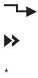

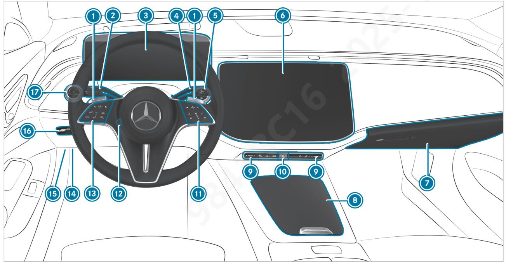

左舵驾驶车辆

$\textcircled{8}$ 方向盘换档拨片 → 172  
$\textcircled{6}$ 组合开关 → 127  
$\textcircled{8}$ 驾驶员显示屏 → 262  
$\textcircled{9}$ 直接选档（DIRECT SELECT）换档杆 → 170  
$\textcircled{6}$ 启动/停止按钮 → 158自动节能启停功能 → 165  
$\textcircled{5}$ 中央显示屏 → 269  
$\textcircled{6}$ 手套箱 → 116  
$\textcircled{9}$ 储物格 → 116  
$\textcircled{9}$ 开关板，用于：动态操控选择（DYNAMIC SELECT）按 169钮智能泊车 → 247快速车辆出入授权

开启/关闭MBUX智能人机交互系统 → 269  
开启/关闭声音 → 269  
调节音量 → 269  
$\textcircled{1}$ 危险警告灯系统 → 127  
$\textcircled{4}$ MBUX 智能人机交互系统控制面板 → 276  
$\textcircled{4}$ 调节方向盘 → 111  
$\textcircled{1}$ 控制面板：  
驾驶员显示屏 → 262  
定速巡航控制或可变限速器 → 204  
$\textcircled{4}$ 诊断接口 → 33  
$\textcircled{6}$ 开启发动机罩 → 317  
$\textcircled{4}$ [ $\textcircled{8}$ 电动驻车制动器 → 193  
$\textcircled{8}$ 照明开关 → 125

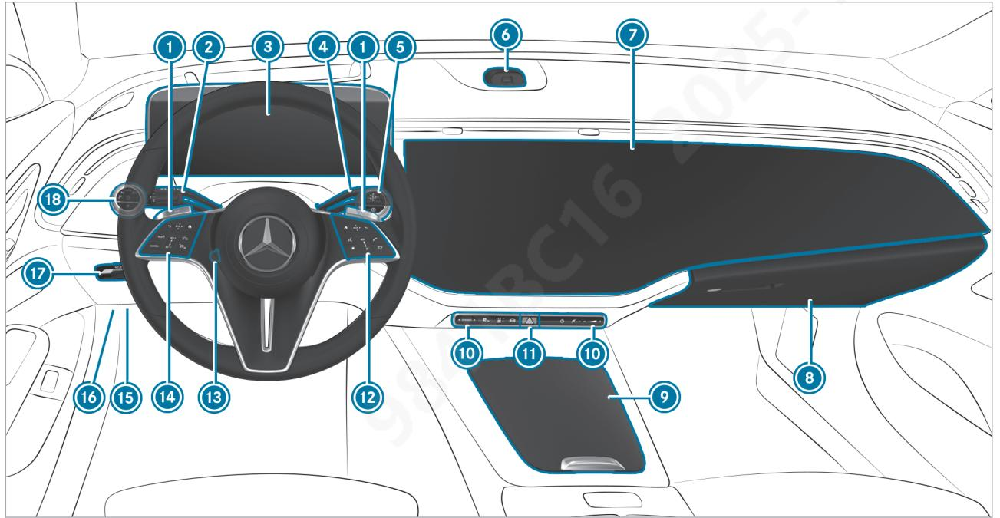

左舵驾驶车辆

$\textcircled{8}$ 方向盘换档拨片 → 172  
$\textcircled{6}$ 组合开关 → 127  
$\textcircled{8}$ 驾驶员显示屏 → 262  
$\textcircled{9}$ 直接选档（DIRECT SELECT）换档杆 → 170  
$\textcircled{6}$ 启动/停止按钮 → 158  
自动节能启停功能 → 165

$\textcircled{5}$ 自拍和摄像机$\textcircled{6}$ 带以下配置的MBUX超级屏幕：

中央显示屏 269  
前排乘客显示屏 268

$\textcircled{4}$ 开关板，用于：

e动态操控选择（DYNAMIC SELECT）按 → 169 钮 回智能泊车 → 247

快速车辆访问  
开启/关闭MBUX智能人机交互系统 → 269  
开启/关闭声音 → 269  
调节音量 → 269  
$\textcircled{4}$ 危险警告灯系统 → 127  
$\textcircled{4}$ MBUX 智能人机交互系统控制面板 → 276  
$\circledcirc$ 调节方向盘 → 111  
$\textcircled{4}$ 控制面板：  
驾驶员显示屏 262  
定速巡航控制或可变限速器 → 204  
$\textcircled{6}$ 诊断接口 → 33  
$\textcircled{4}$ 开启发动机罩 → 317  
$\textcircled{4}$ $\textcircled{8}$ 电动驻车制动器 → 193  
$\textcircled{4}$ 照明开关 → 125

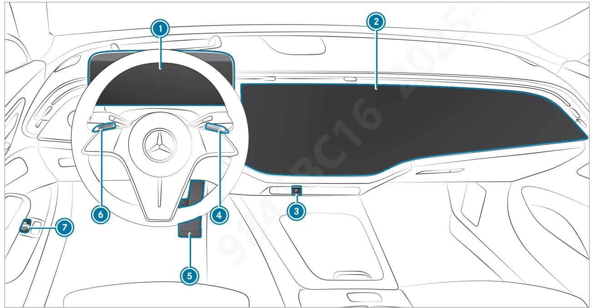

左舵驾驶车辆$\textcircled{8}$ 驾驶员显示屏：

<table><tr><td>READY操作准备就绪</td><td>266 →</td></tr><tr><td>旅程电脑</td><td></td></tr><tr><td>节能辅助 →</td><td>167</td></tr><tr><td>? 带以下配置的MBUX超级屏幕：</td><td></td></tr><tr><td>中央显示屏 →</td><td>269</td></tr></table>

前排乘客显示屏 → 268  
$\textcircled{8}$ 配置充电设定 → 290  
$\textcircled{9}$ $\sqcap$ 减少能量回收 → 166  
$\textcircled{6}$ 触控加速踏板 → 167  
$\textcircled{5}$ 加大能量回收 → 166  
$\textcircled{6}$ D释放燃油箱中的压力并加注燃油 → 177  
$\textcircled{8}$ 注意力辅助系统指示灯 → 464  
$\textcircled{6}$ 转向信号灯指示灯 → 127  
$\textcircled{8}$ 指示灯停止运作警告灯  
$\textcircled{9}$ 电气故障警告灯 → 458  
$\textcircled{6}$ $\textcircled { \bullet } !$ 动力转向系统警告灯（红色） → 457  
动力转向系统警告灯（黄色） → 457  
$\textcircled{5}$ 约束系统指示灯 → 454  
$\textcircled{6}$ 安全带警告灯 → 454  
$\textcircled{9}$ A车距警告灯 → 464  
$\textcircled{8}$ $\textcircled{4}$ 防抱死制动系统（ABS）指示灯 → 464  
$\textcircled{4}$ 轮胎气压监控系统警告灯 → 469  
$\textcircled{4}$ 发动机诊断警告灯 → 458  
$\textcircled{4}$ 电控车辆稳定行驶系统关闭（ESP? → 464  
OFF） 警告灯  
电控车辆稳定行驶系统（ $\mathsf { E S P } ^ { \mathtt { ( B ) } }$ ）指示 464  
灯

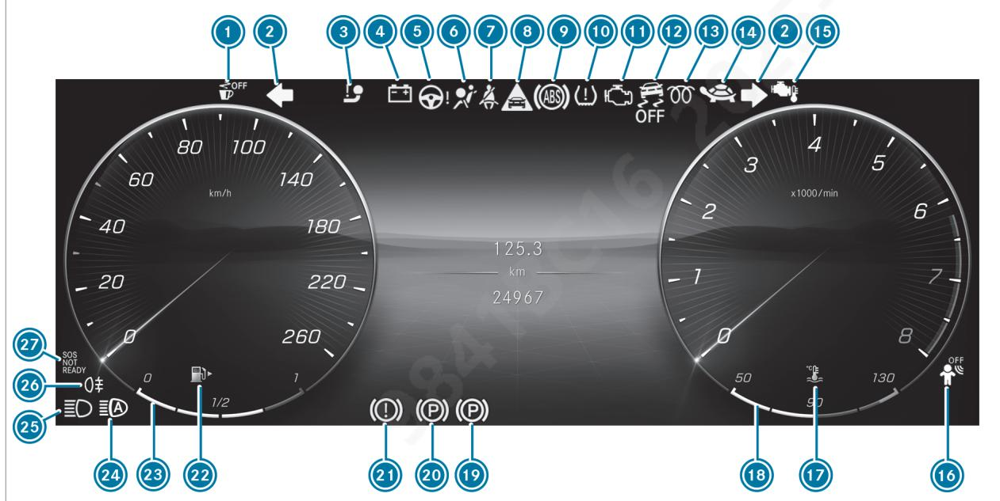

$\circledcirc$ 指示灯停止运作警告灯  
$\textcircled{4}$ 驱动系统：功率降低警告灯 → 456$\textcircled{6}$ 汽油发动机：发动机工作温度指示灯 → 458$\textcircled{4}$ 乘客存在提醒指示灯（白色） → 454乘客存在提醒指示灯（黄色）  
$\textcircled{4}$ 冷却液温度指示灯 → 458$\textcircled{4}$ 冷却液温度显示  
$\textcircled{4}$ $\textcircled{8}$ 电动驻车制动器指示灯（黄色） → 462$\textcircled{4}$ [ $\boxed { ( \bullet ) }$ 电动驻车制动器警告灯（红色) → 462$\textcircled{4}$ [ $\textcircled{1}$ 制动器警告灯（红色） → 462[ $\textcircled{1}$ 制动器指示灯（黄色） → 462$\textcircled{4}$ D 燃油储备以及加油口盖板位置指示灯 → 458$\textcircled{4}$ 燃油液位  
$\textcircled{2}$ 自适应远光灯辅助系统指示灯 → 131? D远光灯指示灯 → 127D 近光灯指示灯 → 125  
$\textcircled{8}$ 转向信号灯指示灯 → 127  
$\textcircled{6}$ 安全带指示灯 → 454  
$\textcircled{8}$ A车距警告灯 → 464  
$\textcircled{9}$ 约束系统警告灯 → 454  
$\textcircled{6}$ 驱动系统：功率降低警告灯 → 456  
$\textcircled{5}$ 轮胎气压监控系统警告灯 → 469  
$\textcircled{6}$ 电控车辆稳定行驶系统关闭（ESP? → 464OFF） 警告灯电控车辆稳定行驶系统（ $\mathsf { E S P } ^ { \mathtt { ( B ) } }$ ）指示 464灯  
$\textcircled{9}$ [ $\textcircled{4}$ ]防抱死制动系统（ABS）故障警告灯 → 464  
$\textcircled{9}$ 0指示灯停止运作警告灯  
$\textcircled{1}$ 乘客存在提醒指示灯（白色） → 454乘客存在提醒指示灯（黄色）  
$\textcircled{4}$ 冷却液温度指示灯 → 458  
$\textcircled{4}$ 冷却液温度显示

<table><tr><td></td><td>侧灯指示灯</td><td></td><td>125</td></tr><tr><td>26</td><td></td><td>后雾灯指示灯</td><td>126</td></tr><tr><td>?</td><td></td><td>梅赛德斯-奔驰紧急呼叫系统指示灯</td><td>468</td></tr></table>

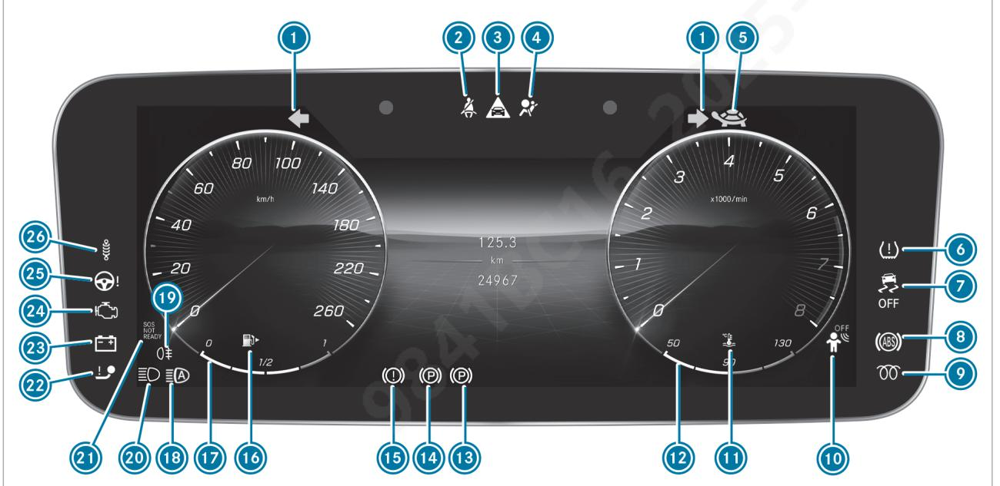

$\textcircled{1}$ $\boxed { ( \bullet ) }$ 电动驻车制动器指示灯（黄色) → 462  
$\textcircled{4}$ $\boxed { ( \bullet ) }$ 电动驻车制动器警告灯（红色） → 462  
$\textcircled{6}$ [ $\textcircled { \textcircled { 1 } }$ 制动器警告灯(红色) → 462  
[ $\textcircled{1}$ 制动警告灯（黄色） → 462  
$\textcircled{1}$ 燃油储备以及加油口盖板位置指示灯 → 458  
$\textcircled{4}$ 燃油液位  
$\textcircled{4}$ 自适应远光灯辅助系统指示灯 → 131  
$\textcircled{4}$ 后雾灯指示灯 → 126  
$\textcircled{4}$ 远光灯指示灯 → 127  
D 近光灯指示灯 → 125  
侧灯指示灯 → 125  
$\textcircled{4}$ 梅赛德斯-奔驰紧急呼叫系统指示灯 → 468  
$\textcircled{4}$ 指示灯停止运作警告灯  
$\textcircled{4}$ 电气故障警告灯 → 458  
$\textcircled{2}$ 发动机诊断警告灯 → 458  
? 动力转向系统警告灯(红色) → 457

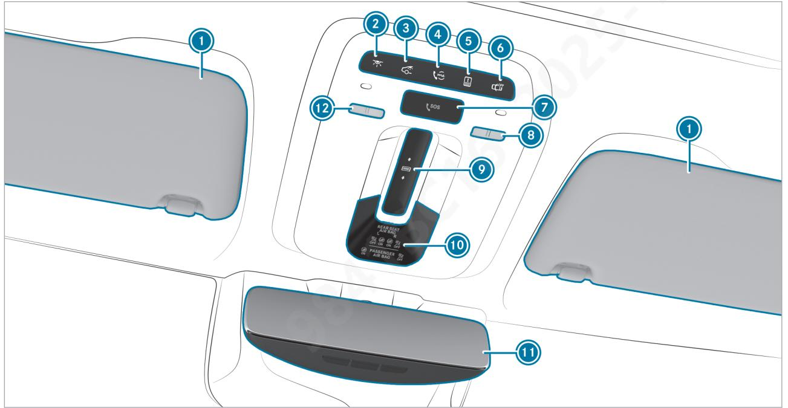

$\textcircled{8}$ 遮阳板   
$\textcircled{6}$ $\overline { { \nsim } }$ 开启/关闭前排车内照明 → 133 $\textcircled{8}$ 开启/关闭后排车内照明 → 133 $\textcircled{9}$ me按钮 → 305 $\textcircled{6}$ 开启/关闭全景式滑动天窗后部遮阳 → 94 帘   
$\textcircled{5}$ 开启/关闭自动车内照明控制 → 133 $\textcircled{6}$ sosSOs按钮 → 305   
$\textcircled{9}$ 开启/关闭右侧阅读灯 → 133   
$\textcircled{8}$ 开启/关闭全景式滑动天窗 94 开启/关闭全景式滑动天窗前部遮阳 → 94 帘   
$\textcircled{1}$ 指示灯： 乘客前置气囊（PASSENGER AIRBAG） → 47   
$\textcircled{4}$ 车内后视镜 → 140   
$\textcircled{6}$ 开启/关闭左侧阅读灯 → 133

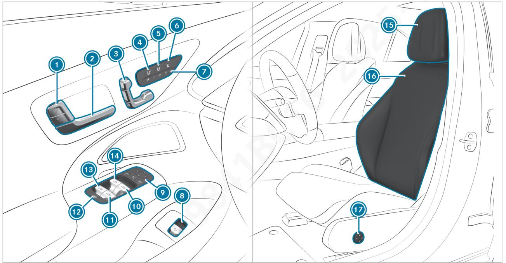

$\textcircled{8}$ 锁止/解锁车辆 → 80  
$\textcircled{6}$ 开启车门 → 80  
$\textcircled{8}$ 电动调节座椅 → 101  
$\textcircled{9}$ 开启/关闭座椅加热器 → 108  
$\textcircled{6}$ 开启/关闭座椅通风 → 110  
$\textcircled{5}$ 调节前排乘客座椅 → 101  
$\textcircled{6}$ M操作记忆功能 → 114  
$\textcircled{9}$ 开启/关闭行李箱盖 → 86  
$\textcircled{8}$ 操作车外后视镜 → 138  
$\textcircled{4}$ 开启/关闭右侧车窗 → 91  
$\textcircled{4}$ 开启/关闭后排右侧车窗 → 91  
$\textcircled{6}$ 后侧窗儿童安全锁 → 74  
$\textcircled{1}$ 开启/关闭后排左侧车窗 → 91  
$\textcircled{4}$ 开启/关闭左侧车窗 → 91  
$\textcircled{6}$ 调节头枕 → 105  
$\textcircled{4}$ 使用 MBUX智能人机交互系统调节座椅 → 107  
$\textcircled{8}$ 调节四向腰部支撑 → 104

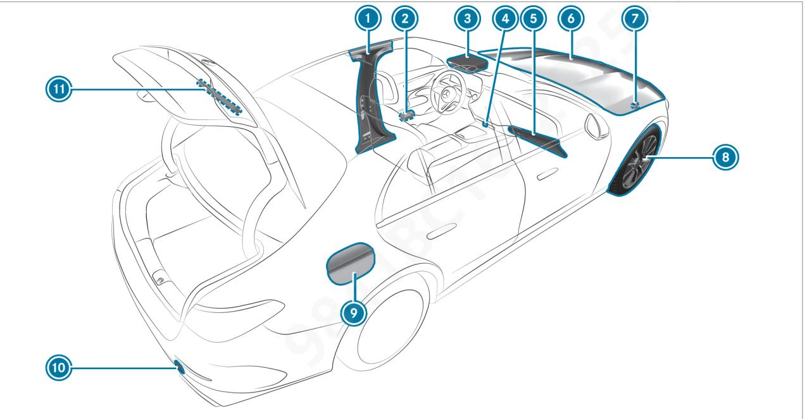

$\textcircled{8}$ B柱以及：

用于访问救援卡的二维码 → 35  
有关轮胎气压的信息标签 → 352  
$\textcircled{6}$ 安全背心 → 330  
$\textcircled{8}$ me按钮 → 305  
sosSOs按钮 → 305  
$\textcircled{9}$ 危险警告灯系统 → 127  
$\textcircled{6}$ 手套箱  
$\textcircled{5}$ 检查并加注工作液 → 368  
起动辅助 → 341  
$\textcircled{6}$ 牵引起动或牵引 → 344  
$\textcircled{9}$ 泄气的轮胎 → 331  
$\textcircled{9}$ 加油口盖板以及：  
有关燃油类型的信息标签 → 174  
用于访问救援卡的二维码 → 35  
$\textcircled{4}$ 牵引起动或牵引 → 344  
$\textcircled{4}$ 警告三角标志 → 331

# 调用电子使用说明书（用户手册）

MBUX智能人机交互系统：

〉设定 信息用户手册·打开电子使用说明书 (用户手册)

电子使用说明书（用户手册）描述了车辆和MBUX智能人机交互系统的功能和操作。

在电子用说明书（用户手册）中选择下·快速启动：找到调整座椅 (驾驶员侧)的第一步。

·提示：找到为您的特定日常用车做准备的信息。

如果车内无法连接互联网，也可以扫描显示的二维码，在您的移动通信设备上观看动画。移动通信设备的数据收费表用于数据连接。

·信息：接收关于驾驶员显示屏上信息的附加信息。

·语言：选择电子使用说明书（用户手册）的语言。

您可使用搜索栏搜索查找关键词，以便快速找到与车辆操作相关问题的答案。

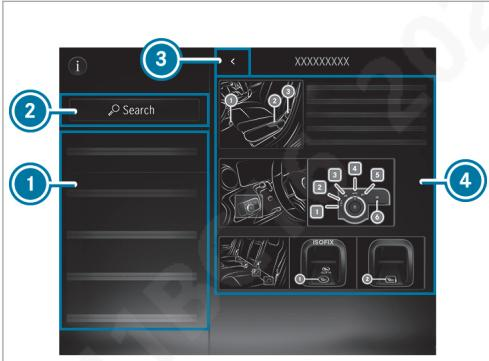

$\textcircled{6}$ 菜单 $\textcircled{6}$ 搜索 $\textcircled{6}$ 返回 $\textcircled{9}$ 目录章节

可展开和收起电子使用说明书（用户手册）中的某些章节，例如警告说明。

# 用于调出电子使用说明书（用户手册）的附加选项：

驾驶员显示屏：调出有关驾驶员显示屏上显示信息的简要说明。按下 $\textcircled{1}$ 将在中央显示屏上显示简要说明。

# MBUX读心语音助理：通过语音控制系统调出

$\textcircled{ i}$ 出于安全考虑，电子使用说明书（用户手册）在行车时停用。

# 环境保护

环保说明 由于驾驶条件和个人驾驶方式造成的环境破坏

车辆的排放量和驾驶车辆的方式直接相关。

以对环境负责的方式操作车辆，以保护环境。请遵守以下有关驾驶条件和个人驾驶方式的建议。

# 驾驶条件：

确保轮胎气压符合推荐标准。  
请勿承载不必要的载荷（例如请勿携带不再需要的车顶行李架）。  
请遵守保养时间间隔。  
定期保养车辆有益于环境保护。  
请务必在具有资质的专业服务中心进行保养工作。

# 个人驾驶方式：

当启动发动机时，不要踩下加速踏板。  
请勿原地怠速热车。

小心驾驶并与前方车辆之间保持适当车距。

避免频繁、突然加速和制动。  
选择适当时候换档，并仅在不超过各档位最大发动机转速的3的情况下使用各档位。  
在停滞的交通状况下关闭车辆发动机，例如使用自动节能启停功能。以高效利用燃油的方式驾驶。注意观察ECO显示以采用经济型驾驶方  
式。

# 插电式混合动力车辆

# 四

环保说明不负责任地弃置高电压蓄电池造成的环境污染

高电压蓄电池含有危害环境的材料。

请到具有资质的专业服务中心弃置损坏的高电压蓄电池。在任何已就蓄电池垃圾处理作出规定的地区，如本手册任何相关内容与该地区规定不一致的，以该地区的规定为准。

# 梅赛德斯-奔驰原厂配件

注意事项安装附件、维修或焊接造成的约束系统操作性能受损

气囊和安全带紧急拉紧器以及约束系统控制单元和传感器可能安装在您车上的以下区域：

·车门  
·车门立柱  
·车门槛  
座椅  
驾驶室  
驾驶员显示屏  
·中央控制台  
·侧部车顶框架请勿在这些区域安装音频系统等附件。  
请勿进行维修和焊接。  
请到具有资质的专业服务中心加装附件。

如果使用未经梅赛德斯-奔驰认可的配件、轮胎和车轮或与安全相关的附件，可能会危及车辆的操作安全性。关键的安全系统（例如制动系统）可能会发生故障。仅可使用梅赛德斯-奔驰原厂配件或具有同等品质的零部件。仅可使用经专门认可适用于您车型的轮胎、车轮和配件。

对于梅赛德斯-奔驰原厂配件和经专门认可适用于您车型的改装件和配件，其可靠性、安全性与适用性均经梅赛德斯-奔驰测试。尽管在不断进行市场研究，但是梅赛德斯-奔驰无法对其他零部件进行评定。因此，梅赛德斯-奔驰对在梅赛德斯-奔驰车辆中使用此类零部件概不负责，即使这些产品已获得第三方检测部门的独立认可。

使用未经梅赛德斯-奔驰认可的配件可能会使车辆的一般行驶许可失效。

此规定适用于以下情况：

·车型与车辆一般行驶许可认可的车型不符。  
·可能危及其他道路使用者。  
·排放水平或噪声等级劣化。

在订购梅赛德斯-奔驰原厂配件时，请务必指明车辆识别代号（VIN） $(  $ 第366页)。

# 触摸感应式控制元件

除传统的开关和按钮外，您的车辆还配备触摸感应式控制元件。

这些部件位于车辆的以下区域：

·车顶和车门操作单元  
·智能气候控制  
·方向盘  
·MBUX智能人机交互系统

控制元件配有触摸感应式用户界面表面。例如，通过按下或滑动来控制表面，以调节设定或触发功能。

在中央显示屏区域，您还可通过触摸感应式界面以脉冲、振动或用户界面表面结构改变等形式来传送触觉确认。

中央显示屏表面的触觉确认是使用超声波产生的。

进行中央显示屏的触觉操作时，始终确保头部和显示屏表面有足够的距离。

在以下情况下传送触觉确认，例如：

·当与显示屏表面上的控制元件交互时  
·滚读列表或表格时  
·到达显示屏表面上的新区域时，例如弹出窗口、控制元件、图标

尽管经过精心开发，梅赛德斯-奔驰股份公司仍无法完全排除触觉操作受外部麦克风影响的可能性。

如果有任何问题，请联系具有资质的专业服务中心。

使用触摸感应式用户界面表面时，请遵守以下要点，以防操作时出现问题：

·请勿将贴纸或类似物品粘贴在表面上·请勿将智能手机或其他支架安装到中央显示屏表面上。·防止表面受湿气和潮湿条件的影响。·保持表面无灰尘和污垢 第327页)。

除标识外，某些触摸感应式控制元件还带有整合式指示灯。确保在使用时按下控制元件的标识。

# 梅赛德斯-奔驰应用

# 有关数字化产品和服务的注意事项

您也可以在购车后通过Mercedesme 追溯激活各项功能（数字化产品和服务）。

有关信息，请咨询梅赛德斯-奔驰授权服务中心。

# 通过Mercedes me 激活数字化产品和服务

#

·车辆具备无线连接。  
·车辆已连接至Mercedes me 用户帐户。

# 订购并激活数字化产品和服务

? 将您要购买的数字化产品和服务放入梅赛德斯-奔驰商店的购物篮中。完成订单。在您使用车辆时，数字化产品和服务将被激活。

# 加速激活

关闭并锁止车辆。

约两分钟后，解锁并启动车辆。数字化产品和服务将被激活。对于某些功能，还会在车辆MBUX智能人机交互系统中显宗通知。

如果激活失败，则重复上述过程。

# 操作安全

警告 因故障或系统故障导致的事故风险

如果您没有进行规定的服务/保养工作以及任何所需的维修，可能会导致故障或系统故障。

请务必在具有资质的专业服务中心进行规定的服务/保养工作以及任何所需的维修。

■警告 由于对电子部件进行不恰当的改装或加装造成的事故或伤害风险

对电子部件、其软件或接线进行改装或加装会损害其功能和/或其他联网组件或与安全相关的系统的功能。

这可能危害车辆的操作安全。

您不得篡改接线、电子部件或其软件。务必到具有资质的专业服务中心进行与电气和电子设备相关的工作。

如果改装或加装车载电子设备，则可能导致车辆的一般行驶许可失效。

请注意"技术数据"中的"车载电子设备"部分。

警告排气系统高温部件遇外部易燃材料导致起火的风险

如果树叶、草或树枝等易燃材料与排气系统的烫热部件接触，则可能被引燃。

越野行驶或在未铺砌地面上行驶时，应定期检查车辆底部。  
特别是，要清除任何被夹住的植物或其他易燃材料。  
如果发生损坏，请立即通知具有资质的专业服务中心。

注意事项 由于车速过快和由于撞击车底或悬挂部件造成的车辆损坏

尤其是在以下情况下，存在车辆损坏危险：

·车辆接触到地面，例如在高路缘或未铺砌的道路上  
·车辆快速驶过障碍物，例如路缘、减速带或路坑  
·重物撞击车底或悬挂部件。

在此类情况下，可能看不到对车身、车底、悬挂部件、车轮或轮胎造成的损坏。由此受损的部件可能意外故障，或在发生事故时可能无法再吸收预期的合力。如果车底护板受损，则树叶、草或细枝等易燃材料会积聚在车底和车底护板之间。如果这些材料与排气系统上的高温部件接触，则可能点燃。

请立即到具有资质的专业服务中心检查和维修车辆。

或者

如果继续行车时行驶安全性受损，请立即将车开到路边并停车，注意道路及交通状况并联系具有资质的专业服务中心。

# 插电式混合动力车辆

混合动力车辆配备有1台内燃机和至少1台电动机。电动操作车辆所需的电源由高压车载电气系统提供。

# A 危险 由于改动和/或损坏高压车载电气系统零部件造成的死亡和火灾风险

车辆的高压车载电气系统带有高电压。如果您改装车辆高压车载电气系统中的零部件或碰触受损的零部件，可能会遭到电击。此外，改动和/或损坏零部件可能引发火灾。

发生事故或车底受到撞击时，可能会损坏高压车载电气系统的零部件，尽管损坏不可见。

切勿对高压车载电气系统进行任何改动。

如果车辆的高压车载电气系统零部件被改动或损坏，则请勿启动或使用车辆。

请勿触摸损坏的高压车载电气系统零部件。  
发生事故后，请勿触摸高压车载电气系统的任何零部件。  
发生事故后，请按交警及消防救援机构等主管政府部门指示和要求，妥善处理车辆。  
请到具有资质的专业服务中心检查高压车载电气系统零部件，必要时更换。

高压车载电气系统的部件上标有黄色警告贴。高压车载电气系统的电缆为橙色。

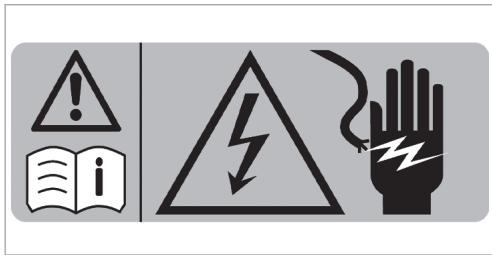

示例

可能会变得很热的高压部件上标有专门的警告标签：

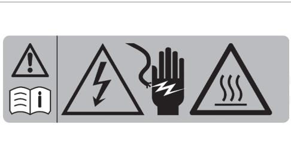

相比于配备内燃机的车辆，配备混合动力系统的车辆产生的噪音显著减小。

在电动模式下行驶时，由于产生的运行噪音明显减小，其他道路使用者可能无法听到本车。

为此，车辆配备了发声器，作为车辆声学预警系统（AVAS）。此保护性措施是法律规定必须配置的。

低速行驶时，在车内可以听到发声器（AVAS）的外部噪音，这并不代表故障。

# 配有48伏车载电气系统的车辆

# 危险触摸受损的高压零部件有造成致命伤害的风险

配备48伏车载电气系统的车辆包含单独的高压部件。这些高压部件带有高电压。

如果您改动这些高压部件的零部件或触摸受损的零部件，则可能会遭到电击。

高压部件可能在事故中受损，即使损坏不可见。

切勿对高压部件的零部件进行改动。

请勿触摸高压部件的受损零部件。发生事故后，请勿触摸高压部件的零部件。

配备48伏车载电气系统的车辆包含高压部件。这些部件带高压标签标记：

会

示例

有关高压部件的所有工作必须到具有资质的专业服务中心进行。

# 将车牌安装到前车牌支架上

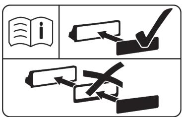

信息标签可在车牌支架上找到，为压印标签或贴附标签。

# 注意事项因车牌在前牌照固定架上组装不当导致的故障和系统故障

如果车牌在前牌照固定架上组装不当，传感器、摄像头或驾驶和安全系统可能会发生故障或失效。

在前牌照固定架上组装车牌时，请遵守以下几点：

将车牌直接组装在牌照固定架上，不安装广告介质或其他支架。  
组装车牌时，不要使车牌从牌照适配器上方或侧面凸出。

# 国家/地区特定的无线电部件监管信息

# 有关改装无线电部件的信息

对无线电部件进行改装可能会使相关无线电部件的一般行驶许可失效。无线电部件制造商对此类改装不承担任何责任。

# 关于微功率设备的使用说明：

a)车辆配备的钥匙系统由钥匙和/或数字车钥匙、车载收发器模块组成，使用集成天线，符合“微功率短距离无线电发射设备目录和技术要求"中关于通用微功率设备（A类设备）和通用无线遥控设备的技术要求。钥匙系统使用频率是21.85kHz，433.05-434.79MHz，2400-2483.5 MHz，6.5-8.0 GHz。车辆配备的轮胎气压监测系统由车轮上安装的传感器和车载收发器模块组成，使用集成天线，符合“微功率短距离无线电发射设备目录和技术要求"中关于通用无线遥控设备的技术要求。轮胎气压监测系统使用频率是433,05-434,79MHz;

$\textcircled{1}$ 注：根据车辆配置的不同，轮胎气压监测系统，钥匙系统和使用频率可能存在差异。

b)不得擅自改变使用场景或使用条件、扩大发射频率范围、加大发射功率（包括额外加装射频功率放大器），不得擅自更改发射天线；

c)不得对其他合法的无线电台（站）产生有害干扰，也不得提出免受有害干扰保护；

d)应当承受辐射射频能量的工业、科学及医疗（ISM）应用设备的干扰或其他合法的无线电台（站）干扰;

e)如对其他合法的无线电台（站）产生有害干扰时，应立即停止使用，并采取措施消除干扰后方可继续使用；

f)在航空器内和依据法律法规、国家有关规定、标准划设的射电天文台、气象雷达站、卫星地球站（含测控、测距、接收、导航站）等军民用无线电台（站）、机场等的电磁环境保护区域内使用微功率设备，应当遵守电磁环境保护及相关行业主管部门的规定；

g)禁止在以机场跑道中心点为圆心、半径5000米的区域内使用各类模型遥控器；

h)无线电设备只能按照车辆的预期用途在区域内的通常温度下使用。

# 诊断接口

诊断接口是车辆中的技术操作界面。例如，可在维修和保养工作范围内使用它，或用于在梅赛德斯-奔驰授权服务中心读取车辆数据。因此，只应在梅赛德斯-奔驰授权服务中心连接诊断装置。

# A 警告将设备连接至诊断接口时存在事故风险

如果将设备连接至车辆的诊断接口，车辆系统的操作和操作安全可能会受到影响。

出于安全考虑，我们建议您只使用和连接经梅赛德斯-奔驰授权服务中心认可的产品。

警告驾驶员侧脚部位置的物品造成的事故风险

驾驶员侧脚部位置的物品可能会妨碍踏板行程或绊阻已踩下的踏板。

这样会危及车辆的操作安全性和行驶安全性。

牢固存放车内所有物品，确保它们不会进入驾驶员脚部位置。  
务必确保踏板有足够的间隙。  
务必按照描述牢固安装脚垫。  
请勿使用松动的脚垫且勿叠放脚垫。

注意事项使用连接至诊断接口的设备使蓄电池放电

在诊断接口处使用设备将导致蓄电池放电。

检查蓄电池电量。  
如果蓄电池电量低，则通过长距离驾驶等方式为蓄电池充电。

另请注意"驾驶和驻车"章节中有关12 伏蓄电池和短途行程的信息 第161页)。

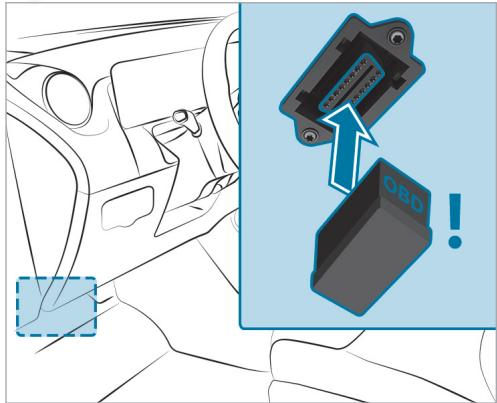

连接和使用其它带有诊断接口的装置可能会造成以下影响：

·车辆系统中出现故障·车辆部件永久损坏为此，请参考保修条款与条件。此外，将设备连接至诊断接口可能导致排放监测信息复位等情况，从而造成车辆在下次进行总检查时无法满足排放检测的要求。

# 具有资质的专业服务中心

梅赛德斯-奔驰授权服务中心是具有资质的专业服务中心。其拥有正确执行您车辆所需各项作业必备的专业技能、工具和资格。这尤其适用于安全关键性作业。

推荐在梅赛德斯-奔驰授权服务中心检查您的车辆并进行以下作业：

·安全关键性作业  
·服务和保养作业  
维修作业  
·变更、安装及改装改动作业  
对电子部件执行的作业  
·插电式混合动力车辆：对混合动力系统执行的作业  
配备48伏车载电气系统的车辆：对48伏车载电气系统高电压部件执行的作业

梅赛德斯-奔驰向您推荐梅赛德斯-奔驰授权服务中心。

# 机动车注册

梅赛德斯-奔驰可能会指示其授权服务中心对某些车辆进行技术检查，以改进车辆的品质或安全性。

梅赛德斯-奔驰只有拥有您的注册数据后，才能通知您有关车辆检查的事宜。

在以下情况下，您的车辆可能尚未使用您本人姓名/名称进行注册：

·车辆不是从授权经销商处购买。·车辆未曾在梅赛德斯-奔驰授权服务中心进行过检查。

因此，梅赛德斯-奔驰建议您到梅赛德斯-奔驰授权服务中心对车辆进行注册。

如果您的地址变更或车辆转让，请尽快通知梅赛德斯-奔驰。例如，您可到梅赛德斯-奔驰授权服务中心进行此项工作。

# 车辆的正确使用

如果您撕下了警告贴，您或他人可能无法识别到危险。请勿撕下警告贴。

驾驶您的车辆时，请尤其遵守以下信息：

·本使用说明书（用户手册）、车辆特定补充资料和其他补充文件中的安全注意事项  
·车辆技术数据  
·您当前所在国家或地区的交通法规及规定  
·您当前所在国家或地区的机动车法规和安全标准  
·您当前所在国家或地区的无线电法规

# 适用于使用电子医疗辅助设备的人员的注意事项

尽管梅赛德斯-奔驰股份公司精心开发了车辆系统，但不能完全排除车辆系统与心脏起搏器等电子医疗辅助设备的相互作用。

另外，车上安装有一些组件，无论车辆的运行状态如何，这些组件都可以产生与永磁体同等的磁场。这些磁场可能会出现在 MBUX智能人机交互系统和音响系统周围区域或座椅周围区域等，具体取决于相应的车辆配置。

在某些情况下，这可能会导致以下结果，具体取决于所使用的辅助设备：

·医疗辅助设备故障·对健康不利的影响

请遵守有关医疗辅助设备制造商的注意事项和警告，如有疑问，请联系设备制造商和/或您的医生。如果对医疗辅助设备出现故障的可能性存在持续的不确定性，梅赛德斯-奔驰股份公司建议使用少量车辆电气系统和/或与组件保持一定距离。

# 插电式混合动力车辆

为高电压蓄电池充电时，请在医疗辅助设备和以下组件之间保持至少一个臂长的距离：

·充电设备这包括壁挂式充电盒或公共充电桩等形式的充电站。  
·带电压的车辆部件这包括充电电缆和充电控制箱等。

请务必到具有资质的专业服务中心进行以下组件范围内的维修和保养工作：

·带电压的车辆部件·传输天线·MBUX智能人机交互系统和音响系统如果您有任何疑问或建议，请咨询具有资质的专业服务中心。

# 默示保证

<table><tr><td>注意事项违反这些操作说明可造成车 辆损坏。</td></tr><tr><td>违反这些操作说明可造成车辆损坏。 此损坏不在梅赛德斯-奔驰默示保证或 新车或二手车保修范围内。 请遵守本使用说明书（用户手册）中 有关正确操作车辆以及可能造成车辆</td></tr></table>

# 救援卡二维码

二维码固定在加油口盖板内以及B柱的另一侧。发生事故时，救援服务中心能够使用二维码快速为您的车辆找到相应的救援卡。当前的救援卡以简洁的形式为您提供车辆最重要的信息（例如，电缆的布置）。

关于本车型应急救援的信息，详见随车交付的紧急救援卡。如果本部分内容、访问网页获取信息内容、扫描二维码获取信息内容，存在与紧急救援卡不一致的内容，请以紧急救援卡为准。

# 数据存储

# 车内的数据处理

# 电子控制单元

您的车辆上装有电子控制单元。控制单元处理数据，例如从车辆传感器接收、自行生成或在其之间进行交换的数据。其中一些控制单元是安全操作车辆所必需的。例如，一些用于驾驶辅助（例如驾驶员辅助系统），二些用于启用便捷功能或资讯娱乐功能。

下文为您提供有关车内数据处理的一般信息。有关车辆中哪些数据被收集、保存和传输给第三方以及用于什么目的的其他信息，请参见相关使用说明书（用户手册）中与相应功能特征直接

相关的信息。可在线访问和以数字方式访问此信息，具体取决于车辆配置。

# 个人数据

每辆车都有唯一的车辆识别代号。取决于不同国家或地区，例如政府机构可使用此车辆识别代号来确定所有者的身份。还可根据从车辆收集的数据（例如车牌号等）来识别所有者或驾驶员。

因此控制单元生成或处理的数据可能归因于某个人，或者在某些情况下可能归因于某人。根据可用的车辆数据，可以推断出例如您的驾驶行为、位置、路径或使用方式等信息。

# 有关数据披露的法规要求

如果法律要求，在某些情况下，制造商有法律义务根据要求并在要求的范围内向政府实体提供制造商存储的数据。例如，在刑事犯罪调查或行政调查期间，可能就是这种情况。

在某些情况下并在适用的法律框架内，政府实体本身有权读取车辆中的数据。在发生事故的情况下，能够从例如气囊控制单元中获取有助于调查的信息。

# 车内的运作数据

为操控车辆，控制单元处理数据。

这包括以下数据，例如：

·车辆状态信息，例如速度、纵向加速度、横向加速度、车轮转数或安全带系情况显示  
·环境条件，例如温度、雨量传感器或车距传感器

通常这些都是易失的数据，运行期间之外，它们不会被储存，而只会在车辆内部进行处理。控制单元，例如，车钥匙通常包含数据记忆。其使用允许暂时或永久记录有关车辆工作状态、部件负荷、保养要求和技术事件或故障的技术信息。

根据技术装备的不同，存储以下数据：

·系统部件的工作状态，例如加注液位、轮胎气压或蓄电池状态  
·重要系统部件的故障，例如车灯或制动器特殊驾驶状况下的系统反应，例如气囊触发或稳定性控制系统介入  
·有关导致车辆损坏的事件的信息

在某些情况下，可能需要存储原本是临时性的数据。例如，车辆已检测到故障时。

如果您使用修理服务、保养工作等服务，则可以读取所存储的运行数据，并在必要时与车辆识别代号一起使用。这些数据可由服务网点员工（例如服务中心和制造商）或第三方（例如救援服务站）读取。保修索赔和质量保证措施也是如此情况。

通常通过车上的诊断系统连接数据提取端口进行读取。所选的运行数据记录车辆或各部件的技术状态，有助于进行诊断故障，判断保修义务遵守情况以及提高质量。为此，这些数据，尤其是有关部件负荷、技术事件、故障和其他错误的信息可以与车辆识别代号一起传输给制造商。此外，制造商受产品责任制约。因此，制造商还可使用车辆的运行数据来进行召回等。这些数据还可用于核查客户的法定担保和保修。

可由保养服务点或当您作出请求时复位车内的故障存储器，这是维护或保养工作的一部分。

# 便捷功能和资讯娱乐功能

您可存储车辆的便捷功能设定和个人设定并随时进行更改或复位。

根据车辆配置的不同，这包括以下设定，例如：

·座椅和方向盘位置  
·悬挂系统调校和智能气候控制设定  
·车内照明等个人设定

可根据所选设备将数据自行导入到车辆资讯娱乐功能。

根据车辆配置的不同，这包括以下数据，例如：

·多媒体数据，例如可在集成式MBU× 智能人机交互系统中播放的音乐、影片或照片  
·地址簿数据，与集成式免提装置或集成式导航系统配合使用  
·已输入的导航目的地  
·有关使用互联网服务的数据

这些用于便捷功能和资讯娱乐功能的数据可以保存在本地车辆中，也可以保存在已连接至车辆的设备上，例如智能手机、U盘或MP3 播放器。如果您已自行输入这些数据，则可以随时将其删除。

仅当您提出要求时，才将这些数据传输给第三方。这尤其适用于当您根据选择的设置使用在线服务时。

# 智能手机互联系统（例如 Apple CarPlay@）

如果您的车辆配有以上配备，则可将智能手机或其他移动设备连接至车辆。之后，您可通过使用集成在车内的控制元件进行操作。可通过MBUX智能人机交互系统导出智能手机的图片和音频。某些信息将同步传输至您的智能手机。根据集成类型，这包括位置数据、白天/夜间模式和其他一般车辆状态。有关详细信息，请参见车辆使用说明书（用户手册）/资讯娱乐系统。

此集成可使用所选的智能手机应用程序，例如导航或音乐播放器应用程序。智能手机和车辆之间没有进一步互动，尤其不可直接访问车辆数据。额外数据处理类型取决于所使用应用程序的供应商。您可进行的设定（如有）取决于特定应用程序和智能手机的操作系统。

# 在线服务

# 无线网络连接

如果您的车辆配备无线网络连接，则可在车辆和附加系统之间交换数据。通过车载发射器和接收器或带入车内的移动终端设备（例如智能手机）可建立无线网络连接。通过无线网络连接可使用在线功能。这包括由制造商或其他供应商向您提供的在线服务和应用程序。

# 制造商服务

对于制造商提供的在线服务，制造商在适当的地方（例如，在使用说明书（用户手册）或制造商网站上）描述了各个功能，其中还提供了相关的数据保护信息。个人数据可能会用于在线服务。通过安全连接交换数据，例如制造商指定的I系统。除提供服务之外，仅在法律允许和要求的情况下收集、处理并使用任何个人数据。例如，法律规定的紧急呼叫系统、合同协议或获得同意时，就是这种情况。

您可以激活或停用服务和功能，其中一些可能会收取费用。这不包括法律规定的功能和服务，例如紧急呼叫系统。

# 第三方服务

如果您使用其他供应商（第三方）的在线服务，则这些服务由相应供应商承担责任，并受其数据隐私保护政策及使用条款的制约。通常制造商对内容交换不施加影响。

因此，当您使用第三方提供的服务时，如需了解个人数据收集和使用的类型、范围和目的的信息，请联系服务供应商。

# 数据保护权利

根据您所在国家或地区、车辆的设备和功能范围以及您使用的服务和所提供的服务，您有权享有不同的数据保护权利。有关数据保护和您数据保护权利的详细信息，请访问制造商网站，或者您会收到信息，其作为众多服务和服务提供的组成部分。您还可获取制造商及其数据保护人员的联系信息。

例如在服务中心，在专业人员的帮助下并有可能需要付费，您可以读取仅存储在本地车辆的数据。

# 事件数据记录系统（EDR）数据

本车配备事件数据记录系统（EDR）。事件数据记录系统（EDR）主要用于记录发生某些碰撞或类似碰撞情况时的数据，例如气囊触发或与道路障碍物发生碰撞，这些数据有助于了解车辆系统的运行情况。事件数据记录系统（EDR）设计用于以较短的时间（通常为5s或更短）记录与车辆动力学和安全系统相关的数据。

车辆中的事件数据记录系统（EDR）旨在记录以下数据：

·您车辆中的相应系统如何运行  
·驾驶员安全带是否系好/系紧  
驾驶员踩下加速踏板和/或制动踏板的力度（如果有踩下的话），以及  
·车辆行驶的速度有多快

这些数据有助于更好地了解发生碰撞和受伤时的情况。注意：只有在发生严重的碰撞时，您的车辆才会记录事件数据记录系统（EDR）数据；在正常驾驶情况下，事件数据记录系统（EDR）不会记录任何数据，也不会记录任何个人数据（例如姓名、性别、年龄和碰撞位置）。但是，执法部门等第三方可以将事件数据记录系统（EDR）数据与在碰撞调查期间正常获得的个人数据相结合。读取事件数据记录系统（EDR）记录的数据需要特殊设备，并且需要访问车辆或事件数据记录系统（EDR）。除车辆制造商之外，拥有所需特殊设备的第三方（例如执法部门）可以在访问车辆或事件数据记录系统（EDR）时读取信息。

请通过梅赛德斯-奔驰官方网站（https://www.mercedes-benz.com.cn）获取汽车事件数据记录系统（EDR）相关说明信息，包括：

·从 EDR 控制器提取数据方法的说明；  
·A级数据元素中车辆速度的数据源的说明；非锁定事件存储覆盖机制和可覆盖的事件类型等内容的说明；智能控制功能实现方式及相关数据元素等内容的说明。

新车型中将会收集下列数据：

# 纵向delta-V

车辆纵向速度的变化。纵向delta-V仅为总delta-V 的纵向分量。

# 最大记录纵向 delta-V

EDR 记录的×轴方向车辆速度累计变化的最大值。该数据应与“达到最大记录纵向delta-V时间"结合使用。

# 达到最大记录纵向delta-V时间

沿×轴方向，EDR记录的从时间零点到出现速度累计变化最大值所用的时间。该数据应与"最大记录纵向delta-V"结合使用。

# 削波标志

表示 EDR 采集加速度（横向、纵向）首次达到传感器量程的时间点。

# 车辆速度

轮边线速度或其他方式获取的车辆速度。

# 行车制动，开启或关闭

用来检测驾驶员是否踩下制动踏板。

# 驾驶员安全带状态

驾驶员安全带带扣开关的状态。

# 加速踏板位置，全开位置的百分比

加速踏板实际位置与驾驶员全部踩下位置的百分比。

# 每分钟转数（r/min）

车辆发动机主曲轴的每分钟转数。

# 事件中上电周期

从记录 EDR 数据的 ECU 首次使用以来，到事件发生时记录 EDR数据的 ECU中动力循环的次数。动力循环的一个示例为，点火开关从“关闭/辅助"模式到"开启/运行"模式。

# 读取时上电周期

从记录 EDR 数据的 ECU 首次使用以来，到读取时记录EDR数据的ECU中动力循环的次数。动力循环的一个示例为，点火开关从“关闭/辅助"模式切换到"开启/运行"模式。

# 事件数据记录完整状态

事件数据是否被完整记录并存储到记录 EDR数据的 ECU 中的状态标识。

# 本次事件距离上次事件的时间间隔

如果5s内发生两个事件，该时间为事件X开始到事件X-1开始经过的时间。

# 车辆识别代号

车辆制造商指定的车辆识别代号（VIN）。

# 记录 EDR数据的 ECU硬件编号

车辆中实现 EDR 记录功能的 ECU，可能有1个以上。

# 记录 EDR数据的 ECU序列号

车辆中实现 EDR 记录功能的 ECU，可能有1个以上。

# 记录 EDR数据的 ECU软件编号

车辆中实现 EDR 记录功能的 ECU，可能有1个以上。

# 纵向加速度

车辆上某点的矢量加速度在×轴方向上的分量。

# 横向加速度

车辆上某点的矢量加速度在Y轴方向上的分量。

# 横向 delta-V

车辆横向速度的变化。横向delta-V仅为总delta-V的在Y轴方向上的分量。

# 最大记录横向 delta- V

EDR 记录的Y轴方向车辆速度累计变化的最大值，该数据应与“达到最大横向delta-V时间"结合使用。

# 最大记录合量delta-V的平方

EDR 记录的纵向 delta-V 与横向 delta-V的平方和的最大值。

# 达到最大记录横向delta-V时间

沿Y轴方向，EDR记录的从时间零点到出现速度累计变化最大值所用的时间，该数据应与"最大记录横向delta-V"结合使用。

# 达到最大记录合量delta-V平方的时间

从时间零点到最大记录合量delta-V平方出现所用的时间，该数据应与"最大记录合量delta-V的平方"结合使用。

# 横摆角速度

事件前和事件中车辆相对Z轴角度的变化，顺时针为正，适用于具有电子稳定性控制系统的车辆。

# 转向角度

转向盘的角坐标，该坐标上零值（0°）表示转向盘处于中间位置（直线行驶时），正值表示转向盘逆时针方向转动（向左）适用于具备采集转向角度传感器的车辆。

# Tend

碰撞事件终点，如果直至记录周期的终点，该条件还未满足，Tend可被定义为最后记录的数据点的时刻。

年  
事件发生的年份  
月  
事件发生的月份  
日  
事件发生的日期  
时  
事件发生当天的时间（小时）  
分  
事件发生当天的时间（分钟)秒  
事件发生当天的时间（秒）。  
挡位  
实际挡位，适用于该信号上总线

# 制动踏板位置

制动踏板实际位置，从未踩到完全踩下的区间。可在 EDR 读取报告中说明，当制动踏板位置小于100%时车辆的制动系统可能实现100%制动，适用于具有制动踏板位置传感器的车辆。

# 驻车系统状态

用来探测驻车制动是否激活的状态，适用于驻车系统状态上总线的车辆。

# 转向信号开关状态

用来表示车辆转向或变换车道意图的开关的状态，适用于转向信号上总线的车辆。

# 驾驶员安全带预紧装置展开时间

从事件起点（To）到驾驶员安全带预紧装置部署指令所经过的时间。

# 驾驶员正面气囊展开时间(第一阶段)

从事件起点（To）到第一阶段驾驶员正面气囊展开指令所经过的时间。

从事件起点（To）到驾驶员侧面气囊展开指令所经过的时间。

# 驾驶员正面气囊展开时间 (第二阶段)

从事件起点（To）到第二阶段驾驶员正面气囊展开指令所经过的时间。

# 驾驶员侧面气囊展开时间

# 驾驶员侧面气帘展开时间

从事件起点（To）到驾驶员侧面气帘展开指令所经过的时间。

# 前排乘客安全带状态

前排乘客安全带带扣开关的状态，适用于具有安全带提醒装置的车辆。

# 前排乘客安全带预紧装置展开时间

从事件起点（To）到前排乘客安全带预紧装置展开指令所经过的时间。

# 前排乘客正面气囊展开时间(第一阶段)

从事件起点（To）到第一阶段前排乘客正面气囊展开指令所经过的时间。

# 前排乘客正面气囊展开时间（第二阶段）

从事件起点（To）到第二阶段前排乘客正面气囊展开指令所经过的时间。

# 前排乘客侧面气囊展开时间

从事件起点（To）到前排乘客侧面气囊展开指令所经过的时间。

# 前排乘客侧面气帘展开时间

从事件起点（时间零点）到前排乘客侧面气帘展开指令所经过的时间。

# 乘员保护系统报警状态

乘员保护系统故障状态，适用于乘员保护系统报警状态上总线的车辆。

# 轮胎气压监测系统报警状态

当车载轮胎气压监测系统监测到一个或多个轮胎胎压低时的报警状态，适用于该报警状态上总线的车辆。

# 制动系统报警状态

制动系统故障状态，适用于该报警状态上总线的车辆。

# 定速巡航系统状态

定速巡航系统的操作状态。

# 自适应巡航系统状态

自适应巡航系统的操作状态。

# 防抱制动系统状态

防抱制动系统的操作状态，适用于防抱制动 系统状态上总线的车辆。

# 自动紧急制动系统状态

自动紧急制动系统的操作状态。

# 电子稳定性控制系统状态

电子稳定性控制系统的操作状态。

# 牵引力控制系统状态

牵引力控制系统的操作状态。

# 事件前同步计时时间

To 前最后一个数据采样点到To的相对时间，适用于具有事件前同步计时功能的车辆。用于不同数据在时间上对齐。

可通过:http://www.bosch-diagnostics.com.cn在线订购事件数据记录系统（EDR）数据恢复工具。

# 版权

# 免费软件和开放源代码软件

有关您车辆适用的免费软件和开放源代码软件的许可信息，包括更新，可访问以下网址在线获取：

https://www.mercedes-benz.com/opensource

# 要点简述

# 基本信息

尤其要确保满足以下条件，以便约束系统部件能发挥其保护潜力：

·正确乘坐 第43页)。

·正确系安全带 第44页)。

安全带警告灯功能  
第46页)。  
后排座椅安全带状态显示功能第46页)。

·自测试后约束系统警告灯已熄灭第45页)。·指示灯 PASSENGER AIR BAG 显示前排乘客前置气囊的正确状态 第47页)。

# 为清楚理解

“驾驶员及乘客安全"章节包含有关能直接提升车辆乘员安全的设备、功能和行为的信息。

信息结构如下：

·要点简述：在本章中，您将了解到约束系统与所有车辆乘员正确行为之间关系的概述。具体信息：在"驾驶员及乘客安全"章节的其他部分中，您可找到有关约束系统配置和功能的具体信息。关键字目录：您也可使用关键字目录在本使用说明书（用户手册）中找到某些主题。

“驾驶员及乘客安全"章节未提供有关以下主题的信息及其他内容：

·车内的儿童 第58页)  
·驾驶和驾驶安全系统 第195页)  
·储物区域 第114页)

# 明确定义通用术语

本使用说明书（用户手册）使用了以下通用术语：

·驾驶员及乘客安全：包括有助于在事故中尽可能减小车辆乘员应力和事故后果的部件和系统功能。

·约束系统：包括与车辆结构一起有助于防止车辆乘员可能接触车内零件的那些部件。例如，安全带和气囊是约束系统的部件。  
·儿童约束系统：您可在"车内的儿童"章节中找到有关此主题的所有信息第58页)。

# 时刻警醒

为使约束系统部件提供预期水平的保护，坐姿正确并正确系安全带至关重要。

请谨记，乘坐和系安全带时疏忽大意可能会造成严重后果。每次开始旅程之前，都要时刻警醒，确保所有车辆乘员都坐姿正确并正确系好安全带。

# 有关正确座椅位置的信息

座椅位置必须正确，以使约束系统部件提供预期水平的保护。

座椅位置会影响安全带提供的保护和气囊提供的额外保护。

座椅保持近乎完全直立并正确系好安全带可降低气囊触发带来的风险。

选择座椅时请考虑空间大小。当座椅处于正确的近乎直立的位置时，您的头部不应触碰到车顶。

警告不正确的坐姿造成的伤害或死亡凤险

如果您偏离正确的坐姿位置，气囊将无法发挥其预期的保护功能。

每位车辆乘员都务必确保以下各项：

将座椅置于正确位置。  
正确系安全带。孕妇必须特别小心，确保腰部安全带始终不要绕过腹部。遵守以下信息。

为确保约束系统提供预期水平的保护，必须遵守以下信息：

·开始行程前，请正确调节座椅第100页)。进行此操作时，请确保您能够正确系安全带。肩部安全带带身必须从安全带出口导向前方并绕过肩部中间部分。

·与气囊保持距离，尤其是与前置气囊。将驾驶员座椅和前排乘客座椅尽可能靠后移动，同时确保正确系好安全带。

·如果有乘员坐在后排座椅上，则应与其前方的车内部件保持足够的距离。

·确保车辆乘员和气囊之间无人、动物或物品。

·如果您是驾驶员，请遵守以下有关驾驶员座椅正确位置的信息 第100页)。

仅通过方向盘轮圈握住方向盘。这样便于驾驶员前置气囊完全展开。

·采取近乎直立的坐姿，臀部尽可能靠后坐在座垫和座椅靠背之间的间隙中。

您的背部必须尽可能平坦且牢稳地靠在座椅靠背上。

·驾驶时，身体不要前倾，不要靠在车门或侧车窗上。否则，您可能处于气囊触发区域内。

·尽可能将脚放在底板上。您的大腿由座垫稍稍支撑。

例如，请勿将脚放在仪表台上。否则，您的脚可能处于气囊触发区域内。

·正确系好安全带。

# 有关正确系好安全带的注意事项

行车前，务必正确系好安全带。安全带仅在正确系好的情况下才可提供最佳保护。

A警告未正确系安全带造成的伤害或死亡凤险

如未正确系安全带，则其无法发挥其预期的保护作用。

此外，未正确系的安全带也可能造成伤害，例如在发生事故时或紧急制动或转向时。

请始终确保驾驶员及所有乘客均正确系安全带，且坐姿正确。

A警告未将附加约束系统用于体型较小的乘客时造成的伤害或死亡风险

身高低于1.50 米的乘客无法在未使用合适的附加约束系统的情况下正确系安全带。

务必将身高低于1.50 米的乘客安置在合适的约束系统中。

每位车辆乘员都均必须遵守以下注意事项：

·安全带不得扭曲。  
·肩部安全带带身必须从安全带出口导向前方并绕过肩部中间部分。肩部安全带带身不应接触到您的脖子或绕到您的手臂下方或背部后方。腰部安全带必须尽可能低地绕过髋部。此外，将腰部安全带尽可能向下推动，使其绕过您的髋部并使用肩部安全带带身拉紧。请勿将腰部安全带绕过您的腹部。孕妇也必须特别注意这一点。拉紧后，肩部安全带带身和腰部安全带必须紧贴身体。  
·避免穿厚重的衣服，例如冬季外套。  
·请勿将安全带绕过锋利、尖锐、粗糙或易碎的物品。  
）每条安全带每次仅供一人使用。  
·请勿使用车辆乘员已使用的安全带固定物品。

还应确保没有座垫等物体放在乘员和座椅之间。

# 固定和调整安全带

如果快速或猛烈拉动安全带，则安全带卷收 器将锁止。随后将无法进一步拉出安全带。

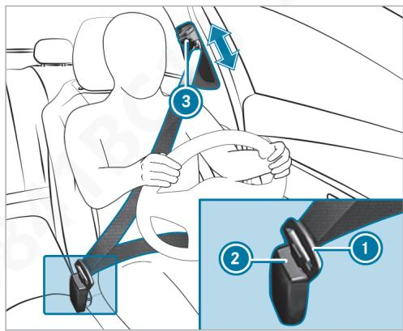

务必将安全带的安全带锁舌 $\textcircled{8}$ 卡入相应座椅的安全带锁扣 $\textcircled{6}$

调节安全带高度：按下安全带出口上的按钮 $\textcircled{8}$ 并将安全带出口滑入所需位置。

接合安全带出口：松开按钮 $\textcircled{6}$ 并确保安全带出口接合。

注意事项 前排乘客座椅未被占用且安全带已扣紧时约束系统部件触发

当前排乘客座椅未被占用且安全带锁舌已卡入安全带锁扣中时，约束系统部件（例如安全带紧急拉紧器）可能会不必要地在前排乘客侧触发。

仅按规定扣紧安全带。

# 约束系统警告灯功能

当车辆启动时，将在约束系统警告灯亮起期间执行自测试。警告灯在车辆启动后数秒钟内熄灭。约束系统部件随后可运作。

如果发生以下情况，说明约束系统出现故障：

·当车辆启动时，约束系统警告灯不亮起或持续亮起。  
·约束系统警告灯在行车过程中持续或反复亮起

如果约束系统的部件已触发，则约束系统警告灯会持续亮起。

# A警告约束系统故障造成的伤害风险

约束系统中的部件可能无意中被启用或未按计划在事故中展开。

请立即到具有资质的专业服务中心检查和修理约束系统。

插电式混合动力车辆：如果约束系统发生故障，自动高压紧急切断可能无法工作。

A 危险自动高压紧急切断故障造成致命伤害的风险

在发生事故时，高压车载电气系统可能无法按预期停用。

如果您碰触到高压车载电气系统中损坏的部件，可能会遭到电击。

请立即到具有资质的专业服务中心检查和修理自动高压紧急切断功能。发生事故后，立即关闭车辆。

梅赛德斯-奔驰建议您将车辆转运至具有资质的专业服务中心。

# 安全带警告灯功能

驾驶员显示屏上的安全带警告灯提醒驾驶员和/或前排乘客未系安全带。

驾驶员及所有乘客都必须系好安全带

第44页)。

此外，还可能会响起警告音。

一旦驾驶员和前排乘客已系安全带，安全带警告即熄灭。

# 后排座椅安全带状态显示功能

# 驾驶员显示屏上的通知

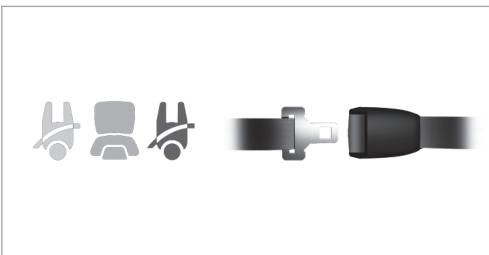

示例：配备三个后排座椅的车辆根据车辆配置的不同，后排座椅安全带状态显示可能配备或未配备座椅占用识别。符号的颜色旨在帮助您快速识别后排座椅安全带的状态。

# 配备后排座椅占用识别（安全带提醒）的车辆

如果车辆已准备好行驶，而后排座椅上有未系安全带的成年人，则会出现后排座椅安全带状态显示。

后排座椅占用识别可识别成年人或相应体型的人赏。体重较轻的人，尤其是儿童，无法被座椅占用识别可靠地识别。当使用儿童约束系统时，座椅占用识别也不能做出反应或只能做出有限的反应。

符号的可能颜色：

·灰色：后排座椅上无人或后排座椅上安装了儿童约束系统。·绿色：后排座椅上的成年人系了安全带。·红色：后排座椅上的成年人未系安全带。

后排座椅上的成年人系好安全带后，安全带警告就会消失。  
如果后排成年人在车辆行驶过程中解开安全带，则后排座椅安全带状态显示会再次出现。  
此外，还可能会响起警告音。

# 未配备后排占用识别的车辆

驾驶员显示屏上的后排座椅安全带状态显示提醒所有车辆乘员必须正确系安全带。

每当车辆开启时，后排座椅安全带状态显示将在一定时间内提醒您哪条后排座椅安全带没有系。

符号的可能颜色：

·灰色：后排座椅安全带未系。·绿色：后排座椅安全带的安全带锁舌已卡入显示的座椅的安全带锁扣中。·红色：后排座椅上有乘员解开了安全带。

如果后排乘员在车辆行驶过程中解开安全带，则后排座椅安全带状态显示会再次出现。

此外，还可能会响起警告音。

# 指示灯 PASSENGERAIR BAG的功能（前排乘客前置气囊)

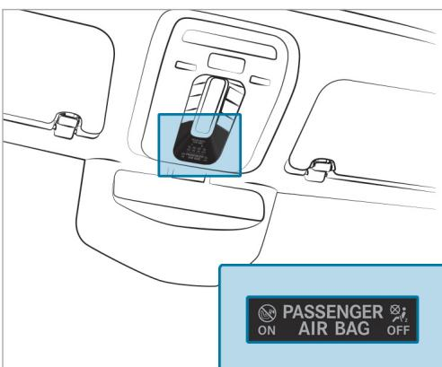

在未配备前排乘客前置气囊自动停用系统的车辆上，前排乘客侧仪表板侧面上贴有专用标签 第61页)。

指示灯 PASSENGER AIR BAG 可显示前排乘客前置气囊的状态。

如果前排乘客座椅被占用或安装有儿童约束系统，请在行车前和行车过程中确保前排乘客前置气囊的状态对于当前情况而言是正确的。

# A警告夹在前排乘客座椅下方的物体可能导致致命伤害风险

夹在前排乘客座椅下方的物体可能会干扰前排乘客前置气囊自动停用系统的功能或损坏系统。

请勿在前排乘客座椅下方存放任何物品。当前排乘客座椅被占用时，确保没有任何物品被夹在前排乘客座椅下方。

自测试：当车辆开启时，指示灯PASSENGERAIR BAG ON 和OFF 同时亮起数秒钟。

进行自测试后，您可确定前排乘客前置气囊的如下状态：

·前排乘客前置气囊停用：PASSENGER AIRBAG OFF 持续亮起。

发生事故时，前排乘客前置气囊不会展开。如果PASSENGER AIR BAG OFF亮起，则任何人不得使用前排乘客座椅。

如果后向儿童约束系统安装在前排乘客座椅上，PASSENGER AIR BAG OFF必须持续亮起。

·前排乘客前置气囊启用：PASSENGER AIRBAG ON亮起最多60秒钟或直到指示灯PASSENGER AIR BAG ON 和 OFF都熄灭。前排乘客前置气囊可能在事故中触发。如果前排乘客前置气囊处于此状态，则不得在前排乘客座椅上安装后向儿童约束系统。

$\textcircled{1}$ 如果车内载有儿童，请遵守“车内的儿童”章节的信息 第58页)

A 警告 前排乘客前置气囊停用时的伤害或事故风险

当乘客前置气囊停用（PASSENGERAIRBAGOFF）指示灯亮起时，说明前排乘客前置气囊停用。

在这种情况下，前排乘客座椅上的乘客可能会撞到车辆内部等，特别是当其乘坐位置离仪表台过近时。

如果前排乘客座椅被占用，请务必确保：

·前排乘客座椅上的乘客分类正确且前排乘客前置气囊已根据前排乘客座椅上的乘客启用或停用。  
·已尽可能向后移动前排乘客座椅。  
·乘客坐姿正确。行车前和行车过程中均确保前排乘客前置气囊的状态正确。

# 前排乘客前置气囊自动停用系统的故障

指示灯 PASSENGER AIR BAG OFF和约束系统警告灯同时亮起。

在这种情况下，任何人都不得使用前排乘客座椅，也不得在前排乘客座椅上安装儿童约束系统。

请立即到具有资质的专业服务中心检查和修理前排乘客前置气囊自动停用系统。

同时，请务必遵守以下其他相关主题的信息：

·前排乘客座椅上的儿童约束系统第62页)  
·适当的儿童约束系统安装位置第67页)

# 停用或启用前排乘客前置气囊

前排乘客前置气囊自动停用系统可根据情况停用或启用前排乘客前置气囊和前排乘客膝部气囊。

这会根据前排乘客座椅上的乘员或儿童约束系统分类自动执行。

您无法手动停用或启用前排乘客前置气囊。

另请注意以下信息：

·关于前排乘客前置气囊的状态，请参见“指示灯PASSENGER AIR BAG 的功能”第47页)  
·有关使用前排乘客前置气囊自动停用系统的注意事项，请参见"前排乘客前置气囊自动停用系统” 第49页)

·如果车内载有儿童，请遵守"车内的儿童”章节 第58页)

# 有关儿童约束系统的信息

安装儿童约束系统时，请遵守"车内的儿童"中的注意事项 第58页)。

# 有关前排乘客座椅上的儿童约束系统的注意事项

警告 前排乘客前置气囊启用时的伤害或致命伤害风险

如果前排乘客前置气囊启用，在发生事故时，前排乘客座椅上的儿童可能会被前排乘客前置气囊撞击。

任何情况下，不得在前置气囊处于启用状态的座椅上使用后向儿童约束系统，否则可能导致死亡或严重伤害。

同时，请特别注意有关前排乘客座椅上的后向或前向儿童约束系统的注意事项(→第62页)。

# 有关约束系统自动功能的信息

# 前排乘客前置气囊自动停用系统功能

前排乘客座椅上的乘客必须遵守以下说明：

·正确乘坐 第43页)。  
·正确系安全带 第44页)。

前排乘客前置气囊自动停用系统可根据情况停用或启用前排乘客前置气囊和前排乘客膝部气囊。

请确保遵守以下信息：

·关于前排乘客前置气囊的状态，请参见“指示灯PASSENGERAIR BAG的功能”第47页)。·在前排乘客座椅上安装儿童约束系统时，请遵守特定车辆信息 第62页)。

与乘员身高相关的前排乘客前置气囊的状态：

·前排乘客前置气囊停用：PASSENGER AIRBAG OFF 持续亮起。

发生事故时，前排乘客前置气囊不会展开。如果 PASSENGER AIR BAG OFF亮起，则任何人不得使用前排乘客座椅。

·前排乘客前置气囊启用：PASSENGER AIRBAG ON亮起最多60秒钟或直到指示灯PASSENGER AIR BAG ON 和 OFF 都熄灭。前排乘客前置气囊可能在事故中触发。请遵守以下有关正确座椅位置的信息第43页)。

配备后排座椅的车辆：身材较矮小的乘员应使用后排座椅。

# 系统限制

否则，前排乘客前置气囊可能会被错误停用，例如在以下情况下：

·前排乘客靠在车辆扶手上，身体重量转移。·前排乘客的坐姿使座椅表面不承受负荷。

注意事项 前排乘客座椅未被占用时约束系统部件触发

在以下情况下，约束系统部件可能在事故中在前排乘客侧意外触发：

·前排乘客座椅上放置了重物。  
·安全带锁舌卡入前排乘客座椅的安全带锁扣中且前排乘客座椅未被占用。将物体存放在合适的位置。每条安全带每次仅供一人使用。

根据探测到的事故情况，车窗气囊可能触发。气囊的触发与前排乘客座椅是否被占用无关。

# 预防性安全系统前向保护（PRE-SAFE@）（预防性驾驶员及乘客保护）功能

预防性安全系统前向保护（PRE-SAFE）能够探测某些危险驾驶状况并执行预防性措施以保护车辆乘员。

预防性安全系统前向保护（PRE-SAFE?）可独立执行以下措施：

·拉紧驾驶员座椅安全带和前排乘客座椅安全带。  
·关闭侧车窗。  
·配备滑动天窗的车辆：关闭滑动天窗。  
配备记忆功能的车辆：将前排乘客座椅移至更加有利的座椅位置。  
配备多仿形座椅的车辆：通过为座椅靠背侧支撑充气来增大侧向支撑。  
预防性安全系统前向保护（PRE-SAFE）听力保护功能：如果MBUX智能人机交互系统开启，则系统将产生短促的噪音信号，以激活人天生的听力保护机制。

注意事项侧脚部位置或座椅后方物体造成的损坏

座椅位置自动调节可能导致座椅和/或物体损坏。

将物体存放在合适的位置。

# 撤销预防性安全系统 前向保护（PRE-SAFE@)措施

如未发生事故，已采取的预防性措施取消。

您需要自行进行某些设定：

如果安全带预张紧力未减弱，请稍稍向后移动座椅靠背。  
安全带预张紧力解除。

# 预防性安全系统 前后向保护（PRE-SAFE?PLUS)

预防性安全系统前后向保护（PRE-SAFE?PLUS）可探测到某些碰撞，尤其是即将发生的后部碰撞并采用预防性措施保护车辆乘员。这些措施无法确保防止即将发生的碰撞。

预防性安全系统前后向保护（PRE-SAFE?

PLUS）可独立执行以下措施：

·拉紧驾驶员座椅安全带和前排乘客座椅安全带。  
·以更高的闪烁频率启用后部危险警告灯。当车辆处于静止状态时提高制动压力。车辆起步时自动取消制动。

如未发生事故，已采取的预防性措施取消。

# 系统限制

在以下情况下，系统将不采取任何行动：

·倒车时

在以下情况下，系统将不施加任何制动：

·行驶时或者  
·使用智能泊车驶入或退出停车位时

# 预防性安全系统 侧向保护（PRE-SAFE?Impulse Side )

如果探测到即将发生侧面碰撞，预防性安全系统侧向保护（PRE-SAFEImpulse Side）可预先将前排座椅上车辆乘员的上半身移至车辆中间。其通过在预计发生碰撞一侧快速为座椅靠背外侧座椅侧支撑中的气垫充气实现此操作。这将增大车门和车辆乘员之间的距离。

如果预防性安全系统 侧向保护（PRE-SAFE?Impulse Side)已触发或故障，则出现以下

显示信息：预防性安全系统 侧向保护（PRE-SAFE®Impulse Side）停止运作 参见使用说明书（用户手册） 第428页)。

# 安全带调节功能

# 配备预防性安全系统前向保护（PRE-SAFE)的车辆：

在您系好前排座椅安全带后，安全带可能拉动肩带部分进行自动调整，直到稍微贴紧您的身体。请勿在调节过程中握紧安全带。

您可使用MBUX智能人机交互系统启用和停用安全带调节功能。

# 通过MBUX智能人机交互系统启用/停用安全带调节

MBUX智能人机交互系统：

设定车辆

驾驶员及乘客保护

启用或停用安全带调节。

# 事故发生后自动应急措施概述

根据事故的类型和严重程度，并根据车辆配置的不同，可采取以下措施，例如：

·自动制动（碰撞后制动系统）  
·启用危险警告灯  
）发起自动紧急呼叫 第310页)关闭发动机如需再次启动车辆，请关闭车辆，然后将其开启 第158页)。根据事故类型和严重性，车辆可能无法再启动。  
·关闭燃油供应  
·插电式混合动力车辆：关闭混合动力驱动系统和高压车载电气系统  
·解锁车门  
·降低侧车窗  
·在中央显示屏上显示应急指南  
·开启车内照明

# 事故发生后碰撞后制动系统的功能

根据事故情况，碰撞后制动系统可以降低进一步碰撞的严重程度，甚至可以避免进一步的碰撞。

如探测到事故，则碰撞后制动系统可施加自动制动。当车辆静止时，将自动施加电动驻车制动。

驾驶员可通过采取以下措施取消自动制动：

·施加比自动制动更强的制动 ·用力将加速踏板踩到底

# 约束系统的目的和功能

# 触发情形概述 (约束系统）

尤其要确保满足以下条件，以便约束系统部件能发挥其保护潜力：

·正确乘坐 第43页)。  
·正确系安全带 第44页)。安全带警告灯功能 第46页)。

后排座椅安全带状态显示功能第46页)。

·自检测后约束系统警告灯不亮起第45页)。

·指示灯 PASSENGER AIR BAG 显示前排乘客前置气囊的正确状态 第47页)。

约束系统部件可根据探测到的触发情况相互独立地启用或触发：

·安全带紧急拉紧器：正面碰撞、后部碰撞、侧面碰撞、倾翻  
·驾驶员前置气囊、前排乘客前置气囊：正面碰撞膝部气囊：正面碰撞侧部气囊：侧面碰撞驾驶员座椅靠背中的中间气囊：侧面碰撞车窗气囊：侧面碰撞、倾翻、正面碰撞  
预防性安全系统 侧向保护（PRE-SAFE?ImpulseSide）：侧面碰撞

符号 AIRBAG 指示气囊的安装位置

第 57页)。

# 请遵守有关约束系统如何工作的信息

第53页)

# 有关约束系统如何工作的信息

约束系统的功能取决于探测到的碰撞强度和明显的事故类型。

有关事故类型的更多信息，请参见“触发情形概述” 第52页）。

通过对车上各个点测量到的传感器数值进行评估，从而确定触发何种约束系统部件。此过程实际上已提前完成。约束系统部件的触发必须在碰撞开始时及时进行。

在碰撞发生前无法预见或测量的因素在气囊触发中不起决定作用，也不作为气囊触发的指示。

车辆可能严重变形但气囊未触发。如果只有较易变形的零件受到撞击且车辆减速度不高，则可能发生前述情况。相反地，尽管车辆只出现轻微变形，气囊也可能触发。如果撞击到纵梁等刚性部件，则可能导致车辆减速度非常高，从而导致气囊触发。

根据明显的事故类型和探测到的触发情形，安全带紧急拉紧器和/或气囊在安全带正确佩戴的基础上提供额外的保护。

气囊的展开可为相应的车辆内成员提供额外的保护。

各个气囊提供的潜在保护：

·膝部气囊：大腿、膝部和小腿  
驾驶员前置气囊、前排乘客前置气囊：头部和胸腔  
·车窗气囊：头部  
）侧部气囊：胸腔、髋部（适用于前排座椅上的乘员）  
·中间气囊：头部和胸腔

但是，迄今为止面世的任何系统在事故发生时都无法完全消除伤害和致死风险。特别是，安全带和气囊通常无法防止乘员不受从车外穿入车辆物体的伤害，也无法完全排除由于气囊触发造成的伤害风险。

# A警告

儿童约束系统或身高低于1.50 米人员的附身究 梅赛德斯-奔驰建议您在事故后将车辆转运至具有资质的专业服务中心。请考虑此建议，无其在安全带紧急拉紧器触发或气囊触发后。

如果安全带紧急拉紧器触发或气囊触发，您将听到声响，同时还将释放少量粉末：

·声响在一般情况下不会影响您的听力。  
·一般而言，释放的粉末不会危及健康，但可能对患有哮喘或其他呼吸系统疾病的人造成短时间呼吸困难。在确保安全的情况下，立即离开车辆或开启车窗以防呼吸困难。

# 有关约束系统提供的有限保护的信息

# 因车辆乘员行为不正确导致的风险

每位车辆乘员都务必确保以下各项：

·遵守有关正确座椅位置的信息第43页)。  
·请勿将任何重物、尖锐、锋利或易碎的物品放在衣服口袋里。请将该等物品存放在合适的位置。

A 警告不正确的座椅位置造成的伤害或死亡风险

如果未将座椅靠背移至接近垂直的位置，安全带将无法发挥预期的保护作用。特别是，您可能会滑到安全带下方并受伤。

行车前，请正确调节座椅。  
务必确保座椅靠背处于接近垂直的位置，且安全带的肩带部分绕过您肩部的中间位置。

# 因车内物体导致的风险

每位车辆乘员都务必确保以下各项：

·遵守有关正确座椅位置的信息第43页)。

·座椅、车门和车门立柱（B柱）之间无物品。  
·把手或衣帽钩上没有悬挂任何硬物，例如衣架。  
、请勿将任何重物、尖锐、锋利或易碎的物品放在衣服口袋里。请将该等物品存放在合适的位置。

A 警告安全带锁扣或安全带固定点阻塞造成的伤害或死亡风险

前排座椅旁边对安全带锁扣或移动中的前排座椅安全带固定点造成阻碍的物体会影响安全带紧急拉紧器功能。

行车前，确保安全带锁扣周围和前排座椅与车门之间没有物体。

■警告气囊触发区域内的物品造成伤害的风险

气囊触发区域内的物品可能妨碍或阻止气囊正确展开。

在这种情况下，气囊可能会以不受控制的方式触发，甚至可能因触发而对乘员造成额外伤害。如果气囊集成在座椅中，尤其可能发生这种情况。

务必正确存放和固定物品。  
行程开始前，请确保气囊触发区域内没有存放任何物品。

符号 AIRBAG 指示气囊的安装位置

第57页)。

请注意以下信息：

·关于装载车辆的注意事项！ 第114页)·有关驾驶员座椅靠背内中间气囊的信息第57页)

# 因安装附件导致的风险

切勿在气囊触发区域内（例如驾驶室、车门、侧车窗或侧饰板上）安装移动导航设备、移动电话和杯座等附件。  
此外，不得将连接电缆、紧固带或固定带导向或固定至车辆上气囊触发区域内。务必遵守附件制造商的安装说明，尤其是有关合适的安装位置的说明。

A 警告因防护套不合适导致的受伤或死亡凤险

因防护套不合适，可能导致气囊无法像设计的那样保护车辆驾驶员及乘客。

仅应使用经梅赛德斯-奔驰认可适用于相应座椅的防护套。

此外，前排乘客前置气囊自动停用系统的功能可能会因防护套不合适而受到限制。如果前排乘客座椅被占用，请确保指示灯PASSENGERAIR BAG 显示前排乘客前置气囊的正确状态 (→第47页)。

# 因车内宠物导致的风险

A 警告动物单独留在车内没有固定或无人看管造成的事故及伤害风险

如果您将动物单独留在车内无人看管或没有固定，则其可能按下按钮或开关。

动物可能会：

·启用车辆设备并被卡住等

·开启或关闭系统并危及其他道路使用者

发生事故时或在紧急转向和制动操作时，没有固定的动物可能在车内被抛起并在此过程中伤及车辆乘员。

请勿将动物单独留在车内无人看管。行车时，务必正确固定动物，例如使用合适的动物托架。

# 因约束系统部件改装、损坏或磨损导致的风险

A 警告改装约束系统造成的事故或死亡凤险

如果对约束系统进行改动，则车辆乘员无法受到预期的保护。

切勿改动约束系统部件。  
切勿擅自改动线路或任何电子零部件或其软件。

如果必须改装车辆以供残疾人员使用，请咨询具有资质的专业服务中心。

梅赛德斯-奔驰建议您到梅赛德斯-奔驰授权服务中心进行此项工作。

# 警告损坏或改动安全带造成的伤害或死亡风险

在以下情况下，安全带无法提供保护：

·安全带损坏、被改动、严重脏污、被漂白或染色  
·安全带锁扣损坏或严重脏污  
·安全带紧急拉紧器、安全带固定装置或安全带卷收器被改动安全带可能会在事故中遭受看不见的损坏，例如由于玻璃碎片。  
例如，发生事故时，被改动或损坏的安全带可能会撕裂或故障。  
已改动的安全带可能意外触发或无法发挥预期功能。

切勿改动安全带系统，例如安全带、安全带锁扣、安全带紧急拉紧器、安全带固定装置和安全带卷收器。

确认安全带未损坏、未磨损且干净。发生事故后，务必立即到具有资质的专业服务中心检查安全带。

梅赛德斯-奔驰推荐您使用经梅赛德斯-奔驰认可适用于您车辆的安全带。

# A警告改动气囊罩造成的伤害风险

如果您改装气囊罩或将标签等类似物品贴到其上，则气囊可能无法再正常运作。

请勿改装气囊罩。  
请勿在气囊罩上附加任何物品。

AIRBAG（气囊）符号指示气囊的安装位置第57页)。

警告 车门中的传感器故障造成的伤害风险

如果对车门或车门饰件进行改装或执行不

恰当作业，或如果车门受损，则气囊的功能可能受损。

请勿改装车门或车门部件。务必到具有资质的专业服务中心进行与车门或车门饰板相关的工作。

# 因已触发的约束系统部件导致的风险

梅赛德斯-奔驰建议您在事故后将车辆转运至具有资质的专业服务中心。

A 警告高温气囊部件导致烫伤的风险气囊触发后，气囊部件非常烫。

请勿触摸气囊部件。  
请尽快到具有资质的专业服务中心更换已触发的气囊。

A警告继续使用已经展开的气囊造成伤害的风险

已经展开的气囊无法再提供任何保护。

请将车辆转运至具有资质的专业服务中心以更换已触发的气囊。

请立即更换已触发的气囊。

A 警告已触发的烟火式安全带紧急拉紧器造成的伤害或死亡风险

已触发的烟火式安全带紧急拉紧器无法再运作且无法发挥预期的保护功能。

因此，请立即到具有资质的专业服务中心更换已触发的烟火式安安全带紧急拉紧器。

# 安全带

# 解开安全带

按下安全带锁扣释放按钮并通过安全带锁舌将安全带导回。

# ■注意事项夹到安全带造成的损坏

如果未使用的安全带未完全收回，其可能夹在门中或座椅装置中。

务必确保未使用的安全带完全收回。

# 气囊

# 气囊概述

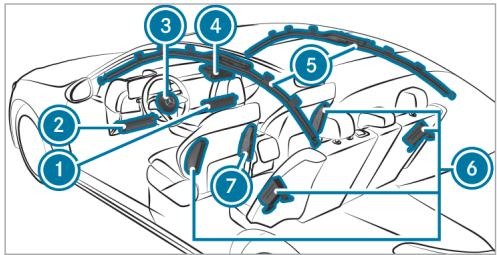

请遵守"触发情形概述"中的信息第52页)。

# 有关驾驶员座椅靠背内中间气囊的信息

触发时，中间气囊在前排座椅之间展开。请勿在中间气囊触发区域内存放任何物品。

请遵守关于装载车辆的注意事项

第114页)。

$\textcircled{6}$ 前排乘客膝部气囊

$\textcircled{6}$ 驾驶员膝部气囊

$\textcircled{6}$ 驾驶员前置气囊

$\textcircled{6}$ 前排乘客前置气囊

$\textcircled{6}$ 车窗气囊

$\textcircled{9}$ 侧部气囊

$\textcircled{4}$ 中间气囊

符号AIRBAG 指示气囊的安装位置。额外的箭头符号■表示某些气囊的安装位置。

# 要点简述

# 在车内安全运载儿童

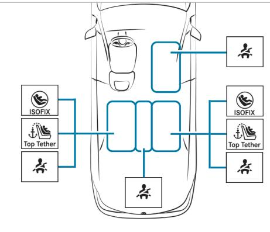

运载儿童时，请务必遵守以下说明：

·切勿将儿童单独留在车内无人看管第59页)。

·使用合适且经梅赛德斯-奔驰认可的儿童约束系统将年龄 小于12岁或身高不超过1.50 米的儿童正确固定在座椅上（见上图） (一第64页)，将婴幼儿固定在后向儿童约束系统中。  
·请遵守儿童约束系统制造商的安装说明。

# 后排左侧/右侧座椅 (首选座椅)

首选固定装置：

ISOFIX 固定架 第67页)

同时请安装顶部系链（Top Tether）（如有） 第71页)。

备用固定装置：

车辆安全带 第72页)

如果儿童约束系统制造商建议，还应安装顶部系链（Top Tether）  
第71页)。

通用类别中的以下儿童约束系统已获得认可：U、UF、IUF。请参见其他备选装置的使用说明 $(  $ 第67页)。

# 前排乘客座椅

固定装置：

车辆安全带 第72页)

确保遵守：

·如果前排乘客座椅被占用，请确保前排乘客前置气囊的状态对于当前情况而言是正确的 第47页)。

通用类别中的以下儿童约束系统已获得认可：U(")、UF。请参见其他备选装置的使用说明 第68页)。

(\*)后向儿童约束系统仅与气囊自动停用系统结合使用

# 后排中间座椅

固定装置：

车辆安全带 第72页)

通用类别中的以下安全带固定式儿童约束系统已获得认可：U、UF。请参见其他备选装置的使用说明 第68页)。

# 重要安全注意事项

# 基本信息

# 时刻警醒

请牢记，未将儿童正确固定在儿童约束系统中可能造成严重后果。每次行车前，务必保持警醒并小心固定好儿童。

行车时切勿让婴儿或儿童坐在其他乘员的腿上。

为加强对未满12周岁或身高低于1.50米儿童的保护，梅赛德斯-奔驰强烈建议您遵守以下说明：

·请务必将儿童安置在适用于本梅赛德斯-奔驰车辆的儿童约束系统中。  
·儿童约束系统必须符合儿童的年龄、体重和身高。  
·车辆座椅必须适用于要安装的儿童约束系统。ISOFIX 固定架： 第67页)使用车辆安全带固定： 第68页)

事故统计表明将儿童约束系统安置在后排座椅上通常比安置在前排座椅上更为安全。因此，梅赛德斯-奔驰强烈建议您将儿童约束系统安装至后排座椅。

# 通用术语-儿童约束系统

本使用说明书（用户手册）中采用儿童约束系统这一通用术语。儿童约束系统是指诸如以下装置：

·婴儿汽车座椅  
·后向儿童座椅  
，前向儿童座椅  
：儿童辅助座椅－梅赛德斯-奔驰建议使用配有座椅靠背和安全带导向装置的儿童辅助座椅。

# 请遵守法律和法规要求

在车上使用儿童约束系统时，务必遵守法规要求。

# A警告

儿童约束系统的安装和使用除须遵守本手册中的技术性说明之外，请务必遵守当地法律法规的要求。本手册相关内容适用于未就儿童约束系统的安装和使用做出特别规定的地区。在任何已就儿童约束系统的安装和使用做出特别规定的地区，如本手册任何相关内容与该地区特别规定不一致的，以该地区的特别规定为准。

# 车内的儿童约束系统固定装置

请仅使用以下儿童约束系统固定装置：

·ISOFIX 固定架  
·车辆安全带系统  
·顶部系链（Top Tether）固定装置

使用 ISOFIX/LATCH儿童约束系统的集成式安全带固定儿童时，务必遵守儿童和儿童约束系统的允许总质量 第70页)。

# 重要警告标签

# 务必正确安装儿童约束系统

警告由于未正确安装儿童约束系统而造成的伤害或死亡风险

此时儿童无法得到预期的保护或防护效果。

请务必遵守儿童约束系统制造商的安装说明及其正确使用说明。  
确保儿童约束系统的整个基座始终贴合在座椅的坐面上。  
切勿在儿童约束系统下面或后面放置物品（座垫等）。  
务必仅将儿童约束系统与专门为其设计的原厂座椅罩配合使用。  
务必使用原装座椅罩更换受损的座椅罩。

·请始终遵守车辆特定的信息。

将ISOFIX/LATCH儿童约束系统安装到后排座椅上 第70页)使用安全带固定儿童约束系统第72页)。

·请遵守车内和儿童约束系统上的警告标签。

A 警告车内儿童约束系统未固定导致的受伤或死亡风险

如果儿童约束系统安装不正确或未固定牢固，其可能会脱落。  
这样，就无法对儿童提供预期的保护或约束。  
未使用的儿童约束系统可能会脱落并撞到车辆乘员。

请始终遵守制造商关于儿童约束系统的安装说明及其正确使用方法。请始终正确安装儿童约束系统，即使不使用放在车内运输时也应正确安装。

# 请勿改动儿童约束系统

A 警告改动儿童约束系统造成的伤害风险

儿童约束系统无法再正常运作。这会增加伤害风险。

切勿改装儿童约束系统。

仅可安装经儿童约束系统制造商认可专用于本儿童约束系统的附件。

# 仅使用工作状态良好的儿童约束系统

A警告使用受损的儿童约束系统造成的伤害或死亡风险

在事故中承受压力的儿童约束系统或其固定装置可能无法发挥其预期保护功能。儿童可能无法得到必要的防护。

务必立即更换受损或作用于事故中的儿童约束系统。  
再次安装儿童约束系统前，请到具有资质的专业服务中心检查儿童防护装置的固定装置。

# 避免太阳直射

警告儿童座椅受阳光直射时造成的烫伤凤险

如果儿童约束系统受阳光直射或受热，则

其部件可能升温。

儿童可能被这些部件烫伤，尤其是儿童约束系统上的金属部件。

务必确保儿童约束系统未受阳光直射。请用毯子等保护儿童约束系统。如果儿童约束系统受阳光直射，则待其冷却后，再将儿童安置其中。切勿将儿童单独留在车内无人看管。

# 停车或驻车时请遵守

A 警告处在车内极高或极低温度下造成的致命伤害风险

如果人员（尤其是儿童）长时间暴露于高温或寒冷环境中，则存在严重伤害甚至死亡的风险。

切勿将人员（尤其是儿童）单独留在车内无人看管。

警告儿童单独留在车内无人看管造成的事故-及伤害风险

将儿童留在车内无人看管时，他们可能尤其会：

·开启车门，从而危及他人或其他道路使用者。·走出车外，被来往车辆撞伤。·操作车辆设备并被卡住等。

此外，儿童还可能会进行如下操作，从而使车辆移动：

·解除驻车制动。  
·切换行驶档位。  
·启动车辆。

切勿将儿童单独留在车内无人看管。离开车辆时，务必随身携带钥匙并锁止车辆。将钥匙放在儿童接触不到的地方。

# 车内警告标签概述

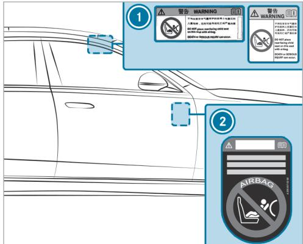

$\textcircled{8}$ 前排乘客前置气囊警告（前排乘客遮阳板上） 第62页)

$\textcircled{6}$ 未配备前排乘客前置气囊自动停用警告系统的车辆（前排乘客侧车门打开时可见）第63页)

# 有关前排乘客座椅上的后向和前向儿童约束系统的注意事项

警告 前排乘客前置气囊启用时使用后向儿童约束系统造成的伤害或死亡风险

如果您使用前排乘客座椅上的后向儿童约束系统保护儿童，但乘客前置气囊停用指示灯（PASSENGERAIRBAGOFF）没有点亮。则前排乘客前置气囊在遭遇事故时可能会触发。

儿童可能会被气囊撞到。

务必确保前排乘客前置气囊停用。乘客前置气囊停用（PASSENGERAIRBAG OFF）指示灯必须亮起。任何情况下，不得在前置气囊处于启用状态的座椅上使用后向儿童约束系统，否则可能导致死亡或严重伤害。

请注意后向和前向儿童约束系统的特定说明第69页)。

如果完全有必要将儿童约束系统安装到前排乘客座椅上，请务必遵守以下信息：

·有关前排乘客前置气囊自动停用系统的注意事项 第49页)。  
）如果在前排乘客座椅上使用后向儿童约束系统，则前排乘客前置气囊必须始终停用。此情况仅适用于乘客前置气囊停用（PASSENGERAIRBAGOFF）指示灯持续亮起时 第47页)。当乘客前置气囊停用（PASSENGERAIRBAGOFF）指示灯未点亮时，前排乘客前置气囊启用。前排乘客前置气囊可能会在事故中展开。在这种情况下，切勿使用后向儿童约束系统。

# 有关前排乘客前置气囊自动停用系统的信息

如果前排乘客座椅被占用，请在行车前和行车过程中确保前排乘客前置气囊的状态对于当前情况而言是正确的。

# A警告 座椅表面和儿童约束系统之间的物体导致受伤或死亡的风险

座椅表面和儿童约束系统之间的物体会干扰前排乘客前置气囊自动停用系统的功能。

请勿在座椅表面和儿童约束系统之间放置任何物体。  
确保儿童约束系统的整个基座贴合在前排乘客座椅的座椅表面上。  
前向儿童约束系统的靠背必须尽可能贴合在前排乘客座椅的座椅靠背上。务必遵守儿童约束系统制造商的安装说明。

在前排乘客座椅上安装儿童约束系统时，请遵守特定车辆信息 第62页)。

# 前排乘客座椅上的后向儿童约束系统

如果在前排乘客座椅上安装后向儿童约束系统，则前排乘客前置气囊必须停用。指示灯PASSENGER AIR BAG OFF 必须持续亮起第47页)。

！ 警告前排乘客前置气囊启用时使用后向儿童约束系统造成的伤害或死亡风险

如果您将儿童安置在前排乘客座椅上的后向儿童约束系统中且乘客前置气囊停用（PASSENGERAIRBAGOFF）指示灯熄灭，则前排乘客前置气囊在遭遇事故时可能会触发。

儿童可能会被气囊撞到。

务必确保前排乘客前置气囊停用。乘客前置气囊停用（PASSENGERAIRBAG OFF）指示灯必须亮起。任何情况下，不得在前置气囊处于启用状态的座椅上使用后向儿童约束系统，否则可能导致死亡或严重伤害。

$\textcircled{ i}$ 根据儿童约束系统和儿童身高的不同，前排乘客前置气囊会启用。指示灯PASSENGER AIR BAG OFF 不亮起。前排乘客前置气囊可能在事故中触发。如果前排乘客前置气囊处于此状态，则不得在前排乘客座椅上安装后向儿童约束系统。

而是将后向儿童约束系统安装在合适的后排座椅上。

# 前排乘客座椅上的前向儿童约束系统

如果在前排乘客座椅上安装前向儿童约束系统，则前排乘客前置气囊可能会自动启用或停用。前排乘客前置气囊的状态取决于儿童约束系统和儿童身高。

指示灯 PASSENGER AIR BAG OFF持续亮起或不亮起 第 47页)。务必遵守以下信息。

A警告未正确安装儿童约束系统造成的伤害或死亡风险

如果您把儿童固定在前排乘客座位上的前向儿童约束系统中，且前排乘客座椅的位置与仪表台过近，发生事故时，该儿童可能：

例如，在乘客前置气囊停用（PASSENGERAIRBAGOFF）指示灯点亮的情况下与车内零部件接触。·在乘客前置气囊停用（PASSENGERAIRBAGOFF）指示灯没有点亮的情况下被气囊击打。

始终尽可能向后移动前排乘客座椅。进行此操作时，请务必确保肩部安全带带身从车上的安全带出口正确导向儿童约束系统上的肩部安全带导向装置。肩部安全带带身必须从安全带出□沿底部导向前方。如有必要，请相应地调节安全带出口和前排乘客座椅。

请务必遵守儿童约束系统制造商的安装说明。

此外，请务必注意以下其他相关事项：

·前排乘客前置气囊自动停用系统功能第47页)·适当的儿童约束系统安装位置

# 有关未配备前排乘客前置气囊自动停用系统的车辆的注意事项

在未配备前排乘客前置气囊自动停用系统的车辆上，驾驶室前排乘客侧侧面上贴有专用标签 第61页)。

请确保遵守以下信息：

·请勿将后向儿童约束系统安装到前排乘客座椅上  
·务必将后向儿童约束系统安装在适当的后排座椅上  
·有关前排乘客座椅上的后向和前向儿童约束系统的注意事项 第62页)

# 用于运载儿童的合适儿童约束系统

# 有关后向儿童约束系统优点的信息

仅使用合适的后向儿童约束系统运载婴幼儿。最好也使用合适的后向儿童约束系统运载婴幼儿。这种情况下，儿童采用与行驶方向相反的方向乘坐并面朝后方。

婴幼儿的颈部肌肉相对较弱，这与其头部尺寸和重量有关。如果将儿童置于后向儿童约束系统中，则在发生事故时可降低颈椎受伤的风险。

# 儿童约束系统认可类别

仅允许在车上使用获得强制性产品认证证书和标注强制性产品认证标志的儿童约束系统。

# 儿童约束系统标识

例如，以下信息可在儿童约束系统的认可标签上找到：

·认可类别  
·儿童重量分组  
·授权编号  
·儿童约束系统尺寸等级

# GB 27887下的认可类别

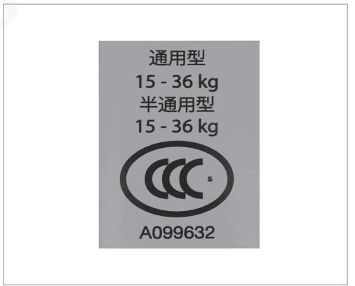

认可标签示例

·通用：“通用"类别儿童约束系统经梅赛德斯-奔驰认可适合安装在车辆中。根据座椅安装儿童约束系统的适合性概述，可在贴有U、UF或IUF标签的座椅上使用这类儿童约束系统。

IUF 标识指"通用"类别中的 ISOFIX/LATCH儿童约束系统。这类儿童约束系统必须使用顶部系链（Top Tether）或支撑点进行额外固定。

·半通用：仅当本车和车辆座椅列在儿童约束系统制造商的车型列表中时，才可使用“半通用"类儿童约束系统。  
·针对特定车型：仅当本车和车辆座椅列在儿童约束系统制造商的车型列表中时，才可使用“针对特定车型"类儿童约束系统。

# 请注意车辆座椅的适合性

·座椅安装 ISOFIX/LATCH儿童约束系统的适合性 第67页)  
·座椅安装安全带固定式儿童约束系统的适合性 第68页)

# 推荐使用的儿童约束系统概述

$\textcircled{ i}$ 有关正确的儿童约束系统的详细信息，请咨询具有资质的专业服务中心。梅赛德斯-奔驰建议您到梅赛德斯-奔驰授权服务中心进行此项工作。

使用 ISOFIX安装

重量等级 ${ 0 + }$ （最多13千克，最大约15个月）

重量等级1（9千克至18千克，约9个月至4岁）  

<table><tr><td rowspan=1 colspan=1>类型1</td><td rowspan=1 colspan=1>BABY SAFE plus（包括基座）</td></tr><tr><td rowspan=1 colspan=1>尺寸类别</td><td rowspan=1 colspan=1>E</td></tr><tr><td rowspan=1 colspan=1>许可号</td><td rowspan=1 colspan=1>E1 04 301 146</td></tr><tr><td rowspan=1 colspan=1>订货号2</td><td rowspan=1 colspan=1>B6 6868224</td></tr><tr><td rowspan=1 colspan=1>1制造商：Britax Romer</td><td rowspan=1 colspan=1>2带颜色代码9H95</td></tr></table>

<table><tr><td rowspan=1 colspan=1>类型1</td><td rowspan=1 colspan=1>DUO PLUS</td></tr><tr><td rowspan=1 colspan=1>尺寸类别</td><td rowspan=1 colspan=1>B1</td></tr><tr><td rowspan=1 colspan=1>许可号</td><td rowspan=1 colspan=1>E1 04 301 133</td></tr><tr><td rowspan=1 colspan=1>订货号2</td><td rowspan=1 colspan=1>A 000 970 43 02</td></tr><tr><td rowspan=1 colspan=1>1制造商：Britax Romer</td><td rowspan=1 colspan=1>2带颜色代码9H95</td></tr></table>

GB 27887儿童约束系统（重量9千克至18千克，高度61厘米至105厘米，年龄约3个月至4岁)

<table><tr><td rowspan=1 colspan=1>类型1</td><td rowspan=1 colspan=1>DualFix 3 i-Size²</td></tr><tr><td rowspan=1 colspan=1>尺寸类别</td><td rowspan=1 colspan=1>F2X（前向）R2（后向）</td></tr><tr><td rowspan=1 colspan=1>许可号</td><td rowspan=1 colspan=1>2020012207358282</td></tr><tr><td rowspan=1 colspan=1>订货号</td><td rowspan=1 colspan=1>A 000 970 9402</td></tr><tr><td rowspan=1 colspan=1>1制造商：Britax Romer</td><td rowspan=1 colspan=1>2对三岁儿童的建议：后向躺卧姿势</td></tr></table>

重量等级1（9千克至18千克，约9个月至4岁)

<table><tr><td rowspan=1 colspan=1>类型1</td><td rowspan=1 colspan=1> DualFix2</td></tr><tr><td rowspan=1 colspan=1>尺寸类别</td><td rowspan=1 colspan=1>F2X（前向）R2（后向）</td></tr><tr><td rowspan=1 colspan=1>1制造商：Britax Romer</td><td rowspan=1 colspan=1>2对三岁儿童的建议：后向躺卧姿势</td></tr></table>

重量等级I/I（15千克至36千克，年龄约3岁至12岁）（KIDFIX)  

<table><tr><td>类型1</td><td> KIDFIX</td></tr><tr><td>1制造商：Britax Romer</td><td></td></tr><tr><td></td><td></td></tr></table>

GB 27887儿童约束系统（重量15千克至36千克，高度100厘米至150 厘米，年龄约3 岁半至12岁）（KIDFIXMi-Size）  

<table><tr><td rowspan=1 colspan=1>类型1</td><td rowspan=1 colspan=1> KIDFIX M i-Size</td></tr><tr><td rowspan=1 colspan=1>尺寸类别</td><td rowspan=1 colspan=1>B2</td></tr><tr><td rowspan=1 colspan=1>许可号</td><td rowspan=1 colspan=1>2021012207406974</td></tr><tr><td rowspan=1 colspan=1>订货号</td><td rowspan=1 colspan=1>A 000 970 97 02</td></tr><tr><td rowspan=1 colspan=1>1制造商：Britax Romer</td><td rowspan=1 colspan=1></td></tr></table>

GB 27887儿童约束系统（重量15千克至36千克，高度100 厘米至150 厘米，年龄约3 岁半至12岁）（AMG KIDFIX Mi-Size）  

<table><tr><td rowspan=1 colspan=1>类型1</td><td rowspan=1 colspan=1>AMG KIDFIX M i-Size</td></tr><tr><td rowspan=1 colspan=1>尺寸类别</td><td rowspan=1 colspan=1>B2</td></tr><tr><td rowspan=1 colspan=1>许可号</td><td rowspan=1 colspan=1>2021012207406974</td></tr><tr><td rowspan=1 colspan=1>订货号</td><td rowspan=1 colspan=1>A 000 970 98 02</td></tr><tr><td rowspan=1 colspan=1>1制造商：Britax Romer</td><td rowspan=1 colspan=1></td></tr></table>

# 使用车辆座椅安全带安装

重量等级0（最多10千克，最大约6个月）和重量等级 $0 +$ （最多13千克，最大约15个月）

<table><tr><td rowspan=1 colspan=1>类型1</td><td rowspan=1 colspan=1>BABY SAFE PLUS II</td></tr><tr><td rowspan=1 colspan=1>许可号</td><td rowspan=1 colspan=1>E1 04 301 146</td></tr><tr><td rowspan=1 colspan=1>订货号2</td><td rowspan=1 colspan=1>A 000 970 38 02</td></tr><tr><td rowspan=1 colspan=1>1制造商：Britax Romer</td><td rowspan=1 colspan=1>2带颜色代码9H95</td></tr></table>

GB 27887儿童约束系统（重量最多13千克，高度40厘米至83厘米，年龄最大约15个月）  

<table><tr><td rowspan=1 colspan=1>类型1</td><td rowspan=1 colspan=1>Baby Safe 3 i-Size</td></tr><tr><td rowspan=1 colspan=1>尺寸类别</td><td rowspan=1 colspan=1>R2</td></tr><tr><td rowspan=1 colspan=1>许可号</td><td rowspan=1 colspan=1>2021012207415277</td></tr><tr><td rowspan=1 colspan=1>订货号</td><td rowspan=1 colspan=1>A 000 970 99 02</td></tr><tr><td rowspan=1 colspan=1>1制造商：Britax Romer</td><td rowspan=1 colspan=1></td></tr></table>

重量等级1（9千克至18千克，约9个月至4岁）  

<table><tr><td rowspan=1 colspan=1>类型1</td><td rowspan=1 colspan=1>DUO PLUS</td></tr><tr><td rowspan=1 colspan=1>许可号</td><td rowspan=1 colspan=1>E1 04 301133</td></tr><tr><td rowspan=1 colspan=1>订货号2</td><td rowspan=1 colspan=1>A 000 970 43 02</td></tr><tr><td rowspan=1 colspan=1>1制造商：Britax Romer</td><td rowspan=1 colspan=1>2带颜色代码9H95</td></tr></table>

重量等级I/（15千克至36千克，年龄约3岁至12岁）（KIDFIX)  

<table><tr><td>类型1</td><td>KIDFIX</td></tr><tr><td>1制造商：Britax Romer</td><td></td></tr></table>

重量等级I/（15千克至36千克，约3岁半至12岁)

<table><tr><td rowspan=1 colspan=1>类型1</td><td rowspan=1 colspan=1> KIDFIX XP</td></tr><tr><td rowspan=1 colspan=1>许可号</td><td rowspan=1 colspan=1>E1 04 301 304</td></tr><tr><td rowspan=1 colspan=1>订货号2</td><td rowspan=1 colspan=1>A 000 97049 02</td></tr></table>

<table><tr><td rowspan=1 colspan=1>类型1</td><td rowspan=1 colspan=1>AMG KIDFIX XP</td></tr><tr><td rowspan=1 colspan=1>许可号</td><td rowspan=1 colspan=1>E1 04 301 304</td></tr><tr><td rowspan=1 colspan=1>订货号2</td><td rowspan=1 colspan=1>A 000 970 33 02</td></tr><tr><td rowspan=1 colspan=1>1制造商：Britax Romer</td><td rowspan=1 colspan=1>2带颜色代码9H95</td></tr></table>

GB 27887儿童约束系统（重量15千克至36千克，高度100 厘米至150厘米，年龄约3 岁半至12岁）  

<table><tr><td rowspan=1 colspan=1>类型1</td><td rowspan=1 colspan=1>KIDFIX M i-Size</td></tr><tr><td rowspan=1 colspan=1>尺寸类别</td><td rowspan=1 colspan=1>B2</td></tr><tr><td rowspan=1 colspan=1>许可号</td><td rowspan=1 colspan=1>2020012207358282</td></tr><tr><td rowspan=1 colspan=1>订货号</td><td rowspan=1 colspan=1>A 000 970 97 02</td></tr><tr><td rowspan=1 colspan=1>1制造商：Britax Romer</td><td rowspan=1 colspan=1></td></tr><tr><td rowspan=1 colspan=1>类型1</td><td rowspan=1 colspan=1> AMG KIDFIX M i-Size</td></tr><tr><td rowspan=1 colspan=1>尺寸类别</td><td rowspan=1 colspan=1>B2</td></tr><tr><td rowspan=1 colspan=1>许可号</td><td rowspan=1 colspan=1>2020012207358282</td></tr><tr><td rowspan=1 colspan=1>订货号</td><td rowspan=1 colspan=1>A 000 97098 02</td></tr><tr><td rowspan=1 colspan=1>1制造商：Britax Romer</td><td rowspan=1 colspan=1></td></tr></table>

# 适用于安装儿童约束系统的座椅

# 座椅安装ISOFIX/LATCH儿童约束系统的适合性概述

ISOFIX是一种适用于专用儿童约束系统的标准固定装置。

此标识表示座椅适合安装符合 GB27887标准的ISOFIX儿童约束系统第64页)°

仅可安装以下ISOFIX表中经梅赛德斯-奔驰认可符合GB27887标准的ISOFIX儿童约束系统。

以下 ISOFIX表格的说明  

<table><tr><td rowspan=1 colspan=1>X</td><td rowspan=1 colspan=1>不适用于此重量分组和/或尺寸级别的ISOFIX儿童约束系统。</td></tr><tr><td rowspan=1 colspan=1>IL</td><td rowspan=1 colspan=1>根据&quot;推荐使用的儿童约束系统概述&quot;中的列表或如果本车和座椅列在儿童约束系统制造商的车型列表中，则适用于ISOFIX儿童约束系统。</td></tr><tr><td rowspan=1 colspan=1>IUF</td><td rowspan=1 colspan=1>适用于此重量分组的&quot;通用&quot;类别前向ISOFIX儿童约束系统。</td></tr></table>

手提式婴儿床  

<table><tr><td>尺寸等级- 装备</td><td>后排左侧/右侧座椅</td></tr><tr><td>F-ISO/L1</td><td>X</td></tr><tr><td>G - ISO/L2</td><td>X</td></tr></table>

重量分组0（最多10千克，年龄最大约6个月）  

<table><tr><td>尺寸等级- 装备</td><td>后排左侧/右侧座椅</td></tr><tr><td>E-ISO/R1</td><td></td></tr></table>

重量分组 $^ { 0 + }$ （最多13千克，年龄最大约15个月）  

<table><tr><td>尺寸等级- 装备</td><td>后排左侧/右侧座椅</td></tr><tr><td>E-ISO/R1</td><td>IL</td></tr><tr><td>D -ISO/R2、 ISO/R2X</td><td>IL</td></tr></table>

重量分组1（9-18千克，年龄约9个月至4岁）  

<table><tr><td>C -ISO/R3</td><td>IL(1)</td></tr><tr><td></td><td>（1）如果使用尺寸类别（ISO/R3）的儿童约束系统，请将前</td></tr><tr><td></td><td>排座椅移至最高位置。确保前排座椅靠背不会靠在儿童约束</td></tr><tr><td>系统上。</td><td></td></tr></table>

<table><tr><td rowspan=1 colspan=2>尺寸等级-        后排左侧/右侧座椅装备</td></tr><tr><td rowspan=1 colspan=1>D -ISO/R2、ISO/R2X</td><td rowspan=1 colspan=1>IL</td></tr><tr><td rowspan=1 colspan=1>C -ISO/R3</td><td rowspan=1 colspan=1>IL(1)</td></tr><tr><td rowspan=1 colspan=1>B-ISO/F2</td><td rowspan=1 colspan=1>IUF</td></tr><tr><td rowspan=1 colspan=1>B1 -ISO/F2X</td><td rowspan=1 colspan=1>IUF</td></tr><tr><td rowspan=1 colspan=1>A -ISO/F3</td><td rowspan=1 colspan=1>IUF</td></tr><tr><td rowspan=1 colspan=2>（1）如果使用尺寸类别（ISO/R3）的儿童约束系统，请将前排座椅移至最高位置。确保前排座椅靠背不会靠在儿童约束系统上。</td></tr></table>

# 座椅安装安全带固定式儿童约束系统的适合性概述

# 下表的说明

后排座椅  

<table><tr><td rowspan=1 colspan=1>U</td><td rowspan=1 colspan=1>适用于此重量等级的&quot;通用&quot;类别儿童约束系统。</td></tr><tr><td rowspan=1 colspan=1>X</td><td rowspan=1 colspan=1>不适用于此重量等级的儿童。</td></tr><tr><td rowspan=1 colspan=1></td><td rowspan=1 colspan=1>根据&quot;推荐使用的儿童约束系统&quot;中的列表或如果本车和座椅列在儿童约束系统制造商的车型列表中，则适用于半通用类别儿童约束系统。</td></tr><tr><td rowspan=1 colspan=1>UF</td><td rowspan=1 colspan=1>适用于此重量等级的&quot;通用&quot;类别前向儿童约束系统。</td></tr></table>

<table><tr><td colspan="1" rowspan="1">重量等级0：最多10千克</td><td colspan="1" rowspan="1"></td></tr><tr><td colspan="1" rowspan="1">后排左侧/右侧座椅</td><td colspan="1" rowspan="1">U、L</td></tr><tr><td colspan="1" rowspan="1">后排中间座椅1</td><td colspan="1" rowspan="1">U、L</td></tr><tr><td colspan="1" rowspan="1">重量等级0+：最多13千克</td><td colspan="1" rowspan="1"></td></tr><tr><td colspan="1" rowspan="1">后排左侧/右侧座椅</td><td colspan="1" rowspan="1">U、L</td></tr><tr><td colspan="1" rowspan="1">后排中间座椅1</td><td colspan="1" rowspan="1">U、L</td></tr><tr><td colspan="1" rowspan="1">重量等级I：9千克至18千克</td><td colspan="1" rowspan="1"></td></tr><tr><td colspan="1" rowspan="1">后排左侧/右侧座椅</td><td colspan="1" rowspan="1">U、L</td></tr><tr><td colspan="1" rowspan="1">后排中间座椅1</td><td colspan="1" rowspan="1">U、L</td></tr><tr><td colspan="1" rowspan="1">重量等级I：15千克至25千克</td><td colspan="1" rowspan="1"></td></tr><tr><td colspan="1" rowspan="1">后排左侧/右侧座椅</td><td colspan="1" rowspan="1">U、L</td></tr><tr><td colspan="1" rowspan="1">后排中间座椅1</td><td colspan="1" rowspan="1">U、L</td></tr><tr><td colspan="1" rowspan="1">重量等级：22千克至36千克</td><td colspan="1" rowspan="1"></td></tr><tr><td colspan="1" rowspan="1">后排左侧/右侧座椅</td><td colspan="1" rowspan="1">U、L</td></tr><tr><td colspan="1" rowspan="1">后排中间座椅1</td><td colspan="1" rowspan="1">U、L</td></tr><tr><td colspan="2" rowspan="1">1带支承腿的儿童约束系统不适用于此座椅。</td></tr></table>

# 有关前排乘客座椅上的儿童约束系统的注意事项

·如果完全有必要将儿童约束系统安装到前排乘客座椅上，请务必遵守有关前排乘客

座椅上儿童约束系统的信息

# (→第62页)。

·请注意后向和前向儿童约束系统的特定说明。如果前排乘客座椅被占用，请在行车前和行车过程中确保前排乘客前置气囊的状态对于当前情况而言是正确的第47页)。

前排乘客座椅  

<table><tr><td rowspan=1 colspan=1>重量等级0：最多10千克</td><td rowspan=1 colspan=1></td></tr><tr><td rowspan=1 colspan=1>前排乘客前置气囊已启用1</td><td rowspan=1 colspan=1>X</td></tr><tr><td rowspan=1 colspan=1>前排乘客前置气囊已停用1、2</td><td rowspan=1 colspan=1>U、L</td></tr><tr><td rowspan=1 colspan=1>重量等级0+：最多13千克</td><td rowspan=1 colspan=1></td></tr><tr><td rowspan=1 colspan=1>前排乘客前置气囊已启用1</td><td rowspan=1 colspan=1>×</td></tr><tr><td rowspan=1 colspan=1>前排乘客前置气囊已停用1、2</td><td rowspan=1 colspan=1>U、L</td></tr><tr><td rowspan=1 colspan=1>重量等级I：9千克至18千克</td><td rowspan=1 colspan=1></td></tr><tr><td rowspan=1 colspan=1>前排乘客前置气囊已启用1</td><td rowspan=1 colspan=1>UF、L</td></tr><tr><td rowspan=1 colspan=1>前排乘客前置气囊已停用1、2</td><td rowspan=1 colspan=1>U、L</td></tr></table>

<table><tr><td rowspan=1 colspan=1>重量等级I：15千克至25千克</td><td rowspan=1 colspan=1></td></tr><tr><td rowspan=1 colspan=1>前排乘客前置气囊已启用1</td><td rowspan=1 colspan=1>UF、L</td></tr><tr><td rowspan=1 colspan=1>前排乘客前置气囊已停用1、2</td><td rowspan=1 colspan=1>U、L</td></tr><tr><td rowspan=1 colspan=1>重量等级：22千克至36千克</td><td rowspan=1 colspan=1></td></tr><tr><td rowspan=1 colspan=1>前排乘客前置气囊已启用1</td><td rowspan=1 colspan=1>UF、L</td></tr><tr><td rowspan=1 colspan=1>前排乘客前置气囊已停用1、2</td><td rowspan=1 colspan=1>U、L</td></tr><tr><td rowspan=1 colspan=2>1调节座垫倾斜角度，使座垫前边缘处于最高位置且座垫后边缘处于最低位置。</td></tr><tr><td rowspan=1 colspan=2>2车辆配备前排乘客前置气囊自动停用系统。乘客前置气囊停用（PASSENGER AIRBAG OFF）指示灯必须亮起。</td></tr></table>

# 固定儿童约束系统

# 正确调节座椅

将儿童约束系统安装到后排左侧或右侧座椅上时，请务必遵守以下说明：

确保儿童双脚未接触到前排座椅。必要时，将前排座椅稍稍向前移动。

如果儿童约束系统的头枕安装在车辆中时无法完全伸展，将限制某些儿童约束系统的最大尺寸设定。请遵守儿童约束系统制造商的安装说明。

$\textcircled{ i}$ 如果头枕完全伸展并锁止到位时接触到车顶，将不会造成任何使用限制。

# 安装安全带固定式儿童约束系统时，还请遵守以下说明：

在后排座椅上使用后向儿童约束系统时：调节前排座椅，以防其接触到儿童约束系统。  
使用配备集成式儿童座椅安全带的前向儿童约束系统时：调节相应座椅的头枕，以防其向前推压儿童约束系统。如有必要，可卸下相应的头枕。此外，儿童约束系统的靠背必须尽可能平贴在车辆座椅靠背上。拆下儿童约束系统后，请立即装回车辆头枕并正确调节。  
前向儿童约束系统的靠背必须尽可能贴合在后排座椅靠背上。  
儿童约束系统不得在车顶和座垫之间承受压力和/或朝错误方向安装。如果可能，相应地调节座垫倾斜度。

调节车辆头枕，以免儿童约束系统承受来自头枕的压力。确保儿童双脚未接触到前排座椅。必要时，将前排座椅稍稍向前移动。

根据车辆配置，将安全带固定式儿童约束系统安装到前排乘客座椅上时，请务必遵守以下说明：

请遵守有关前排乘客座椅上的后向和前向儿童约束系统的注意事项 第62页)。使用配备集成式儿童座椅安全带的前向儿童约束系统时：尽可能拆下前排乘客座椅的头枕。拆下儿童约束系统后，请立即装回头枕并正确调节。  
前向儿童约束系统的靠背必须尽可能贴合在前排乘客座椅的座椅靠背上。  
儿童约束系统不得在车顶和座垫之间承受压力和/或朝错误方向安装。  
调节车辆头枕，以免儿童约束系统承受来自头枕的压力。  
切勿在儿童约束系统下面或后面放置物品（座垫等）。

尽可能将前排乘客座椅设定至最靠后并将座椅移动至最高的位置。请务必确保肩部安全带带身从车上的安全带出口正确导向儿童约束系统上的肩部安全带导向装置。肩部安全带带身必须从安全带出口导向前方，并尽可能向下导至儿童约束系统。

完全收回座垫长度调节装置。

调节座垫倾斜角度，使座垫前边缘处于最高位置且座垫后边缘处于最低位置。

将座椅靠背设定至最垂直的位置。

# 安装 ISOFIX/LATCH儿童约束系统

！ 警告如果超出了儿童和儿童约束系统的最大允许总质量会造成伤害或死亡风险。

例如，ISOFIX儿童座椅固定装置可能承受负荷过大，且在事故中可能无法正确固定儿童。

如果儿童被固定在配有集成式安全带的ISOFIX儿童约束系统中，儿童及儿童约束系统的总质量不得超过33千克。

务必遵守有关儿童体重的说明：

·所用儿童约束系统制造商提供的安装说明和使用说明书（用户手册）·儿童约束系统上的标签（如有）

定期检查并确保遵守儿童和儿童约束系统的允许总重量。

安装儿童约束系统时，还请遵守以下要求：

务必遵守使用区域和座椅安装儿童约束系统的适合性概述。

LATCH 型（ISOFIX）固定架 第67页)

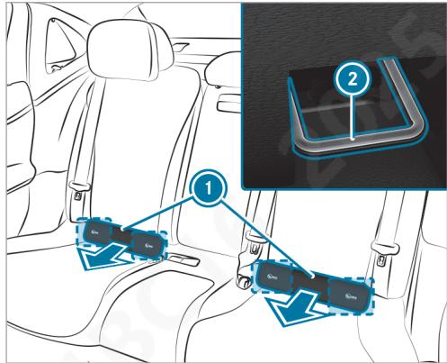

每次行车前，务必确保 ISOFIX/LATCH儿童约束系统正确卡入车上的两个固定架中。

注意事项安装儿童约束系统时对中间座椅安全带造成的损坏

确保安全带未被夹住。

向上翻转保护软垫饰件 $\textcircled{8}$ 。  
将保护软垫饰件 $\textcircled{8}$ 背面上的支撑转动90°。  
保护软垫饰件 $\textcircled{8}$ 保持向上折叠。  
将ISOFIX/LATCH儿童约束系统安装至车内的两个固定架 $\textcircled{6}$ 。

# 固定顶部系链（Top Tether)

A警告安装儿童约束系统后调节座椅造成的伤害或死亡风险

配备电动调节式后排长座椅的车辆：

可能出现以下情况：

·顶部系链（Top Tether）固定带可能太松或太紧  
·儿童约束系统可能松动，位置不正确或损坏，不能提供预期的保护功能。请勿在安装儿童约束系统后调节座椅。

如果儿童约束系统配备顶部系链（TopTether）固定带：

顶部系链（Top Tether）可降低伤害风险。顶部系链（Top Tether）固定带有助于在使用ISOFIX固定的儿童约束系统与车辆之间实现辅助连接。

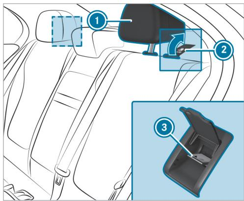

如有必要，向上滑动头枕 $\textcircled{6}$

第105页)。

折起顶部系链（Top Tether）固定装置 $\textcircled{6}$ 的护盖 $\textcircled{6}$ 。

使用顶部系链（Top Tether）安装ISOFIX/LATCH儿童约束系统。遵守儿童约束系统制造商的安装说明。

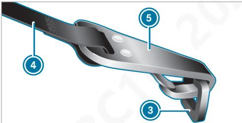

将顶部系链（Top Tether）固定带 $\textcircled{6}$ 从头枕 $\textcircled{8}$ 下方的两个头枕杆之间穿过。

将顶部系链（Top Tether）固定带 $\textcircled{8}$ 的顶部系链（Top Tether）卡钩钩入顶部系链（Top Tether）固定装置，注意不要扭曲。

拉紧顶部系链（Top Tether）固定带 $\textcircled{9}$ 遵守儿童约束系统制造商的安装说明。

折下顶部系链（Top Tether）固定装置 $\textcircled{6}$ 的护盖 $\textcircled{6}$ 。

如有必要，向下滑动头枕 $\textcircled{8}$ 第105页)。确保不会影响顶部系链（Top Tether）固定带的正确布置。

# 使用安全带固定儿童约束系统

对于"通用"或"半通用"类别的儿童约束系统，请确保其经梅赛德斯-奔驰认可适用于您的车辆座椅。

安装儿童约束系统。  
儿童约束系统的整个基座必须始终贴合在座椅表面上。

请务必确保肩部安全带带身从车上的安全带出口正确导向儿童约束系统上的肩部安全带导向装置。肩部安全带带身必须从安全带出口导向前方，并尽可能向下导至儿童约束系统。

安装在后排座椅上时：还要固定顶部系链（Top Tether）（如配备）（ 第71页)。

安装在前排乘客座椅上时：如有必要，请相应地调节安全带出口和前排乘客座椅。

# 儿童安全锁

# 启用/停用后车门儿童安全锁

A警告儿童单独留在车内无人看管造成 的事故及伤害风险

将儿童留在车内无人看管时，他们可能尤其会：

·开启车门，从而危及他人或其他道路使用者。  
·走出车外，被来往车辆撞伤。  
·操作车辆设备并被卡住等。

此外，儿童还可能会进行如下操作，从而使车辆移动：

·解除驻车制动。  
·切换行驶档位。  
·启动车辆。

切勿将儿童单独留在车内无人看管。离开车辆时，务必随身携带钥匙并锁止车辆。将钥匙放在儿童接触不到的地方。

警告 处在车内极高或极低温度下造成的致命伤害风险

如果人员（尤其是儿童）长时间暴露于高温或寒冷环境中，则存在严重伤害甚至死亡的风险。

切勿将人员（尤其是儿童）单独留在车内无人看管。

A警告儿童单独留在车内无人看管造成 的事故及伤害风险

如果车内载有儿童，他们尤其可能会：

·开启车门，从而危及他人或其他道路使用者。  
·走出车外，被来往车辆撞伤。  
·操作车辆设备并被卡住等。

车内载有儿童时，务必启用已安装的儿童安全锁。

切勿将儿童单独留在车内无人看管。离开车辆时，务必随身携带钥匙并锁止车辆。

后车门和后侧窗配有儿童安全锁。

后车门上的儿童安全锁单独锁止各车门。无法再从车内开启车门。

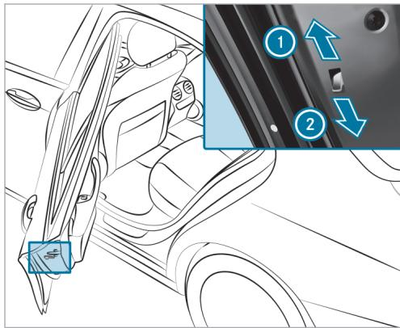

沿箭头 $\textcircled{6}$ （启用）或 $\textcircled{6}$ （停用）方向按下拉杆。

检查儿童安全锁的功能。

# 启用/停用后侧窗儿童安全锁

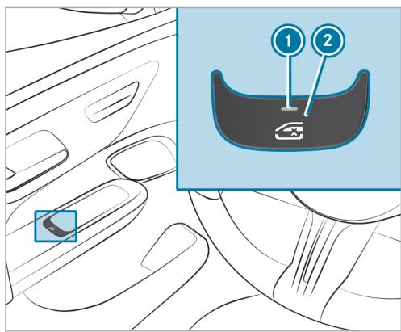

启用/停用：按下按钮 $\textcircled{6}$ 后侧窗可如下开启或关闭：

·指示灯 $\textcircled{8}$ 亮起：通过驾驶员侧车门上的开关  
·指示灯①熄灭：通过相应后车门或驾驶员侧车门上的开关

# 乘员存在识别

# 乘员存在识别功能

乘客存在识别可提醒您防止把后排儿童遗忘在车内。当后车门长时间打开并且系统判断车内有儿童且其可能会上下车时，该功能会自动启用和停用。

如果系统已自动启用，则车辆关闭时，驾驶员显示屏上会显示请勿遗漏任何人员或动物在车内信息。

此功能可在MBUX智能人机交互系统中永久停用(→第74页)。系统停用时，驾驶员显示屏上的指示灯亮起。

# 在MBUX智能人机交互系统中开启或关闭乘员存在识别

MBUX智能人机交互系统：

设定车辆

驾驶员及乘客保护

启用或停用此功能。

# 钥匙

# 钥匙功能概述

A警告儿童单独留在车内无人看管造成 的事故及伤害风险

如果将儿童单独留在车内无人看管，他们可能

·开启车门，从而危及他人或其他道路使用者。·走出车外，被来往车辆撞伤。·操作车辆设备并被卡住等。

此外，儿童还可能会进行如下操作，导致车辆移动：

·解除驻车制动。  
·切换变速箱档位。  
·启动车辆。

切勿将儿童单独留在车内无人看管。离开车辆时，务必随身携带钥匙并锁止车辆。

将钥匙放在儿童接触不到的地方。

这也适用于电子车钥匙。

注意事项磁场会损坏钥匙钥匙应远离强磁场。

$\textcircled{1}$ 根据车辆配置的不同，钥匙可能跟图示存在差异。

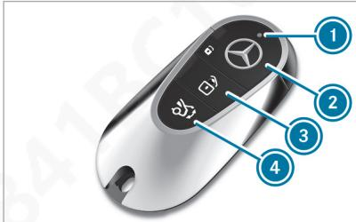

车钥匙$\textcircled{6}$ 指示灯$\textcircled{6}$ 锁止

$\textcircled{6}$ 解锁 (带有浮雕表面)

$\textcircled{9}$ 开启/关闭行李箱盖$\textcircled{1}$ 如果按下按钮或后指示灯 $\textcircled{8}$ 未亮起，则说明电池电量弱或电量可能耗尽。请尽快更换电池。

更换钥匙电池 第77页)。

钥匙可锁止和解锁以下部件：

·车门   
·加油口盖板   
·插座盖板(插电式混合动力车辆)   
·行李箱盖

如果在解锁后约40 秒钟内没有打开车门，则车辆将再次锁止。防盗保护再次启用。切勿将钥匙与电子设备或金属物品存放在一起。否则可能会影响钥匙的功能。

# 启用/停用声音锁止确认信号

MBUX智能人机交互系统：

设定车辆

车辆解锁/上锁

开启或关闭中控锁声音反馈。

# 更改解锁设定

钥匙可能配备的解锁功能：

·中央解锁  
·解锁驾驶员侧车门和加油口盖板  
·插电式混合动力车辆：解锁驾驶员侧车门和加油口盖板/插座盖板

在设定之间切换：同时按下按钮和①约6秒钟，直至指示灯闪烁两次。

如已选定驾驶员侧车门和加油口盖板解锁功能时的选项：

·中央解锁车辆：按下按钮两次。·配备无钥匙进入（KEYLESS-GO）的车辆：如果触摸驾驶员侧车门的车门拉手内表面，则仅驾驶员侧车门和加油口盖板解锁。

已选定驾驶员侧车门和加油口盖板/插座盖板解锁功能时的选项（插电式混合动力车辆）：

·中央解锁车辆：按下按钮「两次。·配备无钥匙进入（KEYLESS-GO）的车辆：如果触摸驾驶员侧车门的车门拉手内表面，则仅驾驶员侧车门和加油口盖板/插座盖板解锁。

# 停用钥匙功能

配备无钥匙进入（KEYLESS-GO）的车辆：如果您停用钥匙功能，则无钥匙进入  
（KEYLESS-GO）功能也会停用。使用该钥匙，无法再通过无钥匙进入（KEYLESS-GO）获得访问和驾驶权限。启用钥匙功能，使其所有功能再次可用。  
如果长时间闲置车辆或钥匙，则您也可停用钥匙功能以降低钥匙能耗。

按住钥匙按钮。

按住钥匙按钮后，立即连续快速按下钥匙按钮「两次。

钥匙上的指示灯短暂亮起一次，然后再次长亮。

$\textcircled{1}$ 您可选择以下方式重新启用钥匙：

·按下钥匙上的任意按钮。  
·用中央控制台储物箱中的钥匙启动车辆 第159页)。

# 取下/插入紧急钥匙

# 取出紧急钥匙

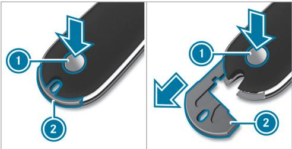

按下释放旋钮 $\textcircled{6}$ 紧急钥匙 $\textcircled{6}$ 被稍稍推出。完全取出紧急钥匙 $\textcircled{6}$

# 插入紧急钥匙

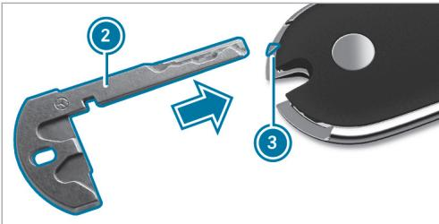

将紧急钥匙 $\textcircled{6}$ 插入标记处 $\textcircled{6}$ ，直至其卡入位。

$\textcircled{1}$ 您可使用紧急钥匙 $\textcircled{6}$ 将钥匙连接至钥匙环。

# 更换钥匙电池

# A 危险吞食电池导致的致命伤害风险

电池中含有毒性和腐蚀性物质。如果电池被吞食或以其他方式进入体内，两小时内可能就会造成严重的内部灼伤。

存在造成致命伤害的风险。

将电池放在儿童接触不到的地方。如果电池盒护盖和/或盖子未关紧，请停止使用钥匙并将其远离儿童存放。  
如果电池被吞食或以其他方式进入体内，请立即就医。

环保说明因电池处理不当造成的环境损害

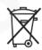

电池含有污染物。将其与家庭垃圾一起处理是违法的。

以对环境负责的方式处理电池。将电量耗尽的电池送至具有资质的专业服务中心或废旧电池回收点。在任何已就蓄电池垃圾处理作出规定的地区，如本手册任何相关内容与该地区规定不一致的，以该地区的规定为准。

# 要求：

·需要一枚型号为CR2032的3伏纽扣锂电池。

梅赛德斯-奔驰建议您到具有资质的专业服务中心更换电池。

取出紧急钥匙 第76页)。

、16。

沿箭头指示的方向将紧急钥匙 $\textcircled{6}$ 按入钥匙开口中，直至护盖 $\textcircled{8}$ 开启。插入紧急钥匙时，请勿向下按压护盖 $\textcircled{8}$ 。

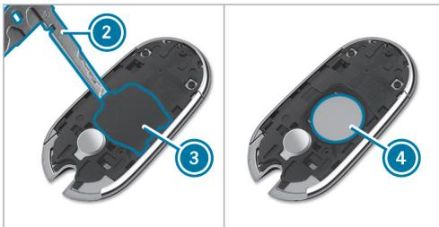

插入紧急钥匙 $\textcircled{6}$ 时，确保不要向下按压护盖 $\textcircled{8}$ 。

在手掌上反复拍打钥匙，直至电池 $\textcircled{9}$ 从钥匙中脱出。  
插入新电池，正极朝上。操作时使用无绒布。  
确保电池表面没有线头、油脂和其他杂质。  
将护盖 $\textcircled{6}$ 的前部卡舌插入外壳，然后向下按压两侧。

确保护盖 $\textcircled{8}$ 完全关闭。  
将护盖 $\textcircled{6}$ 的前部卡舌插入外壳，然后向下按压，直至其完全关闭。  
再次插入紧急钥匙 第76页)。

# 钥匙故障排除

# 您无法再锁止或解锁车辆

可能原因：

·钥匙电池电量不足或电量耗尽。$\blacktriangleright$ 通过指示灯检查电池 第75页)。必要时更换钥匙电池 第77页)。使用备用钥匙。使用紧急钥匙锁止或解锁 第84页)。请到具有资质的专业服务中心检查钥匙。

# 存在强烈的无线电信号源干扰。

钥匙功能受影响的可能原因：

·高压电源线路 ·移动电话

·电子设备（笔记本电脑、平板电脑）·由金属物体或电气门系统或自动屏障的感应回路造成的屏蔽? 确保钥匙和潜在干扰源之间有足够距离。

# 您丢失了钥匙

请到具有资质的专业服务中心停用钥匙。  
必要时，还应更换门锁装置。

# 电子车钥匙

# 使用电子车钥匙解锁和锁止车辆

# 要求：

·车辆配备“电子车钥匙"预留装置。  
·通过 Mercedes me App 启用电子车钥匙功能。蓝牙?在终端设备上已启用（电子车钥匙已激活）。  
·终端设备电量充足。

电子车钥匙可用于以下功能：

·使用无钥匙进入（KEYLESS-GO）锁止/解锁车辆 第81页)  
·后备箱感应开启功能 第89页)  
·便捷关闭功能(从车外关闭车辆)第93页)  
·防盗保护 第98页)  
·启动车辆 第158 页)或关闭车辆第191页)  
·用储物箱中的电子车钥匙启动车辆（应急操作模式）  
·使用近距离无线通讯（NFC）功能锁止和解锁车辆（紧急解锁）

当电子车辆钥匙的可充电电池电量极低时，可以使用近距离无线通讯（NFC）功能锁止和解锁车辆（紧急解锁）。

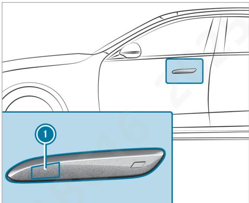

使用近距离无线通讯（NFC）功能锁止和解锁车辆：将电子车钥匙靠近车门拉手上的近距离无线通讯（NFC）天线O约5秒钟到10 秒钟，距离不要超过1厘米。

$\textcircled{1}$ 如果蓝牙?连接无法工作或电子车钥匙的可充电电池电量非常低，也可通过近距离无线通讯（NFC）功能启动车辆第159页)。

根据终端设备的不同，即使电子车钥匙中的可充电电池电量非常低，您仍可继续使用无钥匙进入（KEYLESS-GO）功能一段时间。

$\textcircled{1}$ 梅赛德斯-奔驰建议随身携带钥匙，以防可能出现的功能限制 第76页)。  
$\textcircled{1}$ 梅赛德斯-奔驰建议您在驾驶时将电子车钥匙放在储物箱中 第159页)。  
$\textcircled{1}$ 有关电子车钥匙的更多信息，请参见电子使用说明书（用户手册）。

# 电子车钥匙故障排除

无法再使用电子车钥匙锁止和解锁车辆。

可能的原因：

·电子车钥匙上的蓝牙?停用。  
·电子车钥匙的可充电电池电量非常低或已耗尽。  
? 启用电子车钥匙上的蓝牙?。检查电子车钥匙可充电电池的充电电量。

必要时，为电子车钥匙的可充电电池充电。

使用电子车钥匙的近距离无线通讯（NFC）功能锁止或解锁车辆（紧急解锁） 第78页)。

使用车辆钥匙。

使用紧急钥匙锁止或解锁 第84页)。

请到具有资质的专业服务中心检查车辆和电子车钥匙。

# 存在强大的无线电信号源干扰。

电子车钥匙受影响的可能原因：

·高压电源线路  
·移动电话  
·电子设备（笔记本电脑、平板电脑）  
·由金属物体或电气门系统或自动屏障的感应回路造成的屏蔽

确保电子车钥匙和潜在干扰源之间有足够距离。

# 电子车钥匙丢失。

移除电子车钥匙。

$\textcircled{1}$ 有关移除电子车钥匙的信息，请参见电子使用说明书（用户手册）。

# 车门

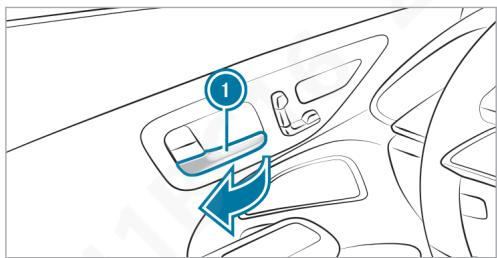  
从车内解锁/开启车门

拉动车门拉手 $\textcircled{6}$ 。

# 从车内中央锁止和解锁车辆

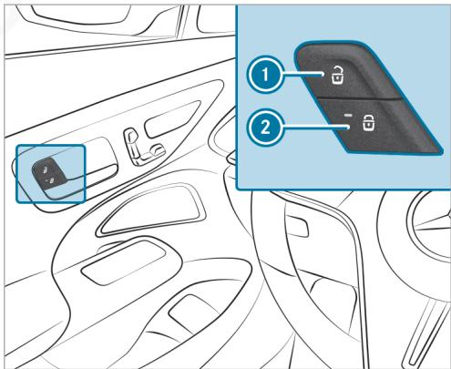

解锁：按下按钮 $\textcircled{8}$ 。

锁止：按下按钮 $\textcircled{6}$

当车辆锁止时，按钮 $\textcircled{6}$ 上的红色指示灯会亮起。

这不会锁止或解锁加油口盖板。

插电式混合动力车辆：插座盖板也已锁止和解锁。即使探测到钥匙位于车内，插座盖板也可以打开。

按下按钮 $\textcircled{8}$ 时，车辆未解锁。

·如果您已使用钥匙锁止车辆  
·如果您已使用无钥匙进入（KEYLESS-GO）锁止车辆  
·使用近距离无线通讯（NFC）功能锁止车辆后（配备电子车钥匙的车辆：）

# 隐藏式车门拉手展开或缩回

车门拉手自动展开：

·当您使用钥匙解锁车辆时  
·当您触摸两个中的其中一个车门拉手传感器外表面时（车辆解锁时）

车门拉手自动缩回：

·当您使用钥匙锁止车辆时  
·起步时  
·等待一段时间后

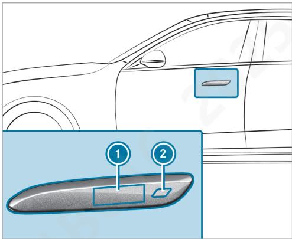

展开车门拉手：触摸传感器外表面 $\textcircled{8}$ 或 ?

如果车辆已自动锁止且另一个人想要进入车内：要解锁车辆，请按下驾驶员侧车门上的按钮(→第80页)。  
车门拉手展开。

# 使用无钥匙进入（KEYLESS-GO）锁止/解锁车辆

注意事项无钥匙进入（KEYLESS-GO）锁止功能：

当驱动系统处于运行模式时，无法从车外锁止车门。例如，当发动机正在运转或点火系统开启时。在这种情况下，转向信号灯不会闪烁。

确保驱动系统、发动机和点火系统均已关闭。然后再次尝试锁止车辆。警告：锁止车门前，请关闭驱动和点火系统。

# 要求：

·钥匙位于车外。  
·钥匙和车辆之间的距离不超过1米。  
·驾驶员侧车门和所用车门拉手侧的车门关闭。  
$\textcircled{1}$ 配备电子车钥匙的车辆：您可像使用传统车钥匙一样使用电子车钥匙。

# 车门拉手自动展开：

·当探测到车钥匙时（此时车辆尚未解锁)  
·当您使用钥匙解锁车辆时当您触摸两个中的其中一个车门拉手传感器外表面时（车辆解锁时）

车门拉手自动缩回：

·当您使用钥匙锁止车辆时：当您触摸两个中的其中一个车门拉手传感器外表面以将其锁止时  
·便捷关闭后 第93页)  
·起步时  
·短暂延迟后

注意事项 意外开启行李箱盖或车门造成的车辆损坏

·使用自动洗车装置时·使用高压清洗机时

在这些情况下，请停用钥匙功能。

或者

确保钥匙与车辆保持至少3米（高压清洗机）或6米（自动洗车装置）的距离。

# 配备电子车钥匙的车辆：

注意事项 意外开启行李箱盖或任一车门造成的车辆损坏

·使用洗车装置时·使用高压清洗机时

在这些情况下，请关闭电子车钥匙。

# 或者

确保电子车钥匙与车辆保持至少3米（高压清洗机）或6米（洗车装置）的距离。

请遵守以下信息：

·有关在洗车装置中清洗车辆 第322页)·有关使用高压清洗机 第324页)

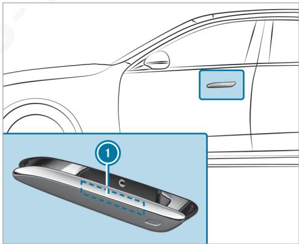

解锁车辆：在车门拉手展开的情况下，触摸车门拉手的内表面 $\textcircled{8}$

车辆已解锁时：触摸传感器表面 $\textcircled{6}$ 或 $\textcircled{8}$ 以展开车门拉手。

车辆锁止时：触摸传感器表面 $\textcircled{6}$ 或 $\textcircled{8}$ 以解锁。

锁止车辆：触摸传感器表面 $\textcircled{6}$ 或 $\textcircled{8}$ 。

便捷关闭：长时间触摸传感器表面的凹槽部分 $\textcircled{8}$ 。

$\textcircled{1}$ 有关便捷关闭功能的详细信息，请参见第93页)。

# 无钥匙进入（KEYLESS-GO）故障排除

使用无钥匙进入（KEYLESS-GO）无法锁止或解锁车辆。

可能原因：

·钥匙功能已停用。这也适用于电子车钥匙。  
·钥匙电池电量不足或电量耗尽。

配备电子车钥匙的车辆：根据相应的终端设备，即使电子车钥匙中的可充电电池电量非常低，您仍可继续使用无钥匙进入（KEYLESS-GO）功能一段时间。

启用钥匙功能 第76页)。  
通过指示灯检查电池 第75页)。  
必要时更换钥匙电池 第77页)。  
使用备用钥匙。  
使用紧急钥匙锁止或解锁 第84页)。

请到具有资质的专业服务中心检查车辆和钥匙。

# 存在强烈的无线电信号源干扰。

无钥匙进入（KEYLESS-GO）功能受影响的可能原因：

·高压电源线路  
·移动电话  
·电子设备（笔记本电脑、平板电脑)  
·由金属物体或电气门系统或自动屏障的感应回路造成的屏蔽

? 确保钥匙和潜在干扰源之间有足够距离。

# 启用/停用自动锁止功能

MBUX智能人机交互系统：

设定车辆

# 车辆解锁/上锁

$\textcircled{1}$ 当车辆启动且车轮以高于步行速度的转速转动时，车辆自动锁止。

启用或停用车门自动落锁。

在以下情况下，当该功能启用时存在被锁车外的危险：

·牵引或推动车辆时。  
·在滚轮测功机上对车辆进行测试时。

# 使用紧急钥匙锁止/解锁车辆

# 使用紧急钥匙解锁左侧车门

$\textcircled{1}$ 如果您使用紧急钥匙解锁并开启驾驶员侧车门，则会触发防盗警报系统。  
$\textcircled{1}$ 如果您使用紧急钥匙解锁驾驶员侧车门，则行李箱盖将不会解锁。  
$\textcircled{1}$ 有关用储物箱中的钥匙启动车辆的信息（应急操作模式） 第159页)。有关用储物箱中的电子车钥匙启动车辆的信息（应急操作模式） 第159页)。

# 未配备无钥匙进入（KEYLESS-GO）的车辆

取出紧急钥匙 第76页)。

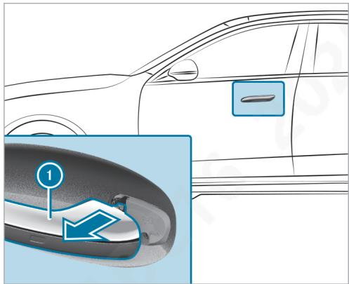

稍稍拉出车门拉手 $\textcircled{8}$ 并保持住。

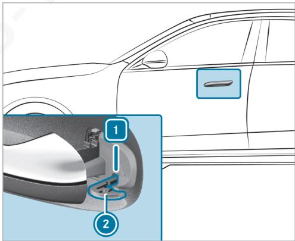

如图所示将紧急钥匙 $\textcircled{6}$ 插入锁芯。沿逆时针方向将紧急钥匙 $\textcircled{6}$ 转至位置将紧急钥匙 $\textcircled{6}$ 转回至其开始位置。取出紧急钥匙 $\textcircled{6}$ 并释放车门拉手 $\textcircled{8}$ 。

# 配备无钥匙进入（KEYLESS-GO）的车辆

取出紧急钥匙 第76页)。

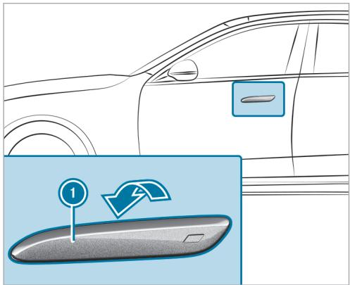

如果车门拉手已缩回：

从上方将扁平的非金属物体从缩回的车门 拉手 $\textcircled{6}$ 后面插入，然后将其稍微向外撬 开。   
从下方伸到车门拉手 $\textcircled{8}$ 后面，将其向外 拉至压力点并保持住。

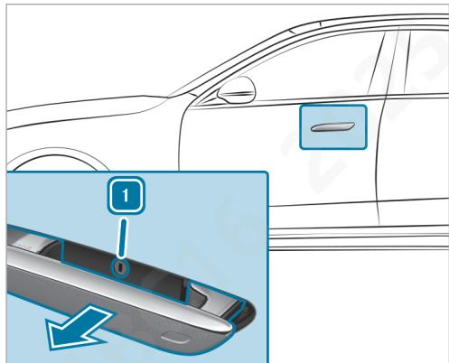

如果车门拉手已展开：

将车门拉手 $\textcircled{8}$ 向外拉至压力点并保持住。  
将紧急钥匙插入锁芯。  
沿逆时针方向将紧急钥匙转至位置。  
用力向外拉车门拉手 $\textcircled{8}$ 越过压力点。  
将紧急钥匙转至其开始位置。

取出紧急钥匙并释放车门拉手。

# 锁止车门

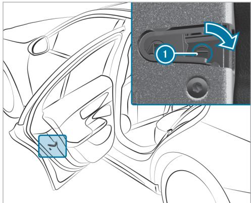

将适当的物体（例如紧急钥匙）插入车门锁上的开口处 $\textcircled{8}$

锁止车辆左侧：顺时针转动紧急钥匙至止动位。

锁止车辆右侧：逆时针转动紧急钥匙至止动位。

如果随后关闭已锁止的车门，则无法再从车外将其开启。

# 行李箱

# 开启行李箱盖

# A危险废气中毒风险

内燃机会排出一氧化碳等有毒废气。发动机运转时，尤其在车辆行驶过程中，如果行李箱盖开启，则排出的废气可能进入车内。

开启行李箱盖前，务必关闭发动机。  
请勿在行李箱盖开启的情况下驾驶。

注意事项 由于车辆上方的障碍物造成的行李箱盖损坏。

行李箱盖开启时向上翻开。

因此，必须确保行李箱盖上方有足够的空间。

拉动行李箱盖拉手。

配备后备箱感应开启功能的车辆：在保险杠下方做踢腿动作 第89页)。

# 配备行李箱盖便捷关闭功能的车辆

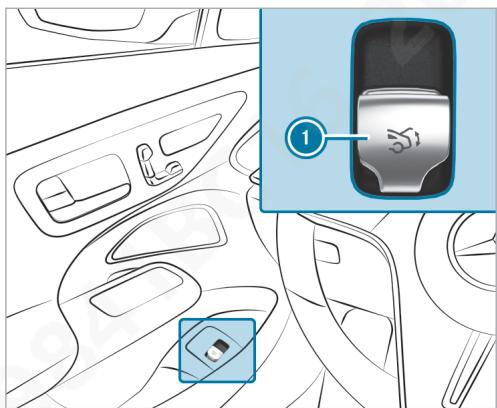

拉动遥控操作开关 $\textcircled{6}$ ，直至行李箱盖开启。

或者

按住钥匙上的按钮 $\boxed { \mathfrak { S } ^ { 1 } }$ 。

$\textcircled{1}$ ：此符号表示仅开启和关闭行李箱盖。

如果行李箱盖停在中间位置，则向上推动。当其开始开启时，立即将其释放。

在行李箱盖开启限制器启用的情况下，手动向上拉停止的行李箱盖。

如果在自动开启过程中有障碍物阻碍行李箱盖的移动，障碍物探测功能将停止行李箱盖的移动。自动堵塞检测功能仅是一种辅助工具，并不能代替您的注意力，在行李箱盖开启过程中，您应时刻观察行李箱盖附近的障碍物及附近的环境。

# 关闭行李箱盖

A 警告 由车内未固定物品造成的伤害风险

如果物品、行李或装载物未固定或未充分固定，则其可能滑落、倾翻或被抛起并由此击中车辆驾驶员及乘客。

特别是在紧急制动或突然转向时，存在伤害风险。

务必妥善存放物品，使其不会被抛起。  
行车前，固定物品、行李或装载物，防止其滑落或倾翻。

请遵守有关装载车辆的注意事项。

关闭行李箱盖时的注意事项：您的车辆配备自动钥匙识别功能。

请注意，如果出现以下情况，行李箱盖将不会锁止并且将会弹起并打开：

·您已锁止了车辆并且关闭了行李箱盖，但车内放有属于本车的钥匙并已被检测到。以及·在车外未检测到属于本车的第二把钥匙。

自动钥匙识别功能仅是一种辅助工具，并不能代替您的注意力。

锁止车辆前，确保至少有一把本车钥匙在车外。

关闭行李箱盖：使用把手凹槽向下拉动行李箱盖并推动将其关闭。

$\textcircled{ i}$ 配备行李箱盖便捷关闭功能的车辆：如果您轻推行李箱盖将其关闭，则电吸门将自动将行李箱盖拉入锁中。

# 配备行李箱盖便捷关闭功能的车辆

警告 行李箱盖自动关闭过程中的被夹凤险

身体部位可能被夹到。关闭区域内可能有人。

确保关闭区域周围无人。

以下方式中，采用一种停止关闭过程：

·按下钥匙上的按钮。  
·按下或拉动驾驶员侧车门上的遥控开关。按下行李箱盖上的关闭或锁止按钮。  
·拉动行李箱盖拉手。

配备后备箱感应开启功能的车辆：同样可通过在后保险杠下方踢腿停止关闭过程。

拉动行李箱盖拉手。当其开始关闭时，立即松手。

如果行李箱盖停在中间位置，则向下推动。

行李箱盖将继续关闭。

推动遥控操作开关 $\textcircled{6}$ ，直至行李箱盖完全关闭。

$\textcircled{1}$ ：此符号表示仅开启和关闭行李箱盖。

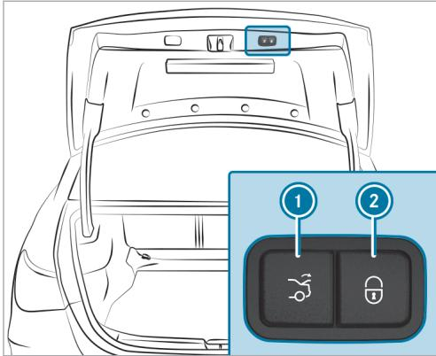

按下行李箱盖上的关闭按钮 $\textcircled{8}$

# 配备无钥匙进入（KEYLESS-GO）的车辆

按下行李箱盖上的锁止按钮 $\textcircled{6}$ 如果在车外探测到钥匙，则行李箱盖将关闭且车辆将锁止。

$\textcircled{1}$ 配备电子车钥匙的车辆：如果该功能已激活且电子车钥匙已连接到车辆上，则这也适用于电子车钥匙。

在行李箱盖完全开启的状态下，按住钥匙上的按钮。钥匙必须在车辆附近。

# 配备后备箱感应开启功能的车辆

在行李箱盖完全开启的状态下，在保险杠下方做踢腿动作 第89页)。

# 行李箱盖自动防夹功能

行李箱盖配备有带防夹功能的障碍物自动探测功能。如果在自动关闭过程中障碍物阻碍行李箱盖移动，其将自动重新开启。自动防夹功能仅是一种辅助工具，并不能代替您的注意力，在行李箱盖开启过程中，您应时刻观察行李箱盖附近的障碍物及附近的环境在关闭过程中，确保没有任何身体部位处于关闭区域。

A 警告 防夹功能启用情况下的被夹风险防夹功能不会对以下各项做出反应：

·软、轻和薄的实体和部位，例如手指·关闭过程快要结束时

尤其在这些情况下，防夹功能无法防止人员被夹住。

确保身体各部位未处于关闭区域内。

如果有人被夹住，请使用以下的其中一种办法：

·按下钥匙上的按钮。  
·按下驾驶员侧车门上的遥控开关。按下行李箱盖上的关闭或锁止按钮。  
·拉动行李箱盖拉手。

# 后备箱感应开启功能

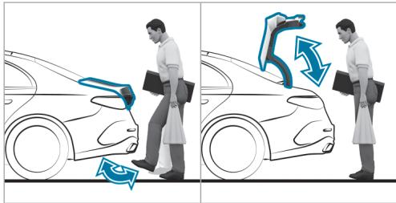

使用后备箱感应开启功能，您可通过在保险杠下方做踢腿动作来开启和关闭行李箱盖，或甚至可以随时停止开启和关闭过程。变速箱必须处于档才能使用此功能。

踢腿动作交替触发开启或关闭过程。

·如果您通过踢腿动作停止行李箱盖开启过程，则下一个踢腿动作会使行李箱盖关闭。  
，如果您通过踢腿动作停止行李箱盖关闭过程，则下一个踢腿动作会使行李箱盖开启。

在以下情况下，行李箱盖仅可通过后备箱感应开启功能关闭：

·如果车辆开启并设定了钥匙的解锁功能使启用时仅驾驶员侧车门解锁第76页)。  
·如果车辆已从车内中央锁止第80页)。

请遵守开启 第86页)和关闭 第86页)行李箱盖时的注意事项。

$\textcircled{1}$ 行李箱盖开启或关闭时将响起警告音。

A 警告烫热的排气系统造成的烫伤风险  
车辆排气系统可能变得非常热。如果您使  
用后备箱感应开启功能则您可能由于触摸  
到排气系统而烫伤。务必确保仅在传感器的探测范围内做踢腿动作。

注意事项 意外开启行李箱盖或车门造成的车辆损坏

·使用自动洗车装置时·使用高压清洗机时在这些情况下，请停用钥匙功能。

# 或者

确保钥匙与车辆保持至少3米（高压清洗机）或6米（自动洗车装置）的距离。

# 配备电子车钥匙的车辆：

注意事项 意外开启行李箱盖或任一车门造成的车辆损坏

·使用洗车装置时·使用高压清洗机时

在这些情况下，请关闭电子车钥匙。

# 或者

确保电子车钥匙与车辆保持至少3米（高压清洗机）或6米（洗车装置）的距离。

做踢腿动作时，确保您平稳地站在地面上。  
否则您可能失去平衡，例如在冰面上。

请遵守以下注意事项：

·钥匙位于车后。如果钥匙未被识别到：用手拿住钥匙。或者确保钥匙功能启用 第76页)。

·配备电子车钥匙的车辆：电子车钥匙位于车辆后部。  
·做踢腿动作时，站在距离车辆至少30 厘米的位置。  
·做踢腿动作时，请勿接触保险杠。  
·做踢腿动作时，请勿动作过慢。  
·必须朝着车辆来回做踢腿动作。

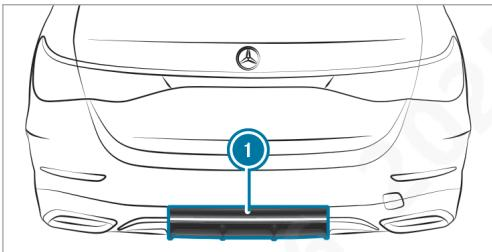

$\textcircled{6}$ 传感器探测区域

如果多个连续的踢腿动作不成功，请等待10秒钟。

# 系统限制

在以下情况下，系统可能会受影响或无法运行：

·传感器脏污，例如由于融雪盐或雪。  
·使用假肢做踢腿动作。

在以下情况下，行李箱盖可能意外开启或关闭：

·有人的手臂或腿在传感器探测区域内移动，例如为车辆抛光或拿起物品时。  
，在车辆后方移动或放置物品（例如燃料分配器软管、充电电缆或行李）时。  
·紧固带、防水布或其他遮盖物盖住保险杠时。  
·使用了长度超出后备箱门槛的保护垫，遮挡了传感器探测区域时。  
·保护垫未正确固定时。

在此类情况下，请停用钥匙功能第76页)且勿随身携带钥匙。

# 启用/停用行李箱盖开启限制器

MBUX智能人机交互系统：

设定车辆

车辆解锁/上锁

启用或停用开启后备箱高度限制。

例如，此功能可防止行李箱盖碰到较低的车库顶棚。

# 侧车窗

# 开启和关闭侧车窗

A 警告开启侧车窗时的夹伤风险开启侧车窗时，身体某些部位可能会被卷入或夹在侧车窗和车窗框架之间。

开启侧车窗时，确保没有人接触到侧车窗。  
如果有人被夹住，请立即释放或拉动按钮以再次关闭侧车窗。

# A 警告关闭侧车窗时的被夹风险

关闭侧车窗时，身体某些部位可能被夹在关闭区域内。

关闭时，应确保您身体各部位未处于关闭区域。如果有人被夹住，请立即释放按钮或按下按钮以重新开启侧车窗。

A 警告儿童操作侧车窗时的被夹风险如果儿童操作侧车窗，其可能会被夹到，尤其是在无人看管时。

启用后侧窗儿童安全锁。  
离开车辆时，务必随身携带钥匙并锁止车辆。  
切勿将儿童单独留在车内无人看管。

# 要求：

·已接通电源或启动车辆。

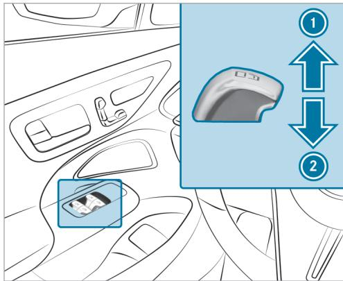

$\textcircled{8}$ 关闭 $\textcircled{6}$ 开启

驾驶员侧车门上的按钮具有更高优先级。

开始自动操作：将「按钮按过阻力点，或拉动然后将其松开。中断自动操作：再次按下或拉动按钮

车辆关闭后，仍可继续操作侧车窗。  
该功能将仍然可用，直至车门再次关闭。

$\textcircled{1}$ 左侧和右侧后车门上配备电动遮阳帘的车辆：后侧窗按钮也可开启和关闭遮阳帘第97页)。

# 侧车窗自动防夹功能

如果在关闭过程中有障碍物阻塞侧车窗的移动，侧车窗将重新自动开启。自动防夹功能仅是一种辅助工具，并不能代替您的注意力。

在关闭过程中，确保没有任何身体部位处于关闭区域。

A 警告尽管侧车窗上配备防夹保护仍存在的被夹风险

防夹功能不会对以下各项做出反应：

·软、轻和薄的实体和部位，例如手指。  
·车窗复位过程中。

因此，在这些情况下，防夹功能无法防止人员被夹住。

在关闭过程中，应确保身体各部位未处于关闭区域。  
如果有人被夹住，按下按钮以再次开启侧车窗。

# 侧车窗自动功能

在以下情况下，侧车窗将在车辆关闭时自动关闭：

·开始下雨时风挡玻璃上的雨量传感器检测到雨水时。  
·在极端温度下  
·在一定时间之后（取决于车载电气系统电压）  
·电源发生故障时

侧车窗将关闭，直至达到通风位置。

配备全景式滑动天窗的车辆：当滑动天窗开启时，侧车窗将完全关闭。

如果侧车窗在自动关闭过程中卡住，则相应的侧车窗将稍稍重新开启。再次执行自动关闭过程后，自动功能可能会停用。下次车辆启动时将再次启用自动功能。

# 便捷开启功能 (行车前为车辆通风)

A 警告开启侧车窗时的夹伤风险开启侧车窗时，身体某些部位可能会被卷入或夹在侧车窗和车窗框架之间。

开启侧车窗时，确保没有人接触到侧车窗。  
如果有人员被夹住，应立即松开按钮。

# 要求：

·钥匙在车辆附近。

按住钥匙上的按钮。

执行以下功能：

·车辆解锁。   
·侧车窗打开。   
·全景式滑动天窗开启。   
·驾驶员座椅通风开启。

$\textcircled{ i}$ 如果全景式滑动天窗的遮阳帘关闭，则遮阳帘会首先开启。

$\textcircled{1}$ 如果后车门遮阳帘关闭，则遮阳帘首先开启。

中断便捷开启：松开按钮。

继续便捷开启：再次按住按钮。

# 便捷关闭功能 (从车外关闭车辆)

A 警告便捷关闭期间没有注意造成的被夹凤险

当便捷关闭功能运行时，身体某些部位可能被夹在侧车窗和滑动天窗的关闭区域内。

当便捷关闭功能运作时，监控整个关闭过程并确保身体各部位未处于关闭区域。

# 要求：

·钥匙在车辆附近。

按住钥匙上的按钮[。

执行以下功能：

·车辆锁止。  
·侧车窗关闭。  
·全景式滑动天窗关闭。

中断便捷关闭：松开按钮。

继续便捷关闭：再次按住按钮。

$\textcircled{ i}$ 便捷关闭功能也可与无钥匙进入（KEYLESS-GO）配合使用 第81页)。

# 解决有关侧车窗的问题

A 警告 防夹保护功能未启用时的被夹或致命风险

如果您在侧车窗受阻后立即再次将其关闭，则侧车窗将以更大或最大的力关闭。之后，防夹功能不再启用，身体部位可能会被夹住。

确保您身体各部位未处于关闭区域。如需停止关闭过程，请释放按钮或再次按下按钮以重新开启侧车窗。

# 侧车窗无法关闭，且无法找出原因。

检查车窗导轨中是否有物体。  
调节侧车窗。

# 调节侧车窗

如果侧车窗在关闭过程中受阻并立即重新开启，则：

此时，立即再次拉住相应按钮，直至侧车窗关闭，并再拉住按钮至少一秒钟（重新调节）。  
侧车窗将在未启用自动防夹功能的情况下关闭。

如果侧车窗再次受阻并且立即重新开启：

此时，立即再次拉住相应按钮，直至侧车窗关闭，并再拉住按钮至少一秒钟（后续调节）。  
侧车窗将在未启用自动防夹功能的情况下关闭。  
如果侧车窗在关闭过程中再次受阻并重新稍稍开启，请咨询具有资质的专业服务中心。

使用便捷开启功能无法开启或关闭侧车窗。

可能原因：

·钥匙不在车辆附近。  
·钥匙电池电量不足或电量耗尽。通过指示灯检查电池！ 第75页)。  
必要时更换钥匙电池 第77页)。

# 滑动天窗

# 开启和关闭滑动天窗

$\textcircled{1}$ 术语"滑动天窗"是指全景式滑动天窗。

A警告开启和关闭滑动天窗时的夹伤风 险

在移动范围内，身体部位可能会被夹到。

开启和关闭时，请确保身体各部位未处于滑动天窗的移动范围内。

如果有人被夹到，请立即放开控制面板。

在自动操作期间触摸控制面板。  
开启/关闭过程将停止。

A 警告儿童操作滑动天窗时的被夹风险操作滑动天窗的儿童可能被夹在移动部件中，尤其当无人看管时。

切勿将儿童单独留在车内无人看管。离开车辆时，务必随身携带钥匙并锁止车辆。

A 警告开启和关闭遮阳帘时的夹伤风险身体部位可能会被夹在遮阳帘和框架或滑动天窗之间。

开启或关闭遮阳帘时，应确保身体各部位未处于其移动范围内。  
如果有人被夹到，请立即放开控制面板。

# 或者

在自动操作期间触摸控制面板。  
开启/关闭过程将停止。

# ■注意事项冰雪导致的故障

冰雪可能导致滑动天窗故障。

仅当滑动天窗上没有冰雪时，才可以开启。

# 注意事项湿气进入造成的损坏

下过雨后，请勿立即打开滑动天窗。在洗车装置中清洗车辆后，请勿立即打开滑动天窗。

注意事项由伸出物体造成的损坏

伸出滑动天窗的物体可能损坏密封件。

不要让任何物体从滑动天窗中伸出车外。

注意事项 由车顶行李架造成的全景式滑动天窗损坏

如果在装有车顶行李架的情况下开启全景式滑动天窗，则车顶行李架可能会损坏全景式滑动天窗。

如果装有车顶行李架，切勿开启全景式滑动天窗。

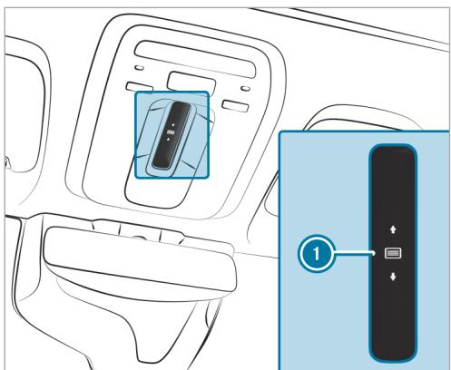

使用控制面板 $\textcircled{8}$ 操作滑动天窗和遮阳帘。仅当遮阳帘开启时，才可操作全景式滑动天窗。

开启：在控制面板 $\textcircled{8}$ 上向后滑动并按住。

关闭：在控制面板 $\textcircled{6}$ 上向前滑动并按住。

升起或降低：点按控制面板 $\textcircled{8}$ 。

开始自动操作：在控制面板 $\textcircled{8}$ 上向前或向后滑动。

取消自动操作：再次按下控制面板 $\textcircled{8}$ 。  
开启/关闭过程将停止。

# 从后排操作滑动天窗遮阳帘

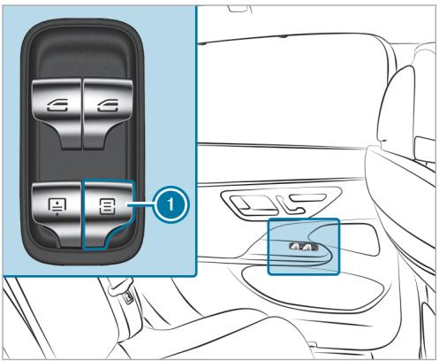

手动开启/关闭：推动或拉动按钮 $\textcircled{6}$ 至阻力点并保持住，直至遮阳帘到达所需位置。

完全开启/关闭：将按钮 $\textcircled{6}$ 按过或拉过阻力点，然后将其松开。

$\textcircled{1}$ 按钮安装在两个后车门上。

# 滑动天窗自动防夹功能

如果在关闭过程中有障碍物阻碍滑动天窗移动，滑动天窗将自动再次开启。自动防夹功能仅起辅助作用，并不能代替您的注意力。

确保开启区域和导轨没有碎屑，例如冰、雪或树叶。  
关闭滑动天窗时，确保无身体部位和物体处于关闭区域。

A 警告 防夹功能启用情况下的被夹风险防夹功能不会对以下各项做出反应：

·软、轻和薄的实体和部位，例如手指。  
·关闭过程将要结束时。  
·天窗复位过程中。在关闭过程中，应确保身体各部位未处于关闭区域。  
如果有人被夹到，请立即放开控制面板。

# 或者

在自动关闭期间触摸控制面板。  
关闭过程将停止。

# 遮阳帘自动防夹功能

如果在关闭过程中有障碍物阻碍遮阳帘移动，遮阳帘将自动再次开启。自动防夹功能仅起辅助作用，并不能代替您的注意力。

$\blacktriangleright$ 确保开启区域和导轨没有碎屑，例如冰、雪或树叶。关闭遮阳帘时，应确保无身体部位和物体处于移动范围内。

A 警告 防夹功能启用情况下的被夹风险防夹功能尤其不会对软、轻和薄的实体和部位，例如手指做出反应。

关闭遮阳帘时，应确保您身体各部位未处于移动范围内。  
如果有人被夹到，请立即放开控制面板。

# 或者

在自动关闭期间触摸控制面板。  
关闭过程将停止。

# 滑动天窗自动功能

$\textcircled{1}$ 术语"滑动天窗"是指全景式滑动天窗。

车辆在以下情况下关闭时，滑动天窗将自动关闭：

·开始下雨时风挡玻璃上的雨量传感器检测到雨水时。  
）在极端温度下  
·在一定时间之后（取决于车载电气系统电压）  
·电源发生故障时

滑动天窗后部将升起，以继续为车内通风。如果滑动天窗在自动关闭过程中卡住，它将再次稍稍开启。此时滑动天窗和侧车窗的自动功能将停用。

# 雨天行驶自动关闭功能

配备全景式滑动天窗的车辆：在车辆行驶过程中，如果开始下雨，则升起的滑动天窗自动降低。

# 自动降低功能

配备全景式滑动天窗的车辆：如果滑动天窗的后部升起，则当车速升高时，滑动天窗会自动稍稍降低。车速较低时，滑动天窗会再次自动升起。

A 警告 滑动天窗自动降低时的夹伤风险车速较高时，升起的滑动天窗后部会自动稍稍降低。

在车辆行驶过程中，应确保没有人进入滑动天窗的移动范围内。如果有人被夹到，请触摸控制面板。

# 纠正有关滑动天窗的问题

A 警告再次关闭滑动天窗时的夹伤或致 命风险

如果在滑动天窗受阻或复位后立即再次将其关闭，则滑动天窗将以更大或最大的力关闭。

存在夹伤甚至致命伤害的风险！

确保您身体各部位未处于关闭区域内。  
如果有人被夹到，请立即放开控制面板。

或者

在自动关闭期间触摸控制面板。  
关闭过程将停止。

滑动天窗无法关闭，且您无法判断故障原因。

$\textcircled{1}$ 术语"滑动天窗"是指全景式滑动天窗。如果滑动天窗在关闭过程中受阻并重新稍稍开启：

自动防夹功能启用后，立即向前滑动并按住控制面板 第94页)，直到滑动天窗关闭。  
加力后，滑动天窗将会关闭。

如果滑动天窗再次受阻并再次稍稍开启：

重复先前步骤。  
加力后，滑动天窗将再次关闭。

# 滑动天窗或遮阳帘移动不顺畅。

复位滑动天窗和遮阳帘。

# 复位滑动天窗和遮阳帘

反复向前滑动并按住控制面板第94页)，直到滑动天窗完全关闭。

滑动控制面板并再按住1秒钟。

滑动控制面板并按住，直到遮阳帘完全关闭。

滑动控制面板并再按住1秒钟。

使用自动操作完全开启滑动天窗，然后关闭。

# 遮阳帘

# 展开或收回后侧窗遮阳帘

A 警告 展开或收回遮阳帘时的夹伤风险当遮阳帘展开或收回时，身体部位可能会被夹在遮阳帘的移动范围内。

展开或收回遮阳帘时，应确保身体各部位未处于遮阳帘的移动范围内。如果有人员被夹住，应向相反方向点按按钮。  
开启或关闭过程将短暂停止。此后，遮阳帘返回至起始位置。

注意事项由物品造成的损坏物品可能会导致遮阳帘出现故障。

确保遮阳帘可以顺畅移动。

可使用侧车窗按钮操作后侧窗遮阳帘。

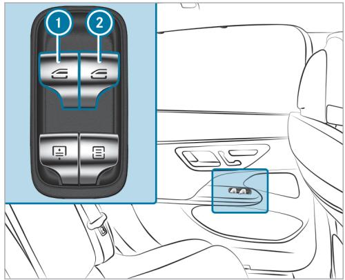

$\textcircled{6}$ 左后侧车窗$\textcircled{6}$ 右后侧车窗

完全关闭：当侧车窗关闭时，拉动相应的按钮。

完全开启：按下相应的按钮。

# 展开或收回后车窗遮阳帘

A 警告 展开或收回遮阳帘时的夹伤风险身体部位可能会被夹在遮阳帘的移动范围内。

确保身体部位未处于移动范围内。如果有人员被夹住，应再次点按按钮。  
开启或关闭过程将短暂停止。此后，遮阳帘返回至起始位置。

# ■注意事项由物品造成的损坏

物品可能会导致遮阳帘出现故障。

请勿在后搁板上放置任何物品。  
确保遮阳帘可以顺畅移动。

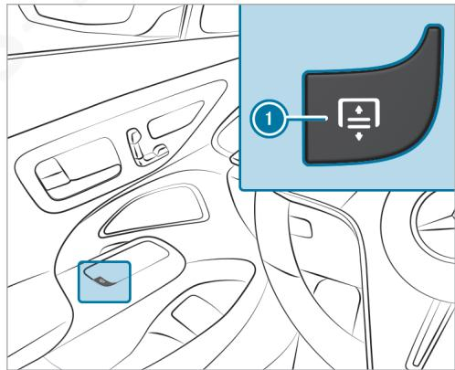

展开或收回：按下按钮 $\textcircled{8}$ 。

$\textcircled{1}$ 按钮也位于前排乘客侧车门和后车门上。

# 防盗保护

# 防启动装置功能

防启动装置可以防止您的车辆在未使用正确钥匙的情况下被启动。

# 关于正确的驾驶员座椅位置的注意事项

A 警告行车时调节车辆设定造成的事故凤险

以下情况尤其可能导致您失去对车辆的控制：

·您在行车过程中调节驾驶员座椅、头枕、方向盘或后视镜  
·您在行车过程中系安全带启动车辆前：特别要调节驾驶员座椅、头枕、方向盘和后视镜并系安全带。

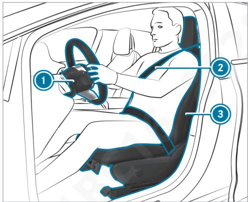

调节方向盘 $\textcircled{8}$ 、安全带 $\textcircled{6}$ 和驾驶员座椅 $\textcircled{6}$ 时，请确保：

·考虑以下几点，尽可能远离驾驶员前置气囊：  
·采取直背坐姿  
·您的大腿稍稍由座垫支撑  
·您的双腿未完全伸展且您可正常踩下踏板  
，头枕的中心区域和您头部的接触点与眼部齐平当握住方向盘时，手臂略微弯曲  
·双腿能够自由移动  
、可以清晰地看到驾驶员显示屏上的所有显示元件  
·充分掌握交通状况  
·请注意有关正确系安全带的注意事项第44页)。

# 关于把手的说明

A 警告 由于把手上载荷过大导致的伤害凤险

如果将全身重量施加在把手上或突然拉动把手，则把手可能会损坏或从其固定点松动。因此可能会造成伤害。

仅在稳定座椅位置或帮助进出座椅时使用把手。

# 座椅

# 调节前排座椅

座椅调节开关不动。因此，当按下开关时，您不会收到开关的直接反馈。仅可通过座椅的移动情况获得反馈。

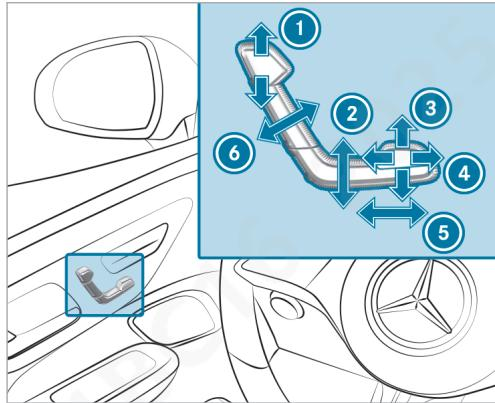

头枕高度（根据车辆装备情况，仅适用于驾驶员座椅)

$\textcircled{6}$ 座椅高度调节

$\textcircled{6}$ 座垫倾斜度调节

$\textcircled{6}$ 座垫长度调节

$\textcircled{6}$ 座椅前后位置调节

$\textcircled{5}$ 座椅靠背倾斜度调节

使用记忆功能保存设定 第114页)。

$\textcircled{1}$ 当您调节座椅高度或座椅前后位置时，头枕高度会自动调节。

# 从驾驶员座椅电动调节前排乘客座椅

A 警告儿童调节座椅造成的被夹风险如果儿童调节座椅，其可能会被夹到，尤其是在无人看管时。

离开车辆时，务必随身携带钥匙并锁止车辆。切勿将儿童单独留在车内无人看管。

这也适用于电子车钥匙。  
当车辆关闭时可调节座椅。

A 警告调节座椅时被夹的风险例如，调节座椅时，您或其他车辆驾驶员及乘客可能被座椅导轨夹住。

调节座椅时，请确保所有人的身体部位均不在座椅的活动范围内。

请遵守"气囊"和"车内的儿童"部分的安全注意事项。

警告 前排座椅位置过于靠近驾驶室造成的伤害或死亡风险

前置气囊还会伤及车辆前排的驾驶员及乘客。

务必调节前排座椅，使其尽可能远离前置气囊。  
此外，请注意有关正确调整座椅的注意事项。

<table><tr><td>损坏</td><td>注意事项调节前排乘客座椅时对前排 乘客脚部位置行李网中的物品造成的</td></tr><tr><td>调节前排乘客座椅时，前排乘客脚部位置 的行李网中的物品可能受损。 请勿向前滑动前排乘客座椅至止动 位。</td><td></td></tr></table>

注意事项移动座椅靠背时造成的座椅损坏

移动座椅靠背时，物品可能造成座椅损坏。

移动座椅靠背时，确保脚部位置内或座椅下方或后方没有物品。

# 要求

·选择前排乘客座椅：电源开启

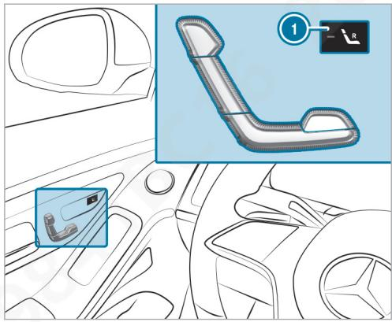

您可调出以下前排乘客座椅功能：

·座椅调节·座椅加热器

·座椅通风

·记忆功能

选择前排乘客座椅：按下按钮 $\textcircled{8}$ 。

当指示灯亮起时，表示前排乘客座椅已选定。

使用驾驶员侧车门操作单元上的按钮调节前排乘客座椅。

# 从后排电动调节前排乘客座椅（配备电动后排座椅调节装置的车辆)

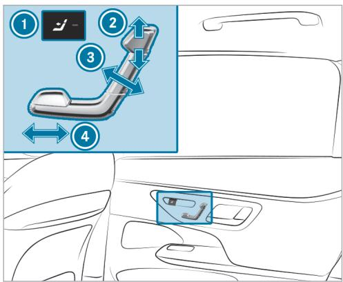

$\textcircled{6}$ 选择前排乘客座椅

$\textcircled{6}$ 头枕高度调节 （取决于车辆装备情况)

$\textcircled{6}$ 座椅靠背倾斜度调节

$\textcircled{9}$ 座椅前后位置调节

选择前排乘客座椅：按下按钮 $\textcircled{8}$

当指示灯亮起时，表示前排乘客座椅已选定。

使用后排车门操作单元上的按钮来调节前排乘客座椅。

$\textcircled{ i}$ 可以使用后排儿童防护锁停用该功能第74页)。

# 从后排电动调节前排乘客座椅（未配备电动后排座椅调节装置的车辆)

# 要求

·选择前排乘客座椅：电源开启

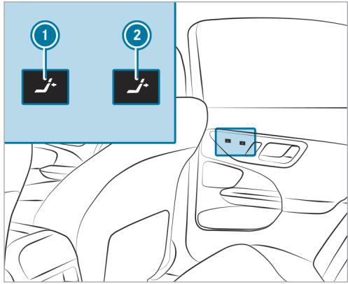

$\textcircled{8}$ 向前移动

$\textcircled{6}$ 向后移动

$\blacktriangleright$ 使用按钮 $\textcircled{8}$ 或 $\textcircled{6}$ 调节前排乘客座椅。

$\textcircled{1}$ 可以使用后排儿童防护锁停用该功能第74页)。

# 调节四向腰部支撑

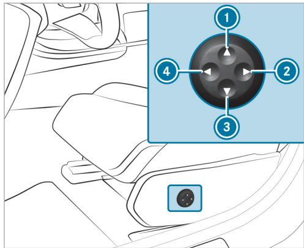

$\textcircled{6}$ 更软

$\textcircled{6}$ 降低

$\textcircled{6}$ 更硬

使用按钮 $\textcircled{8}$ 至 $\textcircled{9}$ 调节靠背仿形。

# 电动调节后排座椅

调节头枕，使其尽量靠近乘坐者头部后侧。

A 警告不正确的座椅位置造成的伤害或死亡风险

如果未将座椅靠背移至接近垂直的位置，安全带将无法发挥预期的保护作用。特别是，您可能会滑到安全带下方并受伤。

行车前，请正确调节座椅。  
务必确保座椅靠背处于接近垂直的位置，且安全带的肩带部分绕过您肩部的中间位置。

座椅调节开关不动。因此，当按下开关时，您不会收到开关的直接反馈。仅可通过座椅的移动情况获得反馈。

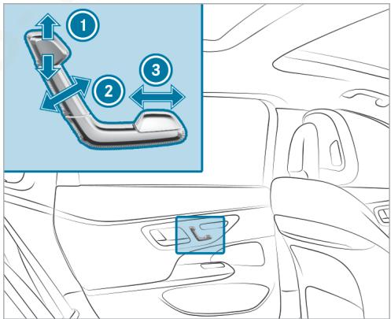

$\textcircled{6}$ 头枕高度调节$\textcircled{6}$ 座椅靠背倾斜度调节$\textcircled{6}$ 座垫长度调节进行相应的调节。

# 头枕

# 调节前排座椅上的头枕

A 警告行车时调节车辆设定造成的事故凤险

以下情况尤其可能导致您失去对车辆的控制：

·您在行车过程中调节驾驶员座椅、头枕、方向盘或后视镜  
·您在行车过程中系安全带

启动车辆前：特别要调节驾驶员座椅、头枕、方向盘和后视镜并系安全带。

A 警告未正确调节头枕造成的伤害风险如果未正确调节头枕，会增加头部和颈部受伤的风险，例如在遭遇事故或紧急制动时。

每次启程前，确保头枕的中心区域与车辆驾驶员及乘客头部的接触点与眼部齐平。

调节头枕前后位置，使之尽可能靠近乘坐者头后部。

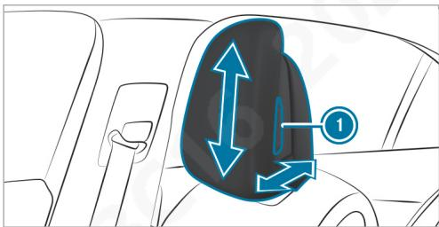  
配备手动和电动座椅调节的座椅

握住头枕两侧，按下释放按钮 $\textcircled{8}$ 。   
向前或向后移动：向前拉动或向后推动头 枕。   
向上或向下移动：向上或向下推动头枕。 松开释放旋钮 $\textcircled{8}$

# 配备电动座椅调节的座椅

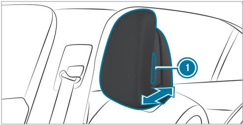

握住头枕两侧，按下释放按钮 $\textcircled{8}$ 。

向前或向后移动：向前拉动或向后推动头枕。

松开释放旋钮 $\textcircled{8}$

向上或向下移动：使用车门操作单元上的按钮调节头枕 第101页)。

# ■手动调节后排座椅头枕

$\textcircled{1}$ 将所有头枕至少向上移至第一个止动位。如果头枕处于最低的非锁止位置，则不得使用相应座椅。

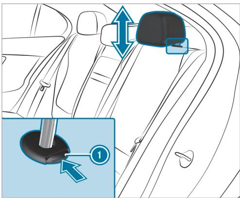  
折叠入位

升起：沿箭头方向推动释放旋钮 $\textcircled{8}$ 并向上拉动头枕，直至其卡入位。

降低：沿箭头方向按下释放旋钮 $\textcircled{8}$ 并向下推动头枕，直至其卡入位。

# 」将中间头枕手动折叠入位并折回

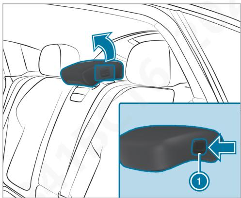

按下按钮 $\textcircled{8}$ 。

头枕将向上移动并卡入。

$\textcircled{1}$ 在 $- 3 0 ^ { \circ } \mathrm { C }$ 或更低温度下，头枕的移动可能会变慢，头枕可能不会卡入。

确保头枕卡入上方位置。

# 折下

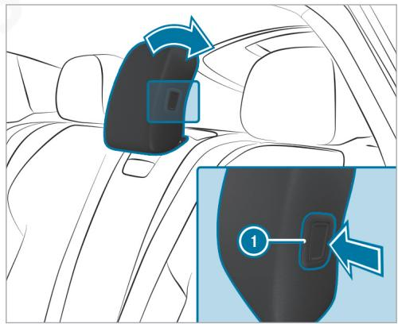

按下按钮 $\textcircled{8}$

完全折回头枕。

# 配置座椅设定

# MBUX智能人机交互系统：

舒适性>座椅

# 调节气腔

在相应菜单中，为腰部或侧支撑调节气腔。

# 设定座椅加热平衡功能

选择加热设定。  
选择座椅加热平衡。  
调节目标座椅的热量分配。

# 连接颈部加热器至后排座椅加热器

选择开启颈部加热。  
开启或关闭目标座椅的功能。  
如果该功能启用，则附加垫的颈部加热器已连接至后排座椅加热器。

# 设定自动座椅调节

A警告调出驾驶员配置文件后调节驾驶员座椅期间有被卡住的风险

选择用户配置文件可能会将驾驶员座椅调节到用户配置文件中保存的位置。在此过程中可能会导致您或车内其他乘员人员受伤。

在使用MBUX智能人机交互系统调节驾驶员座椅位置时，确保座椅移动范围内没有人员或身体部位。

如果有人员被卡住的风险，请立即停止调节，操作方法是：

$\blacktriangleright$ a）点击中央显示屏上的警告信息。或者

b）按下记忆功能的位置按钮或驾驶员侧车门上的座椅调节开关。调节过程停止。

# MBUX智能人机交互系统：

# 舒适性座椅

# 自动座椅定位

# 根据体型手动调节驾驶员座椅位置和方向盘位置

车辆将基于驾驶员的体型计算合适的驾驶员座椅位置和方向盘位置并直接进行设定。

设定测量单位：选择厘米或英尺/英寸。  
使用比例尺设定体型。  
选择开始定位。  
将根据已设定的体型调节驾驶员座椅位置和方向盘位置。

$\textcircled{1}$ 也可通过Mercedes me用户帐户对您的用户配置文件进行设定。通过同步车辆配置文件和梅赛德斯-奔驰智能互联配置文件，可以将这些设定同步到车辆。

$\textcircled{1}$ 可以使用控制按钮更改车辆设定的驾驶员座椅和方向盘位置。可以根据您的偏好使用操作开关调整车外后视镜第138页)。

# 按摩模式概述

$\textcircled{1}$ 根据车辆装备情况，提供不同的按摩模式：

·经典按摩背部放松按摩模式。

·放松按摩 通过增加波动强度进行背部放松按摩，随后进行舒缓的移动按摩。

·波浪按摩 通过靠背和座垫的放松按摩波进行波浪按摩。

·深度波浪按摩座垫中的波浪状运动可促进下背部和腿部的血液流动和代谢过程。

·热石按摩：按摩与加热相结合。从背部按摩开始。此外，您会感觉到到从髋部开始的加热压力点。

·激活按摩：此按摩方式有助力于您在长途行车中保持健康和集中注意力。在单调枯燥的驾驶情况下，刺激功能（包括精心选择的停顿）会让您保持清醒和专注。

# 选择前排座椅按摩模式

MBUX智能人机交互系统：

# 舒适性

选择按摩功能。选择一种按摩模式 第108页)。使用为所需座椅启动模式。$\blacktriangleright$ 设定按摩强度：开启或关闭 高强度。停止按摩：选择。

$\textcircled{1}$ 该功能的可用性因配置而异。

# 复位座椅设定

MBUX智能人机交互系统：

舒适性 座椅选择复位。为目标座椅选择。

# 开启/关闭座椅加热器和颈部加热器

A 警告反复开启座椅加热导致的灼伤风 险

反复开启座椅加热会导致座垫和座椅靠背垫温度很高。

尤其是可能会影响对温度不太敏感或应对高温能力有限的乘员的健康，甚至使其受到类似灼伤的伤害。

切勿反复开启座椅加热。

为防止过热，加热器在经过反复开启之后可能会被暂时停用。

注意事项座椅加热器开启时物品或文件对座椅造成的损坏

座椅加热器开启时，放置在座垫或儿童座椅等上的物品或文件可能会导致座椅过热。这可能会损坏座椅表面。

座椅加热器开启时，请确保座椅上没有任何物品或文件。

# 要求

·电源开启。

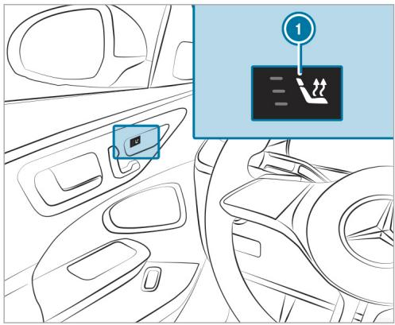  
驾驶舱和后排的座椅加热器

驾驶舱内车门操作单元中的座椅加热器（示例）

反复按下相应座椅的按钮 $\textcircled{8}$ ，直至达到所需的加热档位。  
根据加热档位的不同，最多可亮起三个指示灯。如果所有指示灯均熄灭，表示座椅加热器已关闭。

$\textcircled{1}$ 8分钟、10分钟和32分钟过后，座椅加热器将从三个加热档位自动向下切换，直至座椅加热器关闭。

$\textcircled{ i}$ 如果您关闭电源并在20分钟内再次将其开启，则之前的驾驶员座椅加热器设定将保持启用。

$\textcircled{ i}$ 您可通过MBUX智能人机交互系统设定前排座椅座垫和靠背加热部位的热量分配第107页)。

# 后排颈部加热器

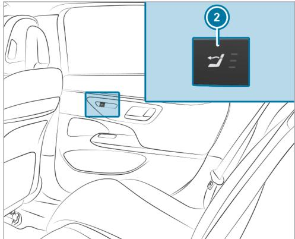

反复按下相应座椅的按钮 $\textcircled{6}$ ，直至达到所需的颈部加热档位。  
根据加热档位的不同，最多可亮起三个指示灯。如果所有指示灯均熄灭，表示颈部加热器已关闭。

$\textcircled{ i}$ 8分钟、10分钟和32分钟过后，颈部加热器将从三个加热档位自动向下切换，直至座椅加热器关闭。

$\textcircled{1}$ 可以通过MBUX智能人机交互系统将颈部加热器与后排座椅加热器连接起来第107页)。

# 开启/关闭座椅通风

# 要求

·电源开启。

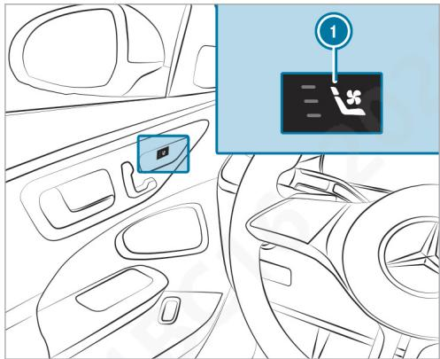

反复按下相应座椅的按钮 $\textcircled{6}$ ，直至达到所需的鼓风机设定。  
根据鼓风机设定的不同，最多将亮起三个指示灯。如果所有指示灯均熄灭，表示座椅通风已关闭。

$\textcircled{ i}$ 如果您关闭电源并在20 分钟内再次将其开启，则之前的驾驶员座椅通风设定将保持启用。

# 方向盘

# 手动调节方向盘

A 警告行车时调节车辆设定造成的事故凤险

以下情况尤其可能导致您失去对车辆的控制：

·您在行车过程中调节驾驶员座椅、头枕、方向盘或后视镜  
·您在行车过程中系安全带

启动车辆前：特别要调节驾驶员座椅、头枕、方向盘和后视镜并系安全带。

警告儿童调节方向盘时造成的夹伤风险

如果儿童调节方向盘，可能会伤及自己。

切勿将儿童单独留在车内无人看管。离开车辆时，务必随身携带钥匙并锁止车辆。

# 解锁

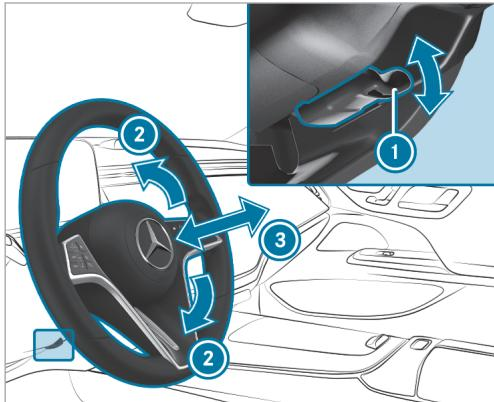

折下释放拉杆 $\textcircled{8}$ 至止动位。  
调节高度 $\textcircled{6}$ 以及与方向盘之间的距离$\textcircled{8}$ 。

# 锁止

折起释放拉杆 $\textcircled{8}$ 至止动位。  
通过移动方向盘检查并确保转向柱锁止。

# 电动调节方向盘

警告 行车时调节车辆设定造成的事故凤险

以下情况尤其可能导致您失去对车辆的控制：

·您在行车过程中调节驾驶员座椅、头枕、方向盘或后视镜  
·您在行车过程中系安全带

启动车辆前：特别要调节驾驶员座椅、头枕、方向盘和后视镜并系安全带。

、警告儿童调节方向盘时造成的夹伤风险

如果儿童调节方向盘，可能会伤及自己。

切勿将儿童单独留在车内无人看管。离开车辆时，务必随身携带钥匙并锁止车辆。

这也适用于电子车钥匙。  
当电源断开时可调节方向盘。

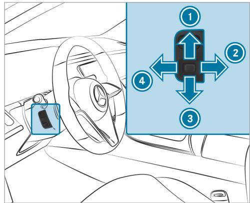

$\textcircled{6}$ 向上移动

$\textcircled{6}$ 向后移动

$\textcircled{6}$ 向下移动

$\textcircled{9}$ 向前移动

使用记忆功能保存设定 第114页)。

# 将方向盘加热器与座椅加热器分离

# 要求：

·已接通电源或启动车辆。  
·方向盘加热器与座椅加热器已连接。

# MBUX智能人机交互系统：

舒适性座椅

# 加热设定

默认情况下，该功能处于激活状态，当开启和关闭座椅加热器时，方向盘加热器会自动激活和停用。

点击 开启方向盘加热。

方向盘加热器将与座椅加热器分离。

# 方便出入功能

# 使用方便出入功能

A 警告 在方便出入功能调节过程中起步时存在事故风险

可能导致您失去对车辆的控制。

务必等调节过程完成后才起步。

配备记忆功能的车辆：您可通过按下任意一个记忆功能位置开关来停止调节过程。

A 警告 儿童启用方便出入功能时的被夹凤险

如果儿童启用方便出入功能，其可能会被夹到，尤其是在无人看管时。

切勿将儿童单独留在车内无人看管。离开车辆时，务必随身携带钥匙并锁止车辆。

要使用方便出入功能，必须先开启自动座椅调节功能 第107页)。

方便出入功能启用时，方向盘和驾驶员座椅将按以下方式移动：

·方向盘将向上移动。  
·驾驶员座椅将向前或向后移至便于上下车的位置。

这将在以下情况下发生：

·在驾驶员侧车门开启时关闭车辆。  
·在车辆关闭时开启驾驶员侧车门。

$\textcircled{1}$ 仅当方向盘未达到最高高度时，才会向上移动。只有当驾驶员座椅未处于便于上下车的理想位置时，才会向前或向后移动。

在以下情况下，方向盘和驾驶员座椅将移回至最后一个驾驶位置：

·在驾驶员侧车门关闭时开启电源或启动车辆。·当车辆启动时关闭驾驶员侧车门。

在以下情况下，将存储最后一个驾驶位置：

·关闭车辆。  
·配备记忆功能的车辆：通过记忆功能调出座椅设定。

配备记忆功能的车辆：按下其中一个记忆功能位置开关，以停止调节过程。

# 设定方便出入功能

# 要求：

·自动座椅调节已启用 第107页)。

MBUX智能人机交互系统：

设定ン车辆

# 方便出入功能

选择方向盘和座椅、仅方向盘或关闭。

$\textcircled{1}$ 如果使用定制用户配置文件，则此信息将用于方便出入功能。这将使驾驶员座椅和方向盘自动移至正确位置。

# 记忆功能

# 记忆功能

A 警告行车时使用记忆功能造成的事故风险

如果行车时使用驾驶员侧的记忆功能，则所进行的调节可能导致您失去对车辆的控制。

请只在车辆处于静止状态时使用驾驶员侧的记忆功能。

警告使用记忆功能设定座椅时的夹伤凤险

当使用记忆功能调节座椅时，您和其他车辆乘员(尤其是儿童)可能被夹。

在记忆功能设定过程中，请确保身体各部位未处于座椅或方向盘的移动范围内。  
如果有人被夹住，请立即按下预设位置按钮或座椅调节开关。  
调节过程停止。

■警告儿童启用记忆功能时有被困住的危险

儿童启用记忆功能时，可能会被困住，尤其是在儿童无人看管的情况下。

切勿将儿童单独留在车内无人看管。离开车辆时，务必随身携带钥匙并锁止车辆。

当车辆关闭时可使用记忆功能。  
记忆功能仅在配备记忆组件的车辆上可用。

使用记忆功能可存储并调出最多三个人的座椅调节。

您可为前排座椅保存以下设定：

·座椅、靠背和头枕的位置以及腰部的座椅靠背仿形  
·座椅加热：座垫和座椅靠背加热部位的分配驾驶员侧：方向盘位置、驾驶员侧和前排乘客侧车外后视镜位置  
·平视显示系统

# 操作记忆功能

# 存储

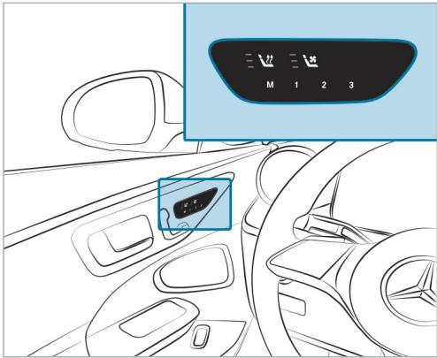

调节前排座椅、方向盘、平视显示系统和车外后视镜至所需位置。

按下按钮M，然后松开。

在3 秒钟内按下其中一个预设位置按钮1、「2或3。

响起一声信号音。设定已保存。

调出：按下预设位置按钮1、2或3。

座椅移至存储位置。松开按钮后，前排座椅、车外后视镜、平视显示系统和转向柱继续自动移入存储位置。

# 存储空间

# 关于装载车辆的注意事项

A危险废气中毒风险内燃机会排出一氧化碳等有毒废气。发动机运转时，尤其在车辆行驶过程中，如果行李箱盖开启，则排出的废气可能进入车内。

开启行李箱盖前，务必关闭发动机。  
请勿在行李箱盖开启的情况下驾驶。

气囊触发区域内的物品可能妨碍气囊正确运作。请遵守有关气囊的注意事项

第57页)。

A 警告 由车内未固定物品造成的伤害风险

如果物品、行李或装载物未固定或未充分固定，则其可能滑落、倾翻或被抛起并由此击中车辆驾驶员及乘客。

特别是在紧急制动或突然转向时，存在伤害风险。

务必妥善存放物品，使其不会被抛起。  
行车前，固定物品、行李或装载物，防止其滑落或倾翻。

# A警告未正确存放物品造成的伤害风险

如果车内物品存放不当，则其可能滑动或被抛起，从而撞到车辆驾驶员及乘客。此外，杯座、开放式储物空间和移动电话支架无法始终固定其中的所有物品。

特别是在紧急制动或突然转向时，存在伤害风险。

务必妥善存放物品，使其在这种情况下不会被抛起。

务必确保物品没有从储物空间、行李网或储物网中伸出。  
行车前，请关闭可锁止储物空间。务必将重物、硬物、尖物以及锋利、易碎或过大的物品存放并牢固固定在行李箱内。

警告 驾驶员和前排乘客脚部位置的物品造成的事故风险

驾驶员和前排乘客脚部位置的物品可能会妨碍踏板行程或绊阻已踩下的踏板。

这样会危及车辆的操作安全性和行驶安全性。

牢固存放车内的所有物品，确保他们不会进入驾驶员或前排乘客脚部位置。  
始终确保踏板有足够的自由空间。  
务必按照描述牢固安装脚垫。  
请勿使用松动的脚垫且勿叠放脚垫。

# 配备前排乘客前置气囊自动停用系统的车

辆：夹在前排乘客座椅下方的物体可能会干扰前排乘客前置气囊自动停用系统的功能或损坏系统。因此，请遵守有关前排乘客前置气囊自动停用系统功能的注意事项

第49 页)。

A 警告行车时使用杯座造成的事故或伤害风险

行车时，杯座无法固定容器。

如果您在行车时使用杯座，则容器可能被抛起且液体可能溅出。车辆驾驶员及乘客可能接触到液体并在液体很热时被烫伤。您可能分散对交通状况的注意力并可能失去对车辆的控制。

仅当车辆处于静止状态时才能使用杯座。仅将杯座用于尺寸合适的容器。关闭容器，尤其当液体很热时。

# 注意事项对杯座造成的损坏

折回后排座椅扶手时，可能会损坏杯座。  
打开时，杯座可能会被乘员身体压坏。

仅当杯座合上时，才可折回后排座椅扶手。

切勿在杯座打开时坐在杯座上或用杯座支撑身体。

注意事项溢出的液体对车辆造成的损坏

如果液体溢到车内，则可能会损坏车辆的零部件。

请始终牢牢关闭您携带的装有液体的容器。如果液体溢出，请尽快清洁车辆。如果有大量液体溢出，请将车辆送至具有资质的专业服务中心进行检查。

注意事项 由于体重导致后排座椅扶手损坏

后排座椅扶手展开时，乘员自身体重可能会导致其损坏。

切勿坐在或倚靠在后排座椅扶手上。

注意事项对行李箱底板内拉手造成的损坏

如果行李箱中的拉手保持伸出，则拉手可能损坏。

关闭行李箱盖前，请取下拉手，然后再次向下按压关闭。

注意事项 由于温度较高，对烟灰缸下方的储物箱造成的损坏

烟灰缸下方的储物箱不耐热，如果将点燃的香烟放在上面，则其可能损坏。

确保烟灰缸完全卡入。

A 警告排气管和排气管饰件造成的烫伤凤险

排气管和排气管饰件可能变得非常烫。如果您接触到这些车辆部件，可能会被烫伤。

在排气管和排气管饰件周围时，务必格外小心，并在此区域严密监护儿童。

接触这些车辆部件前，应先让其冷却。

$\textcircled{1}$ 皮革是一种天然产品。它具有天然的表面特性，例如构造差异、生长和损伤造成的痕迹或细微的色差。这些表面特征是皮革特有的，并非材料缺陷。皮革的表面特征还会随着自然老化而发生改变。

车辆的操控性与车内的载荷分布状况有关。因此，装载车辆时请谨记：

·切勿让包括乘员在内的有效载荷超过车辆的最大允许总质量或允许车轴载荷。这些数值标在车辆铭牌上 第366页)。·装载物高度切勿超过座椅靠背的上边缘。·如有可能，务必要将装载物放在未被占用的座椅后面。·使用捆扎环固定装载物并均匀分配张力。

# 在车顶负载状态下行驶时的注意事项

·均匀分布车顶载荷和车辆载荷，并将重物放在底部。还应遵守有关装载车辆的注意事项。

·小心驾驶。避免突然启动、制动和转向操作或快速转弯。

·当运输车顶装载物或车辆满载或满员时，请选择驾驶模式或。这些配置可实现良好的稳定性 第167页)。

# 车辆内部的储物空间

# 前排储物格概述

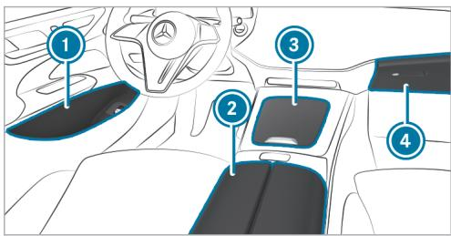

$\textcircled{8}$ 车门上的储物空间$\textcircled{6}$ 扶手下方带USB 接口的储物格和电话存放箱

$\textcircled{6}$ 前排中央控制台上带杯座、USB 端口和移动电话无线充电模块的储物格，取决于车辆版本

$\textcircled{9}$ 手套箱

$\textcircled{ i}$ 扶手下的储物格 $\textcircled{6}$ 和中央控制台中的储物格 $\textcircled{6}$ 通过一条信道连接，因此电缆可以从其中穿过。例如，这样可以将用于连接设备的USB连接线存放在两个储物格中。

$\textcircled{ i}$ 前排中央控制台内储物格 $\textcircled{6}$ 的橡胶垫可以取下并用干净的温水清洗。请遵守车内护理说明 第327页)。

# ■开启和关闭前排中央控制台内的储物箱

# A 警告未正确存放物品造成的伤害风险

如果车内物品存放不当，则其可能滑动或被抛起，从而撞到车辆驾驶员及乘客。此外，杯座、开放式储物空间和移动电话支架无法始终固定其中的所有物品。

特别是在紧急制动或突然转向时，存在伤害风险。

务必妥善存放物品，使其在这种情况下不会被抛起。

务必确保物品没有从储物空间、行李网或储物网中伸出。

行车前，请关闭可锁止储物空间。

务必将重物、硬物、尖物以及锋利、易碎或过大的物品存放并牢固固定在行李箱内。

请遵守关于装载车辆的注意事项。

国开启：使用拉手 $\textcircled{8}$ 沿箭头方向向前滑动前排中央控制台内储物箱的护盖至止动位。

关闭：向前轻推前排中央控制台内储物箱开启护盖的拉手 $\textcircled{8}$ 。

前排中央控制台内的储物箱护盖将自动关闭。

# 锁止/解锁手套箱

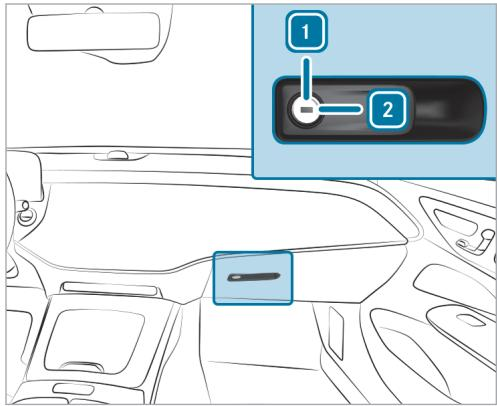

沿顺时针方向（锁止）或逆时针方向（解锁）转动紧急钥匙四分之一圈。

# 开启后排座椅扶手内的储物箱

A警告未正确存放物品造成的伤害风险如果车内物品存放不当，则其可能滑动或被抛起，从而撞到车辆驾驶员及乘客。此外，杯座、开放式储物空间和移动电话支架无法始终固定其中的所有物品。

特别是在紧急制动或突然转向时，存在伤害风险。

务必妥善存放物品，使其在这种情况下不会被抛起。  
务必确保物品没有从储物空间、行李网或储物网中伸出。  
行车前，请关闭可锁止储物空间。务必将重物、硬物、尖物以及锋利、易碎或过大的物品存放并牢固固定在行李箱内。

请遵守关于装载车辆的注意事项。

注意事项由于体重导致后排座椅扶手损坏

后排座椅扶手展开时，乘员自身体重可能会导致其损坏。

切勿坐在或倚靠在后排座椅扶手上。

所提供的后排座椅扶手和储物箱可能根据车辆装备而有所不同。

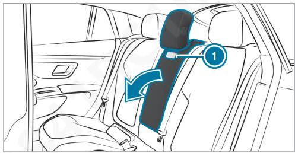

拉动把手 $\textcircled{6}$ 并折下后排座椅扶手。

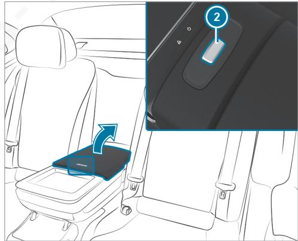

开启：按下解锁卡子 $\textcircled{6}$ 并向上翻起座椅扶手护盖。

# 挂钩概述

A 警告将挂钩用于重物造成的伤害风险挂钩无法固定重物或行李物件。

物品或行李物件可能会被抛起并碰到车辆驾驶员及乘客。

仅将轻便的物品挂在挂钩上。 请勿将硬物、边角锋利或易碎物品挂 在挂钩上。

请遵守有关装载车辆的注意事项

第114页)。

挂钩可承受最多3千克的负荷。请勿将其用于固定装载物。

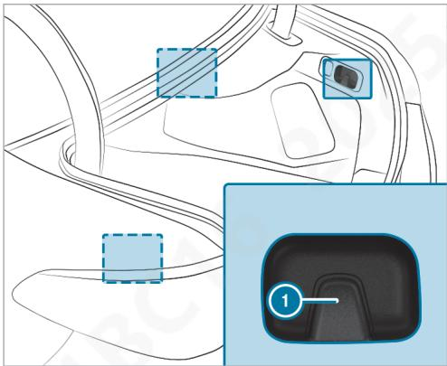

行李袋挂钩

# 杯座

# 安装或拆下中央控制台内的杯座

A 警告行车时使用杯座造成的事故或伤害风险

行车时，杯座无法固定容器。

如果您在行车时使用杯座，则容器可能被抛起且液体可能溅出。车辆驾驶员及乘客可能接触到液体并在液体很热时被烫伤。您可能分散对交通状况的注意力并可能失去对车辆的控制。

仅当车辆处于静止状态时才能使用杯座。仅将杯座用于尺寸合适的容器。关闭容器，尤其当液体很热时。

# A警告未正确存放物品造成的伤害风险

如果车内物品存放不当，则其可能滑动或被抛起，从而撞到车辆驾驶员及乘客。此外，杯座、开放式储物空间和移动电话支架无法始终固定其中的所有物品。如车内储物格、座椅底部、后备箱等狭小空间内放置或意外落掉压电式打火机等外部火种，在车辆行驶或操作过程中，存在意外触发压电式打火机的击发装置导致火灾事故的可能性。

特别是在紧急制动或突然转向时，存在伤害风险。

务必妥善存放物品，使其在这种情况下不会被抛起。  
务必确保物品没有从储物空间、行李网或储物网中伸出。  
行车前，请关闭可锁止储物空间。务必将重物、硬物、尖物以及锋利、易碎或过大的物品存放并牢固固定在行李箱内。

根据车辆版本的不同，可以在前排中央控制台的储物箱中使用杯座。

可以拆下杯座进行清洁。请遵守关于装载车辆的注意事项 第114页)。

# 插入杯座

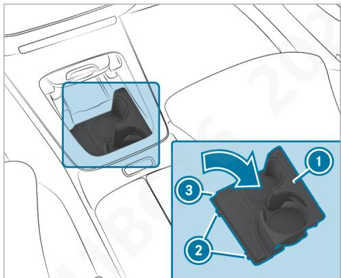

从拐角 $\textcircled{6}$ 处开始，插入杯座并转动到位，使两个凸耳 $\textcircled{6}$ 处于饰板的凹槽中。

将杯座转动到储物箱中并向下按下壳体$\textcircled{6}$ ，直至其卡入位。

# 取下杯座

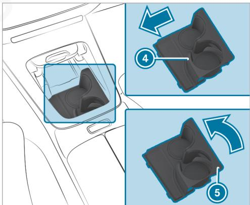

向左推动后饮料箱侧壁 $\textcircled{9}$ ，直至杯座松开。

利用拐角 $\textcircled{6}$ ，将杯座转出到左前侧。

清洁后重新插入杯座。

# 拆卸/安装插入垫

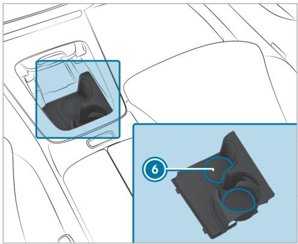

饮料箱杯座中的插入垫 $\textcircled{9}$ 可取下进行清洁。

拆卸：使用合适的工具从拆下的杯座后部将插入垫从其支座中推出。

安装：将插入垫按入杯座支座，直至其卡入位。

# 使用杯座

$\textcircled{1}$ 检查饮料罐是否被杯座牢靠固定。由于形状或尺寸的原因，一些饮料罐未充分固定在杯座中。

前部饮料箱侧壁可手动收回和伸出。

轻轻地将饮料罐推入饮料箱底部 $\textcircled{6}$ 侧壁将自动向左伸出，以固定饮料罐。

或者，可以通过轻按凹槽表面 $\textcircled{8}$ 伸出饮料箱侧壁。

# 收回侧壁

不使用前部饮料箱时，可以手动收回侧板。  
随后杯座的保持功能将不可用。

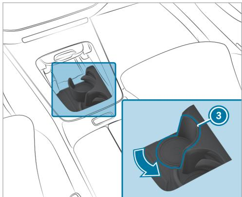

沿箭头方向推回侧板，直至其卡入正确位置 $\textcircled{8}$ 。

# 开启或关闭后排扶手内的杯座和小储物格

警告 行车时使用杯座造成的事故或伤害风险

行车时，杯座无法固定容器。

如果您在行车时使用杯座，则容器可能被抛起且液体可能溅出。车辆驾驶员及乘客可能接触到液体并在液体很热时被烫伤。您可能分散对交通状况的注意力并可能失去对车辆的控制。

仅当车辆处于静止状态时才能使用杯座。仅将杯座用于尺寸合适的容器。关闭容器，尤其当液体很热时。

<table><tr><td>注意事项由于体重导致后排座椅扶手 损坏</td></tr><tr><td>后排座椅扶手展开时，乘员自身体重可能</td></tr><tr><td>会导致其损坏。</td></tr><tr><td>切勿坐在或倚靠在后排座椅扶手上。</td></tr></table>

# ！ 注意事项对杯座造成的损坏

折回后排座椅扶手时，可能会损坏杯座。  
打开时，杯座可能会被乘员身体压坏。仅当杯座合上时，才可折回后排座椅扶手。  
切勿在杯座打开时坐在杯座上或用杯座支撑身体。

# 开启后排扶手内的小储物格

确保后排长座椅的中央头枕处于直立位置第106页)。

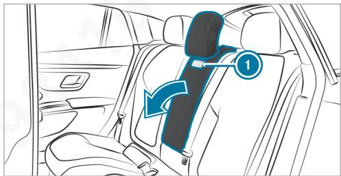

拉动把手 $\textcircled{6}$ 并折下后排扶手。

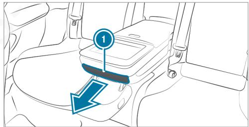

按下覆盖件 $\textcircled{6}$ 。  
小储物格将沿箭头方向开启。

$\textcircled{1}$ 请遵守关于装载车辆的注意事项第114页)。

# 关闭后排扶手内的小储物格

? 将小储物格滑回到后排扶手中。

# 开启或关闭后排座椅扶手杯座

开启：按下护盖饰板 $\textcircled{6}$ 两次。  
杯座将沿箭头方向开启。  
关闭：将杯座滑回到后排扶手中。

# 插座

# 使用前排乘客脚部位置的12伏插座

# 要求

·仅连接最大不超过180瓦（15安）的设备。

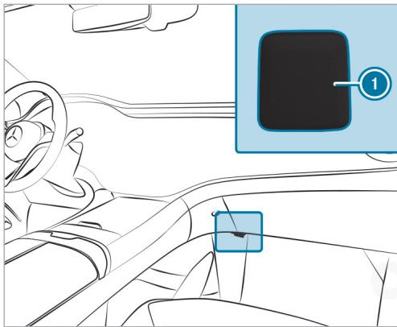  
前排乘客脚部位置的12伏插座

折起插座护盖 $\textcircled{8}$

插入设备插头。

使用插座时请确保没有电缆穿过或固定在气囊触发区域内。请遵守关于气囊的注意事项 第57页)。

# 使用USB接口

根据车辆配置的不同，车辆可能在以下位置配备USB 接口：

·前排中央控制台储物箱中·前排扶手下方的储物箱中·后排座椅扶手储物箱中

可使用合适的充电电缆通过USB接口为移动电话等USB设备充电。根据车辆配置的不同，当车辆启动时，车辆可充电至最高20伏（5安）。

# 在前排为移动电话无线充电

# 要求

·移动电话适合无线充电。

兼容移动电话列表可从以下位置找到：https://www.mercedes-benz-mobile.com/可以在车辆中央控制台的前排储物箱中为移动电话进行无线充电。

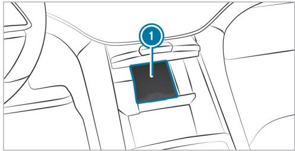

在前排储物箱中为移动电话进行无线充电尽可能将移动电话靠近垫子 $\textcircled{8}$ 中间放置，使显示屏朝上。

充电符号显示在MBUX智能人机交互系统上时，表示移动电话正在充电。此外，在移动电话充电过程中出现的故障显示在MBUX智智能人机交互系统显示屏上。

$\textcircled{1}$ 可拆下垫子进行清洁，例如使用干净的温水。

# 安装和拆卸脚垫

A 警告 驾驶员侧侧脚部位置的物品造成的事故风险

驾驶员侧脚部位置的物品可能会妨碍踏板行程或绊阻已踩下的踏板。

这样会危及车辆的操作安全性和行驶安全性。

牢固存放车内所有物品，确保它们不会进入驾驶员脚部位置。  
务必确保踏板有足够的间隙。  
务必按照描述牢固安装脚垫。  
请勿使用松动的脚垫且勿叠放脚垫。

# 安装脚垫

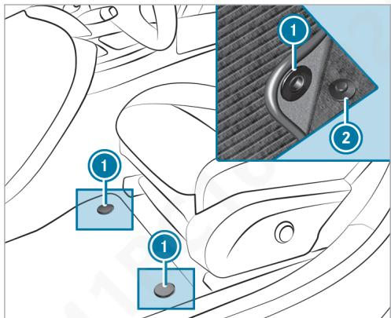

向后滑动相应座椅，将脚垫放在脚部位置并使其贴合。

将掀扣 $\textcircled{8}$ 按入固定器 $\textcircled{6}$ 。

调节相应座椅。

# 拆卸脚垫

向后滑动相应座椅，并将脚垫从托架 $\textcircled{6}$ 上拉下。

调节相应座椅。

# 车外照明

# 关于海外驾驶时的车灯调节注意事项

配备静态LED大灯的车辆：无需切换大灯。在行驶方向相反的国家或地区行驶时，这也符合法规要求。

# 配备智能数字大灯（DIGITALLIGHT）的车

辆：作为一种便捷功能，越过边界进入行驶方向相反的国家和地区后，大灯自动进行调节。如有必要，也可以在近光灯设定菜单中手动调节大灯 第133页)。

自动车灯调节功能的可用条件：

·如果选择了近光灯设定 菜单上的"自动"功能  
·如果导航和导航位置可用

在下列情况下，检查大灯设定并在必要时手动进行切换：

·如果仅可手动设定近光灯 (左侧通行/右侧通行)显示信息显示。  
·如果请检查 近光灯设定 (左侧通行/右侧通行)显示信息显示。

切换大灯后：

·不给对面来车造成眩光。  
·道路边缘照明的距离及高度降低。  
·高速公路模式和增强型雾灯功能不可用。

# 有关照明系统的信息以及您的责任

车辆的各个照明系统仅是辅助工具。车辆驾驶员有责任根据当前照明和可见性条件、法规要求和交通状况校正车辆照明。

# 照明开关

# 操作照明开关

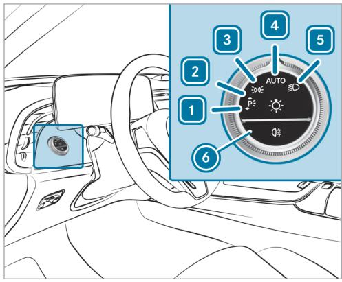

P左侧驻车灯  
② P右侧驻车灯  
③ $\boxed { \div 0 0 \div }$ 位置（侧）灯和车牌照明  
4 Auro自动行车灯（首选照明开关位置）

# 近光灯/远光灯

启用或停用后雾灯。

当近光灯启用时，位置（侧）灯指示灯00将停用并被近光指示灯D取代。

请务必根据相关法律规定利用充足的照明安全驻车。

注意事项操作位置（侧）灯会使蓄电池放电。在几个小时内不要开启位置（侧）灯。

在某些国家，对于宽度超过2米或长度超过6米的车辆，不允许使用单侧驻车灯。在这种情况下，在驻车灯位置还会开启位置（侧）灯。如果蓄电池充电不足，位置（侧）灯或停车灯将自动关闭，以便下次启动发动机。

如果驾驶员侧车门开启，则车外照明（位置（侧）灯和驻车灯除外）将自动关闭。

·请遵守有关定位照明的注意事项第133页)。

# 开启事故现场照明

关闭车辆。  
开启危险警告灯 第127页)。  
将照明开关从AU位置旋转至D 位置。  
尽管车辆已关闭，近光灯仍将开启。

在以下情况下，事故现场照明将被关闭：

·关闭了危险警告灯。  
·将照明开关旋转回至AuTo。  
·蓄电池充电不足。

# ■自动行车灯功能

车辆启动后，位置（侧）灯、近光灯和日间行车灯将根据照明情况自动开启。

A警告能见度差时关闭近光灯造成的事 故风险

当照明开关设定至uTo时，如果存在雾、雪或其他导致能见度差的因素，例如水花，则近光灯可能不会自动开启。

在类似情况下，将照明开关旋转至D

自动行车灯仅是一种辅助工具。驾驶员应负责车辆照明。

# ■开启/关闭后雾灯

# 要求

·照明开关位于D或u位置。

按下按钮。

请遵守相关国家有关后雾灯使用的法律规定。

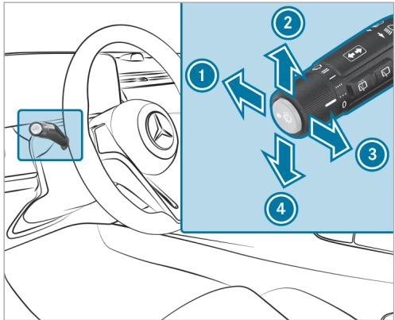  
操作照明组合开关

远光灯

$\textcircled{6}$ 右侧转向信号灯

® 大灯闪烁器

$\textcircled{6}$ 左侧转向信号灯

使用组合开关选择所需功能。

# 开启远光灯

将照明开关旋转至D或u位置。沿箭头?的方向推动组合开关。当远光灯启用时，近光灯指示灯D将停用并被远光灯指示灯D取代。

# 关闭远光灯

沿箭头?的方向推动或沿箭头 $\textcircled{6}$ 的方向拉动组合开关。

# 大灯闪烁器

1 沿箭头 $\textcircled{6}$ 的方向拉动组合开关。

# 转向信号灯

短暂指示：沿箭头或 $\textcircled{6}$ 的方向轻拨组合开关至阻力点。相应的转向信号灯将闪烁3次。

永久指示：沿箭头或 $\textcircled{8}$ 的方向拨动组合开关，使其越过阻力点。

配有变道辅助的车辆：

·由驾驶员启用的转向信号指示灯可在换道期间持续亮起。

·如果驾驶员事先及时指示换道，但是未能立即实现，转向信号指示灯可能会自动启用。

# 启用/停用危险警告灯

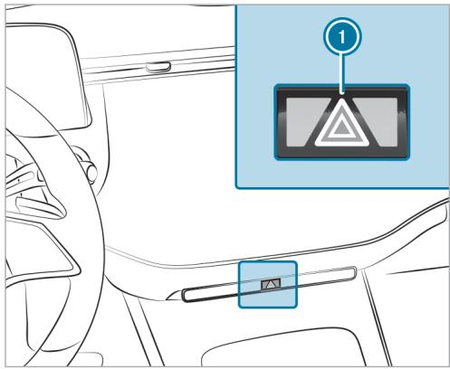

按下按钮 $\textcircled{8}$

在以下情况下，危险警告灯将自动开启：

·气囊已展开  
·紧急停止已启动 第215页)  
·车辆从70 公里/小时以上的车速紧急制动至静止。

再次起步时，在车速约为10公里/小时 时，危险警告灯系统将自动关闭。您也可以使用警告灯按钮关闭危险警告灯系统。

# 智能数字大灯（DIGITALLIGHT）自适应功能

# 】动态近光灯功能

利用此系统，大灯会根据驾驶状况和天气情况进行调节。此系统还具备光程扩大功能，以改善路面照明。

该系统包括以下功能：

·主动照明功能 第128页)·转角照明灯功能 第128页)·高速公路模式 第129页)·增强型雾灯功能 第129页)·恶劣天气照明功能 第129页)

·城市照明功能 第129页)·地形补偿功能 第129页)

该系统仅在外界光线昏暗时启用。

# 主动照明功能

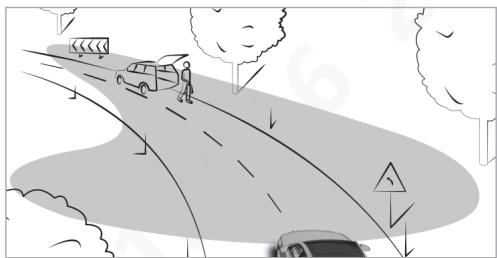

·大灯跟随转向移动。  
·行车时将为相关区域提供更好的照明。当近光灯开启时，此功能启用。  
根据车辆装备的不同，还将对本车道路线进行评估，并且主动照明功能将预先调节车灯。

# 转角照明灯功能

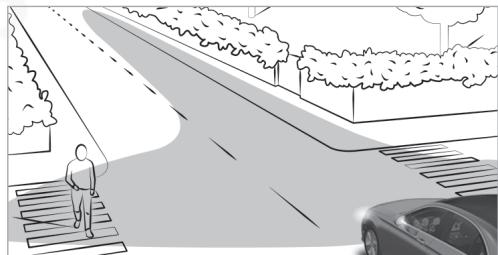

转角照明灯可改善车辆转弯方向上较大范围内的车道照明效果，例如可更容易看清急转弯范围内的情况。仅当近光灯开启时，转角照明灯功能才可启用。

在以下情况下，该功能将启用：

·开启转向信号灯后或转动方向盘时车速低于40公里/小时  
·转动方向盘时车速介于40 公里/小时 至70 公里/小时之间

环岛和交叉路口功能：通过评估车辆当前的导航位置，两侧的转角照明灯将启用。该功能保持启用，直至车辆驶离环岛或交叉路□。

# 高速公路模式功能

高速公路模式增加光束的光程和亮度，以改善可见度。

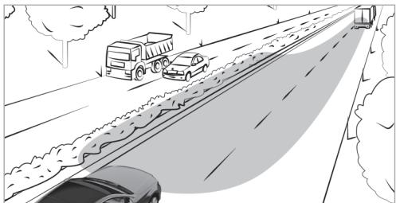

如已通过以下方式探测到高速公路行程，则此功能将启用：

·车速  
·多功能摄像头  
·导航系统

在以下情况下，该功能将不启用：

·车速低于80公里/小时

# 增强型雾灯功能

增强型雾灯功能可减少眩光，并改善车道边缘的照明。

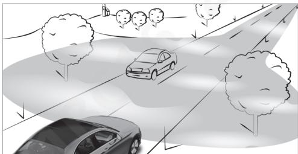

此功能在以下情况下自动启用：

·开启后雾灯且车速低于70公里/小时时。

此功能在以下情况下自动停用：

·当达到100 公里/小时 以上的车速时。  
·当后雾灯关闭时。

# 恶劣天气照明功能

恶劣天气照明通过调暗大灯中的各个区域减少雨天情况下的反射。从而减少对驾驶员及其他道路使用者造成眩目的情况。

# 城市照明功能

城市照明利用分布广泛的光线改善城市区域的路边照明。

在以下情况下，该功能将启用：

·在低车速下·在城市区域被照亮的部分

# 地形补偿功能

根据所提供的地图数据，照明系统提前对不同的道路高度做出响应。这意味着，当您驾车上坡或下坡行驶时，大灯光程实际上保持不变。

$\textcircled{1}$ 只有配备带导航功能的MBUX智能人机交互系统的车辆具有此功能。

# 聚光灯功能

聚光灯功能在后台运行且在探测到车道标记 内有行人时会通过4个短脉冲闪烁大灯。因

此，聚光灯功能可在危急情况下为驾驶员提供帮助。

在以下情况下，该功能将启用：

·在照明范围以外行驶时。·系统检测到车道标记。·远光灯辅助系统已启用

$\textcircled{1}$ 聚光灯功能在大雨期间会停用。

# ■启用/停用动态近光灯

# 要求：

·车辆已启动。

MBUX智能人机交互系统：

》 设定 照明 数字大灯

启用或停用动态近光灯。

启用/停用大灯闪烁提示功能

启用或停用聚光灯。

# 开启/关闭问候/道别投影

$\textcircled{1}$ 此功能的可用性因国家和地区而异。

$\textcircled{1}$ 聚光灯功能也可以直接在智能数字大灯（DIGITALLight）菜单中开启或关闭，具体取决于国家或地区。

启用或停用此功能。

如果启用了定位照明或车外照明延迟功能，当车辆被开启或关闭时，将短暂播放高分辨率的问候或告别投影。您可以在流星雨和璀璨星河序列之间进行选择。

$\textcircled{1}$ 有关定位照明功能的详细信息，请参见(→第133页)。有关车外照明延迟功能的详细信息，请参见 第133页)。

# 自适应远光灯辅助系统

# 自适应远光灯辅助系统功能

A 警告尽管有自适应远光灯辅助系统，仍存在事故风险

自适应远光灯辅助系统无法对以下情况作出响应：

·不带照明的道路使用者，例如行人

·照明条件差的道路使用者，例如骑自行车者

·照明受阻的道路使用者，例如由障碍物造成

在极少数情况下，自适应远光灯辅助系统可能无法识别或太迟识别其他带照明的道路使用者。

在此种或类似情况下，尽管存在其他道路使用者，自动远光灯仍将不停用或启用。

务必仔细注意道路及交通状况并及时关闭远光灯。

自适应远光灯辅助系统无法考虑道路、天气或交通状况。

在以下情况下，探测可能受限：

·视野不佳，例如有雾、下大雨或下雪时 ·传感器上有污垢或传感器被遮盖

自适应远光灯辅助系统仅是一种辅助工具。您负责根据当时的灯光、可见度和交通状况调节车辆照明。

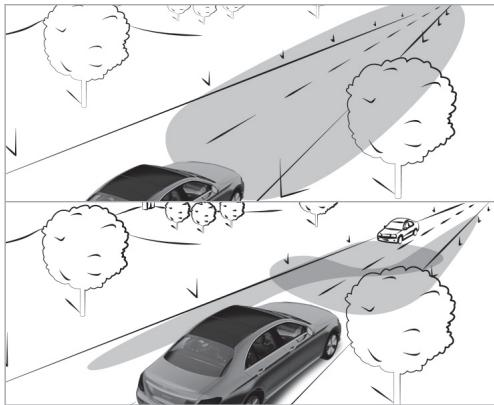

自适应远光灯辅助系统在以下车灯类型之间自动切换：

·近光灯 ·远光灯

当车速超过30 公里/小时：

·如果未探测到其他道路使用者，远光灯将自动开启。

在以下情况下，远光灯将自动关闭：

·车速低于25 公里/小时·探测到其他道路使用者时·道路照明充足时

$\textcircled{ i}$ 该系统的光学传感器位于风挡玻璃后面的上方控制面板附近。

# ■开启/关闭自适应远光灯辅助系统

# 开启

将照明开关旋转至AUTo位置。  
使用组合开关开启远光灯。  
如果启用了自适应远光灯辅助系统，驾驶员显示屏上的指示灯将亮起。

# 关闭

? 使用组合开关关闭远光灯。

# 自适应远光灯辅助系统增强版

# ■自适应远光灯辅助系统增强版功能

警告 忽视自适应远光灯辅助系统增强版造成的事故风险

自适应远光灯辅助系统增强版无法对以下情况作出响应：

·不带照明的道路使用者，例如行人  
·照明条件差的道路使用者，例如骑自行车者照明受阻的道路使用者，例如由障碍物造成

在极少数情况下，自适应远光灯辅助系统增强版可能无法识别或太迟识别其他带照明的道路使用者。

在此种或类似情况下，尽管存在其他道路使用者，自动远光灯仍将不停用或启用。

务必仔细注意道路及交通状况并及时关闭远光灯。

自适应远光灯辅助系统增强版无法考虑道路、天气或交通状况。

在以下情况下，探测可能受限：

·视野不佳，例如有雾、下大雨或下雪时 ·传感器上有污垢或传感器被遮盖

自适应远光灯辅助系统增强版仅是一种辅助工具。您负责根据当时的灯光、可见度和交通状况调节车辆照明。

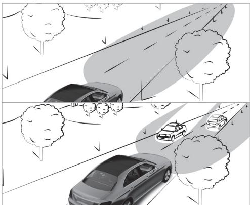

自适应远光灯辅助系统增强版在以下车灯类型之间自动切换：

·近光灯  
·部分远光灯·远光灯  
·远程远光灯

远程远光灯可将光束亮度扩大至接近相关法律规定允许的最大值。

部分远光功能不会照亮远光灯灯光范围内的其他道路使用者，不会眩花他们的眼睛，而是除了排除的车辆之外，为驾驶员提供充分的远光照明。强反光标志也会以较低的亮度被照亮。

车速低于25公里/小时 或道路照明充足时：

·部分远光灯和远光灯将自动关闭。

车速超过30 公里/小时时：

·如果未探测到其他道路使用者，远光灯将自动开启。  
·如果探测到其他道路使用者，部分远光灯将自动开启。

车速低于40 公里/小时 时：

·远程远光灯将自动关闭。

车速超过50 公里/小时 时：

·如果在平直道路上且雨量不大的情况下行驶时未探测到其他道路使用者，远程远光灯将自动开启。  
·如果探测到其他道路使用者，远程远光灯将自动关闭且部分远光功能将开启。  
·如果探测到强反光迹象，远程远光灯将自动关闭。  
$\textcircled{1}$ 该系统的光学传感器位于风挡玻璃后面的上方控制面板附近。

# ■开启/关闭自适应远光灯辅助系统增强版

# 开启

将照明开关旋转至AuTo位置。

使用组合开关开启远光灯。

如果启用了自适应远光灯辅助系统增强版，驾驶员显示屏上的指示灯将亮起。当部分远光灯或远光灯启用时，相应的蓝色指示灯也将亮起。

# 关闭

使用组合开关关闭远光灯。

# 设定近光灯

MBUX智能人机交互系统：

设定 照明数字大灯

近光灯设定

选择右侧通行、左侧通行或自动。

# 设定车外照明延时关闭

MBUX智能人机交互系统：

设定ン照明

车内照明/车外照明

车外照明延时关闭

设定照明延时关闭。  
当车辆的发动机关闭时，车外照明将在设定时间内保持启用状态。

# 启用/停用定位照明

MBUX智能人机交互系统：

设定ン照明

# 车内照明/车外照明

启用或停用定位照明。

如果该功能启用，当车辆停驻且未锁止时，车外照明将在车辆解锁或驾驶员侧车门开启后保持亮起40秒钟。当您启动车辆时，定位照明将停用且自动行车灯启用。

# 车内照明

# 调节车内照明

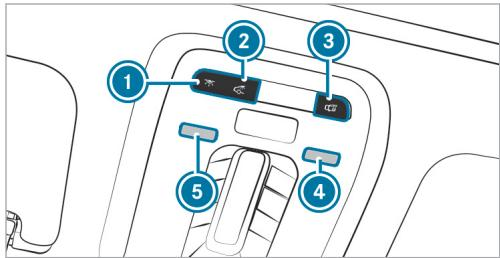

$\textcircled{6}$ $\varpi$ 开启/关闭前排车内照明。

开启/关闭后排车内照明。

开启/关闭自动车内照明控制。

开启/关闭阅读灯：将手放在相应的阅读

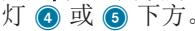

# 把手中的操作单元(后部)

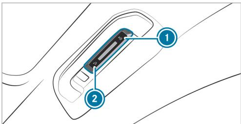

英车辆相应侧的阅读灯后排车内照明

开启阅读灯：按下按钮 $\textcircled{6}$   
阅读灯、把手内的车内照明和车辆相应侧的顶灯将亮起。关闭阅读灯：按下按钮①一次或两次。按下一次时，把手内的车内照明和车辆相应侧的顶灯将熄灭。  
按下两次时，车辆相应侧的阅读灯将熄灭。

开启/关闭后排车内照明：按下按钮 $\textcircled{6}$ 。阅读灯、把手内的车内照明和车辆两侧的顶灯将亮起或熄灭。

# 调节环境氛围照明系统

MBUX智能人机交互系统：

舒适性 氛围灯

# 设定颜色

选择颜色。  
选择单色彩或多色彩。  
设定所需颜色或配色方案。

# 调节亮度

选择亮度。调节亮度。$\textcircled{1}$ 根据环境照明条件，环境氛围照明系统自动在白天和夜晚模式之间切换。

# 启用分区亮度

选择亮度。

关闭多区同步。

可单独设定直接、间接和聚焦区域。

$\textcircled{ i}$ 在配备主动式环境氛围灯的车辆中，也可设定灯带区域。

# 启用效果

警告如果未开启环境照明和主动式环境照明效果，则存在事故风险

只有在驾驶辅助菜单中开启相应的驾驶或驾驶安全系统时，警告辅助效果才会完全激活。

确保相应的驾驶或驾驶安全系统已开启。

$\textcircled{ i}$ 请遵守有关驾驶系统的注意事项和您的责任，您可能无法识别危险第195页)。

$\blacktriangleright$ 选择效果。  
$\blacktriangleright$ 启用所需效果。

$\textcircled{1}$ 根据车辆配备可使用不同效果。

# 操作反馈效果

气候：如果更改车内温度设定，环境照明灯光的颜色会暂时变化。  
·读心语音助理：对于配备主动式环境氛围灯的车辆，以视觉动画形式提供读心语音助理。  
·欢迎：当您进入车内时，会播放独特的彩色动画。

# 警告辅助效果

·开门警示功能：下车时，如果在盲区内探测到物体，相应车门内的环境氛围照明系统将会以红色闪烁。有关开门警示功能的详细信息，请参见第231页)。  
车道保持辅助：如果主动式车道保持辅助系统发出警告，则主动式环境氛围灯以红色闪烁。  
主动式紧急制动：如果主动式制动辅助系统发出警告，则驾驶舱中央的主动式环境氛围灯以亮红色闪烁。

有关主动式紧急制动的详细信息，请参见 第221页)。

·主动式侧面盲点辅助：在配备主动式环境氛围灯的车辆中，如果主动式侧面盲点辅助发出警告，受影响一侧的环境氛围照明系统将以红色闪烁。有关主动式侧面盲点辅助的详细信息，请参见 第230页)。智能泊车驻车定位系统：进行驻车操作时，来自驻车传感器的信息以彩色显示。有关智能泊车驻车定位系统 的详细信息，请参见： 第242页)

# 动态多色彩

·所选的颜色组合将以预定义的时间间隔变化。

# 随音悦动

·声音可视化功能根据选定的车灯颜色以视觉形式突出声音内容。  
$\textcircled{1}$ 在配备主动式环境氛围照明系统的车辆中，会播放动画。

$\textcircled{1}$ 所需的操作反馈和警告辅助可在调用的菜单上通过符号启用或停用。根据装备情况，提供不同的操作反馈和警告辅助效果。

$\textcircled{1}$ 如果亮度设定为低级别，警告动画会以较高的基本亮度显示。

# 开启/关闭车内照明延时关闭

MBUX智能人机交互系统：

设定 照明

车内/车外照明 车内照明延时关闭

启用或停用车内照明延时关闭。如果此功能处于已启用状态，则在行程结束后，车内照明将开启一小段时间。

# 风挡玻璃雨刮器和风挡玻璃清洗系统

# 开启/关闭风挡玻璃雨刮器

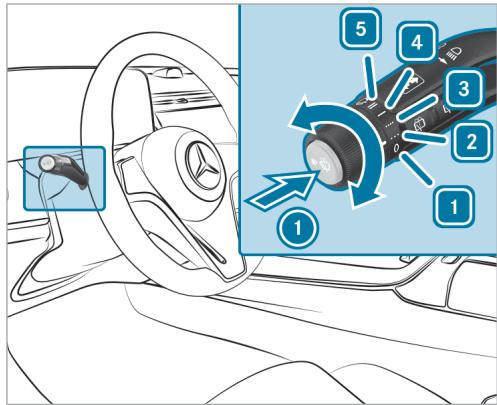

回风挡玻璃雨刮器关闭  
② … 自动刮水，标准  
③ 自动刮水，频繁  
4 持续刮水，慢速持续刮水，快速

将组合开关旋转至相应位置-。

]一次刮水：按下按钮 $\textcircled{8}$ 至阻力点。

用清洗液刮扫：按下按钮 $\textcircled{8}$ 越过阻力点。

$\textcircled{1}$ 请遵守有关在洗车装置中清洗车辆的注意事项 第322页)。

# 更换风挡玻璃雨刮器叶片

警告 更换雨刮器叶片时风挡玻璃雨刮器开启的被夹风险

如果更换雨刮器叶片时风挡玻璃雨刮器开始移动，则您可能会被雨刮器臂夹住。

更换雨刮器叶片前，一定要关闭风挡玻璃雨刮器和车辆。

# 将雨刮器臂移至更换位置

启动车辆，然后立即再次将其关闭。在约15 秒钟内按住组合开关上的按钮约3秒钟 第136页)。雨刮器臂将移入更换位置。

$\textcircled{ i}$ 取决于车辆的生产时间，可能采用了不同类型的雨刮器叶片。

# 拆下雨刮器叶片 (类型1)

将雨刮器臂从风挡玻璃上折起。

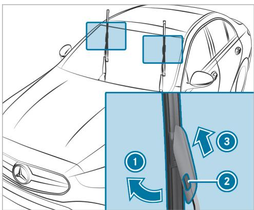

用一只手握住雨刮器臂。用另一只手沿箭头 $\textcircled{8}$ 的方向将雨刮器叶片转离雨刮器臂至止动位。

按下释放旋钮 $\textcircled{6}$

按箭头方向 $\textcircled{8}$ 从雨刮器臂上拆下雨刮器叶片。

# 拆下雨刮器叶片 (类型2)

将雨刮器臂从风挡玻璃上折起。

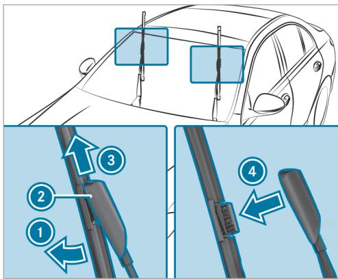

用一只手握住雨刮器臂。用另一只手沿箭头①的方向将雨刮器叶片转离雨刮器臂至止动位。

沿箭头 $\textcircled{6}$ 方向滑动卡子，直至其卡入取出位置。

沿箭头 $\textcircled{9}$ 的方向从雨刮器臂拆下雨刮器叶片。

# 安装雨刮器叶片 (类型1)

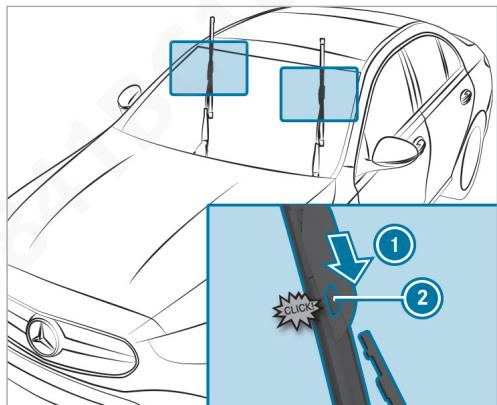

将新雨刮器叶片沿箭头 $\textcircled{8}$ 的方向推到雨刮器臂中，直至释放旋钮 $\textcircled{6}$ 卡入位。

确保雨刮器叶片正确就位。  
将雨刮器臂折回到风挡玻璃上。  
开启车辆。  
按下组合开关上的按钮「。  
雨刮器臂将返回至原来的位置。  
关闭车辆。

# 安装雨刮器叶片 (类型2)

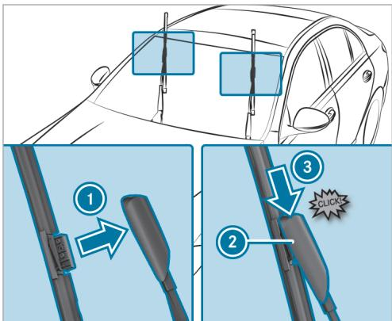

沿箭头 $\textcircled{6}$ 方向将新雨刮器叶片插入雨刮器臂。

沿箭头 $\textcircled{6}$ 方向滑动卡子 $\textcircled{6}$ ，直至其卡入锁止位置。

确保雨刮器叶片正确就位。

将雨刮器臂折回到风挡玻璃上。

开启车辆。  
按下组合开关上的按钮。  
雨刮器臂将返回至原来的位置。  
关闭车辆。

# 保养指示器

新安装的雨刮器叶片尖端有一个保养指示器。

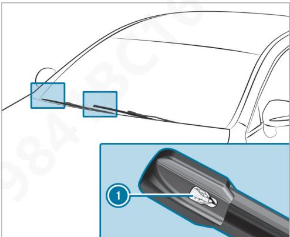

除去保养指示器上的保护膜 $\textcircled{8}$ 。

保养指示器的颜色由黑色变为黄色时，应更换雨刮器叶片。

# 后视镜

# 操作车外后视镜

A 警告行车时调节车辆设定造成的事故凤险

以下情况尤其可能导致您失去对车辆的控制：

·您在行车过程中调节驾驶员座椅、头枕、方向盘或后视镜  
·您在行车过程中系安全带启动车辆前：特别要调节驾驶员座椅、头枕、方向盘和后视镜并系安全带。

A 警告使用车外后视镜时错误判断距离造成的事故风险

车外后视镜以较小比例反射物体。视图中的物体比其实际位置更近。

因此，务必在确保交通状况安全的情况下转过头，确保您了解您和在您后方行驶的道路使用者之间的实际距离。

# 调节车外后视镜

使用按钮 $\textcircled{6}$ 调节所选后视镜的位置。

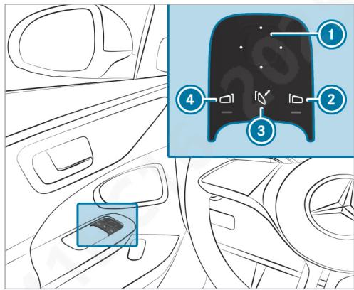

使用按钮 $\textcircled{6}$ 或 $\textcircled{9}$ 选择所需的后视镜。

$\textcircled{1}$ 在配有智能感应助理和驾驶员摄像头的车辆中，所需的车外后视镜也可以通过向左或向右的自然头部运动自动预选第281页)。

# 折合/展开车外后视镜（配有电动折叠式车外后视镜的车辆）

点按按钮 $\textcircled{8}$ 0

$\textcircled{1}$ 如果蓄电池已经断开或电量耗尽，则必须使用按钮 $\textcircled{6}$ 稍微移动车外后视镜。只有如此，自动后视镜折叠功能才能正常运作。

# 接合车外后视镜

如果强行分离了车外后视镜，则按如下步骤操作。

未配备电动折叠车外后视镜的车辆：手动将车外后视镜移入正确位置，直至听到卡入位的声音。配备电动折叠车外后视镜的车辆：按住按钮 $\textcircled{6}$ 。您将听到咔哒声和后视镜卡入位的声音。此时，车外后视镜将设定至正确位置。

# 自动防眩后视镜功能

警告 防眩后视镜电解液造成的酸液灼伤和中毒风险

如果自动防眩后视镜上的玻璃破碎，则电解液可能溢出。

电解液有害健康并可造成刺激。不得与您的皮肤、眼睛、呼吸器官或衣物接触或吞食。

如果您接触到电解液，请遵守以下各项：

·立即冲洗皮肤上的电解液并立即就医。  
）如果眼睛接触到电解液，应立即用清水彻底洗净并就医。如果意外吞下电解液，请立即彻底清洗口腔，不要引吐。然后立即就医。  
，立即更换被电解液污染的衣物。  
·如果出现过敏反应，请立即就医。

如果大灯光线射入车内后视镜上的传感器，则驾驶员侧车内后视镜和车外后视镜将自动进入防眩模式。

# 系统限制

在下列情况下，系统将不会进入防眩模式：

·车辆关闭。  
·已挂入倒档。  
·车内照明已开启。

# 前排乘客侧车外后视镜驻车位置功能

$\textcircled{1}$ 驻车位置仅在配备记忆功能的车辆上可用。

驻车位置可方便驻车。

在以下情况下，前排乘客侧车外后视镜将沿着前排乘客侧的后轮方向向下旋转：

已存储驻车位置 第141页)。已选定前排乘客侧后视镜。·已挂入倒档。

在以下情况下，前排乘客侧车外后视镜将移回至原来的位置：

·将变速箱切换至另一档位。  
·行驶速度超过15 公里/小时。  
·按下驾驶员侧车外后视镜按钮。

# 利用倒档存储前排乘客侧车外后视镜的驻车位置

# 存储

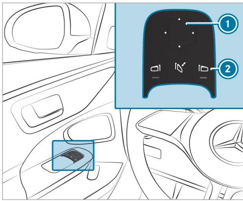

使用按钮 $\textcircled{6}$ 选择前排乘客侧车外后视镜。

挂入倒档。

使用按钮 $\textcircled{8}$ 将前排乘客侧车外后视镜移入所需驻车位置。

# 调出

使用按钮 $\textcircled{6}$ 选择前排乘客侧车外后视镜。

挂入倒档。

前排乘客侧车外后视镜将移至存储的驻车位置。

# 启用/停用自动折叠后视镜功能

MBUX智能人机交互系统：

设定 车辆 开启/关闭

启用或停用自动折叠后视镜。

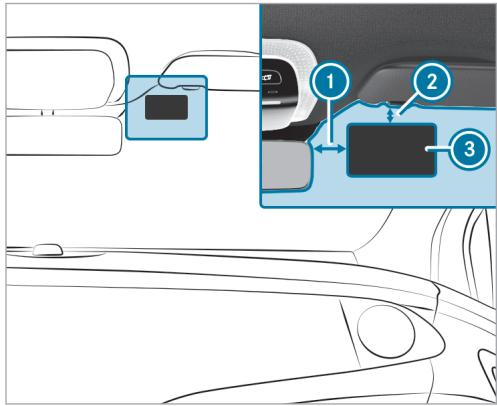  
有关汽车电子标识安装位置的信息

$\textcircled{6}$ 距车内后视镜后部护盖的间距：20毫米  
$\textcircled{6}$ 距车顶内衬的间距：10 毫米  
$\textcircled{6}$ 汽车电子标识

# 智能气候控制系统概述

# 有关智能气候控制的注意事项

为了使空调系统、污染水平监测系统和空气过滤功能能够正常工作，请务必使用发动机舱内带有预过滤器的车内空气滤清器。请使用经梅赛德斯-奔驰推荐和认可的滤清器。请务必在具有资质的专业服务中心进行保养工作。

# 自动空调（THERMATIC）气候控制栏概述

指示灯指示相应的已启用功能。

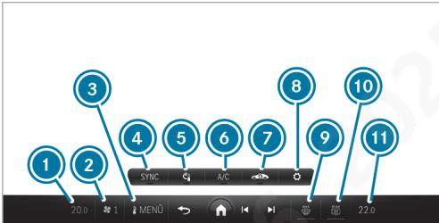

中央显示屏上的前排气候栏（示例）。气候栏显示取决于设定。

$\textcircled{6}$ 升高/降低温度 (驾驶员侧)

增大或减小气流或开启智能气候控制（驾驶员侧） 第144页)

$\textcircled{6}$ MEN调出空调菜单 第145页)

$\textcircled{9}$ SYNC同步功能 第147页)

$\textcircled{6}$ 开启/关闭智能气候控制

第144页)

$\textcircled{5}$ A开启/关闭空调功能 第146页)

$\textcircled{6}$ 开启/关闭空气内循环模式第147页)或调出细颗粒物状态显示 第145页)

风挡玻璃除霜

$\textcircled{4}$ 示例：开启/关闭后车窗加热器。此按钮可以在设定项下单独分配。

$\textcircled{4}$ 升高/降低温度(前排乘客侧)

$\textcircled{1}$ 在有来电的情况下，气流将自动减小。仍可通过 $\textcircled{6}$ 手动调节气流。

$\textcircled{1}$ 各项功能的可用性因国家和地区及配置而异。

# 多区域智能空调（THERMOTRONIC）气候栏概述

指示灯指示相应的已启用功能。

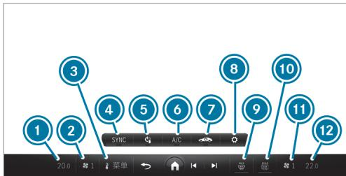

中央显示屏上的前排气候栏（示例）。气候栏显示取决于设定。

$\textcircled{8}$ 提高/降低温度(左前)

增大或减小气流或开启智能气候控制（左前） 第144页)

MEN调出空调菜单 第145页)

同步功能 第147页)

开启/关闭智能气候控制

第144页)

$\textcircled{5}$ A开启/关闭空调功能 第146页)

开启/关闭空气内循环模式第147页)或调出细颗粒物状态显示 第145页)

或启用/停用余热利用功能 第148页)

风挡玻璃除霜

示例：开启/关闭后车窗加热器。此按钮可以在设定项下单独分配。

增大或减小气流或开启智能气候控制（右前） 第144页)

提高/降低温度(右前)

$\textcircled{ i}$ 来电时，气流将自动减弱，以将噪音源保持在最小。可再次通过或 $\textcircled{4}$ 调节气流。

$\textcircled{1}$ 各项功能的可用性因国家和地区及配置而异。

# 后排操作单元概述

后排操作单元仅向配备多区域智能空调（THERMOTRONIC）控制面板的车辆提供。

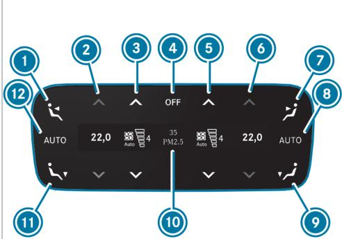

$\textcircled{8}$ 将气流分配设定至中央出风口和后排左侧出风口

$\textcircled{6}$ 设定后排左侧的温度

$\textcircled{6}$ 设定后排左侧气流大小或开启/关闭智能气候控制 第144页)

$\textcircled{6}$ 开启/关闭智能气候控制 第144页)

$\textcircled{6}$ 设定后排右侧气流大小或开启/关闭智能气候控制 第144页)

$\textcircled{5}$ 设定后排右侧的温度

$\textcircled{4}$ 将气流分配设定至中央出风口和后排右侧出风口

$\textcircled{9}$ 将后排右侧智能气候控制设定为自动模式

$\textcircled{9}$ 将气流分配设定至右后侧脚部位置出风口

$\textcircled{4}$ 微颗粒状态显示

$\textcircled{4}$ 将气流分配设定至左后侧脚部位置出风口

$\textcircled{8}$ 将后排左侧智能气候控制设定为自动模式

根据车辆装备情况，通过后排操作单元或多媒体系统 第147页)设定用于第二排座椅的设定。

# 操作智能气候控制系统

# 开启/关闭智能气候控制

# 开启智能气候控制

通过中央显示屏气候栏上的将气流大小设定为1档或更高档。

# 或者

按住MENU。

或者

选择MEN并按下。

或者

? 按下AUTO。

# 关闭智能气候控制

通过中央显示屏气候栏上的将气流大小设定为0档。

# 或者

按下。

如果智能气候控制关闭，则车窗可能会更快地起雾。智能气候控制的关闭时间不久过久。

$\textcircled{1}$ 如果通过按下「关闭智能气候控制，香氛喷雾发生器（若已启用）也会自动关闭。

$\textcircled{1}$ 如果通过关闭智能气候控制，气候栏上将显示OFF（关闭）。

# 通过后排操作单元开启/关闭智能气候控制

# 开启

按下按钮 $\textcircled{9}$ 0

# 或者

使用按钮 $\textcircled{6}$ 和 $\textcircled{6}$ 将气流大小设定为1档或更高档位。

或者

? 按下按钮 $\textcircled{6}$ 、 $\textcircled{9}$ 、 $\textcircled{9}$ 或 $\textcircled{4}$ 。

# 关闭

按下按钮 $\textcircled{9}$

# 或者

使用按钮 $\textcircled{6}$ 和 $\textcircled{6}$ 将气流大小设定为0档。

$\textcircled{1}$ 如果通过按钮 $\textcircled{9}$ 关闭后排智能气候控制，显示屏上将显示OFF（关闭）。

# 设定气候栏

MBUX智能人机交互系统：

# 气候菜单 第一排座椅

在气候菜单中，可以为气候栏上可自由设定的按钮选择不同的分配方式。

在气候菜单中，以下分配方式可用：

空气质量空气内循环c空调功能SYNC同步功能后车窗加热器

$\textcircled{1}$ 气候栏上未永久设定的功能可在气候菜单中使用。

选择。

在窗口中选择要为按钮分配的功能。  
该功能将被应用于此按钮。

$\textcircled{ i}$ 通过按住按钮一次也可以直接访问分配按钮的窗口。

# 设定温度和气流

# 调出温度和气流控制器

调出控度器：按下中央显示屏气候栏上显

# 或者

用手指滑过中央显示屏气候栏上显示的温度或。

# 设定温度

按下气候栏上的温度显示。  
提高温度：按下 $\textcircled{+}$ 或移动控制器。按住$\circledast$ 以将温度设定到最高。  
降低温度：按下 $\circleddash$ 或移动控制器。要关闭智能气候控制，按住 $\odot$ 。

$\textcircled{ i}$ 驾驶员和前排乘客侧温度只能逐一操作。

# 设定气流大小

按下气央显屏 $\textcircled{+}$ 移的控制器。按住$\circledast$ 以将气流设定到最大。  
减小气流：按下 $\odot$ 或移动控制器。要关闭气流，按住 $\odot$ 。

$\textcircled{1}$ 如果AUTO 功能激活，气流将保持启用。

# 使用气候栏启用/停用空调功能

空调功能可为车内空气加热、制冷和除湿。

? 按下中央显示屏气候栏上的。

$\textcircled{ i}$ 空调功能关闭时间不宜太久，否则车窗会很快起雾。

当启用制冷模式时，冷凝水可能会从车辆底部滴落。这并非故障表现。

# 使用气候控制栏调出空调菜单

空调菜单可通过气候控制栏调出。气候控制栏始终显示在中央显示屏下边缘。

在气候控制栏中选择菜单条目。  
第一排座椅菜单开启。

# 直接跳转至空气质量菜单

在空调栏中选择微粒状态显示。空气质量菜单开启。自动空气净化过程的动画显示。  
$\textcircled{1}$ 微粒状态显示位于主屏幕上右侧温度显示旁边，告知您车辆内部和外部的当前微粒水平。测量值以 $\mu \mathrm { g } / \mathsf { m } ^ { 3 }$ 为单位显示（微克每立方米）。  
$\textcircled{1}$ 各项功能的可用性因国家和地区及配置而异。

# 通过气候栏为风挡玻璃除雾

# 开启

$\blacktriangleright$ 按下中央显示屏气候栏上的

#

按下中央显示屏气候栏上的、UT或。

# 或者

将气流大小设定为0。

$\textcircled{1}$ 通过启用除雾功能后，某些功能（例如温度设定或气流分配）将自动停用。

# 通过空调菜单启用/停用空调功能

# MBUX智能人机交互系统：

# 气候菜单 第一排座椅

根据外部条件，当空调功能启用时，将支持改善车内空气的冷却和除湿效果。如果无法在中央显示屏气候栏上操作空调功能，则可在中央显示屏气候菜单中开启或关闭此功能。

选择A/C (空调)。

只可短时间关闭空调功能，否则车窗会很快起雾。

当启用制冷模式时，冷凝水可能会从车辆底部滴落。这并非故障表现。

# 将智能气候控制设定为自动模式

在自动模式下，空气供给将自动控制设定的车内温度并维持在恒定水平。

按下中央显示屏气候栏上的，然后选择自动。

$\textcircled{1}$ 可以利用控制器通过按下MBUX智能人机交互系统气候栏上的来增大或减小气流。在有来电的情况下，气流将自动减小。您仍可通过按下手动调节气流。在自动模式下，通过控制器可设定5个级别，无自动模式可设定7个级别。

切换到手动操作：关闭自动模式或调节气流分配，例如。

# 使用空调菜单设定气流分配和出风口

MBUX智能人机交互系统：

# 气候菜单

# 设定气流分配

选择第一排座椅或第二排座椅。  
使用按钮、或选择气流分配选项。  
设定气流大小。

$\textcircled{1}$ 当空调系统开启时，至少一个区域始终保持启用。但是，也可同时选择多个气流分配选项，例如同时设定车内和脚部位置的智能气候控制。执行此操作时，仅可为第二排座椅选择风挡玻璃智能气候控制。当自动模式启用时，用于设定气流分配的按钮自动停用。空调系统关闭后，按钮保持可操作并将保存最后的设置。

# 使用数字化通风控制自动设定气流方向

数字化通风控制电动出风口仅在配备多区域智能空调（THERMOTRONIC）控制面板的车辆上提供。该功能仅适用于空调菜单中的第一排座椅。

选择第一排座椅。

选择出风方向下方的按钮。

在个人、头部、身体上部、均匀或避开不同设定之间进行选择。

电子出风口自动移动到设定位置。

$\textcircled{1}$ 也可使用相应的控制器手动调节电子出风□ 第153页)。

$\textcircled{1}$ 电子出风口具有自动堵塞检测功能。如果出风口的移动由MBUX智能人机交互系统发起，且被手动干预或物体阻挡，则电子出风口在两次尝试后将返回到先前的起始位置。

# 使用空调菜单设定后排智能气候控制

# MBUX智能人机交互系统：

# 气候菜单

# 设定温度

选择第二排座椅。  
设定温度。

# 设定气流大小

选择第二排座椅。

使用或设定气流。

# 自动控制后排智能气候控制

选择自动。

$\textcircled{ i}$ 除霜功能启用后，某些功能（例如温度设定）将自动停用。如需停用除霜功能，请按下、或将气流设为0级 第146页)。

# 通过空调菜单开启/关闭同步功能

# MBUX智能人机交互系统：

# →气候菜单 第一排座椅

同步功能对智能气候控制进行中央控制。驾驶员对温度、气流大小和气流分配的设定将自动应用于每个气候分区。

选择 SYNC (SYNC（同步））。

# 车窗除雾

# 车窗内侧起雾

按下中央显示屏气候栏上的，然后选择自动。? 如果车窗持续起雾：按下中央显示屏气候栏上的

# 车窗外侧起雾

开启风挡玻璃雨刮器。  
按下中央显示屏气候栏上的，然后选择自动。

# 开启/关闭空气内循环模式

按下中央显示屏气候栏上的。  
车内空气将进行内循环。

片刻之后，空气内循环模式将自动切换至新鲜空气模式。

$\textcircled{1}$ 如果空气内循环模式开启，则车窗可能会更快起雾。空气内循环模式的开启时间不宜过久。

# 通过空调菜单开启/关闭永久空气内循环模式

# 要求

·空调功能开启

MBUX智能人机交互系统：气候菜单空气质量

# 启用永久空气内循环模式：

如果此功能已启用，空气内循环模式将不再自动切换至新鲜空气模式。请注意，此设定将会增加车窗起雾的风险。

选择空气质量。选择。选择持续雾霾终结增强模式，会增加车内水汽。? 按下。永久空气内循环模式已启用。

# 关闭永久空气内循环模式：

按下。  
永久空气内循环模式关闭，并将切换至自动空气内循环模式。

$\textcircled{1}$ 通过在气候栏上选择微粒状态显示，可直接跳转至空气质量菜单。

# 通过气候栏开启/关闭余热利用功能

# 要求

·余热利用功能可用。  
·车辆停驻。  
·冷却液温度足够高。

根据温度设置，可以利用发动机的余热利用功能为车辆前排继续供暖或通风约30分钟。

开启或关闭：选择中央显示屏气候栏上的余热利用。

一段时间后，余热利用功能将自动关闭。

$\textcircled{1}$ 如果余热利用功能启用，用于设定温度和气流分配的两个按钮将自动停用。

# 启用/停用电离功能

# MBUX智能人机交互系统：

# 气候菜单空气质量

电离功能启用时，车内空气中会富含负氧离子。这可提升车辆乘员的幸福舒适感。

选择负离子。

$\textcircled{1}$ 仅当AUTO 模式已启用或气流分配已设定至侧出风口时，才能执行此功能。如果驾驶员侧的侧出风口已关闭，则此功能受限。

# 香氛系统

■使用MBUX智能人机交互系统启用/停用香氛系统

# 要求

·自动智能气候控制启用。  
·手套箱关闭。  
·香水瓶已插入。

# MBUX智能人机交互系统：

# 气候菜单空气质量

香氛系统将来自手套箱香水瓶中的香味散布到整个车内。

向下操作，直至智能气候控制栏启用。选择香氛调节。$\blacktriangleright$ 启用或停用香氛。

# 设定香氛系统

# 要求：

·智能气候控制系统开启·手套箱关闭。  
·香水瓶已插入。

MBUX智能人机交互系统：

气候菜单空气质量

选择香氛调节。

按住，直到达到所需浓度。

# 插入或取出香氛系统的香水瓶

# A 警告 液体香水造成的伤害风险

如果儿童打开香水瓶，则其可能会误饮液体香水或使香水接触到眼睛。

切勿将儿童单独留在车内无人看管。   
如果误饮香水，请立即就医。   
如果眼睛或皮肤接触到液体香水，请 立即用清水彻底冲洗。   
如果症状持续，请尽快就医。

环保说明因装满香水的瓶子弃置不当造成的环境损害

装满香水的瓶子不得与生活垃圾一起弃置。

将装满香水的瓶子送至危险废品收集点。

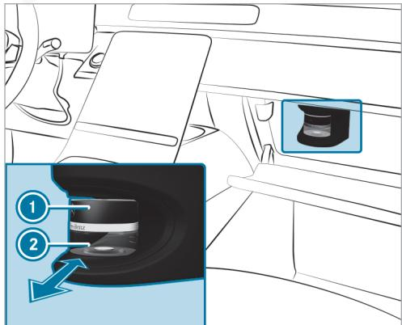

$\textcircled{6}$ 盖子 $\textcircled{6}$ 香水瓶

插入：将香水瓶滑入卡座中，直至止动位。

取出：开启手套箱后，等待约7秒钟然后拉出香水瓶。

如未使用原厂梅赛德斯-奔驰车内香水，请遵守制造商的香水包装上的安全注意事项。

如果原厂梅赛德斯-奔驰车内香水瓶已空，请将其弃置且勿再次添加。

# 可充式香水瓶

松开空香水瓶盖子。  
向香水瓶中最多添加15毫升。  
将盖子拧回至香水瓶上。

务必向空的可充式香水瓶中添加相同的香水。请遵守粘贴在香水瓶上的专门信息表。

# 车辆解锁后气候预控制

# 车辆解锁后气候预控制功能

进入车辆前，可以对座椅进行短暂的预加热或预冷却。

$\textcircled{1}$ 此功能仅适用于插电式混合动力车辆和某些配备48伏车载电气系统的车型。

根据车辆装备情况，预冷却时，以下功能将根据需要启用：

·空调自动化 ·鼓风机 ·座椅通风

根据车辆装备情况，预加热时，以下功能将根据需要启用：

·空调自动化·鼓风机座椅加热器方向盘加热器）后视镜加热装置·后车窗加热器

根据车辆装备情况，在正常行驶中，如果以下功能已开启，也会在气候预控制过程中进行调整：

·香氛喷雾发生器·负离子发生器

# ■在MBU×智能人机交互系统中设定车辆解锁后气候预控制

MBUX智能人机交互系统：

# →气候菜单气候预控制

$\textcircled{1}$ 此功能仅适用于插电式混合动力车辆。

在某些配备48伏车载电气系统的车型上，仅在车辆解锁时，才通过梅赛德斯-奔驰应用启用气候预控制功能。必须满足以下要求：

·车辆具备无线连接。  
·车辆已连接至 Mercedes me 用户帐户。

$\blacktriangleright$ 启用或停用此功能。

# 选择座椅

选择驾驶员、前排乘客、左后或右后。将对所选座椅执行气候预控制的座椅特定功能（例如座椅加热器）。

当气候预控制启用时，中央显示屏气候栏上的LED将亮起，蓝色灯表示车辆已冷却，红色灯表示车辆已加热。

# 启用/停用车辆解锁后气候预控制

# 要求：

$\textcircled{1}$ 此功能仅适用于插电式混合动力车辆和某些配备48伏车载电气系统的车型。  
·高电压蓄电池或48 伏蓄电池已充满电。  
·已通过MBUX智能人机交互系统或梅赛德斯-奔驰应用启用此功能。

开启：解锁车辆。

智能气候控制功能启用最长5分钟以预加热和预冷却。

车辆关闭时，车辆解锁后的气候预控制功能不能启动超过三次。

关闭：按下中央显示屏气候栏上的，或者在某些配备48伏车载电气系统的车型上通过梅赛德斯-奔驰应用关闭。

根据车辆装备情况，在车辆启动后，以下功能将保持启用：

·座椅加热器·座椅通风·香氛喷雾发生器·负离子发生器

# 出发时气候预控制

# 」出发时气候预控制功能

警告处在车内极高或极低温度下造成的致命伤害风险

如果人员（尤其是儿童）长时间暴露于高温或寒冷环境中，则存在严重伤害甚至死亡的风险。

切勿将人员（尤其是儿童）单独留在车内无人看管。

A 警告反复开启座椅加热导致的灼伤风 险

反复开启座椅加热会导致座垫和座椅靠背垫温度很高。

尤其是可能会影响对温度不太敏感或应对高温能力有限的乘员的健康，甚至使其受到类似灼伤的伤害。

切勿反复开启座椅加热。

为防止过热，座椅加热器在经过反复开启之后可能会被暂时停用。

$\textcircled{1}$ 出发时气候预控制功能仅适用于插电式混合动力车辆。

当车辆停驻时，可将车内加热、通风或制冷至设定的温度。

当车辆连接至电源设备时，会首先将高电压蓄电池充电至规定的最低充电电量。

在以下情况下，可能会减少气候预控制的运行时间：

·车辆未连接至电源设备。  
·高电压蓄电池未充满电。

如果气候预控制启用，即使充电电缆插头已连接，高电压蓄电池充电电量也可能减少。如果适用，座椅通风将在制冷和通风模式下启用。

根据车辆装备情况，以下功能（若有）将在供暖模式下启用：

·座椅加热器·方向盘加热器·后视镜加热装置·后车窗加热器

当设定的温度发生变化时，智能气候控制模式将自动切换：

·从供暖模式至通风或制冷模式，或者·从制冷模式至通风或供暖模式，或者·从通风模式至供暖或制冷模式

# 通过MBUX智能人机交互系统设定出发时气候预控制

MBUX智能人机交互系统：

气候菜单气候预控制

# 设定出发时间

$\textcircled{1}$ 仅插电式混合动力车辆可通过MBUX智能人机交互系统调节出发时气候预控制功能。  
$\textcircled{1}$ 设定的出发时间用于车辆的预进入气候控制，并估算选定时间的大致充电电量和可达里程。有关充电设定的更多信息，请参觉： 第290页)

选择编辑出发时间。

选择出发时间或设定新的出发时间。

# 设定重复日期

选择编辑出发时间。

设定所需出发时间，并选择要应用此出发时间的相应日期。

按下确认进行确认。

# 选择座椅

选择驾驶员、前排乘客、左后或右后。  
对所选座椅进行气候预控制。

当气候预控制启用时，中央显示屏气候栏上的LED将亮起，蓝色灯表示车辆已冷却，红色灯表示车辆已加热。如果出发时间已选择，中央显示屏气候栏上的LED将亮黄色灯。

# ■启用/停用出发时气候预控制

# 要求：

·车辆具备无线连接。  
·车辆已连接至用户的梅赛德斯-奔驰帐户。

插电式混合动力车辆：

·高电压蓄电池电量充足。  
·此功能是通过MBUX智能人机交互系统启用的。

配备48伏车载电气系统的车辆：

·48伏蓄电池电量充足。

开启：插电式混合动力车辆：设定出发时间 第152页)。  
出发时气候预控制功能将在选定的出发时间前最多启用55分钟。如果出发时间延迟，该功能再保持启用5分钟。  
配备48伏车载电气系统的车辆：可通过梅赛德斯-奔驰应用启用出发时气候预控制功能。气候预控制功能在选定的出发时间前最多启用5分钟。

# 提前关闭出发时气候预控制功能：

·按下中央显示屏气候栏上的。·在气候菜单中关闭时间预选。·配备48伏车载电气系统的车辆：通过梅赛德斯-奔驰应用关闭此功能。

如果适用，车辆启动后，以下功能将保持启用：

·座椅加热器 ·座椅通风

根据车辆装备情况，在正常行驶中，如果以下功能已开启，也会在气候预控制过程中进行调整：

·香氛喷雾发生器·负离子发生器

# 启用/停用即时气候预控制

A 警告 处在车内极高或极低温度下造成的致命伤害风险

如果人员（尤其是儿童）长时间暴露于高温或寒冷环境中，则存在严重伤害甚至死亡的风险。

切勿将人员（尤其是儿童）单独留在车内无人看管。

A 警告反复开启座椅加热导致的灼伤风 险

反复开启座椅加热会导致座垫和座椅靠背垫温度很高。

尤其是可能会影响对温度不太敏感或应对高温能力有限的乘员的健康，甚至使其受到类似灼伤的伤害。

切勿反复开启座椅加热。

为防止过热，座椅加热器在经过反复开启之后可能会被暂时停用。

# 要求：

·车辆关闭。

对于插电式混合动力车辆，车内的空调最多可以继续运行50分钟（例如，如果行程中断），对于某些配备48伏车载电气系统的车型，最多可以继续运行5分钟。

按下中央显示屏气候栏上的（请参见车辆使用说明书（用户手册））  
中央显示屏气候栏上下方的红色或蓝色指示灯将亮起或熄灭。  
使用中央显示屏气候栏上的箭头设定温度（请参见车辆使用说明书（用户手册））。

指示灯的颜色表示以下含义：

·蓝色：辅助通风开启。  
·红色：驻车加热器开启。  
·黄色：已预选出发时间。

# 出风口

# 调节前排出风口

警告 距离出风口过近导致的灼伤或冻伤凤险

出风口处可能吹出过热或过冷的空气。

确保车辆驾驶员及所有乘客始终与出风口保持足够的距离。  
必要时，将气流导向车内的其它区域。

为确保新鲜空气通过出风口进入车内，请遵守以下注意事项：

·务必使车内的出风口和通风格栅畅通无阻。  
·确保进气口处没有残余物集聚第322页)。

# 调节后排出风口

# 调节后排侧出风口

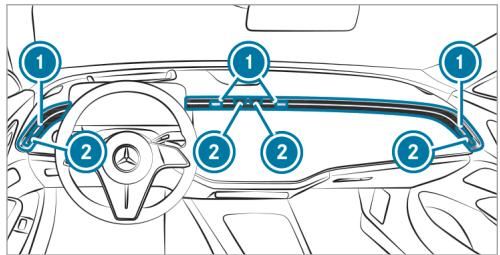

设定侧出风口和中央出风口的气流方向：抓住调节器 $\textcircled{6}$ ，将其向上、向下、向左或向右移动。

开启或关闭侧出风口和中央出风口：将相应的调节器 $\textcircled{6}$ 向上或向下转至止动位。

$\textcircled{1}$ 第一排座椅的气流方向也可以通过MBUX智能人机交互系统进行电动调节第146页)。

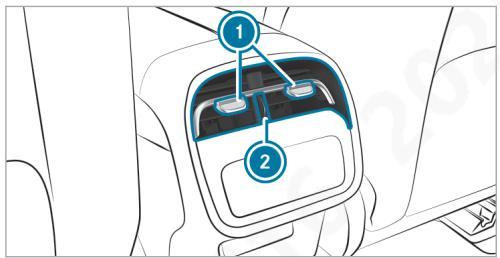

开启或关闭：将控制器 $\textcircled{6}$ 向上或向下转动至止动位。

设定气流方向：握住控制器 $\textcircled{8}$ 中间位置，然后将其向上、向下、向左或向右移动。

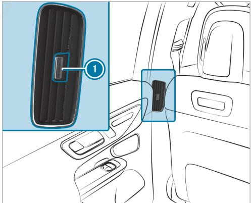

开启或关闭后排侧出风口：抓住侧出风□控制器 $\textcircled{8}$ ，将其向上或向下移至止动位。

设定侧出风口的气流方向：抓住控制器 $\textcircled{8}$ ，将其向上、向下、向左或向右移动。

# 驾驶

# 有关插电式混合动力操作的注意事项

# 有关插电式混合动力操作的注意事项

A 警告高电压蓄电池损坏造成化学灼伤和中毒的风险

如果高电压蓄电池外壳损坏，则可能会发生电解液和气体泄漏。

应避免皮肤、眼睛或衣物接触蓄电池酸液。  
立即用水冲洗溅落的电解液，并立即就医。

混合动力系统将内燃机和电动机相结合。

A 危险高电压蓄电池内部压力过大有火灾和爆炸的风险。

如果车辆发生火灾，易燃气体可能会逸出并点燃。

如果出现异常气味、烟雾或烧伤痕迹，立即停止充电过程。  
立即离开危险区域。与危险区域保持足够的距离。

呼叫消防救援机构。

车辆处于静止状态时的特点：

·内燃机通常关闭。  
·怠速转速仅出现在某些情况下。

车辆启动时的特点：

·如果高电压蓄电池电量充足，则车辆可在不使用内燃机的情况下通过电驱动系统启动（无声启动）。  
·如果电驱动系统所用高电压蓄电池电量不足或不符合车辆无声起动的条件，车辆将使用内燃机启动。  
$\textcircled{ i}$ 根据系统的不同，即使高电压蓄电池已充电，电动模式也可能受限或不可用。内燃机运行足够长的时间后，在环境条件允许的情况下，电动模式可再次不受限制地使用。

中等输出功率需求情况下的特点：

·在行车过程中，将尽可能频繁关闭内燃机。

·取决于所选择的驾驶模式和高电压蓄电池充电电量，车辆可以电动加速至不超过约140 公里/小时。

高输出功率需求情况下的特点：

·电动机支持内燃机（助力效果），如在车辆起步或加速时。  
·将为高电压蓄电池放电。

行车时松开加速踏板的特点：

·在惯性滑行下和制动时，电动机将作为发电机运作。  
·将为高电压蓄电池充电。

关于电动模式的注意事项：

·相比于配备内燃机的车辆，配备混合动力系统的车辆在静止和行驶时产生的噪音显著减小。在电动模式下行驶时，由于产生的运行噪音明显减小，其他道路使用者可能无法听到本车。为此，车辆配备了发声器，作为车辆声学预警系统（AVAS）。此安全装置是法律规定的。

低速时，在车内可以听到发声器发出的外部噪音，这并不代表故障。

·如果未满足电动模式的所有车辆条件，则内燃机将开启。  
·由于高电压蓄电池和驱动系统的工作温度、环境温度和高电压蓄电池的老化，电动模式下的性能可能会受到限制。  
·在电动模式下，不可能永远保持最大功率，可能会下降到持续输出功率。

有关车辆声学预警系统的说明：

·向前行驶和倒车时，如果车速不超过大约30 公里/小时，发声器将产生车速感应行驶噪音。  
·这有助于其他道路使用者，尤其是行人和自行车骑行者更好地听到您的车辆。  
·车速达到 20 公里/小时 后，车辆声学预警系统会开始逐渐关闭。  
·在车辆处于静止状态时，发声器将关闭。

# 手动断开高压车载电气系统

A 危险 由于改动和/或损坏高压车载电气系统零部件造成的死亡和火灾风险车辆的高压车载电气系统带有高电压。如果您改装车辆高压车载电气系统中的零部件或碰触受损的零部件，可能会遭到电击。此外，改动和/或损坏零部件可能引发火灾。

发生事故或车底受到撞击时，可能会损坏高压车载电气系统的零部件，尽管损坏不可见。

切勿对高压车载电气系统进行任何改动。  
如果车辆的高压车载电气系统零部件被改动或损坏，则请勿启动或使用车辆。  
请勿触摸损坏的高压车载电气系统零部件。  
发生事故后，请勿触摸高压车载电气系统的任何零部件。  
发生事故后，请按交警及消防救援机构等主管政府部门指示和要求，妥善处理车辆。

请到具有资质的专业服务中心检查高压车载电气系统零部件，必要时更换。

#

仅在以下情况下手动断开高压车载电气系统：

·驾驶员显示屏上的约束系统警告灯亮起，例如发生事故后。车辆遭受严重损坏，例如发生事故后，且约束系统部件尚未触发。

# 操作高压断开装置

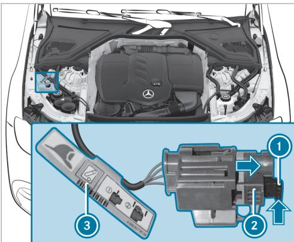

关闭车辆。  
将变速箱切换至档。  
施加电动驻车制动器。  
固定车辆，以防溜车。  
开启发动机罩。请遵守高压断开装置 $\textcircled{6}$ 附加铭牌 $\textcircled{8}$ 上的说明。  
沿箭头方向按下释放卡舌 $\textcircled{8}$ ，然后将其拉出。  
沿箭头方向拉动高压断开装置，直至其卡入位。  
高压车载电气系统关闭。

请仅到具有资质的专业服务中心进行与混合动力系统－（包括手动断开高压车载电气系统后-）相关的所有工作。

# 开启电源或启动车辆

A警告儿童单独留在车内无人看管造成 的事故及伤害风险

如果将儿童单独留在车内无人看管，他们可能

·开启车门，从而危及他人或其他道路使用者。·走出车外，被来往车辆撞伤。

·操作车辆设备并被卡住等。

此外，儿童还可能会进行如下操作，导致车辆移动：

·解除驻车制动。  
·切换变速箱档位。  
·启动车辆。

切勿将儿童单独留在车内无人看管。离开车辆时，务必随身携带钥匙并锁止车辆。将钥匙放在儿童接触不到的地方。

这也适用于电子车钥匙。

# 要求：

·钥匙位于车内且已被识别。  
·配备电子车钥匙的车辆：探测到带有驾驶认可的电子车钥匙。  
·制动踏板未踩下。

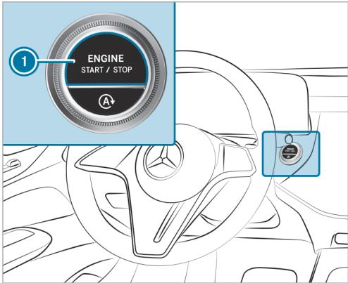

开启电源：按下按钮 $\textcircled{6}$ 一次。

例如，可以开启风挡玻璃雨刮器等。

如果满足以下条件，电源将会再次关闭：

·开启驾驶员侧车门。  
·再按下按钮 $\textcircled{8}$ 两次。

开启车辆：按下按钮 $\textcircled{8}$ 两次。

驾驶员显示屏上的指示灯和警告灯将亮起。

如果满足以下其中一个条件，则车辆将会再次关闭：

·未在15分钟内启动车辆，且变速箱处于回档或电动驻车制动器已接合。·按下按钮①一次。

# 使用启动/停止按钮启动车辆

A 危险废气造成的致命伤害风险内燃机会排出一氧化碳等有毒废气。吸入这些废气有害健康且会导致中毒。$\blacktriangleright$ 请勿在通风不良的密闭空间内让发动机和驻车加热器（如有）运转。

A 警告发动机舱或排气系统中的易燃材料造成的火灾风险

易燃材料可能会点燃。

因此，定期检查并确保发动机舱或排气系统中无易燃异物。

# 要求：

·钥匙位于车内且已被识别。  
·配备电子车钥匙的车辆：探测到带有驾驶权限的电子车钥匙。将变速箱切换至P档或N档。  
踩下制动踏板并按下按钮 $\textcircled{8}$ 一次。如果车辆未启动：关闭非关键用电设备并按下按钮 $\textcircled{8}$ 一次。如果车辆仍未启动且将钥匙放在标记的位置参见使用说明书（用户手册）显示信息出现在驾驶员显示屏上：使用放在标记位置的钥匙启动车辆（应急操作模式）第159页)。

$\textcircled{1}$ 您可以在行驶时关闭车辆。为此，按住按钮 $\textcircled{8}$ 约3秒钟或在3秒钟内按下按钮O三次。确保遵守"驾驶提示"中的相关安全注意事项 第161页)。

请注意驾驶员显示屏上可能显示的任何显示信息。

# 在紧急操作模式下启动车辆

# 使用存放在储物空间的钥匙启动车辆。

如果车辆未启动且将钥匙放在标记的位置 参见使用说明书（用户手册）显示信息出现在驾驶员显示屏上，可在应急操作模式下启动车辆。

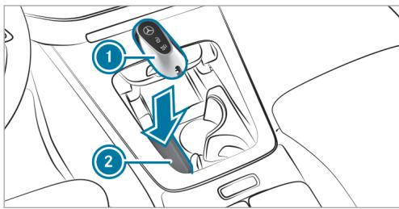

确保标记位置 $\textcircled{6}$ 为空。

从钥匙环中拔出钥匙 $\textcircled{8}$ 。

将钥匙 $\textcircled{6}$ 放在标记位置 $\textcircled{6}$ 的标识上。车辆稍后启动。如果从标记位置 $\textcircled{6}$ 取出钥匙 $\textcircled{8}$ ，仍可继续驾驶车辆。但是，为方便后续的发动机启动操作，在整个行车过程中，钥匙 $\textcircled{8}$ 必须置于标记位置 $\textcircled{6}$ 的标识上。

请到梅赛德斯-奔驰授权服务中心检查钥匙 $\textcircled{8}$ 。

# 如果车辆无法启动：

将钥匙 $\textcircled{8}$ 放在标记位置 $\textcircled{6}$ 并留在此处。踩下制动踏板并使用启动/停止按钮启动车辆。$\textcircled{1}$ 您可以使用启动/停止按钮开启电源或车辆 第157页)。请注意驾驶员显示屏上可能显示的任何显示信息。

使用存放在储物空间的电子车钥匙启动车辆要求：

·车辆配备"电子车钥匙"预留装置。·探测到带有驾驶权限的电子车钥匙。$\textcircled{1}$ 此外，应急操作模式下也可以使用车钥匙。

梅赛德斯-奔驰建议您随身携带车辆钥匙，以防功能限制。

如果车辆未启动且正在搜寻感应区内的 实体钥匙或数字钥匙...参见使用说明书 （用户手册）显示信息出现在驾驶员显示屏上，可在应急操作模式下启动车辆。

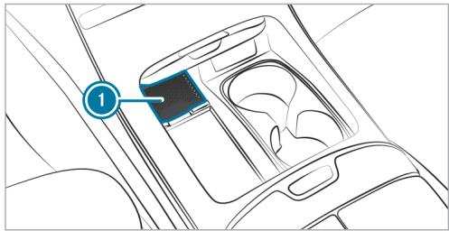

将电子车钥匙放置在标记位置 $\textcircled{8}$ 踩下制动踏板并使用启动/停止按钮启动车辆。发动机启动可能需要几秒钟的时间。当未检测到钥匙 显示信息出现在驾驶员显示屏上时，再次按下启动/停止按钮。

# 磨合注意事项

在首1,500 公里 行车时保护发动机：

·以不同的车速和发动机转速行驶。  
·请勿以140 公里/小时 以上的车速行驶。  
·以驾驶模式或驾驶车辆。

插电式混合动力车辆：使用驾驶模式、或。

·最迟在指针到达转速表中红色弧线之前的最后三分之一时切换到下一个更高档位。切勿以手动降档的方式制动。  
）避免车辆过载，例如全速行驶。  
·请勿将加速踏板踩过压力点（强制降档）。仅在行驶1,500 公里 后逐渐提高发动机转速并加速车辆至全速行驶。

这也适用于已更换发动机或传动系统部件的情况。

另请遵守以下磨合注意事项：

·车辆交付或修理车辆后行驶一段距离时，某些驾驶系统和驾驶安全系统的传感器会自动进行调节。仅当此示教过程结束时，才能达到整个系统的效能。

·只有在行驶几百公里后，制动衬片、制动盘和轮胎（新的或更换的）才能发挥最佳制动效果和抓地能力。通过对制动踏板施加更大的力可补偿降低的制动效果。

# 关于优化加速的注意事项

如果符合所有必要要求和启用条件，可从静止状态实现可能的最佳加速。

请勿在公共道路上采用优化加速。各个车轮可能空转且您可能失去对车辆的控制。打滑和/或发生事故的风险增加。

务必遵守有关电控车辆稳定行驶系统（ESP?）的安全注意事项和信息

第198页)。

# 采用优化加速起步

A 警告 由于空转导致的打滑和事故风险如果在优化加速状态下起步，各个车轮可能空转且您可能失去对车辆的控制。

尤其是在电控车辆稳定行驶系统（ESP@）停用时，存在较高的打滑和事故风险。

确保车辆周围区域没有人或障碍物。

# 要求

·车辆已磨合运转 第160页)。  
·车辆和轮胎状态良好。  
·道路表面具有高附着力。  
·发动机和变速箱处于正常工作温度下。注意事项由于优化加速导致磨损加剧  
当采用优化加速起步时，传动系统的所有  
部件均要承受极高的负荷。  
这会导致部件磨损加剧。切勿经常采用优化加速起步。挂入回行驶档 第172页)。  
将方向盘移至直行位置。  
选择驾驶模式 第169 页)。  
停用电控车辆稳定行驶系统（ $\mathsf { E S P } ^ { \mathtt { ( B ) } }$ ）第199页)。用左脚牢牢踩住制动踏板。  
用右脚完全踩下加速踏板。  
在5秒钟内，将左脚快速抬离制动踏板，但踩住加速踏板。  
车辆将以最大加速度起步。  
加速过程完成时立即开启电控车辆稳定行驶系统（ESP?）

# 结束优化加速

将脚从加速踏板上移开。重新启用电控车辆稳定行驶系统（ESP@）。$\textcircled{1}$ 采用优化加速起步后，传动系统部件可能会变得极热，这意味着可能在几分钟之后才能再次达到优化加速值。

# 驾驶注意事项

A 警告驾驶员侧侧脚部位置的物品造成的事故风险

驾驶员侧脚部位置的物品可能会妨碍踏板行程或绊阻已踩下的踏板。

这样会危及车辆的操作安全性和行驶安全性。

牢固存放车内所有物品，确保它们不会进入驾驶员脚部位置。  
务必确保踏板有足够的间隙。  
务必按照描述牢固安装脚垫。  
请勿使用松动的脚垫且勿叠放脚垫。

A警告不适当的鞋子造成的事故风险

不适当的鞋子包括：

·厚底鞋·高跟鞋·拖鞋存在事故风险。

务必穿着适当的鞋子，以便安全操作踏板。

警告行车时车辆发动机关闭造成的事故凤险

如果行车时关闭车辆发动机，则安全功能可能受限或不再适用。  
例如，这可能影响动力转向系统和制动力助力。  
例如，进行转向和制动时所需的制动力会比平常大得多。

行车时，请勿关闭车辆发动机。

# A 危险废气造成的致命伤害风险

内燃机会排出一氧化碳等有毒废气。吸入这些废气有害健康且会导致中毒。

请勿在通风不良的密闭空间内让发动机和驻车加热器（如有）运转。

A 警告 在易滑路面上降档造成的打滑和事故风险

如果您在易滑路面上降档以增强发动机制动效果，则驱动轮可能失去牵引力。

请勿在易滑路面上降档以增强发动机制动效果。

# A危险有毒排气造成的致命伤害风险

如果排气管阻塞或无法充分通风，则一氧化碳等有毒废气可能进入车辆。在车辆陷在雪地等情况下会发生这种情况。

发动机或驻车加热器运行时，保持排气尾管和车辆周围区域无积雪。开启车辆背风侧的车窗，确保新鲜空气供应充足。

# A警告制动系统过热造成的事故风险

如果您在行车时将脚放在制动踏板上，则制动系统可能过热。

这将增大制动距离且制动系统甚至可能故障。

请勿将制动踏板用作搁脚板。行车时，请勿同时踩下制动踏板和加速踏板。

注意事项发动机转速过快导致的发动机损坏

发动机转速过快会损坏发动机。

切勿以转速表红色区域或驾驶员显示屏红色显示的发动机转速行驶。

注意事项由于踩住制动踏板造成的制动衬片磨损

请勿在行车时踩住制动踏板。如需使用发动机制动效果，请及时换入较低档位。

注意事项起步时的传动系统和发动机损坏

请勿原地怠速热车。立即驾车起步。在发动机达到其正常工作温度前，应避免转速过高和全速行驶。

注意事项未消耗的燃油造成的催化转换器损坏

发动机运转不稳，点火不良。

未消耗的燃油可能进入催化转换器并造成损坏。

仅可轻踩加速踏板。  
请立即到具有资质的专业服务中心排除故障原因。

注意事项频繁的短距离行驶导致蓄电 池寿命缩短

如果仅将车辆用于短距离行驶，则12伏蓄电池可能无法充满电。这将缩短蓄电池使用寿命。

定期长距离行驶，为蓄电池充电。

注意 因未遵守最大允许净空高度导致的车辆损坏

如果车辆高度超过最大允许净空高度，则可能会损坏车顶或车辆其他部件。

请遵守所示的最大净空高度。如果车辆超过允许的净空高度，请勿驶入。

在有车顶上部结构或其他车载系统的情况下，应将改动后的车辆高度考虑在内。

$\textcircled{ i}$ 请谨记，本使用说明书（用户手册）中所述的所有速度值均为近似值，存在一定的公差。

# 请遵守在车顶负载、连接挂车或车辆满载状态下行驶时的注意事项。

携带已装载物品的车顶行李架或带挂车行驶时，或者在车辆满载或满员状态下行驶时，车辆的操控和转向特性会改变。

因此，请遵守以下注意事项：

·请勿超出允许的车顶载荷和挂车载荷。另请遵守技术数据中此方面的信息。  
·均匀分布车顶载荷和车辆载荷，并将重物放在底部。另请遵守有关装载车辆的注意事项 第114页)。  
）小心驾驶。避免突然启动、制动和转向操作或快速转弯。

有关在洒有除冰盐的道路上行驶的注意事项在洒有除冰盐的路面上制动效果会受限。

因此，请遵守以下注意事项：

·由于制动盘和制动衬片上的盐分堆积，制动距离将显著增加或可能发生单侧制动。·与前方车辆保持更大的安全距离。

通过如下方式清除堆积的盐分：

·不定期制动，同时注意交通状况·行程结束时和开始下一行程前，请小心地踩下制动踏板

# 有关水滑现象的注意事项

路面上产生一定深度的积水后，会发生水滑现象。

在强降水期间或可能发生水滑现象的情况下，请遵守以下注意事项：

·减速。  
·绕开车辙。  
·避免突然转向。  
·小心地制动。

$\textcircled{ i}$ 另请遵守有关定期检查车轮和轮胎的注意事项 第350页)。

# 有关在道路上涉水行驶的注意事项

水进入车内可能损坏发动机、电气系统和变速箱。

水也可能进入发动机的进气口并导致发动机损坏。

如果您需要涉水行驶，请遵守以下注意事项：

·静止时的水位不可超过车身下缘。  
·最多以步行速度驾驶，否则，水可能进入车内或发动机舱。前方行驶车辆或对面来车可产生可能超过最大允许涉水深度的波浪。

涉水行驶后制动器的制动效果会减弱。请小心制动并注意交通状况，直至制动效果完全恢复。

# 自动节能启停功能

# 1 自动节能启停功能

$\textcircled{1}$ 插电式混合动力车辆：此功能不可用。

$\textcircled{1}$ 自动节能启停功能并非在所有驾驶模式下均适用，具体取决于发动机。为此，请注意观察驾驶员显示屏上的状态指示灯。

如果满足以下发动机自动停止的所有车辆条件，发动机将自动关闭：

·在变速箱档位为回或时制动车辆使其停止。·在低速行驶时踩下制动踏板。

如果系统探测到以下其中一种情况，发动机将不会停止：

·停在停止标志旁，并且前方没有车辆。  
·停在您前方的车辆驶离。  
·挪车、急转方向盘或接合倒档。

这样可以阻止发动机暂停。

$\textcircled{1}$ 如果系统探测到阻止发动机暂停的停车抑制器，例如停车标志，则发动机不会停止。如果启用保持（HOLD）功能或接合驻车档位P，即使探测到停车抑制器，发动机也会关闭。

在以下情况下，发动机将自动重新启动：

·将变速箱接入回档或档。  
·踩下加速踏板。 ·必须进行发动机自动启动。 202  
）松开制动踏板。  
在下坡坡道上松开制动踏板时，车辆不会行驶。  
车辆在下坡坡道上行驶，在车速达到20 公里/小时 时未自动进入滑行模式。

驾驶员显示屏上的自动节能启停功能标识：

·当车辆处于静止状态时出现标识（绿色）：发动机是自动节能启停功能关闭的。  
，当车辆处于静止状态时出现标识[（黄色）：车辆并未满足停止发动机的所有条件。  
. 当车辆处于静止状态时，标识和标识均未出现：探测到阻止发动机暂停的停车抑制器，例如停车标志。

·出现标识 $\boxed { \bigoplus + ^ { \circ F F } }$ ：自动节能启停功能停用或发生故障。

如果发动机是自动节能启停功能关闭的，并且您离开车辆，则将响起警告音，并且发动机将不重新启动。此外，下列显示信息将出现在驾驶员显示屏上：

# 车辆行驶准备就绪下车前请关闭车辆

如未关闭车辆，则将在3分钟后自动关闭。

# 开启/关闭自动节能启停功能

# 节能显示功能

节能显示评估经济型驾驶方式的以下

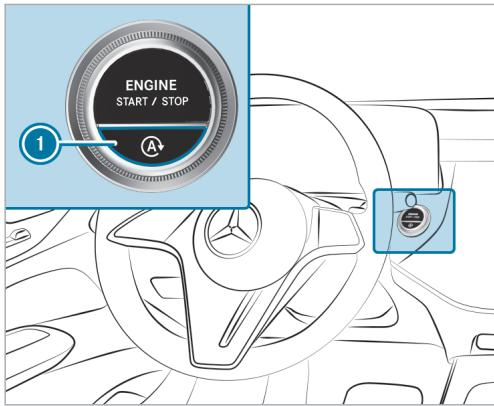

按下按钮 $\textcircled{8}$

开启/关闭自动节能启停功能时，驾驶员显示屏上将显示一个指示灯。

$\textcircled{1}$ 停用自动节能启停功能时，@将永久显示在驾驶员显示屏上。

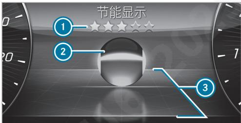

节能显示根据情况在驾驶员显示屏上显示对您的驾驶方式的评估。这使您可以检查您的驾驶方式的效率，并在必要时调整。节能显示菜单上会显示一个滚珠 $\textcircled{6}$ ，这个滚珠在虚拟道路上根据驾驶特性沿行驶方向前后滚动。

在道路的上方和下方，以线条标出高效驾驶方式的区域 $\textcircled{6}$ 。如果滚珠 $\textcircled{6}$ 在线条以内滚动，则以绿色亮起。如果在线条以外滚动，滚珠将以橙色亮起。

标准：

·在正确的时间滑行   
·恒速   
·中等加速

对您的"启动后"驾驶方式的总体评估用星号$\textcircled{8}$ 表示。最初为5颗空心星，如果您的驾驶效率足够高，星号会逐颗填满。当5颗星全部填满后，背景将会亮起。

$\textcircled{1}$ 可通过经典菜单调出节能显示功能第263页)。

# 再生制动系统 (插电式混合动力车辆)

# 再生制动系统的功能

再生制动系统在惯性滑行下和制动期间将车辆的动能转化为电能。

根据所选的再生水平，在惯性滑行下和制动时，电动机作为发电机运作，以在行驶时为高电压蓄电池充电。一旦在以变速箱档位D或行驶过程中将脚从加速踏板上移开，惯性滑行下的再生将立即开始。

再生越高，滑行时车辆制动越紧急且注入高电压蓄电池的电能越多。

根据驾驶状况，惯性滑行下的减速可能不够充分。未减速至静止状态。必要时还要使用行车制动器进行制动。始终根据驾驶状况调整车速并保持足够的车距。

$\textcircled{1}$ 如果紧急制动，则也会使用机械制动器。这意味着无法回收最大再生能量。越是主动加速和制动，就越能更有效地再生能量。

# 系统限制

在惯性滑行下进行再生时，电动机的制动效果只有在以下情况下才会减弱或不存在：

·高电压蓄电池充电电量增加时  
·高电压蓄电池尚未处于正常工作温度时  
$\textcircled{1}$ 请注意系统限制，特别是在需要使用再生制动系统制动效果的长下坡路段之前第161页)。

# ■手动设定再生减速度

$\textcircled{1}$ 在惯性滑行下，您可使用方向盘换档拨片调节驾驶模式、和及变速箱档位回下的再生强度。

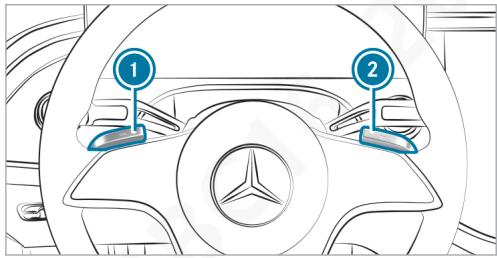

以下再生水平可用：

·DAuro带节能辅助的雷达辅助再生第167页)回 $\boxed { + }$ 无再生：车辆自由滚动  
·回正常再生  
回增加再生：在惯性滑行下强力减速，例如，用于下坡行驶

默认设定：

·DAuTo：如已在MBUX智能人机交互系统中启用节能辅助功能 第167页)。

·回：如已在MBUX智能人机交互系统中关闭节能辅助功能。

$\textcircled{1}$ 仅当已在MBUX智能人机交互系统中开启节能辅助功能且雷达传感器功能没有受影响的情况下，DuT才可用。另请注意有关车辆传感器和摄像头的信息

# 第195页)。

选择变速箱档位回。  
增加再生：轻拉换档拨片 $\textcircled{8}$ 。  
减少再生：轻拉换档拨片 $\textcircled{6}$ 。  
默认设定：拉住换档拨片 $\textcircled{6}$ 或 $\textcircled{6}$ 再次挂入变速箱档位回。

$\textcircled{1}$ 车辆重新启动时，也会设定标准设定。当切换至变速箱档位R时，将采用当前再生水平，回r除外。如果之前已选择Duro，则已设定变速箱档位下再生水平的车辆减速度。随后切换至变速箱档位回，将再次设定之前选择的可变再生DAuTO。

驾驶员显示屏上变速箱档位显示旁边显示当 前设定的再生水平。

# 节能辅助 (插电式混合动力车辆)

# 节能辅助功能

节能辅助功能可帮助您节约燃油和再生能量。如果系统探测到前方车辆事件，且正在靠近事件，节能辅助功能将根据距离、车速及下坡梯度计算出最优车速，以实现最大燃油经济性和最大化的能量回收。

如果节能辅助功能无法充分减速，您还需要使用行车制动器进行制动。例如，如果您在行驶缓慢的车流中再次起步，并且与前方车辆距离极近时，则情况尤其如此。

在以下情况下，该功能将启用：

·在MBUX智能人机交互系统中启用功能第167页)。  
·能量回收等级回AuTo已选定第166页)。  
·手动换档M未启用。

·驾驶模式未选定。

# 系统限制

节能辅助功能仅是一种辅助工具。驾驶员应负责与前方车辆保持安全车距、控制车速和及时制动。

在以下情况下，系统可能会受影响或不起作用：

·雷达传感器有污垢或被遮挡  
·在有陡坡的道路上行驶  
，前方有车身窄小的车辆，如自行车或摩托车

# ■启用和停用节能辅助

MBUX智能人机交互系统：

设定辅助行驶

启用或停用此功能。

# 触控加速踏板功能 (插电式混合动力车辆)

触控加速踏板具有附加阻力点，并随之通过增加踏板阻力来帮助您在纯电动模式下驾驶。

附加阻力点特性：

·仅在驾驶模式下可用  
·用于功率表中电驱动系统的电量显示（POWER）为满时 第265页)  
·指示最大可用电动输出功率随后增加的踏板阻力表明正在使用内燃机继续行驶。

# 动态操控选择（DYNAMICSELECT）

# 动态操控选择（DYNAMIC SELECT）功能

动态操控选择（DYNAMIC SELECT）允许根据当前驾驶状况或所需车辆特性快速选择驾驶模式。您可以选择以下驾驶模式。

$\textcircled{1}$ 根据发动机系列和装备情况，车辆具有不同的驾驶模式。

选定的驾驶模式将出现在驾驶员显示屏上。

# 个性化模式

·定制的设定 第169页)

# 图 运动模式

·可提供最大输出功率  
）运动型驾驶  
，具有运动性，但同时增强了稳定性允许追求运动风格的驾驶员采取更具主动性的驾驶方式使用内燃机和加强的助力效果驾驶（插电式混合动力)  
·仅适用于良好路况、干燥路面和畅通路段

# 日 混合动力（插电式混合动力）

·舒适、节能驾驶  
）平衡牵引力和稳定性推荐用于所有路况全面利用所有智能混合动力功能  
·惯性滑行下的可调能量回收混合动力系统根据行驶条件和路线选择匹配的驱动方式

# 舒适模式

·舒适、节能驾驶

·平衡牵引力和稳定性·推荐用于所有路况

# 国 电动(插电式混合动力)

·电动模式－在不超过约140 公里/小时 时可不使用内燃机驱动行驶  
·惯性滑行下的可调能量回收  
·自适应巡航可针对电动模式进行调整  
·取决于装备，定速巡航控制、限速器和智能领航限距功能的最高设定车速可限制至电动模式下最高可行驶车速  
·通过加速踏板压力点启用内燃机（强制降档）

# B 保持蓄电池电量（插电式混合动力）

·优先保持高电压蓄电池充电电量，例如，为了随后在市区/环保区行驶  
·混合动力系统根据行驶条件和路线选择匹配的驱动方式  
·惯性滑行下的可调能量回收

# 日 节能模式

·超级经济型驾驶·平衡牵引力和稳定性·推荐用于所有路况$\textcircled{1}$ 和驾驶模式下的ESP设置是为了稳定性而设计的。因此，请选择其中二个驾驶模式，特别是在车顶载物时、在拖车牵引时以及车辆满载或乘客满员时。插电式混合动力：这也适用于驾驶模式、和。

根据驾驶模式的不同，以下系统特性会发生变化：

·驱动系统发动机和变速箱管理系统自适应巡航滑行模式的可用性

·电控车辆稳定行驶系统（ $\mathsf { E S P } ^ { \mathtt { ( B ) } }$ ）  
·转向系统  
·车内发动机声音特性

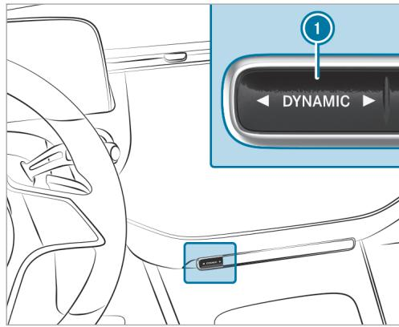  
选择驾驶模式

按下左侧或右侧的动态操控选择（DYNAMIC SELECT）按钮 $\textcircled{8}$ 。选定的驾驶模式出现在驾驶员显示屏上。

# 在 MBUX智能人机交互系统中配置动态操控选择（DYNAMIC SELECT)

MBUX智能人机交互系统：

设定》车辆

》 DYNAMIC SELECT

# 设定|驾驶模式

选择个性化模式。

选择并设定类别。

$\textcircled{1}$ 运动型电控车辆稳定行驶系统（ESP?）可以与运动型悬挂模式一起设定。

# 设定H驾驶模式 (插电式混合动力车辆)

选择混合动力。  
选择基于路径或标准。  
如果路径向导启用并且基于路径选项已启用，则会在整个路径上智能分配电能。在建筑密集区首选电动模式，在高速公路上则使用内燃机。  
使用标准选项时，车辆以其标准驱动模式（电动或混合动力）行驶。

整个路径上没有电能分配。高电压蓄电池电量耗尽，随后车辆由内燃机驱动。

# 显示车辆数据

MBUX智能人机交互系统：

信息

选择车辆。 显示车辆数据。

# 显示发动机数据

MBUX智能人机交互系统：

信息

选择发动机。  
显示发动机数据。

$\textcircled{1}$ 发动机输出功率和发动机扭矩可达到的实际（最大）值可能偏离国家和地区特定允许公差指南中的认证值（依据：UN-ECE第85号法规或具体国家和地区指南）。

可变影响因素包括：

·海拔高度

·燃油品质  
·车外温度  
·发动机工作温度

相应地调节您的驾驶方式。驾驶员显示屏上的警告灯保持亮起，直至发动机达到工作温度。

$\textcircled{1}$ 显示的数值仅用作指导。中央显示屏中显示的发动机输出功率和发动机扭矩数值可能与实际数值存在差异。

$\textcircled{ i}$ 用于显示启动车辆后功率输出限制的警告灯并非所有车型都适用。

# 调出燃油消耗量指示器

MBUX智能人机交互系统：

信息

# 选择能耗。

将显示当前及平均燃油消耗量。

# 自动变速箱

# 直接选档（DIRECT SELECT）换档杆

直接选档（DIRECT SELECT）换档杆功能

A 警告不适当的换档造成的事故风险如果发动机转速高于怠速且您将变速箱挂入回档或R档，车辆可能急剧加速。

当车辆处于静止状态时，如果您挂入变速箱档位D档或档，务必用力踩下制动踏板且勿同时加速。

A警告儿童单独留在车内无人看管造成 的事故及伤害风险

如果将儿童单独留在车内无人看管，他们可能

·开启车门，从而危及他人或其他道路使用者。  
·走出车外，被来往车辆撞伤。  
·操作车辆设备并被卡住等。

此外，儿童还可能会进行如下操作，导致车辆移动：

·解除驻车制动。  
·切换变速箱档位。  
·启动车辆。

切勿将儿童单独留在车内无人看管。离开车辆时，务必随身携带钥匙并锁止车辆。将钥匙放在儿童接触不到的地方。

A 警告未接合变速箱档位时存在的事故及伤害风险

当前变速箱档位将在驾驶员显示屏上突出显示。

如果所选变速箱档位未突出显示，说明车辆可能起步方向错误或正在溜车。

切换变速箱档位之后，务必检查驾驶员显示屏上的变速箱档位显示。

如果变速器档位在短时间内仍未在驾驶员显示屏上突出显示：

注意显示信息。  
小心起步并检查接合的变速箱档位。驻车时，接合驻车制动器固定车辆，以防溜车。  
请立即前往梅赛德斯-奔驰授权服务中心检查变速箱。

使用直接选档（DIRECT SELECT）换档杆切换变速箱档位。当前变速箱档位将在驾驶员显示屏上突出显示。

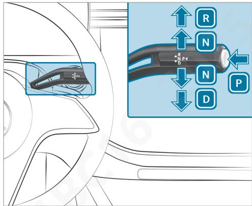

回 驻车档倒档回空档回行驶档

# 挂入倒档R

踩下制动踏板并将直接选档（DIRECTSELECT）换档杆向上推过第一个阻力点。

# 挂入空档N

踩下制动踏板并将直接选档（DIRECTSELECT）换档杆向上或向下推过第一个阻力点。

$\textcircled{1}$ 如果要在车辆开启的状态下切换至空档N，应向上或向下推动换档杆数秒钟至第一个阻力点。

随后松开制动踏板后可自由移动车辆，如推动或牵引车辆。

如果您想让自动变速箱保持在空档（即使车辆熄火或驾驶员侧车门开启），应进行以下操作：

在车辆处于静止状态时，踩下制动踏板并接合空档。  
松开制动踏板。  
关闭车辆。

溜车风险已手动启用N档无法自动换至P档信息将出现在驾驶员显示屏上。

$\textcircled{1}$ 当您随后离开车辆且钥匙留在车内时，自动变速箱将保持在空档。

配备电子车钥匙的车辆：请确保车钥匙或电子车钥匙在车内，并且自动变速箱保持在空档。

如果自动变速箱未保持在空档N：

·重新启动车辆，然后再次执行此过程。

一旦满足下面的一个条件，则自动重新挂入驻车档回：

·将变速箱换至回档或档。  
·按下按钮回。

# 挂入驻车档P

注意事项在车辆行驶时接合驻车档P造成损坏

如果在车辆行驶时将变速箱档位切换至驻车档位，可能会损坏变速箱。

在车辆行驶时，请勿开启车门。仅在车辆处于静止状态时，才可以挂入驻车档回。

请遵守有关驻车的注意事项

第191页)。

踩下制动踏板直至车辆停止。

在车辆处于静止状态时，按下按钮回。当出现变速箱档位显示P时，驻车档位接合。如果未出现变速箱档位显示，则施加驻车制动器并固定车辆，以防溜车。

$\textcircled{1}$ 根据情况，可能在片刻之后才接合回。因此，务必注意变速箱档位显示。

如果满足以下条件之一，则将自动挂入驻车档回：

·在变速箱处于回 档或档时关闭静止的车辆。  
）当车辆处于静止状态且变速箱处于回档或R档时开启驾驶员侧车门。当车辆滑行时，在变速箱档位处于回或R时关闭车辆并使其减速至静止。当车辆滑行时，切换至变速箱档位，使车辆静止，并在车辆处于静止状态时打开驾驶员侧车门。

·车辆需要自动挂入驻车档回。

$\textcircled{1}$ 若要在驾驶员侧车门开启的状态下进行操控，应在车辆处于静止状态时开启驾驶员侧车门并将变速箱再次挂入回档或档。

# ■挂入行驶档 D

踩下制动踏板并将直接选档（DIRECTSELECT）换档杆向下推过第一个阻力点。

当自动变速箱位于回档时，可自动换档。由于以下因素而异：

·选定的驾驶模式·加速踏板位置·车速

# 手动换档

$\textcircled{1}$ 对于插电式混合动力车辆，请注意有关再生制动系统的信息 第165页)。

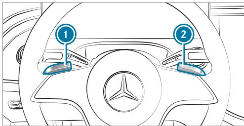

当自动变速箱换至回档时，可使用方向盘换档拨片手动换档。在允许的情况下，自动变速箱将根据方向盘换档拨片的拉动情况升高或降低一个档位。

自动变速箱手动换档具有两个选项：

·临时设定·永久设定

停用手动换档后，可进行自动换档。

# 临时设定：

启用：拉动方向盘换档拨片 $\textcircled{8}$ 或 $\textcircled{6}$ 。手动换档将短时间启用。变速箱档位显示中将显示M 和当前档位。

$\textcircled{ i}$ 手动换档启用的时间取决于各种因素。在以下情况下，手动换档可以自动停用：

·驾驶模式改变时  
·车辆已重新启动时  
，再次挂入变速箱档位回时  
·驾驶方式

升档：拉动方向盘换档拨片 $\textcircled{6}$

降档：拉动方向盘换档拨片 $\textcircled{8}$ 停用：拉住方向盘换档拨片 $\textcircled{6}$ 变速箱档位显示中将显示回。

$\textcircled{1}$ 您可以在MBUX智能人机交互系统中永久启用或停用手动换档。

# 永久启用/停用手动换档

MBUX智能人机交互系统：

／设定车辆行驶

永久启用或停用该功能。

# 换档提示

启用手动换挡系统时，换挡建议可帮助您采用经济型驾驶方式。

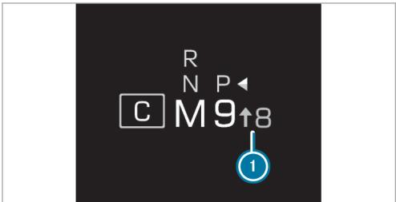

当驾驶员显示屏上显示换档提示 $\textcircled{6}$ 时，请换至建议的档位。

# 使用强制降档

最大加速度：踩下加速踏板，使其越过阻力点。

为防止发动机超速运转，当发动机达到最高转速时，自动变速箱升至下一档位。

# 滑行模式功能

在采用可预期的驾驶方式的情况下，滑行模式有助于降低燃油消耗量。

滑行模式的特点在于：

·内燃机将根据行驶情况关闭。车辆的所有功能仍将运行。·变速箱档位显示回显示为绿色。

如果满足以下条件，滑行模式将会启用：

·已选择驾驶模式。  
·车速在适当的范围内。道路路线合适，例如无陡峭的坡道或急弯。蓄电池充电电量充足。未踩下加速踏板或制动踏板（轻踩制动踏板的情况除外）。  
$\textcircled{1}$ 如已在驾驶模式下为驱动选定"ECO"设定，则滑行模式也会启用。

当上述任意一个条件不满足时，滑行模式将会再次停用。

以下参数也可避免滑行模式：

·坡度   
）下坡坡度 温度 高度 车速 发动机操作条件   
·交通状况

# 全时四轮驱动（4MATIC）功能

4MATIC 确保驱动所有四个车轮。4MATIC与电控车辆稳定行驶系统（ESP?）和四轮驱动电子牵引辅助系统（4ETS）同时工作，在动轮因牵引力不足而滑转时提高车辆的牵引力。

如果您未调整驾驶方式，4MATIC 将无法降低事故风险，也无法超越物理法则。4MATIC无法将道路、天气和交通状况考虑在内。

4MATIC 仅是一种辅助工具。您应尤其负责确保与前方车辆的安全车距、车速、及时制动以及在车道内行驶。

$\textcircled{1}$ 在冬季路面状况下，仅在使用冬季轮胎（M+S轮胎）时才能使4MATIC实现最佳效果，并在必要时使用防滑链。

# 加注燃油

# 为车辆加注燃油

A 警告 燃料引发的火灾或爆炸风险

燃料高度易燃。

务必避免点火、使用明火、吸烟和引起火花。  
加油前，关闭车辆和驻车加热器（如有安装），并在加油期间保持关闭状态。

A 警告燃油有造成伤害的风险燃油有毒并会危害健康。

切勿吞下燃油或者使其接触皮肤、眼睛或衣物。  
不要吸入燃油气雾。  
将燃油放到儿童接触不到的地方。

加注时使车门和车窗保持关闭。

如果您或他人接触到燃油，请遵守以下事项：

立即用肥皂和清水彻底冲洗皮肤上的燃油。  
如果眼睛接触了燃油，应立即用清水彻底洗净，然后立即就医。  
如果吞入燃油，应立即就医。不要引吐。  
立即更换沾到燃油的衣物。

A 警告静电积累造成的火灾和爆炸风险静电积累会点燃燃油气雾。

开启加油口盖或抓住注油枪前，请先触摸金属车身。  
为避免造成其他静电积累，请勿在加注燃油过程中进入车内。

# 注意事项使用不恰当燃油造成的损坏

汽油发动机车辆：

即使误加少量的不适当燃油也会损坏燃油系统、发动机和排放控制系统。

仅可加注火花点火式发动机低硫燃油。

汽油最多可含 $2 5 \%$ 乙醇（体积比）。-有关适用燃油的信息，请参见加油口盖板上的信息标签。

有关适用燃油的详细信息，请咨询具有资质的专业服务中心。

切勿加注以下任何类型的燃油：

·柴油  
·乙醇含量超过您的车辆的推荐值的汽油甲醇含量（体积比）超过 $3 \%$ 的汽油，例如M15、M30、M50、M85、M100  
含金属添加剂的汽油

如不慎添加了错误的燃油：

请勿开启车辆。  
请咨询梅赛德斯-奔驰授权服务中心。

注意事项 请勿给汽油发动机车辆加注柴油。

如不慎添加了错误的燃油：

·请勿开启车辆。否则，燃油可能会进入发动机。即使是误加少量的不适当燃油也可能损坏燃油系统和发动机。修理成本很高。请咨询具有资质的专业服务中心。请完全排空燃油箱和燃油管路。

注意事项燃油箱过满导致燃油系统损坏

向燃油箱中加注燃油，直至注油枪关闭。

如果由于加油泵故障等原因导致加注过多燃油：

请勿开启车辆。  
请咨询具有资质的专业服务中心。

<table><tr><td></td><td>注意事项取下注油枪时，燃油可能会 溅出</td></tr><tr><td>闭。</td><td>向燃油箱中加注燃油，直至注油枪关</td></tr></table>

# 要求：

·车辆解锁。·配备汽油发动机的插电式混合动力车辆：加注燃油前燃油箱已通风 第177页)。

请遵守有关工作液和燃油的注意事项。有关本车的推荐辛烷值，请参见加油口盖板内侧的信息标签。

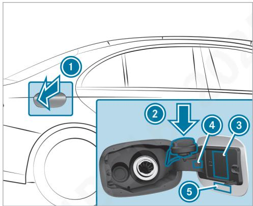

$\textcircled{6}$ 加油口盖板$\textcircled{6}$ 加油口盖支架$\textcircled{6}$ 轮胎气压表$\textcircled{9}$ 救援卡二维码$\textcircled{6}$ 燃油类型

$\textcircled{1}$ 配备汽油发动机的插电式混合动力车辆：燃油箱通风后，加油口盖板自动开启第177页)。

按下加油口盖板 $\textcircled{8}$ 中后部位。  
沿逆时针方向转动油箱盖并将其取下。将油箱盖从上方插入支架 $\textcircled{6}$ 。  
将注油枪完全插入燃油箱加注管，钩入位并加注燃油。  
向燃油箱中加注燃油，直至注油枪关闭。将油箱盖放回至燃油箱加注管上并沿顺时针方向转动，直至听到其卡入位的声音。关闭加油口盖板 $\textcircled{6}$ 。

# 释放燃油箱压力（配备汽油发动机的插电式混合动力车辆)

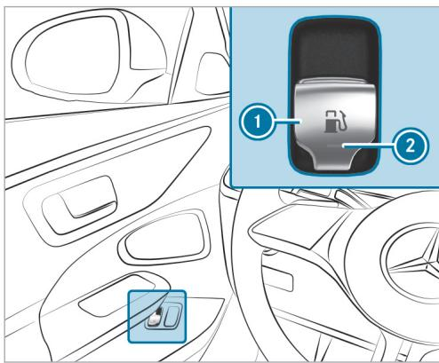

轻拉一下开关 $\textcircled{6}$ 。

指示灯 $\textcircled{6}$ 将闪烁且请稍候 正在释放油箱压力信息将出现在驾驶员显示屏上。

释放燃油箱压力后，指示灯 $\textcircled{6}$ 将持续亮起。

油箱压力已释放 可开始加油 信息将出现在驾驶员显示屏上，并且加油口盖板将自动开启。

$\textcircled{ i}$ 释放燃油箱压力可能需要几分钟。只有满足上述条件，才能释放燃油箱压力。否则，请驾驶车辆至少0.5公里并重复该过程。

$\textcircled{ i}$ 在以下情况下可能存在故障：

·指示灯 $\textcircled{6}$ 先闪烁，随后熄灭。  
·黄色发动机诊断警告灯亮起。

<table><tr><td>！ 损坏</td><td>注意事项开启加油口盖板时对其造成</td></tr><tr><td>会损坏加油口盖板或开启机构。</td><td>如果试图打开未解锁的加油口盖板，可能</td></tr><tr><td>只在加油口盖板自动开启后加注燃 油。</td><td></td></tr><tr><td></td><td></td></tr></table>

# 为高电压蓄电池充电（插电式混合动力车辆）为高电压蓄电池充电的注意事项

注意让车辆长时间闲置造成的高电压蓄电池损坏

锂离子电池会自然放电。

因此，如果车辆闲置数月，则可能会出现电量耗尽。这会损坏高电压蓄电池。

为避免损坏，请在处理高电压蓄电池时遵守以下建议。

注意事项 因未遵守以下建议导致的高电压蓄电池加速老化

由于其基本特性，高电压蓄电池的存储容量和可用电量会随其使用寿命而降低。因此，这会影响车辆电驱动的最大可行驶里程以及最大电力输出。

以下因素可能会加速高电压蓄电池老化：

·电量高，特别是在车辆长时间闲置情况下

·频繁直流快速充电(模式4)

·车辆在高温环境下长时间闲置为避免高电压蓄电池加速老化，处理高电压蓄电池时请遵守以下建议：

注意事项 在海拔极高的地方为高电压蓄电池充电对驱动系统造成的损坏

如果在海拔超过4,000 米 的地方为高电压蓄电池充电，则可能会损坏驱动系统。之后，可能无法再继续行驶。

避免在海拔极高的地方充电。

操作高电压蓄电池时的建议：

·仅在必要时使用直流电（模式4）为高电压蓄电池快速充电。  
·如果长时间闲置，请在高电压蓄电池充电电量介于30%至50%之间的情况下关闭车辆。切勿将高电压蓄电池永久连接到电源上。  
·如果车辆长时间闲置，请尽可能避免停放于车外高温环境中。  
·每六周检查一次高电压蓄电池充电电量第191页)。  
·如果充电电量低于 $1 5 \%$ ，确保为高电压蓄电池充电。即使车辆长时间闲置，也请勿断开12伏蓄电池。否则将无法监控车辆的高电压蓄电池。  
·如果高电压蓄电池仅在低充电电量的情况下使用，请每六个月将高电压蓄电池充满电。

可以使用交流电（模式2或3）和直流电（模式4）为高电压蓄电池充电。

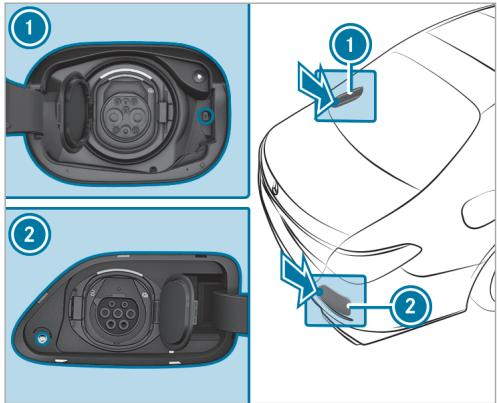

$\textcircled{8}$ 用于直流充电的车辆插座$\textcircled{6}$ 用于交流充电的车辆插座插座盖板与车辆一起中央锁止和解锁。如需打开插座盖板 $\textcircled{8}$ ，请按下插座盖板中后部并将其向前翻开。如需打开插座盖板 $\textcircled{6}$ ，请按下插座盖板左下部并将其向外翻开。

$\textcircled{1}$ 还可通过MBUX智能人机交互系统打开插座盖板 第290页)。

高电压蓄电池充电选项（模式2、3或4）：

·通过再生行驶时 ·静止时交流充电： 025  
使用电源插座(模式2)使用壁挂式充电盒或充电站（模式3)  
·静止时直流充电：使用快速充电站 (模式4)根据具体国家和地区的车辆配置以及您车辆的充电电缆，也可以进行单相交流电充电。充电时，请注意当前位置的不同电源要求。请仅使用符合电源要求的充电电缆。如有任何疑问，请咨询具有资质的电工或当地电源运营商。  
建议在壁挂式充电盒或充电站为高电压蓄电池充电，以获取更高充电功率和更好的充电效率。

# 系统限制

高电压蓄电池的性能可能受以下因素影响：

·车外高温或低温

·车上的辅助电气设备开启，例如操作空调系统  
·长时间停机未充电

高电压蓄电池的充电时长或充电功率可能会因以下因素而延长或升高：

·车外高温或低温  
·高电压蓄电池在充电电量过低或过高的情况下  
·充电设备的最大可用充电电流

# 有关使用电源插座（模式2）为高电压蓄电池充电的注意事项

A危险零部件安装不当有造成致命伤害的风险

例如，使用安装不当的零部件将充电电缆连接到电源插座可能会导致火灾或触电。

仅应将充电电缆连接至满足以下条件的电源插座：

·安装正确，且·已由具有资质的电工检查出于安全考虑，请仅使用随车提供的充电电缆或原装梅赛德斯-奔驰充电电缆。

请到梅赛德斯-奔驰授权服务中心购买这些部件，并在那里获取建议。

梅赛德斯-奔驰对这些原厂充电电缆进行了充分的测试，以确保其适用于您车辆的高压充电。

切勿使用损坏的充电电缆。

切勿使用：

·延长电缆·延长卷轴·复式插座

仅可使用经制造商测试并认可适用于为电动车高电压蓄电池充电的插座适配器。切勿使用多个插座适配器。从电源插座充电时，仅可使用合适的交流充电插座适配器。

请遵守插座适配器使用说明书（用户手册）中的安全注意事项。

仅可使用以下充电电缆：

·经梅赛德斯-奔驰认可适用于本车辆的充电电缆。

充电过程因电源设备而异。使用电源插座为高电压蓄电池充电花费的时间要比使用壁挂式充电盒或充电站充电花费的时间长得多。进行此项操作时，请务必遵守当地的相关信意。

请勿使充电电缆操作单元从电源插座上松弛悬垂下来。

请勿使用以下零部件提升操作单元：

·充电电缆插头 ·电源插头

充电时，保护好充电电缆操作单元，避免因太阳直射等造成过热。否则，充电过程可能会被中止。

# 有关通过壁挂式充电盒或充电站为高电压蓄电池充电（模式3）的注意事项

A 危险零部件安装不当有造成致命伤害的风险

使用不正确安装的组件将充电电缆连接到车辆可能会引起火灾或触电等。

$\blacktriangleright$ 仅可将充电电缆连接至满足以下条件的壁挂式充电盒：壁挂式充电盒安装正确·壁挂式充电盒已由具有资质的电工检查充电电缆未损坏  
$\blacktriangleright$ 切勿拉伸充电电缆。  
$\blacktriangleright$ 切勿使用适配器。请遵守壁挂式充电盒操作手册中的安全注意事项。

危险使用损坏的零部件有造成致命伤害的危险

如果使用损坏的零部件将车辆连接到充电站，可能会导致火灾或触电等事故。

请目视检查充电站是否有明显的损坏迹象，例如外壳或充电电缆连接是否有严重损坏。  
切勿使用损坏的充电电缆。  
切勿拉伸充电电缆。  
仅可使用经制造商测试并认可适用于为电动车高电压蓄电池充电的插座适配器。切勿使用多个插座适配器。要使用交流充电站充电（模式3），仅可使用相应的交流充电插座适配器。要使用直流快速充电站充电（模式4），仅可使用直流充电插座适配器。

请务必遵守充电站安全说明。

A危险在充电过程中执行保养工作时的致命伤害风险

在充电过程中，高电压车载电气系统带有高电压。

在充电过程中，切勿执行任何保养工作。

注意事项允许使用交流充电的充电站类型（模式3)

在未配S2配置的先导电路的充电站充电可能会导致充电中断、短路或车辆损坏。

仅在为配有S2配置的先导电路（典型先导电流）的车辆提供的充电站充电。充电站必须符合国家标准GB/T18487-2015"电动汽车传导充电“，第1部分，附件A.1.1以及国家标准GB/T18487.1-2023"电动汽车传导充电系统，第1部分：通用要求"的要求。

更多信息，请咨询相应的充电站操作员。

大多数充电站都必须先启用才能进行充电，例如使用汽车电子标识卡或通过即插即充。请遵守充电站操作员的现场操作指示以及有关梅赛德斯-奔驰充电的说明（请参见车辆的电子使用说明书（用户手册））。

充电站显示的充电过程中分配的能量可能高于高电压蓄电池实际吸收的能量。这是不同程度的充电损失的结果，并被描述为充电效率。由于充电过程中或运行辅助电气设备等导致热量积聚，会产生充电损耗。有关充电效率的详细信息，请咨询具有资质的专业服务中心。

# 在快速充电站为高电压蓄电池充电的注意事项 (模式4)

A危险使用损坏的零部件有造成致命伤害的危险

如果使用损坏的零部件将车辆连接到充电站，可能会导致火灾或触电等事故。

请目视检查充电站是否有明显的损坏迹象，例如外壳或充电电缆连接是否有严重损坏。  
切勿使用损坏的充电电缆。  
切勿拉伸充电电缆。  
仅可使用经制造商测试并认可适用于为电动车高电压蓄电池充电的插座适

配器。切勿使用多个插座适配器。要使用交流充电站充电（模式3），仅可使用相应的交流充电插座适配器。要使用直流快速充电站充电（模式4），仅可使用直流充电插座适配器。

请务必遵守充电站安全说明。

A 危险在充电过程中执行保养工作时的致命伤害风险

在充电过程中，高电压车载电气系统带有高电压。

在充电过程中，切勿执行任何保养工作。

# 注意事项适用于直流充电的充电站许可类型（模式4)

在适用于配备24伏车载电气系统的车辆的快速充电站（例如客运型车辆充电站)充电可能导致车辆损坏，阻止进一步的直流充电。

仅在适用于配备12伏车载电气系统的乘用车的快速充电站充电。

确保看清充电站的标识和充电站上的说明，或询问充电站操作员。如有疑问，请到其他快速充电站。

在海外时，请遵守相关国家和地区的充电法规。

$\textcircled{6}$ 温度监测显示$\textcircled{5}$ 安全系统显示

大多数充电站都必须先启用才能进行充电，例如使用汽车电子标识卡或通过即插即充。请遵守充电站操作员的现场操作指示以及有关梅赛德斯-奔驰充电的说明（请参见车辆的电子使用说明书（用户手册））。

充电站显示的充电过程中分配的能量可能高于高电压蓄电池实际吸收的能量。这是不同程度的充电损失的结果，并被描述为充电效率。由于充电过程中或运行辅助电气设备等导致热量积聚，会产生充电损耗。有关充电效率的详细信息，请咨询具有资质的专业服务中心。

# 使用电源插座充电时的最大允许充电电流

随附的充电电缆设定为因国家和地区而异的最大充电电流。海外充电时，最大值可能会超出该国家和地区的允许值。

在使用电源插座充电前，请让具有资质的电工检查相应电源插座或建筑物设施的最大允许充电电流。

如有关于充电电流方面的任何疑问或出现故障，请联系具有资质的专业服务中心。

# 充电电缆控制面板概述

您的车辆可能配备以下两种模式2充电电缆中的一种。相应的模式2充电电缆控制面板显示充电进程当前状态。

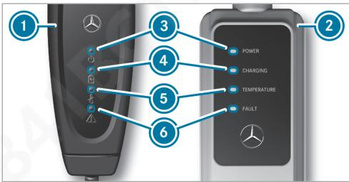

$\textcircled{8}$ Gen5充电电缆 $\textcircled{6}$ Gen4充电电缆 $\textcircled{6}$ 电源电压指示 $\textcircled{9}$ 充电过程显示 温度监测显示TEMPERATURE 如果温度监测器 $\textcircled{6}$ 指示故障，则可能是帮 助保护充电电缆免受阳光直射。

<table><tr><td>显示屏</td><td>含义</td></tr><tr><td>呈白色亮起</td><td>有电源电压。</td></tr></table>

<table><tr><td>显示屏</td><td>含义</td></tr><tr><td>呈绿色闪烁</td><td>高电压蓄电池正在 充电。</td></tr></table>

安全系统显示FAULT  

<table><tr><td rowspan=1 colspan=1>显示屏</td><td rowspan=1 colspan=1>含义</td></tr><tr><td rowspan=1 colspan=1>呈红色亮起</td><td rowspan=1 colspan=1>绿色LED 灯同时闪烁：温度过高－充电功率下降。绿色 LED 灯不闪烁：温度过高－充电过程停止。</td></tr><tr><td rowspan=1 colspan=1>呈红色闪烁</td><td rowspan=1 colspan=1>电源插头温度过高-充电过程停止。</td></tr></table>

<table><tr><td rowspan=1 colspan=1>显示屏</td><td rowspan=1 colspan=1>含义</td></tr><tr><td rowspan=1 colspan=1>呈红色闪烁</td><td rowspan=1 colspan=1>充电电缆或内部故障-无法充电重设充电电缆控制面板（Gen5充电电缆O</td></tr><tr><td rowspan=1 colspan=1>呈红色亮起41B（Gen5充电电缆O</td><td rowspan=1 colspan=1>白色LED灯熄灭：电源故障-无法充电，请使用不同的电源插座。白色LED 灯亮起：车辆故障-无法充电，请重设充电电缆控制面板。</td></tr><tr><td rowspan=1 colspan=1>呈红色亮起（Gen4充电电缆?</td><td rowspan=1 colspan=1>基础设施故障－无法充电，请使用不同的电源插座</td></tr></table>

# Gen4充电电缆

如果充电电缆控制面板探测到残余电流或故障，则充电过程会中断。如已排除故障，则充电过程自动重新开始。

# Gen5充电电缆

所有四个显示亮起时，充电电缆控制面板正在执行自测试。

重设Gen5充电电缆控制面板：如果安全系统$\textcircled{9}$ 指示充电电缆故障或车辆故障，则首先重设充电电缆控制面板。为此，将充电电缆从车上和电源插座上断开，并等待约5秒钟。如果重新连接充电电缆后故障仍存在，则无法在电源插座上充电。必须到具有资质的专业服务中心更换充电电缆或检查车辆插头，具体取决于读取结果。

# 车辆插座上指示灯的功能

插座盖板是与车辆一起中央锁止和解锁。

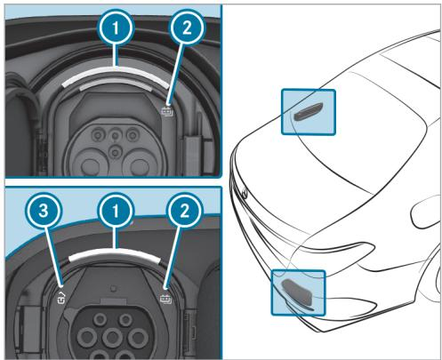

$\textcircled{8}$ 插座灯 $\textcircled{6}$ 充电过程指示灯 $\textcircled{6}$ 锁止状态指示灯

直流充电车辆插座：插座灯 $\textcircled{8}$ 的上拱形用于照明。下拱形用于状态显示，并会像指示灯 $\textcircled{6}$ 一样闪烁或亮起。

交流充电车辆插座：插座灯 $\textcircled{8}$ 用于照明。

指示灯 $\textcircled{6}$ 和 $\textcircled{8}$ 的颜色和信号表示以下含义：

锁止状态 $\textcircled{8}$

·呈白色亮起：车辆插座解锁；插入或取下充电电缆·呈白色闪烁：锁止或解锁时发生故障

# 充电过程状态 $\textcircled{6}$

·呈绿色亮起（约90秒钟）：充电过程完成  
·呈绿色闪烁：正在充电；有能量流  
，呈橙色亮起（约90秒钟）：充电中断  
：呈橙色闪烁：正在建立连接呈红色闪烁（约60 秒钟）：车内故障;无法充电

# 开始交流充电过程(模式2/3)

A危险使用受损的插座充电时的死亡风险

充电过程中使用高压电。

如果充电电缆、车辆插座或电源插座损坏，则您可能会触电。

仅应使用完好无损的充电电缆。  
避免因挤压、打磨或车辆驶过电缆等造成机械性损伤。  
请尽快到具有资质的专业服务中心更换损坏的车辆插座。  
切勿将充电电缆连接至损坏的车辆插座。

注意充电电缆和充电端口过热造成的损坏

充电过程中，充电电缆和充电端口可能会在允许的范围内发热。

充电电缆和充电端口产生的热量受以下因素影响：

·市电电源和充电电缆完好无损。  
·遵守有关操作充电电缆和充电电缆操作单元的注意事项。如果充电电缆或充电端口过热，请检查市电电源。

注意事项插座盖板开启时车辆插座损坏或变脏

未连接充电电缆时，始终保持插座护盖和插座盖板关闭。这可防止车辆插座变脏和损坏。

关闭插座盖板前，确保插座护盖已恰当关闭。否则可能导致损坏，造成插座盖板无法再次开启。

注意事项操作不当对车辆插座或充电电缆接头造成的损坏

将充电电缆接头完全插入车辆插座时请勿用力过大（最大100牛）。否则，可能会损坏车辆插座、充电电缆接头或其触点。

如果感觉阻力增大，请将充电电缆接头从插座中拔出，然后重新插入。

# 要求：

·变速箱处于回档。  
·车辆解锁。  
·充电电缆未被拉紧。

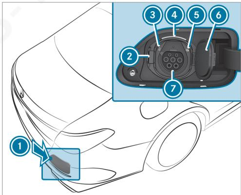

用于交流充电的车辆插座

按下插座盖板 $\textcircled{8}$ 底部左侧位置，然后向外翻开插座盖板。  
指示灯 和插座灯 $\textcircled{9}$ 呈白色亮起。  
向左按动卡子 $\textcircled{6}$ 并翻开插座护盖 $\textcircled{5}$   
如需通过电源插座充电，请将电源插头完全插入外部电源的电源插座。

将充电电缆插头完全插入车辆插座 $\textcircled{6}$ 如果壁挂式充电盒/充电站未配备充电电缆，则将车辆充电电缆接头完全插入壁挂式充电盒/充电站插座。

车辆充电电缆的插头标有以下符号：

。在壁挂式充电盒/充电站的充电电缆插头上在车辆插座的充电电缆接头上请确保插入的充电电缆未被拉紧。

如果充电站已启用，则指示灯 $\textcircled{6}$ 回呈橙色闪烁，并在高电压蓄电池充电时立即呈绿色闪烁。

当充电电缆已连接至车辆时，无法启动车辆，也不能移动车辆。

充电过程开始时，驾驶员显示屏上显示充电状态显示以及充电预测。充电预测指的是高电压蓄电池完全充满时的时间点。

$\textcircled{1}$ 根据温度的不同，在充电过程中，可能会听到风扇和蓄电池冷却系统开启的声音。  
$\textcircled{ i}$ 如果车辆长时间闲置且已连接至电源，则高电压蓄电池将根据需要或在电气设备

（例如预进入气候控制）启用时自动再充电。

$\textcircled{ i}$ 车辆配备了保险丝，以防电源过电压造成损坏。此保险丝可在强雷暴等情况下触发，并导致建筑物中的断路器熔断和充电中断。这些功能可保护车辆。建筑物的断路器复位后，充电过程会自动恢复。在建筑物断路器未触发的情况下发生电源中断时，可能需要长达10分钟时间充电过程才会自动恢复。

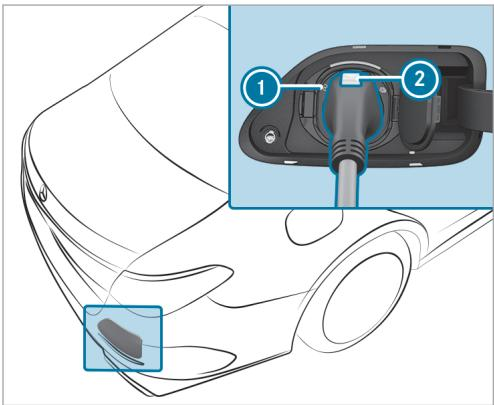  
结束交流充电过程(模式2/3)

用于交流充电的车辆插座适当情况下，终止壁挂式充电盒/充电站的充电过程，并遵守充电站的所有说明。

使用车钥匙解锁车辆或从内部中央解锁车辆。

充电结束。如果指示灯 $\textcircled{6}$ 随后呈白色亮起，则车辆插座解锁约30秒钟。

按住充电电缆插头上的按钮 $\textcircled{6}$ 并将充电电缆插头从车辆插座上拔下。

$\textcircled{1}$ 如果您无法拔出充电电缆插头，请重复该步骤。如果充电电缆接头仍锁止，请联系具有资质专业服务中心或充电站操作员。

$\blacktriangleright$ 关闭插座护盖和插座盖板。

$\textcircled{1}$ 断开充电电缆插头后，车辆插座上的指示灯 $\textcircled{6}$ 保持亮起一段时间，之后熄灭。

# 开始直流充电过程 (模式4)

A 危险 使用受损的插座充电时的死亡风险

充电过程中使用高压电。  
如果充电电缆、车辆插座或电源插座损坏，则您可能会触电。仅应使用完好无损的充电电缆。  
避免因挤压、打磨或车辆驶过电缆等造成机械性损伤。  
请尽快到具有资质的专业服务中心更换损坏的车辆插座。  
切勿将充电电缆连接至损坏的车辆插座。

# 注意充电电缆和充电端口过热造成的损坏

充电过程中，充电电缆和充电端口可能会在允许的范围内发热。

充电电缆和充电端口产生的热量受以下因素影响：

·市电电源和充电电缆完好无损。  
·遵守有关操作充电电缆和充电电缆操作单元的注意事项。如果充电电缆或充电端口过热，请检查市电电源。

注意事项插座盖板开启时车辆插座损坏或变脏

未连接充电电缆时，始终保持插座护盖和插座盖板关闭。这可防止车辆插座变脏和损坏。

关闭插座盖板前，确保插座护盖已恰当关闭。否则可能导致损坏，造成插座盖板无法再次开启。

注意事项操作不当对车辆插座或充电电缆接头造成的损坏

将充电电缆接头完全插入车辆插座时请勿用力过大（最大140牛）。否则，可能会损坏车辆插座、充电电缆接头或其触点。

如果感觉阻力增大，请将充电电缆接头从插座中拔出，然后重新插入。

# 要求：

·变速箱处于档。  
·车辆已解锁或车辆已锁止且钥匙和车辆之间的距离不超过1米。  
·充电电缆未被拉紧。

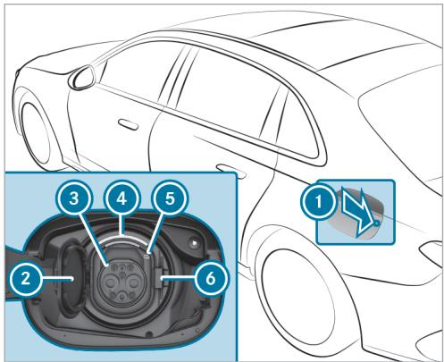

用于直流充电的车辆插座

按下插座盖板 $\textcircled{8}$ 中后部，并向前翻开插座盖板。  
上部插座灯 $\textcircled{9}$ 呈白色亮起。

$\textcircled{1}$ 还可通过MBUX智能人机交互系统打开插座盖板 第290页)。

如果车辆解锁时插座盖板 $\textcircled{8}$ 仍无法开启，则可通过紧急解锁打开插座盖板第190页)。

向右按动卡子 $\textcircled{5}$ 并打开插座护盖 $\textcircled{6}$ 将充电电缆插头完全插入车辆插座 $\textcircled{6}$ 请确保插入的充电电缆未被拉紧。如果充电站已启用，则指示灯 $\textcircled{6}$ 和下部状态显示 $\textcircled{6}$ 呈橙色闪烁，并在高电压蓄电池充电时立即呈绿色闪烁。

当充电电缆已连接至车辆时，无法启动车辆，也不能移动车辆。

充电过程开始时，驾驶员显示屏上显示充电状态显示以及充电预测。充电预测指的是至设定出发时间时的预计充电电量，或高电压蓄电池电量充满时的时间。

$\textcircled{ i}$ 根据温度的不同，在充电过程中，可能会听到风扇和蓄电池冷却系统开启的声音。  
$\textcircled{1}$ 如果车辆长时间闲置且已连接至电源，则高电压蓄电池将根据需要或在电气设备（例如预进入气候控制）启用时自动再充电。

# 结束直流充电过程 (模式4)

# 要求：

·车辆已解锁或车辆已锁止且钥匙和车辆之间的距离不超过1米。

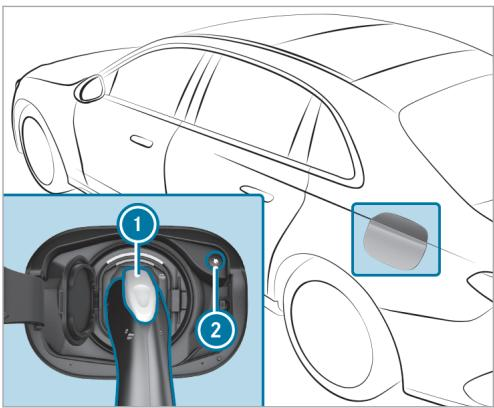

用于直流充电的车辆插座

按下充电中断按钮 $\textcircled{6}$ ，必要时请遵守充电站的附加说明。

# 或者

结束在充电站的充电过程。

充电结束。

$\textcircled{1}$ 或者，仅当充电中断按钮 $\textcircled{6}$ 不起作用时，才可使用车钥匙解锁车辆或从内部中央解锁车辆以结束充电过程并解锁车辆插座。

如配备，请按住充电电缆插头上的按钮O，并将充电电缆插头从车辆插座上拔出。

$\textcircled{1}$ 如果您无法拔出充电电缆插头，请解锁车辆并重复解锁步骤。如果充电电缆插头仍然锁止，请告知充电站操作员。

$\blacktriangleright$ 关闭插座护盖和插座盖板。

# 插座盖板的紧急解锁

如果左侧壁上的插座盖板由于故障无法打开，则可执行插座盖板紧急解锁以进行充电。

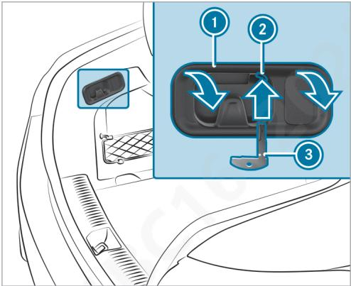

使用适当的物体，例如紧急钥匙 $\textcircled{6}$ ，将盖板的卡止弹簧 $\textcircled{8}$ 向上按压穿过孔口② 然后小心地将盖板从行李箱衬里中取出。

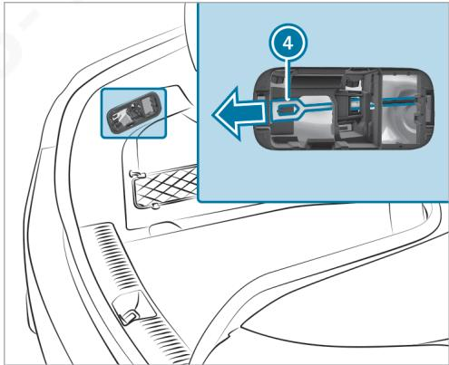

$\textcircled{1}$ 在紧急解锁装置 $\textcircled{9}$ 下方行李箱衬里后面还有一根柔性电缆。这仅用于在具有资质的专业服务中心进行维修作业。

沿箭头方向拉动紧急解锁装置 $\textcircled{9}$ c车辆插座的插座盖板旋开。

将盖板 $\textcircled{8}$ 插入行李箱衬里，直至其接合。在此过程中，请注意挂钩和背面导销的位置。

开始直流电充电过程 第188页)。

# 驾驶员显示屏上的充电状态显示功能

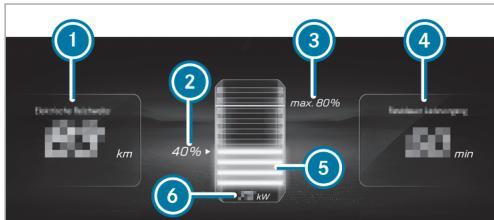

当前充电电量下的剩余可行驶距离

$\textcircled{6}$ 高电压蓄电池当前充电电量

® 最大充电电量（根据设定）

$\textcircled{6}$ 充满电之前的剩余时间（达到所选最大充电电量）

$\textcircled{6}$ 动态充电状态显示

$\textcircled{5}$ 当前充电功率

$\textcircled{ i}$ 显示的剩余可行驶距离?可能因为驾驶方式或地形等各种因素而存在差异。

当车辆关闭且已连接至电源时，充电状态显示在驾驶员显示屏上显示约2分钟。

$\textcircled{ i}$ 当前充电功率 $\textcircled{8}$ 数值可能与充电站上的显示存在差异。

# 驻车

# 停驻车辆

、警告 固定不足的车辆溜车造成的事故及伤害风险

如果车辆停驻固定不足，即使在坡度较小的下坡路上也可能会以不可控的方式溜车。

在上坡或下坡路上时，应将前轮转向路缘，以使车辆在溜车时朝路缘移动。

施加驻车制动。  
将变速箱切换至档位回。

警告 烫热的排气系统部件造成的火灾凤险

树叶、草或细枝等易燃材料可能会被引燃。

驻车时应避免易燃材料与烫热的车辆部件接触。  
特别是，请勿在干燥的草地或已收割的粮田上驻车。

警告儿童单独留在车内无人看管造成的事故及伤害风险

如果将儿童单独留在车内无人看管，他们可能

·开启车门，从而危及他人或其他道路使用者。

·走出车外，被来往车辆撞伤。

·操作车辆设备并被卡住等。

此外，儿童还可能会进行如下操作，导致车辆移动：

·解除驻车制动。  
·切换变速箱档位。  
·启动车辆。

切勿将儿童单独留在车内无人看管。离开车辆时，务必随身携带钥匙并锁止车辆。将钥匙放在儿童接触不到的地方。

这也适用于电子车钥匙。

# 注意事项因溜车造成的车辆损坏

务必固定车辆，以防溜车。

踩下制动踏板，使车辆处于静止状态。在坡道上，应将前轮转向路缘，以使车辆在溜车时朝路缘移动。  
施加电动驻车制动器。  
当车辆处于静止状态并踩住制动踏板时，挂入变速箱档位 第172页)。  
通过按下按钮 $\textcircled{8}$ 关闭车辆。  
缓慢地释放行车制动器。

下车并锁止车辆。

$\textcircled{1}$ 停驻车辆后，如果驾驶员侧车门处于关闭状态，您仍可操作侧车窗和全景式滑动天窗约4分钟。

# 锁止时自动关闭车辆

您的车辆配备发动机自动关闭功能。当您离开准备行驶的车辆时，在以下条件下锁车时车辆将会关闭：

·点火开关开启或发动机正在运转。  
·已接合变速箱档位回。  
·驾驶员侧车门关闭。

# ·此外，还必须满足以下任意一个条件：

车辆是使用车钥匙锁止的。  
配备无钥匙进入（KEYLESS-GO）功能的车辆：车辆是通过已关闭车门车门拉手上的无钥匙进入（KEYLESS-GO）功能锁止的。  
配备无钥匙进入（KEYLESS-GO）功能的车辆：车辆是通过行李箱盖上的锁止按钮锁止的。

$\textcircled{ i}$ 如果您离开车辆后未按说明锁止车辆，发动机将继续运转。在这种情况下，请手动关闭车辆。

# 一段时间后自动关闭车辆(取决于装备）

当发动机运转时，在您离开车辆或在变速箱档位P保持一定时间后，驾驶员显示屏上将出现以下显示信息：车辆行驶准备就绪 车辆将在上锁时或 在XX分钟后自动关闭

车辆将在总共20分钟的保持时间后自动关闭。

$\textcircled{1}$ 为避免在一段时间后自动关闭，请确认MBUX智能人机交互系统中央显示屏上的相应信息。

在下列情况下，发动机将继续运行：

·如果离开车辆后未按说明锁止车辆·如果显示信息未提示将自动关闭·如果在一段时间后通过中央显示屏上的相应信息停用了自动关闭功能

在这种情况下，请手动关闭车辆。

# 电动驻车制动器

# 电动驻车制动器功能（自动施加)

A警告儿童单独留在车内无人看管造成 的事故及伤害风险

如果将儿童单独留在车内无人看管，他们可能

·开启车门，从而危及他人或其他道路使用者。  
·走出车外，被来往车辆撞伤。  
·操作车辆设备并被卡住等。

此外，儿童还可能会进行如下操作，导致车辆移动：

·解除驻车制动。  
·切换变速箱档位。  
·启动车辆。

切勿将儿童单独留在车内无人看管。离开车辆时，务必随身携带钥匙并锁止车辆。

将钥匙放在儿童接触不到的地方。

这也适用于电子车钥匙。

如果变速箱位于回档且满足以下其中一个条件，则将施加电动驻车制动：

·车辆关闭。  
·驾驶员未系安全带且驾驶员侧车门开启。

$\textcircled{1}$ 防止施加：拉动电动驻车制动拉手第194页)。

在以下情况下，也会施加电动驻车制动：

·保持（HOLD）功能使车辆处于静止状态。  
·自适应巡航使车辆停驻。  
·智能泊车使车辆处于静止状态。

·此外，还必须满足以下任意一个条件：

车辆关闭。  
驾驶员未系安全带。  
系统故障。  
供电不足。

-车辆长时间处于静止状态。

·配备智能泊车的车辆：在以下情况下，电动驻车制动器也会接合：

驻车过程完成时。  
驻车过程中发生错误时。

已施加电动驻车制动时，驾驶员显示屏上的红色指示灯 $\boxed { ( \bullet ) }$ 亮起。

$\textcircled{1}$ 如已通过自动节能启停功能关闭车辆，则将不会自动施加电动驻车制动。

# 电动驻车制动器功能（自动施加)

当满足以下条件时，电动驻车制动将解除：

·驾驶员侧车门关闭。  
·车辆已启动。  
变速箱处于回档或档且您踩下加速踏板或在水平地面上将变速箱从回档切换至回档或档。  
·如果变速箱处于档，则行李箱盖必须关闭。  
·驾驶员未正确系安全带。

如果驾驶员未系安全带，则以下条件必须满足：

-您将变速箱换出档。

如已解除电动驻车制动，则驾驶员显示屏上的红色指示灯熄灭。

# ■手动施加/解除电动驻车制动

# 施加

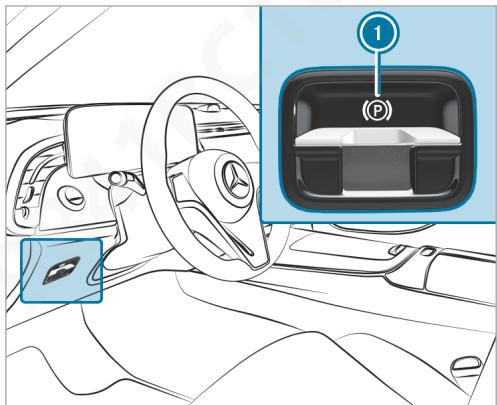

车辆处于静止状态时，推动拉手 $\textcircled{8}$ 。驾驶员显示屏上的红色指示灯亮起。

$\textcircled{1}$ 仅当红色指示灯持续亮起时，才表示已牢固施加电动驻车制动。

# 解除

开启车辆。  
拉动拉手。  
驾驶员显示屏上的红色指示灯 $\boxed { ( \textcircled { \pm } ) }$ 熄灭。

# 紧急制动

按住拉手。  
只要车辆行驶，就会显示信息松开驻车制动器且红色指示灯 $\boxed { ( \textcircled { \bullet } ) }$ 闪烁。  
当制动车辆使其停止时，将施加电动驻车制动。驾驶员显示屏上的红色指示  
灯亮起。

# 有关停放车辆的注意事项

如果车辆停放时间超过六周，则可能会因为长时间不使用而造成损坏。

12 伏蓄电池也可能因严重放电而受损或损坏。

$\textcircled{ i}$ 有关详细信息，请咨询具有资质的专业服务中心。

# 备用模式(起动机蓄电池闲置期延长)

# ■启用/停用待机模式(停放车辆)

# 要求：

·车辆启动。  
·车辆尚未启动。

MBUX智能人机交互系统：

设定 车辆 其他功能

启用或停用待机模式。

# 驾驶和驾驶安全系统

# 驾驶系统和您的责任

您的车辆配备驾驶系统，可在行驶、驻车和挪车过程中为您提供辅助。驾驶系统仅是辅助工具。无法代替您观察周围环境，且无法减轻您遵守交通法则的责任。驾驶员应时刻负责与前方车辆保持安全车距、控制车速、及时制动并保持在车道内行驶。时刻注意交通状况并在必要时介入。请注意使用这些系统的安全限制。

如果您未调整驾驶方式，则驾驶系统将无法降低事故风险，也无法超越物理法则。该系统无法时刻考虑到道路、天气或交通状况。

$\textcircled{ i}$ 一些驾驶系统可将车速调节至或限制为先前设定的值。更换驾驶员时，请提醒注意存储的车速。

# 有关车辆传感器和摄像头的信息

A警告车辆传感器或摄像头探测能力受影响导致事故的风险

如果车辆传感器或摄像头区域被遮挡、损坏或脏污，则某些驾驶系统和驾驶安全系统可能无法再正常工作。存在事故风险。

始终保持车辆传感器和摄像头区域无障碍物并保持清洁。

请到具有资质的专业服务中心维修保险杠、散热器格栅的损坏或风挡玻璃上摄像头区域的石击损伤。

某些驾驶系统和驾驶安全系统使用摄像头以及雷达或超声波传感器监控车辆前方、后方或周围区域。

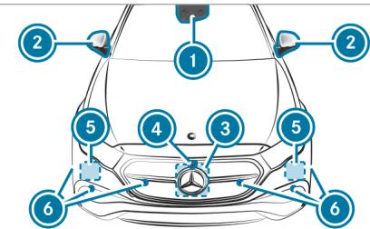

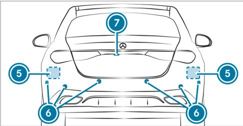

多功能摄像头$\textcircled{6}$ 车外后视镜中的摄像头

$\textcircled{6}$ 前雷达$\textcircled{6}$ 前视摄像头$\textcircled{6}$ 拐角雷达$\textcircled{5}$ 超声波传感器$\textcircled{6}$ 后视摄像头

尤其要保持传感器和摄像头区域无污垢、冰或雪泥。 第326页).传感器和摄像头不得被遮盖，并且其周围的探测区域必须保持通畅。请勿在传感器和摄像头的探测区域内安装附加的牌照支架、广告、标签、车衣、车膜或防碎石箔膜。确保没有外悬/外凸物体伸入探测区域内。

如果保险杠或散热器格栅损坏或受到撞击，请到具有资质的专业服务中心检查传感器的功能。请到具有资质的专业服务中心维修风挡玻璃上摄像头区域的损坏或石击损伤。

$\textcircled{1}$ 即使显示屏中没有摄像头视图，后视摄像头也可能自动展开和收回，以达到校准的目的。

# 驾驶系统和驾驶安全系统概述

# 驾驶和驾驶安全系统

·防抱死制动系统（ABS） 第197页)·制动辅助系统（BAS） 第197页)

·电控车辆稳定行驶系统（ $\mathsf { E S P } ^ { \mathtt { ( B ) } }$ ）第198页)电控车辆稳定行驶系统（ $\mathsf { E S P } ^ { \mathtt { ( B ) } }$ ）侧风稳定控制辅助系统 第199页)  
·电子制动力分配（EBD） 第200页)  
·转向辅助功能（STEER CONTROL）第200页)  
·保持（HOLD）功能 第200页)  
）坡道起步辅助系统 第201页)  
）自适应制动灯 第201页)  
·注意力辅助系统（ATTENTION ASSIST）第201页)  
定速巡航控制 第203页)  
·限速器 第204页)  
·交通标志辅助系统 第226页)  
·动态车身控制（DYNAMIC BODYCONTROL） 第236页)

# 驾驶辅助组件

·自适应巡航 第207页)·基于场景的车速调节 第211页)

·主动式紧急制动 第221页)

·智能领航转向功能 第213页)

·主动式紧急停车辅助 第215页)

·变道辅助 第217页)

·交通拥堵辅助 第212页)

·带开门警示功能的主动式侧面盲点辅助第230页)

·车道保持辅助 第232页)

·预防性安全系统 侧向保护（PRE-SAFE?Impulse Side） 第51页)

$\textcircled{1}$ 驾驶辅助组件的某些功能或部分功能的可用性因配置或国家和地区而异。驾驶辅助组件的功能可能与此处列出的功能有所不同。

以下驾驶辅助系统也可在没有驾驶辅助组件的情况下使用，但功能受限：

·自适应巡航  
·主动式紧急制动  
·主动式紧急停车辅助  
·带开门警示功能的主动式侧面盲点辅助

·车道保持辅助

# 驻车系统

·后视摄像头 第236页)  
· $3 6 0 ^ { \circ }$ 摄像头 第238页)  
·驻车定位系统（PARKTRONIC）驻车辅助功能 第242页)  
·智能泊车 第246页)

$\textcircled{ i}$ 各项功能的可用性因国家和地区及配置而异。

# 防抱死制动系统（ABS）的功能

在紧急驾驶情况下，防抱死制动系统（ABS）调节制动压力：

·制动期间，例如完全制动或轮胎牵引力不足时，以防止车轮抱死。  
·制动时确保车辆的可操控性。

如果制动时防抱死制动系统（ABS）介入，您将感受到制动踏板脉动般地振动。制动踏板

脉动般地振动表示路面状况危险，提醒您驾驶时需要格外小心。

# 系统限制

·从车速约为5公里/小时 起，防抱死制动系统（ABS）启用。  
·如果出现故障且黄色防抱死制动系统（ABS）警告灯在车辆启动后持续亮起，则防抱死制动系统（ABS）可能损坏或无法运作。

# 制动辅助系统（BAS）功能

A 警告制动辅助系统（BAS）故障造成的事故风险

如果制动辅助系统（BAS）故障，则紧急制动情况下的制动距离会增加。

在紧急制动下，请全力踩下制动踏板。防抱死制动系统（ABS）可防止车轮锁止。

制动辅助系统（BAS）通过附加制动力在紧急制动情况下为您提供支持。

如果您快速踩下制动踏板，则制动辅助系统（BAS）启用：

·制动辅助系统（BAS）自动增加制动压力。  
·制动辅助系统（BAS）可缩短制动距离。  
·防抱死制动系统（ABS）可防止车轮锁止。

一旦释放制动踏板，制动器将照常运作。制动辅助系统（BAS）停用。

# 电控车辆稳定行驶系统（ESP@）

# 电控车辆稳定行驶系统（ $E S P ^ { \otimes }$ ）功能

# 电控车辆稳定行驶系统（ESP@）启用时的特点

在物理限制范围内，电控车辆稳定行驶系统（ $\mathsf { E S P } ^ { \mathbb { ( B ) } }$ ）可在以下情况下监控并提高行驶稳定性和牵引力：

·在潮湿或易滑道路上起步时·制动时

如果车辆偏离驾驶员预期的行驶方向，电控车辆稳定行驶系统（ $\mathsf { E S P } ^ { \mathbb { ( B ) } }$ ）可通过以下方式进行干预来稳定车辆：

·对一个或多个车轮分别制动。  
·根据情况调节发动机输出功率。

当电控车辆稳定行驶系统（ $\mathsf { E S P } ^ { \mathbb { ( B ) } }$ ）停用时，警告灯持续亮起：

·行驶稳定性不再提高。  
·驱动轮可能空转。  
·电子牵引辅助系统（ETS）/四轮驱动电子牵引辅助系统（4ETS）牵引力控制系统仍启用。

当警告灯闪烁时，说明一个或多个车轮已达到抓地极限：

·根据当前的路况和天气状况调整驾驶方式。  
·切勿停用电控车辆稳定行驶系统（ESP?）。  
·起步时仅踩下加速踏板至必要程度。

# 电控车辆稳定行驶系统（ESP?）停用时的特点

警告电控车辆稳定行驶系统（ESP?）停用时的打滑风险如果您停用电控车辆稳定行驶系统（ESP@），则电控车辆稳定行驶系统（ESP?）无法保持车辆稳定。仅可在以下情况下停用电控车辆稳定行驶系统（ $\mathsf { E S P } ^ { \mathtt { ( B ) } }$ ）。·使用防滑链时·在很厚的积雪上行驶·在沙地或砂砾上行驶

如需提高牵引力，在以下情况下可关闭电控车辆稳定行驶系统（ $\mathsf { E S P } ^ { \otimes \mathbb { B } }$ ）：

·使用防滑链时·在很厚的积雪上行驶·在沙地或砂砾上行驶$\textcircled{1}$ 车轮转动形成切割作用，从而使牵引力增强。

如果警告灯「持续亮起，则说明电控车辆稳定行驶系统（ $\mathsf { E S P } ^ { \mathtt { ( B ) } }$ ）由于故障不可用。

请注意以下信息：

·指示灯和警告灯 第452页)·显示信息 第383页)

# 电子牵引辅助系统（ETS）/四轮驱动电子牵引辅助系统（4ETS）

电子牵引辅助系统（ETS）/四轮驱动电子牵引辅助系统（4ETS）牵引力控制系统是电控车辆稳定行驶系统（ESP?）的组成部分，并可在易滑车道上帮助车辆起步和加速。

电子牵引辅助系统（ETS）/四轮驱动电子牵引辅助系统（4ETS）可通过以下方式进行干预提高车辆牵引力：

·驱动轮空转时，可对驱动轮分别进行制动。  
·通过牵引将更大的驱动扭矩传输至一个或多个驱动轮。

# 驾驶模式对电控车辆稳定行驶系统（ESP@)的影响

驾驶模式使电控车辆稳定行驶系统（ESP?）适应不同的天气和路面状况以及驾驶员偏好的驾驶方式。(一第167页)根据所选的驾驶模式，将启用合适的电控车辆稳定行驶系统（ESP?）模式。

# 电控车辆稳定行驶系统（ESP@）侧风稳定控制辅助系统功能

电控车辆稳定行驶系统（ $\mathsf { E S P } ^ { \mathbb { ( B ) } }$ ）侧风稳定控制辅助系统探测到突如其来的侧向强阵风并帮助驾驶员将车辆保持在车道内：

·当车辆直线行驶或缓缓转弯时，电控车辆稳定行驶系统（ESP?）侧风稳定控制辅助系统在车速介于约80公里/小时 至200 公里/小时之间时启用。·通过在一侧单独施加制动稳定车辆。

■启用/停用电控车辆稳定行驶系统（ESP@）MBUX智能人机交互系统：

选择 ESP。

选择开启或 关闭。

如果驾驶员显示屏上的电控车辆稳定行驶系统关闭（ESP）OFF警告灯持续亮起，则说明电控车辆稳定行驶系统（ESP@）停用。

请遵守驾驶员显示屏上可能显示的有关警告灯和显示信息的说明。

# 电子制动力分配（EBD）功能

电子制动力分配（EBD）的特点在于：

·监测并调节后轮上的制动压力。·制动时，尤其在弯道上制动时，行驶稳定性提高。

# 转向辅助功能（STEER CONTROL）

转向辅助功能（STEER CONTROL）可以帮助您朝着稳定车辆所需的方向向方向盘传递明显的转向力。

在以下情况下会提供转向建议：

·制动时两个右侧车轮或两个左侧车轮处于潮湿或易滑路面上  
·车辆开始打滑

# 系统限制

转向辅助功能（STEER CONTROL）在以下情况可能会受影响或不起作用：

·电控车辆稳定行驶系统（ $\mathsf { E S P } ^ { \mathtt { ( B ) } }$ ）停用。  
·电控车辆稳定行驶系统（ $\mathsf { E S P } ^ { \mathbb { ( B ) } }$ ）发生故障。  
·转向系统故障。

如果电控车辆稳定行驶系统（ESP?）发生故障，动力转向系统会进一步为您提供辅助。

# 保持（HOLD）功能

# ■保持（HOLD）功能

例如在车流中等待时，驾驶员无需踩下制动踏板，保持（HOLD）功能即可将车辆保持在静止状态。

保持（HOLD）功能仅是一种辅助工具。驾驶员仍需负责保持车辆安全静止。

# 系统限制

保持（HOLD）功能仅用于在驾驶时提供辅助，并不足以在车辆静止时防止溜车。

·坡度不可大于 $3 0 \%$ 。

# ■启用/停用保持（HOLD）功能

A 警告您离开车辆时保持（HOLD）功能保持启用造成的事故风险

如果仅使用保持（HOLD）功能制动车辆，则在以下情况下，可能溜车：

·系统或电源故障时。  
·车辆驾驶员或乘客等踩下加速踏板或制动踏板停用保持（HOLD）功能时。离开车辆前，务必固定车辆以防溜车。

# 要求

·车辆处于静止状态。驾驶员侧车门已关闭或驾驶员已正确系好安全带。  
. 车辆已启动或已由自动节能启停功能自动关闭。  
·电动驻车制动已解除。  
·变速箱档位回、或已接合。

# 启用保持（HOLD）功能

踩下制动踏板并在短时间后继续快速深踩，直至显示HOLD出现在驾驶员显示屏上。

松开制动踏板。

# 停用保持（HOLD）功能

踩下加速踏板起步。

# 或者

踩下制动踏板，直至o从驾驶员显示保持（HOLD）功能在下列情况下也停用：

·驻车档回已接合。  
·已通过电动驻车制动固定车辆。

在以下情况下，通过驻车档P和/或通过电动驻车制动稳住车辆：

·未系安全带且驾驶员侧车门开启时。  
·车辆关闭。  
·系统故障。  
·供电不足。立即用力踩下制动踏板。  
保持（HOLD）功能停用。  
另外，固定车辆，以防溜车。

# 坡道起步辅助系统功能

A 警告 溜车造成的事故和伤害风险

短时间过后，坡道起步辅助系统不再固定车辆。

请快速将脚从制动踏板移至加速踏板。通过坡道起步辅助系统固定车辆时请勿离开车辆。

在以下情况下，上坡起步时，坡道起步辅助系统会在短时间内保持住车辆，防止溜车：

·已选定上坡起步变速箱档位回或。  
·电动驻车制动已解除。

这使您有足够的时间将脚从制动踏板移至加速踏板并踩下，防止车辆立即溜车。

# 自适应制动灯功能

在紧急制动情况下，自适应制动灯通过以下方式向后面的行驶车辆发出警告：

·闪烁制动灯·启用危险警告灯 第127页)

如果您在车速高于50 公里/小时时紧急制动，则制动灯将快速闪烁。这为紧随其后的车辆提供更为明显的警告。

# 注意力辅助系统（ATTENTIONASSIST）

# 注意力辅助系统（ATTENTIONASSIST）功能

$\textcircled{1}$ 根据相应国家和地区及配置的不同，注意力辅助系统（ATTENTIONASSIST）具有微睡眠检测子功能。此功能仅在与驾驶员显示屏上的驾驶员摄像头配合使用时可用(→第 281页)。

注意力辅助系统（ATTENTIONASSIST）在长途单调的行车中为您提供辅助，例如在高速公路和干道上行驶时。如果探测到驾驶员出现诸如疲劳或注意力越来越不集中等情况，系统将会建议驾驶员稍事休息。

注意力辅助系统（ATTENTIONASSIST）仅是一种辅助工具。无法始终及时探测到疲劳或注意力分散的情况。使用该系统并不意味着驾驶员可疲劳驾驶或驾驶时注意力不集中。长途行驶期间，请有规律地定时休息以充分恢复体力。

您可在两种设定之间进行选择：

·标准：正常系统灵敏度。  
·灵敏：较高的系统灵敏度。此时，将较早地向驾驶员发出警告且会相应调节注意力辅助系统（ATTENTIONASSIST）探测到的注意力等级。

如果探测到疲劳或注意力越来越不集中，驾驶员显示屏上会显示警告：注意力辅助系统：请勿疲劳驾驶!。您可确认该信息，并在必要时稍事休息。如果您未稍事休息，同时注意力辅助系统（ATTENTIONASSIST）仍探测到注意力越来越不集中的情况，则系统将在至少15 分钟后才会再次向您发出警告。

如果注意力辅助系统（ATTENTIONASSIST）不能判断注意力等级且无法发出警告，则系统待机信息会出现。

如果驾驶员显示屏上显示警告，则MBUX 智能人机交互系统会提供服务区搜索。您可选择一个服务区并开始至该服务区的导航。

当您重启车辆时，注意力辅助系统（ATTENTIONASSIST）会自动开启。上次选定的灵敏度水平保持存储。

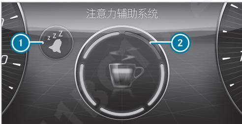

以下信息显示在驾驶员显示屏上：

·自上次休息之后的行驶时长·注意力辅助系统（ATTENTIONASSIST）判定的注意力等级：

圆圈中显示的信号段?越多，探测到的注意力等级越高。

如果注意力等级下降，则圆圈中显示的信号段 $\textcircled{6}$ 变少。

·微睡眠检测状态 $\textcircled{8}$

灰色：开启，但不会发出警告。  
绿色：开启，并会发出警告。  
停用：显示隐藏。

# 微睡眠检测

如果系统使用驾驶员摄像头探测到微睡眠迹象，则警告信息注意力辅助系统瞌睡警告请勿疲劳驾驶!将出现在驾驶员显示屏上并同时响起警告音。必须通过触摸式控制键确认警告信息。建议您立即休息。

如果驾驶员未对微睡眠警告做出反应，则系统会启动紧急停车 第215页)。

# 系统限制

注意力辅助系统（ATTENTIONASSIST）在60 公里/小时至200 公里/小时 的车速范围内启用。

当车速为 20 公里/小时 及以上时，微睡眠检测功能可用。

如果系统因故障而无法使用，则驾驶员显示屏上的注意力辅助系统（ATTENTIONASSIST）警告灯会持续亮起。

尤其是在下列情况下，注意力辅助系统（ATTENTIONASSIST）的功能会受限，警告可能延迟发出或根本不发出：

·行驶时间约少于30 分钟  
·路况较差 (路面不平或路面有凹坑)  
）有很强的侧风  
·采用了具有高速转弯特性或急加速特性的运动型驾驶方式  
·自适应巡航的智能领航转向功能启用  
·时钟设置的时间不正确。  
·在主动驾驶的情况下频繁变换车道并改变车速。  
·电控车辆稳定行驶系统（ $\mathsf { E S P } ^ { \mathbb { ( B ) } }$ ）不可用

当由于以下因素导致驾驶员摄像头无法探测到驾驶员双眼时，微睡眠检测也不起作用，例如：

·驾驶员眼睛被挡住，例如由于转向柱的位置。  
·光照条件差。  
）某些类型的眼镜或太阳镜。  
驾驶员的视线超出驾驶员摄像头视图范围。

另请遵守驾驶员显示屏上出现的有关显示信息的说明。

在以下情况下，将重置注意力辅助系统（ATTENTIONASSIST）瞌睡和警戒状况评估，并在继续行驶时重新启动：

·关闭车辆。  
·松开安全带并开启驾驶员侧车门，例如更换驾驶员或稍事休息。

# ■设定注意力辅助系统（ATTENTIONASSIST）

MBUX智能人机交互系统：

设定辅

注意力&交通辅助注意力辅助系统

# 设定灵敏度

选择注意力辅助系统旁边的。  
选择标准或灵敏。

# 启用/停用瞌睡警告

? 启用或停用瞌睡警告。

# 定速巡航控制和限速器

# ■定速巡航控制功能

定速巡航控制将车速调节至驾驶员选定的数值。

例如，如果您加速超车，存储的车速不会删除。如果您在超车后将脚抬离加速踏板，则定速巡航控制将重新开始将车辆调回存储的车速。

可以设定任何高于20公里/小时 但不超过最大设计车速或不超过设定冬季轮胎限速的车速。

请遵守有关驾驶系统的注意事项和您的责任，否则，您可能无法识别潜在的危险第195页)。

# 驾驶员显示屏上的通知

」灰色：定速巡航控制已选定，但尚未启用或暂时处于停用模式。］绿色：定速巡航控制启用。

存储的车速出现在显示下方并在车速表中指示出来。

# 系统限制

上坡时，定速巡航控制可能无法保持以存储的车速行驶。当回到平坦路面时，恢复为存储的车速。

在长而陡的下坡路面上行驶时，必须及时换入一个较低档位。这在驾驶负载车辆时尤其重要。这样可充分利用发动机的制动效果，从而可在一定程度上减轻制动系统的压力，避免制动器过热以及过快地磨损。

在以下情况下，请勿使用定速巡航控制：

·在需要频繁变速的驾驶情况下，例如交通拥堵时，在弯曲道路上  
·在易滑道路上。加速时可能会导致驱动轮失去牵引力，并可能使车辆开始打滑。  
·可见性差时

# 限速器功能

限速器限制车辆速度。如需将车速降低至设定车速，限速器将自动施加制动。

您可如下限制车速：

·可变：用于行驶速度短期限制，例如在建筑密集区  
·不变：用于长期速度限制，例如在冬季轮胎模式下可以设定任何高于20 公里/小时 但不超过最大设计车速或不超过设定冬季轮胎限速的车速。如果车辆已启动，则也可在车辆处于静正状态时进行设定。  
请遵守有关驾驶系统的注意事项和您的责任，否则，您可能无法识别潜在的危险  
第195页)。

# 驾驶员显示屏上的通知

灰色：可变限速器已选定但尚未启用。

闪烁灰色：可变限速器暂时处于停用模式。

绿色：可变限速器启用。

存储的车速出现在显示M下方并在车速表中指示出来。

如果将加速踏板踩过压力点（强制降档），可变限速器将切换至停用模式。待机信息出现在驾驶员显示屏上，且指示灯开始闪烁。

在以下情况下，可变限速器重新启用：

·车速降至存储车速以下时。  
·调出存储车速时。  
·已存储新车速时。

# 操作定速巡航控制或可变限速器

# A 警告存储车速造成的事故风险

如果您调出存储车速且其低于当前车速，则车辆减速。

调出存储车速前，请考虑交通状况。

# 要求：

定速巡航控制

·变速箱处于回档。  
·车速至少为 20 公里/小时。  
·电控车辆稳定行驶系统（ $\mathsf { E S P } ^ { \mathbb { ( B ) } }$ ）必须启用，但不介入。  
·定速巡航控制已选定。

# 可变限速器

·可变限速器已选定。

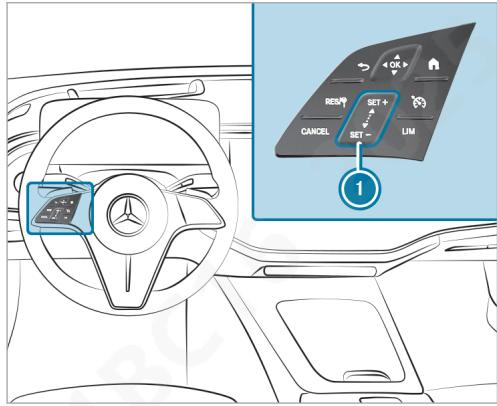

定速巡航控制和可变限速器的方向盘控制面板REs 采用已存储/探测到的车速  
CANCEL 停用定速巡航控制/可变限速器O SET + SET- 用于升高/降低车速的控制面板$\overline { { \mathrm { \Omega } } }$ 选择定速巡航控制  
LM 选择可变限速器

# 操作定速巡航控制和可变限速器：

仅使用一根手指按下相应的按钮或在控制面板上滑动。

在定速巡航控制和可变限速器之间切换：

选择定速巡航控制：按下 $\boxed { \ \dot { \big} \big | }$ 。  
选择可变限速器：按下。

$\textcircled{1}$ 配备自适应巡航的车辆：通过不同按钮选定可变限速器 第209页)。

# 启用定速巡航控制或可变限速器：

按下控制面板O上的SET+或sE-。车辆通过定速巡航控制存储并保持当前车速，或通过可变限速器限制当前车速。

# 或者

按下RES。  
车辆通过定速巡航控制调出并保持上次存储的车速，或通过可变限速器限制上次存储的车速。  
如果之前已删除最后存储的车速，则存储当前的车速。

$\textcircled{1}$ 关闭车辆时，上次存储的车速将被删除。

当您启用定速巡航控制或自适应巡航时，最后保存至可变限速器的车速被删除。

# 提高/降低存储的车速：

提高存储的车速：从控制面板 $\textcircled{6}$ 底部向上滑动。  
·存储的车速升高1公里/小时。  
降低存储的车速：从控制面板 $\textcircled{8}$ 顶部向下滑动。  
·存储的车速降低1公里/小时。

# 或者

点按控制面板O上的SET+或ET- 。存储的车速升高或降低到下一个10的增量［例如升高或降低至50公里/小时或60 公里/小时」。

# 或者

按住控制面板 $\textcircled{8}$ 上的SET+或SET。存储的车速升高或降低至下一个10的增量，然后以10公里/小时 为增量升高或降低。

# 或者

车辆加速至所需车速。

按下控制面板 $\textcircled{8}$ 上的 $\boxed { \ S E T + }$

$\textcircled{1}$ 当可变限速器切换至停用模式时，您无法以1公里/小时 为增量升高或降低其存储的车速。

# 停用定速巡航控制或可变限速器：

? 按下CANCEL。

$\textcircled{1}$ 如果进行制动，请停用电控车辆稳定行驶系统（ESP@）或如果电控车辆稳定行驶系统（ESP@）介入，定速巡航控制停用。可变限速器未停用。

# 有关持久限速器的信息

如果车辆永远不能超过某个特定车速（例如，冬季轮胎模式下行驶时），您可使用不变限速器设定车速。

您可通过在MBUX智能人机交互系统上将车速限定在160公里/小时至240公里/小时之间进行此操作 第206页)。

即将达到设定车速时，驾驶员显示屏上将显示设定车速。如果您确认信息，则直至车辆发动机关闭，显示信息才会消失。仅当重新启动车辆或更改设定车速后，才会再次显示车速。

即使在强制降档且车速保持在设定车速以下时，持久限速器也不会切换至停用模式。

# ■设定冬季轮胎限速

MBUX智能人机交互系统：

设定车辆

# 冬季轮胎限速

启用或停用冬季轮胎限速。

# 设定车速

选择冬季轮胎限速。  
选择车速。

# 自适应巡航

# 自适应巡航

A警告DISTRONIC主动式车距辅助系统加速或制动造成的事故风险

在以下情况下，DISTRONIC 主动式车距辅助系统可能会加速或制动：

·使用 DISTRONIC 主动式车距辅助系统起步车辆。  
·存储的车速已调出且明显高于或低于当前行车速度。  
·DISTRONIC主动式车距辅助系统无法再探测到前方车辆或不会对相关物体作出反应。务必小心注意交通状况并随时做好制动准备。调出存储车速前，请考虑交通状况。

# 警告自适应巡航减速不足造成的事故风险

自适应巡航以不超过50%的可能减速度制动车辆。如果该减速度不足，则自适应巡航将通过视听警告提醒您。

调节您的车速并与前方车辆之间保持适当车距。  
必要时，请亲自制动和/或采取避让措施。

警告自适应巡航探测功能受损造成的事故风险

自适应巡航对以下事物不会做出反应或仅做出有限反应：

·在不同车道上行驶或变更车道时·行人、动物、自行车、静止车辆或意外的障碍物

·复杂的交通状况·对面来车和交叉行车因此，自适应巡航在这些情况下可能既不会发出警告，也不会进行干预。

务必小心注意交通状况并作出相应反应。

$\textcircled{1}$ 对于未配备驾驶辅助组件的车辆，所描述的自适应巡航可能是一种数字化产品和服务（具体取决于相应的国家和地区）(→第 29页)。

自适应巡航可在畅通道路上保持设定车速。  
如果探测到前方车辆，则保持设定的车距；  
如有必要，会保持设定车距直至车辆停车。  
车辆会根据与前方车辆的车距和设定车速来进行加速或制动。

使用方向盘设定并保存车速以及与前方车辆之间的距离。

可用车速范围：

·未配备驾驶辅助组件的车辆：20公里/小时-160公里/小时·配备驾驶辅助组件的车辆：20公里/小时-210公里/小时

$\textcircled{1}$ 如果存储了限速（例如冬季轮胎限制），则可调设定速度可能会有所不同。

自适应巡航的其他功能：

·根据选定的驾驶模式调节驾驶方式·如果开启转向信号指示灯以变换至超车车道，则开始加速至存储的车速

# ·配备驾驶辅助组件的车辆：

对在城市车速范围内探测到的静止车辆做出反应（自行车和摩托车除外）在高速公路或带专门单向行车道的多车道道路上会考虑单边超车限制（因国家和地区而异）

$\textcircled{1}$ 在自适应巡航菜单中，可设定自适应巡航的驾驶模式。根据选定的驾驶模式，驾驶方式为节能、舒适或动态(→第 212页)。

配备智能泊车和驾驶辅助组件的车辆：如果自适应巡航制动车辆使其停止，且系统探测到驾驶员触摸方向盘，则本车在30 秒钟内再次起步时可自动跟随前方车辆。如果起步时探测到周围区域有紧急情况，例如车辆行驶路径上有人，则会发出视听警告，指示驾驶员此时必须重新控制车辆。车辆不再进一步加速。

请遵守有关驾驶系统的注意事项和您的责任，否则，您可能无法识别潜在的危险第195页)。

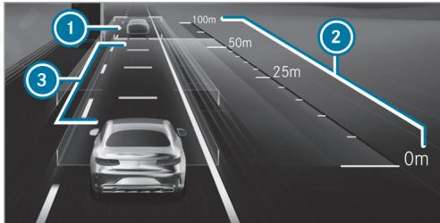

驾驶员显示屏上辅助菜单中的通知$\textcircled{8}$ 前方车辆$\textcircled{6}$ 车距指示$\textcircled{6}$ 设定限定车距

探测到的前方车辆 $\textcircled{8}$ 高亮显示为绿色。在不允许左侧超车的情况下，例如在英国高速公路上，探测到的车辆也可能位于您车辆右侧的车道上。

# 永久状态显示

灰色：自适应巡航已选定，但尚未启用。

绿色车速表，灰色车辆：自适应巡航已启用，车速已设定。

绿色：自适应巡航已启用，已探测到车辆。

存储的车速在永久状态显示下显示，并在车速表中高亮显示。当自适应巡航停用时，其状态显示灰显。

如果因前方路径事件前方车辆车速或判定的目标车速低于存储的车速，则车速表中的信号段会亮起。

如果您增大或缩小设定的限定车距 $\textcircled{6}$ ，则显示会短暂出现。

$\textcircled{1}$ 车辆准备起步时，绿色车辆符号循环显示。  
$\textcircled{1}$ 如果您在自适应巡航运作时踩下加速踏板，系统可能会切换至停用模式。待机信息短时间出现在驾驶员显示屏上。

# 系统限制

在以下情况下，系统可能会受影响或无法运行，例如：

·下雪、下雨、有雾或水花极大，存在眩光，太阳直射或照明条件变化极大。

·摄像头区域的风挡玻璃脏污、起雾、损坏或被遮盖。雷达传感器脏污或被遮挡。  
·在多层停车场中或陡峭的上坡或下坡路上。  
·如果前方有车身窄小的车辆，如自行车或摩托车。

此外，在平坦或易滑的道路上，一个或多个车轮可能会因制动或加速而失去抓地力，车辆可能会开始打滑。如果电控车辆稳定行驶系统（ESP@）介入，则自适应巡航停用。

在这些情况下，切勿使用智自适应巡航。

# ■操作自适应巡航和可变限速器

# 要求：

自适应巡航：

·电动驻车制动已解除。  
·电控车辆稳定行驶系统（ $\mathsf { E S P } ^ { \mathbb { ( B ) } }$ ）开启，但不介入。  
·已接合变速箱档位回。·所有车门已关闭。  
·雷达传感器系统检查已成功完成。  
·防滑链模式不启用 第343页)。

# 可变限速器：

·可变限速器已选定。

采用已存储/探测到的车速停用自适应巡航/可变限速器

用于升高/降低车速的控制面板增大/减小限定车距  
在可变限速器和自适应巡航之间切换

操作自适应巡航或可变限速器：仅使用一根手指按下相应的按钮或在控制面板上滑动。

# 在可变限速器和自适应巡航之间切换

按下

# 启用自适应巡航或可变限速器

没有存储车速的情况下启用：按下SET+、SET-或RES。自适应巡航：将脚从加速踏板上移开。车辆通过自适应巡航存储并保持当前车速，或由可变限速器限制当前车速。

# 或者

有存储车速的情况下启用：按下RES。自适应巡航：将脚从加速踏板上移开。车辆通过自适应巡航调出并保持最后存储的车速，或由可变限速器限制最后存储的车速。  
如果已删除存储的车速，则存储当前的车速。

$\textcircled{ i}$ 关闭车辆时，存储的车速将被删除。当启用自适应巡航时，可变限速器的存储车速将被删除。

# 提高或降低车速

提高存储的车速：从控制面板 $\textcircled{6}$ 底部向上滑动。·存储的车速升高1公里/小时。降低存储的车速：从控制面板 $\textcircled{6}$ 顶部向下滑动。·存储的车速降低1公里/小时。  
或者点按控制面板 $\textcircled{6}$ 的顶部SET+或底部SET - 。存储的车速升高或降低10公里/小时。  
或者按住控制面板 $\textcircled{6}$ 的顶部SET+或底部SET - 。存储的车速以10 公里/小时 为增量升高或降低。

# 或者

车辆加速至所需车速。按下控制面板 $\textcircled{8}$ 的顶部 $\boxed { \ S E T + }$ C

# 使用自适应巡航起步

启用自适应巡航并将脚从制动踏板上移开按下RESI。

# 或者

短时间用力踩下加速踏板。  
自适应巡航保持启用。

# 增大或缩小与前方车辆的限定车距

按下   
显示 出现。限定距离缩短一个等级。  
如已选择最低等级，则选项跳转至最大等级。

# 停用自适应巡航或可变限速器

A 警告您离开驾驶员座椅时DISTRONIC主动式车距辅助系统仍保持启用造成的事故风险

如果您在仅使用 DISTRONIC 主动式车距辅助系统制动车辆时离开驾驶员座位，则车辆可能会溜车：

离开驾驶员座椅前，务必停用DISTRONIC主动式车距辅助系统并固定车辆，以防溜车。

$\textcircled{ i}$ 如果进行制动，请停用电控车辆稳定行驶系统（ESP?）或如果电控车辆稳定行驶系统（ESP@）介入，则自适应巡航停用。可变限速器未停用。

# ■基于场景的车速调节功能

A 警告尽管使用基于场景的车速调节但仍有事故风险

在以下情况下，基于场景的车速调节可能会出现故障或暂时不可用：

·驾驶员未遵守已计算路径时  
·地图数据不是最新或不可用时  
·道路施工时  
）在恶劣天气或路况不佳时  
·踩下加速踏板时  
·电子显示限速时

根据交通状况调整车速。

当自适应巡航启用时，将根据前方路径事件调节车速。根据选定的驾驶模式，车辆以节能、舒适或动态驾驶方式来应对前方路径事件。驶过路径事件路段后，车辆会再次加速至存储的车速。其会将与前方车辆之间的设定车距、探测到的前方车辆和前方限速考虑在内。

基于场景的车速调节可在MBUX 智能人机交互系统中启用 第212页)。

将以下的前方路径事件考虑在内：

·弯道  
·环岛  
·T型交叉口  
·转弯和出口  
·前方交通堵塞（仅当实时路况启用时）

如果转向信号灯开启且探测到以下其中一种情况，则车速也会降低：

·在交叉口转向·在慢行车道上行驶·在与慢行车道相邻的车道上行驶驾驶员应负责选择正确的车速和注意其他道路使用者。尤其是在交叉口、环岛和交通信号灯处等路况下更应如此，因为基于场景的车速调节不会制动车辆使其停止。

路径向导启用时，将自动进行第一次车速调整。如果开启转向信号指示灯，则确认选定的路径并启用进一步车速调整。

在以下情况下，车速调整取消：

·如果在路径事件之前关闭转向信号指示灯，且假定驾驶员认为路径事件不相关·如果在此过程中驾驶员踩下加速踏板或制动踏板。

# 系统限制

基于场景的车速调节不考虑道路法规的要求。驾驶员应遵守交通安全法规及规定并以合适的速度驾驶。

在不易通行的情况下，系统进行的速度选择可能并非总是合适。这适用于以下情况，例如：

·道路的路线并非清晰可见

·道路变窄  
·不同车道的最高允许车速不同，例如在收费站  
·湿滑路面、雪或冰

在这些情况下，驾驶员必须作出相应的干预。

# 设定自适应巡航驾驶方式

# 要求：

·自适应巡航启用。

MBUX智能人机交互系统：

{→设定ン辅助ン行驶 →自适应巡航

# 选择驾驶方式

选择基于 DYNAMIC SELECT、动态或舒适。

$\textcircled{1}$ 有关自适应巡航的附加信息第209页)。

# 设定车速调节

选择基于路径或限速。  
这些功能启用时，将根据前方路径事件或根据限速调整车速。

$\textcircled{1}$ 如果以下其中一个系统启用，则可手动将探测到的速度用作最高允许车速：

·自适应巡航·定速巡航控制·可变限速器

$\textcircled{1}$ 有关车速调节的附加信息第211页)。

# ■交通拥堵辅助功能

在带单向行车道的多车道道路上发生交通拥堵时，交通拥堵辅助会在60秒钟内自动起步和进行适度转向操作。系统通过前方车辆和车道标线来标定行驶方向。交通拥堵辅助会自动与前方车辆和切入的车辆保持安全距离。

交通拥堵辅助要求您始终将双手放在方向盘上，由此您可随时进行干预以校正车辆路线并保持在车道内行驶。

请遵守有关驾驶系统的注意事项和您的责任，否则，您可能无法识别潜在的危险

第195页)。

当满足以下所有条件时，交通拥堵辅助自动启用：

·在高速公路或高速干道上发生交通拥堵。  
·自适应巡航开启并启用第 209页)。  
·主动式紧急制动可用 第 221页)。  
·自适应巡航开启并启用 第215页)。  
·以不超过60 公里/小时 的车速行驶。

当交通拥堵辅助启用时，状态显示出现在驾驶员显示屏上。

# 系统限制

自适应巡航和智能领航转向功能的系统限制适用于交通拥堵辅助。

# 智能领航转向功能

# 智能领航转向功能

A 警告 智能领航转向功能意外停止工作时的事故风险

如果已达到智能领航转向功能的系统限制，则无法保证系统能保持启用，也无法保证能将车辆保持在车道内。

务必始终将双手放在方向盘上并仔细观察交通状况。  
转向时始终注意交通状况。

警告主动式转向辅助系统意外介入时 的事故风险

车道标线和物体探测可能故障并导致意外的转向干预。

根据交通状况转向智能领航转向功能在车速不超过

210 公里/小时 时可用。

该系统通过适度转向干预帮助您保持车辆在车道中间。根据车速，智能领航转向功能使用前方车辆和车道标线作为参考。

$\textcircled{ i}$ 根据相应的国家和地区的不同，在较低车速范围内，智能领航转向功能可使用周围交通状况作为参照。必要时，智能领航转向功能在车辆驶出车道中间以让出应急车道等情况下也可提供辅助。

如果对车道标线和前方车辆的探测受到影响，则智能领航转向功能会切换至停用模式。在这种情况下，系统不会提供支持。

# 智能领航转向功能状态显示

灰色：开启但处于停用模式绿色：开启且启用

红色，闪烁：提示驾驶员主动确认或从启用模式切换至停用模式，探测到系统限制

白色、红色双手：“双手握住方向盘"提示

$\textcircled{1}$ 从启用模式切换至停用模式过程中，符号放大显示并闪烁。当系统处于停用模式时，符号即在驾驶员显示屏上显示为灰色。

$\textcircled{1}$ 根据所选的车辆设定，智能领航转向功能可能不可用。

# 转向和触摸检测

要求驾驶员始终将双手放在方向盘上，以确保可随时进行干预以校正车辆路线并保持在车道内行驶。驾驶员必须随时做好准备从启用模式切换至停用模式，或从停用模式切换至启用模式。

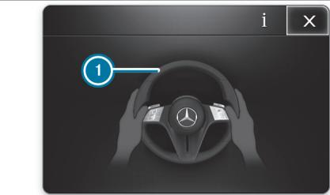

如果系统探测到驾驶员相当长时间未操控车辆，或双手离开方向盘，则会首先发出视觉警告。通知 $\textcircled{8}$ 出现在驾驶员显示屏上。如果驾驶员仍未操控车辆或未对系统做出确认，则除了视觉警告信息外，还将响起重复警告音。

配备驾驶员摄像头的车辆：如果驾驶员没有将视线投向前方车道，而是投向车外后视镜或中央显示屏等，则也可能会通过眼动追踪功能来发出警告。

如果驾驶员在相当长的一段时间内未对此警告做出反应，则会发起紧急停车

第215页)。

一旦系统探测到驾驶员有以下动作，将不发出警告或停止警告：

·触摸方向盘  
·转向操作  
·将视线投向前方路面（配备驾驶员摄像头的车辆）

如果手和方向盘之间没有直接接触，例如戴着手套或方向盘上有方向盘护套，则触摸检测可能会受到限制或不起作用。

配备驾驶员摄像头的车辆：例如，如果驾驶员系偏光太阳镜或不透红外线的眼镜，则眼动追踪功能可能会受到限制或无法使用。如果智能领航转向功能探测到已经达到系统限制，则发出视觉警告并响起警告音。

请遵守有关驾驶系统的注意事项和您的责任，否则，您可能无法识别潜在的危险第195页)。

# 系统限制

智能领航转向功能进行横向引导的转向扭矩有限制。在某些情况下，只靠转向干预无法将车辆保持在车道内或驶过出口。

在以下情况下，系统可能会受影响或无法运行：

·能见度差，例如由于下雪、下雨、有雾、密集水花、照明条件变化极大或车道上有很重的阴影等。  
·例如迎面来车、太阳直射或反射等造成眩光。  
·道路照明不足。  
·例如摄像头附近的风挡玻璃脏污、起雾、损坏或被标签等覆盖。  
·给定的车道上无车道标线或车道标线不易识别，或车道标线快速变化，例如在施工区域或交叉口。  
：车道标线磨损、模糊或被污垢或积雪覆盖。  
如果与前方车辆的车距过短且因此无法探测到车道标线。  
·道路狭窄蜿蜒曲折。  
·车道上有障碍物或伸进车道的突出物，例如物体指示标。

在以下情况下，系统不会提供辅助：

·在急转弯道上和转弯时   
·驶过交叉路口时   
）在环岛或收费站   
·在未开启转向信号指示灯的情况下主动变 更车道   
·轮胎气压过低时

# ■启用/停用智能领航转向功能

# 要求：

·电控车辆稳定行驶系统（ $\mathsf { E S P } ^ { \mathbb { ( B ) } }$ ）启用，但不介入。  
·自适应巡航启用。

MBUX智能人机交互系统：

设定> 辅助→ 行驶

启用或停用车道居中。

# 主动式紧急停车辅助功能

主动式紧急停车辅助监测方向盘以及加速踏板和制动踏板。如果系统探测到驾驶员缺乏活动或车辆有偏离车道的风险，则会发出警告并发起紧急停车。

未配备驾驶辅助组件的车辆：系统从车速约为60公里/小时起可用。

60 公里/小时 起可用。

如果系统探测到车辆有偏离车道的风险，则会发出警告并触发紧急停车。

·驾驶员一段时间未接触方向盘或长时间探测不到转向运动（取决于相应的车辆配置）。·既未踩下加速踏板，也未踩下制动踏板。

$\textcircled{1}$ 配备驾驶辅助组件的车辆：如果智能领航转向功能打开并启用，则系统仅监测方向盘。如果驾驶员一段时间未触摸方向盘，即使已操作踏板，系统仍可能发出警告。另请遵守有关智能领航转向功能触碰检测的说明(→第213页)。

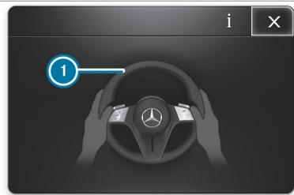

主动式紧急停车辅助依次发出以下警告：

·显示信息 $\textcircled{8}$ 出现在驾驶员显示屏上。·除显示 $\textcircled{8}$ 外，还将响起警告音。·紧急停车启用信息将出现在驾驶员显示屏上，并响起持续的警告音，车辆将不再加速。此外，必要时安全带会稍稍收紧。，车速逐渐降低，直至车辆减速至静止状态。还产生急剧的制动脉冲。

$\textcircled{ i}$ 配备驾驶辅助组件的车辆：如果智能领航限距功能启用且驾驶员松开安全带并打开驾驶员侧车门，则会立即触发紧急停车。

配备驾驶辅助组件的车辆：如有可能，将向相邻车道变道（因国家和地区而异）。能跨越一条车道并仅能向外侧车道变道，且不能驶上硬路肩。

当自动制动触发时，自适应巡航停用。根据国家和地区的不同，危险警告灯系统也开启。

当车辆已减速至静止状态时：

·已通过电动驻车制动固定车辆。

·车辆解锁。  
·如有可能，向梅赛德斯-奔驰紧急呼叫中心发起紧急呼叫。

自动驻车启用前，您可通过转动方向盘取消主动式紧急停车辅助。

自动制动启动后，您可以通过执行以下操作之一取消主动式紧急停车辅助的干预：

·加速或制动：制动已取消，但警告信息、警告音和电动助力转向保持启用。  
·转向：电动动力转向已取消，警告信息和警告音保持启用且继续制动车辆  
$\textcircled{1}$ 主动式紧急停车辅助在一个驾驶循环内可发起最多三次紧急停车。之后，智能领航转向功能和主动式紧急停车辅助将被禁用，直到车辆重新启动。

# 系统限制

有关车辆和其他障碍物探测，请遵守以下功能的系统限制：

·自适应巡航 第207页)·智能领航转向功能 第213页)

·变道辅助 第217页)·车道保持辅助 第233页)·主动式紧急制动 第221页)

# 未配备驾驶辅助组件的车辆：

主动式紧急停车辅助在以下情况下停用：

·车道保持辅助已达到系统限制。车道保持辅助关闭（白色状态显示）。  
·车道保持辅助未准备好（灰色状态显示）。

# 变道辅助

# |变道辅助功能

A 警告变道进入相邻被占用车道时的事故风险

变道辅助并不总是能够清楚地确定相邻车道是否空闲，特别是当车辆驶近时的速度与您的车速相差很大时，或者是车身狭窄的车辆时，例如摩托车。

即使相邻车道被占用，也可以发起车道变更。

在发起车道变更之前，应确保相邻车道畅通无阻，且不会对其他道路使用者造成任何危险。变更车道时应注意其他道路使用者。

A 警告变道辅助功能突然故障导致事故的风险

如果达到变道辅助的系统限制，则不能保证系统保持启用。

变道辅助将不再提供任何辅助转向扭矩。

请始终手握方向盘执行并监控车道变更操作。注意周围交通状况，并根据需要通过转向和/或制动进行干预。

变道辅助通过转向信号指示灯启用，并通过施加转向扭矩在变更车道时为驾驶员提供支持。

要使用此功能，必须满足以下条件：

·您正在高速公路或类似高速公路的主干道上行驶。  
·车速介于约 50 公里/小时 至180 公里/小时之间。  
·虚线边界标记将相邻车道分开。  
在相邻车道上未探测到车辆或障碍物。在MBUX智能人机交互系统中选定主动式车道变更辅助系统！ 第220 页)。自适应巡航和智能领航转向功能开启并启用。

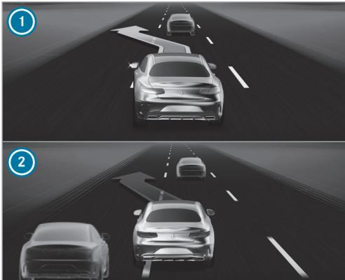

# 驾驶员显示屏上辅助菜单中的通知

$\textcircled{8}$ 绿色箭头：开始车道变更$\textcircled{6}$ 红色箭头：车道变更已取消如果变道辅助可用，则通知与绿色箭头一同出现在驾驶员显示屏上。如果系统已启用，但是当前不可用，则通知与灰色箭头一同出现在驾驶员显示屏上。

如果相邻车道上没有探测到车辆或障碍物且允许变更车道，则在驾驶员启用转向信号指示灯后开始变更车道。通过方向盘符号旁边的闪烁绿色箭头向驾驶员指示车道变更。在辅助菜单中，驾驶员显示屏上出现一个指示相应的相邻车道的绿色箭头。例如，还会出现信息向左变更车道。

如果在开启转向信号指示灯后无法立即变更车道，例如探测到障碍物，则方向盘符号旁边的箭头也会闪烁绿色。系统会继续监控相邻车道。当车道可通行时，将执行车道变更，且信息例如向左变更车道出现在驾驶员显示屏上。绿色箭头停止闪烁时，必须重新启用车道变更。

例如，在以下情况下，可取消变道辅助：

·环境状况改变（例如探测到障碍物）。  
·驾驶员转向过于用力或转向相反方向。驾驶员开启相反方向的转向信号指示灯。自适应巡航或智能领航转向功能已停用。  
·车辆无法按预期执行车道变更。

变道辅助取消显示如下：

·所选行驶方向上的箭头变为红色。  
·相应信息出现在驾驶员显示屏上。  
·在某些情况下，警告音响起。

# 导航辅助驾驶

A 警告 错误触发车道变更导致的事故风险

系统无法始终清晰识别所有合理变更车道的情况。

即使交通状况不合适或相邻车道不适用、不可用或被占用，系统也可能发起车道变更。

请时刻注意观察交通状况。  
必要时取消车道变更：握住方向盘或稍微反向转向，然后将车辆驶回自己的车道。

$\textcircled{1}$ 导航辅助驾驶仅在与所需的服务配合使用时才可用。初始期限到期后，可付费延长服务。

导航辅助驾驶是变道辅助的子功能。它可以帮助驾驶员决定何时适合变更车道以及后续操作。

你随时可以通过握住方向盘或轻微反向转向并将车辆返回其车道来取消系统发起的变道。

要由导航辅助驾驶发起智能变道，必须满足以下条件：

·满足变道辅助的启用条件。  
·智能变道在MBUX智能人机交互系统中开启 第 220页)。您正在允许使用此功能的高速公路或城市快速路上行驶。  
）通过互联网将车辆连接至车道级导航。  
）您正在支持车道级导航的道路上行驶。当前行驶道路允许车道变更。例如，没有急转弯。车速介于约50公里/小时 至130 公里/小时之间。在某些情况下，例如在坡道上行驶时，当车速低于

50 公里/小时 时，智能变道功能可能会启用。

例如，在以下情况下，导航辅助驾驶可发起智能变道：

·由于前方车辆车速较慢，无法达到智能领航限距功能设定的所需车速。  
·为沿着导航系统中输入的路径或当前导航道路行驶，有必要变更车道。在导航系统中出现车道变更提示之前，可能已进行车道变更。  
·您正在接近一个根据导航路径无需进出的匝道口。  
·系统探测到当前行驶的车道即将到达尽头。  
$\textcircled{1}$ 基于 GPS 的驾驶功能在线信息通过基于GPS 的在线数据支持智能变道辅助。如果在Mercedes Me app 的"安全与服务"模块

中关闭该功能，这将影响执行智能变道辅助，例如在驶入和驶出坡道时。

特别是在以下情况下，导航辅助驾驶不会执行任何智能变道：

·车辆已在车道上，且应将其用于沿导航系统中输入的路径行驶。  
·在某些路段，不会向较慢车道发起车道变更。  
·系统探测到相邻车道即将到达尽头。  
·如果驾驶员取消智能变道，则一段时间内不会发起该方向的车道变更。  
·如果驾驶员已发起某个方向的车道变更或已自行变更车道，则一段时间内不会发起相反方向的车道变更。

相同的取消条件适用于智能变道以及驾驶员使用变道辅助发起的车道变更。

此外，特别是在以下情况下，可取消智能变道：

·在车道变更期间，系统探测到同一车道或相邻车道上被锥形交通标志隔开的工地。·系统识别到车道变更条件不复存在。

# 驾驶员显示屏上的通知

当智能变道可用时，通知以绿色显示，而不显示。如果导航辅助驾驶可用但当前未满足功能启用的所有条件，则符号A-显示为灰色。  
如果系统判定适合变更车道，或发起智能变道，则绿色A会在要进行车道变更的一侧闪烁。例如，前车过慢信息出现，且警告音响起。

如果取消了智能变道，要进行车道变更一侧的A会以红色显示。在某些情况下，还会显示警告信息，并响起额外的警告音。

有关中央显示屏零层级界面上导航辅助驾驶显示的信息 第271页)。

# 系统限制

对于变道辅助，智能领航转向功能的系统限制 第213页)适用。

此外，在以下情况下，系统可能会受影响或不起作用：

·传感器损坏、被遮挡或脏污第195页)。  
·外部照明指示故障。  
·系统无法识别到合适的道路，例如在狭窄弯道上。  
·车辆在工地上。  
$\textcircled{1}$ 导航中显示的周围物体可能在形状或位置上与实际环境存在偏差。

特别是在以下情况下，导航辅助驾驶可能不起作用或会受到影响，这可能会导致错误地发起车道变更：

·车辆在工地内，且/或系统探测到工地被锥形交通标志隔开。  
·系统无法再正确探测车道标记。  
·正在下大雨。  
·另一辆车同时变更到同一车道，例如从匝道驶入的车辆。

尽管相邻车道不适合或无法通行，但仍可发起智能变道：

·智能变道正试图使车辆驶入预留的公交车道。  
·另一辆车同时变更到相邻的同一车道。系统可能探测不到静止的物体，例如工地或锥形交通标志。在合并车道的情况下，系统可能无法探测到此时从后方切入的车辆。

$\textcircled{1}$ 在车辆交付后，行驶一定距离时将自动调节变道辅助传感器。在此自学习过程中，变道辅助不可用，且智能领航转向功能符号旁边没有显示任何箭头。

请遵守有关驾驶系统的注意事项和您的责任，否则，您可能无法识别潜在的危险第195页)。

# 设定变道辅助

MBUX智能人机交互系统：

设定ン辅助ン行驶

# 变道辅助

# 不带智能变道的变道辅助

? 在开启或关闭设定选项之间进行选择。$\textcircled{1}$ 如果车道居中已关闭，则变道辅助无法操作。

# 带智能变道的变道辅助

在关闭、手动发起变道和导航辅助驾驶设定中进行选择。  
$\textcircled{ i}$ 如果车道居中已关闭，则变道辅助无法操作。  
$\textcircled{1}$ 有关智能变道的更多信息，请参见第 217页)。

# 主动式紧急制动

# 主动式紧急制动功能

A 警告受主动制动辅助系统探测性能所限造成的事故风险

主动式紧急制动无法总是清楚地识别物体和复杂的交通状况。

在这种情况下，主动式紧急制动可能：

·无故发出警告或制动·不发出警告或不制动主动式紧急制动仅是一种辅助工具。驾驶员应负责与前方车辆保持足够的安全距离、控制车速和及时制动。

务必注意交通状况，请勿完全依靠主动式制动辅助系统。做好必要时的制动或转向准备。

主动式紧急制动由以下功能组成：

·车距警告功能  
·碰撞警告  
自主制动功能因情况而异的制动助力车侧区域保护辅助系统  
配备驾驶辅助组件的车辆：紧急避让辅助系统  
）配备驾驶辅助组件的车辆：交叉路口起步功能

主动式紧急制动有助于将与其他车辆、骑自行车的人或行人发生碰撞的风险降至最低或减轻此类碰撞后果。

如果主动式紧急制动探测到碰撞风险，则响起警告音且车距警告灯A亮起。

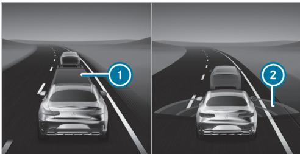

驾驶员显示屏上辅助菜单中的通知

$\textcircled{8}$ 车距不足$\textcircled{6}$ 红色雷达波

在辅助菜单中，与前方车辆车距不足①呈红色显示。如果您继续缩短车距，则前方车辆还会高亮显示为红色。当系统探测到碰撞风险时，红色雷达波 $\textcircled{6}$ 将出现在您车辆前方。

# $\textcircled{1}$ 配备预防性安全系统前向保护（

（PRE-SAFE）的车辆：根据国家和地区的不同，附加的触觉警告以驾驶员安全带轻微、反复张紧的形式发出。

$\textcircled{ i}$ 配备主动式环境氛围照明系统的车辆：如已开启警告辅助，则还会通过环境氛围照明强调主动式紧急制动发出的警告（→第134页)。

如果您未对警告做出反应，则自主制动将在紧急情况下启用。

在格外紧急情况下，主动式紧急制动也可能直接启用自主制动。在这种情况下将响起警告音并亮起车距警告灯A，同时施加制动。

如果您在紧急情况下自行施加制动或在自主制动期间施加制动，将启动因情况而异的制动辅助。必要时将增大制动压力至完全制动。

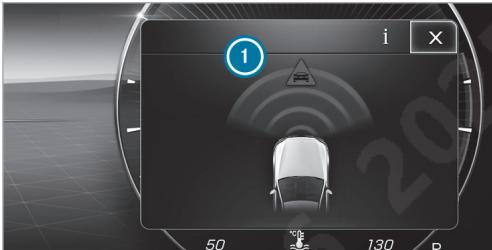

如果出现自主制动或因情况而异的制动辅助，则弹出窗口 $\textcircled{6}$ 出现在驾驶员显示屏上且短时间过后自动消失。

如果自主制动功能或因情况而异的制动辅助触发，预防性安全系统 前向保护

（PRE-SAFE?）的额外的驾驶员及乘客保护预防措施也可能启用。

如果主动式紧急制动停用或功能受限，例如由于其他驾驶系统启用，则主动式制动辅助系统警告灯会出现在驾驶员显示屏上。

如果因为传感器脏污、损坏或某个故障导致系统不可用，或者如果功能受限，则主动式制动辅助系统警告灯会显示在驾驶员显示屏上。

另请注意主动式紧急制动的系统限制。在以下车速范围内，各个子功能可用：

# 车距警告功能

从车速约为30公里/小时 开始，如果相对于当前车速而言，与前方行驶车辆超过数秒钟未保持安全距离，车距警告功能将向您发出警告。在这种情况下，驾驶员显示屏上的车距警告灯A会亮起。如果本车继续以较高车速缩小与前方车辆的距离，则车距警告灯开始闪烁。

# 碰撞警告

在以下情况下，从车速为约7公里/小时起，碰撞警告功能可通过间歇式警告音和车距警告灯A为您提供辅助。

未配备驾驶辅助组件的车辆：

·以不超过约 250 公里/小时 的车速靠近前方移动的车辆。以不超过约80 公里/小时 的车速靠近前方静止的车辆、路上走动的行人和前方移动中的骑自行车的人。  
·以不超过约70 公里/小时 的车速靠近横穿车道的行人和骑自行车的人。

·以不超过约60公里/小时 的车速靠近静止的行人和骑自行车的人。

配备驾驶辅助组件的车辆：

·以不超过约250 公里/小时 的车速靠近前方移动的车辆。  
，以不超过约120公里/小时 的车速靠近横穿车道的车辆、行人和骑自行车的人。以不超过约100 公里/小时 的车速靠近静止的车辆。  
以不超过约80 公里/小时 的车速靠近前方移动中的骑自行车的人。  
·以不超过约70 公里/小时 的车速靠近静止的行人和骑自行车的人。

# 自主制动功能

在以下情况下，自主制动功能可从车速为约7公里/小时 起开始介入：

未配备驾驶辅助组件的车辆：

·以不超过约 250 公里/小时 的车速靠近前方移动的车辆。

·以不超过约80 公里/小时 的车速靠近前方移动中的骑自行车的人、路上走动的行人和静止的车辆。·以不超过约 70 公里/小时 的车速靠近横穿车道的行人和骑自行车的人。

配备驾驶辅助组件的车辆：

·以不超过约250 公里/小时 的车速靠近前方移动的车辆。  
，以不超过约120 公里/小时 的车速靠近横穿车道的车辆、行人和骑自行车的人。以不超过约100 公里/小时 的车速靠近静止的车辆。  
以不超过约80 公里/小时 的车速靠近前方移动中的骑自行车的人。  
·以不超过约70 公里/小时 的车速靠近静止的行人和骑自行车的人。

# 因情况而异的制动助力

在以下情况下，因情况而异的制动助力可从车速为约7公里/小时 起开始介入：

未配备驾驶辅助组件的车辆：

·以不超过约250 公里/小时 的车速靠近前方移动的车辆。  
·以不超过约80 公里/小时 的车速靠近前方移动中的骑自行车的人、路上走动的行人和静止的车辆。  
，以不超过约70 公里/小时 的车速靠近横穿车道的行人和骑自行车的人。  
·以不超过约60 公里/小时 的车速靠近静止的行人和骑自行车的人。

配备驾驶辅助组件的车辆：

·以不超过约250 公里/小时 的车速靠近前方移动的车辆。  
，以不超过约120 公里/小时 的车速靠近横穿车道的车辆、行人和骑自行车的人。以不超过约100 公里/小时 的车速靠近静止的车辆。以不超过约80 公里/小时 的车速靠近前方移动中的骑自行车的人。  
·以不超过约 70 公里/小时 的车速靠近静止的行人和骑自行车的人。

# 取消主动式紧急制动施加的制动

您可随时通过以下操作取消主动式紧急制动施加的制动：

·将加速踏板踩到底或强制降档。  
·松开制动踏板。

如果满足以下其中一个条件，则主动式制动辅助系统可能会取消施加制动：

·转向以避开障碍物。  
·碰撞风险不复存在。  
·车辆前方不再探测到障碍物。

# 对迎面而来的道路使用者的反应（仅限配备驾驶辅助组件的车辆)

主动式紧急制动也可对探测到的迎面而来的道路使用者做出反应：

·在车速不超过约100 公里/小时 时做出反应  
·通过警告音和车距警告灯对迎面而来的道路使用者发出警告  
·施加自主制动，以降低事故的严重性

# 转向操控功能

如果系统在转向对面车道时探测到有与迎面而来的道路使用者发生碰撞的危险，在车速不超过约20公里/小时的情况下会发起自主制动。

# 交叉路口起步功能（仅限配备驾驶辅助组件的车辆)

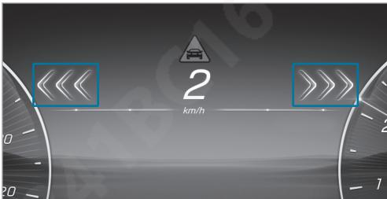

如果在起步或以步行速度行驶时探测到存在与横向穿越车道的车辆或行人发生碰撞的风险，则驾驶员显示屏上指向横向穿越道路使用者方向的三个红色箭头会先后亮起，同时车距警告灯A也会亮起。如果情况特别危急，则箭头会开始闪烁。还将响起警告音。

如果您未对警告做出反应，则在紧急情况下加速会受到限制或可发起自主制动。自主制动还可防止您起步并保持车辆静止。在格外紧急情况下，主动式紧急制动也可能直接后用自主制动。在这种情况下，车距警告灯A将亮起，并响起警告音，同时施加制动。

如果已发生自主制动或因情况而异的制动助力，则弹出窗口出现在驾驶员显示屏上且短时间过后自动消失。

如果主动式紧急制动设定为延迟，则纯视觉警告阶段和加速限制停用。如果情况特别危急，仍可发出视觉警告、警告音并启动自主制动。

# 避让辅助功能

A 警告 忽视紧急避让辅助系统造成的事故风险

紧急避让辅助系统无法总是清楚地识别物体和复杂的交通状况。

此外，紧急避让辅助系统的转向支持不足以避开碰撞。

务必注意交通状况，请勿完全依靠紧避让辅助系统。  
做好必要时的制动或转向准备。  
在非危险情况下通过主动转向结束支持。  
如果行人靠近您的车道，请以适当的车速行驶。

紧急避让辅助系统具备以下功能：

·探测行人、骑自行车的人和车辆。  
·探测到避让操作时进行额外转向辅助。  
·在避让操作期间通过突然转向操作启用。  
·在避让操作和车辆校直期间提供辅助。  
·在车速约为20公里/小时 至最高约110 公里/小时的车速范围内做出反应。

通过朝相反方向转向可随时取消紧急避让辅助系统提供的转向支持。

# 系统限制

车辆开启后或起步后短时间内，无法获得全部系统性能。只要功能受限，主动式制动辅助系统警告灯也会显示在驾驶员显示屏上。取决于环境条件，可能需要数分钟才能获得全部系统性能。

系统可能会受影响或不起作用，尤其在以下情况下：

·下雪、下雨、有雾或水花极大，存在眩光，太阳直射或照明条件差异极大。  
·传感器脏污、起雾、损坏或被遮挡。第195页)  
·传感器由于受到其他雷达源干扰而受到影响，例如多层停车场中强烈的雷达反射。  
·已探测到并显示轮胎气压流失或故障轮胎时。  
·在复杂的交通情况下，无法始终清晰识别障碍物。  
·快速移入传感器探测区域内的行人、骑自行车的人或车辆。  
·道路使用者被其他物品挡住或位于其他物品旁边。  
·行人或骑自行车的人的典型轮廓无法与背景相互区别。  
·未探测到行人或骑自行车的人，例如由于特殊衣物或其他物体。·驾驶员未系安全带。  
·在半径很小的弯道上。

# 设定主动式紧急制动

# 要求：

·车辆启动。

MBUX智能人机交互系统：

设定辅助安全辅助

启用或停用此功能。  
$\textcircled{1}$ 此功能的可用性因国家和地区而异。  
$\textcircled{1}$ 建议您始终保持主动式紧急制动启用。用。  
当关闭主动式紧急制动时，车距警告功能、  
碰撞警告功能、自主制动功能和主动式紧急  
避让辅助系统均关闭。  
$\textcircled{1}$ 当主动式紧急制动停用时，符号出现在驾驶员显示屏的状态栏中，下次车辆启动时系统会重新启用。

# 设定警告时机

选择主动式紧急制动旁边的。  
选择提前、适中或延迟。

# 交通标志辅助系统

# 交通标志辅助系统功能

$\textcircled{1}$ 该功能可以是一种数字化产品和服务第29页)。

交通标志辅助系统使用多功能摄像头探测交通标志，并将其与导航系统电子地图上的信息进行对比。该系统通过在驾驶员显示屏上显示探测到的限速和超车禁区为您提供辅助。

最高允许车速也可在平视显示系统中显示。当您超出最高允许车速时，系统会发出警告。

在某些国家和地区，该系统可以为您提供更多的功能并在您接近人行横道时或无意中要驶过停车标志或红灯时向您发出警告。

摄像头还可探测和分析通过附加标志（例如在潮湿环境中）予以指示的带限制的交通标志。

交通标志辅助系统在驾驶员显示屏上仅显示选定的标志。实际的交通标志和限速始终优先于驾驶员显示屏上显示的交通标志和限速。

使用交通标志辅助系统时，还应遵守以下说明：

·选择适合交通状况、周围环境和天气情况的车速。  
·遵守实际的交通标志。 20  
·遵守适用的交通法规及规定。

请遵守有关驾驶系统的注意事项和您的责任，否则，您可能无法识别潜在的危险第195页)。

# 驾驶员显示屏上的通知

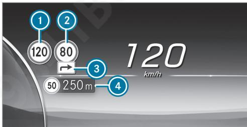  
示例

$\textcircled{6}$ 允许车速

$\textcircled{6}$ 存在限制时的允许车速$\textcircled{6}$ 带限制的附加标志$\textcircled{6}$ 前方最高允许车速

最高允许车速显示始终优先于其他交通标志，例如超车禁区。平视显示系统仅显示一个带最高允许车速的交通标志。如果驾驶员显示屏上显示两个车速标志，例如，当探测到限速时，左侧限速值会被传输至限速器、定速巡航控制或自适应巡航以供采用并显示在平视显示系统中。

其他系统的重要信息可能会导致交通标志短时间隐藏。

根据相应的使用国家和地区，交通标志辅助系统还可探测和显示其他交通标志 $\textcircled{8}$ ，包括：

·车速限制  
·车速限制结束  
·超车限制  
·玩耍街

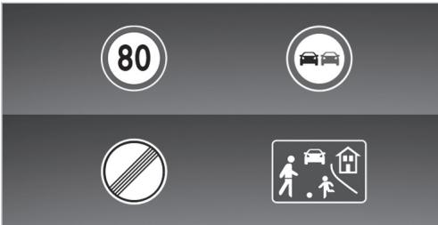

# 探测到的交通标志 (示例)

交通标志辅助系统还可探测诸如以下附加标志 $\textcircled{8}$ ，并在必要时使用辅助车辆传感器评估限制的相关性：

·在潮湿环境中  
·易滑路面  
·雾天  
·临时限制  
·出口

交通标志辅助系统也会使用来自导航系统中电子地图的信息。因此，在驶离或驶入城区时或变更道路时（例如在高速公路出口、匝道或在十字路口转弯后），可在未探测到交通标志的情况下更新驾驶员显示屏中的显示。

$\textcircled{ i}$ 定期更新导航系统的电子地图，确保交通标志辅助系统发挥最佳作用。

根据相应的车辆配置及使用国家和地区的不同，系统还会在驾驶员显示屏和平视显示系统中显示前方限速。驾驶员显示屏还可显示与前方下限限速之间的距离。为此，会使用来自导航系统电子地图的信息。辅助菜单还可动态可视化显示前方限速。

如果交通标志辅助系统无法确定当前的最高允许车速（例如由于标志缺失），则以下显示会出现在驾驶员显示屏上：

交通标志辅助系统并非适用于所有国家和地区。在不支持交通标志辅助系统的国家和地区行驶时，此显示会永久显示在车辆中。

如果系统因技术故障或风挡玻璃脏污而暂时或永久不可用，则相应显示信息会出现在驾驶员显示屏上。在某些国家和地区，交通标志辅助系统警告灯也在驾驶员显示屏上亮起。

$\textcircled{1}$ 另请遵守有关交通标志辅助系统显示信息的说明 第383页)。

#

，在驾囊员显集屏生丙炼通患，还是

应发出视觉和听觉组合警告。警告类型选择通过驾驶员显示屏上的通知进行确认，具体取决于使用该功能所在的国家和地区。

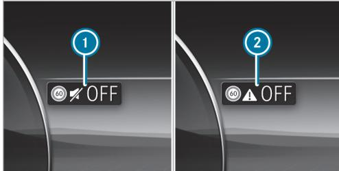

# 示例

$\textcircled{8}$ 仅视觉警告

# $\textcircled{6}$ 警告关闭

$\textcircled{1}$ 限速警告的类型、持续时间和触发等级以及设定触发等级的时机选项（达到该阈值会发出警告），取决于车辆交付所在国家和地区的有效法规。

# 附加警告功能

禁止进入标志警告：交通标志辅助系统可以在您沿错误的路段行驶时向您发出警告，例如在高速公路匝道或单行道上。

人行横道警告：如果您接近人行横道（前提是行人处于危险区域内或正在向危险区域移动），则交通标志辅助系统可以在车速不超过约70 公里/小时 时向您发出警告。

停车标志警告：如果您无意中要驶过停车标志，则交通标志辅助系统可在车速不超过约70 公里/小时 时向您发出警告。在这种情况下，标志必须清晰，例如，如果系统探测到一个以上停车标志或使用数字导航地图确认了停车标志。如果探测到多个不同的标志，则不会发出警告。

红灯警告：如果您无意中要驶过红灯，则交通标志辅助系统可在车速不超过约70公里/小时 时向您发出警告。

必须满足以下条件：

·已探测到多个交通信号灯。  
·探测到所有交通信号灯均为红色。  
·探测到的红色交通信号灯中至少有一个在车辆所在车道旁的前排乘客侧。  
，交通信号灯按以下顺序排列（从上到下）：红色、黄色、绿色。  
$\textcircled{1}$ 如果可用，则您可在交通标志辅助系统菜单的其他警告内容 第229页)项下开启或关闭警告。

# 系统限制

尤其是在以下情况下，系统可能会受影响或不起作用：

·视野不佳（例如道路照明不足，有不断变化的阴影，或有雨、雪、雾、扬尘或极大水花）。迎面来车、太阳直射或反射等造成眩光多功能摄像头周围的风挡玻璃脏污或摄像头起雾、损坏或被遮盖。  
交通标志因为脏污、模糊、褪色、结冰、损坏、位置不便、照明不足或变形等而难

以看清。

·由于技术因素（例如传输频率），可能无法正确探测到或甚至根本探测不到带LED显示的有效交通标志。导航系统电子地图中的信息不正确、不完整或已过期。标志、道路标记或道路布局不明确，例如道路施工、出口和匝道上的交通标志；相邻车道或平行道路；交通信号灯处的人行横道标记。  
·标志或道路标记不符合标准。  
·标志、道路标记或道路指引因国家和地区而异，并且偏离导航系统的路径引导，例如在道路施工中或之后紧急转向和急转弯后，如果交通标志超出摄像头视野范围。  
·您超越贴附有交通标志的车辆时。

# |设定交通标志辅助系统

MBUX智能人机交互系统：

}设定辅助注意力&交通辅助交通标志辅助系统

启用或停用限速警告

# 关闭车速警告。

根据因国家和地区而异的法规，限速警告保持关闭，直至下次车辆开启或关闭且打开驾驶员侧车门。

# 更改限速警告类型

将警告更改为仅视觉或视觉和听觉。

# 设定警告阈值

该值决定超出哪一车速时发出警告。

$\blacktriangleright$ 设定警告阈值下所需的车速。

# 启用或停用交通标志辅助系统的其他功能

启用或停用其他警告内容。  
可用功能开启或关闭。

# 设定其他功能的警告类型

£ 选择仅视觉或视觉和听觉。

# 基于蜂窝车联网（C-V2X）服务的智能预警服务

# 显示交通信号灯视图

# 要求：

·在 MyStar App 中同意用户隐私条款。

# MBUX智能人机交互系统：

设定 系统>数据保护

# >> V2X

$\blacktriangleright$ 启用或停用该功能。

该服务的目的是在车辆仪表盘（IC）屏幕上为您提供基于蜂窝车联网技术的位于驾驶道路上的危险状况预警，例如闯红灯预警，从而有效避免交通事故，并有效提高驾驶员对周边驾驶环境的了解与感知。

开启基于蜂窝车联网（C-V2X）服务的智能预警系统：基于蜂窝车联网（C-V2X）服务的智能预警系统会使用您的车辆识别码VIN向梅赛德斯奔驰智能云MIC申请获得证书用于完成消息的验签操作。

基于蜂窝车联网（C-V2X）服务的红灯警告：当前交通路口如具备蜂窝车联网（C-V2X）功能且当前行驶车道的信号灯为红灯，若自车基于当前的行驶状态有闯红灯的风险或以较低的速度穿越停止线，红灯警告功能将会向您发出预警。  
基于蜂窝车联网（C-V2X）服务的红灯警告功能必须满足以下条件：

·已探测到多个交通信号灯。

·探测到所有交通信号灯均为红色。

·探测到的红色交通信号灯中至少有一个在车辆所在车道旁的前排乘客侧。

·交通信号灯按以下顺序排列（从上到下）：红色、黄色、绿色。

$\textcircled{1}$ 如果此功能可用，则您可在红灯警告菜单下启用或停用基于蜂窝车联网（C-V2X）服务的红灯警告，并可通过选择警告模式。

$\textcircled{ i}$ 开启基于蜂窝车联网（C-V2X）服务的红灯警告必须首先开启蜂窝车联网（C-V2X)功能。

系统限制：系统可能会受影响或不起作用，尤其在以下情况下：

·车辆和路测设施之间的通信性能差。  
·路测设施广播的通信消息不满足设计标准或信息缺失。  
，路测设施出现故障。  
·由于环境条件复杂，无法对车辆进行精确定位。

之后可能会出现以下错误：

·无故发出警告·不发出警告

# 设定基于蜂窝车联网（C-V2X）服务的红灯警告功能

请遵守下列注意事项。

# $\textcircled{1}$ 警告

基于蜂窝车联网（C-V2X）服务的红灯警告仅在驾驶员显示屏上描绘选定的路线对应的信号灯或识别到的自车行驶车道的信号灯。实际的交通信号灯或交通警察指令优先于驾驶员显示屏中显示的交通信号灯信息

基于蜂窝车联网（C-V2X）服务的红灯警告依赖于自车与路侧设备是否具备直连通讯能力，因射频性能不足，由于周围环境复杂造成的定位精度不足可能造成：

·无故发出警告·不发出警告

基于蜂窝车联网（C-V2X）服务的红灯警告发警告只是一种辅助手段。驾驶员应时刻贵与分车辆保持安全车距、控制车速、及时制动并保持在车道内行驶。时刻注意交通

状况并在必要时介入。

系统故障：若蜂窝车联网（C-V2X）系统出现硬件故障，驾驶员显示屏会出现短暂弹窗指示Func Error，功能将会被系统自动关闭。当出现故障报警时，请尽快前往有资质的专业服务中心检查车辆。

有关红灯的警告：在下列情况下会发出警告：

·前方交叉口配备有可通过智能移动互联网进行信息交互的路测设施。交通信号灯为红灯。  
，可能存在您不遵守红灯的风险。  
·车辆存在越过停车线的风险。

# 显示交通信号灯视图

要求

·红灯警告功能选项开启。  
·交通信号灯视图可用。

选择选择设定。选择辅助。

选择注意力&交通辅助。  
选择红灯警告。

$\textcircled{1}$ 此功能并非适用于所有国家和地区。

如果车辆在交通信号灯前处于一定距离内，则中央显示屏上会显示红灯警告视图的预警图标。

当车辆驶离时，预警图标消失。

启用或停用红灯警告视图。

# 使用其他可用功能

选择觉&声音或视觉。

如已设定视觉&声音且交通信号灯视图可用，则将自动显示红灯警告预警图标并当高等级则将自动显示红灯警告预警图标并当高等级报警触发时伴随警告提示音。如已设定视觉，则当交通信号灯视图可用时，红灯警告图标将自动显示。

# 侧面盲点辅助和主动式侧面盲点辅助

# 带开门警示功能的侧面盲点辅助和主动式侧面盲点辅助功能

A 警告 忽视侧面盲点辅助造成的事故风险

侧面盲点辅助不会对与您的车速相差很大并接近或超越您的车辆作出反应。

在这种情况下，侧面盲点辅助无法警告驾驶员。

务必注意交通状况并在车辆一侧保持安全车距。

警告尽管启用主动式侧面盲点辅助，但仍有发生事故的风险

主动式侧面盲点辅助不会对以下情况作出反应：

·如果您超车时离被超越车辆过近，使其处于盲点区域·如果其他车辆以相对快很多的车速接

近并超车

在此类情况下，主动式侧面盲点辅助可能不会发出警告或介入。

务必注意交通状况并在车辆一侧保持安全车距。

侧面盲点辅助和主动式侧面盲点辅助使用雷达传感器监测车辆后方40米和旁边3米内的区域。

该系统可以检测到以约12公里/小时以上的车速行驶的车辆并在它们进入监控范围内时发出警告。

驾驶员显示屏上的状态显示

灰色：系统已启用但没有运作。

绿色：系统已启用且可运作。

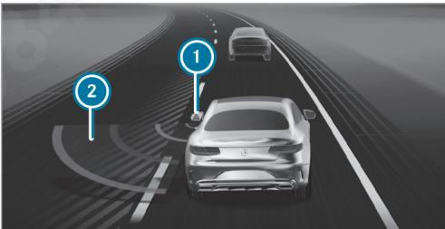

# 驾驶员显示屏上辅助菜单中的通知

$\textcircled{6}$ 车外后视镜上的警告灯$\textcircled{6}$ 红色雷达波

如果从车速为约12公里/小时 起探测到车辆且其立即驶入监测范围内，则相应车外后视镜中的警告灯会呈红色亮起。在辅助菜单中，车外后视镜 $\textcircled{8}$ 中的指示灯也会呈红色亮起，且探测到的车辆所在车道会被划出。

如果在监测范围内探测到车辆，并且您开启相应方向上的转向信号灯，则会响起一次双声警告音并且相应车外后视镜上的警告灯呈红色闪烁。您车辆旁边的红色雷达波 $\textcircled{6}$ 显示在辅助系统图示中。

如果转向信号指示灯保持开启，则对于所有其他探测到的车辆，车外后视镜中的显示都将闪烁，但不会鸣响其他警告音。如果您快速超车，则将不发出警告。

$\textcircled{1}$ 配备主动式环境氛围照明系统的车辆：如已开启警告辅助，则还会通过环境氛围照明强调此警告 第134页)。

请遵守有关驾驶系统的注意事项和您的责任，否则，您可能无法识别潜在的危险

# (→第195页)。

# 开门警示功能

A 警告 尽管有开门警示功能仍存在的事故风险

开门警示功能既不会对静止的物体做出反应，也不会对以较大速度差异接近本车的道路使用者或人员做出反应。

在这些情况下，开门警示功能不会对驾驶员发出警告。

开启车门时，务必注意交通状况并确保有足够的间隙。

开门警示功能是侧面盲点辅助和主动式盲点辅助系统的附加功能，它会警告试图离开静止车辆的乘员有其他车辆正在靠近。

如果在监测范围内探测到车辆，则相应车外后视镜上的红色警告灯亮起。

如果车辆乘员拉动警告侧的车门拉手，则将响起两次警告音并且相应车门上的环境氛围照明系统和相应车外后视镜上的警告灯呈红色闪烁。

配备智能感应助理的车辆：一旦车辆乘员的手移入车门区域，视觉警告就会开始。

$\textcircled{ i}$ 配备环境氛围照明系统或主动式环境氛围照明系统的车辆：可启用和停用环境氛围照明系统的警告辅助 第134页)。

$\textcircled{1}$ 警告辅助取决于车辆配置并可能因设定而异。

仅当侧面盲点辅助或主动式侧面盲点辅助启用时，开门警示功能才可用。

车辆关闭后，开门警示功能会继续工作数分钟。如果在车辆关闭时打开一扇车门，则开门警示功能会再次启用数分钟。车外后视镜中的警告灯闪烁3次后，开门警示功能即不再可用。

开门警示功能仅是一种辅助工具，并不能代替车辆乘员的注意力。开启车门和下车时，车辆乘员应始终小心谨慎。

# 系统限制

尤其在以下情况下，侧面盲点辅助和主动式侧面盲点辅助可能受限：

·传感器上有污垢或传感器被遮盖·视野不佳，例如雾天、大雨或雪天·探测区域内存在车身窄小的车辆（例如自行车或摩托车）

·道路非常宽或车道狭窄·车辆不在其所在车道中央行驶当车辆驶近防撞护栏或类似实线车道边缘时，可能会误发警告。务必确保车辆两侧与其他车流或障碍物保持足够的距离。

当长时间与车身较长的车辆（例如卡车）并排行驶时，警告可能会中断。

如果挂入倒档，则侧面盲点辅助和主动式侧面盲点辅助将不运行。

此外，在以下情况下，开门警示功能可能会受限：

·停车位狭窄且传感器被邻近的车辆遮挡时  
·当行人靠近车辆时  
·存在静止或慢速移动的物体

# 主动式侧面盲点辅助中的施加制动功能

$\textcircled{1}$ 施加制动功能仅适用于配备驾驶辅助组件的车辆。

如果主动式侧面盲点辅助在监测范围内探测到有侧面碰撞的危险，车辆将施加路线校正制动。在这种情况下，施加路线校正制动可帮助避免与其他车辆发生碰撞。

从车速约为30 公里/小时-60公里/小时（取决于国家和地区）起至最高不超过约200 公里/小时，可施加路线校正制动。

警告 忽视主动式侧面盲点辅助施加制动造成的事故风险

施加路线校正制动无法总是防止碰撞。

务必自行转向、制动或加速，尤其当主动式侧面盲点辅助警告您或施加路线校正制动时。

务必保持两侧的安全车距。

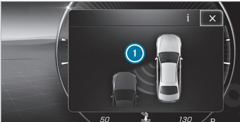

如果已施加路线校正制动，则车外后视镜中的红色警告灯闪烁，并响起警告音。此外，指示有侧面碰撞风险的显示 $\textcircled{8}$ 会出现在驾驶员显示屏上。

在极少数情况下，该系统可能施加不必要的制动。朝相反方向略微转向或加速可随时中止制动。

# 系统限制

请注意主动式侧面盲点辅助的系统限制，否则，您可能无法识别到危险 第230页)。

尤其是在以下情况下，可能会根据驾驶状况施加相应的路线校正制动，或根本不施加路线校正制动：

·车辆或障碍物（例如防撞护栏）位于车辆两侧。  
·驶近的车辆在你们之间留下的横向距离过短。  
·采用了具有高速转弯特性的运动型驾驶方式。  
·明显制动或加速。  
·驾驶安全系统介入，例如电控车辆稳定行驶系统（ESP?）或主动式紧急制动。  
·电控车辆稳定行驶系统（ $\mathsf { E S P } ^ { \mathrm { ( B ) } }$ ）停用。

·探测到轮胎气压流失或故障轮胎。

# ■开启或关闭侧面盲点辅助或主动式侧面盲点辅助

MBUX智能人机交互系统：

设定 辅助 安全辅助

启用或停用主动式侧面盲点辅助。

# 车道保持辅助

# ■车道保持辅助功能

车道保持辅助使用多功能摄像头监测车辆前方区域 第195页)。

它可以防止您意外偏离本车车道。该系统通过车道校正转向干预引导车辆回到车道上，并通过明显的方向盘反馈发出警告。

当车速介于60公里/小时至200公里/小时之间时，车道保持辅助可用。

当满足以下条件时，系统可能会介入：

·车道保持辅助探测到车道标线。  
·本车的一个前轮触碰到车道标线。

如果启用转向信号指示灯，则相应侧无转向干预。

如果在未启用转向信号指示灯的情况下偏离车道，则不会有转向干预，但有与本车车道上移动的障碍物发生碰撞的风险。

配备侧面盲点辅助或驾驶辅助组件的车辆：如果系统探测到障碍物，例如邻近车道上的另一辆车，则无论是否开启转向信号灯，都会进行转向干预。

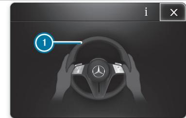

在以下情况下，警告 $\textcircled{8}$ 出现在驾驶员显示屏上且警告音响起：

·车道保持辅助的转向干预持续超过约10秒钟。

·在驾驶员未进行转向操作的情况下，系统在约3分钟内进行2次或2次以上的转向干预。

在车道保持辅助设定中，您可设定系统的灵敏度来决定辅助级别。您还可决定系统是否对车道虚线作出反应，或是否仅对车道实线作出反应 第235页)。

如果注意力辅助系统（ATTENTION ASSIST）探测到疲劳或微睡眠迹象，则会自动选择最敏感的设定 第201页)。

# 车道保持辅助的状态显示

白色：车道保持辅助关闭。如果电控车辆稳定行驶系统（ESP@）关闭或发出轮胎气压流失警告，则车道保持辅助会自动关闭。

黄色：存在故障。还要注意显示信息。

灰色：车道保持辅助已开启但未准备 就绪。

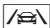

绿色：车道保持辅助已开启并准备就绪。如果系统仅在一侧准备就绪，则只有该侧的车道标线呈绿色显示。

方向

未配备驾驶辅助组件的车辆：如果两条车道标线同时在状态显示中呈红色显示，则表示主动式车道保持辅助系统已启动紧急停车 第215页)。

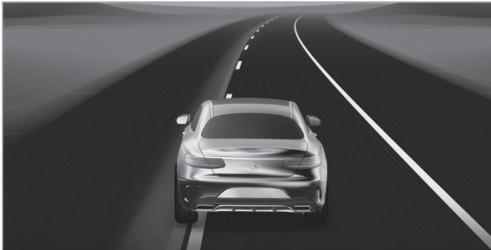  
驾驶员显示屏上辅助菜单中的通知

如果本车的一个前轮行驶在探测到的车道标线上，则此信息会在驾驶员显示屏上的辅助菜单中呈红色高亮显示。

$\textcircled{ i}$ 配备主动式环境氛围照明系统的车辆：如已开启警告辅助，则会通过环境氛围照明强化车道保持辅助警告（ 第134页)。

根据装备情况，提供不同的操作反馈和警告辅助效果。

# 系统限制

在以下情况下，可能不会发生车道校正转向干预，但可能会在方向盘上发出警告，具体因情况而异：

·进行明确主动的转向、制动或加速时。·驾驶安全系统介入时，例如电控车辆稳定行驶系统（ESP?）或主动式紧急制动。·采用了具有高速转弯特性或急加速特性的运动型驾驶方式时。

尤其是在以下情况下，系统可能会受影响或不起作用：

·视野不佳，例如道路照明不足、不断变化的阴影条件、雨、雪、雾或大水花  
·迎面来车、太阳直射或反射等造成眩光。  
，多功能摄像头周围的风挡玻璃脏污或摄像头起雾、损坏或被遮盖。保险杠上雷达传感器周围有污垢，或其已损坏或被遮盖无车道标线或一条车道上的多条车道标线模糊，例如在道路施工区周围。  
，车道标线磨损、变暗或被覆盖。如果与前方车辆的车距过短且因此无法探测到车道标线。车道标线快速变化，例如车道分叉、交叉或合并。  
·车道非常狭窄且蜿蜒曲折。

请遵守有关驾驶系统的注意事项和您的责任，否则，您可能无法识别潜在的危险第195页)。

# ■启用/停用车道保持辅助

MBUX智能人机交互系统：

设定辅助安全辅助

# > 车道保持辅助

$\blacktriangleright$ 启用或停用该功能。

或者，可通过快速访问来启用和停用车道保持辅助。

$\textcircled{1}$ 车辆启动后的设定因国家和地区而异。

# 设定车道保持辅助

MBUX智能人机交互系统：

设定ン辅助安全辅助

车道保持辅助

# 设定灵敏度

选择。 选择提前、中或延迟。

下次车辆启动时将采用上一次选定的设定。

$\textcircled{1}$ 此功能的标准设定因国家和地区而异。

# 启用/停用车道虚线辅助

? 选择其他辅助。

下次车辆启动时将采用上一次选定的设定。

$\textcircled{1}$ 此功能的标准设定因国家和地区而异。

$\textcircled{ i}$ 未配备驾驶辅助组件的车辆必须启用此功能，才能使用紧急停车辅助系统的全部功能。有关紧急停车辅助系统的详细信息，请参见 第215页)。

# 动态车身控制（DYNAMIC BODY CONTROL）功能

动态车身控制（DYNAMIC BODYCONTROL）根据当前操作和驾驶条件持续调节悬挂减震器特性。

根据以下因素分别设定各个车轮的减震：

·路面条件  
·车辆载荷  
·选定的驾驶模式  
·驾驶方式

可使用动态操控选择（DYNAMIC SELECT）调节驾驶模式。

# 后视摄像头

# 」后视摄像头功能

警告 因后视摄像头的功能限制而导致的事故风险

后视摄像头的功能限制可能导致与人或物体发生碰撞的风险。

如果后视摄像头功能受到限制，切勿使用。

挪车和驻车时，确保没有人、动物或物体等处于挪车范围内。

后视摄像头仅是一种辅助工具。其不能代替您观察周围环境。驾驶员应始终负责安全挪车和驻车。挪车和驻车时，确保没有人、动物或物体等处于挪车范围内。

$\textcircled{ i}$ 与出现在内部后视镜上一样，车辆后方区域以镜像显示。

# 以下摄像头视图在中央显示屏上可用：

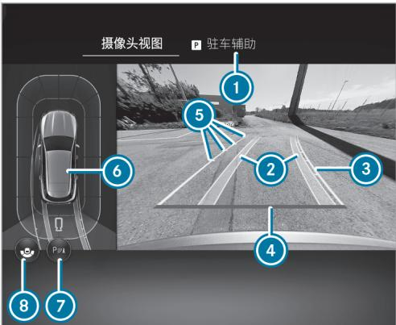

# 菜单摄像头视图 (俯视图）

$\textcircled{6}$ 菜单驻车辅助

$\textcircled{6}$ 表示当前转向角度车辆将要行驶路径的车道（动态）

$\textcircled{6}$ 基于当前转向角度的已行驶表面 (动态)

$\textcircled{6}$ 表示距后方区域约0.3米的基准线$\textcircled{6}$ 表示距后方区域约0.5米、1.0米、1.5米和3.0米的基准线

$\textcircled{5}$ 驻车定位系统（PARKTRONIC）驻车辅助功能警告显示 第242页)  
$\textcircled{4}$ 启用/停用驻车定位系统（PARKTRONIC）驻车辅助功能 第245页)  
$\textcircled{6}$ 在广角视图和带俯视图的后视摄像头之间切换

# 广角视图

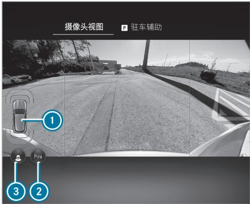

# 示例

$\textcircled{6}$ 驻车定位系统（PARKTRONIC）驻车辅助功能警告显示 第242页)  
$\textcircled{6}$ 启用/停用驻车定位系统（PARKTRONIC）驻车辅助功能 第245页)  
$\textcircled{6}$ 在标准视图和广角视图之间切换

# 系统限制

如果系统还没准备好开始工作，则信息系统停止运作将出现在驾驶员显示屏和/或中央显示屏上。

如果选择了摄像头视图，但中央显示屏暂时变黑或不显示摄像头视图，则说明摄像头系统也有故障或尚未准备好运行。

摄像头系统的视野和其他功能可能会因车辆附加配件（例如车牌支架、自行车架）而受限。

# 在以下情况下，后视摄像头将不起作用或仅部分运作：

·您以高于约16公里/小时 的车速向前行驶。

·行李箱盖未关闭。  
·天气状况恶劣，例如大雨、雪、雾、风暴或水花极大。  
·照明条件差，例如-在夜晚或光线照射在摄像头中。  
·摄像头镜头被遮挡、脏污或起雾。请遵守有关清洁后视摄像头的注意事项第326页)  
·摄像头或车辆后部损坏。在这种情况下，请到具有资质的专业服务中心检查摄像头及其位置和设定。

摄像头系统的视野和其他功能可能会因车辆附加配件（例如车牌支架、自行车架）而受限。

$\textcircled{ i}$ 显示屏对比度可能会因阳光直射或其他光源照射而受影响，例如驶出车库时。这种情况下，应特别注意。  
$\textcircled{1}$ 例如，如果像素错误大大限制显示屏使用，请维修或更换显示屏。

另请遵守有关车辆传感器和摄像头的信息第195页)。

# $3 6 0 ^ { \circ }$ 摄像头

# $3 6 0 ^ { \circ }$ 摄像头功能

警告因360°摄像头的功能限制而导致的事故风险

如果360°摄像头的功能受限，则有与行人或障碍物发生碰撞的风险。

请勿在功能受限的情况下使用 $3 6 0 ^ { \circ }$ 摄像头。

挪车和驻车时，确保没有人、动物或物体等处于挪车范围内。

360°摄像头系统包含四个摄像头，覆盖车辆周围区域。例如，驻车时或难以看到出口时，摄像头可为您提供支持。

$3 6 0 ^ { \circ }$ 摄像头包括以下摄像头并评估它们的图像：

·后视摄像头  
·前视摄像头  
·两个车外后视镜摄像头

摄像头仅用作辅助工具，显示的障碍物可能会变形、不正确，或根本不显示障碍物。其

不能代替您观察周围环境。驾驶员应始终负责安全挪车和驻车。挪车和驻车时，确保没有人、动物或物体等处于挪车范围内。

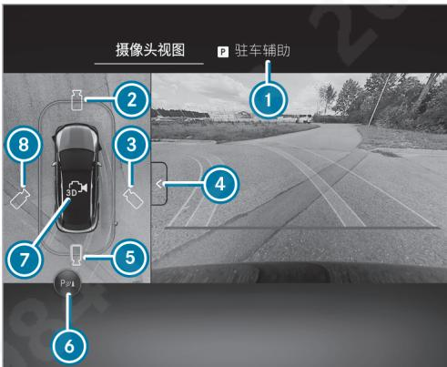  
以下摄像头视图在中央显示屏上可用：

# 摄像头视图 菜单概述 (示例)

$\textcircled{6}$ 菜单驻车辅助 $\textcircled{6}$ 前视摄像头影像 $\textcircled{6}$ 3D 视图，车辆右侧

在标准视图和广角视图之间切换

$\textcircled{6}$ 后视摄像头

$\textcircled{9}$ 启用/停用驻车定位系统（PARKTRONIC）驻车辅助功能 第245页)

$\textcircled{6}$ 3D自动视图

$\textcircled{9}$ 3D 视图，车辆左侧

$\textcircled{ i}$ 驻车定位系统（PARKTRONIC）驻车辅助功能警告显示在所有视图中都显示

第 242页)。

$\textcircled{ i}$ 3D视图 $\textcircled{6}$ 、 $\textcircled{9}$ 和3D自动视图 $\textcircled{6}$ 功能的可用性取决于相应配置。

# 基准线功能

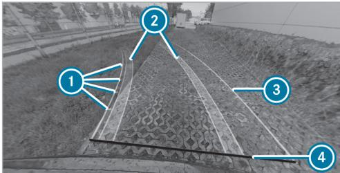

# 示例

$\textcircled{4}$ 表示距后方区域约0.5米、1.0米、1.5米和3.0米的基准线

$\textcircled{6}$ 表示当前转向角度车辆将要行驶路径的车道 (动态）

$\textcircled{6}$ 基于当前转向角度的已行驶表面 (动态)

$\textcircled{6}$ 表示距后方区域约0.3米的基准线

$\textcircled{ i}$ 当智能泊车启用时，路径和基准线呈绿色显示，而不是黄色 第 246页)。

# 来自前视摄像头和后视摄像头的影像

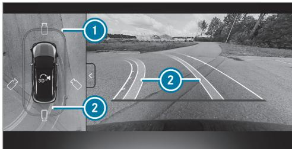  
示例

# $\textcircled{6}$ 驻车定位系统（PARKTRONIC）驻车辅助功能警告显示 第242页)

$\textcircled{6}$ 表示当前转向角度要行驶的路径

# 3D 视图，车辆左侧/右侧

A 警告 因障碍物未显示或高度失真显示导致的事故风险

由于摄像头的投影，3D 视图中的物体可能高度失真或根本不显示。

确保挪车和驻车时没有人、动物或物体等处于挪车范围内。

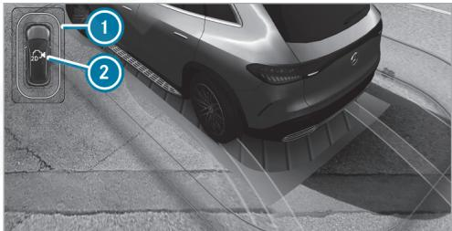

# 示例

$\textcircled{8}$ 驻车定位系统（PARKTRONIC）驻车辅助功能警告显示 第242页)

$\textcircled{6}$ 在 3D 视图和 2D 视图之间切换

虚拟摄像头移至车辆的相应侧。当您切换变速箱档位时，视图自动调整。

$\textcircled{ i}$ 车辆下方区域的显示可能与实际情况有偏差。

# 3D自动视图

$\textcircled{1}$ 在3D 视图中，车辆后方区域并不是以传统镜像方式显示。

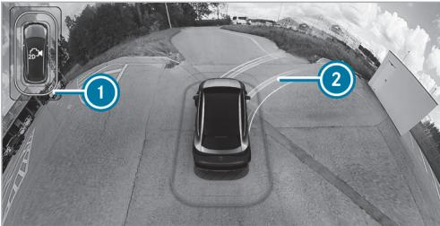

# 示例

$\textcircled{6}$ 驻车定位系统（PARKTRONIC）驻车辅助功能显示 第242页)

$\textcircled{6}$ 基准线

虚拟摄像头移至标准视图，从车顶后上方朝前。当接近障碍物时，视图自动改变。

如果您触摸触摸屏，则视图切换至可自由旋转的3D视图。您可通过触摸转动、倾斜和缩放视图。

# 广角视图

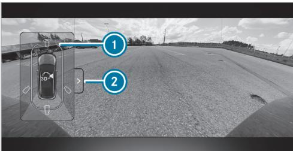

# 示例

$\textcircled{6}$ 驻车定位系统（PARKTRONIC）驻车辅助功能显示 第242页)

# $\textcircled{6}$ 在标准视图和广角视图之间切换

# 系统限制

如果系统还没准备好开始工作，则信息系统停止运作将出现在驾驶员显示屏和/或中央显示屏上。

如果选择了摄像头视图，但中央显示屏暂时变黑或不显示摄像头视图，则说明摄像头系统也有故障或尚未准备好运行。

例如，在以下情况下， $3 6 0 ^ { \circ }$ 摄像头将不起作用或仅部分运作：

·您以高于约16 公里/小时 的车速向前行驶。  
·车门开启。  
·车外后视镜没有完全展开。  
·行李箱盖未关闭。  
·天气状况恶劣，例如大雨、雪、雾、风暴或水花极大。照明条件差，例如

在夜晚或光线照射在摄像头中。

·摄像头镜头被遮挡、脏污或起雾。请参阅有关清洁360°摄像头的注意事项第318页)。摄像头或安装有摄像头的车辆部件损坏时。如果存在这种情况，请到具有资质的专业服务中心检查摄像头及其位置和设定。

出于技术原因，当车辆运输较重的装载物时，车辆的标准高度可能会改变，并可能导致基准线和生成的图像显示不准确。摄像头系统的视野和其他功能可能会因车辆附加配件（例如车牌支架、自行车架）而受限。

$\textcircled{1}$ 突然的阳光直射或其他光源（例如驶出车库时）可能会影响显示屏的对比度。这种情况下，应特别注意。  
$\textcircled{1}$ 例如，如果像素错误大大限制显示屏使用，请维修或更换显示屏。

另请遵守有关车辆传感器和摄像头的信息第195页)。

# 使用按钮调出 $3 6 0 ^ { \circ }$ 摄像头视图

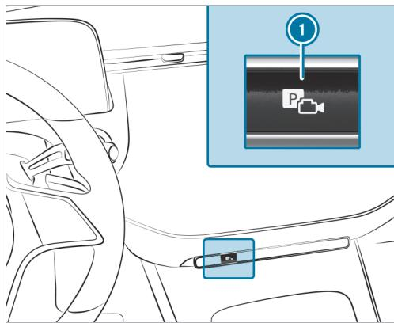

按下按钮 $\textcircled{8}$

选择摄像头视图菜单。

在 MBUX智能人机交互系统中选择所需视图第 237页)。

# 选择 $3 6 0 ^ { \circ }$ 摄像头视图 (倒档)

挂入倒档。

在 MBUX智能人机交互系统中选择所需视图 第238页)。

# |开启摄像头护盖

MBUX智能人机交互系统：

》设定 辅助 相机

选择开启摄像头护盖。

$\textcircled{1}$ 一段时间后或开启或关闭车辆后，摄像头护盖会自动关闭。

# 驻车定位系统（PARKTRONIC）驻车辅助功能

# 驻车定位系统（PARKTRONIC）驻车辅助功能

驻车定位系统（PARKTRONIC）驻车辅助功能是一种电子驻车辅助系统，可监控车辆周围区域。并利用可视信息和声音指示车辆与探测到的障碍物之间的距离。

被动侧面碰撞保护也会警告您侧面有障碍物。驶过障碍物时，必须由前保险杠或后保险杠中的传感器预先探测障碍物。当您向探测到的障碍物的方向转向且有发生横向碰撞的危险时，会发出警告。

被动侧面碰撞保护可通过MBUX 智能人机交互系统启用和停用 第245页)。

为了显示侧面的前方或后方障碍物，车辆必须首先行驶一段至少半个车辆长度的距离。一旦车辆已行驶一段为车辆长度的距离，就可以显示所有侧面的障碍物。

驻车定位系统（PARKTRONIC）驻车辅助功能仅是一种辅助工具。其不能代替您观察周围环境。驾驶员应始终负责安全挪车、驻车和退出停车位。挪车以及在停车位驻车/退出停车位时，请确保挪车范围内无人、动物或障碍物。

# 中央显示屏上的显示

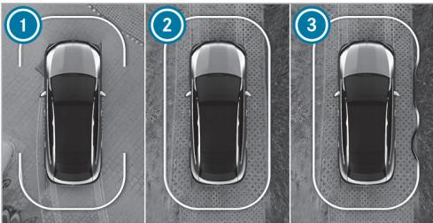  
示例：配备 $3 6 0 ^ { \circ }$ 摄像头的车辆

0 C

示例：配备后视摄像头的车辆  
$\textcircled{8}$ 准备在前部和后部显示  
$\textcircled{6}$ 准备全方位显示  
$\textcircled{6}$ 准备全方位显示和探测到的障碍物

一旦驻车定位系统（PARKTRONIC）驻车辅助功能准备好显示，显示屏上的相应区域 $\textcircled{8}$

至 $\textcircled{8}$ 会呈蓝色显示。

显示的颜色根据与探测到的障碍物的距离而改变：

·蓝色： $> 1$ 米(没有探测到障碍物)  
·黄色：约1米-0.7米  
·橙色：约0.7米-0.4米

·红色： $< 0 . 4$ 米

配备 $3 6 0 ^ { \circ }$ 摄像头的车辆：边界线根据探测到的障碍物的位置和距离动态改变。

根据探测到的与障碍物之间的距离，还会响起间歇式警告音。您可在MBUX智能人机交互系统上设定警告的时间。在提前警告设定中，系统从距离为1米时开始发出警告。在标准设定中，从0.4米的较短距离开始发出警告。

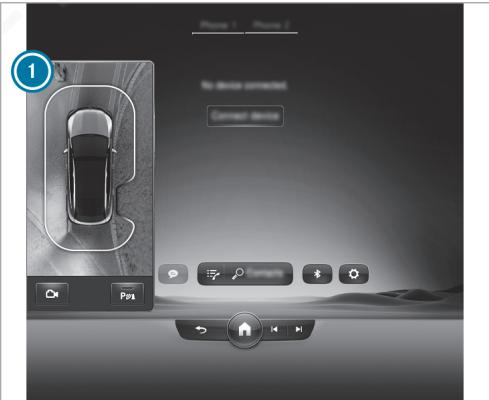

示例：配备 $3 6 0 ^ { \circ }$ 摄像头的车辆如果满足以下要求，当您不在摄像头&驻车辅助菜单中且探测到车辆路径上有障碍物时，中央显示屏上会出现弹出窗口 $\textcircled{8}$

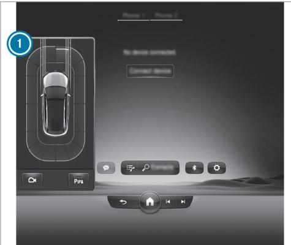  
示例：配备后视摄像头的车辆

·未配备智能泊车的车辆：以不高于12 公里/小时 的车速行驶时。·配备智能泊车的车辆：以不高于18 公里/小时 的车速行驶时。

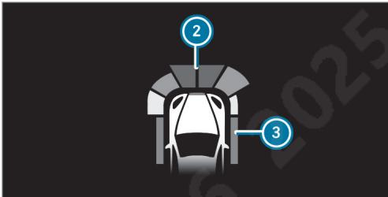

平视显示系统 (示例)

根据需要，由驻车定位系统（PARKTRONIC）驻车辅助功能探测到的与前方 $\textcircled{6}$ 距离约1.0 米和两侧 $\textcircled{6}$ 距离约0.7米 的障碍物也可显示在平视显示系统中。

# 系统限制

驻车定位系统（PARKTRONIC）驻车辅助功能不一定考虑以下障碍物：

·探测区域下方的障碍物，例如人、动物或物体·探测区域上方的障碍物，例如外悬/外凸物体、货车悬伸部分或货车装卸斜坡·从侧面靠近车辆的行人或动物

·放置在车辆旁边的物体例如，在以下情况下，不会显示侧面上的障碍物：

·您驻车并关闭车辆。  
·开启车门。

重新启动车辆后，必须在驶过障碍物再次进行探测后才能发出新警告。

另请遵守以下系统的系统限制：

·后视摄像头 第236页)· $3 6 0 ^ { \circ }$ 摄像头 第238页)

请遵守有关车辆传感器和摄像头的信息；否则系统可能无法正确运作 第195页)。

# 有关驻车定位系统（PARKTRONIC）驻车辅助功能的问题

如果驻车定位系统（PARKTRONIC）驻车辅助功能显示呈红色亮起约3秒钟，然后熄灭，并且符号出现在驾驶员显示屏上，则系统可能由于信号干扰而停用。重新启动车辆，并检查驻车定位系统（PARKTRONIC）驻车辅助功能是否在不同位置都工作。

如果警告音也响起，则可能是由于以下其中一个原因造成的：

·传感器脏污：清洁传感器 第326页)。·驻车定位系统（PARKTRONIC）驻车辅助功能因故障停用：重新启动车辆。如果问题继续存在，请咨询具有资质的专业服务中心。

# ■启用/停用驻车定位系统（PARKTRONIC）驻车辅助功能

<table><tr><td>！ 注意事项驻车或挪车时因近距离障碍 物导致的车辆损坏</td></tr><tr><td>驻车定位系统（PARKTRONIC）驻车辅助功 能可能无法探测某些近距离障碍物。 驻车或挪车时，应特别注意传感器上 方或下方的障碍物，例如花盆或牵引 杆。否则，可能会导致车辆或其他</td></tr></table>

# 要求：

·摄像头菜单打开。

·或：驻车定位系统（PARKTRONIC）驻车辅助功能弹出窗口显示。

在中央显示屏上点击P。

如果指示灯亮起，则驻车定位系统（PARKTRONIC）驻车辅助功能启用。如果指示灯未亮起或符号显示，则驻车定位系统（PARKTRONIC）驻车辅助功能未启用。

$\textcircled{1}$ 当车辆启动时，驻车定位系统（PARKTRONIC）驻车辅助功能自动启用。

或者，可在快速访问菜单中启用或停用驻车定位系统（PARKTRONIC）驻车辅助功能。

# 设定驻车定位系统（PARKTRONIC）驻车辅助功能警告音

MBUX智能人机交互系统：

> PARKTRONIC

# 设定警告音

选择设定警告音。  
在音量或音高下设定所需等级。

# 启用/停用音频声音减弱

选择音频声音减弱，然后开启或关闭提示音响起时音频减弱。  
在驻车定位系统（PARKTRONIC）驻车辅助功能警告音响起时，当前播放媒体源的音量会降低。

# 或者

选择音频声音减弱，然后开启或关闭挂入R 档时音频声音减弱。

挂入倒档时，当前播放媒体源的音量会降低。

# 设定警告时机

选择警告时间点。  
为前排或后排设定所需的警告时间点。  
启用或停用侧面警告。

# 智能泊车

# 智能泊车功能

A警告物体位置超出智能泊车探测区域上限或下限造成的事故风险

如果物体位置超出探测区域的上限或下限，则可能出现以下情况：

·智能泊车可能过早转向。  
·车辆可能不会在这些物体前方停止。

存在碰撞危险！

在这些情况下，请勿使用智能泊车。

智能泊车是一种在后视摄像头或360°摄像头辅助下使用超声波的电子驻车辅助系统。当以不超过约35公里/小时的车速向前行驶时，系统自动测量车辆两侧即将出现的停车位。被占用的停车位以虚拟车辆轮廓的形式显示。刚驶过停车位后，可立即选择可用的停车位。

智能泊车仅是一种辅助工具。其不能代替您观察周围环境。驾驶员应始终负责安全挪车、驻车和退出停车位。确保车辆行驶路径上没有人、动物或物品等。

智能泊车提供以下功能：

配备后视摄像头的车辆·在与道路平行的停车位驻车·倒车进入与道路垂直的停车位停车位可自由选择。倒车时执行驻车过程。

# 配备 $3 6 0 ^ { \circ }$ 摄像头的车辆

·在与道路平行的停车位驻车  
·倒车进入与道路垂直的停车位  
·在只能通过标记探测到的停车位驻车（例如在路边)  
·您已使用智能泊车驻车时退出停车位

停车位可自由选择。根据停车位的方位，也可自由选择驻车方向（前进或后退）。

如果智能泊车可用，则通知出现在驾驶员显示屏上。当系统探测到停车位时，会出现通知P。箭头指示可用停车位所在车道一侧。然后将这些显示在中央显示屏上。

当智能泊车启用时，转向信号指示灯将根据计算出来的车辆路径而启用。通过加速、制动、转向和换挡来辅助驻车和出库过程。

如需开始驻车过程，请按下按钮 $| \boxed { \mathsf { P } \dot { \mathbf { o } } } | \to $ 第247页)或进入导航视图（例如，在目的地附近时）并选择智能泊车 第271页)。

$\textcircled{ i}$ 如果在驻车辅助菜单中，已选择了设定挂入R档时显示停车位，且挂入了倒档R，则停车位 第247页)会直接显示在中央显示屏上。如果车辆未关闭且智能泊车未启用，在某些情况下智能泊车视图会隐藏，直到重新启动车辆后才会再次显示。

智能泊车在下列情况下将被取消：

·您再次按下按钮·开始转向。  
选择驻车档回。  
·您施加电动驻车制动。  
·电控车辆稳定行驶系统（ $\mathsf { E S P } ^ { \mathbb { ( B ) } }$ ）介入。  
·开启驾驶员侧车门。

# 系统限制

如果外部照明故障，则智能泊车不可用。

另请遵守以下系统的系统限制：

·后视摄像头 第236页)· $3 6 0 ^ { \circ }$ 摄像头 第238页)

测量停车位时，不会探测超出智能泊车探测区域上限或下限的物体，例如外悬/外凸物体、货车的外悬部分或装卸斜坡以及停车位边界等。随后计算驻车过程时也不会将这些部分考虑在内。在某些情况下，智能泊车可能过早引导您进入停车位或过晚制动。

某些环境条件，例如降雪或大雨，可能导致无法准确测量停车位。同样，被挂车牵引杆部分占据的停车位可能无法被识别或可能测量不正确。仅在具有足够附着力的水平路面上使用智能泊车。

智能泊车也可能会显示不适合的停车位，例如，不允许驻车的停车位或不适合的路面上的停车位。

例如，在以下情况下，请勿使用智能泊车：

·在极端天气状况下，例如结冰、积雪或大雨天。

·运输伸出车辆的装载物时。  
·停车位位于陡峭的下坡或上坡路上时。已安装防滑链时。在刚更换轮胎后或安装备胎时。  
，如果轮胎气压过低或过高。  
）在坡度约大于 $1 5 \%$ 的陡峭下坡路上。  
·如果车辆水平高度已偏移，例如一侧在路缘上（配备水平高度控制的车辆）。

# 使用智能泊车驻车

A警告进入或退出驻车区域时车辆向外 摆动造成的事故风险

驻车或退出驻车区域时，车辆向外摆动并可能驶入对面车道。

这可能导致您与障碍物或其他道路使用者发生碰撞。

请注意障碍物或其他道路使用者。

如有必要，请停止车辆或取消使用智能泊车的驻车步骤。

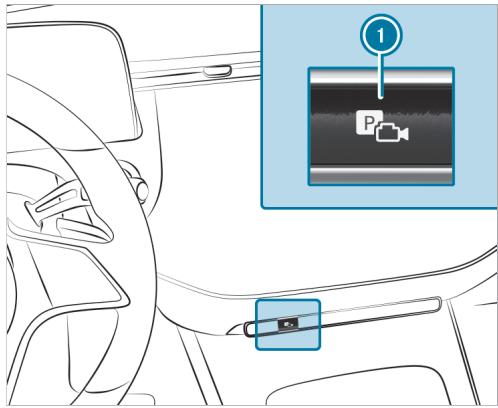

按下按钮 $\textcircled{8}$ 。

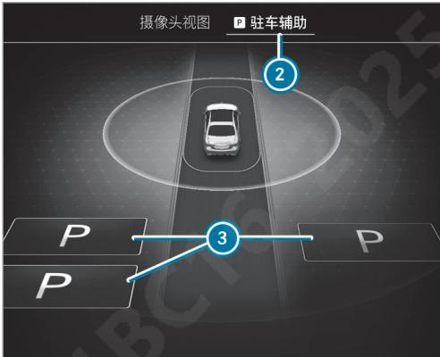

# 驻车辅助菜单 (示例为屏幕左侧)

# 选择驻车辅助?菜单。

系统探测到的停车位 $\textcircled{6}$ 显示在中央显示屏上。

$\textcircled{ i}$ 如果在驻车辅助菜单中，已选择了设定挂入R档时显示停车位，且挂入了倒档R，则停车位 $\textcircled{6}$ 会直接显示在中央显示屏上。

被占用的停车位随后会以虚拟车辆轮廓的形式显示在屏幕左侧。

屏幕右侧在所有变速箱档位（除外）下都显示俯视摄像头视图。如果挂入倒档，屏幕右侧会显示后视摄像头的视图。

车速高于约16公里/小时 时，屏幕右侧的摄像头视图关闭。

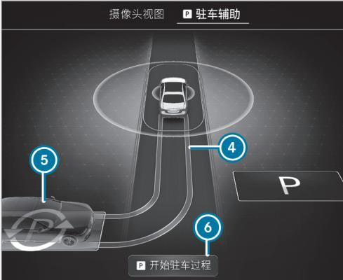  
驻车辅助菜单(示例)

当车辆静止时，指示进入当前所选停车位的车辆路径 $\textcircled{9}$ 也会出现。

如果显示停车位：停下车辆。必要时选择另一个停车位。开始驻车过程：再次按下按钮 $\textcircled{8}$

# 或者

踩下制动踏板并选择开始驻车过程（取决于相应车辆配置） 。双手离开方向盘，松开制动踏板。车辆驶入选定停车位。

驻车过程的持续时间由进度条显示。

开始驻车过程后，转向信号指示灯自动开启。您应负责根据交通状况选择转向信号指示灯。如有必要，请选择相应的转向信号指示灯。

驻车过程完成后，智能泊车已结束信息出现。

停驻车辆的360°全方位视图显示在中央显示屏上。

固定车辆，以防溜车。根据法规要求或当地情况：必要时将车轮转向路缘。

$\textcircled{1}$ 您可在驻车操作期间停止车辆并切换变速箱档位。系统随后计算新的车辆路径。如无新的车道可用，则可再次切换变速箱档位或取消程序。

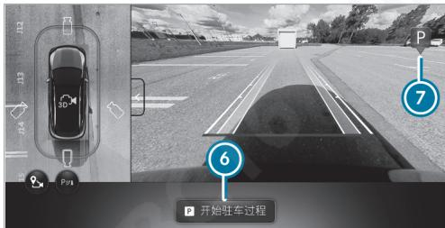

# 通过菜单摄像头视图立即驻车

选择摄像头视图菜单。  
当车辆处于静止状态，变速箱挂入档，且符号?出现在摄像头视图中时：再次按下按钮 $\textcircled{6}$ 。

# 或者

踩下制动踏板并选择开始驻车过程（取决于相应车辆配置）对探测到的停车位启动驻车过程。

# 使用智能泊车退出停车位

# 要求：

·车辆配备 $3 6 0 ^ { \circ }$ 摄像头。  
·已使用智能泊车停驻车辆。

启动车辆。

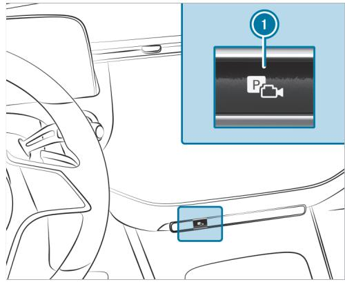

按下按钮 $\textcircled{8}$

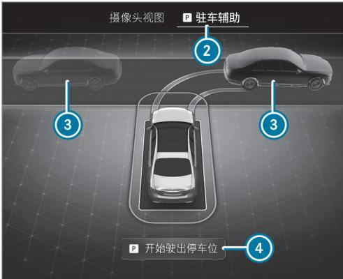

# 驻车辅助菜单 (示例为屏幕左侧)

# 选择菜单驻车辅助?。

被占用的停车位随后会以虚拟车辆轮廓的形式显示在屏幕左侧。

屏幕右侧在所有变速箱档位（R除外）下都显示俯视摄像头视图。在变速箱档位R下，屏幕右侧显示来自后视摄像头的图像。

必要时更改退出方向 $\textcircled{8}$

发起出库过程：再次按下按钮 $\textcircled{6}$ 。

# 或者

踩下制动踏板并选择开始驶出停车位 $\textcircled{9}$ （取决于相应车辆配置）。  
必要时，切换变速箱档位。请遵守驾驶员显示屏和中央显示屏上显示的所有信息。车辆移出停车位。  
出库过程的持续时间由进度条显示。

发起出库过程时，转向信号指示灯自动开启，完成出车后，转向信号指示灯自动关闭。您应负责根据交通状况选择转向信号指示灯。如有必要，请选择相应的转向信号指示灯。

退出停车位后，警告音响起且智能泊车已结束，请驾驶员接管车辆信息提醒您控制车辆。您必须再次加速、制动、转向和换档。

如果您没有对车辆接管提示做出响应，系统将制动车辆至静止状态。

# 」暂停智能泊车

您可通过执行以下其中一个操作来中断智能泊车的驻车或出库过程，例如：

踩下制动踏板。  
开启前排乘客侧车门、后车门、行李箱或发动机罩。  
施加电动驻车制动或启用保持（HOLD）功能。

继续进行驻车或出库过程：轻轻踩下加速踏板。

$\textcircled{1}$ 如果在智能泊车启用前施加了电动驻车制动，则轻轻踩下加速踏板可启动驻车或出车过程。

继续进行已暂停的驻车过程前，请再次检查您周围的环境。确保挪车范围内没有人、动物或物品。另请注意智能泊车的系统限制。

# 智能泊车的自动制动功能

在车辆行驶路径上探测到的人员或物体可能会触发突然制动，进而导致驻车或出库过程停止。车辆随后将保持在静止状态。如果您踩下加速踏板，驻车或出库过程将继续进行。

继续进行驻车或出库过程前，请再次检查您周围的环境。再次确认车辆行驶路径上没有人、动物或物品等。另请注意智能泊车的系统限制。

# 挪车辅助系统

# 起步防碰撞辅助系统功能

A 警告 起步防碰撞辅助系统探测性能受限造成的事故风险

起步防碰撞辅助系统无法总是清楚识别物体和交通状况。

务必注意交通状况，请勿完全依靠起步辅助系统。  
做好必要时的制动或转向准备，在交通状况允许的情况下和在安全情况下采取避让措施。

起步防碰撞辅助系统可降低起步时的碰撞严重程度。如果系统探测到行驶方向上的障碍物，则车速会短时间限制为约2公里/小时。

在以下情况下，可能出现碰撞风险：

·驾驶员混淆加速踏板和制动踏板时。  
·驾驶员挂入不正确的档位时。  
·驾驶员过于用力踩下加速踏板时。

在以下情况下，起步防碰撞辅助系统启用：

·车辆处于静止状态且变速箱档位切换至档或回档时。  
·车辆自静止后滑行少于约1.0 米。  
·探测到的障碍物在不到约1.0米 的范围内时。

起动辅助可在菜单挪车辅助系统中停用或启角 第256页)。

如已探测到紧急情况，则符号呈红色出现在摄像头&驻车辅助菜单的所选视图中。

$\textcircled{ i}$ 如果起步防碰撞辅助系统不可用，则符号呈灰色出现。如果摄像头&驻车辅助菜单没有在中央显示屏上打开，则此符号会与驻车定位系统（PARKTRONIC）驻车辅助功能弹出窗口一起出现。

起步防碰撞辅助系统仅是一种辅助工具。其不能代替您观察周围环境。驾驶员应始终负责安全挪车、驻车和退出停车位。确保车辆行驶路径上没有人、动物或物品等。

# 系统限制

智能泊车的系统限制适用 第246页)。在上坡道上，起步防碰撞辅助系统性能受限。

# 横向探测警报功能

警告 横向探测警报性能受限造成的事故风险

横向探测警报无法始终清楚识别物体和交通状况。

务必注意交通状况，请勿完全依靠横向探测警报。  
做好必要时的制动或转向准备，在交通状况允许的情况下和在安全情况下采取避让措施。

横向探测警报可在您退出停车位时提醒您注意横向穿行的车辆和行人。保险杠上的雷达传感器也会监测车辆邻近区域。

在以下情况下，横向探测警报启用：

·后部横向车辆行人警告：车辆以低于约10 公里/小时 的速度倒车。

·前部横向车辆行人警告：车辆以低于约10 公里/小时 的速度向前行驶且中央显示屏上显示摄像头视图 第241页)。

前部横向车辆行人警告可在挪车辅助系统菜单中停用或启用 第256页)。

如已探测到紧急情况，则符号「呈红色出现在摄像头&驻车辅助菜单的所选视图中。

# 后部横向车辆行人警告

·探测到横穿车道的车辆或行人时，会自动制动车辆。  
，如果摄像头&驻车辅助菜单没有打开且探测到紧急情况，则警告以及驻车定位系统（PARKTRONIC）驻车辅助功能弹出窗口会出现在中央显示屏上。

# 前部横向车辆行人警告

·如果智能泊车启用，探测到横穿车道的车辆或行人时，会自动制动车辆。·如果智能泊车未启用但摄像头&驻车辅助菜单打开，则会出现警告。

·如果摄像头&驻车辅助菜单未打开，则系统无法对横穿车道的车辆和行人做出反应。

横向探测警报仅是一种辅助工具，不能代替您观察周围环境。驾驶员应始终负责安全挪车、驻车和退出停车位。确保车辆行驶路径上没有人、动物或物品等。

# 系统限制

$\textcircled{1}$ 如果横向探测警报不可用，则符号[灰显。

智能泊车的系统限制适用 第 246页)。

如果车辆或其他物体遮住雷达传感器，则将无法进行探测。

横向探测警报在以下情况下不可用：

·上坡时

# 邻近区域制动功能

警告挪车制动功能有限的探测能力造成的事故风险

挪车制动功能无法始终清楚探测到行人。  
此功能无法探测到其他障碍物。

在这些情况下，该功能可能执行不必要的制动或根本不执行制动。

务必注意交通状况，请勿完全依靠挪车制动功能。  
做好制动准备。

邻近区域制动可在车辆低速倒车时防止与行人发生碰撞。如果后视摄像头探测到车辆路径上有人，则车辆可制动至静止状态。

邻近区域制动可在以下情况下介入：

·车辆以低于10 公里/小时 的速度倒车。·摄像头视图显示在中央显示屏上第 241页)。

根据相应国家和地区的不同，可在挪车辅助系统菜单中停用或启用邻近区域制动第 256页)。

如已触发邻近区域制动，则符号「将呈红色出现在摄像头&驻车辅助菜单的所选视图中。

$\textcircled{1}$ 如果邻近区域制动不可用，则符号呈灰色出现。

邻近区域制动仅是一种辅助工具。其不能代替您观察周围环境。驾驶员应始终负责安全挪车、驻车和退出停车位。确保车辆行驶路径上没有人、动物或物品等。

# 系统限制

请遵守以下功能的系统限制：

·智能泊车 第246页)· $3 6 0 ^ { \circ }$ 摄像头 第238页)·后视摄像头 第236页)

邻近区域制动在以下情况下不可用：

·上坡时

# 】开启或关闭驻车支持

MBUX智能人机交互系统：

> 设定 辅助 泊车辅助

$\textcircled{1}$ 该功能是一种数字化产品和服务第29页)。

选择挪车辅助系统。

开启或关闭所需的驻车支持。

# 车辆牵引说明

本车不适合使用用于平挂车牵引或救生艇牵引等用途的牵引杆系统。挂接和使用牵引杆系统可能会损坏本车。使用牵引杆系统牵引车辆时，无法保证牵引车辆或被挂车辆的安全驾驶特性。车辆-挂车组合可能会从一侧滑到另一侧。

请注意以下信息：

·允许的牵引方式 第335页)  
·插电式混合动力车辆：允许的牵引方式第335页)  
·关于在前后轴着地的情况下牵引车辆的注意事项 第344页)

# 有关驾驶员显示屏的注意事项

# A 警告驾驶员显示屏故障时的事故风险

如果驾驶员显示屏停止运作或其功能受限，您将收不到其他功能限制、车速、当前行驶档位和电动驻车制动器状态等问题的相关信息。

这将影响操作安全。

根据交通状况立即停车并关闭车辆。  
请勿继续驾驶。  
请咨询具有资质的专业服务中心。  
运输车辆，而不是拖走车辆。

如果车辆的操作安全性受到影响，请立即安全驻车。请联系具有资质的专业服务中心。

驾驶员显示屏显示以下基本信息：

·指示灯和警告灯）车速和发动机转速·变速箱档位·燃油液位或充电电量可以使用的附加功能包括：

·辅助和导航等各种菜单 ）驱动系统状态指示灯 02显示信息，有关能耗和可抵达范围的信息·功率水平和高电压蓄电池的充电电量可更改某些菜单内容和设定。

# 关于3D驾驶员显示屏的说明

3D 驾驶员显示屏可实现驾驶员显示屏内容的三维空间显示。这需要驾驶员摄像头对驾驶员进行记录。

在以下情况下，系统可能会受影响或不起作用：

驾驶员摄像头停用或不工作。  
，驾驶员处于驾驶员摄像头的探测范围之外。  
·操作条件不适当，例如如果外部温度太低或太高。

# 驾驶员显示屏故障

A 警告 驾驶员显示屏故障时的事故风险如果驾驶员显示屏停止运作或其功能受限，您将收不到其他功能限制、车速、当前行驶档位和电动驻车制动器状态等问题的相关信息。

这将影响操作安全。

根据交通状况立即停车并关闭车辆。  
请勿继续驾驶。  
请咨询具有资质的专业服务中心。  
运输车辆，而不是拖走车辆。

# 确定驾驶员显示屏故障

可以通过以下特征确定驾驶员显示屏故障：

·车辆开启后，驾驶员显示屏仍然不显示除黑屏之外的任何内容。  
·驾驶员显示屏重启。  
·内容卡住。  
·显示屏停止显示车速等数据。各种指示灯和警告灯也显示。

更新期间，驾驶员显示屏也不工作。

# 驾驶员显示屏故障时应采取的操作

如果驾驶员显示屏停止运作或其功能受限，请根据交通状况立即停车并关闭车辆。建议此类情况下执行以下过程：

请根据交通情况停车。  
车辆处于静止状态时，继续踩住制动踏板。  
按下直接选档（DIRECTSELECT）换档杆上的按钮回。  
施加驻车制动器。  
慢慢松开制动踏板，并确保固定车辆以防溜车。  
一次性按住启动/停止按钮 第191页)大约三秒钟，以便关闭驱动系统。  
请立即联系具有资质的专业服务中心。运输车辆，而不是拖走车辆。

$\textcircled{1}$ 此外，请注意有关关闭车辆的其他信息第191页)和有关运输车辆的注意事项第331页)。

# 操作驾驶员显示屏

A 警告信息系统和通讯设备造成的干扰凤险

如果在行车时操作集成在车内的信息系统和通讯设备，则可能会分散您对交通状况的注意力。这可能会导致您失去对车辆的控制。

仅可在交通状况允许的情况下操作该设备。  
如果对此不确定，在注意道路及交通状况的情况下停车，并在车辆处于静止状态时操作该设备。

操作驾驶员显示屏时，必须遵守当前行驶所在国家或地区的法规要求。

# 滚读菜单栏

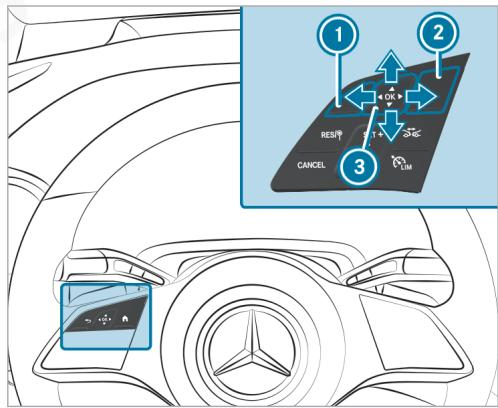

$\textcircled{6}$ 回退按钮$\textcircled{6}$ 主菜单按钮$\textcircled{6}$ 触摸式控制键

方向盘左侧的控制键管理驾驶员显示屏的内容。用手指在触摸式控制键 $\textcircled{6}$ 上滑动以垂直或水平浏览内容。按下触摸式控制键确认选择。

$\textcircled{ i}$ 使用拇指指尖操作触摸式控制键 $\textcircled{6}$ 的效果最佳。触摸式控制键的灵敏度在中央显示屏上设定。

点按主菜单按钮 $\textcircled{6}$ 。

通过向左或向右滑动触摸式控制键 $\textcircled{6}$ 选择菜单。

确认：按下触摸式控制键 $\textcircled{8}$

# 驾驶员显示屏菜单

# 有关驾驶员显示屏菜单的注意事项

A警告信息系统和通讯设备造成的干扰凤险

如果在行车时操作集成在车内的信息系统和通讯设备，则可能会分散您对交通状况的注意力。这可能会导致您失去对车辆的控制。

仅可在交通状况允许的情况下操作该设备。

如果对此不确定，在注意道路及交通状况的情况下停车，并在车辆处于静止状态时操作该设备。

操作驾驶员显示屏时，必须遵守当前行驶所在国家或地区的法规要求。

以下菜单可通过驾驶员显示屏上的菜单栏调出：

·运动经典导航辅助越野模式（因装备而异）  
保养

在其中一些菜单中，您可以在中央显示区域中不同的显示内容之间进行选择。

在其中大部分菜单中，您可以利用选项对菜单特定显示内容的更多设定进行配置。

您可以在电子使用说明书（用户手册）中找到有关菜单的可能设定和选择的更多信息。

# 平视显示

# 平视显示系统功能

平视显示系统将各种内容投射到驾驶员视线范围内，例如：

使用平视显示系统菜单栏选择不同的场景，例如：

·极简运动标准越野模式（因装备而异）  
设定  
·启用/停用 平视显示

下图所示为平视显示系统示例。您可以选择所显示的内容 第256页)。

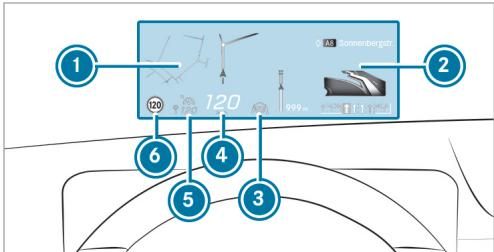  
带导航功能的平视显示系统内容 $( 9 \times 3 ^ { \circ }$ ）

导航指令

$\textcircled{6}$ 导航指令 (到下一个路线事件的距离)

$\textcircled{6}$ 智能领航转向功能状态

$\textcircled{9}$ 当前车速

$\textcircled{6}$ 驾驶系统中的设定车速（例如定速巡航控制）

$\textcircled{5}$ 探测到的交通标志(交通标志辅助系统）当您接听电话时，平视显示系统和驾驶员显示屏上将显示呼叫等待信息。 $\textcircled{1}$ 通话状态还将显示在中央显示屏上。

# 系统限制

可见性尤其会受以下条件影响：

·座椅位置  
·图像位置设定照明条件湿滑路面  
显示屏护盖上的物品  
·太阳镜偏光

# 操作平视显示系统

# 通过驾驶员显示屏菜单栏选择平视显示系统的显示内容

按下左侧主菜单按钮。

选择平视显示系统菜单栏：向上滑动触摸式控制键。

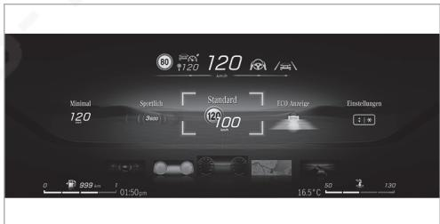

# 在平视显示系统的显示内容之间切换

向左或向右滑动触摸式控制键。  
平视显示系统中将出现所选显示内容的预览。  
确认：按下按钮OK。

# 切换回驾驶员显示屏

按下按钮或。

# 设定位置和亮度

向左或向右滑动触摸式控制键，然后在平视显示系统菜单栏上选择设定菜单。

按下触摸式控制键。当前位置和亮度设定将以图形形式显示在平视显示系统和驾驶员显示屏上。

调节位置：向上或向下滑动触摸式控制键。

调节亮度：向左或向右滑动触摸式控制键。

位置和亮度的设置将自动保存。

按下按钮或OK退出设置。

# 开启/关闭平视显示系统

驾驶员显示屏：

# 开启

1 向上滑动触摸式控制键。

按下触摸式控制键。

# 关闭

向上滑动触摸式控制键。  
滑动触摸式控制键，然后选择平视显示。  
按下触摸式控制键。

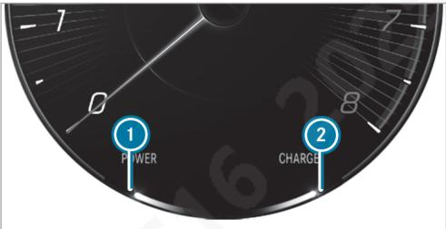  
配有48伏车载电气系统的车辆

$\textcircled{8}$ 电驱动支持

$\textcircled{6}$ 电动机的能量回收特性

$\textcircled{1}$ 由于各种系统限制，显示值可能暂时与实际值略有不同。

# 功率表功能

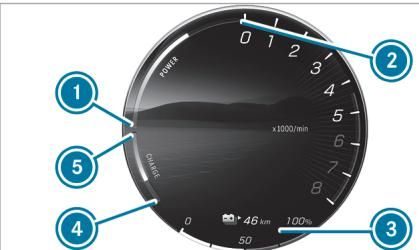

$\textcircled{8}$ 电量显示范围起始位置$\textcircled{6}$ 电量显示范围结束位置$\textcircled{6}$ 高电压蓄电池当前充电电量/剩余可达里程

$\textcircled{9}$ 最大再生能量$\textcircled{6}$ 再生能量显示范围起始位置功率表具有以下功能：

·在电动模式下，区域①- $\textcircled{6}$ 显示当前使用的电动驱动的百分比。内燃机以100%的程度启动。在助力模式下，显示驱动系统的电动助力辅助。

·区域-③显示使用内燃机的能量回收和充电特性。

$\textcircled{1}$ 由于各种系统限制，显示值 $\textcircled{6}$ 可能暂时与实际值略有不同。

# 有关可达里程的信息

·实际的可达里程与显示的可达里程之间可能会有偏差。在计算可达里程时会考虑到您之前的驾驶方式。车外温度或智能气候控制系统的设定等因素会对可达里程造成直接的影响。当导航系统或通勤路线启用时，在可达里程的计算中会包含有关前方路线的附加信息。

# 驾驶员显示屏上的状态指示灯概述

驾驶与驾驶安全系统的状态指示灯位于显示区 $\textcircled{8}$ 至 $\textcircled{9}$ 。

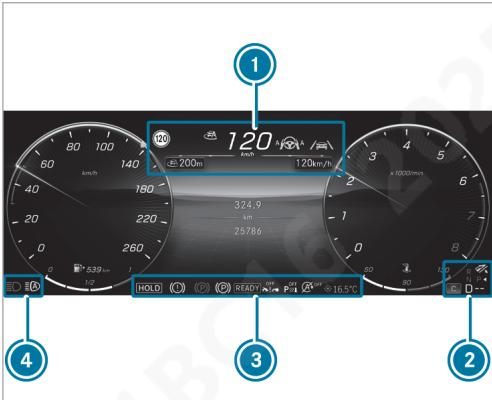

行人探测指示灯（仅在辅助显示中）

智能泊车可用指示灯 第247页)

智能泊车已探测到一个停车位指示灯第247页)

智能泊车停用指示灯 第245页)

定速巡航控制指示灯 第203页)

限速器指示灯 第204页)

」自适应巡航指示灯 第207页)

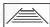

自适应巡航限定距离指示灯

第207页)

主动式紧急制动已关闭指示灯第225页)

主动式紧急制动受影响或不起作用指示灯 第225页)

智能领航转向功能指示灯第213页)

变道辅助指示灯 第217页)

可提供带导航辅助的智能变道（Automatic Lane Change）指示灯第217页)

车道保持辅助指示灯 第233页)

主动式侧面盲点辅助指示灯（仅在辅助显示中） 第232页)

插电式-混合动力操作已启用指示灯

触控加速踏板指示灯 第167页)发声器不起作用指示灯 第390页)自动节能启停功能 第163页)HOLD 保持（HOLD）功能指示灯第200页)A 自适应远光灯辅助系统指示灯第130页)自适应远光灯辅助系统增强版指示灯第131页)国 交通拥堵辅助指示灯 第212页)来 易滑路面警告灯

配备交通标志辅助系统的车辆：探测到的指示和交通标志 第226页)

其他驾驶系统的重要信息可能会短暂出现在显示的交通标志前。

# 概述和操作

# 有关MBUX智能人机交互系统的说明

A 警告信息系统和通讯设备造成的干扰凤险

如果在行车时操作集成在车内的信息系统和通讯设备，则可能会分散您对交通状况的注意力。这可能会导致您失去对车辆的控制。

仅可在交通状况允许的情况下操作该设备。

如果对此不确定，在注意道路及交通状况的情况下停车，并在车辆处于静止状态时操作该设备。

操作MBUX智能人机交互系统时，必须遵守当前行驶时所在国家和地区的法规要求。

根据配置的不同，MBUX智能人机交互系统的功能范围和产品名称可能与本使用说明书（用户手册）中的描述和图像有所不同。例如，带增强现实的导航并非在所有设备上都可用。

注意事项中央显示屏/前排乘客显示屏因阳光直射导致表面温度升高

显示屏表面变得很暗。

如果显示屏暴露在阳光直射下，其表面可能会变得很热。

如果显示屏暴露在阳光直射下，请先让其冷却较长一段时间，之后再触摸显示屏。

$\textcircled{1}$ MBUX智能人机交互系统的功能可能会有所不同，并取决于以下因素：

·市场  
·国家和地区版本  
·技术条件

由梅赛德斯-奔驰和/或第三方供应商提供的功能、服务和服务方面可能会在合同期满后或由于技术条件而不再可用。因此，无权要求继续提供功能和服务。所述功能可能会在本手册付印后进行修改、优化和调整。

梅赛德斯-奔驰保留对以下方面进行更改的权利：

·特点  
·服务  
·服务方面

出于这些原因，在某些情况下，与MBUX智能人机交互系统相关的说明和描述可能与您的车辆不同。

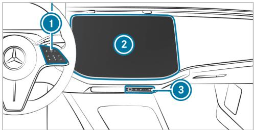  
MBUX智能人机交互系统概述

配备中央显示屏的车辆$\textcircled{6}$ MBUX智能人机交互系统的触摸式控制键和控制面板·操作触摸式控制键

$\textcircled{6}$ 带驾驶员触摸功能的中央显示屏

·零层级界面概述 第271页)  
·调出和操作零层级界面 第274页)  
·主屏幕概述  
·操作触摸屏

$\textcircled{6}$ 开关板，用于：

开启或关闭MBUX智能人机交互系统，开启或关闭中央显示屏

开启或关闭声音一调节音量

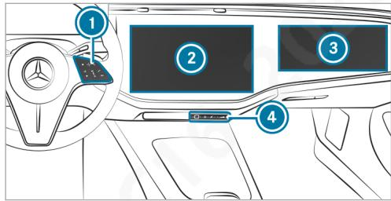

配备MBUX超联屏的车辆$\textcircled{6}$ MBUX智能人机交互系统的触摸式控制键和控制面板·操作触摸式控制键 第276页)

$\textcircled{6}$ 带驾驶员触摸功能的中央显示屏

·零层级界面概述 第271页)  
·调出和操作零层级界面 第274页)  
·主屏幕概述 第276页)  
·操作触摸屏 第276页)

$\textcircled{6}$ 带触摸功能的前排乘客显示屏$\textcircled{9}$ 开关板，用于：

开启或关闭MBUX智能人机交互系  
统  
开启或关闭声音  
一调节音量

更多操作选项：

·使用 MBUX读心语音助理进行对话。  
·使用智能感应助理以非接触式方式操作功能。随后能以智能、感应的方式进行交互，或通过手部或头部的动作进行交互。  
$\textcircled{1}$ 您可从电子使用说明书（用户手册）中找到有关操作以及应用程序和服务的更多信息。

# 前排乘客显示屏（配备MBUX超联屏的车辆)

A 警告因驾驶员查看前排乘客显示屏分心导致的事故和伤害风险

如果您在驾驶时查看前排乘客显示屏，可能会导致分散对交通状况的注意力。这可能会导致您失去对车辆的控制。前排乘客显示屏专供前排乘客使用。

应时刻注意观察实际交通状况。  
驾驶时避免查看前排乘客显示屏。

前排乘客显示屏是专供前排乘客使用的附加触摸屏。

驾驶时在前排乘客显示屏上显示菜单内容的要求：

·前排乘客坐在前排乘客座椅上。  
·前排乘客显示屏已开启，且不显示数字饰图。  
驾驶员摄像头开启 第 282页)。符号[出现在中央显示屏的状态栏中。  
）驾驶员摄像头探测到驾驶员头部和视线。

前排乘客显示屏独立于中央显示屏显示来自MBUX智能人机交互系统的内容。根据应用程序，其操作不受驾驶员影响。根据市场，媒体内容播放等扩展内容也可在驾驶时使用。

$\textcircled{1}$ 车辆停驻时（变速箱位于P档），前排乘客可以使用前排乘客显示屏。如果驾驶员短暂离开车辆，例如去购物时，前排乘客显示屏也可操作。如果没有前排乘客，前排乘客显示屏上会显示数字饰图。

# 前排乘客显示屏的视线遮蔽功能

视线遮蔽功能是为驾驶员提供的一种功能。  
这削弱了前排乘客显示屏的外围感知度。

前排乘客显示屏上的某些内容会对驾驶员变暗。

视线遮蔽功能启用要求

·前排乘客显示屏上显示的内容在车辆行驶时对驾驶员遮蔽，例如视频播放。  
MBUX智能人机交互系统为驾驶员识别要锁定的内容，并自动将其锁定。驾驶员摄像头开启。符号出现在中央显示屏的状态栏中。当驾驶员摄像头关闭时，视线遮蔽功能停用。

驾驶员摄像头探测到驾驶员头部和朝向前排乘客显示屏的视线。如果系统探测到驾驶员驾车时注视前排乘客显示屏时间过长，则前排乘客显示屏的亮度会因被遮蔽的内容而降低。因此，相应内容会从驾驶员视野中隐藏起来。前排乘客显示屏的右上角出现一个符号。

在下列情况下，前排乘客显示屏会以常用方式再次显示内容：

·驾驶员再次注视前方。  
·前排乘客显示屏上不显示被遮蔽的内容。

# 防盗保护

本设备具备防盗保护技术条件。有关防盗保护的详细信息，请咨询具有资质的专业服务中心。

# 零层级界面

# 零层级界面的功能

$\textcircled{1}$ 您的软件可在以后升级到更新版本。

零层级界面为您提供来自MBUX智能人机交互系统的动态内容，用于快速访问和控制您

使用的应用程序。如果您在中央显示屏上选择，则带应用程序的数字地图出现在下部显示区域中。与带经典菜单的主屏幕相比，调出应用程序所需的步骤减少。您可以在零层级界面和带经典菜单的主屏幕之间切换。  
应用程序可以从显示区域中隐藏，然后再显示。

零层级界面提供以下模块和应用程序：

·导航模块例如，在放大视图中，您可使路径概述显示，开启交通信息显示并进行视图（地图）、信息播报和提示音和路径设定。  
娱乐（媒体、收音机）和电话显示下部显示区域时，始终显示娱乐源。移动电话必须连接至MBUX智能人机交互系统才能显示电话。当前应用程序例如，下方显示区域显示已启用的按摩模式。  
·建议

建议会根据上下文和您的用户行为显示在下部显示区域中。以下为一些示例：

最近通话  
已启用的按摩模式  
车辆功能  
在线语音应用程序  
个性化例程

系统的学习功能可识别您的典型操作顺序，并作为例程自动为您执行这些操作。

模块和应用程序首先以缩小视图显示。通过轻敲它们，您可以进行操作或打开相关菜单（放大视图）。

按住某项建议可打开上下文菜单，其中有更多的功能。

可针对这些选项开启和关闭学习功能。

# 】零层级界面概述

# 数字地图和用户特定应用程序 (示例)

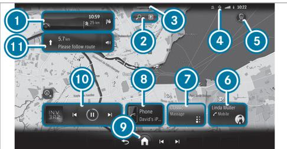

$\textcircled{8}$ 导航模块 (缩小视图)

$\textcircled{6}$ 输入目的地搜索驻车

$\textcircled{6}$ 调出控制中心：下拉滑条

$\textcircled{9}$ 状态栏

$\textcircled{6}$ 调出用户配置文件设定

$\textcircled{5}$ 建议

要求：建议已启用 第 276页)。

$\textcircled{6}$ 已启用的应用程序

$\textcircled{9}$ 电话

有关电话的要求：移动电话已连接至MBUX智能人机交互系统。

# $\textcircled{9}$

点按：显示所有应用程序 第274页)按住：调出带经典菜单的主屏幕

$\textcircled{1}$ 娱乐源(媒体、收音机)

$\textcircled{4}$ 路径监视器

例如，路径列表、车道建议、收费站、即将进行的驾驶操作3D 图像

零层级界面显示数字地图和用户特定应用程序。

以下用户特定应用程序显示在下部显示区域中：

·建议要求：建议已启用 第284页)。  
·当前应用程序例如，按摩模式例如，智能泊车  
·电话 $\textcircled{9}$   
·娱乐源 $\textcircled{4}$

·在线语音应用程序

下部显示区域可隐藏和显示 第274页)。

# 有关娱乐源的信息

您可在缩小视图中或在菜单中 （放大视图)操作应用程序 第274页)。

示例：

·控制媒体源，例如暂停/播放、下一首曲目、设定电台  
·从当前播放列表中选择曲目或从电台列表中选择电台  
·选择媒体源媒体源必须连接至MBUX智能人机交互系统。

# 有关电话的信息

如需使用这些功能，移动电话必须连接至MBUX智能人机交互系统。

关于建议的要求：建议中的呼叫和信息选项已启用。

示例：

·接听电话和拨打未接电话显示当前连接到MBUX智能人机交互系统

的移动电话的未接来电。，显示联系人和通话列表以及呼叫联系人·使用语音功能·建议联系人为已连接至MBUX智能人机交互系统的移动电话建议联系人。不会为关联至另一个用户配置文件的移动电话建议联系人。·给联系人写信息（建议）·通过设备管理器连接设备（建议）

# 有关已启用的应用程序信息

以下功能可用：

·操作按摩模式·操作畅心醒神（ENERGIZING 舒适）模式

# 有关导航辅助驾驶的信息

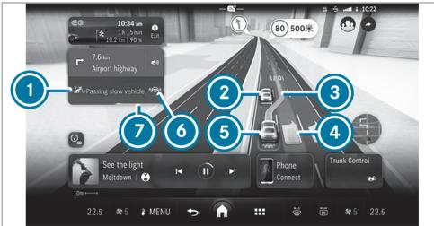

变道箭头和原因，例如"超过慢车"

障碍物(车辆)下方绿色括号标示障碍物蓝色线条显示智能变道路线(轨迹)

车辆要变道驶入的车道(带并线区域)

本车车辆图标，带绿色轮廓

A显示为绿色：导航辅助驾驶已开启启用/停用导航辅助驾驶进度条显示变道过程如果导航辅助驾驶可用，信息会显示在零层级界面中。

此功能启用时，智能变道辅助启用显示会出现。方向盘符号 $\textcircled{9}$ 呈绿色显示。

点击 $\textcircled{9}$ 可关闭导航辅助驾驶。 $\textcircled{9}$ 的颜色由 绿色变为灰色。智能变道辅助关闭显示出 现。

如果导航辅助驾驶开启，车辆图标 $\textcircled{6}$ 下方的方向盘符号也呈绿色显示。变道原因在$\textcircled{8}$ 中显示，例如超过慢车。变道过程由进度条 $\textcircled{6}$ 指示。

$\textcircled{ i}$ 如果导航辅助驾驶已关闭，方向盘符号AA会消失。

如果本车正在跟随前方车辆行驶，则这也会呈绿色显示。绿色括号出现在此车辆图标 $\textcircled{6}$ 下方。

对本车构成碰撞风险的车辆将显示为红色车辆图标。

一旦智能变道开始，车辆要变道驶入的车道即高亮显示 $\textcircled{9}$ 。智能变道过程由蓝色线条$\textcircled{6}$ 显示，直到车辆驶入所需的车道。如果由于交通状况等原因取消了智能变道，则蓝色线条 $\textcircled{6}$ 会消失，车道和并线区域 $\textcircled{6}$ 呈红色显示。

如果满足所有启用条件但此功能并未启用，则按 Set+可激活智能变道辅助会显示。可使用方向盘按钮SET+或RES启用此功能。

当车辆到达允许使用导航辅助驾驶的高速公路路段末端时，该功能将停用，显示停用原因，例如前方收费站，自动变道结束。此外，停用倒计时进度条出现。

如果正在使用导航系统中的相应设定，您也可在驾驶员显示屏上查看此信息。

有关导航辅助驾驶的更多信息，请参见 第217页)。

# 有关舒适性和车辆功能以及导航的建议

要求：建议中的舒适性、车辆和导航选项已启用。

·操作按摩模式例如，MBUX智能人机交互系统会在某一时间建议一个模式。  
·开启行李箱盖要求：车辆配备行李箱盖便捷关闭功能。  
·操作畅心醒神（ENERGIZING 舒适）模式  
·进行加热设定  
·启用/停用驻车定位系统（PARKTRONIC）驻车辅助功能  
·选择以往目的地和收藏夹中的目的地

# 在线语音应用程序建议

要求：建议中的在线语音服务选项已启用。建议的语音应用程序可根据您之前的语音输入在线使用。

示例：

·明天的天气怎么样？·播放信息。  
·启动 Geoquiz。  
·打开车库门。

# 识别到的例程启用建议

要求：建议中的学习&建议选项已启用。例程是指在特定条件下自动运行的操作。例程示例：每当您早上开军上班（条件）时，MBUX智能人机交互系统应设定某个按摩模式（操作）。例程还可执行不同的操作。

# 调出和操作零层级界面

# 调出零层级界面

如已开启车辆，则零层级界面和数字地图一起显示。导航启用。

从另一个应用程序：按下方向盘右边的按钮。

# 或者

点击

# 在缩小视图中操作应用程序 (示例)

媒体：如需播放上一首或下一首曲目，请点击或区。  
接听电话或拨打未接电话：点击联系人。建立连接后，通话功能可用。  
结束通话：再次点击联系人。  
回复信息：点击信息并通过MBUX读心语音助理口述信息。  
启动按摩模式：点击应用程序并启动按摩模式。  
选择以往目的地：点击应用程序并选择其中一个以往目的地。

从收藏夹中选择目的地：点击应用程序并选择目的地。

# 隐藏和显示带应用程序的显示区域

隐藏：下拉应用程序。  
显宗：上拉上方的栏。

或者

选择。

# 或者

按下右边方向盘上的按钮。

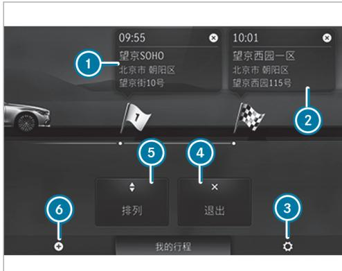  
导航模块 (放大视图)

示例：路径向导启用

$\textcircled{6}$ 中途停留地

$\textcircled{6}$ 目的地

$\textcircled{6}$ 调出设定

$\textcircled{6}$ 删除目的地或中途停留地

$\textcircled{6}$ 更改目的地顺序

$\textcircled{9}$ 将目的地添加到路径上

点击导航模块 第 271页)。  
在下方菜单栏中选择路径。

操作下部显示区域中的菜单（示例：已启用的按摩模式)

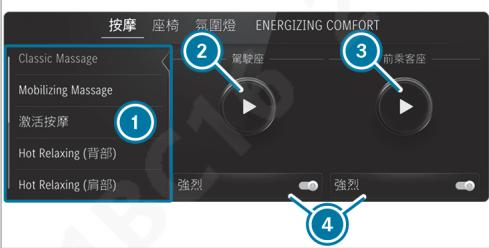

$\textcircled{6}$ 选择按摩模式

$\textcircled{6}$ 为驾驶员启动/停止某个模式

$\textcircled{6}$ 为前排乘客启动/停止某个模式

$\textcircled{6}$ 设定驾驶员或前排乘客座椅按摩强度

点击应用程序。  
显示应用程序的放大视图。

关闭菜单：选择。

# 开启和关闭某个建议的上下文菜单

按住建议。  
上下文菜单打开并显示例如不再建议选项。  
关闭：向下滑动。

# 从显示区域移除建议

? 向上滑动建议。

# 显示所有应用程序

点按。  
显示可用应用程序。  
隐藏应用程序：再次点按。

在零层级界面和带经典菜单的主屏幕之间切换

按住。  
显示带经典菜单的主屏幕。  
返回至零层级界面：按住。

# 主屏幕概述

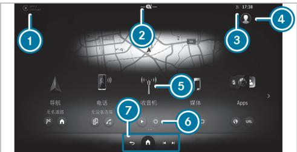

状态栏

$\textcircled{6}$ 调出控制中心：下拉滑条

$\textcircled{6}$ 状态栏中的显示

$\textcircled{6}$ 调出用户配置文件设定和切换用户

$\textcircled{6}$ 调出应用程序

$\textcircled{5}$ 快速访问应用程序

$\textcircled{6}$ 全局菜单

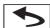

调出上一个菜单

按住：在主屏幕和零层级界面之间

切换

上一首曲目或上一个收音机电台下一首曲目或下一个收音机电台

$\textcircled{1}$ 在电话通话过程中，通话时间显示在全局菜单 $\textcircled{6}$ 中。

或者，按住方向盘右侧的按钮[在主屏幕和零层级界面之间切换。

下拉栏目 $\textcircled{6}$ 时，控制中心出现。

在控制中心可调出以下功能：

·通知中心·车辆快速访问

# 操作MBUX智能人机交互系统

# 使用触摸式控制键

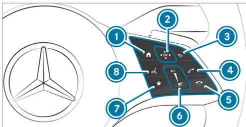

$\textcircled{8}$ 显示主屏幕触摸式控制键

沿箭头方向滑动（导航）OK按下（确认）  
$\textcircled{6}$ ? 返回至之前的显示  
$\textcircled{6}$ 拨打电话或接听来电  
$\textcircled{6}$ 拒接来电或结束通话  
$\textcircled{5}$ 增大音量：向上滑动减小音量：向下滑动

4 关闭音响：按下$\textcircled{4}$ ★ 调出电话收藏夹$\textcircled{9}$ 启动MBUX读心语音助理例如，您可通过触摸式控制键 $\textcircled{6}$ 的触摸感应式表面使用单指滑动在菜单和列表中操作：

输入字符：使用键盘选择字符并按下触摸式控制键 $\textcircled{6}$ 。  
选择菜单项：滚读列表并按下触摸式控制键 $\textcircled{6}$ 。  
移动数字地图：朝任意方向滑动。

# 使用触摸屏

中央显示屏下方的控制面板上有以下按钮：

指纹传感器开启或关闭MBUX智能人机交互系统开启或关闭声音调节音量按下或 $\boxed { + }$ 在按钮上方滑动

选择菜单项或条目：点击图标或条目。增大地图比例尺：使用一根手指快速点击两次。  
缩小地图比例尺：使用两根手指点击。使用键盘输入字符：点击按钮。  
在菜单中操作：向上、向下、向左或向右滑动。  
使用手写识别输入字符：使用一根手指在触摸屏上书写字符。  
放大和缩小地图：朝相反或相向的方向移动两根手指。  
增大或缩小网站部分尺寸：朝相反或相向的方向移动两根手指。  
转动数字地图：使用两根手指沿逆时针或顺时针方向转动。  
移动数字地图：触摸触摸屏并朝任意方向移动手指。  
将目的地保存至数字地图：触摸触摸屏并按住，直至显示信息。  
在刻度盘上设定音量：触摸触摸屏并向左或向右滑动手指。  
在应用程序中调出全局菜单：触摸触摸屏并按住，直至选项菜单出现。

# MBUX读心语音助理功能

# ■警告信息系统和通讯设备造成的干扰凤险

如果在行车时操作集成在车内的信息系统和通讯设备，则可能会分散您对交通状况的注意力。这可能会导致您失去对车辆的控制。

仅可在交通状况允许的情况下操作该设备。  
如果对此不确定，在注意道路及交通状况的情况下停车，并在车辆处于静止状态时操作该设备。

为了您的安全，请在操作移动通信设备，尤其是您的语音控制系统时，务必遵守以下要点：

·遵守行驶时所在国家和地区的法规要求。·如果您在紧急情况下使用语音控制系统，您的声音可能改变且您的电话呼叫（例如紧急呼叫）可能因此延迟。·行车前，请熟悉您的语音控制系统功能。

使用MBUX读心语音助理时，可通过语音输入操作车辆功能和MBUX智能人机交互系统的多个区域。MBUX读心语音助理在车辆启动后大约半分钟可以操作，并且可以在所有座椅上操作。有关语音指令的更多信息和示例，可从电子使用说明书（用户手册）中找到。

您可根据车辆配置使用MBUX读心语音助理操作以下功能：

·电话  
）文本信息和电子邮件  
导航收音机和媒体  
车辆功能  
·在线功能

仅当启用在线语音控制系统后，您才可使用语音控制系统的所有功能。

# 进行对话

# 开始对话

说出“你好，奔驰”以启用MBUX读心语音助理。必须在MBUX智能人机交互系统上开启语音启用。

# 或者

按下多功能方向盘上的按钮「。

蓝色波浪出现在MBUX智能人机交互系统中。可开始对话。

与 MBUX读心语音助理进行对话时，您可将□语化的完整句子用作语音指令。语音启用也可直接与语音指令合并，例如“你好，奔驰，我可以开多快？”

# 调出帮助

有关MBUX读心语音助理的信息：说出“你好，奔驰，你能做什么？”

# 操作功能(示例)

操作导航系统：沿途有服务区吗？操作电话：打给我父亲。将系统语言改为英语（快捷指令）：Change language to English。

操作收音机：“显示收音机电台列表。”

操作媒体：“开启随机播放。”

操作车辆功能：“将座椅加热切换至2档。”

操作在线功能：“悉尼现在几点？”

询问有关车辆的问题：“我有侧面盲点辅助吗？”

# 智能感应助理概述

A 警告来自摄像头的激光束造成的伤害凤险

本产品使用1级激光系统。如果外壳打开或损坏，则激光辐射可能会损坏您的视网膜。

切勿打开外壳。  
请务必到具有资质的专业服务中心进行保养和维修工作。

本产品符合 FDA 21 CFR1040.10 和1040.11的要求，自2007年6月24日起的FDA激光公告第50条的变更除外。

$\textcircled{1}$ 摄像头记录用于应用程序的图像数据，例如，身体、头部和手部检测。摄像头将图像数据直接转换为元数据。在此过程中不会保存图像数据。数据仅在车辆中处理，而不会从车辆传输。

$\textcircled{ i}$ 当您启动车辆时，智能感应助理自动启用。您可开启或关闭智能感应助理。

智能感应助理使用3D 激光摄像头探测前排是否有乘员。该助理根据语境或在车辆乘员的明确要求下解释手、头和身体的自然运动。因此，该助理可以自动触发车辆内部功能并针对情况进行适当的协助。

该助理识别驾驶员和前排乘客的交互。

在以下情况下，应用程序可用：

·智能感应助理启用。  
·MBUX智能人机交互系统已启用。

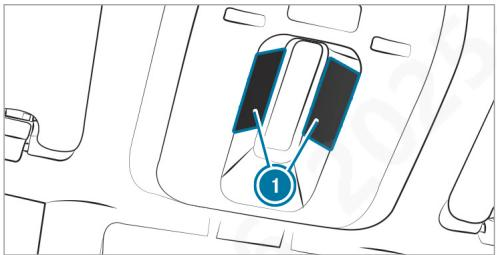

摄像头 $\textcircled{8}$ 位于上方控制面板中。

该助理以三个交互级别支持车辆和资讯娱乐功能：

·智能（INTELLIGENT）该助理自动识别车辆乘员并启用功能。感应（REACTIVE）该助理识别车辆乘员的自然肢体语言并根据具体状况自动执行功能。非接触（CONTACTLESS）车辆乘员使用手部动作主动请求某项功能。

该助理提供以下功能：

·安全（SAFETY）该辅助系统为车辆乘员使用约束系统提供支持。  
·舒适（COMFORT）该助理通过自动执行车内功能并支持与车辆的自然交互来增强舒适性。  
·资讯娱乐（INFOTAINMENT）该助理可方便操作资讯娱乐功能。

# 系统限制、显示信息和纠正说明

例如，出错信息显示在中央显示屏上。在以下情况下，系统可能会受影响或不起作用：

·上方控制面板中的摄像头可能由于操作条件而变热。因此，摄像头可能暂时关闭，尤其是在长时间操作和车外高温时。请勿触摸或遮盖摄像头。等待，直至摄像头冷却并再次可用。出现智能感应助理暂时不可用重新可用时将通知您信息。

当摄像头再次可用时，您将收到一条信息。  
·摄像头镜头被遮盖、脏污、起雾或刮花。在清洁摄像头护盖之前，等待直至摄像头冷却。出现暂时不可用,参见使用说明书（用户手册）信息。用干燥或潮湿的棉布清洁摄像头护盖的外部。切勿使用超细纤维布。清洁时请勿拆下护盖。车辆乘员体型非常大。穿戴的服饰（手套、帽子、围巾、服饰颜色）或人员携带的物品（例如，大表盘手表）会影响摄像头视野。或摄像头的探测范围受限。无信息出现。保持摄像头视野清晰。摄像头探测区域内的物品会限制摄像头的视野。例如，请确保内部后视镜上没有悬挂物品。  
·智能感应助理故障。出现智能感应助理不可用请联络梅赛德斯-奔驰授权经销商信息。请咨询梅赛德斯-奔驰授权服务中心。

# 开启或关闭阅读灯和搜索灯

# 要求：

# ·对于阅读灯：

驾驶员和前排乘客在内部后视镜下方进行手部动作。

# ·对于搜索灯：

该功能在外界光线昏暗时在车内可用。  
前排乘客座椅未被占用或有儿童乘坐在儿童约束系统上。  
由驾驶员在前排乘客座椅上方的互动区域内执行手部动作。

# 开启和关闭阅读灯

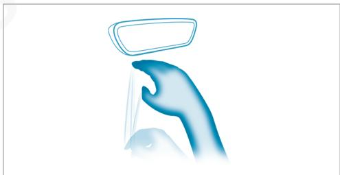

执行驾驶员和前排乘客的阅读灯操作

在内部后视镜下方上下移动手。  
阅读灯开启或关闭。

# 开启和关闭搜索灯

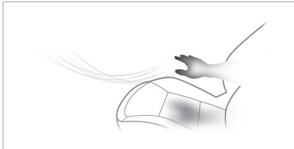

用于启用搜索灯的互动区域

开启：将手伸过前排乘客座椅。  
驾驶员搜索灯自动开启。  
关闭：将手从前排乘客座椅上收回。  
搜索灯再次关闭。

# 车外后视镜自动预选［舒适（COMFORT）/感应]

到目前为止，如需设定车外后视镜，必须使用驾驶员侧车门上的预选按钮选定所需后视镜。

使用智能感应助理，可通过向左或向右自然移动头部自动预选要设定的后视镜。当手触摸用于调节车外后视镜的按钮时，预选后视镜侧的按钮下方的LED亮起。

使用按钮设定活动的车外后视镜的位置。

$\textcircled{1}$ 仍可使用按钮进行车外后视镜预选。有关调节车外后视镜的更多信息第138页)。

$\textcircled{ i}$ 驾驶员摄像头也会用于此应用程序。

$\textcircled{1}$ 如果智能感应助理不可用，则不支持此功能。

# 驾驶员摄像头功能

根据配置的不同，驾驶员摄像头位于驾驶员显示屏中或喷嘴带中。

根据配置的不同，驾驶员摄像头为单目或立体摄像头。

驾驶员摄像头能探测以下特性：

·头部位置  
·视线方向  
·眼睑闭合特征

·驾驶员脸部

$\textcircled{1}$ 每次使用钥匙开启车辆时，驾驶员摄像头都会自动启用。驾驶员摄像头的当前状态显示在中央显示屏的状态栏中。

$\textcircled{1}$ 驾驶员摄像头记录诸如注意力辅助系统（ATTENTIONASSIST）和人脸识别等应用程序的图像数据。摄像头将图像数据直接转换为元数据。在此过程中不会保存图像数据。数据仅在车辆中处理，而不会从车辆传输。

使用前必须设置驾驶员摄像头以进行人脸识别 第284页)。

# 系统限制

在以下情况下，系统可能会受影响或不起作用：

·摄像头镜头被遮盖或脏污、起雾或刮花。  
·驾驶员的脸部和/或眼睛被挡住。  
·驾驶员戴着阻挡红外线的眼镜。

# 显示信息

在以下情况下可能出现显示信息：

·驾驶员摄像头没有工作时。驾驶员摄像头故障。出现驾驶员摄像头停止运作 参见使用说明书（用户手册）信息。驾驶员摄像头的视野因方向盘和座椅当前位置被遮档时。出现更改方向盘位置/座椅位置 直至可以看见屏幕上边缘上的6个点信息。  
）驾驶员摄像头视野缩小或受限时。出现驾驶员摄像头观察范围暂时受阻受影响功能：参见使用说明书 (用户手册)信息。例如，在以下情况下可能会出现此信息：摄像头视野被遮挡，例如被佩戴的围巾或帽子遮住。驾驶员戴着阻挡红外线的眼镜。如果头发部分遮挡住眼睛，例如被长刘海遮住。在强烈阳光直射情况下。如果明暗对比过强，则驾驶员摄像头无法探测到驾驶员眼睛。  
当一只手或双手放在方向盘顶部时（12点钟位置）。

# 护理说明

请遵守有关显示屏的车内护理的说明第327页)。

# 开启或关闭驾驶员摄像头

MBUX智能人机交互系统：

设定→系统智能辅助每次车辆开启时，驾驶员摄像头都会自动启用。

选择开启或关闭。

当驾驶员摄像头关闭时或驾驶员摄像头观察范围暂时受阻受影响功能：参见使用说明书（用户手册）信息出现时，以下功能不可用或受限：

·3D 驾驶员显示屏（仅配备立体摄像头）第253页)

·注意力辅助系统（ATTENTION ASSIST）微睡眠和分心检测功能 第201页)

·人脸识别此功能用作传感器输入，用于身份验证以及解锁用户配置文件和受保护的应用程序第284页)。

·后视镜预选此功能允许通过向左或向右自然移动头部自动预选要调节的车外后视镜第138页)。

# 有关用户、建议和收藏夹的信息

A 警告 调出驾驶员配置文件后在调节驾驶员座椅过程中被夹住的风险

选择用户配置文件可能导致驾驶员座椅被调节至配置文件下保存的位置。您或其他车辆乘员可能在此过程中受伤。

在使用MBUX智能人机交互系统调节驾驶员座椅位置的过程中，确保没有人员或身体部位处于座椅活动范围内。

如果有人员夹伤的风险，立即通过以下方式停止调节过程：

$\blacktriangleright$ a）轻按中央显示屏上的警告信息。  
或者b)按下记忆功能的位置按钮或驾驶员侧车门上的座椅调节开关。调节过程停止。

驾驶员座椅配备访问约束系统。

如果驾驶员侧车门开启，则在调出驾驶员配置文件后，驾驶员座椅不会进行设定。

# 用户配置文件和用户特定内容

车辆所有者的先决条件：

·您拥有 Mercedes me 用户账号。  
·您需要有一个 Mercedes me 个人密码（PIN）。  
·您已同意使用条款。  
·车辆已连接至Mercedes me 用户账号。

$\textcircled{ i}$ 如果缺少所列的其中一个先决条件，或没有选择用户配置文件，则下一节所述数据将作为标准设定保存在车辆中。所有车辆用户均可更改标准设定。

各用户的个人设定存储在用户配置文件中。如果车辆由多人使用，则各个使用者可以更改自己的配置文件设定，无需更改其他使用者的设定。

$\textcircled{ i}$ 某些设定适用于整个车辆，并显示在所有用户配置文件中，例如环境氛围照明系统和当前导航设定。这些设定最初属于驾驶员，但其他乘员也可在其用户配置文件中进行更改。

您可使用设置助手或使用用户配置文件中的设定将车内的用户配置文件个性化。Mercedes me个人密码（PIN）和配置文件照片等某些设置是在Mercedes me App 中进行的。

$\textcircled{ i}$ 如果在行车时下载用户配置文件，则不会使用设置助手设定用户配置文件。

用户特定的内容和带个人数据的应用程序受到不同安全级别的保护。根据车辆配置的不同，可将Mercedes me个人密码（PIN）和生物特征识别传感器用于访问受保护的内容。

根据车辆配置的不同，可将Mercedes me 个人密码（PIN）和生物特征识别传感器用于访问受保护的内容。

$\textcircled{1}$ 安全级别由MBUX智能人机交互系统设定，并通过所有传感器输入的组合来计算。某些安全级别无法关闭。

$\textcircled{1}$ 例如，当用户配置文件启用时，可调节以下的个人化舒适系统或加载其设定：

·座椅  
·环境氛围照明系统车外后视镜  
·卷帘  
·智能气候控制设定

如果您在驾驶时启用用户配置文件，则驾驶员座椅位置不会进行调节。

根据车辆配置的不同，您可作为用户保存以下设定，例如：

·驾驶员座椅、方向盘和后视镜设定  
·智能气候控制  
·环境氛围照明系统

·收音机（包括电台列表)·建议

此功能按需提供 第 29 页)：如果车钥匙与用户配置文件关联，则当使用无钥匙启动（KEYLESS-GO）解锁车辆或接近车辆时用户配置文件会预启用。在此过程中，会调节车灯、后视镜和座椅。要使用用户配置文件或应用程序，车钥匙还用作传感器输入进行授权。

# 建议

车辆会学习驾驶员的习惯。然后会提出有关导航目的地、电话号码和音乐偏好的建议。要求是选择用户，您同意记录数据并收集足够的数据。

# 设定用户配置文件

# 要求：

·车辆处于静止状态。

# MBUX智能人机交互系统：

选择用户

# 添加用户

? 选择 $\textcircled{+}$ 添加用户。二维码加载。使用移动设备上的 Mercedes me App 或任何二维码扫描仪扫描显示的二维码。如果您的移动设备上尚未安装Mercedes meApp，则您将被引导至移动设备的商店。按照应用程序中的指示。车辆已连接至您的Mercedesme用户账号。这将自动在车上创建您的用户配置文件。如果仅有您的用户配置文件可用，则将自动加载。如果不止一个用户配置文件可用，则您将被引导至用户选择。当车辆处于静止状态时，设置助手将在用  
户选择后自动启用。

# 保护用户特定的内容和应用程序

如果添加新用户，则用户配置文件的访问保护已启用。根据车辆配置的不同，Mercedesme 个人密码（PIN）、生物特征识别传感器可用于访问。车载生物特征识别传感器必须进行自学习。此后，身份验证过程将考虑所有自学习和可用的传感器。

例如以下用户特定的内容和应用程序受到保护：

·用户选择和用户配置文件设定  
·生物特征识别传感器生物特征识别传感器的自学习有关自学习和编辑生物特征识别数据，请参见以下部分。  
·建议最可能的导航目的地、媒体源、收音机电台、联系人和信息的数据和测定。  
·畅心阁（ENERGIZING COACH）记录的健康数据及其评估。  
·驻车服务付款交易。  
·Mercedes me Store购买服务。  
·付费车辆功能的系统启用

在以下情况下，将提示您使用传感器或Mercedes me个人密码（PIN）进行授权或重新授权：

·选择受保护的用户配置文件时  
·调出需要特殊保护的功能时，生物特征识别传感器提供的信息不足或自相矛盾时MBUX智能人机交互系统不再信任某个传感器时安全带锁扣和车门在同一座位上打开且需要特殊保护的功能被调出时  
$\textcircled{ i}$ 仅当车门关闭或安全带锁扣重新扣好时，才能在驾驶员座椅上进行人脸识别以重新授权。  
$\blacktriangleright$ 开启或关闭内容保护。  
  
$\blacktriangleright$ 开启或关闭访问保护。  
$\textcircled{1}$ 当访问保护关闭时，可从车辆任意座椅访问和更改您的用户配置文件。  
$\textcircled{1}$ 根据车辆特定情况开启或关闭访问保护。  
$\textcircled{ i}$ 请注意，身份验证对于某些功能必不可少，因此无法完全关闭。

# 设定、编辑和删除生物特征识别

生物特征数据模型保存在车内传感器中。如果已经自学习识别功能，则此传感器将用作MBUX智能人机交互系统上身份验证的重要因素。

选择内容保护。选择面部识别或指纹识别。  
$\textcircled{1}$ 如有必要，请在 MBUX智能人机交互系统上进行身份验证。

# 设定人脸识别

关闭驾驶员侧车门或系驾驶员安全带。请遵守系统的说明。  
人脸扫描。驾驶员显示屏或中央显示屏上的信息会显示面部识别是否成功。您可以使用人脸扫描来解锁用户配置文件和受保护的应用程序。

# 设定指纹识别

在触摸屏下方的指纹传感器上多次放置和抬起您的手指 第269页)。  
请遵守系统的说明。  
指纹扫描。如果扫描过程成功，则中央显

示屏上会显示一条信息。您可以使用指纹来解锁用户配置文件和受保护的应用程序。

# 删除生物特征数据

点击面部识别或指纹识别后面的。  
选择是。

# 调出设置助手

选择用户设置。  
$\blacktriangleright$ 选择设定助手。按照设置助手的说明进行操作。  
$\textcircled{1}$ 如果还没有存储限行的车辆登记号，则可使用设置助手在中央显示屏上输入。也可以在导航系统中完成输入。

# 删除用户配置文件

选择用户设置。  
$\blacktriangleright$ 选择移除。  
$\blacktriangleright$ 选择移除用户设置。  
$\textcircled{1}$ 您的Mercedes me 用户帐户和您的个人数据会保留在Mercedes me 生态系统内。

# 将用户配置文件复位为出厂设置

选择用户设置。  
选择复位。  
选择是。

$\textcircled{1}$ 这会将用户配置文件的内容复位为出厂设置，但不会复位车辆。

# 选择用户

$\textcircled{1}$ 当调出驾驶员配置文件时，可设定驾驶员座椅和方向盘。

您可使用以下操作取消设定过程：

·在中央显示屏上按下点击此处以取消信息。  
·按下驾驶员侧车门上的其中一个座椅操作按钮。

# 选择选择用户。

选择用户。

当要求这样做时，请使用Mercedes me 个人密码（PIN）或学习到的生物特征进行身份验证。

用户配置文件加载并启用。

$\textcircled{1}$ 如果您选择继续(不选择用户)，则不会加载用户配置文件的特定设置。

# 配置和删除建议

选择。 选择设定。 20选择系统。  
选择建议。  
启用或停用学习&建议。  
如果用户配置文件处于启用状态且该功能开启，则可为启用的应用程序获取个性化建议。

选择

单独开启或关闭选项。  
如果选项已开启且已收集到足够数据，将在零层级界面上向您提供基于您的用户行为的个性化建议。例如访问过的导航目的地、拨打过的电话号码以及根据您的音乐偏好提供的建议。

# 删除收集的建议：选择3。

选择是。  
建议已重设。

# 系统设定

# 系统设定菜单概述

在系统设定菜单中，您可在以下菜单和控制元件中进行设定：

·显示屏 显示亮度 开启/关闭平视显示系统 前排乘客显示屏饰图（配备MBUX超 联屏的车辆)

·控制元件

键盘语言和手写识别触摸式控制键灵敏度触摸屏触觉操作

·MBUX读心语音助理·智能感应助理

·音响

娱乐  
导航和交通通告  
电话  
·数据保护  
·连接Wi-Fi，蓝牙?  
·时间和日期  
·语言  
·距离单位  
系统个人密码（PIN）  
·建议  
·软件更新  
·系统重置

# 软件更新概述

为保障MBU×智能人机交互系统的数据安全，可能有必要进行重要软件更新。请安装这些更新，否则无法确保MBUX智能人机交互系统的安全。

当软件更新可用时，MBUX智能人机交互系统显示相应的信息。

如果自动在线更新选项启用，则将自动下载软件更新。如果该选项停用，则将每次通知您新的软件更新。这些软件更新只能在有限的时间内下载。

执行软件更新：

·您可使用通讯模块开始软件更新。  
·您可通过WLAN 热点开始软件更新。  
·您可从外部媒体开始地图更新。  
$\textcircled{ i}$ 无法通过使用TKIP 加密的外部Wi-Fi热点进行在线软件更新。  
$\textcircled{ i}$ 如需通过通讯模块完成软件更新，则车辆必须与互联网和Mercedesme用户账号连接。  
$\textcircled{ i}$ 如需通过WLAN完成软件更新，则车辆必须连接至外部WLAN热点。

软件更新包含3个步骤：

·下载或复制用于安装的所需数据·安装已下载软件更新·启用已下载的软件更新

$\textcircled{1}$ 软件更新完成后，可能需要重新启动MBUX智能人机交互系统。  
$\textcircled{1}$ 下载某些软件更新期间，MBUX智能人机交互系统无法操作并且车辆的功能可能受限。

$\textcircled{1}$ 某些软件更新需要安全的车辆状态才能完成安装。只有在车辆关闭的情况下，才能在安全停驻的车辆中执行这些操作。

对于需要安全车辆状态的软件更新：到达最后的安装步骤时，车辆关闭后，中央显示屏上会显示一条消息。按照中央显示屏上的分步说明完成安装。

有的软件更新只能在车辆安全停驻、车内无人且车辆锁止时才能安装。

# 驾驶员显示屏和中央显示屏的可用性

软件更新安装期间，无法使用车辆、中央显示屏和驾驶员显示屏。安装运行时，您可能收到以下显示信息：

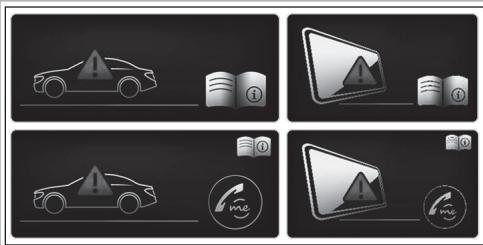

$\textcircled{1}$ 显示信息不会在每次安装软件更新时都出现。

在罕见情况下，安装期间可能出错。MBUX智能人机交互系统自动尝试恢复之前的版本。如果无法恢复之前的版本，则每次启动车辆时都会出现上述显示信息。

# 驾驶员显示屏故障：

例如，如果驾驶员显示屏无法工作或存在故障，则您可能无法识别与安全相关的系统功能限制或车速显示。这可能影响车辆的操作安全性。请尽快安全驻车并咨询具有资质的专业服务中心 第405页)。

有关软件更新的详细信息，请访问 https://me.secure.mercedes-benz.com

# 中央显示屏故障

如果中央显示屏发生故障或上述显示信息持续显示，则后视摄像头、驻车定位系统（PARKTRONIC）或智能气候控制等多个系统不再可用。请继续小心驾驶并尽快咨询具有资质的专业服务中心。

# 前排乘客显示屏故障（仅限配备MBU×超联屏的车辆)

如果前排乘客显示屏出现故障或永久出现显示信息，则无法再通过前排乘客显示屏使用功能和系统。请咨询具有资质的专业服务中心。

# 设定Wi-Fi热点

# 要求：

·MBUX智能人机交互系统和要连接的通讯设备上的Wi-Fi功能已启用。需连接的通讯设备支持所述连接方式中的至少1种。显示的连接类型因要连接的设备而异。MBUX智能人机交互系统和需连接的设备必须支持此功能。在MBUX智能人机交互系统和需连接的设备上选择连接类型。  
$\textcircled{ i}$ 某些功能需要首先在要连接的通讯设备上启用。更多详细信息，请参见制造商的操作手册。  
$\textcircled{1}$ 外接设备并非在所有国家和地区都能使用车辆数据套餐。

MBUX智能人机交互系统：

设定系统

# 网络和蓝牙

$\textcircled{1}$ 此功能的可用性因国家和地区而异。

选择无线网络。

控制器在右侧：Wi-Fi开启。

开启Wi-Fi功能后，您可以将MBUX 智能人机交互系统与外部热点连接，或将其作为外接设备的热点使用。

关闭Wi-Fi功能后，将无法建立热点连接。

$\textcircled{1}$ 根据车辆配置的不同，您可以通过Mercedesme商店获得娱乐组件。要使用其中包含的数据包，您必须通过Mercedesme App与移动电话网络供应商签订合约。该合约可随时终止，且不产生任何费用。如果没有该合约，则无法使用之前获得的娱乐组件中包含的服务。该选项的可用性因国家和地区而异。如果数据包选项不可用或可以升级，您可直接从移动电话网络供应商处付费购买数据流量。该选项的可用性因国家和地区而异。

$\textcircled{1}$ 外接设备并非在所有国家和地区都能使用车辆数据套餐。

# 将 MBUX智能人机交互系统用作Wi-Fi热点

选择 MBUX 热点。选择以下其中一个连接选项：

# 使用二维码连接

要求：用于扫描二维码的应用安装在要连接的设备上。

或者：要连接的设备配有集成式二维码扫描仪（请参见制造商操作手册）。

$\blacktriangleright$ 扫描显示的二维码。WLAN 连接已建立。

# 使用安全密钥进行连接

从需连接的设备上选择车辆。车辆与网络名称 MBUX XXXXX一同显示。  
将显示在中央显示屏上的安全密钥输入需连接的设备。  
确认输入。

# 生成新安全密钥

在 MBUX热点菜单中选择生成新安全密钥选项。

通过是确认提示。

生成一个新安全密钥。

使用新创建的安全密钥将建立连接。

$\textcircled{1}$ 当已生成新的安全密钥时，所有现有的Wi-Fi连接将断开。如果重新建立Wi-Fi连接，请输入新安全密钥。

# 选择WLAN加密方式

选择无线网络加密。  
选择WPA2或WAPI。

将移动通信设备用作Wi-Fi热点（网络共享）

要求：启用移动电话上的Wi-Fi功能和通过Wi-Fi的互联网访问（请参见制造商的操作手册）。

$\textcircled{1}$ 此功能因国家和地区而异。

在网络和蓝牙菜单中选择管理网络访问选项。选择搜索网络。选择网络。登录至Wi-Fi 网络。

或者

选择带Wi-Fi符号的移动电话。

$\textcircled{1}$ 对于通过TKIP 加密的外部Wi-Fi热点，无法通过外部Wi-Fi热点进行在线软件更新。

# 系统语言

# 有关系统语言的注意事项

您可使用此功能确定菜单和导航通告的语言。选定的语言将影响可输入的字符。导航通告并非支持所有语言。如果某种语言不可用，则导航通告将使用英语。

# 设定语言

MBUX智能人机交互系统：

设定系统语言

# 设定系统语言

显示可用系统语言列表。

选择语言。  
系统语言切换至所选语言。

# 复位MBUX智能人机交互系统（复位功能）

警告 因中央显示屏功能故障导致的事故风险

MBUX智能人机交互系统复位时，后视摄像头等功能不可用。

仅在车辆处于静止状态时才可复位、MBUX智能人机交互系统。

# 要求：

·车辆启动。

·某些设定仅可在车辆处于静止状态时重置。

# MBUX智能人机交互系统：

> 设定系统复位重置系统时，个人数据和设定将被删除，例如：

·已连接的设备·个人用户配置文件·生物特征数据

$\textcircled{1}$ 由驾驶员辅助系统使用并保存在MBUX智能人机交互系统中的数据将被删除。

选择复位。  
出现询问：是否确实要重置系统。  
选择是。  
MBUX智能人机交互系统复位至出厂设置。系统重置后，MBUX智能人机交互系统会重新启动。

考虑到数据保护以及个人驾驶和驾驶安全系统的功能，将车辆出售或转让给第三方之前，或者使用租赁车辆之后，有必要进行一次完整的系统重置。确保系统重置后所有相关数据都已删除。

# 插电式混合动力设定

# 配置充电设定

MBUX智能人机交互系统：

混合动力充电

# 设定充电程序

选择住宅、公司或标准。

# 在 MMS 中打开插座盖板

按下开启插座盖板可开启插座盖板。可使用取消充电中断充电过程。充电过程结束，充电电缆解锁。

$\textcircled{1}$ 有关交流充电的更多说明：第185页)。

$\textcircled{1}$ 有关直流充电的更多说明：第188页)。

# 解锁充电电缆(模式3或4)

此功能启用时，充电电缆将在达到最大充电电量时解锁。

选择住宅或公司。  
启用或停用解锁充电电缆。

# 启用或停用基于位置的充电

选择在家充电或工作场所充电。  
启用或停用基于位置选择。

此功能启用时，车辆的当前位置保存为其中一个所选选项。当再次到达该地址时，会出现一条简短的提示，询问是否要选择相应的充电程序。

# 启用或停用快速充电(直流充电)

? 启用或停用快速充电功能。

快速充电功能将充电站的最大可能充电功率提高到60千瓦，以便更快地为车辆高电压蓄电池充电。充电过程完成后，为保护高电压蓄电池，会再次将“标准"充电程序中的充电功率限制为20千瓦。

# 设定出发时间

设定的出发时间用于车辆的预进入气候控制，并估算选定时间的大致充电电量和可达里程。当快速充电停用时，充电过程针对下二个出发时间做出最佳时间安排（立即充电最多30%的充电电量，之后可能会暂停充电）。当快速充电启用时，充电过程立即开始，与下一次的出发时间无关。

选择下次出发时间。

可选择以下充电时间：

·单次充电时间·周循环设定

# 设定单次出发时间

选择添加新时间并设定时间。

# 或者

$\blacktriangleright$ 选择》并调整现有的出发时间。

# 设定重复日期

选择添加新时间并设定时间。  
标记将应用出发时间的相关星期数并使用OK确认。

# 或者

1 选择并编辑现有重复日期。

# 设定充电过程中的暂停时段（使用交流电充电时）

充电过程中最多可以设置4个暂停时段，在这期间，即使车辆连接到充电站，也不进行充电。

选择充电暂停时段。  
选择添加新时间，然后设定并保存暂停时段的开始和结束时间。  
启用或停用已设定的充电暂停时段。

设定的充电暂停时段可使用按钮编辑或使用按钮删除。

# 设定最大充电电量

选择最大电量。  
设定所需百分比。  
高电压蓄电池充电至设为最大值的百分比。

$\textcircled{1}$ 可以 $1 0 \%$ 为变量设定百分比。$\textcircled{1}$ 一旦达到最大充电电量，中央显示屏上将显示一则通知：充电完成，可继续行程。

# MBUX智能人机交互系统能量流显示概览

能量流显示高亮显示混合动力系统的启用部件。各个部件之间的能量流以颜色显示。

显示的部件为：

·高电压蓄电池充电电量   
·内燃机   
·能量流   
·高电压蓄电池

能量流根据工作状态以不同颜色显示：

·白色：恒定能量流·红色：高能量流（助力效应）

·绿色：再生、电动模式和高电压蓄电池充电的情况下保持低排放能量流

# 调出能量流显示

MBUX智能人机交互系统：

# →信息

# 选择能量流。

将显示车辆中的能量流。

除能量流之外，还将显示混合动力系统状态信息和高电压蓄电池的当前充电电量。

# 导航和交通

$\textcircled{ i}$ 路能和服务的设计的1 提供程中 察

# 导航说明

A警告由于注意力分散、不准确表述或误读显示信息而导致的事故和伤害风险

增强现实显示屏的摄像头图像不适合作为驾驶向导。

时刻注意实际交通情况。  
避免长时间关注摄像头图像。

A 警告附加信息位置不精确造成的事故和伤害风险

来自增强现实（Augmented Reality）显示的附加信息可能不准确，不能代替对实际驾驶情况的观察和评估。

在所有驾驶操作过程中，时刻注意实际交通情况。

# 开启导航

MBUX智能人机交互系统：

或者，按下右边方向盘上的按钮第276页)。显示带数字地图的零层级界面。

# 导航概述

# 数字地图

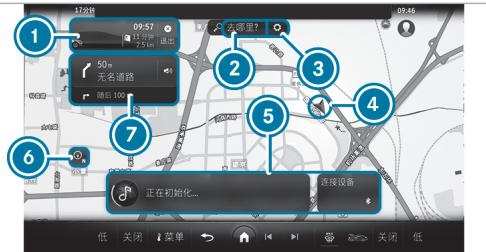

$\textcircled{6}$ 导航模块 (缩小视图)

路径向导启用：

导航模块在缩小视图中显示与路径相关的信息，例如目的地到达时间、交通延误或车流量信息

结束当前路径向导 在带路径的放大视图中轻敲开启导航模块

$\textcircled{6}$ 输入目的地$\textcircled{6}$ 更改导航设定

$\textcircled{9}$ 设定地图朝向和地图类型$\textcircled{6}$ 当前车辆位置(车辆图标或箭头)

$\textcircled{5}$ 带娱乐源、电话、当前应用程序和建议的显示区域

$\textcircled{4}$ 导航窗口在路径向导启用时以缩小视图显示下一个驾驶操作，或在接近驾驶操作时以放大视图详细显示即将进行的驾驶操作，例如地图部分、3D图像或车道建议当路径向导启用时，轻敲导航窗口可打开路径监视器，其中显示整个路径的信息，例如即将进行的驾驶操作、目的地、高速公路出口或带兴趣点的休息区

关闭导航通告开启导航通告按下 $\textcircled{9}$ 数次，按此顺序切换地图朝向：

·2D 和北方朝上·2D 和行驶方向·3D 和行驶方向·带完整路径的地图

$\textcircled{ i}$ 如果地图被移动，地图会在3D行驶方向和 2D 朝北方向之间切换。

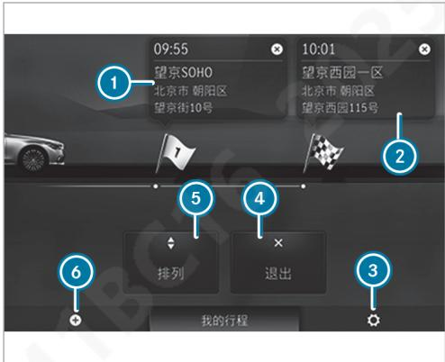  
导航模块 (放大视图)

示例：路径向导启用$\textcircled{8}$ 中途停留地$\textcircled{6}$ 目的地$\textcircled{6}$ 调出设定

$\textcircled{9}$ 删除目的地或中途停留地$\textcircled{6}$ 更改目的地顺序$\textcircled{9}$ 将目的地添加到路径上

# 车道导航概述

此功能在以下情况下可用：

·此功能在您的车辆上可用。  
·此功能开启 第 298页)。  
·有互联网连接。  
·您正在高速公路、匝道或城市高速公路上行驶，且这些路段允许使用该功能。

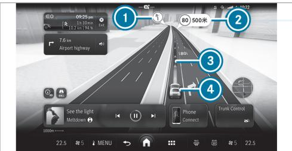

示例显示

$\textcircled{6}$ 前方，靠左行驶$\textcircled{6}$ 限速，例如前方500米限速

80 公里/小时$\textcircled{6}$ 带车流量信息的路径绿色：交通顺畅黄色：车流密集橙色：车流缓慢红色：拥堵路段$\textcircled{6}$ 车辆图标（本车）

与普通路径向导相比，车道导航可在数字地图上提供额外的信息：

·当前车辆位置行驶过程中，车辆图标精准显示在所选车道上  
·路径向导显示车道标线、防撞护栏和推荐的车道显示路径和前方交通情况显示限速及其起点 $\textcircled{6}$ 转向箭头信息、交通事件、车流量信息 $\textcircled{8}$ （例如交通拥堵）中途停留地和目的地显示

·地图显示选项

3D 显示街道环境、建筑视图和选定地标，可选择日景或夜景。

·周围环境中的物体显示车辆、摩托车、人员等信息

# 电子不停车收费系统（ETC）概述

电子不停车收费系统可为高速公路通行收费提供便利。

通过专用短程通讯技术在汽车和收费站之间进行数据传输。

ETC 控制单元位于车辆手套箱内。

如需启用控制单元，需要执行以下步骤：

·您使用移动电话登录到ETC运营商App或者微信小程序。您可通过扫描 App 或者微信小程序以下两个二维码：

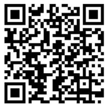  
E高速APP

  
E高速微信小程序

·根据 App 或者微信小程序的提示，输入您的用户数据：-行驶证记录的有关车辆信息－用户身份信息（ID）－用户银行卡／第三方支付账户

·运营商随后将数据包发送给控制单元。

·您可通过蓝牙?将移动电话连接至控制单元。点击App 或者微信小程序中 ETC 激活项，启动车辆电源，打开手套箱，长按手套箱内ETC控制单元蓝牙按键3秒，待蓝穿灯闪烁，加密数据的传输完成。

·该过程完成后，支付系统启用。

# 目的地输入

# 要求

# ·对于在线搜索：

有互联网连接。  
Mercedes me 互联可用。  
您已在 Mercedes me App 上创建用户账号。  
车辆已连接至用户账号且您接受使用条款。

$\textcircled{ i}$ 如果在线搜索不可用，则使用数字地图数据执行搜索。

  
MBUX智能人机交互系统：

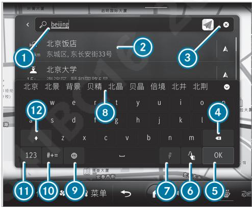

示例：输入兴趣点或地址$\textcircled{8}$ 带当前条目的输入行$\textcircled{6}$ 搜索结果删除记录

$\textcircled{6}$ 删除最后输入的字符$\textcircled{6}$ 隐藏键盘$\textcircled{5}$ 切换至手写识别$\textcircled{4}$ 启动 MBUX读心语音助理$\textcircled{6}$ 在输入期间选择中文字符建议使用显示其他建议$\textcircled{8}$ 设定书写语言$\textcircled{1}$ 切换至特殊字符$\textcircled{4}$ 切换至数字和其他特殊字符$\textcircled{6}$ 切换至大写字母或小写字母如有可用，选择符号开启MBUX读心语音助理。

在?中输入目的地。可按任意顺序进行输入。  
在列表中显示搜索结果。

$\textcircled{1}$ 兴趣点的在线搜索结果可能包含其他信息，例如营业时间和评级。信息由在线地图服务提供。

$\textcircled{1}$ 您可从what3words 输入目的地作为3词地址。

使用OK隐藏键盘。

在列表中选择目的地。

通过以下菜单可计算路径。

$\textcircled{1}$ 请遵守有关MBUX智能人机交互系统的说明 第268页)。

# 计算路径并使用路径向导设定

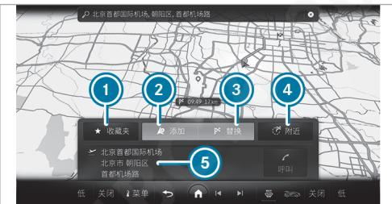

示例：详细显示

$\textcircled{8}$ 将目的地保存为收藏夹

$\textcircled{6}$ 将所选目的地作为下一个中途停留地添加

到现有目的地中并重新计算路径

$\textcircled{6}$ 计算到所选目的地的新路径

$\textcircled{9}$ 在目的地附近选择兴趣点

$\textcircled{6}$ 中途停留地地址

选择 $\textcircled{6}$ 或 $\textcircled{6}$ 后，重新计算路径。

选择其中一个选项。

# 将目的地保存为收藏夹

选择 收藏项目。  
选择选项。

# 启动导航

选择出发!。

# 调出带目的地地址的详细显示

上拉图标出发！上方的栏。  
根据目的地选项和可用性，显示在线内容，例如评价、价格和天气信息。  
共享目的地：选择分享。  
该选项允许您扫描显示的二维码。  
调出互联网地址：如有网址可用，则选择WWW。  
拨打目的地电话：如果电话号码可用，则选择呼叫。

# 搜索显示的目的地周围的兴趣点

选择附近。

使用类别进行搜索、输入搜索条目或搜索个人兴趣点。

# 选择路径类型

? 在导航模块（放大视图）中，选择第 292页)。选择路径。  
路径被计算为一条短途行程的快速路径。

# 计算备选路径

在导航模块（放大视图）中，选择  
选择视图。  
启用开始后显示路径概览。  
每条路径都计算有备选路径。

# 选择备选路径

$\textcircled{ i}$ 如果开始后显示路径概览已开启且已计算路径，则该功能可用。在导航模块（放大视图）中，选择备选路径。已计算备选路径时，向右或向左滑动即可在导航窗口中显示该路径。  
选择开始。

# 启用通勤路径

$\textcircled{ i}$ 已创建用户配置文件并在用户选项中启用允许目的地建议 第 284页)。导航未启用。在导航模块（放大视图）中，选择。选择路径。启用通勤路径。导航系统自动探测到车辆位于通勤路径。对于日常通勤路径，在未启用路径向导的情况下行驶时，也将播报路径上的交通事件。

# 选择或删除通勤路径：选择开始或× 。

# 避开或采用路段，例如高速公路或渡口

在导航模块（放大视图）中，选择  
选择路径。  
选择避开选项。  
启用或停用避开选项。

# 启用带增强现实的路径向导

在导航模块（放大视图）中，选择  
。  
选择视图。  
选择增强现实视频。  
启用或停用增强现实视频。  
摄像头视频图像在转向操作前显示在中央显示屏上。视频图像包含附加信息。

显示带增强现实的路径向导的属性信息带增强现实的路径向导启用。

在导航模块（放大视图）中，选择。

选择视图。  
选择增强现实视频。  
启用街道名称和门牌号。  
在路径向导启用期间，已启用的选项作为附加信息显示在摄像头图像中。

# 使用地图功能

MBUX智能人机交互系统：

# 增大地图比例尺

当地图显示时，使用一根手指在中央显示屏上快速轻敲两下。

# 或者

$\blacktriangleright$ 在中央显示屏上叉开两根手指。

# 缩小地图比例尺

$\blacktriangleright$ 使用两根手指轻敲中央显示屏。或者$\blacktriangleright$ 在中央显示屏上并拢两根手指。

# 移动地图

当地图显示时，使用一根手指在中央显示  
屏上朝任意方向滑动。  
将地图复位至当前车辆位置：选择居中。

# 选择地图朝向

反复轻敲地图上的指南针符号 $\boxed { \bigcirc }$ ]。按如下顺序改变地图朝向：

·显示2D 地图视图以使北方总处于顶部。  
·2D 地图视图对准行驶方向。  
·3D 地图视图对准行驶方向。  
·地图显示完整路径。

# 开启或关闭车道导航

此功能在以下情况下可用：

·此功能在您的车辆上可用。  
·此功能开启。  
·有互联网连接。

·您正在高速公路、匝道或城市高速公路上行驶，且这些路段允许使用该功能。

在导航模块（放大视图）中，选择第292页)。

# 选择视图。

开启或关闭 车道导航。

# 使用服务

# 要求：

·有互联网连接。  
·Mercedes me 互联可用。  
·您已在 Mercedes me App 上创建用户账号。车辆已连接至用户账号且您接受该服务的使用条款。

MBUX智能人机交互系统：

# 显示交通信息

路径向导使用通过实时路况信息接收的交通状况报告。

在导航模块（放大视图）中，选择第 292页)。选择视图。启用交通。启用交通事件和畅通路段显示当前交通限制和交通事件，例如道路施工或交通拥堵报告。$\textcircled{1}$ 有关实时路况信息的详细信息，请参见电子使用说明书（用户手册）。

# 显示危险警告

如有危险警告可用，则其将以图标的形式显示在地图上。显示因交通事件选项的设定而异。

在导航模块（放大视图）中，选择(→第 292页)。

启用或停用交通事件。

如已启用选项，则显示所有图标：

如已停用选项，则仅在有危险警告时才显示图标。

以下危险可能显示在地图上：

·事故和故障  
：湿滑道路、雾天、侧风和大雨手动报告的危险危险警告灯启用的车辆  
）道路施工  
·其他危险（如有）

# 驻车服务

注意 因未遵守最大允许净空高度导致的车辆损坏

如果车辆高度超过最大允许净空高度，则可能会损坏车顶或车辆其他部件。

请遵守所示的最大净空高度。  
如果车辆超过允许的净空高度，请勿驶入。  
在有车顶上部结构或其他车载系统的情况下，应将改动后的车辆高度考虑在内。

注意事项未遵守当地信息和驻车条件导致的车辆损坏

数据基于相应服务供应商提供的信息。梅赛德斯-奔驰不保证所提供的停车场或驻车区相关信息的准确性。

请务必遵守当地相关信息和条件。

在导航模块（放大视图）中，选择并开启停车场。

在地图上点击。

# 或者

在路径概览中，选择 P 停车场

第 292页)。

选择驻车选项。

显示以下信息（如有提供）：

·目的地地址、与当前车辆位置之间的距离以及到达时间

·有关停车场的信息，例如：

营业时间  
停车费  
当前占用率  
最长停车时间

# 最大可进入高度

驻车服务显示的最大可进入高度不能取代驾驶员注意实际情况。

·可选付费选项（Mercedes pay、硬币、纸币、刷卡）  
·有关停车收费详情  
·可用停车位数量  
·付费方式（例如在停车计时器上）  
·驻车服务/设施选项  
·电话号码

计算路径 第 296页)。

# 有关行车记录仪的注意事项

# 注意事项免责声明

使用本行车记录仪的所有功能前，请您务必仔细阅读并完全理解本声明。如果您不同意或不完全理解本声明，请不要使用本行车记录仪。如果您使用本行车记录仪，您的使用行为即作为对本声明内容的认可及同意。

作为车辆的生产商，我司仅从客观功能角度向您提供行车记录仪的设备及软件系统，无法预判或确定您在使用行车记录仪的过程中所捕获、记录的图像或地理信息是否合法。因此，如因您使用行车记录仪时实际捕获或记录的图像或地理信息而产生的任何不良后果，我司不承担任何责任。

警告：请务必在使用时遵守所有适用的法律法规，例如：请避免采集或记录可能被视为国家机密的图像或地理信息以及其他敏感信息（如军事区域）。如违反相应法律法规，实际使用人应承担相应责任，我司将不会承担任何相应责任。

$\textcircled{1}$ 请遵守以下安全操作说明：

·仅使用 FAT32或exFAT格式的USB 存储设备。  
·使用USB-IF 认证的 USB 存储设备。USB-IF 是一家非营利性组织，是USBImplementers Forum 的缩写。基于USB规范，USB-IF通过USB 接口对USB 版本、相应的电缆和插头以及能源供应过程等进行认证。如果经常或持续高速覆盖USB存储设备，则可能会造成损坏。梅赛德斯-奔

驰推荐使用高质量的外接SSD 固态硬盘。

SSD 是 Solid State Drive（固态硬盘）的缩写。

$\textcircled{ i}$ 文件大小和单次录制时长会受到U盘格式 的限制。例如，FAT32格式的U盘不允许 文件大于4 GB。 当达到文件大小时，记录停止且您将收到 通知。

$\textcircled{ i}$ 以下功能在 Gallery app 中可用：

·开启或关闭写入保护·删除视频文件

# 选择USB设备通过行车记录仪进行录像

# 要求：

·至少1个USB 设备已连接至MBUX智能人MBUX智能人机交互系统。

MBUX智能人机交互系统：

> Apps \ 行车记录仪选择 USB 图标。

选择USB 设备。

$\textcircled{ i}$ 当USB设备包含多个分区时，录制的视频文件并不总是显示在录制列表中。梅赛德斯-奔驰建议您使用带一个分区的USB设备。

# 开始或停止使用行车记录仪循环录像

#

·用于记录和保存视频文件：USB 设备已连接至MBUX智能人机交互系统。·车辆启动。

# MBUX智能人机交互系统：

> Apps  行车记录仪如果多个USB 设备已连接至MBUX智能人机交互系统则选择USB设备 第301页)。如果未选择USB 设备，则在开始录像时会自动进行选择。

# 选择录像模式：选择循环录像。

循环录像连续录制短视频文件。内存已满时，会自动继续记录。进行此操作时，最旧的视频文件会被覆盖。

开始：选择开始记录。显示录制长度。出现录像期间不得移除存储媒体 在移除存储媒体之前，请先将其弹出信息。视频文件保存在USB 设备上。

结束：选择结束记录。

在以下情况下可能出现一条信息：

·摄像头不运作，摄像头不可用信息出现。到梅赛德斯-奔驰授权服务中心检查摄像头。  
·如已开启国家边界指示。  
·如果在行车记录仪录制期间使用摄像头应用开始户外录制，则行车记录仪录制暂停，并在摄像头录制结束后自动恢复。显示有关此效果的通知。

# 开始或停止使用行车记录仪单次录像

# 要求：

·用于记录和保存视频文件：USB设备已连接至MBUX智能人机交互系统。·车辆启动。

# MBUX智能人机交互系统：

Apps  行车记录仪

如果多个USB 设备已连接至MBUX智能人机交互系统，则选择USB 设备  
（→第293页)。  
如果未选择USB设备，则在开始录像时会自动进行选择。

选择录像模式：选择单次录像。

单次录像达到内存限制时停止录制。自动保护个人录制以防被覆盖。

·如已开启国家边界指示。

·如果在行车记录仪录制期间使用摄像头应用开始户外录制，则行车记录仪录制暂停，并在摄像头录制结束后自动恢复。显示有关此效果的通知。

# 电话

# 电话功能

# 有关电话功能的注意事项

A 警告在车辆行驶过程中操作移动通信设备造成的事故风险

开始：选择开始记录。显示录制长度。出现录像期间不得移除存储媒体在移除存储媒体之前，请先将其弹出信息。视频文件保存在USB 设备上。

移动通信设备会分散驾驶员对交通状况的注意力。这可能会导致驾驶员失去对车辆的控制。

作为驾驶员，请仅在车辆处于静止状态时操作移动通信设备。作为车辆乘员，请仅在指定区域内使用移动通信设备，例如在后排中。

结束：选择结束记录。

在以下情况下可能出现一条信息：

·单次录像：内存已满或只有几分钟的录制时间可用。录像停止或将被紧急停止。更换USB设备或删除视频文件。·摄像头不运作，摄像头不可用信息出现。到梅赛德斯-奔驰授权服务中心检查摄像头。

A 警告在车辆行驶过程中操作集成式通讯设备造成的干扰风险

如果在行车时操作集成在车内的通讯设备，则可能会分散您对交通状况的注意力。这可能会导致您失去对车辆的控制。

仅可在交通状况允许的情况下操作该设备。  
如果对此不确定，在注意道路及交通状况的情况下停车，并在车辆处于静止状态时操作该设备。

在车内操作 MBUX智能人机交互系统和移动通信设备时，必须遵守当前行驶时所在国家和地区的法规要求。

# A 警告物品存放不当造成的伤害风险

如果车内物品存放不当，可能会滑动或被抛起，从而撞击到车辆驾驶员及乘客。此外，在发生事故时，杯座、打开的储物空间和移动电话支架等可能将无法始终固定其内的所有物品。

特别是在紧急制动或突然转向时，存在伤害风险。

务必妥善存放物品，确保其在上述情况下不会被抛起。  
务必确保物品不会从储物空间、行李网或储物网中伸出。  
行车前关闭可锁止的储物空间。  
请务必将重物、硬物、尖物以及锋利、易碎或过大的物品存放并固定在行李箱/载物舱内。

请注意有关正确存放移动通信设备的其他信息：

·装载车辆 第114页)

# 蓝牙连接：

菜单视图和电话菜单中的可用功能部分取决于所连接移动电话的蓝牙?配置文件。当移动电话支持以下所有蓝牙?配置文件时，全部功能可用：

·电话簿访问协议（PBAP）移动电话上的联系人自动显示在MBUX智能人机交互系统上。  
·信息访问协议（MAP）

移动电话信息功能可在MBUX智能人机交互系统上使用。

·免提配置文件（HFP）

无线电话功能在MBUX智能人机交互系统上可用。

·SAP 配置文件

车载电话可以访问 SIM卡数据并通过外置天线拨入移动电话网络。

尽管如此，您仍可通过任意移动无线电设备使用蓝牙?音频功能。

有关要连接的移动无线电设备的功能范围信息，请参见设备制造商的操作手册。

# 网络连接：

在车辆行驶过程中，以下情况可导致通话断开：

·您切换到没有闲置通信信道的发射站/接收站。  
·所用的SIM卡与当前网络不兼容  
·带"双卡"的移动电话上的第二张 SIM 卡同时登录网络

MBUX 智能人机交互系统支持在HD Voice@下通话以获取更好的语音质量。对此要求被叫方的移动电话和移动电话网络供应商支持 HDVoice?。根据连接质量的不同，语音质量可能不稳定。

有关详细信息，请咨询梅赛德斯-奔驰授权服务中心或访问 https://www.mercedes-benz-mobile.com

# 电话菜单概述

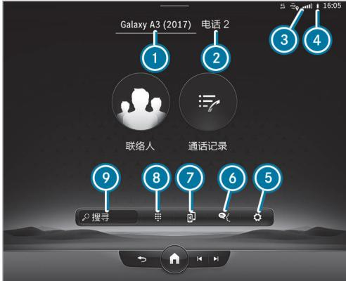

$\textcircled{6}$ 当前连接的移动电话/移动电话的蓝牙?设备名称  
$\textcircled{6}$ 当前连接的移动电话/移动电话的蓝牙?设备名称（当连接了多部移动电话时）  
$\textcircled{6}$ 移动电话网络信号强度  
$\textcircled{6}$ 已连接移动电话的电池状态  
$\textcircled{6}$ 选项  
$\textcircled{5}$ 信息  
$\textcircled{4}$ 调出设备  
$\textcircled{9}$ 数字键盘  
$\textcircled{8}$ 开始联系人搜索

# 移动电话使用概述

根据配置的不同，可同时连接最多4部移动电话：

·移动电话已通过蓝牙@连接至MBUX智能人机交互系统。  
·其他移动电话已通过蓝牙@连接至MBUX智能人机交互系统。您可在所有移动电话上使用MBUX 智能人机交互系统的所有功能。

# 连接移动电话

# 要求：

·在移动电话上启用蓝牙?（请参见制造商的操作手册）。·在MBUX智能人机交互系统上启用蓝牙③。

MBUX智能人机交互系统：

电话设备》设备

# 搜索移动电话

选择连接新设备。

# 连接移动电话

选择移动电话。MBUX智能人机交互系统和移动电话上显示一个代码。如果两个代码匹配，则在移动电话上确认代码。  
$\textcircled{1}$ 对于旧款移动电话型号，在移动电话和MBUX智能人机交互系统上输入1至16位数字代码以进行授权。  
$\textcircled{ i}$ 可在MBUX智能人机交互系统上授权最多15 部移动电话。  
$\textcircled{1}$ 可自动重新连接驾驶员用户配置文件中启用的最多4部手机。

# 电话功能菜单中的功能

在电话功能菜单中，您有以下功能，例如：

·拨打电话，例如：

接听电话

# 结束通话

以信息回复来电

# 电话会议

接听或拒接待接电话

·管理联系人，例如：管理联系人姓名格式

·接收和发送信息，例如：使用语音播报功能□述新信息

# MB Apps（数字化产品和服务） 梅赛德斯-奔驰智能互联呼叫

通过上方控制面板拨打电话

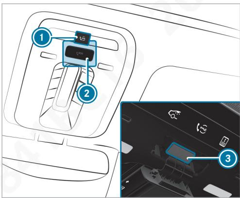

$\textcircled{6}$ 梅赛德斯-奔驰智能互联呼叫me 按钮

$\textcircled{6}$ SOS 按钮护盖

$\textcircled{6}$ SOS 按钮（紧急呼叫系统）

# 发起梅赛德斯-奔驰智能互联呼叫

按下 me 按钮 $\textcircled{8}$ 。

# 发起紧急呼叫

如需开启 SOS 按钮 $\textcircled{6}$ 的护盖，轻按一下即可。按住 SOS 按钮 $\textcircled{8}$ 至少1秒钟。

即使梅赛德斯-奔驰智能互联呼叫启用，仍可发起紧急呼叫。这优先于所有其他当前通话。

# ■有关使用me按钮发起梅赛德斯-奔驰智能互联呼叫的信息

已通过上方控制面板或MBUX智能人机交互系统上的me按钮拨出至客户服务中心的呼叫第297页)。

使用语音对话系统访问所需服务：

·事故管理和道路救援  
·通过客户服务中心了解有关车辆的一般信息

您可找到有关以下主题的信息：

·数字化产品和服务的启用·操作车辆·最近的授权服务中心·梅赛德斯-奔驰的更多产品在连接至客户服务中心期间，数据已传输第307页)。

# ■使用MBUX智能人机交互系统呼叫客户服务中心

# 要求：

·可访问移动电话网络。  
·相应地区的移动电话网络供应商提供足够的网络覆盖。  
·必须启动车辆，使车辆数据自动传输。

# MBUX智能人机交互系统：

# 丶电话通讯录

呼叫 Mercedes me 互联。数据传输出现在显示屏上。随后，您可选择服务并与客户服务中心的专家建立连接。

$\textcircled{1}$ 在某些国家或地区，或如果旅程咨询服务启用，您将直接连接至客户服务中心。

# 自动检测到事故或故障后呼叫客户服务中心

# 要求：

在某些情况下，车辆可以检测到事故或故障情况。

事故：无要求。

故障：

·车辆处于静止状态。  
·危险警告灯开启。

事故/故障检测程序

·车辆已检测到事故/故障情况。·检测到事故/故障时，应急指南将在 MBUX智能人机交互系统显示屏中显示安全注意事项。这可能需要花费数秒钟时间。

根据事故的严重程度发起自动紧急呼叫。这优先于所有其他当前通话

第311页)。

退出应急指南显示。  
将出现一个提示，询问您是否希望获得客户服务中心的支持。

故障/事故检测后客户服务中心直接支持：选择呼叫。

·经您同意后或如果"道路救援"数字化产品和服务已启用，将自动传输车辆数据 第308页)。  
·客户服务中心接听您的电话并组织事故/道路救援。

这些服务可能需要收费。

客户服务中心稍后支持：选择稍后再拨。  
该信息将消失，稍后会再次出现。

# 通过梅赛德斯-奔驰智能互联呼叫进行保养

# 预约

如果您已启用 Car Health & Service 数字化产品和服务，则相关车辆数据将自动发送至客户服务中心。您随后将收到有关您车辆保养的个人建议。

无论您是否同意保养管理服务，MBUX智能人机交互系统都将在一定时间过后提醒您保养到期。出现提示，询问您是否想要预约。

进行保养预约：选择呼叫。  
车辆数据已传输，且客户中心收到您所需的预约日期。信息随后发送至您所需的服务网点。  
服务网点将联系您确认预约并在必要时咨询详情。

$\textcircled{ i}$ 如果您在服务信息出现后选择稍后再拨，则信息隐藏并在一定时间后再次出现。

# 梅赛德斯-奔驰智能互联呼叫期间传输的数据

如果您发起梅赛德斯-奔驰智能互联呼叫，则会传输数据以启用有针对性的建议和有效的服务。

传输数据必须满足以下要求：

·车辆启动。  
·移动电话网络供应商支持所需的数据传输技术。  
·移动连接质量充足。

多级传输取决于以下因素：

·发起呼叫的原因，可用的移动电话传输技术启用的数字化产品和服务·语音控制系统中已选定的服务$\textcircled{1}$ 数据传输的范围因车型和配置而异。由于技术原因，并非所有数据都始终可用。

# 数字化产品和服务未启用时的数据传输

如果没有启用数字化产品和服务，将传输以下数据：

·车辆识别代号  
·呼叫的时间  
·发起呼叫的原因  
）确认数据保护提示  
·车辆的国家和地区标志  
·设定MBUX智能人机交互系统的语言  
·安装在车上的通讯平台的电话号码

如已通过保养提醒进行保养预约，则也将传输以下数据：

·当前里程和保养数据如果在自动检测到事故或故障后使用MBUX智能人机交互系统系统发起呼叫，则还将传输以下数据：

·当前里程和保养数据·当前车辆位置

如已通过语音控制系统呼叫事故管理和道路救援，则也可由客户服务中心从车辆上调出以下数据：

·当前车辆位置

# 数据处理

特定事件数据将被处理并存储在客户服务中心，如果需要处理事件，则会转发给客户服务中心授权的服务合作伙伴。请注意梅赛德斯-奔驰网页 https://www.mercedes.me 中的数据保护信息。

# 梅赛德斯-奔驰智能互联

# 有关梅赛德斯-奔驰智能互联的信息

梅赛德斯-奔驰智能互联包括许多数字化产品和服务。

您可通过MBUX智能人机交互系统和上方控制面板使用以下数字化产品和服务，例如：

·事故救援（MBUX智能人机交互系统中的me 按钮或因情况而异的显示)  
·道路救援（MBUX智能人机交互系统中的me 按钮或因情况而异的显示）

·梅赛德斯-奔驰紧急呼叫系统（自动紧急呼叫和 SOS 按钮)

事故管理和道路救援数字化产品和服务以及梅赛德斯-奔驰紧急呼叫中心均24小时提供服务。

me 按钮和 SOS 按钮位于车辆上方控制面板上 第305页)。

您还可使用MBUX智能人机交互系统呼叫客户服务中心 第306页)。

请注意，梅赛德斯-奔驰智能互联是梅赛德斯-奔驰提供的一项服务。在紧急情况下，首先使用标准的国家紧急服务电话号码呼叫国家紧急服务中心。在紧急情况下，您也可使用梅赛德斯-奔驰紧急呼叫系统 第310页)。

请注意梅赛德斯-奔驰智能互联的使用条款和数据保护信息。您可在您的Mercedesme用户账号中找到这些信息。

有关梅赛德斯-奔驰智能互联和数字化产品和服务的更多信息，您可在您的Mercedes me App中进行查询。

网站：htps://me.secure.mercedes-benz.com$\textcircled{1}$ 请注意，Mercedesme互联的服务内容将会不时进行更新，详情可在Mercedes meApp中了解最新版本的互联服务内容和功能。

# ■事故管理和道路救援数字化产品和服务

$\textcircled{1}$ 事故管理和道路救援数字化产品和服务并非在每个国家和地区都可用。请到梅赛德斯-奔驰授权服务中心查询该功能在您的国家和地区是否可用。

事故管理和道路救援可包括以下功能：

·对梅赛德斯-奔驰紧急呼叫系统进行补充第294页)如有必要，紧急呼叫中心的联系人会将电话转接给事故管理和道路救援。然而，转接电话并非适用于所有国家和地区。由技师现场实施道路救援和/或将车辆牵引至最近的服务中心这些服务可能需要收费。  
·对自动检测到事故或故障后的应急指南进行补充 第290页)

如果发生故障或事故，将发送更多车辆数据，以便客户服务中心和授权服务中心提供更多支持或道路救援。

·对 Car Health & Service 数字化产品和服务进行补充

通过 Car Health& Service 功能，服务供应商可以记录特定的磨损和故障报告，只要这些报告能得到明确的解释，并且可以通过监控需要诊断的组件来获得。

如果您的车辆检测到故障或发生故障的威胁，则可能会通过MBUX智能人机交互系统提示您联系客户服务中心以寻求进一步的帮助。MBUX智能人机交互系统上的提示仅在车辆处于静止状态时出现。

$\textcircled{1}$ 这些数字化产品和服务受技术限制，例如移动电话覆盖范围、移动网络质量以及处理系统解释传输数据的能力。在某些情况下，这可能导致信息延迟或无法出现在MBUX智能人机交互系统中。

请注意，梅赛德斯-奔驰智能互联呼叫是梅赛德斯-奔驰提供的一项服务。在紧急情况下，请务必先联系常规的国家紧急电话号码，或使用梅赛德斯-奔驰紧急呼叫系统

# (→第 294页)。

有关数字化产品和服务的更多信息，请访问梅赛德斯-奔驰门户网站：https://me.secure.mercedes-benz.com

# 通过梅赛德斯-奔驰智能互联呼叫传输的数据

梅赛德斯-奔驰智能互联呼叫期间传输的数据取决于以下几项：

·发起呼叫的原因·语音控制系统中已选定的服务·启用的数字化产品和服务（ 第307页)

可以从当前有效的数字化产品和服务使用条款和数据保护声明中获取为数字化产品和服务传输的数据。您可在您的梅赛德斯-奔驰用户账号中找到这些信息。

# Mercedes me Apps 菜单概述

关于车辆的互联服务的内容和细节请在Mercedesme App 中进行查看。

$\textcircled{1}$ 确保 Mercedes me app 始终为最新。

您可使用 MBUX智能人机交互系统中的Apps 调出菜单。

在 Apps菜单中，以下选项可用：

·通过 Mercedes me 用户账号连接车辆  
·删除用户账号 Mercedes me 和车辆的连接  
）调出Mercedes me 服务  
·调出 app，例如 In-Car Office 或网页浏览器，因可用性而异

# 智能手机互联系统概述

借助智能手机互联系统，您可以通过MBUX智能人机交互系统显示屏在移动电话上使用某些功能。每次只能将一部移动电话通过智能手机互联系统连接至MBUX智能人机交互系统。在双电话模式下使用智能手机互联系统，也只能使用蓝牙?将另一部移动电话连接至MBUX智能人机交互系统。

仅当已连接至互联网时，智能手机互联系统的全部功能才可用。必须在移动电话上下载恰当的应用程序，才能使用智能手机互联系统。移动电话必须开启并使用合适的连接线通过USB接口连接至MBUX智能人机交互系统，智能手机互联系统的可用性可能因国家或地区而异。

智能手机互联系统 App·AppleCarPlay@（也可通过蓝牙@进行无线连接）

$\textcircled{1}$ 出于安全考虑，首次在MBUX 智能人机交互系统Apple CarPlay@必须在车辆处于静止状态并已施加驻车制动时进行。

您可使用设备菜单启动智能手机互联系统。您可通过设备或通过断开移动电话和MBUX智能人机交互系统之间的连接线结束智能手机互联系统。

$\textcircled{1}$ 梅赛德斯-奔驰建议仅在车辆处于静止状态时通过设备管理器或连接线断开连接。

# 已传输车辆数据概述

使用智能手机互联系统时，某些车辆数据将传输至移动电话。这有助于您以最佳的方式使用选定的移动电话服务。无法直接访问车辆数据。

传输以下系统信息：

·MBUX智能人机交互系统软件版本·系统ID（匿名）

此数据的传输用于优化车辆和移动电话之间

的通信。

为此，以及为了将多辆车分配给移动电话，将随机生成车辆识别符。

未连接至车辆识别代号（VIN）且当 MBUX智能人机交互系统重置时将被删除

# 第 290页)。

传输以下驾驶状态数据：

·已挂入的变速箱档位   
·驻车、静止、滑行和驾驶之间的区别 驾驶员显示屏的白天/夜间模式 驱动类型   
）车辆温度   
·充电电缆接头

此数据的传输用于根据驾驶条件更改内容显示方式。

传输以下位置数据：

·坐标  
·车速  
·指南针方向·加速方向

·高度

移动电话使用此数据以提高导航准确性，例如驶过隧道时。

# 梅赛德斯-奔驰紧急呼叫系统

# 有关梅赛德斯-奔驰紧急呼叫系统的信息

梅赛德斯-奔驰紧急呼叫系统仅可在相应合同伙伴的移动电话覆盖区域内工作。相应合同伙伴的网络未完全覆盖可能导致无法传输紧急呼叫。

发起自动紧急呼叫前，必须先启动车辆。

$\textcircled{1}$ 梅赛德斯-奔驰紧急呼叫系统在车辆出厂时已启用。梅赛德斯-奔驰紧急呼叫系统可以免费使用。

# 梅赛德斯-奔驰紧急呼叫系统概述

梅赛德斯-奔驰紧急呼叫系统有助于显著缩短自事故发生至紧急救援人员抵达事故现场的时间，还可帮助确定难以接近的事故现场的位置。

可自动(→第311页)或手动(→第312页)进行紧急呼叫。仅在您或他人需要救援时才拨打紧急呼叫。请勿在故障或类似情况下进行紧急呼叫。

有关梅赛德斯-奔驰紧急呼叫系统区域适用性的详细信息，请访问：https://www.mercedes-benz-mobile.com/extra/ecall/

# 显示屏上的信息：

显示屏上出现以下显示信息：

·SOS NOTREADY（SOS尚未准备就绪）：车辆未开启或紧急呼叫系统故障。这并不一定指示紧急呼叫系统完全失效。仍可传输紧急呼叫。显示仅涉及车辆，并未将移动电话网络和梅赛德斯-奔驰紧急呼叫中心的可用性考虑在内。一旦车辆启动，当 SOS NOT READY（SOS尚未准备就绪）显示信息消失时，即可看到车上的紧急呼叫系统的功能准备就绪。sos：紧急呼叫启用期间，图标出现在显示屏上。  
$\textcircled{ i}$ 如果紧急呼叫系统出现故障，则扬声器、话筒、安全气囊或 SOS 按钮等将出现故障。

通过以下显示可以识别出紧急呼叫系统出现故障：

·相应信息出现在驾驶员显示屏上。  
·SOS 按钮持续呈红色亮起。

# 发起自动梅赛德斯-奔驰紧急呼叫

# 要求

·车辆启动。  
·起动机蓄电池充满电。

在以下情况下梅赛德斯-奔驰紧急呼叫系统将自动触发紧急呼叫：

·事故后，气囊或安全带紧急拉紧器等约束系统启用后·主动式紧急停车辅助自动启用紧急停车后

已发起紧急呼叫：

·与梅赛德斯-奔驰紧急呼叫中心建立语音连接。  
·带事故数据的信息传输至梅赛德斯-奔驰紧急呼叫中心。

梅赛德斯-奔驰紧急呼叫中心可将车辆位置数据传输至其中一个紧急呼叫中心。在某些情况下，数据也会在语音信道中传输至梅赛德斯-奔驰紧急呼叫中心。这样会便于快速实施车辆救援、脱困措施或快速牵引车辆至梅赛德斯-奔驰授权服务中心。

上方控制面板上的 SOS 按钮闪烁，直至紧急呼叫结束。

无法立即结束自动紧急呼叫。

如未建立至紧急服务中心的连接，则相应信息将出现在显示屏上。

? 拨打您移动电话上的当地紧急号码。

如已发起紧急呼叫：

·如果道路和交通状况允许，请留在车上，直至与紧急呼叫中心接线员建立语音连接。·接线员根据呼叫内容决定是否有必要呼叫救援队和/或警察到事故现场。

# 发起手动梅赛德斯-奔驰紧急呼叫

使用上方控制面板上的 SOS 按钮：按下SOS按钮至少1秒钟 第305页)。

# 或者

使用语音控制：使用MBUX读心语音助理的语音指令。

已发起紧急呼叫：

·与梅赛德斯-奔驰紧急呼叫中心建立语音连接。  
·带事故数据的信息传输至梅赛德斯-奔驰紧急呼叫中心。梅赛德斯-奔驰紧急呼叫中心可将车辆位置数据传输至其中一个紧急呼叫中心。在某些情况下，数据也会在语音信道中传输至梅赛德斯-奔驰紧急呼叫中心。这样会便于快速实施车辆救援、脱困措施或快速牵引车辆至梅赛德斯-奔驰授权服务中心。  
·如果道路和交通状况允许，请留在车上，直至与紧急呼叫中心接线员建立语音连接。

·接线员根据呼叫内容决定是否有必要呼叫救援队和/或警察到事故现场。

如未建立至紧急服务中心的连接，则相应信息将出现在中央显示屏上。

$\blacktriangleright$ 拨打您移动电话上的当地紧急号码。

结束无意发出的手动梅赛德斯-奔驰紧急呼叫使用多功能方向盘：选择。

# 梅赛德斯-奔驰紧急呼叫系统数据传输

发生自动或手动紧急呼叫时，传输以下数据，例如：

·车辆的全球定位系统（GPS）位置数据  
·路径上的全球定位系统（GPS）位置数据（事故发生前的100米）  
·行驶方向  
·车辆识别代号  
）车辆驱动类型  
·车内探测到的人数  
·数字化产品和服务是否可用

·手动还是自动进行紧急呼叫·事故发生的时间·MBUX智能人机交互系统中的语言设定为查清事故，发起紧急呼叫后，以下措施可能耗时长达1小时：

·可确定当前车辆位置。  
·可建立至车辆乘员的语音连接。

# 紧急呼叫系统的自诊断功能

车辆每次开启时都检查紧急呼叫系统的功能性。在此期间，SOS按钮呈红色持续亮起5秒钟。系统出现故障时，您将通过驾驶员显示屏上的文本信息和中央显示屏或媒体显示屏上的红色指示 SOS NOT READY 获得提醒。

请确保在开启车辆后30 秒钟内显示屏右上角的红色指示 SOS NOT READY关闭。这表明紧急呼叫系统成功通过诊断。

# 收音机和媒体

# 媒体菜单中的符号和功能概述

符号 名称 功能  
回 播放 选择启动或继续播放。休息 选择以暂停播放。重复曲目 选择以重复当前曲目或当前播放列表。·选择一次：重复当前播放列表。·选择两次：重复当前曲目。·选择三次：该功能停用。  
区 随机播放 选择以随机顺序播放曲目。  
国国 后退/前进 选择以跳转至下一首或上一首曲目。附加选项 选择以显示附加选项。类别 选择以显示或搜索可用类别（例如播放列表、专辑、艺术家等）。搜索 选择以在当前菜单中搜索。例如，您可搜索艺术家、类别或心情。

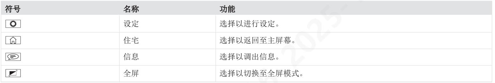

以下功能和设定在媒体菜单中可用：

·将外部数据存储媒体连接至 MBU× 智能人机交互系统（使用USB或蓝牙?）·播放音频或视频文件

# 音响设定

# 音响菜单中的功能概述

可用设定选项和功能因所安装的音响系统而异。您可从电子使用说明书（用户手册）中查找您车上安装的音响系统。

# 主动保养提示系统增强版（ASSYSTPLUS）保养时间间隔显示

# 主动保养提示系统增强版（ASSYST PLUS）保养时间间隔显示功能

仪表显示中的主动保养提示系统增强版（ASSYSTPLUS），其保养时间间隔显示功能为您提供距离下次保养到期日所余的时间或里程信息。

可以用方向盘上的回退按钮显示。

取决于车辆的使用情况，主动保养提示系统增强版（ASSYSTPLUST）保养时间间隔显示可能会缩短保养时间间隔，例如在下列情况下：

·主要为短途行驶  
·当发动机频繁长时间处于怠速状态时  
·在频繁冷启动的情况下

梅赛德斯-奔驰建议避免此类操作情况。

您可从具有资质的专业服务中心，例如梅赛德斯-奔驰授权服务中心，获取有关本车保养的信息。

# 显示保养到期日

驾驶员显示屏：

# 保养

显示下次保养到期日。

退出显示：按下方向盘上的回退按钮

请牢记以下相关要点：

·操作驾驶员显示屏 第254页)。

# 有关定期保养工作的信息

注意事项未定期保养造成的过早磨损

未在适当时间进行保养工作或保养工作不完全可增加车辆的磨损和损坏。

请遵守规定的保养时间间隔。

请务必在具有资质的专业服务中心进行规定的保养工作。

# 特殊保养要求注意事项

规定的保养时间间隔是根据车辆正常行驶状况而确定的。如果行驶条件艰难或车辆负载增加，则应比规定时间更为频繁地进行保养工作。

主动保养提示系统增强版（ASSYSTPLUS）保养时间间隔显示仅作为辅助手段。由于实际行驶条件和/或负载，车辆驾驶员有责任比规定时间更为频繁地进行保养工作。

例如，恶劣工作条件包括：

·经常中途停车的常规城市驾驶  
）主要为短途行驶经常在山岭地区或路况较差的路面上行驶  
当发动机频繁长时间处于怠速状态时在灰尘特别严重的条件和/或频繁使用空气内循环模式行驶时

在这些或类似行驶条件下，则应更频繁地更换车内空气滤清器、空气滤清器、发动机油和机油滤清器等。如果车辆在负载增加的情况下行驶，则必须更频繁地检查轮胎。有关详细信息，请咨询具有资质的专业服务中心。

# 蓄电池断开期间

主动保养提示系统增强版（ASSYSTPLUS）保养时间间隔显示仅在蓄电池连接的情况下才可计算保养到期日。

断开蓄电池之前，在驾驶员显示屏上显示保养到期日并将其记下 第315页)。

# 保养管理

# 有关保养管理的说明

如果保养管理服务已启用，则相关数据将自动传输至梅赛德斯-奔驰客户服务中心。

客户服务中心将数据传输给您在梅赛德斯-奔驰网站上输入的服务合作伙伴：https://www.mercedes.me。您随后将收到有关您车辆保养的个人建议。

$\textcircled{1}$ 将保养请求传输至服务合作伙伴的最佳时间的计算受技术限制的影响，可能导致保养建议被认为过早或过晚或根本不提出建议。在这种情况下，您可通过MBUX智能人机交互系统中的保养提示方便地与客户服务中心进行保养预约。

$\textcircled{ i}$ MBUX智能人机交互系统中的保养管理和保养提示并非在每个国家和地区都可用。请到梅赛德斯-奔驰授权服务中心查询该功能在您的国家和地区是否可用。

# 使用保养管理时传输的数据

如果该服务已启用，将自动传输相关数据，以确定所需的保养范围以及进行故障探测和故障排除。

有关数据传输的详细信息，请查看梅赛德斯-奔驰智能互联服务的数据保护信息。关于这些信息，请登录Mercedesme App-法律条款香看。

$\textcircled{ i}$ MBUX智能人机交互系统中的保养管理和保养提示并非在每个国家和地区都可用。

# 远程诊断

# 有关远程诊断的注意事项

$\textcircled{1}$ 此服务并非适用于所有国家和地区。

车辆可探测是否需要更换某些易损件或车辆系统中是否发生故障。如果远程诊断服务已启用，则相关数据将自动传输给制造商。如果通过车辆系统自诊断探测到故障情况，系统会根据探测到的故障将操作建议发送给梅赛德斯-奔驰客户服务中心。客户服务中心将数据传输给您在梅赛德斯-奔驰网站上输入的服务合作伙伴：https://www.mercedes.me。对于某些故障，MBUX智能人机交互系统中可能会显示一则通知，提示已探测到故障，并要求联系梅赛德斯-奔驰客户服务中心。基于此消息，您可直接呼叫客户服务中心寻求帮助。

$\textcircled{ i}$ 发送至MBUX智能人机交互系统的通知，其传输取决于国家和地区、车型和配置，并且需要有快速的数据连接，而服务供应商对此无法产生任何影响。

$\textcircled{ i}$ 故障探测的可靠性受技术限制。因此，只能探测到有限的某些故障，并将操作建议发送给客户服务中心和服务合作伙伴。梅赛德斯-奔驰股份公司一直在努力不断扩大该服务的范围。故障探测取决于国家和地区、车型和配置。

# 使用远程诊断时传输的数据

如果该服务已启用，将自动传输相关数据，以确定所需的保养范围以及进行故障探测和故障排除。

有关数据传输的详细信息，请查看梅赛德斯-奔驰智能互联服务的数据保护信息。关于这些信息，请登录Mercedes me App-法律条款查看。

$\textcircled{ i}$ 数据传输的范围因车型和配置而异。由于技术原因，并非所有数据都始终可用。

# 发动机舱

# 保护式发动机罩（行人保护)

# 1保护式发动机罩操作（行人保护)

在某些事故中，保护式发动机罩可以降低对行人造成伤害的风险。发动机罩的后方区域抬起约80毫米。

保护式发动机罩触发后保持在升起位置。不能排除由于发动机罩升高而导致的视野受限。

保护式发动机罩触发后，行人保护功能可能会受到限制。

请立即到具有资质的专业服务中心重置保护式发动机罩的全部功能。

必要时，调节您的座椅位置并小心驾驶至具有资质的专业服务中心。如果无法继续安全行车，请联系具有资质的专业服务中心。

# 开启和关闭发动机罩

危险在充电过程中执行保养工作时的致命伤害风险

在充电过程中，高电压车载电气系统带有高电压。

在充电过程中，切勿执行任何保养工作。

警告发动机罩未锁止时行驶造成的事故风险

发动机罩可能开启并阻挡您的视野。

行驶时切勿解锁发动机罩。每次行车前，请确保发动机罩已锁止。

警告开启和关闭发动机罩时的事故及 伤害风险

发动机罩可能会突然下落到极限位置。

这将给处于发动机罩活动范围内的任何人造成伤害风险。

如果发动机罩移动范围内有人，切勿开启或关闭发动机罩。

A 警告开启发动机罩时的灼伤风险如果您在发动机过热或发动机舱起火时开启发动机罩，可能发生下列情况：

·您可能会接触到热气。  
·您可能会接触到其他溢出的热工作液。开启发动机罩前，请让发动机冷却。如果发动机舱内起火，请保持发动机罩关闭并呼叫消防救援机构。

# A 警告运转的部件造成的伤害风险

即使关闭了驱动系统，发动机舱内的部件也可能会继续运转或突然启动。如果必须开启发动机罩，请遵循以下要求：

关闭车辆。

切勿接触运转部件周围的危险区域，例如风扇旋转区域。  
取下珠宝首饰和手表。  
使头发、衣服等远离运转的部件。

A 警告 触摸带电零部件造成的伤害风险点火系统和燃油喷射系统在高电压下运行。您可能遭受电击。

当车辆启动时，切勿触摸点火系统或燃油喷射系统的部件。

带电零部件包括以下零部件，例如：

·点火线圈   
·喷油器   
·点火线圈和喷油器电气线路

A 警告发动机舱中高温零部件造成的烫伤凤险

发动机舱内的某些零部件（例如发动机、冷却器和排气系统零部件）可能温度非常高。

使发动机冷却并仅触摸下述零部件。

A 警告在发动机罩开启时使用风挡玻璃雨刮器造成的伤害风险

如果风挡玻璃雨刮器在发动机罩开启时开始移动，您可能会被雨刮器连杆夹住。

如果需要开启发动机罩，请务必先关闭风挡玻璃雨刮器和车辆。

# 开启发动机罩

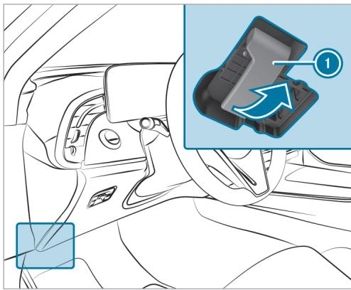

要松开发动机罩，拉动拉手 $\textcircled{8}$ 。

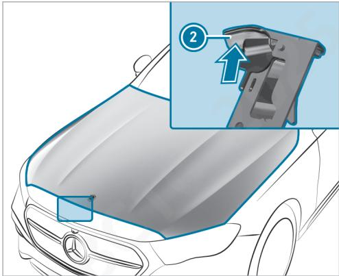

向上推动发动机罩锁门拉手 $\textcircled{6}$ ，然后提起发动机罩，直至其自动开启。

# 关闭发动机罩

<table><tr><td>！ 注意事项手动关闭时导致发动机罩损 坏</td></tr><tr><td>如果手动关闭发动机罩，则存在凹陷风 险。</td></tr></table>

不要手动关闭发动机罩。

降低发动机罩至约20 厘米 的高度，然后稍稍用力让其自然下落。  
如果仍可稍稍提起发动机罩，请再次开启发动机罩并稍稍增加力度将其关闭，直至其正确卡入位。

# 发动机油

# 使用驾驶员显示屏检查发动机油液位

# 要求

·发动机已暖机。  
）车辆停放在水平地面上。  
，发动机怠速运转。  
·发动机罩关闭。

在常规驾驶方式下，确定发动机油液位可能最多需要30分钟，而在主动驾驶方式下可能需要更长时间。

驾驶员显示屏：

# 保养

显示发动机油液位。

以下其中一条信息将出现在驾驶员显示屏上：

·正在测量 发动机油液位：尚无法确定发动机油液位。

最多在行驶30分钟后重复请求。

发动机油液位正常且驾驶员显示屏上用于指示发动机油液位的条形显示为绿色并处于下限"min"和上限"max"之间：发动机油液位正确。

·发动机油液位加注1,0L且驾驶员显示屏上用于指示发动机油液位的条形显示为黄色并低于下限"min"位置：

添加1升发动机油。

发动机油液位过高且驾驶员显示屏上用于指示发动机油液位的条形显示为黄色并高于上限"max"位置：

排放已添加的多余发动机油。为此，请咨询具有资质的专业服务中心。

·检查发动机油液位开启车辆启动按钮通电开启车辆以检查发动机油液位。

发动机油液位系统停止运作：油位传感器有故障或未连接。

请咨询具有资质的专业服务中心。

·发动机油液位系统暂时无法使用

关闭发动机罩。

# 加注发动机油

A 警告发动机舱中高温零部件造成的烫伤凤险

发动机舱内的某些零部件（例如发动机、冷却器和排气系统零部件）可能温度非常高。

使发动机冷却并仅触摸下述零部件。

A警告 发动机油造成的失火及伤害风险如果发动机油接触到发动机舱的高温部件，可能会被点燃。

确保无发动机油溢到机油加注口旁边。  
启动车辆前，让发动机冷却并彻底清洁零部件上的发动机油。

注意事项不适当的机油滤清器、机油或添加剂造成的发动机损坏

请勿使用不符合保养时间间隔明确规定的发动机油或机油滤清器。  
更换发动机油时，请遵守保养时间间隔显示中的说明以及规定的更换间隔。  
切勿使用添加剂。

注意事项添加过多的发动机油造成的损坏

发动机油过多可能损坏发动机或催化转换器。

请到具有资质的专业服务中心抽出多余的发动机油。

$\textcircled{ i}$ 根据驾驶方式的不同，车辆的机油消耗量为每1,000公里最多0.8升。如果驾驶的是新车或经常以较高的发动机转速驾驶车辆，机油消耗量也可能大于此值。

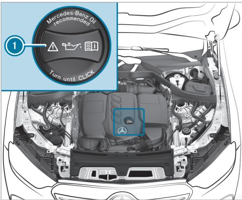

沿逆时针方向转动盖子 $\textcircled{8}$ 并将其取下。加注发动机油。  
装回盖子 $\textcircled{6}$ 并沿顺时针方向旋转，直至其卡入位。

再次检查机油液位 第319页)。

# 检查冷却液液位

A 警告发动机舱中高温零部件造成的烫伤凤险

发动机舱内的某些零部件（例如发动机、冷却器和排气系统零部件）可能温度非常高。

使发动机冷却并仅触摸下述零部件。

A 警告存在被热冷却液烫伤的风险如果打开盖子，可能会被烫伤。

打开盖子前，请先让发动机冷却。打开盖子时，请佩戴防护手套和护目镜。  
缓慢打开盖子以释放压力。

请只到具有资质的专业服务中心检查或加注冷却液。

# 为风挡玻璃清洗系统加注清洗液

# A 警告运转的部件造成的伤害风险

即使关闭了驱动系统，发动机舱内的部件 也可能会继续运转或突然启动。

如果必须开启发动机罩，请遵循以下要求：

关闭车辆。  
切勿接触运转部件周围的危险区域，例如风扇旋转区域。  
取下珠宝首饰和手表。  
使头发、衣服等远离运转的部件。

！警告 发动机舱中高温零部件造成的烫伤风险

发动机舱内的某些零部件（例如发动机、冷却器和排气系统零部件）可能温度非常高。

使发动机冷却并仅触摸下述零部件。

警告 风挡玻璃清洗浓缩液造成的烧伤或伤害风险

风挡玻璃清洗浓缩液高度易燃。如果接触到发热的发动机部件或排气系统，风挡玻璃清洗浓缩液可能会被点燃。

确保风挡玻璃清洗浓缩液不会溢出到加注口旁。

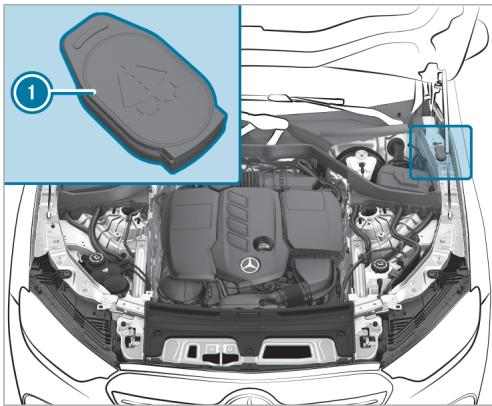

通过拉环打开盖子 $\textcircled{8}$ 加注清洗液。

$\textcircled{1}$ 关于风挡玻璃清洗液的详细信息第357页)

# 保持通风/排水管道畅通无阻

确保发动机罩和风挡玻璃之间的区域没有沉积物，例如冰、雪或树叶。

# 清洁和护理

# 关于使用洗车装置清洗车辆的信息

注意事项 使用强碱性清洗剂将会对车辆造成腐蚀或损坏请勿使用强碱性清洗剂进行车辆清洗。

■警告 清洗车辆后制动效果减弱造成的事故风险

清洗车辆后制动效果会减弱。

清洗车辆后，注意交通状况并小心制动，直至制动效果完全恢复。

# 注意事项自动制动造成的损坏

如果启用以下其中一种功能，则车辆在某些情况下将自动制动：

·主动式紧急制动  
·自适应巡航  
·保持（HOLD）功能  
·智能泊车

为避免损坏车辆，在拖车时或在洗车装置中时，请停用这些系统。

# 注意事项 由于使用不适宜的洗车装置导致的损坏

在驶入洗车装置之前，确保相对于车辆尺寸而言洗车装置大小适宜。  
确保车辆底部和洗车装置导轨之间有足够的离地间隙。  
确保洗车装置具有足够的缝隙宽度，尤其是导轨的宽度。

使用洗车装置时，请先确保满足以下条件，以防损坏您的车辆：

·自适应巡航停用。  
·保持（HOLD）功能关闭。  
· $3 6 0 ^ { \circ }$ 摄像头或后视摄像头关闭。车辆锁止并且车门拉手收回。侧车窗和滑动天窗已完全关闭。  
车外后视镜折合。  
通风装置和加热器的鼓风机关闭。  
·风挡玻璃雨刮器开关处于位置回。  
钥匙与车辆保持至少6米的距离。否则，行李箱盖或车门可能意外开启。这也适用于电子车钥匙。  
·对于配备拖电装置的洗车装置：已挂入空档。-从车内锁止车辆。  
·切勿在上方控制面板区域内进行任何手操作或在智能感应助理设定中停用滑动窗和遮阳帘 选项 第270页)。

$\textcircled{1}$ 清洗车辆后，清除风挡玻璃和雨刮器叶片上的车蜡，这将有助于避免残留污迹并减小雨刮器噪音。

# 洗车模式

在洗车模式下，车辆为驶入自动洗车装置准备就绪。洗车模式可在车速不超过20公里/小时时启用 第324页)。

当洗车模式启用时，洗车模式启用信息将出现在驾驶员显示屏上。将进行以下调节：

·车外后视镜将折合。  
·为防车窗洗刷器自动启动，雨量传感器将停用。空气内循环模式将启用。车窗和滑动天窗将关闭。智能泊车将停用。  
）如果适用，主动式紧急制动将停用。  
·配备360°摄像头的车辆：约8秒后，前方影像将启用。

·配备后备箱感应开启功能的车辆：脚踢检测将停用。

如果某项设定不可选，则通过相应设定后面的X指示。  
按下 关闭 将取消洗车模式。车速超过  
20 公里/小时时，洗车模式将自动停用。您还可以通过MBUX智能人机交互系统关闭洗车模式 第316页)。

停用洗车模式时将复位以下设定：

·车外后视镜将展开。雨量传感器将启用。空气内循环模式将停用。车窗和滑动天窗将保持关闭。智能泊车将复位为之前选择的设定。  
如果适用，主动式紧急制动将启用。  
配备 $3 6 0 ^ { \circ }$ 摄像头的车辆：当车速超过18公里/小时时，前方影像将停用。  
·配备后备箱感应开启功能的车辆：脚踢检测将启用。

# 启用/停用洗车模式

# 要求：

·车辆处于静止状态。  
·车辆启动。

MBUX智能人机交互系统：

}→设定车辆ン行驶

# 启用洗车模式

选择洗车模式。  
选择启用。

如果某项设定不可选，则通过相应设定后面的X指示。

$\textcircled{1}$ 有关启用洗车模式时的设定概览，请参见第322页)。

# 停用洗车模式

选择停用。洗车模式设定将复位。$\textcircled{1}$ 车速一旦超过20 公里/小时，洗车模式将自动停用。

# 关于使用高压清洗机的信息

警告 使用带圆形喷嘴的高压清洗机时的事故风险

喷射水流会造成外部看不到的损坏。  
由此受损的部件可能会意外发生故障。请勿使用带圆形喷嘴的高压清洗机。立即更换损坏的轮胎或底盘。

使用高压清洗机时，请先确保满足以下条件，以防损坏您的车辆：

·钥匙与车辆保持至少3米的距离。否则，行李箱盖或车门可能意外开启。这也适用于电子车钥匙。与车辆保持至少30 厘米 的距离。覆有装饰膜的车辆：本车的某些零部件覆有装饰膜。裹有装饰膜的车辆零部件与高压清洗机喷嘴之间应保持至少70厘米 的距离。清洗时不断移动高压清洗机喷嘴。高压清洗机的水温不得超过 $6 0 ^ { \circ } \mathrm { C }$ 。  
·请遵守设备制造商操作手册中有关正确距离的信息。

·切勿将高压清洗机喷嘴直接对准易损部件，例如轮胎、缝隙、电气部件、蓄电池、光源或格栅条等。

# 手动清洗车辆

！ 注意事项由于进水导致发动机损坏$\blacktriangleright$ 小心操作，请勿将水枪直接对准发动机罩下面的进气格栅。

请遵守相关法规要求（例如在许多国家或地区，仅允许在专门指定的洗车台进行手动清洗）。

使用温和型清洁剂，例如车辆清洁剂。请勿使用酸性清洁剂。  
使用温水和柔软的车用海绵清洗车辆。进行此操作时，切勿使车辆受阳光直射。小心用水冲洗车辆并使用油鞣革擦干车辆。

$\textcircled{1}$ 遵守车辆零部件护理说明第318页)。

# 漆面/哑光漆面护理注意事项

为避免损坏漆面以及与驾驶辅助系统产生干扰，请遵守以下注意事项：

# 漆面

·昆虫残渍：用昆虫残渍去除剂浸湿，然后冲洗经过处理的表面。  
·鸟粪：用水浸湿并随后冲洗。  
·树脂、机油、燃油和润滑脂：用浸有石蜡醚或打火机油的布轻轻擦除。  
·冷却液和制动液：用湿布和清水清除。  
）柏油污渍：使用柏油去除剂。  
）蜡：使用硅树脂去除剂。请勿粘贴标签、薄膜或类似物。请仅到具有资质的专业服务中心为保险杠贴膜。如有可能，请立即清除污垢。切勿使用酸性溶液和酸性清洗剂。

# 哑光漆面

·仅可使用经梅赛德斯-奔驰认可的护理用品。·请勿粘贴标签、薄膜或类似物。请仅到具有资质的专业服务中心为保险杠贴膜。

·请勿抛光车辆和轻合金车轮。  
·仅使用符合最新工程标准的洗车装置。  
，切勿使用带最终热蜡处理步骤的洗车装置模式。  
切勿使用油漆清洁剂、擦光剂、抛光剂或光亮保护剂（如车蜡）。

漆面损坏时：

·请务必到具有资质的专业服务中心进行漆面维修工作。·确保雷达传感器功能正常 第195页)。

# 装饰膜清洁注意事项

请遵守"漆面/哑光漆面护理注意事项"第325页)。这些注意事项也适用于哑光装饰膜。遵守清洁装饰膜的注意事项，以避免损坏。

# 清洁

·使用高压清洗机进行清洁时，裹有装饰膜的车辆零部件与高压清洗机喷嘴之间应保持至少70 厘米 的距离。·如需清洁，请用大量水以及不含添加剂或

磨料的中性清洁剂（例如经梅赛德斯-奔驰认可适用于梅赛德斯-奔驰车辆的车辆清洁剂）。  
请勿使用酸性清洁剂。  
尽快清除污垢。避免用力摩擦，以免对装饰膜造成无法修复的损坏。  
如果漆面上有污垢或装饰膜失去光泽：应使用经推荐和认可适用于梅赛德斯-奔驰车辆的油漆清洁剂。  
昆虫残渍：用昆虫残渍去除剂浸湿，然后冲洗经过处理的表面。  
鸟粪：用水浸湿并随后冲洗。  
为防止留下水渍，在每次清洗车辆后，应使用柔软的吸水布擦干贴有装饰膜的车辆。

# 避免损坏装饰膜

·装饰膜的使用寿命和颜色受以下因素的影响：

阳光  
温度(例如热风鼓风机）  
天气条件  
石击和脏污

-化学清洁剂油性产品

·切勿在哑光装饰膜上使用抛光产品。抛光将使装饰膜表面产生光亮效果。

·切勿使用车蜡处理哑光或结构化装饰膜。这可能造成永久性污渍。

划痕、锈蚀沉积、腐蚀区域以及因护理不当造成的损坏可能无法完全修复。在这些情况下，请联系梅赛德斯-奔驰授权服务中心。

您可从制造商处了解有关护理和清洁剂的详细信息。

贴有装饰膜的表面在拆下装饰膜后可能与未贴装饰膜的表面之间存在视觉差异。

$\textcircled{1}$ 请前往梅赛德斯-奔驰授权服务中心对装饰膜进行处理或修复。

# 有关车窗膜的信息

注意事项 由于过量液体导致电子部件损坏

加装车窗膜后，清洁剂或水等液体可能会流淌到车内饰板后面，并导致电子部件损坏。

尽量少用清洁剂。  
立即吸收多余的液体。

# 车辆部件清洁及护理注意事项

A 警告 清洁风挡玻璃时风挡玻璃雨刮器开启的夹伤风险

如果清洁风挡玻璃或雨刮器叶片时风挡玻璃雨刮器开始移动，您可能会被雨刮器臂夹住。

清洁风挡玻璃或雨刮器叶片前，务必关闭风挡玻璃雨刮器和车辆。

注意事项使用酸性清洁剂会导致车辆损坏

请勿使用酸性清洁剂。否则会损坏表面。

为避免损坏车辆，请遵守以下车辆零部件的清洁和护理注意事项：

#

注意事项由于过量液体导致电子部件损坏

从车内清洁车窗时，清洁剂或水等液体可能会流淌到车内饰件后面，并导致电子部件损坏。

尽量少用清洁剂。  
立即吸收多余的液体。

·用湿布和推荐用于梅赛德斯-奔驰车辆的清洁剂清洁车窗内外表面。

·请勿使用干布、研磨型清洁剂或溶剂类清洁剂清洁车窗内侧。

$\textcircled{ i}$ 更换雨刮器叶片或给车辆上蜡之后，请使用推荐用于梅赛德斯-奔驰车辆的清洁剂彻底清洁风挡玻璃。不遵守使用说明可能会造成损坏、污迹或斑点。  
$\textcircled{ i}$ 清除多功能摄像头前方的风挡玻璃外侧的雾气或脏污。否则，驾驶系统和驾驶安全系统可能会受影响或无法使用第195页)。

# 车轮和轮辋

·使用水和无酸合金车轮清洁剂。·请勿使用酸性合金车轮清洁剂清除制动灰尘。这可能损坏车轮螺栓和制动器部件。）为防止制动盘和制动衬片腐蚀，清洁车辆后，驾车行驶几分钟后再驻车。制动盘和制动衬片将升温并干燥。

# 雨刮器叶片

·将雨刮器臂移入更换位置 第136页)。  
·展开雨刮器臂，用湿布清洁雨刮器叶片。

$\textcircled{1}$ 请注意，雨刮器叶片上有涂层。涂层可能会在布上留下残留物。请勿过度摩擦或过于频繁地清洁雨刮器叶片。

# 车外照明系统

·使用湿海绵和中性清洁剂（例如车辆清洁剂）清洁灯罩。  
·仅使用适用于塑料灯罩的清洁剂或清洁抹布。

# 车辆充电接口(高电压蓄电池)

·使用清水和软布清洁车辆充电接口。·切勿使用高压清洗机或清洁剂，例如肥皂。

# 传感器

·使用车辆清洁剂、大量的水和软布清洁车辆前部和后部的传感器 第195页)。·使用高压清洗机时，请保持30 厘米的最短距离。

# 摄像头

·使用MBUX智能人机交互系统开启摄像头盖 第 242页)。  
·使用干净的水和软布清洁摄像头镜头。  
·请勿使用高压清洗机。

$\textcircled{1}$ 清除多功能摄像头前方的风挡玻璃外侧的雾气或脏污。否则，驾驶系统和驾驶安全系统可能会受影响或无法使用

第195页)。

# 车内护理注意事项

警告使用溶剂型护理用品后塑料部件断裂造成的伤害风险

含有溶剂的护理和清洁产品可导致驾驶室表面出现气孔。当气囊触发时，塑料部件可能断裂。

请勿使用任何含有溶剂的护理或清洁产品清洁驾驶室。

警告经过漂白处理的安全带造成的伤害或死亡风险

漂白或染色会严重削弱安全带的性能。例如，这可导致安全带在发生事故时撕裂或故障。

请勿漂白安全带或对其染色。

# 一注意 消毒剂造成的财物损失

内饰包括一些敏感表面，例如显示屏、塑料和皮革。

消毒剂可能含有侵蚀和损坏表面的酒精及其他物质。也可能会损坏按钮和显示屏的技术结构。

车内表面上切勿使用消毒剂。

为避免损坏车辆，请遵守以下清洁和护理注意事项：

# 安全带

·使用温水和肥皂水进行清洁。  
·请勿使用化学清洁剂。  
·请勿通过将其加热至 $8 0 ~ ^ { \circ } \mathrm { C }$ 以上或将其直接暴露在阳光下来进行干燥。

# 显示屏

·关闭显示屏并让其冷却。  
·使用微纤维布和适用的显示屏护理产品小心地清洁表面（TFT-LCD）。  
·切勿使用任何其他清洁剂。

# 平视显示系统

·使用柔软、无静电的无绒布清洁。  
·请勿使用清洁剂。

# 塑料饰件

·使用湿的微纤维布清洁。  
·对于严重脏污：使用推荐用于梅赛德斯-奔驰车辆的清洁用品。  
·请勿粘贴标签、薄膜或类似物。  
·请勿让化妆品、杀虫剂或防晒霜接触到塑料饰件。

# 实木饰条和饰件

·使用微纤维布清洁。  
·黑色钢琴漆外观：使用湿布和肥皂水清洁。  
·对于严重脏污：使用推荐用于梅赛德斯-奔驰车辆的清洁用品。  
·请勿使用溶剂类清洁剂、抛光剂或蜡。

# 车顶内衬

·使用刷子或干洗清洁剂清洁。

# 地毯

·请使用推荐用于梅赛德斯-奔驰的地毯和织物清洁剂。

# 人造皮革方向盘

·使用湿棉布和1%的肥皂水溶液清洁整个方向盘。不要进行局部污渍清理。  
·使用推荐用于梅赛德斯-奔驰的清洁及护理产品。  
·请勿使用微纤维布。  
·切勿使用油基清洁及护理产品。

# 采用皮革或微纤维（DINAMICA）制成的方向盘

# 注意事项不当的清洁剂造成的损坏

切勿使用含有溶剂的清洁剂，例如柏油去除剂或车轮清洁剂，也不可使用抛光剂或车蜡。否则可能会损坏表面。

·使用湿布和 $1 \%$ 的肥皂水清洁，随后使用干布擦拭。

·对于严重脏污：使用推荐用于梅赛德斯-奔驰车辆的清洁用品。  
·皮革护理：使用推荐用于梅赛德斯-奔驰的皮革护理剂。  
·请勿让皮革过湿。  
·请勿使用微纤维布。

$\textcircled{ i}$ 皮革是一种天然产品。它具有天然的表面特性，例如构造差异、生长和损伤造成的痕迹或细微的色差。这些表面特征是皮革特有的，并非材料缺陷。皮革的表面特征还会随着自然老化而发生改变。

# 原厂皮革座椅套

·用真空吹净脏污（例如碎屑或灰尘），然后用湿棉布清洁座椅套并用干布擦拭。定期清洁座椅套。对于严重脏污：使用推荐用于梅赛德斯-奔驰护理的皮革护理剂。皮革护理：使用推荐用于梅赛德斯-奔驰的皮革护理剂。  
，请勿使用微纤维布。  
·请勿让皮革过湿。  
·切勿使用油基清洁及护理产品。

$\textcircled{ i}$ 皮革是一种天然产品。它具有天然的表面特性，例如构造差异、生长和损伤造成的痕迹或细微的色差。这些表面特征是皮革特有的，并非材料缺陷。皮革的表面特征还会随着自然老化而发生改变。由于座椅上的应力，座椅套可能会出现波纹或褶皱，这是天然皮革材料所造成的。定期清洁及护理皮革可减少污垢、磨损痕迹和老化损坏，从而明显延长其使用寿命。容易掉色的衣物（例如牛仔裤）可能会使皮革变色。

# 微纤维（DINAMICA）座椅套

·用真空吸除碎屑或灰尘等脏污，然后使用湿布清洁。  
·请勿使用微纤维布。

# 人造皮革座椅套

·用真空吸除碎屑或灰尘等脏污，然后使用湿棉布和1%肥皂水清洁整个座椅套。不要进行局部污渍清理。  
·使用推荐用于梅赛德斯-奔驰的清洁及护理产品。  
·请勿使用微纤维布。  
·切勿使用油基清洁及护理产品。

# 布料座椅套

·用真空吸除碎屑或灰尘等脏污，然后使用湿微纤维布和1%肥皂水清洁整个座椅套。不要进行局部污渍清理。  
·使用推荐用于梅赛德斯-奔驰的清洁及护理产品。  
·切勿使用油基清洁及护理产品。

# 紧急情况

关于本车型应急救援的信息，详见随车交付的紧急救援卡。如果本部分内容存在与紧急救援卡不一致的内容，请以紧急救援卡为淮。

# 取出安全背心

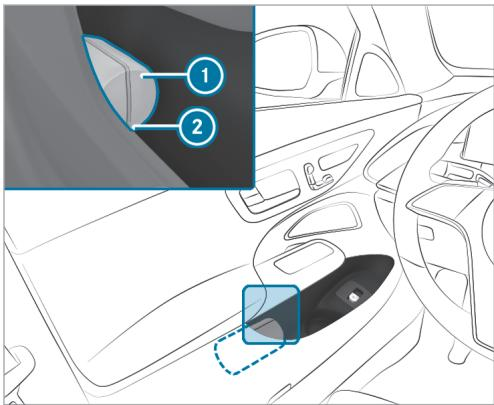

所有车门的车门储物箱内均设有安全背心储物槽，用于存放安全背心。

取出：使用拉环 $\textcircled{6}$ 拉出安全背心袋 $\textcircled{8}$ 打开安全背心袋 $\textcircled{8}$ 并取出安全背心。  
放回：折叠安全背心，将其卷起并插入安全背心袋 $\textcircled{6}$ 中。  
将安全背心袋?沿扶手下侧滑入安全背心储物槽中。确保拉环 $\textcircled{6}$ 悬挂在外，以方便抓握。

$\textcircled{1}$ 使用新的安全背心时，将其滑入安全背心储物槽之前，请先撕掉包装膜。否则，它可能会意外滑出，或包装可能会阻碍其取出。请遵守各个国家和地区的法律要求。

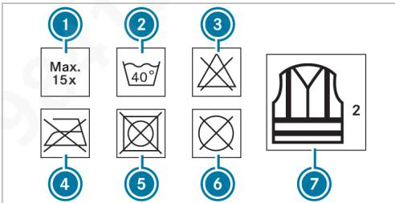

$\textcircled{6}$ 最多洗涤次数$\textcircled{6}$ 最高洗涤温度$\textcircled{6}$ 请勿漂白$\textcircled{6}$ 请勿熨烫$\textcircled{6}$ 请勿烘干$\textcircled{5}$ 请勿干洗$\textcircled{6}$ 2级安全背心

仅当安全背心尺寸正确且完全闭合，才能满足法定标准规定的要求。

在以下情况下请更换安全背心：

·荧光带受损或脏污。  
·超出允许的最多洗涤次数。  
·荧光特性降低，例如由于长期暴露在阳光下。

以环保方式处理安全背心：

·请联系当地的废物处理公司。

# 警告三角标志

# 架起警告三角标志

# 泄气的轮胎

# 取出警告三角标志

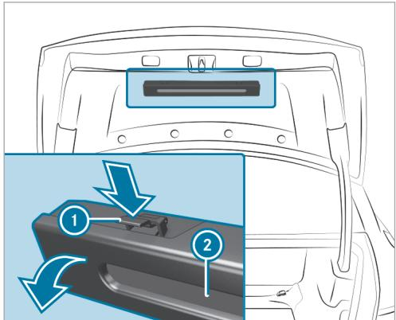

沿箭头指示的方向推动警告三角标志托架$\textcircled{8}$ 两侧并打开。

取出警告三角标志 $\textcircled{6}$ 。

警告三角标志位于行李箱盖内。

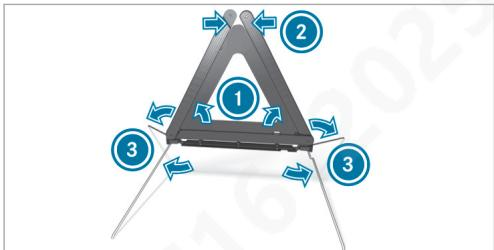

将侧面反光板 $\textcircled{4}$ 向上折起构成三角形，并用上部按扣 $\textcircled{6}$ 固定。  
将底座 $\textcircled{8}$ 撑开并放平。

# 有关泄气的轮胎的注意事项

# A 警告泄气的轮胎导致的事故风险

泄气的轮胎严重影响行驶特性以及转向和制动性能。

# 对于不带低压续跑特性的轮胎：

请勿使用泄气的轮胎驾驶。  
立即使用应急备用轮胎或备用轮胎更换泄气的轮胎。或者，请咨询具有资质的专业服务中心。

# 带低压续跑特性的轮胎：

请遵守带低压续跑特性（MOExtend）轮胎的信息和警告注意事项。

根据车辆配置的不同，轮胎泄气时，以下选择可用：

·配备补胎胶（TIREFIT）组件的车辆：可修补轮胎以短时间继续行车。为此，请使用补胎胶（TIREFIT）组件 第332页)。·配备梅赛德斯-奔驰智能互联的车辆：发生故障时，可通过上方控制面板拨打电话寻求道路救援 第305页)。·所有车辆：更换车轮 第357页)。

$\textcircled{1}$ 应急备用轮胎只在部分国家和地区适用第362页)。配备低压续跑轮胎（MOExtend）的车辆出厂时未配备补胎胶（TIREFIT）组件。如果将车辆改装为不带低压续跑特性的轮胎（例如冬季轮胎），也应为车辆配备补胎胶（TIREFIT）组件。您可从具有资质的专业服务中心获取补胎胶（TIREFIT）组件。

配备梅赛德斯-奔驰紧急呼叫系统但未配备补胎胶（TIREFIT）组件的车辆：轮胎泄气时，请咨询梅赛德斯-奔驰紧急呼叫系统客户救援中心。

# 补胎胶（TIREFIT）组件存放位置

# 非插电式混合动力车辆

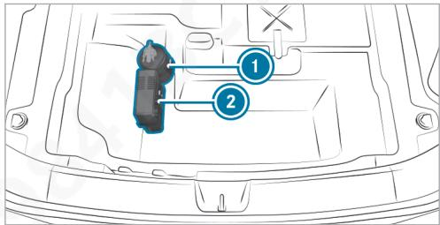

$\textcircled{6}$ 补胎胶瓶$\textcircled{6}$ 轮胎充气压缩机

在提供补胎胶（TIREFIT）组件的车辆上，交付时该设备位于行李箱底板下方。

$\textcircled{ i}$ 根据相应功率等级（LK），轮胎充气压缩机重量如下：

·LK2-12伏/15安、180瓦、0.9千克有关功率等级（LK）和/或电气数据的信息，请参见轮胎充气压缩机背面。轮胎充气压缩机免保养。如发生故障，请联系具有资质的专业服务中心。

# 使用补胎胶（TIREFIT）组件

# 要求：

·补胎胶瓶和轮胎充气压缩机已准备好供使用 第324页)。  
·有补胎胶（TIREFIT）标签显示。  
·有手套在手头上。

补胎胶（TIREFIT）组件存储位置：

第324页)

您可使用补胎胶（TIREFIT）封补最大4毫米的刺孔，特别是胎面上的刺孔。室外温度低至-20°C时，仍可使用补胎胶（TIREFIT）。

A 警告使用补胎胶时的事故风险轮胎密封胶可能无法完全密封轮胎，特别是在下列情况下：

·轮胎上有大的切口或刺孔（大于前面提到的损坏）  
·轮辋已损坏  
·在轮胎气压极低或轮胎泄气的情况下行车后请勿继续驾驶。请咨询具有资质的专业服务中心。

A 警告补胎胶造成的事故和中毒风险补胎胶有害健康并可造成刺激。请勿让其接触到您的皮肤、眼睛或衣物，切勿吞食。请勿吸入任何补胎胶气雾。将补胎胶放到儿童接触不到的地方。

接触到补胎胶时，请遵守以下各项：

立即用水冲洗皮肤上的补胎胶。如果补胎胶进入眼睛，立即使用干净的水彻底冲洗。

如果误吞了补胎胶，应立即彻底漱口并饮用大量清水。请勿催吐并立即就医。

立即更换沾到补胎胶的衣物。  
如果出现过敏反应，请立即就医。

<table><tr><td>！</td><td>注意事项电动充气泵运转太久导致过 热</td></tr><tr><td>分钟。</td><td>请勿使电动充气泵连续运转超过10</td></tr></table>

请遵守轮胎充气压缩机标签上的制造商安全说明。

请每5年到具有资质的专业服务中心更换补胎胶瓶。

切勿取出刺入轮胎的任何异物。

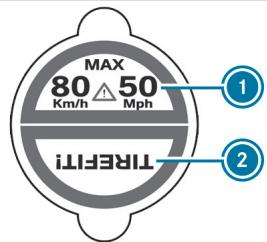

将补胎胶（TIREFIT）标签的 $\textcircled{6}$ 部分贴在仪表盘上驾驶员的视线范围内。

将补胎胶（TIREFIT）标签的 $\textcircled{6}$ 部分贴在故障轮胎车轮的气门嘴旁。

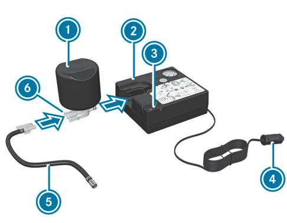

将带电缆的插头 $\textcircled{9}$ 和软管 $\textcircled{6}$ 从轮胎充气压缩机壳体中拉出。

将软管 $\textcircled{6}$ 插头推入补胎胶瓶 $\textcircled{8}$ 凸缘$\textcircled{5}$ 直至插头卡入位。

将补胎胶瓶 $\textcircled{6}$ 头部向下插入轮胎充气压缩机的凹槽内。

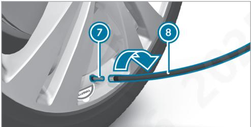

从故障轮胎的气门嘴 $\textcircled{6}$ 上拧下气门嘴帽。  
将加注软管 $\textcircled{9}$ 拧到气门嘴 $\textcircled{6}$ 上。  
将插头 $\textcircled{9}$ 插入车内的12 伏插座  
第123页)。  
开启车辆。  
按下轮胎充气压缩机上的开启/关闭开关$\textcircled{6}$ 。  
轮胎充气压缩机开启。轮胎充气。首先，将补胎胶注入轮胎内。气压可能会在短时间内升至约 500千帕（5巴/73磅/平方英寸）。

# 在此期间切勿关闭轮胎充气压缩机！

让轮胎充气压缩机运行最多10分钟。此后，轮胎气压应能达到最低200千帕（2.0 巴/29磅/平方英寸）。

如果补胎胶漏出，请确保尽快清洁受影响的区域。最好使用清水清洁。

如果衣服上沾有补胎胶，请尽快到干洗店用全氯乙烯清洗。

如果10分钟之后轮胎气压仍未达到 200千帕（2.0 巴/29磅/平方英寸）：

关闭轮胎充气压缩机。  
将加注软管从故障轮胎的气门嘴上松开。

请注意，拧开加注软管时补胎胶可能会漏出。

极为缓慢地向前行驶或倒车约10 米。再次给轮胎充气。最多10分钟后，轮胎气压必须至少为200 千帕（2.0巴/29 磅/平方英寸）。

A 警告未达到推荐的轮胎气压造成的事故风险

如果在规定时间过后未达到推荐的轮胎气压，则说明轮胎严重损坏。在这种情况下，补胎胶无法修补轮胎。

制动特性和行驶特性可能受到严重影响。

请勿继续驾驶。  
请咨询具有资质的专业服务中心。

# 如果10分钟之后轮胎气压达到200千帕（2.0巴/29磅/平方英寸）：

A 警告 使用封补的轮胎驾驶造成的事故凤险

暂时使用补胎胶封补的轮胎会影响操控性且不适用于高速行驶。

请相应调整您的驾驶方式并小心驾驶。  
使用轮胎密封胶修复的轮胎不能超过最大速度限制。使用由补胎胶封补的轮胎时，请遵守最高允许车速80公里/小时。  
将补胎胶（TIREFIT）标签上部粘贴在仪表盘上，以便驾驶员看到。

注意事项 泄漏的补胎胶形成的斑点使用后，多余的补胎胶可能从加注软管流出。

因此，请将加注软管放入补胎胶（TIREFIT）组件的塑料袋中。

# 环保说明弃置不当会造成环境污染

补胎胶含有污染物。

正确弃置用过的补胎胶瓶，如送至梅赛德斯-奔驰授权服务中心。

关闭轮胎充气压缩机。  
将加注软管从故障轮胎的气门嘴上松开。  
存放补胎胶瓶和轮胎充气压缩机。  
立即驾车起步。

行驶约10分钟后停车，使用轮胎充气压缩机检查轮胎气压。  
此时轮胎气压必须最低为130千帕  
（1.3巴/19磅/平方英寸）。

警告未达到推荐的轮胎气压造成的事故风险

如未达到推荐的轮胎气压，则轮胎可能严重损坏。在这种情况下，补胎胶无法修补轮胎。

制动特性和行驶特性可能受到严重影响。

请勿继续驾驶。  
请咨询具有资质的专业服务中心。

您可以在车内找到带梅赛德斯-奔驰24 小时服务电话的标签，例如在驾驶员侧的B柱上。

如果轮胎气压最低仍为130千帕（1.3巴/19 磅/平方英寸），请校正轮胎气压。请参见加油口盖板上轮胎气压表中的数值。

升高轮胎气压：开启轮胎充气压缩机。

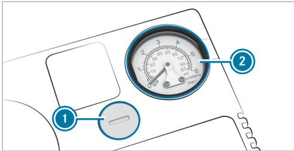

降低轮胎气压：按下气压计 $\textcircled{6}$ 旁边的气压释放按钮 $\textcircled{8}$ 。

如果轮胎气压符合推荐标准，则从已封补轮胎的气门嘴上松开加注软管。

将气门嘴帽拧在已封补轮胎的气门嘴上。

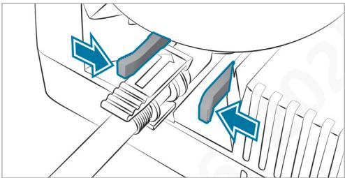

将补胎胶瓶从轮胎充气压缩机中拉出。同时按压黄色盖子上的锁止片以释放气压。加注软管仍留在补胎胶瓶上。  
请到最近的具有资质的专业服务中心更换轮胎、补胎胶瓶和加注软管。

# 蓄电池（车辆）

# 有关12伏蓄电池的注意事项

A 警告对蓄电池进行不正确的作业造成的事故风险

对蓄电池进行不正确的作业可造成短路等。这可能会限制与安全系统相关的功能，并损害车辆的操作安全性。

尤其是在以下情况下，您可能失去对车辆的控制：

·制动时  
·突然转向挪车时和/或未根据路面状况调节车速时发生短路或类似事故时，请立即联系具有资质的专业服务中心。切勿继续驾驶。务必在具有资质的专业服务中心进行与蓄电池相关的工作。

·有关防抱死制动系统（ABS）的详细信息，请参见 第197页)

·有关电控车辆稳定行驶系统（ESP?）的详细信息，请参见 第198页)

出于安全考虑，梅赛德斯-奔驰建议您只使用经梅赛德斯-奔驰认可适用于您车辆的蓄电池。

# 所有车辆(配备锂离子电池的车辆除外)

A 警告静电积累造成的爆炸风险静电积累可能会点燃蓄电池中高度易燃的混合气体。

如需释放可能积累的静电，请在处理蓄电池之前触摸金属车身。

为蓄电池充电和执行起动辅助时会产生高度易燃的混合气体。

A 警告蓄电池酸液造成的化学烧伤危险蓄电池酸液具有腐蚀性。

应避免皮肤、眼睛或衣物接触蓄电池酸液。

不要在蓄电池上方俯身。

请勿吸入蓄电池气体。  
将蓄电池放到儿童接触不到的地方。立即使用大量清水彻底冲洗蓄电池酸液并立即就医。

# 所有车辆

环保说明因电池处理不当造成的环境损害

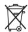

七电池含有污染物。将其与家庭垃圾一起处理是违法的。

以对环境负责的方式处理电池。将电量耗尽的电池送至具有资质的专业服务中心或废旧电池回收点。在任何已就蓄电池垃圾处理作出规定的地区，如本手册任何相关内容与该地区规定不一致的，以该地区的规定为准。

如有必要断开12伏蓄电池，请咨询具有资质的专业服务中心。

在处理蓄电池时，请遵守安全注意事项并采取防护措施。

如果12伏蓄电池使用不当，则有爆炸危险。

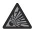

操作蓄电池时，严禁点火、使用明火及吸烟。避免产生火花。

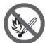

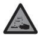

电解液或蓄电池酸液具有腐蚀性。应 避免皮肤、眼睛或衣物接触电解液或 酸液。请穿上合适的防护服，特别是 要佩戴防护手套、防护围裙和防护面 具。如果被电解液或酸液溅到，应立 即用大量清水冲洗。请咨询医生。

请勿在蓄电池表面放置重物或以任何方式使用蓄电池支撑人体。

佩戴防护眼镜。

远离儿童。

请务必遵守本使用说明书（用户手册）中的说明。

如打算长时间不使用车辆，请遵守以下注意事项：

·将蓄电池连接至经梅赛德斯-奔驰认可的蓄电池充电器或到具有资质的专业服务中心断开蓄电池。

# 有关48伏蓄电池的注意事项

A 警告 对蓄电池进行不正确的作业造成的事故风险

对蓄电池进行不正确的作业可造成短路等。这可能会限制与安全系统相关的功能，并损害车辆的操作安全性。

尤其是在以下情况下，您可能失去对车辆的控制：

·制动时

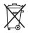

然转向挪车时和/或未根据路面状况 节车速时

发生短路或类似事故时，请立即联系具有资质的专业服务中心。

切勿继续驾驶。

务必在具有资质的专业服务中心进行与蓄电池相关的工作。

·有关防抱死制动系统（ABS）的详细信息，请参见 第197页)

·有关电控车辆稳定行驶系统（ $\mathsf { E S P } ^ { \mathtt { ( B ) } }$ ）的详细信息，请参见 第198页)

环保说明 因电池处理不当造成的环境损害

电池含有污染物。将其与家庭垃圾一起处理是违法的。

Li-ion以对环境负责的方式处理电池。将电量耗尽的电池送至具有资质的专业服务中心或废旧电池回收点。在任何已就蓄电池垃圾处理作出规定的地区，如本手册任何相关内容与该地区规定不一致的，以该地区的规定为准。

请务必在具有资质的专业服务中心执行有关48 伏蓄电池的作业。

在处理蓄电池时，请遵守安全注意事项并采取防护措施。

如果48伏蓄电池使用不当，则有爆炸危险。

48 伏蓄电池表面可能很热。

在处理蓄电池时，严禁点火、使用明火及吸烟。避免产生火花。

电解液或蓄电池酸液具有腐蚀性。应 避免皮肤、眼睛或衣物接触电解液或 酸液。请穿上合适的防护服，特别是 要佩戴防护手套、防护围裙和防护面 具。如果被电解液或酸液溅到，应立 即用大量清水冲洗。请咨询医生。

请勿在蓄电池表面放置重物或以任何方式使用蓄电池支撑人体。

请勿对蓄电池执行任何作业。请务必在具有资质的专业服务中心执行有关蓄电池的任何作业。请勿自行断开蓄电池。请勿自行拆卸蓄电池。请勿尝试打开蓄电池。

远离儿童。

od

佩戴防护眼镜。

请务必遵守本使用说明书（用户手册）中的说明。

如果您要长期闲置车辆，请咨询具有资质的专业服务中心。

# 高电压蓄电池注意事项

A危险高电压蓄电池内部压力过大有火灾和爆炸的风险。

如果车辆发生火灾，易燃气体可能会逸出并点燃。

如果出现异常气味、烟雾或烧伤痕迹，立即停止充电过程。  
立即离开危险区域。与危险区域保持足够的距离。  
呼叫消防救援机构。

请遵守有关为高电压蓄电池充电的注意事项 第177页)。

爆炸风险。

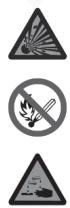

在处理蓄电池时，严禁点火、使用明火及吸烟。避免产生火花。

电解液或蓄电池酸液具有腐蚀性。应 避免皮肤、眼睛或衣物接触电解液或 酸液。请穿上合适的防护服，特别是 要佩戴防护手套、防护围裙和防护面 具。如果被电解液或酸液溅到，应立 即用大量清水冲洗。请咨询医生。

佩戴防护眼镜。

远离儿童。

请务必遵守本使用说明书（用户手册）中的说明。

# 有关起动辅助和为12伏蓄电池充电的注意事项

# 所有车辆

务必使用发动机舱中的跨接起动连接点为蓄电池充电以及执行跨接起动。

# 注意事项过电压造成的蓄电池损坏

使用不带最大充电电压的蓄电池充电器进行充电时，蓄电池或车载电子设备可能损坏。

仅可使用最大充电电压为14.8伏的蓄电池充电器。

# A警告氢气点燃引起的爆炸风险

如果出现短路或火花，则为蓄电池充电时存在氢气点燃风险。

请注意，已连接蓄电池的正极接线柱不要接触到车辆部件。  
请勿将金属物品或工具放置在蓄电池上。  
连接和断开蓄电池时，务必遵守所述的蓄电池接线柱顺序。  
执行起动辅助期间，务必仅连接极性相同的蓄电池接线柱。  
执行起动辅助期间，请遵守所述的跨接导线连接和断开顺序。  
切勿在发动机运转时连接或断开蓄电池接线柱。

A 警告 爆炸性气体混合物引起的爆炸风险

在充电和起动辅助过程中，爆炸性气体混合物会从蓄电池中逸出。

务必避免点火、使用明火、吸烟和引起火花。  
确保充分通风。  
请勿站在蓄电池上方。A 警告冻结的蓄电池造成的爆炸风险电量耗尽的蓄电池可能在温度稍稍高于或低于冰点时冻结。  
执行起动辅助或为蓄电池充电过程中，可能释放蓄电池气体。  
$\blacktriangleright$ 进行充电或执行起动辅助前，务必先解冻已冻结的蓄电池。

在温度较低时，如果仪表盘上的指示灯/警告灯未亮起，极可能是因为电量耗尽的蓄电池已被冻结。在这种情况下，切勿跨接起动车辆，也不得为蓄电池充电。

解冻蓄电池的使用寿命可能会大大缩短。起动性能可能会变差，特别是在温度较低时。

建议到具有资质的专业服务中心检查解冻的蓄电池。

# 插电式混合动力车辆

如已使用起动辅助启动车辆，则可能约30分钟无法使用电动驱动。  
起动辅助不作为正常操作状态。

# 所有车辆

<table><tr><td>！ 注意事项多次或长时间尝试启动发动 机造成的损坏</td></tr><tr><td>多次或长时间尝试启动发动机可能由于燃 油未燃烧导致催化转换器损坏。 避免多次或长时间尝试启动发动机。</td></tr></table>

执行起动辅助和为蓄电池充电时，请注意以下要点：

·仅使用具有足够横截面和绝缘接线柱夹的完好跨接导线/充电电缆。

·只要跨接导线/充电电缆连接至蓄电池/跨接起动连接点，切勿使接线柱夹的非绝缘零部件接触其他金属零部件。  
·跨接导线/充电电缆不得接触到发动机运转时可能移动的任何零部件。  
·确保您和蓄电池都不会带静电。  
·严禁点火并远离明火。  
·请勿站在蓄电池上方。

为蓄电池充电时，还请注意以下要点：

·仅可使用经梅赛德斯-奔驰测试并认可的充电器。  
·阅读充电器操作说明，然后为蓄电池充电。

起动辅助过程中，还请注意以下要点：

·仅可使用额定电压为12伏的车辆、蓄电池或其他跨接起动设备提供起动辅助。·切勿使车辆互相接触。·汽油发动机车辆：只能在发动机和排气系统处于冷态时才能跨接起动车辆。

# 起动辅助和为12伏蓄电池充电

# 准备起动辅助/充电

施加电动驻车制动固定车辆。  
将变速箱切换至档。  
将车辆熄火并关闭所有电气设备。  
开启发动机罩。

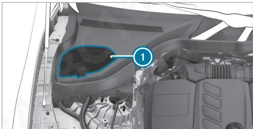

开启跨接起动连接点的护盖 $\textcircled{6}$ 。

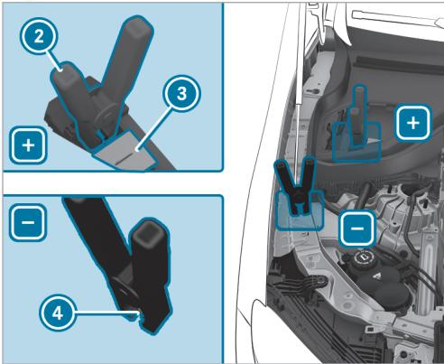

开启跨接起动连接点正极触点 $\textcircled{6}$ 的护盖$\textcircled{8}$ 。

# 起动辅助

使用跨接导线将本车的正极触点 $\textcircled{6}$ 连接至供电蓄电池的正极接线柱。务必先从本车的正极接线柱夹 $\textcircled{6}$ 开始操作。启动供电车辆的发动机并以怠速运转。

使用跨接导线将供电蓄电池的负极接线柱连接至本车接地点 $\textcircled{9}$ 。从供电蓄电池开始操作。  
启动本车的发动机。  
让发动机运转几分钟。  
断开跨接导线前，开启本车内的电气设备，例如后车窗加热器或照明。

当起动辅助步骤完成时：

首先从供电蓄电池的接地点 $\textcircled{6}$ 和负极接线柱上拆下跨接导线，然后从供电蓄电池的正极触点 $\textcircled{6}$ 和正极接线柱上拆下跨接导线。每次都要先从本车的连接点开始操作。  
拆下跨接导线后，关闭正极触点 $\textcircled{6}$ 的护盖 $\textcircled{8}$ 。  
关闭护盖 $\textcircled{8}$ 。

如已使用起动辅助启动车辆，则可能约30 分钟无法使用电动驱动。

有关详细信息，请咨询具有资质的专业服务中心。

# 充电

? 使用充电电缆将车辆的正极触点连接至充电器的正极接线柱。始终从车辆的正极触点 $\textcircled{6}$ 开始操作。  
? 使用充电电缆连接充电器的负极接线柱和车辆的接地点 $\textcircled{9}$ 。从充电器开始操作。开始充电过程。

充电过程完成时：

首先从充电器的接地点和负极接线柱上拆下充电电缆，然后从充电器的正极触点 $\textcircled{6}$ 和正极接线柱上拆下充电电缆。每次都要先从本车的连接点开始操作。拆下充电电缆后，关闭正极触点 $\textcircled{6}$ 的护盖 $\textcircled{8}$ 。? 关闭护盖 $\textcircled{8}$ 。

有关详细信息，请咨询具有资质的专业服务中心。

# 更换 12 伏蓄电池

请遵守有关12伏蓄电池的注意事项第336页)。

梅赛德斯-奔驰建议您到具有资质的专业服务中心（例如梅赛德斯-奔驰授权服务中心）更换12伏蓄电池。

如果您想自行更换蓄电池，请遵守以下注意事项：

·将故障蓄电池更换为符合特定车辆要求的蓄电池。车辆配备 AGM 技术蓄电池(Absorbent GlassMat)或锂离子电池。车辆所有功能的运行仅可通过AGM蓄电池或锂离子电池得以确保。出于安全考虑，梅赛德斯-奔驰建议您只使用经梅赛德斯-奔驰测试并认可适用于您车辆的蓄电池。  
·使用将要更换的蓄电池上的可拆卸部件，例如出风口软管、连接肘管或接线柱护盖。  
·确保出风口软管始终连接至蓄电池侧面的初始开口处。安装现有的或随附的任意止动塞。

否则，汽油或蓄电池酸液可能逸出。

·确保采用相同方式重新连接可拆卸部件。

# 牵引起动或牵引

# 允许的牵引方法 (非插电式混合动力车辆)

# 注意事项自动制动造成的损坏

如果以下功能开启，车辆在某些情况下会自主制动：

·主动式紧急制动  
·自适应巡航  
·保持（HOLD）功能  
·智能泊车

为避免损坏车辆，请关闭这些系统，例如在拖车或洗车前。

梅赛德斯-奔驰建议车辆发生故障时应运输车辆，而不要牵引。

注意 因牵引不当造成的车辆损坏请遵守有关牵引的说明和注意事项。

# 后轮驱动车辆

<table><tr><td rowspan=1 colspan=2>允许的牵引方式</td></tr><tr><td rowspan=1 colspan=1>前后轴着地</td><td rowspan=1 colspan=1>是，则以车速不超过50 公里/小时 牵引最多50公里</td></tr><tr><td rowspan=1 colspan=1>前轴升起</td><td rowspan=1 colspan=1>否</td></tr><tr><td rowspan=1 colspan=1>后轴升起</td><td rowspan=1 colspan=1>是，如果方向盘通过方向盘锁固定在中央位置</td></tr></table>

全时四轮驱动（4MATIC）车辆  

<table><tr><td rowspan=1 colspan=2>允许的牵引方式</td></tr><tr><td rowspan=1 colspan=1>前后轴着地</td><td rowspan=1 colspan=1>是，则以车速不超过50 公里/小时牵引最多50公里</td></tr><tr><td rowspan=1 colspan=1>前轴升起</td><td rowspan=1 colspan=1>香</td></tr><tr><td rowspan=1 colspan=1>后轴升起</td><td rowspan=1 colspan=1>香</td></tr></table>

在车轴升起的情况下进行牵引：应该由牵引公司进行牵引。

# 允许的牵引方式 (插电式混合动力车辆)

关于本车型应急救援的信息，详见随车交付的紧急救援卡。如果本部分内容存在与紧急救援卡不一致的内容，请以紧急救援卡为淮。

# 在前后轴着地的情况下牵引车辆

请遵守有关允许的牵引方法的注意事项。  
确保蓄电池已连接且已充电。

当蓄电池电量耗尽时，请注意以下要点：

·无法启动车辆。  
·无法解除或施加电动驻车制动  
·配备自动变速箱的车辆：变速箱无法挂入档或回档。

$\textcircled{ i}$ 配备自动变速箱的车辆：如果变速箱无法挂入N档，或如果显示屏上未显示任何信息，则应运输车辆(→第345页)。车辆运输需要配备升降设备的牵引车。

注意事项因高速或长距离牵引造成的损坏

高速或长距离牵引可能会损坏传动系统。

拖挂行驶速度切勿超过50 公里/小时。拖行距离切勿超过 50 公里。

A 警告牵引过重车辆时的事故风险如果要牵引起动或牵引的车辆重量超过您车辆的最大允许总质量，则可能会发生以下情况：

·拖车环可能脱开。  
·车辆/挂车组合可能会转向或倾翻。牵引起动或牵引前，检查要牵引起动或牵引的车辆重量是否超过最大允许总质量。

如果车辆必须牵引起动或牵引，则其最大允许总质量不得超过牵引车的最大允许总质量。

有关车辆的最大允许总质量的信息，请参见车辆铭牌 第358页)。

配备自动变速箱的车辆：请勿开启驾驶员侧车门或前排乘客侧车门，否则变速箱会自动挂入档。

安装拖车环 第358页)。

固定拖车环。

<table><tr><td></td><td>注意事项因牵引杆连接不当造成的损 坏</td></tr><tr><td>环上。</td><td>仅可将牵引缆绳或牵引杆连接到拖车</td></tr></table>

停用自动锁止机构 第83页)。

请勿启用保持（HOLD）功能。

停用主动式紧急制动 第 225页)。

配备自动变速箱的车辆：将变速箱切换至回档。

解除电动驻车制动。

警告 牵引过程中因安全相关功能受限导致的事故风险

在以下情况下，安全相关功能受限或不再可用：

·车辆关闭。  
·制动系统或动力转向系统发生故障。  
·电源或车载电气系统有故障。如果您的车辆正在被牵引，则转向和制动可能需要更大的力。  
此外，如果驾驶员显示屏出现故障，则无法看到重要的车辆显示信息。使用牵引杆。  
牵引前，确保驾驶员显示屏正常工作且转向系统可自由移动。

# 注意 因牵引力过大造成的损坏

如果车辆突然起步，则牵引力可能会过大，并可能会损坏车辆。

请缓慢平稳起步。

# 装载车辆进行运输

插电式混合动力车辆：车辆运输应仅由专业拖车公司进行。

请遵守有关牵引的注意事项  
第344页)。  
将牵引设备连接至拖车环以装载车辆。将自动变速箱切换至档。

$\textcircled{1}$ 发生电气系统损坏时，自动变速箱可能会锁止在回档。如需切换至，请为车载电气系统供电 第341页)。

将车辆正确装载到运输车上。  
·确保所有车轮处于运输表面上。  
·确保车辆与行驶方向平行。将换档杆换入回档。  
使用电动驻车制动器固定车辆，以防溜车。  
停车并切断电源。  
仅可通过车轮固定车辆。

全时四轮驱动（4MATIC）车辆/配备自动变速箱的车辆

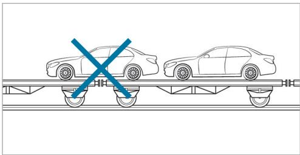

确保前后轴静止不动并在同一运输车上。

<table><tr><td>注意 由于车辆停放位置不当造成的传 动系统损坏</td></tr><tr><td>切勿将车辆置于运输车连接点上方。</td></tr></table>

# 拖车环存储位置

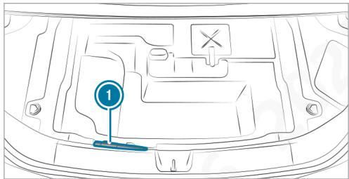

拖车环 $\textcircled{8}$ 位于行李箱底板下方后备箱门槛中。

# 安装和拆卸拖车环

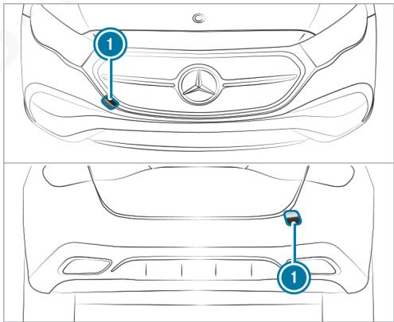

在标记处向内按压护盖 $\textcircled{8}$ 并取下。沿顺时针方向将拖车环拧入至止动位。拆下拖车环后，将护盖 $\textcircled{8}$ 重新安装到保险杠中。

注意事项未正确使用拖车环或挂车挂钩会损坏车辆

使用拖车环或挂车挂钩救援车辆时，可能会导致车辆受损。

仅使用拖车环或挂车挂钩牵引或牵引启动车辆。  
救援期间，请勿使用拖车环或挂车挂钩牵引车辆。

# 牵引起动车辆

# 配备自动变速箱的车辆

请注意以下有关零部件损坏的注意事项：

<table><tr><td>！ 注意因牵引起动造成的自动变速箱损 坏</td></tr><tr><td>牵引起动自动变速箱车辆过程中可能会损 坏自动变速箱。 ? 切勿牵引起动自动变速箱车辆。</td></tr></table>

# 保险丝

# 有关保险丝的注意事项

A警告导线过载造成的事故及伤害风险如果您操作或连接故障的保险丝或如果您使用电流值更高的保险丝进行更换，则电气导线可能过载。

这可能导致火灾。

务必使用电流值正确的指定新保险丝更换故障的保险丝。

# 注意事项不适当的保险丝造成的损坏

使用不适当的保险丝可能导致电气部件或系统损坏，或导致其功能严重受限。

仅使用经梅赛德斯-奔驰认可适用于梅赛德斯-奔驰车辆且具有相应规定额定值的保险丝。

用同等保险丝替换熔断的保险丝，可通过颜色和标签进行识别。保险丝额定值和需遵守的详细信息可从保险丝分配表中找到。

保险丝分配表：位于行李箱内的保险丝盒上第341页)。

# ■注意事项湿气导致的损坏或故障

湿气可能导致电气系统损坏或故障。

当保险丝盒开启时，确保无湿气进入保险丝盒。  
关闭保险丝盒时，确保盒盖密封件正确位于保险丝盒上。

如果新插入的保险丝也熔断，请到具有资质的专业服务中心找出原因并排除故障。

更换保险丝前，请确保做到以下各项：

·固定车辆，以防溜车。  
·所有电气设备已关闭。  
·车辆关闭。

保险丝位于以下各种保险丝盒中：

·发动机舱中驾驶员侧的保险丝盒第340页)  
·驾驶室中驾驶员侧的保险丝盒第341页)

·前排乘客侧脚部位置的保险丝盒第349页)·行李箱内的保险丝盒 第349页)

# 开启和关闭发动机舱内的保险丝盒

# 要求

·一块干布和一把螺丝刀可供使用。请遵守有关保险丝的注意事项第339页)。

# 开启

警告在发动机罩开启时使用风挡玻璃雨刮器造成的伤害风险

如果风挡玻璃雨刮器在发动机罩开启时开始移动，您可能会被雨刮器连杆夹住。

如果需要开启发动机罩，请务必先关闭风挡玻璃雨刮器和车辆。

开启发动机罩 第309页)。

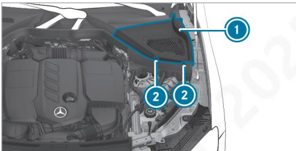

将驾驶员侧护盖 $\textcircled{6}$ 上的两个固定卡子沿顺时针方向转动四分之一圈。向上折起护盖 $\textcircled{8}$

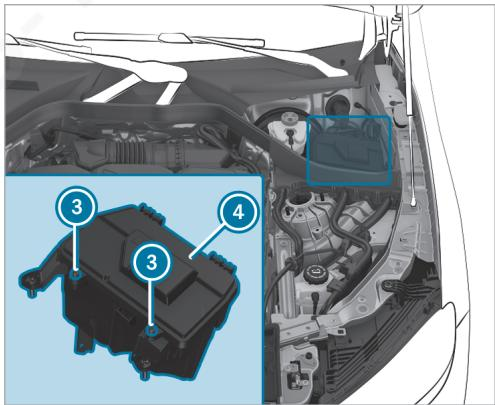

使用干布擦掉保险丝盒上的湿气。松开螺钉 $\textcircled{8}$ 并将保险丝盒盖 $\textcircled{9}$ 从顶部拆下。

# 关闭

检查密封件是否正确固定在盒盖 $\textcircled{9}$ 上。  
将盒盖 $\textcircled{9}$ 插入保险丝盒后部的支架中。  
折下保险丝盒盖 $\textcircled{9}$ 并拧紧螺钉 $\textcircled{8}$ 。

折下盒盖 $\textcircled{8}$ 。

将护盖 $\textcircled{6}$ 上的两个固定卡子 $\textcircled{6}$ 沿逆时针方向转动四分之一圈。

关闭发动机罩。

# 开启和关闭驾驶室内的保险丝盒

# 要求：

·请遵守有关保险丝的注意事项第 347页)。

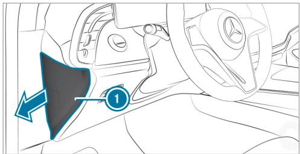

保险丝盒位于驾驶员侧驾驶室侧面上的护盖下方。

开启：沿箭头方向开启护盖 $\textcircled{6}$ 并将其取下。

关闭：重新插入护盖 $\textcircled{8}$ 。

梅赛德斯-奔驰建议您到梅赛德斯-奔驰授权服务中心开启保险丝盒。

# 开启和关闭前排乘客侧脚部位置的保险丝盒

#

请遵守有关保险丝的注意事项第347页)。

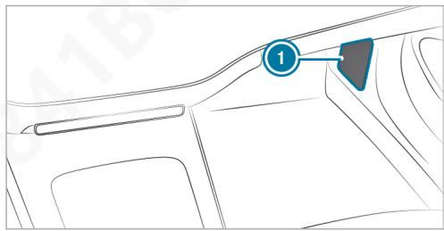

开启：展开并取下护盖 $\textcircled{8}$ 。

关闭：重新插入护盖 $\textcircled{8}$ 。

# 开启和关闭行李箱内的保险丝盒

# 要求

请遵守有关保险丝的注意事项第347页)。

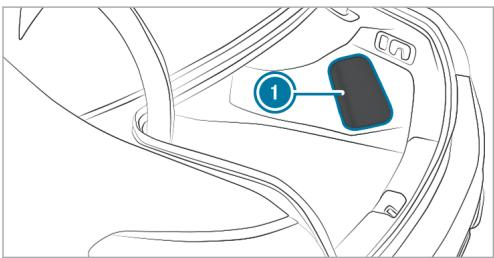

开启：展开并取下护盖 $\textcircled{8}$ 。  
关闭：重新插入护盖 $\textcircled{8}$ 。

# 有关噪音或异常操控性的注意事项

请确保车辆行驶时没有振动、噪音或异常的操控性。这可能表明车轮或轮胎已损坏。轮胎有暗伤也可能会导致操控性异常。

如果您怀疑轮胎故障，请立即降低车速并到具有资质的专业服务中心检查轮胎和车轮。

# 有关定期检查车轮和轮胎的注意事项

A 警告 损坏的轮胎造成的伤害风险损坏的轮胎可能造成轮胎气压流失。

定期检查轮胎有无损坏迹象并立即更换任何损坏的轮胎。

A 警告 由于胎面花纹不足造成的水滑风险

胎面花纹不足将导致轮胎抓地力减弱。存在事故风险。

在湿滑路面上，发生水滑现象的风险会增加，特别是在车速未根据路况进行调节的情况下。

应定期检查所有轮胎整个轮胎宽度的胎面花纹深度和轮胎接触面状况。

以下轮胎的最小胎面花纹深度·夏季轮胎：3毫米${ { \sf M } ^ { + } } { \sf S }$ 轮胎：4毫米出于安全考虑，请在达到国家法律、法规、国家标准和或行业标准规定的最小胎面花纹深度极限前更换轮胎。如果达到国家法律、法规、国家标准和或行业标准规定的最小胎面花纹深度极限，应立即更换轮胎。

所有车轮应至少一个月执行一次或在有需要时执行以下常规检查，例如长途行车前或越野驾驶前：

·检查轮胎气压 第351页)。  
·目视检查车轮及轮胎是否损坏。  
·检查气门嘴帽。目视检查整个轮胎宽度的胎面花纹深度和轮胎接触面状况。夏季轮胎的最小胎面花纹深度为3毫米，冬季轮胎则为4毫米。

# 有关防滑链的注意事项

A 警告 防滑链安装不当造成的事故风险如果在前轮上安装了防滑链，则其可能会刮擦车身或底盘组件。

请勿在前轮上安装防滑链。  
仅在后轮上成对安装防滑链。

注意事项安装的防滑链对车身或悬挂部件造成的损坏

在全时四轮驱动（4MATIC）车型的前轮上安装防滑链可能损坏车身或悬挂部件。

请仅在全时四轮驱动（4MATIC）车型的后轮上安装防滑链。

注意事项安装的防滑链对车轮装饰罩造成的损坏

在铝制轮毂上安装防滑链可能损坏车轮装饰罩。

安装防滑链之前，请将车轮装饰罩从铝制轮毂上取下。

使用防滑链时请遵守以下注意事项：

·防滑链仅允许用于某些车轮/轮胎组合。有关信息，请咨询梅赛德斯-奔驰服务中心。  
·出于安全考虑，请仅使用经梅赛德斯-奔驰专门认可适用于本车的防滑链或同等质量的防滑链。  
·请遵守防滑链制造商的安装说明。  
·如已安装防滑链，则最高允许车速为50 公里/小时。  
·配备智能泊车的车辆：已安装防滑链时请勿使用智能泊车。  
$\textcircled{1}$ 您可永久限制使用冬季轮胎行驶时的车速第206页)。  
$\textcircled{ i}$ 您可停用电控车辆稳定行驶系统（ESP?)以起步 第199 页)。这允许车轮空转，以增大牵引力。

# 启用或停用防滑链模式

MBUX智能人机交互系统：

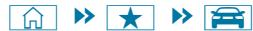

启用或停用防滑链模式。

当此功能启用时，车辆会按照已安装的防滑链进行调节。  
此外，当防滑链模式启用时，驾驶和驾驶安全系统的组件不可用。

# 轮胎气压

# 有关轮胎气压的注意事项

A 警告轮胎气压不足或过高造成的事故凤险

压力不足或过高的轮胎尤其可能造成下列危险：

·轮胎可能破裂。  
·轮胎可能过度和/或不均匀地磨损。  
·行驶以及转向和制动可能受到严重影响。

请遵守推荐的轮胎气压并检查包括备用轮胎在内的所有轮胎的轮胎气压：

·每月  
·载荷改变时  
，开始较长行程前  
·操作条件（如越野行驶）改变时  
·车速超过 250 公里/小时 时

根据需要调节轮胎气压。

较高或较低的轮胎气压可能：

·缩短轮胎的使用寿命。  
·导致轮胎损坏加剧。  
·对操控性造成不利影响并由此影响驾驶安全性，例如，由于水滑现象。

A 警告 轮胎气压反复下降造成的事故风险

车轮、气门嘴或轮胎可能损坏。  
轮胎气压过低可能导致轮胎爆裂。检查轮胎上是否有异物。

检查轮胎上是否有刺孔或气门嘴是否漏气。

如果您无法排除故障，请咨询具有资质的专业服务中心。

有关车辆原厂装配轮胎的推荐轮胎气压信息，请参见驾驶员侧B-柱上的轮胎气压表第352页)。

请使用适当的压力表检查轮胎气压。凭轮胎的外表无法可靠判定轮胎气压。

仅在轮胎处于冷态时校正轮胎气压。冷态轮胎条件：

·已驻车且轮胎未处于太阳直射范围内至少3个小时。·车辆已行驶距离不足1.6公里。

行驶时，车辆的轮胎变热。随着轮胎温度升高，轮胎气压也增大。

# 轮胎气压表

轮胎气压表位于驾驶员侧B柱上。

四 100 kPa = 1 bar0 0kPapsi kPapsiA2135843703 1234567轮胎气压表显示经梅赛德斯-奔驰认可适用于本车所有轮胎的推荐轮胎气压。推荐的轮胎气压适用于各种驾驶条件（例如载荷和／或车速）下的冷态轮胎。

如果一个或多个轮胎尺寸列于轮胎气压之前，则随后列出的轮胎气压信息仅对于此种轮胎尺寸有效。

如果先导轮胎尺寸带有补充性标识，则后续轮胎气压信息显示备选轮胎气压。这些轮胎气压可改善车辆的行驶舒适性。燃油消耗量可能因此稍稍增加。

表格中列出的"部分负载"和"满载"的负载状态根据不同的乘客人数和行李数量而定。实际座椅数量可能与此处不同。

同时，请务必遵守以下其他相关主题的信息：

·有关轮胎气压的注意事项 第351页)

# 轮胎气压监测系统

# 轮胎气压监测系统功能

系统通过轮胎气压传感器检查车辆上安装的轮胎的气压和温度。

轮胎气压和轮胎温度显示在驾驶员显示屏上。

如果轮胎气压流失明显或轮胎温度过高，将通过驾驶员显示屏上出现的显示信息

第446页)或警告灯向您发出警告第469页)。

轮胎气压监测系统仅是一种辅助工具。驾驶员有责任将轮胎气压设定为与驾驶条件相适应的推荐的冷态轮胎气压。

在多数情况下，更改轮胎气压后，轮胎气压监测系统会自动更新新的参考值。然而，您也可以通过手动重启轮胎气压监测系统更新参考值 第353页)。

# 系统限制

尤其是在以下情况下，系统可能会受影响或不起作用：

·自学习的参考值不正确。·异物等穿入轮胎造成气压突然流失·另一个无线电信号源造成故障时。

使用轮胎气压监测系统检查轮胎气压要求：

·车辆启动。

驾驶员显示屏：

保养按下OK进行确认。

出现以下所列信息中的一种：

·各个车轮的当前轮胎气压：

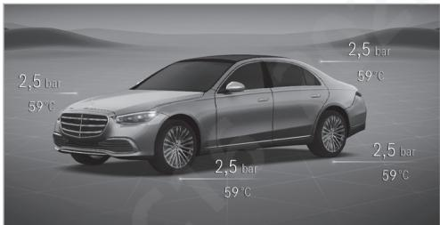

·轮胎气压将在行驶几分钟后显示：系统尚不知当前值。系统获知各个轮胎的气压/温度值后，会立即将其显示出来。

·轮胎气压监测器启用：系统自学习过程尚未完成。这表示已经在监测轮胎气压。

将当前轮胎气压与推荐用于当前操作条件的轮胎气压进行对比 $(  $ 第352页)。此外，请遵守有关冷胎的注意事项(→第351页)。

$\textcircled{ i}$ 驾驶员显示屏上显示的数值可能与轮胎气压计上的数值（海平面高度下测得的数值）存在差异。当车辆在高海拔地区时，用气压计测得的轮胎气压值会高于驾驶员显示屏显示的数值。

请牢记以下相关要点：

·有关轮胎气压的注意事项 第351页)

# 重新启动轮胎气压监测系统

# 要求：

·已根据4个车轮每一个相应的操作条件正确设定推荐的轮胎气压 第351页)。

在以下情况下，请重新启动轮胎气压监测系统：

·轮胎气压已更改。  
·车轮或轮胎已更换或重新安装。

# 驾驶员显示屏：

保养

显示轮胎气压：按下OK。  
显示选项：再次按下OK。

选择轮胎气压并通过「OK|确认。

驾驶员显示屏显示用当前轮胎气压作为新参考值?信息。

选择是并通过「OK确认重启。  
驾驶员显示屏显示轮胎气压监测器已重新启动信息。

当前警告信息被删除且黄色警告灯熄灭。

驾驶几分钟后，系统检查当前轮胎气压是否在指定范围内。随后当前轮胎气压将作为参考值并被监测。

如果轮胎气压值不在规定范围内，则会显示请校正轮胎气压信息。

请牢记以下相关要点：

·有关轮胎气压的注意事项 第351页)

# 车轮更换

# 有关选择、安装和更换轮胎的注意事项

A 警告不适当的车轮和轮胎尺寸造成的 事故风险

不适当的车轮，可以与其他零部件发生摩擦，存在导致受损及起火的风险。如果安装尺寸错误的车轮和轮胎，则行车制动器或制动器系统和车轮悬挂中的部件可能损坏。

务必将车轮和轮胎更换为符合原厂部件规格的车轮和轮胎。

对于车轮而言，请注意以下要点：

·名称·型号

对于轮胎而言，请注意以下要点：

·名称·制造商·型号

A警告超出规定的轮胎承重能力或允许速度等级造成的伤害风险

超出轮胎承载能力可能会损坏轮胎并造成爆胎。

因此，请仅使用经梅赛德斯-奔驰认可适用于您车型的轮胎类型和尺寸。请遵守轮胎承载能力等级和本车要求的速度等级。

注意事项 由未经梅赛德斯-奔驰认可的轮胎类型和尺寸造成的车辆和轮胎损坏

出于安全考虑，请仅使用经梅赛德斯-奔驰认可适用于本车的轮胎、车轮和附件。

这些轮胎专门针对防抱死制动系统（ABS）、电控车辆稳定行驶系统（ $\mathsf { E S P } ^ { \mathtt { ( B ) } }$ ）和全时四轮驱动（4MATIC）等主动安全系统进行过配置，并带有以下标记：

·MO $=$ 梅赛德斯-奔驰原装件

·MOE=梅赛德斯-奔驰原装件扩展型（具有低压续跑特性的轮胎，仅适用于特定车轮）  
·M01 $=$ 梅赛德斯-奔驰原装件（仅限特定AMG轮胎）

否则，行驶特性、车辆噪音排放、能耗等某些特性可能受到不利影响。此外，其他轮胎尺寸可能导致运输装载物时，轮胎与车身和车轴部件发生摩擦。这可能导致轮胎或车辆损坏。

请仅使用经梅赛德斯-奔驰检查和推荐的轮胎、车轮和附件。

# 注意事项使用翻新轮胎会危及驾驶安全

梅赛德斯-奔驰不测试也不推荐使用翻新轮胎，因为翻新轮胎既有的损坏有时不易被发现。

因此，无法保证驾驶安全。

如果您不了解旧轮胎之前的使用情况，切勿使用旧轮胎。

注意事项驶过障碍物时可能造成的车轮和轮胎损坏

大车轮的轮胎截面宽度较小。随着轮胎截面宽度减小，驶过障碍物时车轮和轮胎受损风险增加。

避开障碍物并特别小心地驾驶。  
驶过路缘、减速带、沙井盖和路坑时，请降低车速。  
特别要避开高路缘。

注意事项 停驻在路沿上或坑洼中可能对车轮和轮胎造成的损坏

停驻在路沿上或坑洼中可能损坏车轮和轮胎

尽可能停驻在水平表面上。  
停驻车辆时避开路沿和坑洼。

注意事项 因使用轮胎安装工具对电子零部件造成的损坏

配备轮胎气压监控系统的车辆：车轮中有电子零部件。

将轮胎安装工具放在气门嘴部位可能会损坏电子零部件。

不应在气门嘴部位使用轮胎安装工具。  
务必到具有资质的专业服务中心更换轮胎。

注意事项车外温度低对夏季轮胎造成的损坏

车外温度低时，使用夏季轮胎行驶时可能出现开裂，从而导致轮胎永久损坏。

当温度低于 $7 ^ { \circ } \mathrm { C }$ 时，使用 ${ { \sf M } ^ { + } } { \sf S }$ 轮胎。

使用未经梅赛德斯-奔驰认可适用于本车的选装配件或未正确使用选装配件都可能会影响操作安全。

购买和使用未经梅赛德斯-奔驰认可的配件前，请到具有资质的专业服务中心咨询：

·适用性   
·国家法律、法规、国家标准和或行业标准 规定   
·工厂的建议

# A警告运动型轮胎发生事故的风险

同时具有特殊胎面和优化橡胶的轮胎意味着在湿滑路面上的打滑或水滑风险增加。此外，在车外温度和轮胎运行温度低时，轮胎抓地力会大大降低。

开启电控车辆稳定行驶系统（ESP）并相应地调节您的驾驶方式。在车外温度低于 $7 ^ { \circ } \mathrm { C }$ 时，请使用${ { \sf M } ^ { + } } { \sf S }$ 轮胎。请仅使用符合预期用途的轮胎。

选择、安装和更换轮胎时，请遵守以下事项：

·国家和地区对轮胎认证的特定要求决定了车辆所用的具体轮胎类型。  
，建议在特定地区和行驶区域使用特定类型的轮胎。务必使用同一类型［夏季轮胎、冬季轮胎、带低压续跑特性（MOExtend）的轮胎］和同一品牌的轮胎和车轮。  
·务必在同一车轴（左侧和右侧）上安装同一尺寸的车轮。

仅在轮胎泄气的轮胎时安装其他尺寸的车轮以继续行驶至具有资质的专业服务中心。

·遵守车轮的车轮动平衡要求。  
·请勿改装制动系统、车轮或轮胎。禁止使用垫片或制动器防尘罩，否则可能会导致车辆一般行驶许可失效。配备轮胎气压监控系统的车辆：安装的所有车轮都必须装配功能正常的轮胎气压监控系统传感器。当温度低于 $7 ~ ^ { \circ } \mathrm { C }$ 时，应在所有车轮上使用冬季轮胎或标有M+S字样的四季轮胎。冬季轮胎可在寒冬路况下提供最佳抓地力。  
·对于 ${ { \sf M } ^ { + } } { \sf S }$ 轮胎，请仅使用相同胎面的轮胎。请遵守已安装的M+S 轮胎指定的最高允许速度。如果轮胎的最高允许速度低于车辆最高允许车速，则必须在驾驶员视线范围内使用适当标签予以指示。

·安装新轮胎后，以中等车速行驶第一个100公里。

·无论磨损是否严重，最多6年后必须更换轮胎。

·更换为未带轮胎低压续跑特性的轮胎时：配备低压续跑轮胎（MOExtend）的车辆出厂时未配备补胎胶（TIREFIT）组件。更换为未带低压续跑特性的轮胎（例如冬季轮胎）后，请为车辆装备补胎胶（TIREFIT）组件。

$\textcircled{1}$ 您可永久限制使用冬季轮胎行驶时的车速第206页)。

有关车轮和轮胎的详细信息，请联系具有资质的专业服务中心。

同时，请务必遵守以下其他相关主题的信息：

·有关轮胎气压的注意事项 第343页)·轮胎气压表 第344页)·车轮动平衡要求 第371页)·有关应急备胎的注意事项 第354页)

# 有关更换车轮的注意事项

A 警告车轮尺寸不同造成的伤害风险对换前后轮可能会严重损害驾驶特性，甚至因异常磨损引发起火风险。

盘式制动器或车轮悬挂部件也可能受损。

仅在车轮和轮胎具有相同尺寸的情况下才能交换前后车轮。

对换不同尺寸的前后车轮或轮胎可能导致车辆的一般行驶许可失效。  
请遵守"更换车轮"部分的说明和安全注意事项 第354页)。

前后车轮上的磨损分布存在差异：

·前轮轮胎胎肩磨损更严重·后轮轮胎中间磨损更严重切勿使用胎面花纹深度过小的轮胎行驶。轮胎在湿滑路面上的牵引力将明显降低（打滑现象）。

如果车辆使用的前后车轮尺寸相同，根据轮胎的磨损程度可以每隔

5,000 公里至10,000 公里对换一次车轮。确保车轮转动方向保持不变。

# 有关存放车轮的注意事项

存放车轮时，请遵守以下注意事项：

·拆下车轮后，将其存放在凉爽、干燥并最好是黑暗的地方。·避免轮胎接触油、油脂或燃油。

# 轮胎更换工具包概述

除某些特定国家和地区的车型外，车辆可能未配备轮胎更换工具包。请咨询具有资质的专业服务中心，了解更换您车辆的车轮所需的经梅赛德斯-奔驰认可的轮胎更换工具包。

更换车轮需要以下工具，例如：

·千斤顶 三角楔 ·车轮扳手 ·定心销

轮胎更换工具包位于行李箱的工具袋 $\textcircled{6}$ 中。

$\textcircled{1}$ 存放工具袋时，请确保将其固定牢固。

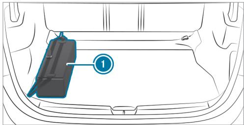

# 工具袋包含：

·千斤顶  
手套车轮扳手定心销  
·折叠式三角楔  
·千斤顶用棘轮扳手

# 准备车辆以更换车轮

#

·车辆未处于斜坡上。  
·车辆停驻在坚实、防滑的水平地面上。

·所需轮胎更换工具包可用。

$\textcircled{1}$ 如果您的车辆未配备轮胎更换工具包，请咨询具有资质的专业服务中心有关适当的工具。

手动施加电动驻车制动。  
将前轮置于正前位置。  
将变速箱切换至回档。

关闭车辆。

确保车辆无法启动。

将三角楔或其他合适的物体放置在与需要更换的车轮呈对角线的车轮的前后。

如有必要，请拆下轮毂装饰罩/轮盖第358页)。

升起车辆 第359页)。

# 拆卸和安装轮毂装饰罩/轮盖

#

·车辆已为更换车轮做好准备第357页)。

# 轮毂装饰罩

在配备铝制轮毂的车辆上，轮毂装饰罩罩着车轮螺栓。松开车轮螺栓前，请取下轮毂装饰罩。

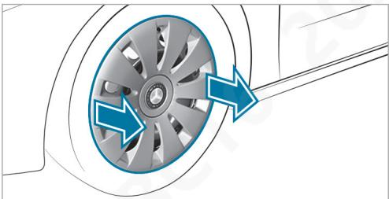

拆卸：用双手小心地抓住轮毂装饰罩的两处开口，然后将轮毂装饰罩拉出。

安装：将轮毂装饰罩放置到位并用力按压直至其啮合。

# 塑料轮盖

# 拆卸：

沿逆时针方向转动轮盖的中心盖并将其取下。

# 安装：

确保已沿逆时针方向转动轮盖的中心盖。将轮盖安放到位，然后沿顺时针方向转动中心盖，直至感觉到轮盖卡入位并听到其卡入位的声音。

# 铝制轮盖

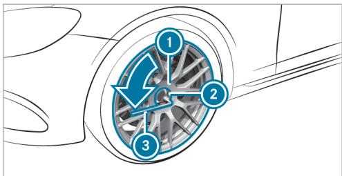

# 拆卸：

将轮胎更换工具包中的套筒 $\textcircled{6}$ 放在轮盖$\textcircled{8}$ 上。

将车轮扳手 $\textcircled{8}$ 放在套筒 $\textcircled{6}$ 上。使用车轮扳手 $\textcircled{6}$ 沿逆时针方向转动轮盖$\textcircled{6}$ 并将其取下。

# 安装：

请按照以上说明的相反顺序安装。$\textcircled{1}$ 规定的紧固扭矩：25牛顿米。

# 更换车轮时升起车辆

# 要求：

·车内无人。  
·车辆已准备就绪，可更换车轮第357页)。  
·车轮装饰罩和轮盖已拆下 第358页)。

有关使用千斤顶的重要注意事项：

·仅可使用经梅赛德斯-奔驰认可适用于您车辆的千斤顶升起车辆。  
·千斤顶仅用于在更换车轮时短时间升起和保持车辆，不用于在车底进行保养工作。  
千斤顶必须放置在坚实、平整、不打滑的路面上。必要时使用大型扁平承重防滑衬垫。  
·千斤顶基座必须垂直置于千斤顶支撑点下方。

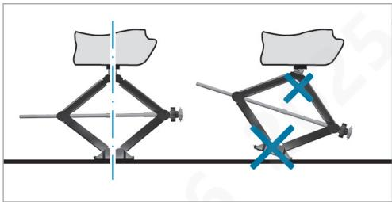

车辆升高时的行为原则：

·切勿将手脚置于车辆下方。  
）请勿躺在车底。  
，请勿启动车辆和解除电动驻车制动器。  
·请勿开启或关闭任意车门或行李箱盖。

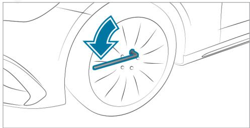

使用车轮扳手将需要更换的车轮上的车轮螺栓松开约一整圈。切勿将螺栓完全拧开。

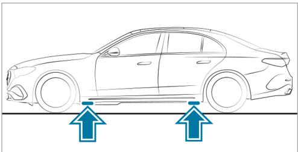  
千斤顶支撑点位置

警告 不恰当放置千斤顶造成的伤害风险

如未将千斤顶正确对准适当的支撑点，则车辆升起时千斤顶可能倾翻。

仅将千斤顶对准适当的车辆支撑点。千斤顶基座必须垂直置于车辆千斤顶支撑点下方。

# ■注意事项由千斤顶造成的车辆损坏

如果没有将千斤顶放在规定的千斤顶支撑点上，车辆可能受损。

请仅将千斤顶放在专用的千斤顶支撑点上。

从轮胎更换工具包中取出棘轮并将其放在千斤顶的六角螺母上，由此字母"AUF"可见。

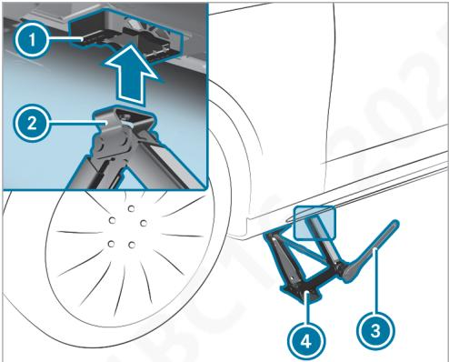

将千斤顶 $\textcircled{9}$ 支撑 $\textcircled{6}$ 放在千斤顶支撑点$\textcircled{6}$ 上。

沿顺时针方向转动棘轮 $\textcircled{6}$ ，直至支撑 $\textcircled{6}$ 完全位于千斤顶支撑点 $\textcircled{6}$ 上且千斤顶基座平稳地置于地面上。

转动棘轮， 直至轮胎升至离地面最高3 厘米的位置。

松开并移除车轮 第360页)。

# 拆下车轮

# 要求：

·车身已升高 第359页)。

更换车轮时，避免对制动盘施加任何力，这样会影响制动时的舒适程度。

注意事项更换车轮时对车轮塑料元件造成的损坏

拆卸和重新定位车轮时，可能会损坏车轮上的塑料元件。

拆卸和重新定位时，请勿通过塑料元件升高车轮。

<table><tr><td></td><td>注意事项车轮螺栓脏污造成的螺纹损 坏</td></tr><tr><td></td><td>请勿将车轮螺栓放置在沙地或脏污的 表面上。</td></tr></table>

完全拧下最上面的车轮螺栓。

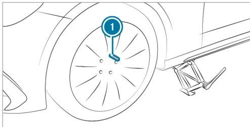

将定心销 $\textcircled{8}$ 拧入螺纹孔中，不要拧入车轮螺栓。

完全拧下余下的车轮螺栓。

移除车轮。

# 安装新车轮

# 要求：

·要更换的车轮已移除，且定心销已拧入第360页)。

# A 警告失去车轮造成的事故风险

涂抹了机油或润滑脂的车轮螺栓松动，甚至会导致车轮螺栓或轮毂螺纹损坏。

请勿为螺纹涂抹机油或润滑脂。

如果螺纹损坏，请立即联系具有资质的专业服务中心。

请更换损坏的车轮螺栓或损坏的轮毂螺纹。

请勿继续驾驶。

请遵守有关轮胎选择的信息

第 354页)。

对于带指定转动方向的车轮，轮胎侧壁上的箭头指示正确的转动方向。安装时，请遵守转动方向。

注意事项 更换车轮时对车轮塑料元件造成的损坏

拆卸和重新定位车轮时，可能会损坏车轮上的塑料元件。

拆卸和重新定位时，请勿通过塑料元件升高车轮。

将要安装的车轮滑到定心销上并将其推到位。

警告 由于拧紧车轮螺栓和螺母造成的伤害风险

如果您在车辆升起时拧紧车轮螺栓或车轮螺母，则千斤顶可能倾翻。

仅当车辆位于地面上时才可拧紧车轮螺栓或车轮螺母。

请遵守"更换车轮"部分的说明和安全注意事项 第354页)。

出于安全考虑，请仅使用经梅赛德斯-奔驰认可适用于相应车轮的车轮螺栓。

按标注的顺序以对角线的方式紧固车轮螺栓，力度要均匀，直至用手拧紧。

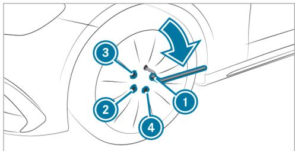

松开并移除定心销。  
拧上最后一个车轮螺栓，直至用手拧紧。降低车辆并用规定的拧紧扭矩拧紧车轮螺栓 第362页)。

# 更换车轮后降低车辆

# 要求：

·新车轮已安装 第361页)。

<table><tr><td>注意事项千斤顶被空气悬挂系统 （AIRMATIC）夹住的风险</td></tr><tr><td>如果升起车辆时空气悬挂系统 （AIRMATIC）释放空气，则当降低车辆 后，千斤顶可能被夹住。 启动发动机。这将调节车身水平高 度。</td></tr></table>

降低车身水平高度：将棘轮扳手放在千斤顶的六角螺母上，由此字母"AB"可见并沿逆时针方向转动。

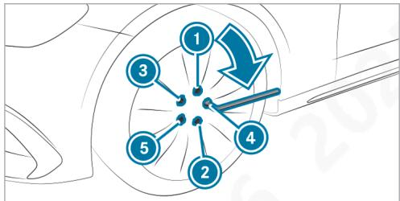

按照所示顺序（ $\textcircled{8}$ 至 $\textcircled{6}$ ）以交叉方式均匀拧紧车轮螺栓，初始最大力度为80 牛顿米。

按照所示顺序（ $\textcircled{8}$ 至 $\textcircled{6}$ ）以交叉方式均匀拧紧车轮螺栓，额定拧紧扭矩为150 牛顿米。

A 警告不适当的紧固扭矩造成的事故风险

如果车轮螺栓或车轮螺母未拧至规定紧固扭矩，则车轮可能松动。

确保车轮螺栓或车轮螺母拧紧至规定紧固扭矩。

如有必要，请勿移动车辆并咨询具有资质的专业服务中心。

检查新安装车轮的轮胎气压，必要时进行调节。

$\textcircled{1}$ 如果新车轮是应急备用轮胎，则以下内容不适用：

配备轮胎气压监控系统的车辆：重新启动轮胎气压监控系统 第353页)。

# 轮胎

不适用于插电式混合动力车辆：E260L、E260L4MATIC

R18

<table><tr><td rowspan=1 colspan=1>轮胎</td><td rowspan=1 colspan=1>车轮</td></tr><tr><td rowspan=1 colspan=1>BA:225/55 R18 102Y</td><td rowspan=1 colspan=1>BA:8Jx18 H2ET 32.5</td></tr></table>

R19

<table><tr><td rowspan=1 colspan=1>轮胎</td><td rowspan=1 colspan=1>车轮</td></tr><tr><td rowspan=1 colspan=1>FA:245/45 R19 102Y</td><td rowspan=1 colspan=1>FA:8.5Jx19 H2ET35.5</td></tr><tr><td rowspan=1 colspan=1>RA:275/40R19 105YF</td><td rowspan=1 colspan=1>RA: 9.5Jx19 H2 ET 51</td></tr></table>

# E300 L

R19   

<table><tr><td rowspan=1 colspan=1>轮胎</td><td rowspan=1 colspan=1>车轮</td></tr><tr><td rowspan=1 colspan=1>FA:245/45 R19 102YFA:8.5Jx19 H2ET35.5</td><td rowspan=1 colspan=1>FA:245/45 R19 102YFA:8.5Jx19 H2ET35.5</td></tr><tr><td rowspan=1 colspan=1>RA: 275/40 R19 105YRA: 9.5Jx19H2 ET 51</td><td rowspan=1 colspan=1>RA: 9.5Jx19 H2 ET 51</td></tr></table>

R20   

<table><tr><td rowspan=1 colspan=1>轮胎</td><td rowspan=1 colspan=1>车轮</td></tr><tr><td rowspan=1 colspan=1>FA:245/40 R20 99Y</td><td rowspan=1 colspan=1>FA:8.5Jx20H2 ET 35.5</td></tr><tr><td rowspan=1 colspan=1>RA: 275/35 R20 102YRA: 9.5Jx20H2 ET 51</td><td rowspan=1 colspan=1>RA: 9.5Jx20H2 ET 51</td></tr></table>

插电式混合动力车辆:

# E350eL

R19   

<table><tr><td rowspan=1 colspan=1>轮胎</td><td rowspan=1 colspan=1>车轮</td></tr><tr><td rowspan=1 colspan=1>FA:245/45 R19 102Y</td><td rowspan=1 colspan=1>FA:8.5Jx19 H2ET 35.5</td></tr><tr><td rowspan=1 colspan=1>RA:275/40R19 105Y</td><td rowspan=1 colspan=1>RA:9.5J19 H2 ET 51</td></tr></table>

# 应急备用轮胎

# 有关应急备胎的注意事项

A警告不适当的车轮和轮胎尺寸造成的 事故风险

应急备用轮胎或备用轮胎的车轮或轮胎尺寸以及轮胎型号与需要更换的车轮可能存在差异。应急备用轮胎或备用轮胎会严重损害车辆的行驶特性。

为防止出现危险情况：

请相应调整您的驾驶方式并小心驾驶。  
请勿安装超过一个以上的应急备用轮胎或尺寸不同的备用轮胎。  
仅短时间使用应急备用轮胎或备用轮胎。  
切勿停用电控车辆稳定行驶系统  
（ESP?） 。  
请到最近的具有资质的专业服务中心更换应急备用轮胎或备用轮胎。新车轮必须具备正确尺寸。

有关安装应急备胎的注意事项：

·安装应急备胎后的最高允许速度为80 公里/小时。  
·请勿安装带防滑链的应急备胎。无论磨损是否严重，最迟六年后必须更换应急备胎。  
·使用应急备胎随附的车轮螺栓。  
·安装应急备胎后，检查轮胎气压，必要时进行调节。

$\textcircled{ i}$ 额定轮胎气压标注在应急备胎标签上。

$\textcircled{ i}$ 配备轮胎气压监控系统的车辆：如已安装应急备胎，则轮胎气压监控系统无法正常运作。安装应急备胎后几分钟内，系统可能继续显示已移除车轮的轮胎气压。仅在使用新车轮更换应急备胎后，才可重启该系统。

也要注意以下方面：

·有关轮胎气压的注意事项 第351页)·轮胎气压表 第352页)  
·有关安装轮胎的注意事项 第354页)·安装应急备胎 第357页)

# 车载电子设备

# 有关擅自改动发动机电子设备的注意事项

# ■注意事项不恰当保养造成的过早磨损

不恰当保养可能会导致车辆部件磨损加快，并可能使车辆行驶许可失效。

务必到具有资质的专业服务中心进行发动机电子设备和相关部件的维修工作。

# 对讲机

# 有关安装对讲机的注意事项

A 警告未正确操作对讲机造成的事故风险

如果不正确地操作或改装对讲机，则对讲机的电磁辐射会干扰车辆电子设备并危及车辆的操作安全。

因此，请务必到具有资质的专业服务中心进行电子部件的工作。

# A警告对讲机操作不当造成的事故风险

如果您在车内不恰当使用对讲机，则其电磁辐射会干扰车辆的电子设备。以下情况将导致这种情况，尤其是：

·对讲机未连接至外部天线。  
·外部天线安装不正确或不是低反射天线。

这可能危害车辆的操作安全。

请到具有资质的专业服务中心安装低反射外部天线。  
在车内操作对讲机时，务必将其连接至低反射外部天线。

注意事项 由于未遵守有关安装和使用说明导致核准证无效

如未遵守对讲机的安装和使用说明，则可能会导致核准证失效。

仅使用经梅赛德斯-奔驰认可的波段。请遵守此波段的最大允许输出功率。仅使用经梅赛德斯-奔驰认可的天线位置。

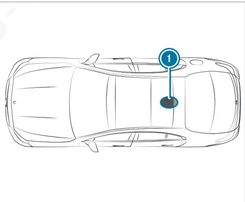

# 未配备全景式滑动天窗的车辆

后车顶区域

不允许在配备全景式滑动天窗的车辆上安装车顶天线。

改装对讲机时，应遵守技术规范ISO/TS21609《道路车辆-售后市场无线电频率发射设备安装用EMC 指南》。请遵守可拆卸部件的相关法规要求。

如果您的车辆配有对讲机预安装装置，则应使用预安装中提供的电源和天线接头。安装时请注意制造商的补充资料。

# ■对讲机传送功率

天线底座的最大传送功率（峰值）不得超出以下列表中的数值：

频带和最大传送功率  

<table><tr><td rowspan=1 colspan=2>频带                      最大传送功率</td></tr><tr><td rowspan=1 colspan=1>2米频带144-174兆赫</td><td rowspan=1 colspan=1>50瓦</td></tr><tr><td rowspan=1 colspan=1>陆地集群无线电（TETRA）380-460兆赫</td><td rowspan=1 colspan=1>10瓦</td></tr><tr><td rowspan=1 colspan=1>移动电话2G</td><td rowspan=1 colspan=1>2瓦</td></tr><tr><td rowspan=1 colspan=1>移动电话3G/4G/5G</td><td rowspan=1 colspan=1>0.5瓦</td></tr></table>

以下设备可不受限制地在车内使用：

·对讲机（最大传送功率为100毫瓦）  
·对讲机（发射频率在380-410 Mhz,最大传送功率为2W）[陆地集群无线电（TETRA）]  
·移动电话（2G/3G/4G/5G）

当天线放置在车外接收以下频带时，天线位置将不会受到限制：

·陆地集群无线电（TETRA） ·2G/3G/4G/5G

# 规范无线电信息

# 规范无线电标识/具体说明

有关基于无线电的车辆部件的制造商信息可以使用关键词"规范无线电信息"，在车辆的电子使用说明书（用户手册）中找到。有关详细信息和更新，请访问以下网址：

https://regulatoryradioinformation.corpinter.net/cn

# 有关比吸收率（SAR）的信息

有关比吸收率（SAR）的信息可以使用关键词“规范无线电信息"，在车辆的电子使用说明书（用户手册）中找到。

有关详细信息和更新，请访问以下网址：https://regulatoryradioinformation.corpinter.net/cn

# 车辆铭牌，车辆识别代号（VIN）和发动机号码概述

# 车辆铭牌

# 不适用于插电式混合动力车辆：

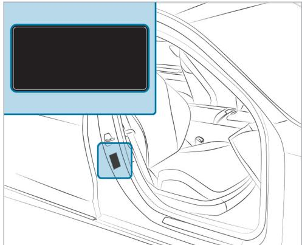

2 3北京奔驰汽车有限公司制造MADEBYBEIJINGBENZAUTOMGIVECO.TD.整车标志 乘坐人数mark xxxxxxXxxxxxxsas X 5发动机型号 到造年月engine typexxX XXX builtdate xXxxXXX  
Mere   
XXXXXXXXXXXXXXX0 9 8

# 插电式混合动力车辆：

Q000北京奔驰汽车有限公司制造整车型号XXXXXX xXxX 乘坐人数X整车标志XXXXX  
Mercodes-Benz发动机型号XXXXXX 制造年月XXXXXX  
梅赛斯-奔驰牌动力电池系统额定容量XA  
DX.X% 动电xxxkW  
发动机最大净功率XXX 发动机排量XXXXmL  
最大允许总质量XXXX动力池系统额定电压 中国制造 车XXXXXXXxXXX XX14 3 12 10 9

$\textcircled{8}$ 车辆制造商$\textcircled{6}$ 整车标志$\textcircled{6}$ 发动机型号$\textcircled{6}$ 乘坐人数$\textcircled{6}$ 制造年月$\textcircled{5}$ 整车型号$\textcircled{6}$ 最大允许总质量$\textcircled{9}$ 发动机最大净功率$\textcircled{9}$ 发动机排量$\textcircled{1}$ 车辆识别代号

$\textcircled{1}$ 图示中的数据为示例，以所交付车辆的车辆铭牌为准。

$\textcircled{8}$ 车辆制造商整车型号整车标志? 发动机型号乘坐人数制造年月

动力电池系统额定容量驱动电机峰值功率

O 动力电池系统额定电压发动机排量? 车辆识别代号驱动电机型号? 发动机最大净功率$\textcircled{4}$ 最大允许总质量

$\textcircled{ i}$ 图示中的数据为示例，以所交付车辆的车辆铭牌为准。

# 副驾驶座椅横梁上的车辆识别代号（VIN)

$\textcircled{6}$ 压印的车辆识别代号（VIN）$\textcircled{6}$ 底板护面

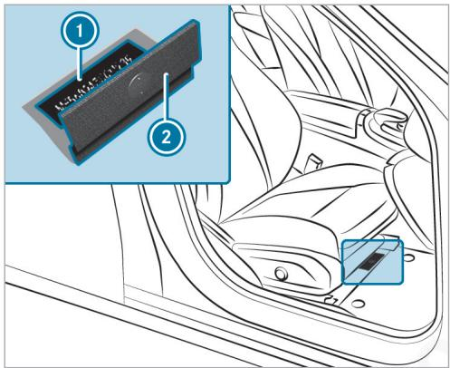  
$\textcircled{8}$ 车辆识别代号（VIN）标签

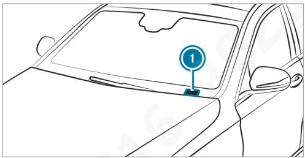  
风挡玻璃下边缘上的车辆识别代号（VIN)

# 读取车辆识别代号（VIN)

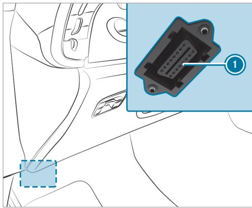

例如也可使用通用扫描工具通过诊断接口 $\textcircled{6}$ 读取车辆识别代号（VIN）。遵守警告和安全注意事项 第33页)。

# 发动机号码

不适用于插电式混合动力车辆：E260L、E260L4MATIC、E300L：发动机号码和出厂编号 (电动机号码和编号)刻印在发动机缸体上;标有发动机号码和出厂编号(电动机号码和编号)的标志位于发动机进气管上面。

插电式混合动力车辆：

E350eL：发动机号码和出厂编号刻印在发动机缸体上，驱动电机号码和编号刻印在变速箱左侧；标有发动机号码和出厂编号的标志位于发动机进气管上面，标有驱动电机号码和编号的标志位于变速箱壳体上。

有关详细信息，请咨询具有资质的专业服务中心。

883963 \* 30648888 \*A 004 584 35 38 1234567$\textcircled{ i}$ 图示中的发动机号码为示例。每辆车的发动机号码不尽相同，可能与此处显示的发

动机号码存在差异。

# 工作液

# 关于工作液的注意事项

A 警告有害工作液导致受伤的风险

工作液可能有毒。

使用、储存和弃置工作液时，请注意相应原装容器上的说明。  
始终将工作液保存在密封的原装容器中。  
始终让儿童远离工作液。

环保说明 因不负责任地弃置工作液而造成环境污染

工作液弃置不当会严重破坏环境。  
? 请以环保方式弃置工作液。

工作液包括以下液体：

·燃油·润滑油·冷却液

·制动液  
·风挡玻璃清洗液  
·智能气候控制系统制冷剂

仅可使用经梅赛德斯-奔驰认可的产品。梅赛德斯-奔驰保修或善意保修不包含因使用未经梅赛德斯-奔驰认可的产品而造成的损坏。

通过容器上的以下文字可辨别经梅赛德斯-奔驰认可的工作液：

·MB-Freigabe（例如 MB-Freigabe 229.51）·MB-Approval（例如 MB-Approval 229.51）

有关经梅赛德斯-奔驰认可的工作液的详细信息，可通过以下方式获取：

·在梅赛德斯-奔驰的操作规范中，关于工作液的要求必须符合标签上所列的详细信息。请访问 https://operatingfluids.mercedes-benz.com  
·具有资质的专业服务中心

A 警告 燃料引发的火灾或爆炸风险燃料高度易燃。

务必避免点火、使用明火、吸烟和引起火花。加油前和加油过程中，关闭车辆发动机和驻车加热器（如有安装）。

A 警告 燃油有造成伤害的风险燃油有毒并会危害健康。

切勿吞下燃油或者使其接触皮肤、眼晴或衣物。  
不要吸入燃油气雾。  
将燃油放到儿童接触不到的地方。  
加注时使车门和车窗保持关闭。

如果您或他人接触到燃油，请遵守以下事项：

立即用肥皂和清水彻底冲洗皮肤上的燃油。  
如果眼睛接触了燃油，应立即用清水彻底洗净，然后立即就医。  
如果吞入燃油，应立即就医。不要引吐。  
立即更换沾到燃油的衣物。

灵活燃料车辆可以加注以下燃料类型：

·高级无铅汽油  
·E85燃料  
·E85 燃料和高级无铅汽油的混合物

灵活燃料车辆可以通过加油口盖板内侧的乙醇不超出 E85标签来识别。

根据国家和地区的不同，您车辆可使用的燃料可能与使用说明书（用户手册）中的信息有所不同。有关经梅赛德斯-奔驰认可适用于您车辆的燃料，请参见加油口盖板内侧的信息标签。

# 燃油

# ■关于汽油发动机车辆燃油质量的信息

请遵守有关工作液的注意事项第368页)。

# 注意事项使用不恰当燃油造成的损坏

即使误加少量的不适当燃油也会损坏燃油系统、发动机和排放控制系统。

仅可加注火花点火式发动机低硫燃油。

火花点火式发动机燃油的乙醇含量（体积比）可以高达 $2 5 \%$ 。

有关适用燃油的信息，请参见加油口盖板上的信息标签。

有关适用燃油的详细信息，请咨询具有资质的专业服务中心。

切勿加注以下任何类型的燃油：

·柴油  
·乙醇含量超过您的车辆的推荐值的汽油  
、甲醇含量（体积比）超过 $3 \%$ 的汽油，例如M15、M30、M50、M85、M100  
·含金属添加剂的汽油

如不慎添加了错误的燃油：

请勿开启车辆。  
请咨询梅赛德斯-奔驰授权服务中心。

如果可用燃油的硫含量不够低，则可能产生异味。

有关推荐的辛烷值，请参见加油口盖板上的信息标签 第174页)。

# $\textcircled{ i}$ 配备M256M汽油发动机的车辆：

用辛烷值为95RON 的汽油，可能会有轻微的性能限制，但不会产生进一步的影响。

在无推荐燃油供应的情况下，也可以暂时使用辛烷值至少为92RON的普通无铅汽油。

这可能会降低发动机输出功率并增加燃油消耗量。

切勿加注辛烷值 RON 更低的汽油。

有关燃油的详细信息，请咨询加油站或具有资质的专业服务中心。

# ■关于汽油添加剂的信息（汽油发动机车辆)

请遵守有关工作液的注意事项

第368页)。

<table><tr><td>注意事项使用不适当添加剂造成的损 坏</td></tr><tr><td>即使误加少量的不适当添加剂也会导致故</td></tr></table>

障出现。

仅向燃油中添加梅赛德斯-奔驰推荐的清洁添加剂。

使用低品质燃油的主要问题之一是，会在汽油燃烧过程中产生积碳。梅赛德斯-奔驰建议您使用含有添加剂的品牌燃油。如果您长期使用不含这些添加剂的燃油，可能会造成积碳。

这会导致发动机运行故障，例如：

·发动机预热时间较长   
·怠速不均匀   
·发动机噪音   
·逆火   
·功率损耗

如果未使用含所需添加剂的汽油，则会产生积碳。在这种情况下，梅赛德斯-奔驰建议使用经梅赛德斯-奔驰认可适用于梅赛德斯-奔驰车辆的添加剂。

梅赛德斯-奔驰建议您使用含有添加剂的品牌燃油。

某些国家所用燃油可能不含有足够的添加剂，从而可能导致燃油喷射系统中形成积碳。在这种情况下，经向具有资质的专业服务中心咨询之后，可以在燃油中添加梅赛德斯-奔驰推荐的清洁添加剂。务必遵守容器上的说明和标注的混合比。

$\textcircled{1}$ 有关推荐的添加剂的详细信息，请咨询梅赛德斯-奔驰授权服务中心。

# 燃油箱容积

不适用于插电式混合动力车辆：

插电式混合动力车辆：  

<table><tr><td rowspan=1 colspan=1>车型</td><td rowspan=1 colspan=1>总容积</td></tr><tr><td rowspan=1 colspan=1>E260L</td><td rowspan=1 colspan=1>66升</td></tr><tr><td rowspan=1 colspan=1>E 260 L 4MATIC</td><td rowspan=1 colspan=1>66升</td></tr><tr><td rowspan=1 colspan=1>E300L</td><td rowspan=1 colspan=1>66升</td></tr></table>

<table><tr><td colspan="2">车型 总容积</td></tr><tr><td>E350eL</td><td>50升</td></tr></table>

# 发动机油

# 1关于发动机油的注意事项

请遵守有关工作液的注意事项第368页)。

Mercedes-Benz Oilrecommended注意事项不适当的机油滤清器、机油或添加剂造成的发动机损坏

请勿使用不符合保养时间间隔明确规定的发动机油或机油滤清器。  
请勿改变发动机油或机油滤清器以延长规定的更换时间间隔。  
切勿使用添加剂。  
在规定的时间间隔过后更换发动机油。

梅赛德斯-奔驰建议您在具有资质的专业服务中心更换机油。

仅可使用经梅赛德斯-奔驰认可适用于您车辆的发动机油。

# 发动机油质量和加注量

仅使用 SAE0W-20 粘度等级发动机油。

$\textcircled{ i}$ 如无表中所列发动机油可用，您仅可一次添加最多1.0升MB认可229.51、229.52、229.61或ACEAC5发动机油。

# 不适用于插电式混合动力车辆：

发动机油加注量  

<table><tr><td rowspan=1 colspan=2>车型                         加注量</td></tr><tr><td rowspan=1 colspan=1>E260L</td><td rowspan=1 colspan=1>6升</td></tr><tr><td rowspan=1 colspan=1>E 260 L 4MATIC</td><td rowspan=1 colspan=1>6升</td></tr><tr><td rowspan=1 colspan=1>E300L</td><td rowspan=1 colspan=1>6升</td></tr></table>

插电式混合动力车辆：

发动机油加注量  

<table><tr><td rowspan=1 colspan=1>车型</td><td rowspan=1 colspan=1>加注量</td></tr><tr><td rowspan=1 colspan=1>E350eL</td><td rowspan=1 colspan=1>5.3升</td></tr></table>

关于特定的加注量，请参考含机油滤清器的换油量。

# 有关制动液的注意事项

请遵守有关工作液的注意事项第360页)。

A 警告 制动系统中形成气穴造成的事故凤险

制动液不断吸收空气中的水分。这降低了制动液的沸点。如果沸点过低，则在强力制动时，制动系统中可能形成气穴。

这会削弱制动效果。

请按照规定的时间间隔更新制动液。

请定期到具有资质的专业服务中心更换制动液。

仅可使用经梅赛德斯-奔驰认可符合MB认可331.0要求的制动液。

# 冷却液

# ■关于冷却液的注意事项

请遵守关于工作液的注意事项第368页)。

A 警告 防冻剂造成的失火及伤害风险如果防冻剂接触到发动机舱的高温部件，可能会被点燃。

添加防冻剂前，先让发动机冷却。确保无防冻剂从机油加注口旁溢出。启动车辆前，请彻底清除零部件上的任何防冻剂。

# 注意事项不适当的冷却液造成的损坏

只能使用预先混合了规定防冻剂的冷却液。

有关冷却液的信息，请参见以下位置：

·梅赛德斯-奔驰工作液规格320.1访问 https://operatingfluids.mercedes-benz.com

·在具有资质的专业服务中心

# 注意事项车外温度较高时过热

如果使用不适当的冷却液，则无法有效防止冷却系统在车外温度较高时过热和腐蚀。

仅可使用经梅赛德斯-奔驰认可的冷却液。

请遵守梅赛德斯-奔驰工作液规格320.1中的说明。

注意事项不适当的风挡玻璃清洗液对车外照明的损坏

请到具有资质的专业服务中心定期更换冷却液。

冷却系统中防冻浓缩液的比例：

# 关于风挡玻璃清洗液的注意事项

请遵守有关工作液的注意事项第368页)。

·至少 $5 0 \%$ （防冻保护低至约 $- 3 7 ~ ^ { \circ } \mathrm { C }$ ）·最多 $5 5 \%$ （防冻保护低至约 $- 4 5 ~ ^ { \circ } \mathrm { C }$ ）

A警告风挡玻璃清洗浓缩液造成的烧伤或伤害风险

风挡玻璃清洗浓缩液高度易燃。如果接触到发热的发动机部件或排气系统，风挡玻璃清洗浓缩液可能会被点燃。

确保风挡玻璃清洗浓缩液不会溢出到加注口附近。

全年均需要将清洗液与风挡玻璃清洗液混合。

不适当的风挡玻璃清洗液可能损坏车外照明的塑料表面。

请仅使用同样适用于塑料表面的风挡玻璃清洗液，例如MB SummerFit或MB WinterFit。

<table><tr><td>1</td><td>注意事项混合风挡玻璃清洗液造成的 喷嘴阻塞</td></tr><tr><td></td><td>请勿将MB SummerFit和MBWinterFit 与其他风挡玻璃清洗液混合。</td></tr></table>

请勿使用蒸馏水或去离子水。否则，可能会误触发液位传感器。

推荐的风挡玻璃清洗液：

·高于冰点：例如 MB SummerFit·低于冰点：例如 MB WinterFit

有关正确的混合比，请参见防冻剂容器上的信息。

# 制冷剂

# ■关于制冷剂的注意事项

请遵守关于工作液的注意事项第368页)。

！ 注意事项不适当的制冷剂造成的损坏如果使用未经梅赛德斯-奔驰认可的制冷剂，则智能气候控制系统可能损坏。

仅使用R-134a 制冷剂。

<table><tr><td>注意事项不适当的制冷压缩机油造成 的智能气候控制系统损坏</td></tr><tr><td>仅使用经梅赛德斯-奔驰认可的制冷</td></tr><tr><td>压缩机油。</td></tr><tr><td>请勿将经梅赛德斯-奔驰认可的制冷 压缩机油与不同的制冷压缩机油混合。</td></tr></table>

请仅到具有资质的专业服务中心进行与智能气候控制系统相关的工作。必须遵守所有适用法规以及SAE（美国工程师协会标准）中的J639 标准。

智能气候控制系统的制冷剂类型和制冷剂压缩机油（PAG机油）信息标签位于发动机罩内侧。

6 R-134a xxx ± 10g   
5 GWP:1430 A XXX XX XX XX (PAG) Mercedes-Benz AG自 SAE J639 AXXX XXX XX XX

信息标签

$\textcircled{8}$ 危险和保养警告符号$\textcircled{6}$ 制冷剂加注容积$\textcircled{6}$ 适用标准$\textcircled{9}$ PAG 机油零件号

$\textcircled{6}$ 所用制冷剂的GWP值（全球变暖潜能值）

$\textcircled{5}$ 制冷剂型号符号 $\textcircled{8}$ 表示：

·可能存在危险  
·应到具有资质的专业服务中心进行保养工作

# 制冷剂和 PAG 机油加注量

不适用于插电式混合动力车辆：

<table><tr><td rowspan=1 colspan=1>车型</td><td rowspan=1 colspan=1>制冷剂</td></tr><tr><td rowspan=1 colspan=1>E260L</td><td rowspan=1 colspan=1>630克</td></tr><tr><td rowspan=1 colspan=1>E 260 L 4MATIC</td><td rowspan=1 colspan=1>630克</td></tr><tr><td rowspan=1 colspan=1>E300L</td><td rowspan=1 colspan=1>630克</td></tr></table>

<table><tr><td rowspan=1 colspan=2>车型                        PAG 机油</td></tr><tr><td rowspan=1 colspan=1>E260L</td><td rowspan=1 colspan=1>80毫升</td></tr><tr><td rowspan=1 colspan=1>E 260 L 4MATIC</td><td rowspan=1 colspan=1>80毫升</td></tr><tr><td rowspan=1 colspan=1>E300L</td><td rowspan=1 colspan=1>80毫升</td></tr></table>

插电式混合动力车辆：  

<table><tr><td rowspan=1 colspan=1>车型</td><td rowspan=1 colspan=1>制冷剂</td></tr><tr><td rowspan=1 colspan=1>E350eL</td><td rowspan=1 colspan=1>660克</td></tr><tr><td rowspan=1 colspan=1>车型</td><td rowspan=1 colspan=1>PAG 机油</td></tr><tr><td rowspan=1 colspan=1>E350eL</td><td rowspan=1 colspan=1>160毫升</td></tr></table>

# 车辆数据

# 车辆尺寸

各项数值均依据GB1589-2016《汽车、挂车及汽车列车外廓尺寸、轴荷及质量限值进行测量与核准。已将所有原厂装配的可拆卸配件的尺寸考虑在内，除依据GB1589-2016《汽车、挂车及汽车列车外廓尺寸、轴荷及质量限值》规定的不在测量范围内的装置。

标明的高度可能因以下因素而不同：

·轮胎  
·载荷  
·悬挂系统的状态  
·选装装备

# 不适用于插电式混合动力车辆：

车辆尺寸   

<table><tr><td rowspan=1 colspan=2>E 260 L</td></tr><tr><td rowspan=1 colspan=1>车辆长度</td><td rowspan=1 colspan=1>5,092毫米</td></tr><tr><td rowspan=1 colspan=1>车辆宽度</td><td rowspan=1 colspan=1>1,880毫米</td></tr><tr><td rowspan=1 colspan=1>车辆高度</td><td rowspan=1 colspan=1>1,493毫米</td></tr><tr><td rowspan=1 colspan=1>轴距</td><td rowspan=1 colspan=1>3,094毫米</td></tr></table>

<table><tr><td rowspan=1 colspan=2>E 260 L 4MATIC</td></tr><tr><td rowspan=1 colspan=1>车辆长度</td><td rowspan=1 colspan=1>5,092毫米</td></tr><tr><td rowspan=1 colspan=1>车辆宽度</td><td rowspan=1 colspan=1>1,880毫米</td></tr><tr><td rowspan=1 colspan=1>车辆高度</td><td rowspan=1 colspan=1>1,493毫米</td></tr><tr><td rowspan=1 colspan=1>轴距</td><td rowspan=1 colspan=1>3,094毫米</td></tr></table>

<table><tr><td rowspan=1 colspan=2>E 300 L</td></tr><tr><td rowspan=1 colspan=1>车辆长度</td><td rowspan=1 colspan=1>5,092毫米</td></tr><tr><td rowspan=1 colspan=1>车辆宽度</td><td rowspan=1 colspan=1>1,880 毫米</td></tr><tr><td rowspan=1 colspan=1>车辆高度</td><td rowspan=1 colspan=1>1,493毫米</td></tr><tr><td rowspan=1 colspan=1>轴距</td><td rowspan=1 colspan=1>3,094毫米</td></tr></table>

# 插电式混合动力车辆：

车辆尺寸   

<table><tr><td rowspan=1 colspan=2>E 350 e L</td></tr><tr><td rowspan=1 colspan=1>车辆长度</td><td rowspan=1 colspan=1>5,092毫米</td></tr><tr><td rowspan=1 colspan=1>车辆宽度</td><td rowspan=1 colspan=1>1,880毫米</td></tr><tr><td rowspan=1 colspan=1>车辆高度</td><td rowspan=1 colspan=1>1,489毫米</td></tr><tr><td rowspan=1 colspan=1>轴距</td><td rowspan=1 colspan=1>3,094毫米</td></tr></table>

根据指令GB1589-2016，车辆尺寸不将以下可拆卸部件考虑在内：

车辆长度  

<table><tr><td rowspan=1 colspan=1>不考虑的可拆卸部件</td><td rowspan=1 colspan=1>在车上的位置</td></tr><tr><td rowspan=1 colspan=1>突出部分小于50 毫米的大灯/车灯</td><td rowspan=1 colspan=1>前部和后部</td></tr><tr><td rowspan=1 colspan=1>突出部分小于50毫米的排气管</td><td rowspan=1 colspan=1>后排</td></tr><tr><td rowspan=1 colspan=1>突出部分小于50 毫米的可拆卸牵引设备</td><td rowspan=1 colspan=1>前部和后部</td></tr></table>

车辆宽度  

<table><tr><td rowspan=1 colspan=1>不考虑的可拆卸部件</td><td rowspan=1 colspan=1>在车上的位置</td></tr><tr><td rowspan=1 colspan=1>突出部分小于50 毫米的大灯/车灯</td><td rowspan=1 colspan=1>左侧和右侧</td></tr><tr><td rowspan=1 colspan=1>车外后视镜</td><td rowspan=1 colspan=1>左侧和右侧</td></tr><tr><td rowspan=1 colspan=1>突出部分小于50毫米的排气管</td><td rowspan=1 colspan=1>左侧和右侧</td></tr></table>

车辆高度  

<table><tr><td>不考虑的可拆卸部 件</td><td>在车上的位置</td></tr><tr><td>天线弹性部分</td><td>车顶</td></tr></table>

# 重量和载荷

各项数值均依据GB1589-2016《汽车、挂车及汽车列车外廓尺寸、轴荷及质量限值》进行测量与核准。已将所有原厂装配的可拆卸配件的尺寸考虑在内，除依据国家标准GB1589-2016《汽车、挂车及汽车列车外廓尺寸、轴荷及质量限值》规定的不在测量范围内的装置。

选装装备不仅会增加整备质量，还会减小有效载荷。

不适用于插电式混合动力车辆：  

<table><tr><td rowspan=1 colspan=2>E 260 L</td></tr><tr><td rowspan=1 colspan=1>整备质量</td><td rowspan=1 colspan=1>1,890千克</td></tr><tr><td rowspan=1 colspan=1>最大允许总质量</td><td rowspan=1 colspan=1>2,470千克</td></tr><tr><td rowspan=1 colspan=1>前轴轴荷</td><td rowspan=1 colspan=1>1,130千克</td></tr><tr><td rowspan=1 colspan=1>后轴轴荷</td><td rowspan=1 colspan=1>1,340千克</td></tr></table>

<table><tr><td rowspan=1 colspan=2>E 260 L 4MATIC</td></tr><tr><td rowspan=1 colspan=1>整备质量</td><td rowspan=1 colspan=1>1,995千克</td></tr><tr><td rowspan=1 colspan=1>最大允许总质量</td><td rowspan=1 colspan=1>2,540千克</td></tr><tr><td rowspan=1 colspan=1>前轴轴荷</td><td rowspan=1 colspan=1>1,200千克</td></tr><tr><td rowspan=1 colspan=1>后轴轴荷</td><td rowspan=1 colspan=1>1,340千克</td></tr></table>

<table><tr><td rowspan=1 colspan=2>E 300 L (BJ7205RL)</td></tr><tr><td rowspan=1 colspan=1>整备质量</td><td rowspan=1 colspan=1>1,930千克</td></tr><tr><td rowspan=1 colspan=1>最大允许总质量</td><td rowspan=1 colspan=1>2,520千克</td></tr><tr><td rowspan=1 colspan=1>前轴轴荷</td><td rowspan=1 colspan=1>1,170千克</td></tr><tr><td rowspan=1 colspan=1>后轴轴荷</td><td rowspan=1 colspan=1>1,350千克</td></tr></table>

插电式混合动力车辆：  

<table><tr><td rowspan=1 colspan=2>E 300 L (BJ7205RL 1)</td></tr><tr><td rowspan=1 colspan=1>整备质量</td><td rowspan=1 colspan=1>1,950千克</td></tr><tr><td rowspan=1 colspan=1>最大允许总质量</td><td rowspan=1 colspan=1>2,520千克</td></tr><tr><td rowspan=1 colspan=1>前轴轴荷</td><td rowspan=1 colspan=1>1,170千克</td></tr><tr><td rowspan=1 colspan=1>后轴轴荷</td><td rowspan=1 colspan=1>1,350千克</td></tr></table>

<table><tr><td rowspan=1 colspan=2>E 350 e L</td></tr><tr><td rowspan=1 colspan=1>整备质量</td><td rowspan=1 colspan=1>2,255千克</td></tr><tr><td rowspan=1 colspan=1>最大允许总质量</td><td rowspan=1 colspan=1>2,800千克</td></tr><tr><td rowspan=1 colspan=1>前轴轴荷</td><td rowspan=1 colspan=1>1,200）千克</td></tr><tr><td rowspan=1 colspan=1>后轴轴荷</td><td rowspan=1 colspan=1>1,600）千克</td></tr></table>

# 驱动系统类型、输出功率和爬坡度

驱动系统类型、车速、输出功率、扭矩和爬坡度

不适用于插电式混合动力车辆：  

<table><tr><td rowspan=1 colspan=2>E 260 L</td></tr><tr><td rowspan=1 colspan=1>驱动类型</td><td rowspan=1 colspan=1>后轮驱动</td></tr><tr><td rowspan=1 colspan=1>最大设计车速</td><td rowspan=1 colspan=1>233公里/小时</td></tr><tr><td rowspan=1 colspan=1>最大净功率/转速</td><td rowspan=1 colspan=1>150千瓦/5,800转/分</td></tr><tr><td rowspan=1 colspan=1>额定功率/转速</td><td rowspan=1 colspan=1>150千瓦/5,800转/分</td></tr><tr><td rowspan=1 colspan=1>最大扭矩/转速</td><td rowspan=1 colspan=1>320 牛米/1,600-4,000转/分</td></tr><tr><td rowspan=1 colspan=1>最大爬坡度1</td><td rowspan=1 colspan=1>30%</td></tr></table>

1最大爬坡度测试条件如下：

·在干燥路面上·在车辆允许总质量范围内·变速箱处于第一档

<table><tr><td rowspan=1 colspan=2>E 260 L 4MATIC</td></tr><tr><td rowspan=1 colspan=1>驱动类型</td><td rowspan=1 colspan=1>全轮驱动</td></tr><tr><td rowspan=1 colspan=1>最大设计车速</td><td rowspan=1 colspan=1>230公里/小时</td></tr><tr><td rowspan=1 colspan=1>最大净功率/转速</td><td rowspan=1 colspan=1>150千瓦/5,800转/分</td></tr><tr><td rowspan=1 colspan=1>额定功率/转速</td><td rowspan=1 colspan=1>150千瓦/5,800转/分</td></tr><tr><td rowspan=1 colspan=1>最大扭矩/转速</td><td rowspan=1 colspan=1>320 牛米/1,600-4,000转/分</td></tr><tr><td rowspan=1 colspan=1>最大爬坡度</td><td rowspan=1 colspan=1>30%</td></tr></table>

<table><tr><td rowspan=1 colspan=2>E 300 L</td></tr><tr><td rowspan=1 colspan=1>驱动类型</td><td rowspan=1 colspan=1>后轮驱动</td></tr><tr><td rowspan=1 colspan=1>最大设计车速</td><td rowspan=1 colspan=1>245公里/小时</td></tr><tr><td rowspan=1 colspan=1>最大净功率/转速</td><td rowspan=1 colspan=1>190千瓦/5,800转/分</td></tr><tr><td rowspan=1 colspan=1>额定功率/转速</td><td rowspan=1 colspan=1>190千瓦/5,800转/分</td></tr><tr><td rowspan=1 colspan=1>最大扭矩/转速</td><td rowspan=1 colspan=1>400牛米/2,000-3,200转/分</td></tr><tr><td rowspan=1 colspan=1>最大爬坡度1</td><td rowspan=1 colspan=1>30%</td></tr></table>

插电式混合动力车辆：  

<table><tr><td rowspan=1 colspan=2>E 350 e L</td></tr><tr><td rowspan=1 colspan=1>驱动类型</td><td rowspan=1 colspan=1>后轮驱动</td></tr><tr><td rowspan=1 colspan=1>最大设计车速</td><td rowspan=1 colspan=1>234 公里/小时</td></tr><tr><td rowspan=1 colspan=1>最大净功率/转速（内燃机）</td><td rowspan=1 colspan=1>150千瓦/6,100转/分</td></tr><tr><td rowspan=1 colspan=1>最大净功率/转速（驱动电机）</td><td rowspan=1 colspan=1>115千瓦/6,800转/分</td></tr><tr><td rowspan=1 colspan=1>额定功率/转速（内燃机）</td><td rowspan=1 colspan=1>150千瓦/6,100转/分</td></tr></table>

1最大爬坡度测试条件如下：

·在干燥路面上·在车辆允许总质量范围内·变速箱处于第一档

制动系统的磨损极限  

<table><tr><td rowspan=1 colspan=1>额定功率/转速（驱动电机）</td><td rowspan=1 colspan=1>47千瓦/2,100转/分或65千瓦/4,000转/分</td></tr><tr><td rowspan=1 colspan=1>最大扭矩/转速（内燃机）</td><td rowspan=1 colspan=1>320 牛米/2,000-4,000转/分</td></tr><tr><td rowspan=1 colspan=1>最大爬坡度1</td><td rowspan=1 colspan=1>30%</td></tr></table>

<table><tr><td rowspan=1 colspan=2>所有车型</td></tr><tr><td rowspan=1 colspan=1>制动踏板自由行程的合理范围</td><td rowspan=1 colspan=1>5-10毫米</td></tr><tr><td rowspan=1 colspan=1>制动摩擦副的合理使用范围</td><td rowspan=1 colspan=1>2.8-3毫米</td></tr></table>

# 车轮定位值

车轮定位值因车型和车辆状况而异。有关车轮定位值详情，请参见附录（→第497页）。

车轮动平衡要求  

<table><tr><td>车型</td><td>车轮动平衡要求 （最大设计车速超 过 100 公里/小时 的车辆)</td></tr><tr><td>所有车型</td><td>8克</td></tr></table>

推荐的轮胎气压   

<table><tr><td rowspan=1 colspan=1>车型</td><td rowspan=1 colspan=1>轮胎气压</td></tr><tr><td rowspan=1 colspan=1>所有车型</td><td rowspan=1 colspan=1>200-350千帕</td></tr></table>

# 燃油消耗量

# 不适用于插电式混合动力车辆：

以下数值已按照国家标准GB/T19233《轻型汽车燃料消耗量试验方法》以及国家标准18352《轻型汽车污染物排放限值及测量方法》进行测量。

<table><tr><td rowspan=1 colspan=2>E 260 L</td></tr><tr><td rowspan=1 colspan=1>整车燃油消耗量低速段</td><td rowspan=1 colspan=1>8.99升/100公里</td></tr><tr><td rowspan=1 colspan=1>整车燃油消耗量-中速段</td><td rowspan=1 colspan=1>6.22升/100公里</td></tr><tr><td rowspan=1 colspan=1>整车燃油消耗量-高速段</td><td rowspan=1 colspan=1>5.11升/100公里</td></tr><tr><td rowspan=1 colspan=1>整车燃油消耗量-超高速段</td><td rowspan=1 colspan=1>5.95升/100公里</td></tr><tr><td rowspan=1 colspan=1>整车燃油消耗量-综合</td><td rowspan=1 colspan=1>6.15升/100公里</td></tr><tr><td rowspan=1 colspan=1>机动车整车出厂时所达到的排放水平</td><td rowspan=1 colspan=1>技术上满足国家第六阶段排放标准</td></tr></table>

<table><tr><td colspan="2" rowspan="1">E 260 L 4MATIC</td></tr><tr><td colspan="1" rowspan="1">整车燃油消耗量-低速段</td><td colspan="1" rowspan="1">9.75升/100公里</td></tr><tr><td colspan="1" rowspan="1">整车燃油消耗量-中速段</td><td colspan="1" rowspan="1">6.64升/100公里</td></tr><tr><td colspan="1" rowspan="1">整车燃油消耗量-高速段</td><td colspan="1" rowspan="1">5.39升/100公里</td></tr><tr><td colspan="1" rowspan="1">整车燃油消耗量-超高速段</td><td colspan="1" rowspan="1">6.45升/100公里</td></tr><tr><td colspan="1" rowspan="1">整车燃油消耗量-综合</td><td colspan="1" rowspan="1">6.60升/100公里</td></tr><tr><td colspan="1" rowspan="1">机动车整车出厂时所达到的排放水平</td><td colspan="1" rowspan="1">技术上满足国家第六阶段排放标准</td></tr><tr><td colspan="2" rowspan="1">E 300 L(BJ7205RL)</td></tr><tr><td colspan="1" rowspan="1">整车燃油消耗量-低速段</td><td colspan="1" rowspan="1">9.48升/100公里</td></tr><tr><td colspan="1" rowspan="1">整车燃油消耗量-中速段</td><td colspan="1" rowspan="1">6.63升/100公里</td></tr><tr><td colspan="1" rowspan="1">整车燃油消耗量-高速段</td><td colspan="1" rowspan="1">5.53升/100公里</td></tr><tr><td colspan="1" rowspan="1">整车燃油消耗量-超高速段</td><td colspan="1" rowspan="1">6.29升/100公里</td></tr><tr><td colspan="1" rowspan="1">整车燃油消耗量-综合</td><td colspan="1" rowspan="1">6.55升/100公里</td></tr><tr><td colspan="1" rowspan="1">机动车整车出厂时所达到的排放水平</td><td colspan="1" rowspan="1">技术上满足国家第六阶段排放标准</td></tr></table>

<table><tr><td rowspan=1 colspan=2>E 300 L(BJ7205RL1)</td></tr><tr><td rowspan=1 colspan=1>整车燃油消耗量-低速段</td><td rowspan=1 colspan=1>9.87升/100公里</td></tr><tr><td rowspan=1 colspan=1>整车燃油消耗量-中速段</td><td rowspan=1 colspan=1>6.77升/100公里</td></tr><tr><td rowspan=1 colspan=1>整车燃油消耗量-高速段</td><td rowspan=1 colspan=1>5.52升/100公里</td></tr><tr><td rowspan=1 colspan=1>整车燃油消耗量-超高速段</td><td rowspan=1 colspan=1>6.35升/100公里</td></tr><tr><td rowspan=1 colspan=1>整车燃油消耗量-综合</td><td rowspan=1 colspan=1>6.65升/100公里</td></tr><tr><td rowspan=1 colspan=1>机动车整车出厂时所达到的排放水平</td><td rowspan=1 colspan=1>技术上满足国家第六阶段排放标准</td></tr></table>

# 插电式混合动力车辆：

以下数值已按照国家标准 GB/T19753-2013《轻型混合动力电动汽车能量消耗量试验方法》进行测量。

<table><tr><td rowspan=1 colspan=2>E 350 e L</td></tr><tr><td rowspan=1 colspan=1>整车燃油消耗量低速段</td><td rowspan=1 colspan=1>6.17升100公里</td></tr><tr><td rowspan=1 colspan=1>整车燃油消耗量-中速段</td><td rowspan=1 colspan=1>7.07升100公里</td></tr><tr><td rowspan=1 colspan=1>整车燃油消耗量-高速段</td><td rowspan=1 colspan=1>5.94升100公里</td></tr><tr><td rowspan=1 colspan=1>整车燃油消耗量-超高速段</td><td rowspan=1 colspan=1>6.77升100公里</td></tr><tr><td rowspan=1 colspan=1>整车燃油消耗量-综合</td><td rowspan=1 colspan=1>1.06升100公里</td></tr><tr><td rowspan=1 colspan=1>机动车整车出厂时所达到的排放水平</td><td rowspan=1 colspan=1>技术上满足国家第六阶段排放标准</td></tr></table>

# 座椅尺寸

不适用于插电式混合动力车辆：座椅靠背的正常使用位置

<table><tr><td rowspan=1 colspan=2>座椅所在排                   角度E 260 L</td></tr><tr><td rowspan=1 colspan=1>第一排</td><td rowspan=1 colspan=1>25°</td></tr><tr><td rowspan=1 colspan=1>第二排</td><td rowspan=1 colspan=1>26°</td></tr></table>

<table><tr><td rowspan=1 colspan=1>座椅所在排E 260 L 4MATIC</td><td rowspan=1 colspan=1>角度</td></tr><tr><td rowspan=1 colspan=1>第一排</td><td rowspan=1 colspan=1>25°</td></tr><tr><td rowspan=1 colspan=1>第二排</td><td rowspan=1 colspan=1>26°</td></tr></table>

<table><tr><td rowspan=1 colspan=2>座椅所在排                   角度E 300 L</td></tr><tr><td rowspan=1 colspan=1>第一排</td><td rowspan=1 colspan=1>25°</td></tr><tr><td rowspan=1 colspan=1>第二排</td><td rowspan=1 colspan=1>26°</td></tr></table>

插电式混合动力车辆：座椅靠背的正常使用位置

<table><tr><td rowspan=1 colspan=2>座椅所在排                   角度E350 e L</td></tr><tr><td rowspan=1 colspan=1>第一排</td><td rowspan=1 colspan=1>25°</td></tr><tr><td rowspan=1 colspan=1>第二排</td><td rowspan=1 colspan=1>26°</td></tr></table>

# 各排座椅之间的距离

根据GB7258-2017第4.4.2.2条的注3测量各排座椅之间的距离。此规定也适用于：

·第一排座椅和第二排座椅之间的距离：驾驶员座椅和前排乘客座椅必须位于座椅纵向调节范围内的中间位置以及对于靠背角度可调节的座椅，前排座椅靠背必须处于最靠前的使用位置，而后排座椅靠背必须处于最靠后的使用位置，或处于相应的设计位置角度。或者  
·对于靠背角度不可调节的座椅，座椅靠背处于安装位置。

# 座垫宽度

根据 GB7258-2017第4.4.2.2条的注4测量座垫宽度。

# 座垫长度调节

根据国家标准GB7258-2017第4.4.2.2条的注5在以下条件下测量座垫长度：

·腰部支撑压下时。  
·座垫长度调节器收回时,并且  
，配备纵向调节系统的座椅，座椅处于滑轨中间位置，或者未配备纵向调节系统的座椅，座椅位置与车上安装座椅座垫的位置一致，并且配备靠背角度可调节的座椅，座椅靠背处于上表所规定的角度，或者配备靠背角度不可调节的座椅，座椅靠背角度与车上安装座椅靠背的角度一致。

# 有关雷达传感器系统的说明

配备驾驶员辅助系统的梅赛德斯-奔驰车辆使用汽车雷达。根据中国无线电法规，为保护76-79 GHz频段内的射电天文业务，配备汽车雷达的车辆不得进入保护区内：

1．位于青海省海西蒙古族藏族自治州德令哈市蓄集乡泽令沟小野马滩的射电天文台，与汽车雷达之间的干扰保护距离为26公里。

2．位于上海市松江区九江公路1703号、上海市松江区佘山镇以及北京密云区不老屯镇的射电天文台，与汽车雷达之间的干扰保护距离为3公里。

3．位于新疆维吾尔自治区乌鲁木齐市乌鲁木齐县甘沟乡的射电天文台，与汽车雷达之间的干扰保护距离为5公里。

4．位于新疆维吾尔自治区昌吉回族自治州奇台县石河子村的射电天文台，与汽车雷达之间的干扰保护距离为15公里。

5．位于云南普洱市景东彝族自治县哀牢山自然保护区杜鹃湖的射电天文台，与汽车雷达之间的干扰保护距离为10公里。

# 关于超宽带（UWB）无线电发射设备的注意事项

梅赛德斯-奔驰车辆配备超宽带（UWB）无线电发射设备（注）。根据中国无线电法规，

为保护射电天文业务，配备超宽带（UWB）无线电发射设备的车辆禁止进入射电天文台址周围1公里范围内。

# 高电压蓄电池 (插电式混合动力车辆)

内能和充电时间  

<table><tr><td rowspan=1 colspan=2>E 350 eL</td></tr><tr><td rowspan=1 colspan=1>电池类型</td><td rowspan=1 colspan=1>三元锂蓄电池</td></tr><tr><td rowspan=1 colspan=1>储能装置总储电量</td><td rowspan=1 colspan=1>28.8千瓦时</td></tr><tr><td rowspan=1 colspan=1>电动续驶里程</td><td rowspan=1 colspan=1>122公里</td></tr><tr><td rowspan=1 colspan=1>充电时间－模式 3在 32安/220伏处（在壁挂式充电盒或充电站上）(从0%到100%)</td><td rowspan=1 colspan=1>3.75小时</td></tr><tr><td rowspan=1 colspan=1>充电时间－模式 4峰值充电功率 57千瓦(从10%到80%)</td><td rowspan=1 colspan=1>30分钟</td></tr></table>

充电时间－模式3用于以交流电将可用内能从0%充至100%。模式4充电时间－用于以直流电将可用内能从10%充至80%。高压蓄电池所需充电时间取决于高电压蓄电池充电电量、车外温度和高电压蓄电池充电功率。友过来，充电容量因电源电压、电流和电源类型而异。

有关您车辆的额定电压范围，请参见插座盖板内测的信息标签(→第177页)。

电动分：轻型汽车》和GB22757.2-2023轻型汽车能源消量标识第2部分可外接充电式混合动力电动汽车和纯电动汽车》进行测量与核准。

<table><tr><td rowspan=1 colspan=2>E 350 e L</td></tr><tr><td rowspan=1 colspan=1>油电综合折算燃料消耗量</td><td rowspan=1 colspan=1>3.22L/100km</td></tr><tr><td rowspan=1 colspan=1>亏电状态燃料消耗量</td><td rowspan=1 colspan=1>6.50 L/100km</td></tr></table>

# 显示信息

# 介绍

# ■关于显示信息的信息

显示信息出现在驾驶员显示屏上。使用说明书（用户手册）中带图像标识的显示信息经过简化处理，可能与驾驶员显示屏上的标识有所差别。驾驶员显示屏上以红色显示高优先级显示信息。某些伴有警告音。请根据显示信息内容采取相应措施，并按照本使用说明书（用户手册）中的附加说明进行操作。对于某些显示信息，还将显示标识：

· $\textcircled{1}$ 详细信息× 隐藏显示信息

可通过左右滑动左侧触摸式控制键选择相应标识。若要显示有关中央显示屏的详细信息，请按下 $\textcircled{1}$ 。若要隐藏显示信息，请按下可通过按下回退按钮或用左侧触摸式控制键隐藏待确认的显示信息。随后显示信息将会存储在信息存储器中。

请尽快排除导致出现相关显示信息的故障。高优先级显示信息无法隐藏。驾驶员显示屏将持续显示这些显示信息，直至与显示信息相关的故障排除为止。

# |调用已保存的显示屏提示

驾驶员显示屏：

# 保养

信息存储器:XX提示出现在驾驶员显示屏上。

通过向上或向下滑动左侧触摸式控制键滚读显示屏提示。

退出显示：按下回退按钮。

# 驾驶员及乘客安全

# 显示信息

# 可能的原因/结果与 $\blacktriangleright$ 解决方案

\*约束系统故障 第45页)。

约束系统 故障 请去授权服务中心

约束系统中的部件可能无意中被启用或未按计划在事故中展开。

# 插电式混合动力车辆：

A危险约束系统故障造成的死亡风险

约束系统中的部件可能无意中被启用或未按预期在事故中展开。在发生事故时，高压车载电气系统可能无法按预期停用。

如果您碰触到高压车载电气系统中损坏的部件，可能会触电。

请立即到具有资质的专业服务中心检查和修理约束系统。  
发生事故后，立即关闭车辆发动机。

# 显示信息

# 可能的原因/结果与 $\blacktriangleright$ 解决方案

\*约束系统故障 第45页)。

左前侧 故障 请去授权服务中心（示例）

A 警告 防约束系统故障造成的伤害风险约束系统中的部件可能无意中被启用或未按计划在事故中展开。请立即到具有资质的专业服务中心检查和修理约束系统。

# 插电式混合动力车辆：

A 危险约束系统故障造成的死亡风险

约束系统中的部件可能无意中被启用或未按预期在事故中展开。在发生事故时，高压车载电气系统可能无法按预期停用。

如果您碰触到高压车载电气系统中损坏的部件，可能会触电。

请立即到具有资质的专业服务中心检查和修理约束系统。  
发生事故后，立即关闭车辆发动机。

\*约束系统故障 第45页)。

左车窗气囊 故障 请去授权服务中心（示例）

A 警告 由于车窗气囊故障造成的伤害或致命伤害风险车窗气囊可能会意外触发或在事故中根本不触发。请立即到具有资质的专业服务中心检查和维修车窗气囊。

<table><tr><td>显示信息</td><td>可能的原因/结果与■解决方案</td></tr><tr><td>前排乘客气囊已停用 参 见使用说明书 (用户手册)</td><td>*前排乘客气囊和前排乘客膝部气囊已停用，即使有成人或体型与成人相当的 果有额外的力施加在座椅上，系统探测到的重量可能过低。 A 警告 前排乘客前置气囊停用时的伤害甚至是致命伤害风险 如果前排乘客气囊停用，则其在遭遇事故时其将不会触发，且无法发挥预 在这种情况下，前排乘客座椅上的乘客可能会撞到车辆内部等，特别是当 时。 √ 行车前和行车过程中均应注意前排乘客前置气囊的状态。</td></tr><tr><td>前排乘客气囊 已启用 参</td><td>根据交通状况立即停车。 确保前排乘客座椅下面没有夹到物品。 检查前排乘客气囊自动禁用的状态(→第47页)。 必要时，请立即咨询具有资质的专业服务中心。</td></tr><tr><td>见使用说明书 (用户手册)</td><td>*前排乘客气囊和前排乘客膝部气囊在车辆行驶过程中遇到以下状况时启用： ·即使儿童、体形较小的成人或重量小于系统重量触发界限的物体位于前 ·即使前排乘客座椅未被占用 该系统可探测到增加座椅负重的物体或压力。</td></tr></table>

显示信息 可能的原因/结果与 $\blacktriangleright$ 解决方案A 警告 前排乘客前置气囊启用时使用儿童约束系统造成的伤害或死亡风险如果您将儿童安置在前排乘客座椅上的儿童约束系统中且前排乘客前置气囊启用，则前排乘客前置气囊在遭遇事故时可能会触发。儿童可能会被气囊撞到。$\blacktriangleright$ 行车前和行车过程中均确保前排乘客前置气囊的状态正确。切勿将后向儿童约束系统安装在配有气囊的座椅上。否则可能导致死亡或严重伤害。根据交通状况立即停车。$\blacktriangleright$ 确保前排乘客座椅下面没有夹到物品。检查前排乘客气囊自动禁用的状态 第47页)。必要时，请立即咨询具有资质的专业服务中心。  
车内生命体警报停止运作 \*乘客存在提醒系统故障■请咨询具有资质的专业服务中心。\*乘客存在提醒系统怀疑车辆后方有人或动物。■离开车辆时，请勿留下任何人或动物。  
请勿遗漏任何人员或动物  
在车内

# 钥匙

显示信息 可能的原因/结果与 $\blacktriangleright$ 解决方案匙电池电 第77页）。： 16.202  
更换 钥匙电池0 \*当前探测不到在车内的位置。尝试启动车辆。  
未检测到钥匙（白色显示 如果仍未探测到钥匙，则将钥匙置于插槽中以便用钥匙启动 第159页)。  
信息）启动车辆。0 \*行驶时无法探到钥匙且钥匙可能不再位于车内。·无法启动车辆。  
检测到钥匙（红色显示 ·无法中央锁止车辆。确保钥匙位于车内。如果钥匙位于车内且仍未被探测到：

# 显示信息

# 可能的原因/结果与■解决方案

将钥匙置于插槽中以用钥匙启动发动机 第159 页)。

钥匙电池电量不足或电量耗尽。

通过指示灯检查电池 第75页)。  
必要时更换钥匙电池 第77页)。

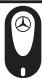

＊车辆正在处理，以示教新钥匙。

等待，直至此过程完成。

正在读取钥匙 请稍候将钥匙放在标记的位置 参见使用说明书（用户手册)

\*钥匙探测功能出现故障。

将钥匙置于插槽中以用钥匙启动发动机 第159页)。

正在搜寻感应区内的 实体钥匙或数字钥匙..参见使用说萌书（用卢¥册)

\*未探测到钥匙。

将钥匙放在标记位置 第159页)。

如果仍然探测不到钥匙：

请咨询具有资质的专业服务中心。

\*未探测到电子车钥匙。

显示信息  
未检测到钥匙  
未检测到钥匙 请把数字钥  
匙放在感应充电区上

<table><tr><td>可能的原因/结果与■解决方案</td></tr><tr><td>D 将电子车钥匙放在标记位置(一第159 页)。 如果仍然探测不到电子车钥匙： 2025</td></tr><tr><td>? 请咨询具有资质的专业服务中心。 *钥匙或电子车钥匙目前未被探测到。 改变钥匙或电子车钥匙在车内的位置。 尝试启动车辆。 如果仍未探测到钥匙，将钥匙放入标记位置(一第159 页)。</td></tr><tr><td>如果仍未探测到电子车钥匙，将电子车钥匙放入标记位置(一第159 页)。 启动车辆。 *钥匙或电子车钥匙在行驶过程中不再被检测到，并且可能不再在车内。</td></tr><tr><td></td></tr><tr><td>如果钥匙或电子车钥匙不在车内且您关闭车辆：</td></tr><tr><td>·无法启动车辆。</td></tr><tr><td>·无法中央锁止车辆。</td></tr><tr><td>D 确保钥匙或电子车钥匙位于车内。</td></tr><tr><td>如果钥匙或电子车钥匙在车内，但仍然无法探测到：</td></tr><tr><td>? 根据交通状况立即停车。</td></tr></table>

# 显示信息

# 可能的原因/结果与 $\blacktriangleright$ 解决方案

将钥匙放在标记位置 第159页)。

将电子车钥匙放在标记位置 第159 页)。

钥匙电池电量不足或电量耗尽。

通过指示灯检查电池 第75页)。  
必要时更换钥匙电池 第77页)。

带电子车钥匙的终端设备蓄电池充电电量过低。

立即对电子车钥匙终端设备蓄电池进行充电。

否则，可能在车辆发动机关闭后无法重新启动车辆。如果仍然探测不到钥匙或电子车钥匙：

请咨询具有资质的专业服务中心。

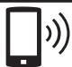

更换钥匙参见使用说明书（角声等册）

\*如果电子车钥匙未更新，车辆无法解锁/锁止或启动。

系统将自动更新电子车钥匙。  
更新完成时，提示将消失且电子车钥匙再次可用。

<table><tr><td>显示信息</td><td>可能的原因／结果与■解决方案</td></tr><tr><td>）)) 请勿忘带走钥匙</td><td>＊还将响起警告音。此提示提醒您离开车辆时要随身携带钥匙。这也适用于电子车钥匙。 0</td></tr><tr><td></td><td>＊带电子车钥匙的终端设备蓄电池充电电量过低。 ■立即对电子车钥匙终端设备蓄电池进行充电。</td></tr><tr><td>数字钥匙设备需充电</td><td>＊车辆正在处理，以读取新电子车钥匙。 ? 等待，直至此过程完成。</td></tr><tr><td>正在读取钥匙 请稍候 </td><td>*无法解锁/锁止或启动车辆。 ■请使用属于该车辆的电子车钥匙。</td></tr></table>

# 显示信息

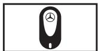

更换钥匙

＊更换钥匙。

请咨询具有资质的专业服务中心。

# 照明

# 显示信息

解决方案＊车外照明故障。

请咨询具有资质的专业服务中心。

故障参见使用说明书(用户手册)

\*自动行车灯的光线传感器故障。

请咨询具有资质的专业服务中心。

显示信息 可能的原因／结果与■解决方案\*您在未开启近光灯的情况下驾驶。将照明开关旋转至D或AUT位置。  
开启大灯 162025＊离开车辆时，车灯仍处于开启状态。■将照明开关旋转至AuT位置。  
关闭灯  
数字大灯功能受限 ＊智能数字大灯（DIGITALLIGHT）系统故障。即使智能数字大灯（DIGITALLIGHT）系统功能不可用，照明系统也将继续运行。■请咨询具有资质的专业服务中心。  
请检查近光灯设定(左侧 ＊已手动选择交通类型。  
通行/右侧通行) ■检查设置，必要时手动更改 第133页)。  
仅可手动设定近光灯(左 \*用于左侧/右侧行车的大灯自动调换功能出现故障。  
侧通行/右侧通行) ■手动调换大灯 第133页)。  
自适应远光灯辅助系统增 \*自适应远光灯辅助系统增强版暂时不可用。  
强说可户手见使 达到统因制 第，3系统将再次可用。将出现自适应远光灯辅助系统增强版重新可用显示信息。

<table><tr><td>显示信息</td><td>可能的原因/结果与■解决方案</td></tr><tr><td></td><td>? 继续行驶 ? 手动操作远光灯，直至自适应远光灯辅助系统增强版重新可用。</td></tr><tr><td>自适应远光灯辅助系统增 强版停止运作</td><td>2 *自适应远光灯辅助系统增强版故障。 ■继续行驶 或者 根据交通状况停车，再重新启动车辆。 ? 如果显示信息未消失：请咨询具有资质的专业服务中心。</td></tr><tr><td>点</td><td>然后，手动操作远光灯。 *相应灯具有故障。 ■请继续小心驾驶。</td></tr><tr><td>近光灯 左侧 (示例)</td><td>? 请立即咨询具有资质的专业服务中心。</td></tr><tr><td>自适应远光灯辅助系统暂 时不可用参见使用说明书 （用户手册)</td><td>① LED 照明灯源：仅当某一照明灯中的所有发光二极管均出现故障时，该照明灯的显示信息才出现。 *自适应远光灯辅助系统暂时不可用。 已达到系统限制(一第130 页)。</td></tr><tr><td>显示信息</td><td>可能的原因／结果与■解决方案 *自适应远光灯辅助系统故障。</td></tr><tr><td>自适应远光灯辅助系统 停正运作</td><td>■继续行驶 025 或者 ? 根据交通状况停车，再重新启动车辆。 如果显示信息未消失：请咨询具有资质的专业服务中心。</td></tr><tr><td>危险警告灯 故障</td><td>然后，手动操作远光灯。 *危险警告灯开关故障。 ■请咨询具有资质的专业服务中心。</td></tr></table>

# 智能气候控制

<table><tr><td>显示信息</td><td>可能的原因/结果与■解决方案</td></tr><tr><td>出</td><td>＊高电压蓄电池正在充电。气候预控制无法开启。 ■等待，直至充电达到最小充电量。</td></tr><tr><td>停止运作 高电压蓄电池 充电未完成</td><td></td></tr><tr><td>出 停止运作 给高电压蓄电池 充电</td><td>＊高电压蓄电池的电量过低。气候预控制无法开启。 ■为高电压蓄电池充电(→第177页)。 2025</td></tr><tr><td>出 气候预控制 (通过钥匙控 制)在车辆启动后重新可 用</td><td>*在车辆关闭的情况下，您已试图开启气候预控制两次以上。 启动车辆保持10秒钟。 气候预控制恢复运作。 BC16</td></tr><tr><td>出 气候预控制(通过钥匙控 制）停止运作高电压蓄</td><td>*高电压蓄电池的电量过低。气候预控制无法开启。 ? 为高电压蓄电池充电(一第177页)。 当高电压蓄电池充满电时，气候预控制将恢复运作。</td></tr></table>

# 驱动系统

<table><tr><td colspan="3" rowspan="3">显示信息不允许拖车 参见使用说明书 (用户手册)</td><td></td></tr><tr><td colspan="1" rowspan="2">可能的原因／结果与■解决方案＊驱动系统故障。■此车辆只能使用运输车或拖车运送(一→第 335页)。</td></tr><tr><td colspan="1" rowspan="1"></td></tr><tr><td colspan="3" rowspan="1">(（口OFF行车声音提示 停止运作</td><td colspan="1" rowspan="1">*发声器（车辆声讯警告系统）出现故障。未产生车辆噪音。车辆可能无法被其他道路使用者听到。■格外小心驾驶。?请咨询具有资质的专业服务中心。</td></tr><tr><td colspan="3" rowspan="1">无法解锁充电电缆参见使用说明书 (用户手册)</td><td colspan="1" rowspan="1">*无法从车辆充电接口上取下充电电缆接头。如果充电电缆绷得太紧，可以轻轻拉充电电缆来缓解充电电缆接头上的压力。?按下充电中断按钮(→第187页)。之后，如果无法拔下充电电缆插头：■请咨询具有资质的专业服务中心。</td></tr><tr><td colspan="3" rowspan="1">充电站故障车辆暂时无法充电</td><td colspan="1" rowspan="1">*充电站发生故障或未识别出汽车电子标识卡。■在另一充电站开始充电过程。</td></tr><tr><td colspan="3" rowspan="1">显示信息</td><td colspan="1" rowspan="2">可能的原因／结果与■解决方案或者■请使用备选身份验证方式或付款方式。</td></tr><tr><td colspan="4" rowspan="1"></td></tr><tr><td colspan="1" rowspan="1">充电故障 请切换充电类型参见使用说明书（用声手册）</td><td colspan="4" rowspan="1">＊充电站发生临时故障。■请等待，直到排除故障。或者■在另一充电站开始充电过程。或者■请使用备选身份验证方式或付款方式。</td></tr><tr><td colspan="1" rowspan="1">交流充电停止运作 请去授权服务中心</td><td colspan="4" rowspan="1">*因故障无法开始充电过程。■请咨询具有资质的专业服务中心。</td></tr><tr><td colspan="1" rowspan="1">直流充电停止运作 请去授权服务中心</td><td colspan="4" rowspan="1">*因故障无法开始充电过程。■请咨询具有资质的专业服务中心。</td></tr><tr><td colspan="1" rowspan="1">登录失败 请切换登录方式或切换充电站</td><td colspan="4" rowspan="1">*预期此充电站不提供即插即充服务。■请使用备选身份验证方式或付款方式。或者■在另一充电站开始充电过程。</td></tr><tr><td colspan="1" rowspan="1">仅电动驱动可用性能受限</td><td colspan="4" rowspan="1">*燃油箱为空且内燃机关闭。由于您在电动模式下驾驶，车辆的输出功率受限。</td></tr><tr><td>显示信息</td><td colspan="4">可能的原因/结果与■解决方案</td></tr><tr><td rowspan="4"></td><td colspan="4">立即加注燃油。 随后，超过50公里的距离后，可能会暂时限制使用电动模式。</td></tr><tr><td colspan="4"></td></tr><tr><td colspan="4">如果车辆中有燃油，则说明内燃机有故障。</td></tr><tr><td colspan="4">■请咨询具有资质的专业服务中心。 *高电压蓄电池的充电电量或环境条件不足以启用电驱动模式。</td></tr><tr><td>电动驾驶模式 暂时不可用</td><td colspan="4">继续行驶，并遵守插电式混合动力运行注意事项(→第155 页)。 或者 ■为高电压蓄电池充电(→第177页)。</td></tr><tr><td>驱动系统正在准备..</td><td colspan="4">*正在测试驱动系统的绝缘件。该过程可能需要持续最多10 秒钟。</td></tr><tr><td>由</td><td colspan="4">*插电式混合动力：高电压蓄电池过热。存在火灾风险。</td></tr><tr><td rowspan="5">蓄电池过热 停车，所有人 下车!尽可能停在露天空 旷处</td><td colspan="4">根据交通状况立即停车。</td></tr><tr><td colspan="4">如果可能，将车辆停在开阔区域并确保车辆驾驶员及所有乘客下车。</td></tr><tr><td colspan="4">① 车辆辅助功能可能会自动启用，例如作为智能气候控制组成部分的空气内循环模式。</td></tr><tr><td colspan="4">请勿继续驾驶。 如果有烟出现，请立即离开危险区域并呼叫消防救援机构。</td></tr><tr><td colspan="4">即使外部没有着火迹象，也请咨询具有资质的专业服务中心。</td></tr></table>

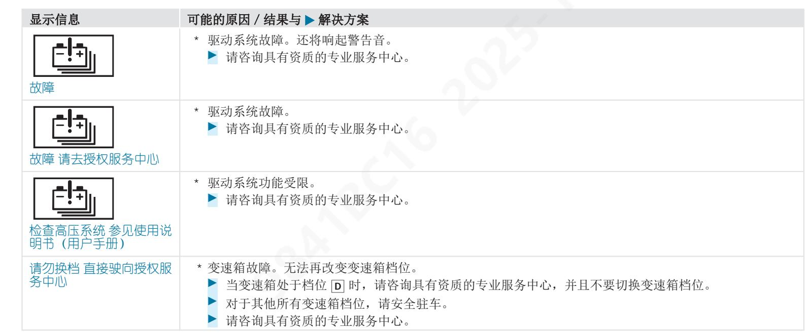

显示信息 可能的原因／结果与■解决方案  
请勿中途熄火 直接驶向授 \*由于发生故障，无法重新启动驱动系统。  
权服务中心 ■请勿关闭驱动系统，继续驾驶至最近的具有资质的专业服务中心。\*高出压蓄和生故严重受限。关闭并锁止车辆。 1620  
驱动性能和续航里程降低 稍等片刻后，解锁并重新启动车辆。  
参见使用说明书（用户手  
册) 如果显示信息再次出现：请继续小心驾驶。为高电压蓄电池充满电 第177页)。如果输出功率和可达里程仍然降低，则驱动系统中存在故障。请继续小心驾驶。请咨询具有资质的专业服务中心。  
车辆无法启动参见使用说 ＊无法启动车辆。  
明书（用户手册） 驱动系统发生故障。关闭并锁止车辆。? 稍等片刻后，解锁并重新启动车辆。如果显示信息再次出现且车辆未启动，请咨询具有资质的专业服务中心。  
显示信息 可能的原因／结果与 $\blacktriangleright$ 解决方案  
驱动故障最高时速受限 ＊驱动系统故障。  
请停车 最高车速受限。驱动系统将在几公里内关闭。根据交通状况立即停车并关闭驱动系统。请勿继续驾驶。请勿牵引车辆；必要时停止牵引。请咨询具有资质的专业服务中心。  
驱动故障最高时速严重受 ＊驱动系统故障。  
限参见使用说明书（青芦 最高车速受限。  
手册） ■请咨询具有资质的专业服务中心。＊驱动系统故障。车辆的输出功率受限。■请咨询具有资质的专业服务中心。  
故障＊驱动系统故障。根据交通状况立即停车并关闭驱动系统。请勿继续驾驶。请勿牵引车辆；必要时停止牵引。  
停车关闭车辆 请咨询具有资质的专业服务中心。

<table><tr><td colspan="1" rowspan="2">显示信息性能严重受限</td><td colspan="1" rowspan="1">可能的原因/结果与解决方案</td></tr><tr><td colspan="1" rowspan="1">*驱动系统处于正常工作温度范围以外，例如由于车外温度极低或极高。输出功率将受到严重限制。如果驱动系统的工作温度恢复正常，将可再次获得最大动力输出。显示信息将消失。*如果驱动系统输出功率仍然降低，则说明驱动系统中存在故障。请继续小心驾驶。? 请咨询具有资质的专业服务中心。</td></tr><tr><td colspan="1" rowspan="1">高电压蓄电池故障 约xXXkm后将无法启动请去授权服务中心（黄色显示信息）</td><td colspan="1" rowspan="1">*高电压蓄电池发生故障。行驶显示的里程后，将无法再启动电驱动系统。务必到具有资质的专业服务中心进行与高电压蓄电池的相关必要保养工作。</td></tr><tr><td colspan="1" rowspan="1">高电压蓄电池故障 约xXXkm后将无法启动请去授权服务中心（红色显示信息）</td><td colspan="1" rowspan="1">*高电压蓄电池发生故障。行驶显示的里程后，将无法再启动电驱动系统。请立即到具有资质的专业服务中心进行与高电压蓄电池的相关必要保养工作。</td></tr><tr><td colspan="1" rowspan="1">高电压蓄电池故障 请勿再次启动车辆请去授权服务中心</td><td colspan="1" rowspan="1">*高电压蓄电池发生故障。驱动系统被关闭后，将无法再重新启动。■请勿关闭驱动系统，继续驾驶至最近的具有资质的专业服务中心。</td></tr><tr><td>显示信息</td><td>可能的原因／结果与■解决方案</td></tr><tr><td>2</td><td>*配备汽油发动机的车辆：在加油口盖板开启前需减小燃油箱中的压力。压力降低过程可能需要长达15分 钟。</td></tr><tr><td>请稍候 正在释放油箱压力</td><td></td></tr><tr><td>D</td><td>*配备汽油发动机的车辆：燃油箱中的压力释放且加油口盖板开启。</td></tr><tr><td>油箱压力已释放 可开始加 油</td><td></td></tr></table>

# 车辆

# 显示信息

# 解决方案

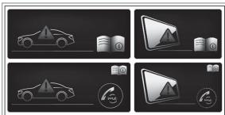

\*由于软件升级失败，驾驶员显示屏停止运作。每次启动发动机时，将显示该显示屏提示。

如果驾驶员显示屏无法工作或存在故障，您可能不会注意到对安全至关重要的系统的任何功能限制。  
这可能影响车辆的操作安全性。

<table><tr><td colspan="1" rowspan="1">显示信息</td><td colspan="1" rowspan="1">可能的原因/结果与■解决方案■请尽快安全驻车并咨询具有资质的专业服务中心。</td></tr><tr><td colspan="1" rowspan="1"></td><td colspan="1" rowspan="1">■请尽快安全驻车并咨询具有资质的专业服务中心。如果车辆的操作安全性受到影响，请立即安全驻车。请联系具有资质的专业服务中心。例如，如果驾驶员显示屏出现故障，您可能无法识别影响安全相关系统的功能限制或车速显示等。车辆的操作安全性可能受到影响(→第 287页)。■请立即到具有资质的专业服务中心检查车辆。</td></tr><tr><td colspan="1" rowspan="1">车辆无法启动参见使用说明书 （角卢等册)</td><td colspan="1" rowspan="1">*无法启动车辆。?关闭车辆，然后再次开启如果显示信息仍然出现，请咨询具有资质的专业服务中心。*配备48伏车载电气系统的车辆：48伏蓄电池电量过低。无法启动车辆。关闭无需使用的用电器。将经梅赛德斯-奔驰认可的具有足够充电输出功率的配套充电器连接至12伏蓄电池的跨接起动连接点(→第341页)。48伏蓄电池通过车内电压转换器充电。</td></tr><tr><td colspan="1" rowspan="1">车辆行驶准备就绪车辆将在上锁时或在XX分钟后自动关闭</td><td colspan="1" rowspan="1">＊您要离开车辆，而发动机正在运转。车辆将在20分钟内关闭。■为防止车辆自动关闭，请确认MBUX智能人机交互系统中央显示屏上的信息。*您在车内。已接合驻车档位回且发动机正在运转。</td></tr><tr><td colspan="2">显示信息和警告灯/指示灯 399</td></tr><tr><td colspan="2"></td></tr><tr><td>显示信息</td><td>可能的原因/结果与■解决方案</td></tr><tr><td></td><td>经过一定的保持时间后，驾驶员显示屏上将出现该显示信息。车辆将在总共20 分钟的保持时间后自动关 闭。 ■为防止车辆自动关闭，请确认MBUX 智能人机交互系统中央显示屏上的信息。</td></tr><tr><td>车辆行驶准备就绪车辆将 在上锁时或几分钟后自动 亲闭</td><td>＊当车辆处于驾驶就绪状态时，离开车辆。 下车并固定车辆以防溜车，并随身携带钥匙。 ? 如未离开车辆，请关闭座椅加热器等用电器。否则，12伏蓄电池可能电量耗尽，且仅能使用备用蓄电 池启动发动机（跨接起动）。</td></tr><tr><td>a 加注 清洗液</td><td>*风挡玻璃清洗液储液罐内的风挡玻璃清洗液液位已经低于最小值。 ■加注清洗液 (→第 321页)。</td></tr><tr><td rowspan="2">雨刮器 故障</td><td>＊风挡玻璃雨刮器有故障。</td></tr><tr><td colspan="1">■ 重启车辆。 如果显示信息仍出现： ■请咨询具有资质的专业服务中心。</td></tr><tr><td>平视显示 暂时不可用 参 见使用说明书（用户手 册)</td><td>＊平视显示暂时不可用。可能原因： ·电源故障</td></tr><tr><td>显示信息</td><td>可能的原因／结果与■解决方案</td></tr><tr><td></td><td>·信号干扰 根据交通状况停车并关闭车辆，然后再次开启。 如果显示信息仍然出现，请咨询具有资质的专业服务中心。</td></tr><tr><td>平视显示 停止运作</td><td>*平视显示系统存在内部故障。 ■请咨询具有资质的专业服务中心。</td></tr><tr><td>平视显示当前亮度已降 低参见使用说明书（用 户手册）</td><td>＊平视显示亮度变暗。可能原因： ·摄像头摄像范围内的风挡玻璃脏污 ·外部亮度信号故障 开启风挡玻璃雨刮器。 必要时请清洁风挡玻璃。 关闭车辆，然后再次开启 如果显示信息仍然出现，请咨询具有资质的专业服务中心。</td></tr><tr><td></td><td>*转向系统故障。转向性能严重受损。</td></tr><tr><td>转向故障 立即停车 参见 使用说明书 (用户手册)</td><td>A 警告 转向特性受损时的事故风险 如果转向系统未能按照预期运行，则将危及车辆的操作安全性。</td></tr><tr><td colspan="1" rowspan="1">显示信息</td><td></td></tr><tr><td colspan="1" rowspan="1"></td><td></td></tr><tr><td colspan="1" rowspan="1">转向故障操作费力参见使用说萌书 (角户手册)</td><td></td></tr><tr><td colspan="1" rowspan="1">转向故障小心驾驶 请去授权服务中心</td><td colspan="1" rowspan="1">*助力转向出现故障。因此，转向特性可能受影响。?请继续小心驾驶。?请咨询具有资质的专业服务中心。</td></tr><tr><td colspan="1" rowspan="1">主动式引擎盖 故障 参见使用说明书（用户手册)</td><td colspan="1" rowspan="1">*主动式发动机罩（行人保护）出现故障或在触发后停止运作。■请咨询具有资质的专业服务中心。</td></tr><tr><td colspan="1" rowspan="1">氛围灯 警告辅助停止运作</td><td colspan="1" rowspan="1">*环境照明系统无法提供全部视觉警告辅助功能。? 锁止车辆并在几分钟后再次解锁。? 如果显示信息频繁出现，请咨询具有资质的专业服务中心。</td></tr></table>

# 显示信息

可能的原因/结果与■解决方案\*发动机罩未关闭。

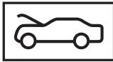

A警告发动机罩未锁止时行驶造成的事故风险发动机罩可能开启并阻挡您的视野。

行驶时切勿解锁发动机罩。  
每次行车前，请确保发动机罩已锁止。根据交通状况立即停车。  
关闭发动机罩。

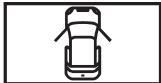

＊至少有一个车门未关闭。

关闭所有车门。

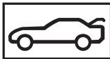

\*行李箱盖未关闭。

A危险废气中毒风险

内燃机会排出一氧化碳等有毒废气。发动机运转时，尤其在车辆行驶过程中，如果行李箱盖开启，则排出的废气可能进入车内。

开启行李箱盖前，务必关闭发动机。  
请勿在行李箱盖开启的情况下驾驶。  
显示信息 可能的原因／结果与■解决方案■关闭行李箱盖。  
由于中间靠背已折下 此功 ＊无法电动解锁左侧座椅靠背。 QZ  
能已锁定 ■向后折叠中间座椅靠背，直至其卡入位。\*相应座的座椅靠背，卡其卡入位。  
左后座椅靠背 未锁  
正(宗例）

# 发动机

<table><tr><td>显示信息</td><td>可能的原因/结果与■解决方案</td></tr><tr><td>如需停止车辆 按下启动/ 停止按钮至少3秒钟或</td><td>*您在车辆行驶过程中按下了启动/停止按钮。</td></tr><tr><td>3次</td><td>■有关在行驶时关闭车辆的信息(→第158 页)。</td></tr></table>

# 显示信息

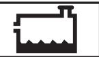

加注冷却液参见使用说明书（角户等册)

上

冷却液 停车 关闭车辆

可能的原因/结果与■解决方案

\*冷却液液位过低。

！ 注意事项冷却液不足造成的发动机损坏

避免在冷却液不足的情况下长途驾驶。

请到具有资质的专业服务中心检查发动机冷却系统。

\*冷却液过热。

根据交通状况立即停车并关闭车辆。

A警告开启发动机罩时的灼伤风险

如果您在发动机过热或发动机舱起火时开启发动机罩，可能发生下列情况：

·您可能会接触到热气。  
·您可能会接触到其他溢出的热工作液。

开启发动机罩前，请让发动机冷却。如果发动机舱内起火，请保持发动机罩关闭并呼叫消防救援机构。

等待，直至发动机冷却。  
确保至发动机散热器的空气供给未受阻。

# 显示信息

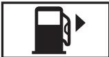  
低油位提示

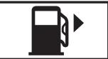

油箱盖开启

避免发动机过载，继续驾驶至最近的具有资质的专业服务中心。进行此操作时，确保冷却液温度显示保持在 $1 2 0 ~ ^ { \circ } \mathrm { C }$ 以下。

\*燃油余量已降至储备水平。

加注燃油。

\*油箱盖未正确关闭，或燃油系统漏油。

如果油箱盖已正确关闭：请咨询具有资质的专业服务中心。

# 变速箱

# 显示信息

仅在车辆静止时 选择P档

可能的原因/结果与

# 解决方案

\*只有在车辆处于静止状态时，才能选择驻车档。

踩下制动踏板以停车。  
当车辆处于静止状态时，将变速箱切换至驻车档。  
显示信息 可能的原因／结果与■解决方案  
踩下制动踏板 将换档杆 \*您已试图将变速箱从驻车档回换入另一个变速箱档位。  
从P档移出 踩下制动踏板。选择变速箱档位回、或空档。  
如需将换档杆丛P档或 \*您已试图将变速箱从驻车档回或空档换入另一个变速箱档位。  
N档移出请踩下制动踏 ? 踩下制动踏板。  
板并启动车辆 启动车辆。 6? 切换变速箱档位。  
要挂入D档或R档请先 \*您已试图选择变速箱档位回或。  
踩下制动踏板 踩下制动踏板。? 选择变速箱档位回或。  
要挂入 R档请先踩下制 ＊您已试图选择变速箱档位回。  
动踏板 踩下制动踏板。选择变速箱档位。  
施加驻车制动进行驻车请 ＊驻车档位回应急电源发生故障。  
去授权服务中心 ? 请咨询具有资质的专业服务中心。此时，在关闭车辆之前，请务必手动选择驻车档位回。离开车辆前，请施加电动驻车制动。  
显示信息 可能的原因／结果与■解决方案  
已自动启用N档请重新 \*在车辆滑行或行驶时自动挂入空档。  
挂挡 $\textcircled{1}$ 当您在空档下打开驾驶员侧车门时，驻车档回将自动接合。当踩住制动踏板使车辆处于静止状态时，接合驻车档P。要在踩下制动踏板的状态下继续行驶，选择变速箱档位回或R。  
已挂入N档请挂入所需 \*车辆在空档下滑行或移动时踩下加速踏板。  
档位 要加速行驶时，选择变速箱档位回或。  
如需切换至N档请将换 \*换档杆在档位N的保持时间不够久。  
档杆置于N档更长的时 仅当换档杆在 的保持时间更久，才能从驻车档回切换至空档。  
间如果换档杆的保持时间不够久，驻车档P将保持接合状态。从驻车档P切换至空档N时，请将换档杆在档位N 保持得更久。  
无法换至倒档 请去授权服 \*变速箱故障。无法选择变速箱档位。  
务中心 ■请咨询具有资质的专业服务中心。  
变速箱 故障停车 \*变速箱故障。变速箱自动切换至空档。根据交通状况立即停车。踩下制动踏板。挂入驻车档回。请咨询具有资质的专业服务中心。

<table><tr><td>显示信息</td><td>可能的原因／结果与■解决方案</td></tr><tr><td>溜车风险 驾驶员侧车门开 启未挂入P档</td><td>*驾驶员侧车门未完全关闭且选择变速箱档位回、或空档。 可能会造成溜车。 关闭车辆时选择驻车档。</td></tr><tr><td>溜车风险 施加驻车制动进 行驻车</td><td>*变速箱故障。无法挂入驻车档。 安全驻车。 ? 使用电动驻车制动器固定车辆，以防溜车。 在坡路上时，应将前轮转向路缘，以使车辆在溜车时朝路缘移动。</td></tr><tr><td>溜车风险已手动启用 N 档无法自动换至P档</td><td>*当车辆处于静止状态或以极低速度行驶时，在发动机运转或车辆启动时挂入空档。 ■注意事项溜车造成的车辆损坏 当车辆关闭或驾驶员侧车门开启时，驻车档位P自动接合功能停用。 可能会造成溜车。 做好制动准备。 切勿让车辆无人看管。 踩下制动踏板直至车辆停止。</td></tr></table>

# 显示信息

# 可能的原因/结果与■解决方案

请勿换档直接驶向授权服务中心

\*变速箱故障。无法再改变变速箱档位。

当变速箱处于档位回时，请咨询具有资质的专业服务中心，并且不要切换变速箱档位。

辅助蓄电池 故障（白色显示信息）

\*附加蓄电池有故障。

请咨询具有资质的专业服务中心。  
此时，在关闭车辆之前，请务必手动选择驻车档位。  
离开车辆前，请施加电动驻车制动。

辅助蓄电池 故障（红色显示信息）

\*附加蓄电池有故障。

请咨询具有资质的专业服务中心。  
此时，在关闭车辆之前，请务必手动选择驻车档位回。  
离开车辆前，请施加电动驻车制动。

# 制动器

# 显示信息

?

驻车制动器 参见使用说明书 （用户手册)

# 可能的原因/结果与 $\blacktriangleright$ 解决方案

\*黄色指示灯[ $\textcircled { \pmb { \big | } }$ 亮起。电动驻车制动器故障。

# 施加制动器：

关闭车辆，然后再次开启手动施加电动驻车制动器 第194页)。

如果无法施加电动驻车制动器：

请咨询具有资质的专业服务中心。  
? 必要时还应固定停驻的车辆，以防溜车。

\*黄色指示灯 $\boxed { ( \textcircled { \bullet } ) }$ 和红色指示灯 $\boxed { ( \textcircled { \bullet } ) }$ 亮起。电动驻车制动器故障。

# 解除制动器：

关闭车辆，然后再次开启手动解除电动驻车制动器 第194页)。

# 或者

自动解除电动驻车制动器 $(  $ 第194页)。

如果仍无法解除电动驻车制动器：

请勿继续驾驶。请咨询具有资质的专业服务中心。

\*黄色指示灯 $\boxed { ( \bullet ) }$ 亮起且红色指示灯 $\boxed { ( \textcircled { \bullet } ) }$ 闪烁。电动驻车制动器出现故障。

# 显示信息

# 可能的原因／结果与■解决方案

无法施加或解除电动驻车制动器。

关闭车辆，然后再次开启

# 施加制动器：

解除电动驻车制动然后手动施加电动驻车制动器 第194页)。

# 解除制动器：

施加电动驻车制动器然后将其手动解除。

如果无法施加电动驻车制动器或红色指示灯 $\boxed { ( \textcircled { \bullet } ) }$ 持续闪烁：

1 请勿继续驾驶。请咨询具有资质的专业服务中心。  
必要时还应固定停驻的车辆，以防溜车。

\*施加或解除电动驻车制动器后，黄色指示灯[ $\textcircled{8}$ ]亮起且红色指示灯[ $\textcircled{8}$ ]闪烁约10秒钟，然后保持亮起或熄灭。电动驻车制动器出现故障。

# 如果充电电量过低：

为12伏蓄电池充电 第341页)。

# 施加制动器：

手动施加电动驻车制动器。

如果无法施加电动驻车制动器：

<table><tr><td colspan="2"></td></tr><tr><td colspan="2">显示信息 可能的原因／结果与■解决方案</td></tr><tr><td></td><td>? 请咨询具有资质的专业服务中心。 必要时还应固定停驻的车辆，以防溜车。 025</td></tr><tr><td rowspan="2">? 松开驻车制动器</td><td>解除制动器： 如果满足自动解除的条件且电动驻车制动器未自动解除，则手动解除电动驻车制动器(→第194 页)。 如果仍无法解除电动驻车制动器：</td></tr><tr><td>■请勿继续驾驶。请咨询具有资质的专业服务中心。 *红色指示灯闪烁。</td></tr><tr><td>显示信息</td><td>可能的原因／结果与■解决方案</td></tr><tr><td>① 立刻制动</td><td>＊在保持（HOLD）功能启用的情况下出现故障。 同时可能会响起有规律的提示音。 无法启动车辆系统。 025 ?</td></tr><tr><td rowspan="2">① 故障参见使用说明书 (用卢手册)</td><td>立即用力踩下制动踏板，直至显示信息消失。 无法再次启动车辆系统。 *制动助力功能减弱。 坡道起步辅助系统可能受影响。</td></tr><tr><td colspan="1">A 警告 制动系统故障时的事故及伤害风险 如果制动系统故障，则制动特性可能受到影响。 ）小心驾驶。 请立即到具有资质的专业服务中心检查制动系统。</td></tr><tr><td rowspan="2">0 故障停车</td><td>＊制动助力功能减弱，并且制动特性可能受到影响。</td></tr><tr><td colspan="1">A 警告 制动力助力故障时的事故及伤害风险 如果制动力助力故障，则可能必须提高制动踏板力来进行制动。制动特性可能受到影响。紧急制动时 制动距离可能增加。</td></tr><tr><td>显示信息 可能的原因/结果与■解决方案</td><td></td></tr><tr><td>■请咨询具有资质的专业服务中心。 *制动液储液罐中的制动液不足。</td><td></td></tr><tr><td>①</td><td>A 警告 制动液液位低时的事故风险</td></tr><tr><td>检查 制动液液位</td><td>如果制动液液位过低，制动效果和制动特性可能受损。 ? 注意道路及交通状况，尽快安全停车。请勿继续驾驶。 请咨询具有资质的专业服务中心。 V 请勿加注制动液。</td></tr><tr><td>检查制动衬片参见使用说 萌书 (用户手册)</td><td>＊制动片已达到磨损极限。 ■请咨询具有资质的专业服务中心。</td></tr></table>

# 驾驶和驾驶安全系统

<table><tr><td>显示信息</td><td>可能的原因/结果与解决方案</td></tr><tr><td>ABS</td><td>*防抱死制动系统（ABS）和电控车辆稳定行驶系统（ESP?）暂时不可用。 其他驾驶系统和驾驶安全系统［例如制动辅助系统（BAS）」也可能暂时不可用。</td></tr><tr><td></td><td>制动系统将继续正常工作。紧急制动情况下的制动距离可能会增加。</td></tr><tr><td></td><td></td></tr><tr><td></td><td>A警告 防抱死制动系统（ABS）和电控车辆稳定行驶系统（ESP?）发生故障时的打滑风险</td></tr><tr><td></td><td></td></tr></table>

驾驶和驾驶安全系统  

<table><tr><td>显示信息</td><td>可能的原因／结果与■解决方案</td></tr><tr><td>暂时不可用参见使用说明 书（用户手册）</td><td>车轮在制动过程中可能会抱死，电控车辆稳定行驶系统（ESP@）无法稳定车辆。 可操控性和制动特性严重受损，制动距离可能增加。此外，其他驾驶安全系统也将停用。 ■在适宜的路段小心行驶并进行小幅度的转向运动，车速超过30 公里/小时。 ）如果显示信息未消失，请立即咨询具有资质的专业服务中心。请谨慎驾驶。</td></tr><tr><td>ABS</td><td>*防抱死制动系统（ABS）和电控车辆稳定行驶系统（ESP@）故障。 其他驾驶系统和驾驶安全系统［例如制动辅助系统（BAS）」也可能存在故障。</td></tr><tr><td></td><td>制动系统将继续正常工作。紧急制动情况下的制动距离可能会增加。 A警告 防抱死制动系统（ABS）和电控车辆稳定行驶系统（ESP@）故障时的打滑风险</td></tr><tr><td>停止运作参见使用说明书 （角芦手册)</td><td>车轮在制动过程中可能会卡住，电控车辆稳定行驶系统（ESP?）不能稳定车辆。 可操控性和制动特性严重受损，制动距离可能增加。此外，其他驾驶安全系统也将停用。</td></tr><tr><td></td><td>请继续小心驾驶。 请立即到具有资质的专业服务中心检查防抱死制动系统（ABS）和电控车辆稳定行驶系统</td></tr><tr><td colspan="2"></td></tr><tr><td>显示信息</td><td>可能的原因／结果与■解决方案</td></tr><tr><td></td><td>*电控车辆稳定行驶系统（ESP@）暂时不可用。 其他驾驶系统和驾驶安全系统［例如制动辅助系统（BAS）］也可能存在故障。</td></tr><tr><td>暂时不可用 参见使用说明 书(用户等册)</td><td>A 警告 电控车辆稳定行驶系统（ESP?）故障时的打滑风险 如果电控车辆稳定行驶系统（ESP@）故障，电控车辆稳定行驶系统（ESP@）无法保持车辆稳定。此</td></tr><tr><td colspan="2"></td></tr><tr><td colspan="2"></td></tr><tr><td colspan="2">停止运作参见使用说明书 (角卢手册)</td></tr></table>

# 显示信息

# 可能的原因／结果与■解决方案

EBD CBS

＊电子制动力分配（EBD）、防抱死制动系统（ABS）和电控车辆稳定行驶系统（ $\mathsf { E S P } ^ { \mathbb { ( B ) } }$ ）故障。其他驾驶系统和驾驶安全系统［例如制动辅助系统（BAS）」也可能存在故障。

A警告 电子制动力分配（EBD）、防抱死制动系统（ABS）和电控车辆稳定行驶系统（ $\mathsf { E S P } ^ { \mathbb { ( R ) } }$ ）故障时的打滑风险。

车轮在制动过程中可能会卡住，电控车辆稳定行驶系统（ $\mathsf { E S P } ^ { \mathbb { ( B ) } }$ ）不能稳定车辆。  
可操控性和制动特性严重受损，制动距离可能增加。此外，其他驾驶安全系统也将停用。

停止运作 参见使用说明书（角芦手册）

请继续小心驾驶。  
请立即到具有资质的专业服务中心检查制动系统。

HOLD

“由于车辆打滑或启用条件未满足，保持（HOLD）功能停用。

随后重新启用保持（HOLD）功能或查看保持（HOLD）功能的启用条件 第 200 页)。

# 关闭

注意力辅助系统:请勿疲劳驾驶！

注意力辅助系统探测到驾驶员的疲劳状况或注意力不集中的状况 第201页)。

必要时，稍事休息。

<table><tr><td colspan="3" rowspan="2">显示信息222注意力辅助系统瞌睡警告请勿疲劳驾驶！</td><td colspan="1" rowspan="1">可能的原因／结果与■解决方案</td></tr><tr><td colspan="1" rowspan="1">222</td><td></td></tr><tr><td colspan="3" rowspan="1">?-- - km/h</td><td colspan="1" rowspan="1">*由于未满足所有的启用条件，因此定速巡航控制无法启用。■请遵守定速巡航控制的启用条件 (一→第 204页)。</td></tr><tr><td colspan="3" rowspan="1">定速巡航控制 停止运作</td><td colspan="1" rowspan="1">*定速巡航控制故障。■请咨询具有资质的专业服务中心。</td></tr><tr><td colspan="3" rowspan="1">定速巡航控制和限速功能停止运作</td><td colspan="1" rowspan="1">*定速巡航控制和限速器故障。■请咨询具有资质的专业服务中心。</td></tr><tr><td colspan="3" rowspan="1">定速巡航控制关闭</td><td colspan="1" rowspan="1">＊定速巡航控制已停用。如果还响起警告音，说明定速巡航控制已自动停用(一第 203页)。</td></tr><tr><td colspan="3" rowspan="1">LIM-- - km/h</td><td colspan="1" rowspan="1">＊限制器可能暂时无法接合。如果问题原因不再出现，系统将再次可用。</td></tr><tr><td colspan="3" rowspan="2">显示信息LIM</td><td colspan="1" rowspan="2">可能的原因/结果与解决方案              RO*如果将加速踏板踩过阻力点（强制降档），限速器将切换至被动模式(一→第 204 页)。</td></tr><tr><td colspan="3" rowspan="1">LIM待机</td></tr><tr><td colspan="1" rowspan="1">限速功能 停止运作</td><td colspan="3" rowspan="1">＊限速器故障。■请咨询具有资质的专业服务中心。</td></tr><tr><td colspan="1" rowspan="1">速度限制 (冬季轮胎) XXXkm/h</td><td colspan="3" rowspan="1">*您已达到冬季轮胎的最高允许存储速度。无法超出此速度。</td></tr><tr><td colspan="1" rowspan="1">交通标志辅助系统暂时不可用参见使用说明书（用户手册）</td><td colspan="3" rowspan="1">*交通标志辅助系统暂时不可用。如果问题原因不再出现，系统将再次可用。■按照交通规则继续驾驶。</td></tr><tr><td colspan="1" rowspan="1">交通标志辅助系统停止运作</td><td colspan="3" rowspan="1">＊交通标志辅助系统有故障。■按照交通规则继续驾驶。或者? 根据交通状况停车，再重新启动车辆。如果显示信息未消失：请咨询具有资质的专业服务中心。</td></tr><tr><td>显示信息</td><td colspan="3">可能的原因／结果与■解决方案</td></tr><tr><td>V2X功能停止运作</td><td colspan="3">天线硬件故障 分频器故障 路测设施或其他具有蜂窝车联网（C-V2X）功能车辆故障 路测设施或其他具有蜂窝车联网（C-V2X）功能车辆发送的通信消息不满足设计标准或信息缺失 ■请咨询具有资质的专业服务中心。</td></tr></table>

# 驾驶员辅助系统

<table><tr><td>显示信息</td><td>可能的原因／结果与■解决方案</td></tr><tr><td>s - km/h</td><td>＊由于未满足所有的启用条件，自适应巡航无法启用。 ■满足自适应巡航的启用条件(→第 209 页)。</td></tr><tr><td>待机</td><td>*如果将加速踏板踩至超出自适应巡航设置，系统将切换至被动模式 (一第 207页)。</td></tr><tr><td>关闭</td><td>*自适应巡航已停用。如果还响起警告音，则说明自适应巡航已自动停用(→第 209 页)。 0</td></tr><tr><td>自适应巡航暂时不可用 参见使用说明书（用户 手册）</td><td>*自适应巡航暂时不可用。 环境条件超出系统限制(一第207页)。 当环境条件恢复到系统允许的范围时，系统会再次变为可用状态。 ? 请继续小心驾驶。 或者 ■如果显示信息未消失，则根据交通情况停车，然后重新启动车辆。</td></tr><tr><td>自适应巡航停止运作</td><td>*自适应巡航故障。 其他驾驶系统和驾驶安全系统也可能存在故障。 请继续小心驾驶。 或者 ? 根据交通状况停车，再重新启动车辆。</td></tr><tr><td>自适应巡航重新可用</td><td>如果显示信息未消失：请咨询具有资质的专业服务中心。 自适应巡航恢复运作。 ■开启自适应巡航(→第 209 页)。</td></tr></table>

# 显示信息

# 可能的原因／结果与解决方案

主动式紧急制动 功能当前受限参见使用说明书（用户挲册)

\*对于配有驾驶辅助组件的车辆，以下功能可能暂时无法使用或只有部分功能可用：

·带横向探测功能的主动式紧急制动  
·避让辅助功能  
·预防性安全系统 前后向保护（PRE-SAFEPLUS）配备侧面盲点辅助的车辆：预防性安全系统前后向保护（PRE-SAFE?PLUS）暂时不可用。  
环境条件超出系统限制 第 221页)。

未配备驾驶辅助组件的车辆：主动式紧急制动暂时不可用。

请继续小心驾驶。  
当环境条件恢复到系统允许的范围时，系统会再次变为可用状态。

# 或者

如果显示信息未消失，则根据交通情况停车，然后重新启动车辆。

主动式紧急制动 功能受限参见使用说明书（用户手册)

对于配有驾驶辅助组件的车辆，以下功能可能暂时无法使用或只有部分功能可用：

·带横向探测功能的主动式紧急制动  
·避让辅助功能  
·预防性安全系统 前后向保护（PRE-SAFE?PLUS）

未配备驾驶辅助组件的车辆：主动式紧急制动暂时不可用或只有部分功能可用。

<table><tr><td>显示信息</td><td>可能的原因／结果与■解决方案</td></tr><tr><td></td><td>请继续小心驾驶。 或者 根据交通状况停车，再重新启动车辆。 如果显示信息未消失：请咨询具有资质的专业服务中心。</td></tr><tr><td>自适应巡航暂时不可用 参见使用说明书（用户 手册）</td><td>*自适应巡航暂时不可用。 环境条件超出系统限制(一第213页)。 当环境条件恢复到系统允许的范围时，系统会再次变为可用状态。 继续行驶 ? 必要时检查轮胎气压。</td></tr><tr><td>自适应巡航 停止运作</td><td>*自适应巡航故障。自适应巡航保持可用。 ■继续行驶 或者 ? 根据交通状况停车，再重新启动车辆。</td></tr><tr><td></td><td>? 如果显示信息未消失：请咨询具有资质的专业服务中心。 *自适应巡航已达到系统限制(→第213页)。 您在相当长的一段时间内没有独立进行转向操作。 ■请您亲自控制车辆转向并根据交通状况继续驾驶。</td></tr><tr><td>由于多次紧急停车 智能领 航转向功能 暂时不可用</td><td>*智能领航转向功能因多次紧急停车暂时不可用。 请您亲自控制车辆转向并根据交通状况停车。 关闭车辆，然后再次开启 2025 智能领航转向功能再次可用。</td></tr><tr><td>紧急停车启用</td><td>*双手未放在方向盘上。智能领航转向功能将启动紧急停止(一→第 213 页)。 ■将双手放在方向盘上。 有关取消紧急停止的信息 (一第 215页)。</td></tr><tr><td>主动式紧急停车辅助暂时 不可用参见使用说明书 （用户手册）</td><td>*主动式紧急停车辅助暂时不可用。 环境条件超出系统限制(一第215页)。 当环境条件恢复到系统允许的范围时，系统会再次变为可用状态。 继续行驶 或者 ■如果显示信息未消失，则根据交通情况停车，然后重新启动车辆。 *未配备驾驶辅助组件的车辆：由于多次紧急停止，主动式紧急停车辅助暂时不可用。 ? 请您亲自控制车辆转向并根据交通状况停车。 关闭车辆，然后再次开启</td></tr></table>

显示信息 可能的原因／结果与■解决方案  
主动式紧急停车辅助 ＊主动式紧急停车辅助故障。  
停正运作 ■继续行驶 02或者根据交通状况停车，再重新启动车辆。如果显示信息未消失：请咨询具有资质的专业服务中心。  
变道辅助暂时不可用见 \*变道辅助暂时不可用。  
角谎明书 (用户手册) 环境条件超出系统限制 第217页)。当环境条件恢复到系统允许的范围时，系统会再次变为可用状态。继续行驶或者■如果显示信息未消失，则根据交通情况停车，然后重新启动车辆。  
变道辅助 停止运作 \*变道辅助有故障。继续行驶或者根据交通状况停车，再重新启动车辆。如果显示信息未消失：请咨询具有资质的专业服务中心。

<table><tr><td colspan="1" rowspan="1">显示信息</td><td colspan="2" rowspan="2">可能的原因／结果与■解决方案＊智能变道暂时不可用。环境条件超出系统限制(一第 217页)。当环境条件恢复到系统允许的范围时，系统会再次变为可用状态。?继续行驶或者■如果显示信息未消失，则根据交通情况停车，然后重新启动车辆。</td></tr><tr><td colspan="2" rowspan="1">导航辅助驾驶暂时不可用参见使用说萌书（用户手册）</td></tr><tr><td colspan="1" rowspan="1">导航辅助驾驶 停止运作</td><td colspan="2" rowspan="1">*智能变道故障。■继续行驶或者? 根据交通状况停车，再重新启动车辆。如果显示信息未消失：请咨询具有资质的专业服务中心。</td></tr><tr><td colspan="1" rowspan="1">交通拥堵辅助暂时不可备见使用说明书（用户宇册）</td><td colspan="2" rowspan="1">*交通拥堵辅助暂时不可用。自适应巡航和智能领航转向功能仍然可用。环境条件超出系统限制(一第 207页)。当环境条件恢复到系统允许的范围时，系统会再次变为可用状态。■继续行驶</td></tr><tr><td colspan="1" rowspan="1">交通拥堵辅助 停止运作参见使用说明书（用户手册）</td><td colspan="2" rowspan="1">*交通拥堵辅助故障。交通拥堵辅助已停用。自适应巡航和智能领航转向功能仍然可用。继续行驶</td></tr><tr><td colspan="1" rowspan="1">显示信息</td><td colspan="2" rowspan="2">可能的原因/结果与■解决方案或者根据交通状况停车，再重新启动车辆。如果显示信息未消失：请咨询具有资质的专业服务中心。</td></tr><tr><td colspan="2" rowspan="1"></td></tr><tr><td colspan="1" rowspan="1">侧面盲点辅助 和开门警示功能暂时不可用参见使用说明书 (用户手册)</td><td colspan="2" rowspan="1">*侧面盲点辅助暂时不可用。已达到系统限制(→第 231页)。如果问题原因不再出现，系统将再次可用。?继续行驶或者■如果显示信息未消失，则根据交通情况停车，然后重新启动车辆。</td></tr><tr><td colspan="1" rowspan="1">侧面盲点辅助 和开门警示功能 停止运作</td><td colspan="2" rowspan="1">*侧面盲点辅助或开门警示功能有故障。■继续行驶或者根据交通状况停车，再重新启动车辆。如果显示信息未消失：请咨询具有资质的专业服务中心。</td></tr><tr><td colspan="1" rowspan="1">主动式侧面盲点辅助 和开门警示功能暂时不可用参见使用说明书（用户手册）</td><td colspan="2" rowspan="1">*主动式侧面盲点辅助暂时不可用。已达到系统限制(→第231页)。如果问题原因不再出现，系统将再次可用。继续行驶</td></tr><tr><td colspan="1" rowspan="1">显示信息</td><td colspan="2" rowspan="1">可能的原因／结果与■解决方案</td></tr><tr><td colspan="1" rowspan="1"></td><td></td><td></td></tr><tr><td colspan="1" rowspan="1">主动式侧面盲点辅助 和开门警示功能 停止运作</td><td colspan="2" rowspan="1">*主动式侧面盲点辅助或开门警示功能有故障。  2■继续行驶或者?根据交通状况停车，再重新启动车辆。? 如果显示信息未消失：请咨询具有资质的专业服务中心。</td></tr><tr><td colspan="1" rowspan="1">车道保持辅助暂时不可用参见使用说明书（用户手册）</td><td colspan="2" rowspan="1">＊车道保持辅助暂时不可用。环境条件超出系统限制(→第 232页)。当环境条件恢复到系统允许的范围时，系统会再次变为可用状态。■继续行驶</td></tr><tr><td colspan="1" rowspan="1">车道保持辅助 停止运作</td><td colspan="2" rowspan="1">*车道保持辅助故障。■继续行驶或者?根据交通状况停车，再重新启动车辆。如果显示信息未消失：请咨询具有资质的专业服务中心。</td></tr><tr><td colspan="1" rowspan="1">车道保持辅助 功能受限参见使用说明书</td><td colspan="2" rowspan="1">*车道保持辅助可用但是受限。■继续行驶</td></tr></table>

# 显示信息

# 可能的原因/结果与 $\blacktriangleright$ 解决方案

# 或者

根据交通状况停车，再重新启动车辆。  
如果显示信息未消失：请咨询具有资质的专业服务中心。

＊双手未放在方向盘上。车道保持辅助将启动紧急停止 第232页)。

将双手放在方向盘上。

紧急停车启用

有关取消紧急停止的信息，请参见 第215页)。

<table><tr><td>国</td></tr><tr><td>/</td></tr><tr><td></td></tr><tr><td>y!o</td></tr></table>

\*前部和转角雷达传感器（下文简称"传感器"）故障。可能原因：

·传感器脏污  
·大雨天或雪天  
·无其他车流的长途城际旅程（例如在沙漠中）

驾驶系统和驾驶安全系统可能出现故障或暂时无法使用。制动系统、转向系统和驱动系统将继续正常工作。

请继续小心驾驶。

一旦引发问题的原因不复存在，则驾驶系统和驾驶安全系统将再次可用，并且相应的标识将消失。

请根据交通情况停车。

<table><tr><td>显示信息</td><td>可能的原因／结果与■解决方案</td></tr><tr><td></td><td>? 从外侧清洁所有传感器盖 (一→第 195 页)。</td></tr><tr><td></td><td>? 重启车辆。</td></tr></table>

# 显示信息

# 可能的原因／结果与解决方案

\*多功能摄像头视野受限制。可能原因：

·多功能摄像头摄像范围内的风挡玻璃脏污 02  
·大雨、大雪或大雾  
·风挡玻璃内侧或外侧起雾：在某些天气情况下，特别是在寒冷季节，风挡玻璃内侧或外侧可能会起雾。

$\textcircled{1}$ 借助加热器，风挡玻璃上的雾气将在短时间内自动清除。视野受限制只是暂时的。驾驶系统和驾驶安全系统可能出现故障或暂时无法使用。制动系统、转向系统和驱动系统将继续正常工作。

请继续小心驾驶。  
从外侧除雾，刮扫一次 第136页)。  
从内侧除雾，按下 第147页)。

摄像头视野受限参见使用说明书 (用户手册)

一旦引发问题的原因不复存在，则驾驶系统和驾驶安全系统将再次可用，并且相应的标识将消失。如果在约15分钟的行驶时间后显示信息仍不消失：

<table><tr><td rowspan=1 colspan=1>0IOFF</td></tr><tr><td rowspan=1 colspan=1>/</td></tr><tr><td rowspan=1 colspan=1>y!o</td></tr><tr><td rowspan=1 colspan=1>国</td></tr><tr><td rowspan=1 colspan=1></td></tr><tr><td rowspan=1 colspan=1>烟</td></tr></table>

请根据交通情况停车。  
清洁风挡玻璃，特别是多功能摄像头所在的位置 第195页)。  
重启车辆。显示信息 可能的原因／结果与■解决方案  
预防性安全系统 前后向保 ＊预防性安全系统 前后向保护（PRE-SAFE@ PLUS）系统出现故障。护（PRE-SAFEPLUS）停 $\blacktriangleright$ 继续行驶  
止运作 参见使用说明书 或者  
（用户手册） 根据交通状况停车，再重新启动车辆。  
如果显示信息未消失：请咨询具有资质的专业服务中心。

<table><tr><td rowspan=1 colspan=1>显示信息</td><td rowspan=2 colspan=1>可能的原因/结果与■解决方案                  2025*驾驶员摄像头视野缩小。可能原因：·物体或标签进入驾驶员摄像头视线范围。·驾驶员摄像头脏污。保持驾驶员摄像头视野无阻碍。必要时清洁驾驶员摄像头。请遵守有关显示屏的车内护理说明 (→第327页)。</td></tr><tr><td rowspan=1 colspan=1>驾驶员摄像头 观察范围暂时受阻 受影响功能：参见使用说明书 (用户手册)</td></tr><tr><td rowspan=1 colspan=1>更改方向盘位置/座椅位置直至可以看见屏幕上边缘上的6个点</td><td rowspan=1 colspan=1>*驾驶员摄像头无法捕捉到您的视线。改变方向盘和座椅位置，直到屏幕顶部边缘出现6个点。如果30分钟后驾驶员摄像头再次无法检测到您的视线，则显示信息将再次出现。如果您确认显示信息，而驾驶员摄像头在整个行程中均无法检测到您的视线，则显示信息将不再出现。</td></tr><tr><td rowspan=1 colspan=1>驾驶员摄像头停止运作参见使用说明书（用户手册）</td><td rowspan=1 colspan=1>＊驾驶员摄像头故障。■请咨询具有资质的专业服务中心。</td></tr><tr><td rowspan=1 colspan=1>预防性安全系统停止运作参见使用说明书（用户手册)</td><td rowspan=1 colspan=1>*预防性安全系统 侧向保护（PRE-SAFE?Impulse Side）功能故障。请咨询具有资质的专业服务中心。</td></tr><tr><td rowspan=1 colspan=1>预防性安全系统侧向保护（PRE-SAFE@ Impulse Side ）停止运作参见使用说明书(角户手册)</td><td rowspan=1 colspan=1>*预防性安全系统 侧向保护（PRE-SAFE@Impulse Side)出现故障，或在触发后不起作用。请咨询具有资质的专业服务中心。</td></tr></table>

# 驻车辅助系统

显示信息 可能的原因／结果与 $\blacktriangleright$ 解决方案  
驻车定位系统停止运作 ＊驻车定位系统（PARKTRONIC）驻车辅助功能故障。  
参见使用说明书（用户 如果问题原因不再出现，系统将再次可用。  
手册） 继续驾驶，同时注意车辆周围的环境。或者根据交通状况停车，再重新启动车辆。如果显示信息仍然出现，请咨询具有资质的专业服务中心。  
智能泊车和驻车定位系统 ＊智能泊车和驻车定位系统（PARKTRONIC）驻车辅助功能故障。  
停止运作参见使用说明书 如果问题原因不再出现，系统将再次可用。  
（甫卢手册） 继续驾驶，同时注意车辆周围的环境。

<table><tr><td>显示信息</td><td colspan="2">可能的原因/结果与■解决方案</td></tr><tr><td></td><td rowspan="3">或者 N</td><td>根据交通状况停车，再重新启动车辆。</td></tr><tr><td>智能泊车 挪车辅助系统有</td><td>如果显示信息仍然出现，请咨询具有资质的专业服务中心。</td></tr><tr><td rowspan="3">限可用参见使用说明书 (用户手册)</td><td>*智能泊车系统的挪车辅助功能暂时不可用或仅部分可用。</td></tr><tr><td>? 清洁驻车系统和摄像头系统的所有传感器 (→第318页)。</td><td></td></tr><tr><td>1 如果显示信息仍然出现，请咨询具有资质的专业服务中心。</td></tr></table>

# 梅赛德斯-奔驰紧急呼叫系统

<table><tr><td>显示信息</td><td>可能的原因／结果与■解决方案</td></tr><tr><td>Csos</td><td>*梅赛德斯-奔驰紧急呼叫系统故障。Mercedes me互联系统也有故障。 ■请咨询具有资质的专业服务中心。</td></tr><tr><td>停止运作</td><td></td></tr></table>

# 蓄电池

显示信息 可能的原因／结果与 $\blacktriangleright$ 解决方案P P ＊12 伏车载电气系统故障。 202+ ■请立即咨询具有资质的专业服务中心。  
12伏车载电气系统请去  
授权服务中心\*12 伏蓄电池无法继续充电，且电量过低。！ 注意事项继续行驶可能导致发动机损坏  
停车参见使用说明书 在任何情况下都不要继续驾驶。  
（用户手册） 请咨询具有资质的专业服务中心。根据交通状况立即停车。请勿继续驾驶。关闭车辆。请咨询具有资质的专业服务中心。  
显示信息 可能的原因／结果与■解决方案\*车辆关闭且12伏蓄电池电量过低。+ 关闭无需使用的用电器。 2025? 行驶30-60分钟。  
启动车辆以便为12 伏蓄 或者  
龟池充电 在车辆静止时为12伏蓄电池充电 第333页)。插电式混合动力车辆：在充电站给车辆充电 第177页)。\*12伏蓄电池充电立量过车。请勿继续驾驶让车辆保持运行状态  
停车保持车辆在运转状态 如果显示信息消失：请继续驾驶。  
下为12伏蓄电池充电如果显示信息未消失：请咨询具有资质的专业服务中心。\*48 车载电气系统故停车。请勿继续驾驶。关闭车辆。  
停车参见使用说明书 （雨卢手册) 请咨询具有资质的专业服务中心。

# 显示信息

# 可能的原因/结果与解决方案

蓄电池过热 停车,所有人下车!尽可能停在露天空旷处

\*48 伏蓄电池过热。存在火灾风险。

根据交通状况立即停车。  
如果可能，将车辆停在开阔区域并确保车辆驾驶员及所有乘客下车。

$\textcircled{ i}$ 车辆辅助功能可能会自动启用，例如作为智能气候控制组成部分的空气内循环模式.

请勿继续驾驶。  
如果有烟出现，请立即离开危险区域并呼叫消防救援机构。  
即使外部没有着火迹象，也请咨询具有资质的专业服务中心。

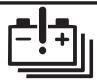

48V电池参见使用说明书（用户等册）

\*48 伏车载电气系统有功能限制。

舒适性功能（例如空调系统）可能仅在有限的范围内可用。  
车辆可以行驶。

? 如果显示信息仍持续显示，请立即咨询具有资质的专业服务中心。

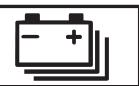

请稍候48伏蓄电池正在充电

\*48 伏蓄电池电量耗尽。在12 伏蓄电池使用配套的充电器进行充电或另一车辆正在提供启动辅助时开启车辆。电量耗尽的48伏蓄电池通过电压转换器自动充电。几分钟后，可以重新启动车辆显示信息将出现在驾驶员显示屏上。

启动车辆。

将充电器从车辆上断开后，驾驶车辆行驶一段时间，以便为12伏蓄电池和48伏蓄电池充电。

如果几分钟后可以重新启动车辆 显示信息未出现：

<table><tr><td rowspan=1 colspan=1>显示信息</td><td rowspan=1 colspan=2>可能的原因／结果与■解决方案</td></tr><tr><td rowspan=1 colspan=1></td><td rowspan=1 colspan=2>尝试启动车辆。</td></tr><tr><td rowspan=1 colspan=1>48伏车载电气系统故障请参见使用说明书（用户手册）</td><td rowspan=1 colspan=2>*48伏车载电气系统故障。? 请勿继续驾驶。停车并将其关闭。请咨询具有资质的专业服务中心。</td></tr><tr><td rowspan=1 colspan=1>可以重新启动车辆</td><td rowspan=1 colspan=2>*48 伏蓄电池已通过电压转换器自动充电。■启动车辆并行驶一段时间，为12伏蓄电池和48伏蓄电池充电。</td></tr></table>

# 轮胎气压监测器

<table><tr><td>显示信息</td><td>可能的原因／结果与■解决方案</td></tr><tr><td>轮胎气压监测器 暂时不可 用</td><td>＊存在强烈的无线电信号源干扰。因此，无法接收到来自轮胎气压传感器的信号。轮胎气压监测器暂时不可 用。 排除故障后，轮胎气压监测器将会立即自动重启。</td></tr><tr><td>轮胎气压监测器 停止运作</td><td>■继续行驶 *轮胎气压监测器故障。</td></tr></table>

# 显示信息

A 警告轮胎气压监测系统故障时存在事故风险

如果一个或多个轮胎出现压力流失时，轮胎气压监测系统无法发出警告。  
轮胎气压不足的轮胎可能影响行驶特性以及转向和制动性能。

请到具有资质的专业服务中心检查轮胎气压监测系统，

轮胎气压监测器 停止运作没有车轮传感器

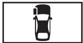

没有车轮传感器

所装车轮未配备合适的轮胎气压传感器。轮胎气压监测器停用。

为车轮安装合适的轮胎气压传感器。

至少一个轮胎的轮胎气压传感器无信号。未显示受影响轮胎的压力值。

请到具有资质的专业服务中心更换有故障的轮胎气压传感器。

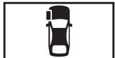

检查轮胎

$\star$ 一个或多个轮胎的轮胎气压明显降低。显示车轮位置。还将响起警告音。

A 警告轮胎气压不足造成的事故风险

·轮胎可能破裂。  
·轮胎可能过度和/或不均匀地磨损。  
·行驶特性、转向特性和制动特性可能受到严重影响。

# 显示信息

# 可能的原因／结果与解决方案

可能导致您失去对车辆的控制。

请遵守推荐的轮胎气压。  
如有必要调节轮胎气压。请根据交通情况停车。  
检查轮胎气压 第 343 页)和轮胎。

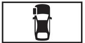

请校正 轮胎气压

＊至少一个轮胎的轮胎气压过低，或各车轮之间的轮胎气压相差过大。

检查轮胎气压，必要时进行充气。  
轮胎气压符合推荐标准时，重启轮胎气压监测器 第345页)。

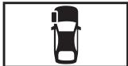

注意 轮胎故障

\*一个或多个轮胎的压力已突然降低。显示车轮位置。

A 警告使用泄气轮胎驾驶的事故风险

·轮胎可能会过热并且损坏。  
·行驶特性以及转向特性和制动特性可能受到严重影响。

可能导致您失去对车辆的控制。

请勿使用泄气的轮胎驾驶。

<table><tr><td>显示信息</td><td>可能的原因／结果与■解决方案</td></tr><tr><td rowspan="2"></td><td>在应急模式下使用带轮胎低压续跑特性（MOExtend）的泄气的轮胎时，请勿超过允许的最长行驶 距离及最高允许车速。 请遵守有关泄气的轮胎的注意事项。</td></tr><tr><td>有关泄气的轮胎的注意事项，请参见(→第323 页)。 请根据交通情况停车。</td></tr><tr><td rowspan="2">轮胎过热</td><td>检查轮胎。 *至少一个轮胎过热。受影响的轮胎显示为红色。在温度接近限值时，轮胎显示为黄色。</td></tr><tr><td>A 警告 在轮胎过热时驾驶造成的事故风险 过热轮胎可能破裂。</td></tr><tr><td rowspan="2"></td><td>■降低车速以冷却轮胎。 ＊至少一个轮胎过热。受影响的轮胎显示为红色。在温度接近限值时，轮胎显示为黄色。</td></tr><tr><td>A 警告 在轮胎过热时驾驶造成的事故风险</td></tr><tr><td>降低速度</td><td>过热轮胎可能破裂。 降低车速以冷却轮胎。</td></tr></table>

# 发动机油

# 显示信息

可能的原因/结果与 $\blacktriangleright$ 解决方案

\*发动机油液位已降至最低水平。

下一次加油时 加注1L发动机油

发动机油液位过高

应避免在发动机油不足时长途行驶。

在下次加燃油时，添加1升发动机油 第312页)。

有关发动机油的注意事项，请参见 第363页)。

注意事项在发动机油不足的情况下驾驶时造成的发动机损坏

\*发动机油液位过高。

注意事项在发动机油过多的情况下驾驶时造成的发动机损坏

立即咨询具有资质的专业服务中心并降低发动机油液位。

\*发动机油液位过低。

注意事项在发动机油不足的情况下驾驶时造成的发动机损坏

发动机油液位 停车 关闭引擎

应避免在发动机油不足时长途行驶。

# 显示信息

可能的原四／绍不与 醉伏刀米? 关闭车辆。 根据交通状况立即停车。请勿继续驾驶。 2025加注1升发动机油 第312页)。$\blacktriangleright$ 检查发动机油液位。有关发动机油的注意事项，请参见 第363页)。＊机油压力过低。 ■注意事项在机油压力不足的情况下驾驶时造成的发动机损坏机油压力停车 关闭车辆 ■应避免在机油压力不足时行驶。根据交通状况立即停车。请勿继续驾驶。关闭车辆。请咨询具有资质的专业服务中心。油位有气连服务，或者油位传感器有故障。无法测量 发动机油液位

# 警告灯和指示灯

# 指示灯和警告灯概述

启动车辆时，某些系统将会进行自检。某些指示灯和警告灯可能会短暂亮起或闪烁。这是正常现象。仅当启动车辆后或在车辆行驶过程中，这些指示灯和警告灯亮起或闪烁才表示有故障。

这些指示灯和警告灯位于突出显示的显示区中。

# 驾驶员显示屏

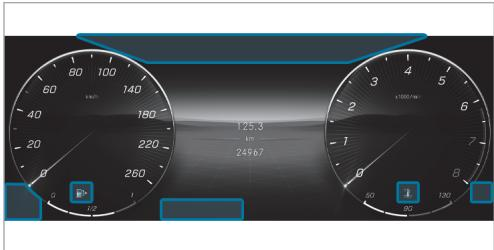

# 带驾驶员摄像头的驾驶员显示屏

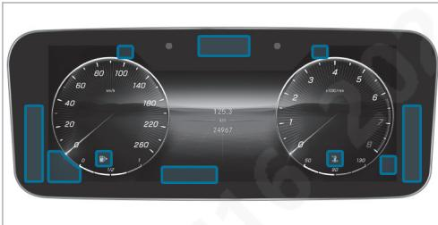

# 指示灯和警告灯

驾驶员及乘客安全

约束系统指示灯 第446页)安全带指示灯 第446页)乘客存在提醒指示灯（白色）第446页)  
乘客存在提醒指示灯（黄色）第446页)

# 驱动系统

」功率降低警告灯 第448页)

系统错误警告灯 第448页)电气故障警告灯 第448页)充电电缆已插入指示灯 第448页)

# 车辆

动力转向系统警告灯(黄色)

第449页)

动力转向系统警告灯（红色)第449页)

# 发动机

冷却液温度指示灯 第450页)

配备汽油发动机的车辆：发动机工作温度指示灯 第450页)

电气故障警告灯 第450页)

燃油储备以及加油口盖板位置指示灯第450页)

# 制动器

电动驻车制动器指示灯（黄色）第454页)

电动驻车制动器指示灯（红色）

第454页)

[ $\textcircled{1}$ 制动器指示灯（黄色） 第454页)制动器指示灯（红色） 第454页)

# 驾驶和驾驶安全系统

防抱死制动系统（ABS）故障警告灯第458页)

电控车辆稳定行驶系统（ $\mathsf { E S P } ^ { \mathbb { ( B ) } }$ ）指示灯 第458页)

电控车辆稳定行驶系统关闭（ESP?OFF）警告灯 第458页)

注意力辅助系统指示灯 第458页)交通标志辅助系统指示灯

# 第458页)

# 车距警告灯 第458页)

主动式紧急制动指示灯 第458页)主动式紧急制动指示灯 第458页)

# 主动式紧急制动指示灯

# 第456页)

梅赛德斯-奔驰紧急呼叫系统

梅赛德斯-奔驰紧急呼叫系统指示灯第460页)

轮胎气压监控系统警告灯

# 轮胎气压监控系统警告灯

第461页)

车外照明系统

[  
D  
D  
□ 中

侧灯指示灯 第125页)近光灯指示灯 第125页)远光灯指示灯 第127页)转向信号灯指示灯！ 第127页)后雾灯指示灯 第125页)

# 中央显示屏上的标识

起步防碰撞辅助系统指示灯第254页)合 横向探测警报警告灯 第251页)

邻近区域制动指示灯 第252页)

# 驾驶员及乘客安全

# 警告灯/指示灯

约束系统警告灯

# 可能的原因/结果与 $\blacktriangleright$ 解决方案

\*车辆启动后，红色约束系统警告灯亮起。约束系统故障 第45页)。

A 警告约束系统故障造成的伤害风险约束系统中的部件可能无意中被启用或未按计划在事故中展开。请立即到具有资质的专业服务中心检查和修理约束系统。

# 插电式混合动力车辆：

A危险约束系统故障造成的死亡风险

约束系统中的部件可能无意中被启用或未按预期在事故中展开。在发生事故时，高压车载电气系统可能无法按预期停用。

如果您碰触到高压车载电气系统中损坏的部件，可能会触电。

请立即到具有资质的专业服务中心检查和修理约束系统。  
发生事故后，立即关闭车辆发动机。

请继续小心驾驶。  
请注意驾驶员显示屏上的提示。  
请立即咨询具有资质的专业服务中心。

<table><tr><td rowspan=3 colspan=3>警告灯/指示灯安全带警告灯闪烁</td><td></td></tr><tr><td rowspan=2 colspan=1>可能的原因／结果与■解决方案*红色安全带警告灯闪烁，同时响起间歇警告音。在车辆行驶过程中，驾驶员或前排乘客尚未系安全带。■系安全带(→第45页)。前排乘客座椅上放置了物品。■取下前排乘客座椅上的物品。</td></tr><tr><td rowspan=1 colspan=1></td></tr><tr><td rowspan=3 colspan=3>安全带警告灯亮起</td><td></td></tr><tr><td rowspan=1 colspan=1></td><td></td></tr><tr><td rowspan=1 colspan=1>*启动车辆后，红色安全带警告灯亮起。此外，还可能会响起间歇警告音。红色安全带警告灯提醒驾驶员和前排乘客系安全带。■系安全带(→第45页)。如果将物品放置在前排乘客座椅上，则红色安全带警告灯可能保持亮起。</td></tr><tr><td rowspan=3 colspan=3>OFF地乘员存在识别系统警告灯（白色）</td><td></td></tr><tr><td rowspan=2 colspan=1>OFF地</td><td></td></tr><tr><td rowspan=1 colspan=1>*白色的乘员存在识别系统警告灯亮起。乘员存在识别系统已停用。</td></tr></table>

<table><tr><td>警告灯/指示灯</td><td>可能的原因/结果与■解决方案</td></tr><tr><td>OFF T</td><td>*黄色的乘员存在识别系统警告灯亮起。 乘员存在识别系统故障。 2025</td></tr><tr><td>■请注意驾驶员显示屏上的信息。</td><td></td></tr><tr><td>乘员存在识别系统警告灯 （黄色）</td><td></td></tr></table>

# 驱动系统

<table><tr><td>警告灯/指示灯</td><td>可能的原因/结果与■解决方案</td></tr><tr><td></td><td>*黄色功率降低警告灯亮起。 驱动系统输出功率降低。 请注意驾驶员显示屏上的提示。</td></tr><tr><td>功率降低警告灯</td><td>*当车辆处于操作准备就绪状态 READY时，红色系统故障警告灯亮起。 驱动系统有故障。 ■请注意驾驶员显示屏上的提示。</td></tr><tr><td>一 +</td><td>*红色电气故障警告灯亮起。 电气系统有故障。</td></tr><tr><td>电气故障警告灯</td><td>■请注意驾驶员显示屏上的提示。 *红色充电电缆已插入警告灯亮起。 6 2025</td></tr><tr><td>充电电缆已插入警告灯</td><td>请勿在已连接充电电缆的情况下起步。 ■从车辆上断开充电电缆。</td></tr></table>

# 车辆

<table><tr><td>警告灯/指示灯</td><td>可能的原因/结果与■解决方案</td></tr><tr><td></td><td>*当车辆行驶时，黄色动力转向系统警告灯亮起。 助力辅助系统或转向系统本身有故障。</td></tr><tr><td></td><td>? 请注意驾驶员显示屏上的提示。</td></tr><tr><td>动力转向系统警告灯（黄 色）</td><td></td></tr></table>

# 警告灯/指示灯

动力转向系统警告灯（红色）

# 可能的原因/结果与解决方案

\*当车辆行驶时，红色助力转向警告灯亮起。助力辅助系统或转向系统本身有故障。

A 警告转向特性受损时的事故风险

如果转向系统未能按照预期运行，则将危及车辆的操作安全性。

注意道路及交通状况，尽快将车安全地停在路边。在任何情况下都不要继续驾驶。  
请咨询具有资质的专业服务中心。

请注意驾驶员显示屏上的提示。

# 发动机

# 警告灯/指示灯

上

冷却液警告灯 (红色)

# 解决方案

\*当发动机运转时，红色冷却液警告灯亮起。

可能原因：

·温度传感器故障   
）冷却液液位过低   
·至发动机散热器的空气供给受阻   
·散热器风扇故障

# 警告灯/指示灯

# 可能的原因／结果与解决方案

·发动机冷却液泵故障

如果还响起警告音，则说明冷却液温度已超过 $1 2 0 ^ { \circ } \mathrm { C }$ 。

A警告开启发动机罩时的灼伤风险如果您在发动机过热或发动机舱起火时开启发动机罩，可能发生下列情况：

·您可能会接触到热气。  
·您可能会接触到其他溢出的热工作液。开启发动机罩前，请让发动机冷却。如果发动机舱内起火，请保持发动机罩关闭并呼叫消防救援机构。根据交通状况立即停车并关闭车辆。请勿继续驾驶。  
请注意驾驶员显示屏上的信息。

# 如果冷却液温度显示位于温标下端：

请咨询具有资质的专业服务中心。

# 如果冷却液温度显示位于温标上端：

离开车辆并与车辆保持安全距离，直至发动机冷却。  
检查冷却液液位 第321页)。

<table><tr><td>警告灯/指示灯</td><td>可能的原因／结果与■解决方案</td></tr><tr><td></td><td>确保至发动机散热器的空气供给未受阻。 避免发动机过载，继续驾驶至最近的具有资质的专业服务中心。进行此操作时，确保冷却液温度显示保 持在120℃以下。</td></tr><tr><td>冷却液警告灯 (黄色)</td><td>*当发动机运转时，黄色冷却液警告灯亮起。 可能原因： ·温度传感器故障 ·增压空气、变速箱油或蓄电池冷却故障 ·发动机散热器格栅受阻或有故障 ■避免发动机过载，继续驾驶至最近的具有资质的专业服务中心。</td></tr><tr><td>发动机诊断警告灯</td><td>*当发动机运转时，黄色发动机诊断警告灯亮起。 发动机、排气系统或燃油系统中出现故障。 可能已超出排放限值，且发动机可能在应急操作模式下运转。 ■请尽快到具有资质的专业服务中心检查车辆。</td></tr><tr><td>+ 电气故障警告灯</td><td>*红色电气故障警告灯亮起。 电气设备故障。 请注意驾驶员显示屏上的提示。</td></tr><tr><td>O</td><td>*配备汽油发动机的车辆：冷起动后，蓝色发动机工作温度警告灯亮起。 发动机输出功率和发动机扭矩降低。 请将这一点纳入您的驾驶方式考虑范围内。</td></tr><tr><td>发动机工作温度警告灯</td><td>*驾驶时黄色燃油存量警告灯亮起。</td></tr><tr><td>储备燃油警告灯闪烁</td><td>燃油系统压力流失。油箱盖未正确关闭，或燃油系统漏油。 关闭油箱盖。 如果油箱盖已正确关闭： ■请咨询具有资质的专业服务中心。</td></tr><tr><td>储备燃油警告灯亮起</td><td>*当发动机运转时，黄色燃油存量警告灯亮起。 燃油余量已降至储备水平。 ■加注燃油。</td></tr></table>

# 制动器

# 警告灯/指示灯

?

电动驻车制动指示灯（红色）

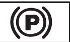

电动驻车制动指示灯（黄色）

可能的原因/结果与

# 解决方案

\*红色电动驻车制动器指示灯闪烁或亮起。

如果发生故障，黄色电动驻车制动器指示灯同样亮起。

请注意驾驶员显示屏上的提示。

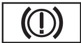

制动警告灯(黄色)

\*当车辆行驶时，黄色制动警告灯亮起。

A警告制动系统故障时的事故及伤害风险

如果制动系统故障，则制动特性可能受到影响。

小心驾驶。  
请立即到具有资质的专业服务中心检查制动系统。

坡道起步辅助系统可能出现故障。

调整车速并小心驾驶，与前方车辆保持合适的距离。

# 警告灯/指示灯

制动警告灯 (红色)

# 可能的原因/结果与解决方案

如果驾驶员显示屏上出现显示屏提示，请按照显示屏提示中的说明进行操作。

\*当车辆行驶时，红色制动警告灯亮起。

可能的原因：

·制动助力故障，并且制动特性可能受到影响。  
·制动液储液罐中的制动液不足。

请注意驾驶员显示屏上的提示。

A 警告 制动力助力故障时的事故及伤害风险

如果制动力助力故障，则可能必须提高制动踏板力来进行制动。制动特性可能受到影响。紧急制动时制动距离可能增加。

请立即停在安全位置。请勿继续驾驶！请咨询具有资质的专业服务中心。

A 警告制动液液位低时的事故风险

如果制动液液位过低，制动效果和制动特性可能受损。

注意道路及交通状况，尽快安全停车。请勿继续驾驶。  
请咨询具有资质的专业服务中心。

<table><tr><td>警告灯/指示灯</td><td>可能的原因/结果与■解决方案</td></tr><tr><td></td><td>■请勿加注制动液。</td></tr></table>

# 驾驶和驾驶安全系统

<table><tr><td>警告灯/指示灯</td><td>可能的原因/结果与■解决方案</td></tr><tr><td>ABS 防抱死制动系统（ABS） 警告灯</td><td>＊当车辆行驶时，黄色防抱死制动系统（ABS）故障警告灯亮起。 防抱死制动系统（ABS）故障。 如果还伴随有警告音，说明电子制动力分配（EBD）有故障。 其他驾驶系统和驾驶安全系统也可能存在故障。</td></tr><tr><td rowspan="2"></td><td>■请注意驾驶员显示屏上的提示。 A警告 电子制动力分配（EBD）或防抱死制动系统（ABS）故障时的打滑风险</td></tr><tr><td>制动时车轮可能抱死。 可操控性和制动特性严重受损，制动距离可能增加。此外，其他驾驶安全系统也将停用。 ? 请继续小心驾驶。 请立即到具有资质的专业服务中心检查制动系统。</td></tr><tr><td>W 电控车辆稳定行驶系统 （ESP?）警告灯闪烁</td><td>*在车辆行驶过程中，黄色电控车辆稳定行驶系统（ESP?）警告灯闪烁。 二个或多个车轮已达到其抓地能力极限(→第198页)。 / 根据当前的路况和天气状况调整驾驶方式。</td></tr><tr><td rowspan="2">WW 电控车辆稳定行驶系统 （ESP?）警告灯亮起</td><td>*当车辆行驶时，黄色电控车辆稳定行驶系统（ESP@）警告灯亮起。 电控车辆稳定行驶系统（ESP?）发生故障。 其他驾驶系统和驾驶安全系统［例如制动辅助系统（BAS）］也可能存在故障。</td></tr><tr><td colspan="1">■请注意驾驶员显示屏上的提示。 A 警告 电控车辆稳定行驶系统（ESP?）故障时的打滑风险 如果电控车辆稳定行驶系统（ESP?）故障，电控车辆稳定行驶系统（ESP?）无法保持车辆稳定。此外， 其他驾驶安全系统也将停用。 小心驾驶。</td></tr></table>

# 警告灯/指示灯

#

电控车辆稳定行驶系统关闭（ESP?OFF）警告灯

<table><tr><td>可能的原因/结果与■解决方案</td></tr><tr><td>*当车辆行驶时，黄色电控车辆稳定行驶系统关闭（ESP?OFF）警告灯亮起。 电控车辆稳定行驶系统（ESP?）停用。</td></tr><tr><td>其他驾驶系统和驾驶安全系统也可能停止运作。 A警告电控车辆稳定行驶系统（ESP?）停用时驾驶的打滑风险</td></tr><tr><td>电控车辆稳定行驶系统（ESP@）不能稳定车辆。其他驾驶安全系统的可用性也受限。</td></tr><tr><td>请继续小心驾驶。 仅在所需情况下停用电控车辆稳定行驶系统（ESP?）。</td></tr><tr><td>如果电控车辆稳定行驶系统（ESP@）无法启用，则说明电控车辆稳定行驶系统（ESP?）故障。</td></tr><tr><td>请立即到具有资质的专业服务中心检查电控车辆稳定行驶系统（ESP@）。</td></tr><tr><td>请遵守有关停用电控车辆稳定行驶系统（ESP?）的注意事项(一第198页)。</td></tr><tr><td>*注意力辅助系统警告灯亮起。</td></tr><tr><td>注意力辅助系统故障。 ? 请咨询具有资质的专业服务中心。</td></tr></table>

DFOFF

注意力辅助系统警告灯

<table><tr><td>警告灯/指示灯</td><td>可能的原因／结果与■解决方案 2025</td></tr><tr><td>IOFF 交通标志辅助系统警告灯</td><td>*交通标志辅助系统警告灯亮起。 交通标志辅助系统有故障。 请注意驾驶员显示屏上的提示。</td></tr><tr><td>车距警告灯</td><td>*车辆行驶时，红色车距警告灯亮起。 就所选车速而言，与前方车辆的距离过短。 如果还响起警告音，则说明您正在以过高的车速接近障碍物。 立即准备制动。 增加车距。</td></tr><tr><td>主动式紧急制动警告灯</td><td>主动式紧急制动功能(一→第 221页)。 *主动式紧急制动警告灯亮起。 由于传感器脏污或故障，系统不可用或功能范围受限。 ■请注意驾驶员显示屏上的提示。</td></tr></table>

警告灯/指示灯 可能的原因／结果与■解决方案用其他驶系统，可能会出现这种情况  
主动式紧急制动警告灯 ■请遵守有关主动式紧急制动的注意事项 第 221页)。? \*走动紧急制动能范亮起因示教过程而受到限制。od 取决于环境条件，示教过程可能需要几分钟。  
主动式紧急制动警告灯 ■请遵守有关主动式紧急制动的注意事项 第 221页)。  
梅赛德斯-奔驰紧急呼叫系统  
警告灯/指示灯 可能的原因／结果与 $\blacktriangleright$ 解决方案\*梅赛德斯-奔驰紧急呼叫系统故障。Mercedes me 互联系统也有故障。请咨询具有资质的专业服务中心。READY  
梅赛德斯-奔驰紧急呼叫  
系统警告灯

# 警告灯/指示灯

E

轮胎气压监测系统警告灯 闪烁

E

轮胎气压监测系统警告灯亮起

\*黄色轮胎气压监测器警告灯（压力流失/故障）闪烁约1分钟，然后保持亮起。  
轮胎气压监测器故障。

如果一个或多个轮胎出现压力流失时，轮胎气压监测系统无法发出轮胎气压不足的轮胎可能影响行驶特性以及转向和制动性能。请到具有资质的专业服务中心检查轮胎气压监测系统。

\*黄色轮胎气压监测系统警告灯（压力流失/故障）亮起。  
轮胎气压监测系统探测到至少有一个轮胎出现压力流失。

A 警告轮胎气压不足造成的事故风险

·轮胎可能破裂。  
·轮胎可能过度和/或不均匀地磨损。  
·行驶特性、转向特性和制动特性可能受到严重影响

可能导致您失去对车辆的控制。

请遵守推荐的轮胎气压。  
如有必要调节轮胎气压。

<table><tr><td>警告灯/指示灯</td><td>可能的原因／结果与■解决方案</td></tr><tr><td></td><td>? 请根据交通情况停车。</td></tr><tr><td></td><td>T 检查轮胎气压和轮胎。</td></tr></table>

# 2 3

（钥匙）电池. 773D驾驶员显示屏,3D仪表盘功能/说明. 2534MATIC.. 174

# 48伏车载电气系统

操作安全... 29  
驾驶员显示屏中的显示.. 257

#

# 安全背心.. 322

# 安全带

调节高度. 45  
后排座椅安全带状态显示. 46  
护理. 319  
解开.. 56  
警告灯 46  
系安全带 45  
启用/停用安全带调节. 51  
正确系注意事项. 44  
自动收紧.. 51

# 安全带调节

功能. 51开启/关闭.. 51  
安全带紧急拉紧器充气.. 52  
安全带警告. 46  
安全系统.. 196  
安装防滑链.. 342轮胎/车轮.. 353  
安装车牌（前部） 32  
安装附件有限制的保护. 53  
按摩模式.. 108

# B

把手.. 100  
版权.. 42  
保持（HOLD）功能  
功能.. 200  
开启/关闭.. 200

# 保持安全车距

# 保险丝

保险丝分配表.. 339  
发动机舱 340  
驾驶室 341  
前排乘客脚部位置. 341  
说明.... 339  
行李箱... 341

# 保养.. 307

保养到期日. 307  
保养工作,有关常规作业的信息. 307

# 保养管理

传输的数据. 308  
说明.. 308

# 保养时间间隔显示. 307杯座

后排.. 122

备件.. 27  
备选路径. 288  
备用燃油.. 362  
备用轮胎,应急备用轮胎. 354  
备用钥匙.. 78  
比吸收率（SAR） 358  
便捷关闭功能.. 93  
便捷开启功能.. 92  
变速箱档位直接选档换档杆.. 170  
变速箱档位显示. 170  
变道辅助功能. 217启用/停用. 220  
箔膜覆盖雷达和超声波传感器 195在摄像头/传感器上. 195  
补胎胶... 324  
补胎胶（TIREFIT）组件,轮胎充气压缩机存储位置. 324

#

# Car-to-X智能云端交互系统

# 菜单 (驾驶员显示屏)

# 操控性

# 操作安全

# 侧部气囊.. 57

# 侧车窗

便捷关闭功能. 93  
便捷开启功能. 92  
车窗膜.. 318  
电动遮阳帘.. 97  
儿童安全锁（后排） 74  
开启/关闭... 91  
使用钥匙关闭. 93  
使用钥匙开启.. 92  
问题 93  
雨天自动关闭功能. 92  
自动功能.. 92  
侧风稳定控制辅助系统. 199  
侧面盲点辅助  
功能 230  
启用/停用 232

# 插电式混合动力操作

操作安全... 29车辆插座上的指示灯 184充电电缆控制面板. 183触控加速踏板.. 167存放充电电缆. 179功率表. 257关于插电式混合动力操作的注意  
事项 155结束充电进程（交流电，模式  
2/3） 187结束充电进程（直流电，模式4）..189开始充电进程（交流电，模式  
2/3） 185开始充电进程（直流电，模式4.）. 188能量流显示功能.. 283设定能量回收. 166使用快速充电站为高电压蓄电池  
充电（模式4）. 182手动断开高压车载电气系统. 156有关充电的注意事项（壁挂式充  
电盒，模式3） 181有关充电的注意事项（充电站，  
模式3） 181有关充电的注意事项（电源插  
座，模式2) 180再生制动系统功能. 165最大充电电流（电源插座） 183

# 插座

#

12伏（前排乘客脚部位置) 123

插座盖板.. 177

# 车窗

车窗膜 318   
除冰. 146   
除雾 147   
后车窗.. 98   
护理. 318   
开启/关闭. 91   
遮阳帘... 98

# 车窗气囊. 57

# 车道保持辅助

功能. 232

启用/停用 234  
设定灵敏度.. 234  
车道保持辅助系统. 232  
车道变更辅助系统. 217  
车道导航  
概述.. 284

# 车道识别

车道保持辅助， 232  
变道辅助.. 217

# 车道居中

智能领航转向功能， 213  
转向辅助功能 （STEERCONTROL....200

# 乍灯

#

车内照明. 133  
城市照明. 129  
地形补偿 129  
定位照明 133  
动态近光灯 128  
对照明系统的责任. 125  
恶劣天气照明 129  
辅助功能 129  
高速公路模式. 129  
海外驾驶时的车灯调节. 125  
后雾灯.. 126  
启用/停用动态近光灯. 130  
设定近光灯 133  
危险警告灯 127  
雾灯（光程扩大） 129  
延时关闭时间. 133  
远光灯 127  
阅读灯.. 133  
智能数字大灯（DIGITAL LIGHT） 128  
主动照明功能. 128  
转角照明灯功能 128  
转向信号灯. 127  
自动行车灯 126  
自适应远光灯辅助系统. 130  
自适应远光灯辅助系统增强版. 131  
自适应制动灯. 201  
组合开关.. 127

# 车灯调节

# 海外驾驶.. 125

车顶内衬护理. 319  
车顶行李架. 114  
车距警告.. 221  
车距控制.... 207  
车辆开启占火开关

48伏车载电气系统. 29

[近距离无线通讯（NFC）功能.. 78  
高压车载电气系统.. 29  
关闭.. 191  
关闭（启动/停止按钮） 191  
降低. 354  
紧急钥匙. 84  
救援卡 QR代码.. 35  
开启（启动/停止按钮) 157  
默示保证... 35  
启动，应急操作模式.. 159  
启动（启动/停止按钮） 158  
启用/停用备用模式. 195  
牵引. 335  
升高... 351  
数据存储 35  
锁止/解锁（从车内） 80  
锁止/解锁（紧急钥匙） 84  
停放. 194  
停止.. 191  
通风/便捷开启功能. 92  
拖电. 260  
无钥匙进入（KEYLESS-GO） 81  
医疗辅助设备... 34  
运输 337  
诊断接口.. 33  
正确使用.. 34  
注册. 34  
自动锁止（MMS） 83

# 车辆插座

插座盖板的紧急解锁. 190   
护理.. 318   
指示灯.. 184

# 两乘员的不正确行为

# 有限制的保护. 53

车辆尺寸.. 366   
车辆传感器. 195   
车辆紧急启动.. 339

# 车辆铭牌

车辆识别代号（VIN） 358   
车型.. 358

# 车辆启动

启动/停止按钮. 158  
应急操作模式. 159  
车辆摄像头. 195  
车辆识别代号.. 358

# 车辆识别代号（VIN）

发动机舱. 358   
读取.. 358   
铭牌.. 358   
座椅.. 358

# 车辆数据

#

车辆高度. 366  
车辆宽度 366  
车辆长度 366  
额定功率. 368  
轮胎气压. 371  
排气标准 372  
前束调节. 370  
驱动类型. 368  
燃油消耗量. 378  
显示，动态操控选择（DYNAMIC  
SELECT） 169  
显示，MBUX.. 169  
车轮动平衡要求 371  
轴距.... 366  
最大净功率 368  
最大爬坡度. 368  
最大设计车速. 368  
最大设计车速（梅赛德斯AMG车  
辆） 368  
最大扭矩.. 368

# 车轮

#

安装.. 353

安装/拆卸轮盖.. 350  
补胎胶（TIREFIT）组件 324  
拆卸.. 352  
存放.. 349  
对换.. 349  
防滑链 342  
更换. 346,349  
故障.. 323  
护理 318  
检查 342  
检查轮胎温度. 345  
轮胎气压... 343  
轮胎气压监测系统. 344  
选择.. 346  
异常操控性.. 342  
有关安装的注意事项. 346  
噪音. 342

# 车轮转动.. 349

# 车轮更换

#

安装新车轮.. 353  
拆卸/安装轮盖. 350  
降低车辆 354  
升起车辆 351  
准备... 349

# 车门

儿童安全锁（后车门） 73  
解锁（车内） 80  
紧急钥. 84  
开启（从车内）.. 80  
展开/缩回车门拉手. 81

# 车门控制面板

# 功能座椅.. 22

# 车门拉手

展开/缩回. 81

# 车速

保存，定速巡航控制. 209  
保存，限速器 209  
保存，自适应巡航 209  
限制，限速器. 204

# 车速控制

定速巡航控制. 203  
限速器 204  
自适应巡航. 207

# 车外后视镜

记忆功能. 114  
设定... 138  
折合/展开 138  
自动防眩模式. 140

# 自动后视镜折叠功能. 141

#

# 乍外照明

海外驾驶时的车灯调节. 125  
护理. 318  
车型.. 358  
车钥匙. 75

# 车载电子设备

对讲机.. 356  
发动机电子设备.. 356  
车载诊断接口. 33  
车内的宠物. 53  
车内的数据处理. 35

# 车内的物体

有限制的保护. 53

# 车内后视镜. 140

# 车内照明

MBUX 阅读灯. 272  
环境氛围照明系统. 134  
设定 133  
延时关闭时间. 135

# 乘客前置气囊（PASSENGERAIRBAG）

状态显示，前排乘客前置气囊. 47

# 城市照明.. 129

# 乘员存在识别

功能 74  
启用/停用. 74

# 充电

12 伏蓄电池. 333  
USB端口 123  
USB接口. 116  
壁挂式充电盒，模式3.. 181  
插座盖板紧急解锁 190  
车辆插座上的指示灯. 184  
充电电缆控制面板.. 183  
充电电量显示.. 191  
充电站，模式3... 181  
出发时... 282  
存放充电电缆. 179  
电源插座，模式2. 180  
高电压蓄电池注意事项.. 331  
结束充电进程（交流电，模式  
2/3） 187  
结束充电进程（直流电，模式4）. 189  
开始充电进程（交流电，模式  
2/3）.. 185  
并始充电进程（直流电，模式4.） 188  
快速充电站，模式.. 182  
设定每周配置文件. 282  
为高电压蓄电池充电的注意事项.. 177  
再生... 165  
最大充电电流（电源插座） 183

# 充电电缆

#

存放.... 179  
控制面板. 183  
充电电量/电量显示. 191  
充电电量显示. 191  
充电设定.. 282

# 出厂设置

MBUX 复位功能.. 282

# 出风口

出风口. 153  
设定.. 153  
除霜功能.. 146  
储备燃油量. 362

# 储物空间

车门. .. 116  
扶手（前排） 116  
后排座椅扶手. 118  
手套箱. 116  
中央控制台（前部） 116,117

# 触发的部件

有限制的保护. 53  
触发情形.. 52  
触控加速踏板,压力点. 167  
触摸感应式控制键. 28  
触摸屏.. 268

# 触摸式控制键

MBUX.. 268   
驾驶员显示屏 254

# 传感器

清洁 318   
信息 195

存储空间.. 116

#

大灯. 125  
大灯光程调节.. 129  
大灯闪烁器. 127

# 带增强现实的路径向导

开启或关闭视频. 288  
启用... 288  
显示道路名称/房屋编号 288

# 导航

概述.. 284  
目的地输入 287  
启用.. 284  
注意事项.. 284

# 导航辅助驾驶

# 变道辅助.. 217

# 倒档

#

# 地图

设定地图比例尺. 290   
选择地图朝向.. 290   
移动... 290   
地图功能.. 290   
地形补偿,预测大灯光程调节！ 129

# 动关闭功能

# 行李箱盖.. 86

# 电动驻车制动器

紧急制动.. 194   
手动施加/解除 194   
自动松开 194   
自动制动 193

# 电话,智能手机

安全简易配对. 296  
案. 296  
电话菜单概述. 296  
蓝牙 296  
连接移动电话. 296  
无线充电（移动电话，前排） 123  
移动电话使用.. 296  
注意事项.. 294

# 电控车辆稳定行驶系统. 198

# 电控车辆稳定行驶系统（ESP）

侧风稳定控制辅助系统. 199  
功能.. 198  
启用/停用. 199

# 电驱动.. 155

# 电源

开启（启动/停止按钮) 157  
启动/停止按钮.. 157

# 电子车钥匙

问题.. 79

# 电子使用说明书（用户手册）.. 26

电子制动力分配（EBD） 200

调车支持.. 251  
顶部系链（Top Tether） 71

# 定速巡航控制

存储车速. 204  
调出车速. 204  
功能. 203  
启用/停用. 204  
设定车速.. 204  
要求： 204

# 定位照明.. 133

# 冬季驾驶

防滑链. 342  
启用/停用防滑链模式. 343

# 冬季轮胎

设定不变速度限制 206  
限速器.. 206

# 动态操控选择（DYNAMIC SELECT）

调出燃油消耗量指示器， 170  
功能 167  
驾驶模式.. 167  
驾驶模式显示. 169  
配置驾驶模式1.. 169  
显示车辆数据. 169  
显示发动机数据. 169  
选择驾驶模式.. 169

# 动态操作控制系统. 198

# 动态车身控制（DYNAMIC BODYCONTROL)县挂 235

# 动态近光灯

概述.. 128   
启用/停用. 130   
动物... 53   
锻炼模式.. 108

# 对讲机

安装.. 356   
传送功率 357   
符合性声明. 32   
频率... 357

# 多区域智能空调

空调控制面板.. 142

#

E10... 361

E25.. 361  
ECO 启动/停止按钮发动机自动启动/停止. 165  
恶劣天气照明.. 129  
儿童避免车内的危险. 59基本说明.. 59

# 儿童安全锁

侧车窗（后排） 74   
后车门.. 73

# 儿童座椅

安装 ISOFIX.. 70  
调节车辆座椅.. 69  
顶部系链（Top Tether） 71  
儿童约束系统建议. 65  
风险/危险. 59  
后向.. 64  
基本说明 59  
警告标签概述. 61  
前排乘客座椅. 62  
认可类别 64  
使用安全带固定到后排座椅上 72

使用安全带固定至前排乘客座椅 72适用于配有安全带的儿童约束系统的座椅. 68适用于 ISOFIX儿童约束系统的座椅...67未配备前排乘客前置气囊自动停用系统... 63要点简述.. 58

#

# 发动机

发动机号码.. 358  
紧急启动 339  
起动辅助. 331  
停止（启动/停止按钮） 191  
应急操作模式.. 159  
发动机号码.. 358  
发动机电子设备. 356  
发动机启动  
应急操作模式. 159

# 发动机数据

动态操控选择（DYNAMIC SELECT）..．169   
显示.. 169

# 发动机油,机油

MB认可. 363  
品质. 363  
容积. 363  
使用驾驶员显示屏检查机油液位.. 311  
添加... 312  
添加剂... 363

# 发动机罩

保护式发动机罩. 309  
开启/关闭... 309  
发动机自动启动/停止. 163  
发生事故时的功能. 53  
方便出入功能  
功能. 112  
设定.. 112

# 方向盘

电动调节.. 111  
记忆功能 114  
驾驶员前置气囊 57  
手动调节.. 110

# 方向盘调节. 111

方向盘护理. 319  
方向盘换档拨片. 172  
方向盘加热器与座椅加热器分离.. 112  
防抱死制动系统（ABS） 197  
防盗保护防启动装置. 98  
防滑链. 342  
防滑链模式. 343  
防碰撞保护起步防碰撞辅助系统. 250  
防启动装置. 98  
防撞保护操纵制动功能. 252

# 风挡玻璃

汽车电子标识. 141  
除冰... 146  
除雾.. 142

# 风挡玻璃清洗系统. 313

# 风挡玻璃清洗液

风挡玻璃清洗液. 365  
加注.. 313

# 风挡玻璃雨刮器

更换雨刮器叶片. 136  
更换雨刮器叶片（风挡玻璃） 136  
启用/停用. 136

# 符合性声明

对讲机.. 32  
服务中心.. 34  
辅助系统 196  
负离子发生器. 148  
复位  
MBUX复位功能. 282  
复制钥匙.. 78

# G

# 改装

#

有限制的保护. 53

# 高电压蓄电池

结束充电进程（交流电，模式  
2/3） 187结束充电进程（直流电，模式4）..．189开始充电进程（交流电，模式  
2/3） 185开始充电进程（直流电，模式4.）. 188能量流显示.. 284最大充电电流（电源插座） 183

# 高速公路模式.. 129

# 高压车载电气系统

操作安全.. 29  
车辆插座上的指示灯 184  
手动切断 156  
压清洗机.. 316

# 高电压蓄电池

壁挂式充电盒，模式3. 181  
充电电缆控制面板. 183  
充电电量显示... 191  
充电时长 374  
充电站，模式3.. 181  
出发时充电. 282  
存放充电电缆. 179  
电源插座，模式 2.. 180  
可达里程. 374  
快速充电站，模式4.. 182  
类型. 374  
设定每周配置文件. 282  
说明. 331  
有关充电的一般说明. 177  
再生.. 165

个性化.. 274

# 更换车轮

#

拆卸车轮.. 352  
更新... 279  
个人驾驶模式  
配置 169  
功能座椅... 22

# 工作液

发动机油.. 363  
风挡玻璃清洗液. 365  
冷却液. 364  
汽油 361  
说明 360  
添加剂. 362  
制动液.. 364  
制冷剂（空调系统） 365

# 固定车牌（前部） 32

# 故障

#

# 泄气的轮胎. 323

车轮更换. 349   
约束系统 45   
概述，辅助. 24   
牵引方法. 336   
牵引起动 339   
驾驶员显示屏 253   
运输车辆. 337

# 故障信息

驾驶员显示屏. 375   
挂车牵引杆,拖电/牵引. 252   
挂钩.. 118

# 规范无线电信息

规范无线电标识. 357

#

# 海外驾驶

#

近光灯调节.. 125  
横向探测 (警报) 251  
后备箱感应开启功能. 89

# 后车窗

遮阳帘.. 98  
后车窗加热器. 142  
后车门（儿童安全锁）固定... 73  
后排智能气候控制. 147  
后排座椅.. 104  
后排座椅安全带状态显示.. 46

#

# 后视镜

车外后视镜.. 138  
后视镜. 140  
后视镜折叠功能. 141  
自动防眩模式... 140

# 后视镜加热器. 150

# 后视摄像头

360°摄像头.. 236  
功能.. 236  
开启摄像头护盖. 242

# 后向儿童座椅

信息.. 64

# 呼叫

电话菜单. 296  
梅赛德斯-奔驰智能互联. 297  
通过上方控制面板. 297

# 护盖.. 94

# 护理

安全带. 319  
车顶内衬. 319  
车辆部件 318  
车辆内部.. 319  
车轮/轮辋. 318  
车外照明.. 318  
方向盘 319  
高压清洗机.. 316  
平视显示系统. 319  
漆面... 317  
摄像头 318  
手动清洗 316  
塑料饰件 319  
通风/排水管道. 314  
显示屏. 319  
用于高电压蓄电池的车辆插座. 318  
原厂饰条/饰件 319  
装饰膜.. 317  
自动洗车模式.. 315

# 自动洗车装置. 314

# 互联网

设定WLAN 热点. 280

# 滑动天窗,全景式滑动天窗

开启/关闭.. 94  
使用钥匙关闭. 93  
使用钥匙开启.. 92  
问题.. 97  
雨天自动关闭功能 96  
自动功能.. 96

驾驶方式.. 27

# 环境氛围照明系统 134

# 换档

方向盘换档拨片. 172  
换档建议.. 173  
手动... 172  
直接选档换档杆. 170  
自动变速箱.. 172

# 换档拨片

方向盘换档拨片. 172

换档杆. 170

#

ISOFIX儿童约束系统合适的座椅... 67  
ISOFIX儿童座椅固定装置安装.. 70

#

# 基本信息.. 43

# 基于场景的车速调节

功能. 211  
设定. 212

# 即时预进入智能气候控制. 153

# 技术数据

比吸收率（SAR） 358  
高电压蓄电池 374  
规范无线电信息. 357  
无线电频率. 357

信息.. 356最大设计车速（梅赛德斯AMG 车辆） 368

# 记忆功能

车外后视镜. 114  
方向盘. 114  
平视显示.. 114  
座椅.. 114

# 加热器

方向盘.. 112  
后车窗 142  
智能气候控制. 142  
座椅.. 108

# 加速

#

强制降档. 173   
优化加速. 160

# 加速踏板.. 167

# 加注燃油

燃油，. 174释放燃油箱中的压力（配备汽油发动机的插电式混合动力车辆）.177

# 为车辆加注燃油. 174

# 驾驶安全系统

电子制动力分配（EBD). 200  
保持（HOLD）功能.. 200  
电控车辆稳定行驶系统（ESP@） ....... 198  
定速巡航控制. 203  
防抱死制动系统（ABS） 197  
概述.. 196  
交通标志辅助系统. 226  
雷达和超声波传感器. 195  
侧面盲点辅助/主动式侧面盲点  
辅助 230  
您的责任.. 195  
坡道起步辅助系统 201  
摄像头.. 195  
制动辅助系统（BAS） 197  
智能领航转向功能. 213  
车道保持辅助.. 232  
变道辅助.. 217  
主动式紧急制动.. 221  
注意力辅助系统（ATTENTION  
ASSIST） 201  
转向辅助功能（STEER CONTROL）...200  
自适应制动灯... 201

# 驾驶模式

功能. 167  
选择.. 169

# 驾驶模式显示. 169

# 骂驶室

概览（MBUX超级屏幕） 8  
概览（中央显示屏） 6  
仪表板... 10

# 驾驶提示

海外驾驶时的车灯调节. 125  
磨合注意事项. 160  
一般驾驶提示. 161  
优化加速. 160  
再生. 165

# 驾驶系统.. 196

# 驾驶员及乘客安全

车内的宠物... 53  
乘员存在识别. 74  
儿童座椅. 59  
基本信息.. 43

有儿童约束系统的信息 5有关正确座椅位置的信息， 43预防性安全系统 前向保护（PRE-SAFE?.... 50

# 驾驶员摄像头

功能.. 273  
开启/关闭. 274

# 驾驶员显示屏,仪表盘

48 伏车载电气系统.. 257   
菜单.. 255   
操作.. 254   
警告灯/指示灯 12,16   
平视显示.. 255   
说明. 253   
状态显示.. 258   
保养到期日. 307   
识别故障... 253

# 驾驶员座椅

#

电动调节. 101  
方便出入功能. 112  
座椅加热器.. 108

# 检查冷却液液位. 313

# 检查轮胎

# 气压.. 345

# 交通标志辅助系统

功能. 226  
设定. 230  
交通信号灯警告/显示. 226  
交通信息. 290  
交通拥堵辅助 212  
脚垫 124  
解开.. 56  
解锁设定. 76  
节能显示.. 165

# 节能辅助

插电式混合动力车辆. 167  
启用/停用... 167

# 紧急

安全背心.. 322  
概述，辅助.. 24

# 紧急开启

#

插座盖板.. 190

紧急切断(高压车载电气系统） 156  
紧急停车辅助系统. 215  
紧急钥匙  
插入/取出. 76  
车门... 84

# 紧急制动

电动驻车制动/手制动. 193  
执行. 194  
制动辅助系统. 197  
主动式紧急制动. 221

# 近距离无线通讯（NFC）

解锁/锁止车辆（电子车钥匙） 78  
进气口.. 314  
经销商... 34  
颈部加热  
启用/停用. 108

# 警告灯/指示灯

安全带警告灯亮起. 447  
安全带警告灯闪烁. 447  
A 车距警告灯.. 459  
乘员存在识别系统警告灯  
（白色）. 447

乘员存在识别系统警告灯  
（白色） 447  
乘员存在识别系统警告灯  
（黄色）. 448充电电缆已插入警告灯 449储备燃油警告灯亮起.. 453D 储备燃油警告灯闪烁. 453  
? 电动驻车制动指示灯（红  
色） 454电动驻车制动指示灯（黄  
色） 454  
电控车辆稳定行驶系统  
（ $\mathsf { E S P } ^ { \mathtt { ( B ) } }$ ）警告灯亮起.. 457  
电控车辆稳定行驶系统  
（ $\mathsf { E S P } ^ { \otimes \mathbb { B } }$ ）警告灯闪烁.. 457  
电控车辆稳定行驶系统关闭  
$\mathsf { E S P } ^ { \mathtt { ( B ) } }$ OFF）警告灯.. 458电气故障警告灯.. 449,452动力转向系统警告灯（红  
色） 450  
动力转向系统警告灯（黄  
色） 449发动机工作温度警告灯. 4535 发动机诊断警告灯.. 452  
$\textcircled { \ast } 1$ 防抱死制动系统（ABS）警  
告灯 456功率降低警告灯. 448  
of 交通标志辅助系统警告灯.. 459  
上 冷却液警告灯 (红色） 450  
上 冷却液警告灯 (黄色) 452轮胎气压监测系统警告灯  
亮起 461轮胎气压监测系统警告灯  
闪烁 461  
梅赛德斯-奔驰紧急呼叫系统  
警告灯. 460系统故障警告灯. 448约束系统警告灯. 446  
[ $\textcircled{1}$ ] 制动警告灯（红色） 455

(①制动警告灯（黄色） 454 ！主动式紧急制动警告灯

459,460注意力辅助系统警告灯.. 458乘客前置气囊（PASSENGERAIRBAG） 47概述... 444

# 警告三角标志. 323

# 近光灯

海外驾驶时的车灯调节 125  
启用/停用.. 125  
设定.. 133  
左舵/右舵驾驶 133

# 救生艇牵引

拖电/牵引. 252  
救援卡QR代码. 35  
具有资质的专业服务中心.. 34

#

开放源代码软件. 42  
开启/关闭空气内循环模式. 147

# 开门警示功能

侧面盲点辅助/主动式侧面盲点 辅助... 230   
可变限速器. 204   
空档.. 171

# 空调菜单

调出…. 145  
负离子发生器. 148  
后排智能气候控制. 147  
气流分配 146  
前排空调 145  
香氛系统.. 148  
智能气候控制.. 146

# 空调功能

开启/关闭（MBUX） 146   
启用/停用（操作单元） 145

空气清新剂系统. 148

# 空气内循环模式

永久启用/停用. 148

控制元件 28   
跨接起动连接点 333   
困倦探测.. 201

#

蓝牙连接移动电话. 296  
雷达传感器系统说明. 373  
雷达和超声波传感器. 195  
冷却液说明.. 364

# 零层级界面

概述. 263  
功能 262  
溜车保护. 200  
硫含量.. 361

# 路径

备选路径. 288   
导航. 284   
计算 288   
通勤路径 288   
选择类型 288

# 轮胎

#

安装... 353  
安装/拆卸轮盖. 350  
补胎胶（TIREFIT）组件 324  
拆卸.. 352  
存放. 349  
对换.. 349  
防滑链 342  
更换. 346,349  
故障 323  
检测温度.. 345  
检查. 342  
轮胎气压表.. 344  
选择.. 346  
异常操控性. 342  
有关安装的注意事项. 346  
噪音.... 342  
轮胎更换工具. 349  
轮胎更换工具包. 349

# 轮胎气压

# 轮胎气压监测系统

# 功能.. 344

# 轮胎气压

# 补胎胶（TIREFIT）组件. 324

# 轮胎气压监测系统

重新启动.. 345

# M

# ABUX

# MBUX读心语音助理

功能.. 269  
语音提示.. 270

# MBUX智能人机交互系统

Mercedes me App 301  
操作零层级界面.. 266  
出厂设置 282  
触摸屏.. 268  
电话 294  
调出零层级界面. 266  
方向盘加热器/座椅加热器. 112  
防滑链模式.. 343  
概述.. 261  
空调菜单 145  
媒体. 305  
设定基于场景的车速调节. 212

# 语言设定. 269

MBUX搜索灯. 272   
MBUX 阅读灯. 272

# MBUX智能感应助理

# 预选车外后视镜. 273

# MBUX智能人机交互系统

驾驶模式.. 169  
零层级界面... 262  
Mercedes me App... 301  
Mercedes me 呼叫  
信息. 297

# 梅赛德斯-奔驰紧急呼叫系统,救援呼

，小心  
概述 302  
手动紧急呼叫. 304  
数据传输.. 304  
信息. 302  
自动紧急呼叫. 303  
自诊断... 304

# 梅赛德斯-奔驰授权服务中心. 34

# 梅赛德斯-奔驰应用

激活数字化产品和服务. 29

梅赛德斯-奔驰原厂配件 27

# 梅赛德斯-奔驰智能互联

传输的数据. 301  
事故/道路救援. 300  
信息.. 300

# 梅赛德斯-奔驰智能互联呼叫

传输的数据. 299进行保养预约. 299使用MBUX智能人机交互系统呼叫客户服务中... 298通过上方控制面板呼叫. 297自动检测到事故/故障后呼叫客户服务中心... 298

# 媒体

#

功能/符号概述. 305

# 免费软件.. 42

# 名牌

#

车辆.. 358  
发动机.. 358  
制冷剂.. 365  
磨合注意事项.. 160  
模式.. 167  
磨损  
有限制的保护. 53  
默示保证.. 35  
目的地输入. 287

#

# 能量流显示

功能/说明... 283

# 暖风系统

中央控制台. 143

# 暖气系统

启用/停用. 144  
智能气候控制. 142

# 挪车

#

操纵制动功能. 252  
起步防碰撞辅助系统.. 250

# 挪车辅助系统

操纵制动功能. 252  
横向探测警报. 251  
起步防碰撞辅助系统. 250

# P

配置文件. 274  
碰撞后制动系统. 52  
疲劳探测.. 201  
对讲机.. 357  
移动电话 357

# 平地牵引

拖电/牵引.. 252

# 平视显示

操作. 256  
功能 255  
记忆功能 114  
开启/关闭. 257

# 平视显示系统

护理.. 319

# 坡道起步辅助系统. 201

#

# 起步

坡道起步辅助系统. 201  
起步防碰撞辅助系统. 250  
优化加速.. 160

# 起步防碰撞辅助系统. 250

# 起步辅助

坡道起步辅助系统. 201  
起步防碰撞辅助系统. 250  
优化加速. 160

# 启动

启动/停止按钮. 158

# 启动/停止按钮

开启电源/车辆. 157  
启动车辆. 158  
停驻车辆.. 191  
启动/停止功能. 163  
启动发动机  
启动/停止按钮. 158  
起动辅助.. 333  
启用/停用声音锁止确认信号 76

# 汽车玻璃

便捷开启功能. 92  
使用钥匙开启. 92

# 气候栏,气候菜单,空调系统,空调系统 菜单

操作.. 144

# 配置. 144

气候预控制车辆被解锁时. 150  
气流大小设定.. 142

# 气流分配

设定 142,146   
数字化通风控制. 146   
气压.. 343   
汽油.. 361

# 千斤顶

#

# 牵引方法

概述.. 335  
前后轴着地. 336  
牵引起动.. 339  
牵引杆系统  
牵引.. 252

# 前排乘客前置气囊

# 亭用/启用.. 49

# 前排乘客前置气囊停用系统，

PASSENGER AIR BAG OFF信息（前排乘客座椅上的儿童约束系统）. 62

# 前排乘客前置气囊自动停用系统

乘客前置气囊（PASSENGERAIRBAG）指示灯.. 47功能.. 49信息（前排乘客座椅上的儿童约束系统）. 62

# 前排乘客座椅

从后排调节. 103  
从驾驶员座椅调节. 101  
电动调节... 101

# 前置气囊

#

充气... 52

# 强制降档.. 173

# 气囊

乘客前置气囊（PASSENGER   
AIRBAG）指示灯. 47   
充气.. 52   
概述.. 57   
警告灯 45   
前置气囊 57

# 中间气囊（驾驶员座椅靠背） 57

# 清洁

车辆部件. 318  
车辆内部. 319  
传感器 318  
高压清洗机. 316  
漆面.. 317  
摄像头.. 318  
手动清洗.. 316  
通风/排水管道. 314  
用于高电压蓄电池的车辆插座.. 318  
原厂饰条/饰件.. 319  
装饰膜.. 317  
自动洗车模式. 315  
自动洗车装置. 314  
清洁地毯.. 319  
清洁清漆.. 317

# 清洁座椅套. 319

# 求助呼叫

# R

# 燃油

E10... 361  
E25.. 361  
备用... 362  
硫含量.. 361  
汽油 361  
汽油品质 361  
释放燃油箱中的压力（配备汽油  
发动机的插电式混合动力车辆）. 177  
添加剂.. 362  
油箱容积.. 362

# 燃油

添加.. 174   
燃油消耗量指示器. 170   
软件更新. 279   
润滑油.. 360

# S

SOS按钮.. 297  
三角楔.. 349  
上方控制面板. 20

# 摄像头

360°摄像头.. 237

按钮.. 240  
功能 237  
后视摄像头. 235  
护理.. 326  
驾驶员摄像头. 273  
开启摄像头护盖（后视摄像. 241  
清洁. 318  
信息 195  
选择视图.. 240

# 声音

菜单.. 306车轮/轮胎.. 342预防性安全系统 前向保护（PRE-SAFE@）听力保护功能 50

# 声音大

预防性安全系统 前向保护（PRE-SAFE?）听力保护功能 50

实时路况信息. 290  
事故，紧急呼叫. 302  
事故发生后的自动应急措施 52  
事故预防. 250  
事件数据记录系统（EDR） 38

# 视野

#

# 收费站系统

# 手动换档

#

# 手套箱

# 数据存储

电子控制单元 35  
事件数据记录系统（EDR） 38  
数据保护权利.. 38  
在线服务 37  
数字化产品和服务.. 29  
数字化通风控制.. 146  
水箱.. 314  
塑料饰件护理. 319

# 随车工具包

补胎胶（TIREFIT）组件. 324   
拖车环... 338

损坏 有限制的保护. 53

# 缩短制动距离

制动辅助系统.. 197

# 锁止/解锁

车门（从车内） 80  
紧急钥... 84  
近距离无线通讯（NFC）功能. 78  
无钥匙进入（KEYLESS-GO） 81  
自动锁止（MMS） 83

#

胎面.. 342  
探测注意力不集中状况 201  
添加剂  
发动机油. 363  
燃油.. 362

停放.. 194 停止 停驻车辆.. 191

# 停止和起动

自动节能启停功能. 165  
通风.. 92,153  
通风/排水管道. 314  
通勤路径. 288

# 头枕

#

调节（后排）， 105  
手动调节（前排，4向） 105  
手动折叠入位/折回 (后排) 106

# 退出停车位

起步防碰撞辅助系统 250  
智能泊车.. 245  
驻车定位系统（PARKTRONIC）. 241

# 拖车环

#

存储位置. 338

#

# USB接口

储物格（前排） 116

# W

# WLAN

#

设定热点.. 280

# 车外后视镜

警告灯.. 230  
侧面盲点辅助/主动式侧面盲点  
辅助.. 230  
预选MBUX.. 273  
驻车位置. 140

# 完全制动.. 197

# 网址

#

梅赛德斯-奔驰智能互联. 300

微粒状态显示.. 145  
微睡眠.. 201

# 危险警告

Car-to-X 智能云端交互系统. 290  
危险警告灯.. 127  
位置（侧）灯.. 125  
温度  
设定.. 142

# 温度和气流

设定.. 145

# 无线充电

# 移动电话（前排) 123

# 无线电法规

#

比吸收率. 358  
超宽带（UWB）技术使用注意事项...374

# 无钥匙进入（KEYLESS-GO）

解锁设定. 76   
锁止/解锁车辆. 81   
停用 76   
问题.. 83

# 雾灯 (光程扩大) 129

#

# 膝部气囊 57

# 洗车装置

高压清洗机.. 316  
手动清洗. 316  
自动洗车模式. 315  
自动洗车装置. 314

# 系统设定

MBUX 复位功能. 282  
概述.. 278

# 闲置时长

启用/停用备用模式. 195  
显示道路名称/房屋编号 288

# 显示屏

护理.. 319

# 显示屏 (驾驶员显示屏）

显示概述. 258

# 显示信息

12 伏车载电气系统 请去授权服务中心.. 435

# 48V 电池参见使用说明书

（用户手册）.. 437

--- km/h.. 420   
-- - km/h. 419   
---km/h.. 418

# 不允许拖车参见使用说明书

（用户手册). 390  
待机.. 420  
LIM 待机.. 419  
D 低油位提示. 405  
发动机油液位 过高. 442  
发动机油液位 停车 关闭引擎..．442  
约束系统 故障 请去授权服

务中心. 376

0 更换钥匙. 385更换钥匙 参见使用说明书  
（用户手册）).. 3830 更换 钥匙电池. 380故障 参见使用说明书  
（用户手册）).. 385  
故障参见使用说明书  
（用户手册). 413故障 请去授权服务中心 393  
$\textcircled{1}$ 故障 停车. 413  
故障. 393故障. 395关闭.. 421关闭灯. 386  
HOLD 关闭... 417机油压力 停车 关闭车辆 443加注冷却液 参见使用说明书  
（用户手册）. 404加注 清洗液. 399检查高压系统 参见使用说  
明书（用户手册). 3931 检查轮胎. 439  
① 检查 制动液液位 414降低 速度. 441紧急停车启用. 424,429近光灯 左侧 (示例) 387开启大灯. 386冷却液 停车 关闭车辆. 404  
① 立刻制动 413轮胎过热 441没有车轮传感器 439423$\textcircled{8}$ 启动车辆 然后松开驻车制  
动器 412启动车辆 以便为12 伏蓄电  
池充电 436气候预控制 (通过钥匙控制)  
停止运作 高电压蓄电池电量低 389  
气候预控制 (通过钥匙控制)  
在车辆启动后 重新可用 389请稍候 正在释放油箱压力....397请稍候 48 伏蓄电池正在充电..437  
$\boxed { \mathfrak { o } \boxed { 2 } }$ 请勿忘带走钥匙 384请勿遗漏任何人员或动物 在  
车内 379请校正 轮胎气压. 440  
电 驱动性能和续航里程降低 参  
见使用说明书（用户手册）. 394摄像头视野受限 参见使用说  
明书（用户手册） 431数字钥匙设备需充电 384$\textcircled{8}$ 松开 驻车制动器. 412停车 保持车辆在运转状态下  
为 12 伏蓄电池充电. 436  
停车参见使用说明书  
（用户手册）.. 435  
停车参见使用说明书  
（用户手册）.. 436  
停车关闭车辆. 395停止运作 参见使用说明书  
（用户手册）. 415  
停止运作参见使用说明书  
（用户手册).. 416  
EBD停止运作参见使用说明书  
（用户手册）. 417  
sos 停止运作. 434停止运作 高电压蓄电池充电  
未完成.. 388停止运作 给高电压蓄电池充电..3890 未检测到钥匙（白色显示  
信息） 3800 未检测到钥匙（红色显示  
信息） 380未检测到钥匙 382未检测到钥匙 请把数字钥匙  
放在感应充电区上 382无法测量 发动机油液位 443下一次加油时 加注1L发动  
机油 442  
行车声音提示 停止运作 390

性能严重受限. 396  
蓄电池过热 停车,所有人下  
车!尽可能停在露天空旷处. 392,437  
□ 钥匙不属于 该车辆. 384  
D 油箱盖开启. 405  
D 油箱压力已释放 可开始加油... 397  
暂时不可用 参见使用说明书...415  
（用户手册. 415  
暂时不可用 参见使用说明书  
（用户手册）... 416  
暂时不可用 传感器脏污 429  
0 正在读取钥匙 请稍候. 381  
品 正在读取钥匙 请稍候. 384  
$\textcircled{8}$ 驻车制动器 参见使用说明书... 410  
（用户手册）. 415  
注意力辅助系统:请勿疲劳  
驾驶!.. 418  
注意力辅助系统 瞌睡警告  
请勿疲劳驾驶! 418  
注意 轮胎故障. 440

$\boxed { 6 \pmb { \theta } ! }$ 转向故障操作费力参见使用  
说明书（用户手册） 401$\boxed { 6 \pmb { \mathscr { D } } ! }$ 转向故障 立即停车 参见使用  
说明书（用户手册) 400?！ 转向故障 小心驾驶 请去授  
权服务中心. 401自动照明模式 停止运作 385左车窗气囊 故障 请去授权  
服务中心(示例) 377左后座椅靠背未锁止（示  
例） 403左前侧故障 请去授权服务  
中心 (示例) 37748 伏车载电气系统 故障 请参见使  
用说明书（用户手册）， 438变速箱 故障 停车 408踩下制动踏板 将换档杆从P档移出．406车辆无法启动参见使用说明书  
（用卢宇册）.. 394,398车辆行驶准备就绪 车辆将在上锁  
时或几分钟后自动关闭. 399

车辆行驶准备就绪 车辆将在上锁时或在XX分钟后自动关闭 398车内生命体警报 停止运作. 379充电站故障 车辆暂时无法充电. 390充电故障 请切换充电类型 参见使用说明书（用户手册） 391登录失败 请切换登录方式或 切换充电站 391电动驾驶模式 暂时不可用 392定速巡航控制关闭 419定速巡航控制和 限速功能 停止运作.. 418定速巡航控制 停止运作 418氛围灯 警告辅助停止运作. 401辅助蓄电池 故障（白色显示信息） 409辅助蓄电池 故障（红色显示信息） 409高电压蓄电池故障 请勿再次启动车辆 请去授权服务中心. 396高电压蓄电池故障 约XXXkm 后将无

法启动 请去授权服务中心（红色显示信息） 396高电压蓄电池故障 约 XXXkm 后将无法启动 请去授权服务中心（黄色显示信息） 396更改方向盘位置/座椅位置 直至可以看见 屏幕上边缘上的6个点. 432驾驶员摄像头 观察范围暂时受阻受影响功能：参见使用说明书. 432（用户手册）. 432驾驶员摄像头 停止运作 参见使用说明书（用户手册） 432检查制动衬片 参见使用说明书（用户手册） 414将钥匙放在标记的位置参见使用说明书（用户手册).. 381交流充电停止运作 请去授权服务中心. 391交通标志辅助系统 停止运作 420交通标志辅助系统 暂时不可用 参见使用说明书（用户手册) 419

仅电动驱动可用 性能受限 391仅可手动设定近光灯 (左侧通行/  
右侧通行). 386仅在车辆静止时 选择P 档 405可以重新启动车辆 438溜车风险 驾驶员侧车门开启 未挂  
入P档 407溜车风险施加驻车制动进行驻车.. 407溜车风险已手动启用N档无法自  
动换至P档. 407轮胎气压监测器 停止运作 438轮胎气压监测器 停止运作 没有车  
轮传感器. 439轮胎气压监测器 暂时不可用 438侧面盲点辅助 和开门警示功能  
停止运作 427侧面盲点辅助 和开门警示功能  
暂时不可用参见使用说明书  
（用户手册）... 427平视显示 当前亮度已降低 参见使用说明书（用户手册） 400

平视显示 停止运作 400平视显示 暂时不可用 参见使用说明书（用户手册). 399前排乘客气囊已启用 参见使用说明书（用户手册）. 378前排乘客气囊已停用 参见使用说明书用户手册). 378请检查 近光灯设定 (左侧通行/右侧通行)... 386请勿换档 直接驶向授权服务中心393,409请勿中途熄火 直接驶向授权服务中心. 394驱动故障 最高时速受限 请停车. 395驱动故障 最高时速严重受限 参见使用说明书（用户手册) 395驱动系统正在准备.. 392如需将换档杆 从P 档或N 档移出请踩下制动踏板 并启动车辆 406如需切换至N 档 请将换档杆置于N 档 更长的时间. 408如需停止车辆 按下启动/停止按钮至少3秒钟或3次. 403施加驻车制动进行驻车 请去授权服务中心.. 406数字大灯 功能受限. 386说明.... 375速度限制 (冬季轮胎)XXX km/h. 419危险警告灯 故障 388无法换至倒档 请去授权服务中.. 408无法解锁充电电缆 参见使用说明书（用户手册）... 419限速功能 停止运作 419要挂入D 档或 R档 请先踩下制动踏板.. 406要挂入R档 请先踩下制动踏板 406已挂入N 档 请挂入所需档位 408已自动启用N档 请重新挂挡. 408交通拥堵辅助 停止运作 参见使用说明书（用户手册）. 426交通拥堵辅助 暂时不可用 参见使用说明书 （用户手册) 426

由于多次紧急停车 智能领航转向  
功能 暂时不可用 426由于中间靠背已折下 此功能已锁定.. 403雨刮器 故障. 399预防性安全系统 侧向保护（PRE-SAFE?Impulse Side)停止运作 参见  
使用说明书（用户手册） 432预防性安全系统 停止运作 参见使用说明书（用户手册） 432预防性安全系统前后向保护（PRE-SAFE?PLUS）停止运作参见使用说明书  
（用户手册） 433在驾驶员显示屏上调用 375正在搜寻感应区内的 实体钥匙或  
数字钥匙...参见使用说明书  
（用户手册）.. 381直流充电停止运作 请去授权服务  
中心. 391导航辅助驾驶 停止运作 426导航辅助驾驶 暂时不可用  
参见使用说明书（用户手册） 426自适应巡航停止运作 421自适应巡航 暂时不可用 参  
见使用说明书（用户手册） 421自适应巡航 重新可用 421智能领航转向功能 停止运作 423智能领航转向功能 暂时不可用 参  
见使用说明书（用户手册). 423智能泊车和驻车定位系统 停止运  
作参见使用说明书（用户手册... 433智能泊车挪车辅助系统有限可用  
参见使用说明书（用户手册） 434车道保持辅助 功能受限  
参见使用说明书（用户手册） 428车道保持辅助 停止运作. 428车道保持辅助 暂时不  
可用 参见使用说明书（用户手册)..428变道辅助 停止运作 425变道辅助 暂时不可用  
见使用说明书（用户手册). 425主动式紧急停车辅助 停止运作， 425  
主动式紧急停车辅助 暂时不  
可用参见使用说明书（用户手册)....424  
主动式侧面盲点辅助 和开门警示功能  
停止运作.. 428  
主动式侧面盲点辅助 和开门警示功能  
暂时不可用 参见使用说明书（用户手册）. 427主动式引擎盖 故障 参见使用说  
明书（用户手册） 401主动式紧急制动 功能当前受限  
参见使用说明书（用户手册）.. 422主动式紧急制动 功能受限 参见  
使用说明书（用户手册). 422驻车定位系统 停止运作参见使用  
说明书（用户手册). 433自适应远光灯辅助系统停止运作....．388自适应远光灯辅助系统 暂时不可  
用参见使用说明书（用户手册）....387自适应远光灯 辅助系统增强版 停  
止运作 387

# 自适应远光灯 辅助系统增强版 暂

# 时不可用 参见使用说明书

# 限速

冬季轮胎. 206

# 限速器

按钮.. 204  
存储车速 204  
调出车速. 204  
功能 204  
启用/停用 204,209  
设定车速. 204  
停用模式. 204  
选择.. 204  
要求.. 204  
永久设定 206

# 香氛系统

插入/取出香水瓶. 149   
启用/停用. 148   
设定 149   
香水瓶.. 149

# 香水瓶.. 149

香味.. 148

# 泄气的轮胎

车轮更换.. 349   
补胎胶（TIREFIT）组件. 324   
说明.. 323

# 信息存储器. 375

# 行车记录仪

开始/停止单次录像 293  
开始/停止循环录像. 293  
说明 292  
选择USB设备.. 293

# 行李... 114

# 行李箱盖

# 蓄电池

#

# 蓄电池(12伏蓄电池）

充电.. 333

更换.. 334  
起动辅助 333  
注意事项. 328  
注意事项（起动辅助和充电） 331

# 电池（48伏）

说明.. 330  
蓄电池（高压车载电力系统） 374  
蓄电池工作.. 155  
选择档位.. 172

# 悬挂

动态车身控制（DYNAMIC BODYCONTROL） 235

#

# 延时关闭时间

车外.. 133   
车内. 135

# 腰部支撑.. 104

# 钥匙

备用钥匙. 电池. 78  
功能 75  
解锁设定.. 76  
钥匙 76  
声音锁止确认信号. 76  
停用功能.. 76  
问题 78  
钥匙链附件.. 76

一般驾驶提示.. 161医疗辅助设备.. 34仪表板驾驶室.. 10

# 移动电话

频率. 357  
无线充电（前排） 123  
最大传送功率. 357  
音响设定.. 306  
饮料杯座.. 119  
应急  
警告三角标志. 323

# 应急操作模式

启动车辆. 159 应用,Mercedes me Mercedes me呼叫 297

# 应用程序

梅赛德斯-奔驰智能互联. 300

交通拥堵辅助.. 212

# 用户配置文件

添加用户. 276  
选择选项. 276  
注意事项.. 274

# 脚开启行李箱盖

#

后备箱感应开启功能 89

油箱盖/盖板. 174

# 油箱容积

备用.. 362  
燃油.. 362  
余热利用功能. 148  
雨刮器. 136

# 雨刮器叶片

更换(风挡玻璃) 136  
护理.. 318

# 雨量传感器

侧车窗.. 92   
风挡玻璃雨刮器. 136

# 滑动天窗.. 96

# 雨天自动关闭功能

侧车窗.. 92   
滑动天窗. 96

# 语言

设定. 281  
注意事项.. 281

# 语音助理

语音提示.. 270

# 预防性安全系统前向保护（PRE-SAFE），预防性驾驶员及乘客保护

功能.. 50取消措施. 51预防性安全系统前向保护（PRE-SAFE）听力保护功能 50

# 预防性安全系统 侧向保护（PRE-SAFE?Impulse Side）

充气 52  
功能 51

# 预防性安全系统前后向保护（PRE-SAFE@PLUS)

功能.. 51

取消措施. 51   
预防性驾驶员及乘客保护系统. 50,51   
预加热.. 150

# 预进入气候控制

车辆被解锁时. 150  
启用/停用出发时间. 152  
针对出发时间.. 152

# 预进入智能气候控制

出发时. 151  
即时.. 153

# 梅赛德斯-奔驰原厂配件 27

# 远程诊断

传输的数据. 309  
诊断数据. 308  
元光灯.. 127

# 约束系统

保护.. 43  
故障.. 45  
有限制的保护 53  
触发情形.. 52  
功能. 45  
基本信息.. 43  
警告灯. 45  
有关正确座椅位置的信息. 43  
有关功能的信息 53  
针对儿童的基本说明. 59  
自测试... 45

# 阅读灯

车内照明.. 133

# 允许的牵引方法

概述.. 335

# 运输

车辆.. 337

#

# 再生

功能.. 165  
设定.. 166

# 在线服务.. 37

# 照明

车内照明. 133   
动态近光灯. 128

照明开关.. 125

# 遮阳帘

电动.. 97  
后车窗. 98  
滑动天窗. 94  
诊断接口.. 33  
正确使用.. 34  
直接选档（DIRECTSELECT）换档杆  
换档建议.. 173

# 直接选档换档杆

功能. 170  
挂入倒档. 171  
挂入行驶档. 172  
接合空档 171  
手动换档系统.. 172  
选择驻车档. 172  
自动变速箱. 170  
自动挂入驻车档.. 172

# 指示灯/警告灯

乘客前置气囊（PASSENGERAIRBAG） 47概述.. 444

#

碰撞后制动系统. 52  
再生.. 165

# 主动式紧急制动.. 221

# 制动灯

# 制动辅助

制动辅助系统. 197  
主动式紧急制动. 221

# 制动辅助系统

制动辅助系统. 197  
主动式紧急制动. 221  
制动辅助系统（BAS） 197  
制动力分配. 200  
制动盘.. 160

# 制动器

电子制动力分配（EBD). 200  
保持（HOLD）功能. 200  
电动驻车制动器. 193  
防抱死制动系统（ABS） 197  
驾驶提示.... 161  
磨合注意事项. 160  
碰撞后制动系统.. 52  
手制动.... 193  
新的/已更换的制动片/制动盘... 160  
制动辅助系统（BAS） 197  
制动效果受限（洒有融雪盐的道  
路） 161  
驻车制动 193  
自适应制动灯. 201  
驻车灯.... 125

# 动系统

# 磨损极限.. 370

制动液.. 364   
制冷.. 142   
制冷剂.. 365

# 智能感应助理

#

概述.. 270   
驾驶员摄像头. 273   
摄像头和驻车. 273   
搜索灯 272   
阅读灯... 272

# 自适应巡航

存储车速. 209  
调出车速 209  
启用/停用. 209  
启用/停用可变限速器. 209  
提高/降低车速.. 209  
变道辅助.. 217  
功能.. 207  
基于场景的车速调节 211  
主动式紧急停车辅助. 215  
207

# 自适应巡航..

# 智能领航转向功能

功能.. 213  
启用/停用 215  
变道辅助. 217  
主动式紧急停车辅助.. 215

# 智能泊车

操纵制动功能. 252  
功能. 241,245  
横向探测警报. 251  
起步防碰撞辅助系统. 250  
退出驻车区域.. 248  
暂停 249  
驻车 246  
自动制动功能. 249

# 智能气候控制,空调系统

操作单元. 142  
插入/取出香水瓶（香氛系统）...149  
车窗除雾. 147  
车辆解锁后气候预控制， 150  
出发时预进入智能气候控制. 151  
出风口（后排） 154  
出风口（前排） 153  
风挡玻璃除霜. 146  
风挡玻璃除雾. 142  
负离子发生器 148  
后车窗加热器 142  
后排操作单元. 143  
即时预进入智能气候控制. 153  
开启/关闭空调功能（MBUX） 146  
开启/关闭空气内循环模式.. 147  
空调菜单... 145  
启用/停用. 144  
启用/停用..排操作单.. 144  
启用/停用空调功能（控制面板）.. 145  
启用永久空气内循环模式.. 148  
气流大小. 142  
气流分配 142  
设定.. 145  
使用便捷开启功能进行通风. 92  
说明. 142  
同步功能... 147  
微粒状态显示.. 145  
温度 142  
香氛系统. 148,149  
余热利用功能.. 148  
制冷剂.. 365  
制冷剂和 PAG 机油加注容积 366  
自动控制.. 146

# 智能手机互联系统,iPhone?

# Apple CarPlay@. 301

# 智能数字大灯（DIGITAL LIGHT）

城市照明. 129  
地形补偿 129  
动态近光灯 128  
恶劣天气照明. 129  
辅助功能. 129  
概述. 128  
高速公路模式.. 129  
启用/停用. 130  
增强型雾灯功能. 129  
主动照明功能. 128  
转角照明灯功能 128  
自适应远光灯辅助系统. 130  
自适应远光灯辅助系统增强版.. 131

# 中间气囊 (驾驶员座椅靠背)

充气... 52  
信息.. 57

# 中央锁止系统

按钮.. 80  
钥匙.. 76  
中央显示屏. 268  
重量信息 358  
主动保养提示系统增强版. 307

# 主动保养提示系统增强版（ASSYSTPLUS)

保养工作.. 307  
保养时间间隔显示. 307  
保养要求 307  
特殊保养要求. 307  
显示保养到期日 307  
蓄电池断开期间.. 308

# 主动式紧急停车辅助. 215

# 主动式侧面盲点辅助

# 功能.. 230

启用/停用. 232  
施加制动. 231  
开门警示功能. 230

# 主动式紧急制动

功能. 221  
设定. 225  
主动照明功能. 128  
主屏幕  
中央显示屏.. 268  
注册.. 34

# 驻车

智能泊车. 245  
驻车定位系统（PARKTRONIC）.. 241

# 驻车档

直接选档换档杆.. 170

驻车定位系统（PARKTRONIC) 241

# 驻车定位系统（PARKTRONIC）驻车辅助功能

调节警告音. 244   
启用/停用. 244

# 驻车辅助功能

智能泊车. 245  
驻车定位系统（PARKTRONIC） ....  241

# 主车辅助系统

操纵制动功能. 252  
起步防碰撞辅助系统. 250  
遥控泊车助手. 250  
智能泊车.. 245  
驻车定位系统（PARKTRONIC） 241

# 驻车位置

使用倒档存储乘客车外后视镜的位置 141车外后视镜.. 140

# 驻车支持

启用/停用.. 252

驻车制动... 193

# 注意力辅助系统（ATTENTION

ASSIST），注意力辅助系统

功能.. 201  
设定 203

专业服务中心.. 34

转角照明灯功能. 128   
转向辅助功能（STEERCONTROL） 200   
转向信号灯. 127   
装饰膜. 317

# 装载

挂钩.. 118   
说明.. 114   
装载物.. 114   
装载指导.. 114

# 状态显示

后排座椅安全带. 46  
前排乘客前置气囊. 47

# 自测试

#

前排乘客前置气囊自动停用系统..47  
约束系统... 45

# 自动变速箱

变速箱档位.. 170  
变速箱档位显示 170  
动态操控选择按钮. 167  
方向盘换档拨片. 172  
挂入倒档. 171  
挂入行驶档. 172  
换档. 170  
驾驶模式 167  
接合空档 171  
强制降档 173  
手动换档. 172  
选择驻车档. 172  
直接选档换档杆.. 170  
自动车距控制... 207  
自动后视镜折叠功能. 141

# 自动节能启停功能

发动机自动启动. 163  
发动机自动停止 163  
功能. 163  
关闭/开启.. 165

# 自动紧急呼叫.. 303

# 自动空调

自动洗车模式.. 316  
自动洗车装置. 314  
自动行车灯.. 126  
自动智能气候控制. 146  
自动座椅调节. 107  
自适应定速巡航控制. 211  
自适应远光灯辅助系统  
启用/停用. 131

# 自适应远光灯辅助系统增强版

启用/停用. 132   
自适应制动灯. 201   
自主制动.. 221

# 组合开关

车灯. 127   
风挡玻璃雨刮器. 136

# 最大设计车速（梅赛德斯 AMG 车辆）...368

按摩模式. 108  
侧部气囊 57  
电动调节. 101  
电动调节（后排） 104  
锻炼模式. 108  
恢复设定（按摩模式） 108  
记忆功能. 114  
配置设定. 107  
设定.. 22  
腰部支撑 104  
在后排调节前排乘客座椅. 103  
正确的驾驶员座椅位置， 100  
中间气囊（驾驶员座椅靠背） 57  
自动调节. 107  
座椅尺寸.. 372

# 座椅加热器

启用/停用.. 108

# 座椅通风

启用/停用.. 110

# 附录一：高电压蓄电池维修、处理与回收相关信息

根据国家标准，E350eL车型使用的高电压蓄电池为锂离子电池组属于第9类危险品。请勿私自对其进行处置，如拆卸，拆解，抛弃或交由不具备适当资质的他人处理。在您的高电压蓄电池需要维修更换时，应将新能源汽车送至具备相应能力及适当资质的经梅赛德斯-奔驰指定的授权售后服务机构进行高电压蓄电池的维修更换；在您的新能源爱车达到报废标准时，请将其送至具备资质的报废汽车回收拆解企业进行高电压蓄电池的拆卸，并将高电压蓄电池移交至梅赛德斯-奔驰指定的回收服务网点。废旧高电压蓄电池移交其他单位或个人，私自拆卸、拆解高电压蓄电池，由此导致的环境污染及安全事故，新能源汽车及高电压蓄电池所有人应承担相应责任。

关于我司授权的高电压蓄电池维修及回收网点详细信息、以及最新的高电压蓄电池回收要求、程序与服务，您可扫描以下二维码获取最新信息：

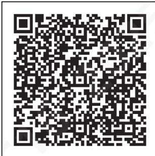

另外，根据国家相关法规的要求，现对新能源汽车的高电压蓄电池进行全生命周期的信息追溯，其中包括了电池与车，车与车主的信息更新。我们会在您进店维护时对车主信息进行核对，如您已经将您的新能源爱车售与他人，也请您主动和我们的授权经销商网络进行联系，以便追溯信息能够及时更新。

# 附录二

# 车轮定位值

<table><tr><td rowspan=1 colspan=5>E260/300L</td></tr><tr><td rowspan=3 colspan=1>水平高度</td><td rowspan=1 colspan=1>角度</td><td rowspan=1 colspan=1>设定值</td><td rowspan=1 colspan=1>公差</td><td rowspan=1 colspan=1>公差（Le/RI)</td></tr><tr><td rowspan=1 colspan=1>前轴</td><td rowspan=1 colspan=1>-2,55°</td><td rowspan=1 colspan=1>1,96%-1,51°</td><td rowspan=1 colspan=1>&lt;=1,21°</td></tr><tr><td rowspan=1 colspan=1>后轴</td><td rowspan=1 colspan=1>1,75°</td><td rowspan=1 colspan=1>1,96%-1,22°</td><td rowspan=1 colspan=1>&lt;=0,98°</td></tr><tr><td rowspan=1 colspan=1></td><td rowspan=1 colspan=1></td><td rowspan=1 colspan=1></td><td rowspan=1 colspan=1></td><td rowspan=1 colspan=1></td></tr><tr><td rowspan=5 colspan=1>后轴</td><td rowspan=1 colspan=1>车轮外倾角</td><td rowspan=1 colspan=1>-1°55&#x27;</td><td rowspan=1 colspan=1>0,30-0,30°</td><td rowspan=1 colspan=1>&lt;=0°00&#x27;±0°24&#x27;</td></tr><tr><td rowspan=1 colspan=1>主销后倾角</td><td rowspan=1 colspan=1>不适用</td><td rowspan=1 colspan=1>不适用</td><td rowspan=1 colspan=1>不适用</td></tr><tr><td rowspan=1 colspan=1>前束</td><td rowspan=1 colspan=1>0°10&#x27;</td><td rowspan=1 colspan=1>0°07/-0°07&#x27;</td><td rowspan=1 colspan=1>&lt;=0°15&#x27;</td></tr><tr><td rowspan=1 colspan=1>轮距（Ges）</td><td rowspan=1 colspan=1>0°20&#x27;</td><td rowspan=1 colspan=1>0°071-0°07&#x27;</td><td rowspan=1 colspan=1>不适用</td></tr><tr><td rowspan=1 colspan=1>推力角</td><td rowspan=1 colspan=1>0,00°</td><td rowspan=1 colspan=1>0°071-0°07&#x27;</td><td rowspan=1 colspan=1>不适用</td></tr><tr><td rowspan=1 colspan=1></td><td rowspan=1 colspan=1></td><td rowspan=1 colspan=1></td><td rowspan=1 colspan=1></td><td rowspan=1 colspan=1></td></tr><tr><td rowspan=5 colspan=1>前轴</td><td rowspan=1 colspan=1>车轮外倾角</td><td rowspan=1 colspan=1>-0°11&#x27;</td><td rowspan=1 colspan=1>0°22&#x27;-0°22&#x27;</td><td rowspan=1 colspan=1>&lt;=0°00&#x27;±0°24&#x27;</td></tr><tr><td rowspan=1 colspan=1>主销后倾角</td><td rowspan=1 colspan=1>9°17&#x27;</td><td rowspan=1 colspan=1>0°327-0°30&#x27;</td><td rowspan=1 colspan=1>&lt;=0°30&#x27;</td></tr><tr><td rowspan=1 colspan=1>轮距差</td><td rowspan=1 colspan=1>-108&#x27;</td><td rowspan=1 colspan=1>0°30/-0°30&#x27;</td><td rowspan=1 colspan=1>不适用</td></tr><tr><td rowspan=1 colspan=1>前束</td><td rowspan=1 colspan=1>0°09&#x27;</td><td rowspan=1 colspan=1>0°05&#x27;/-0°05&#x27;</td><td rowspan=1 colspan=1>不适用</td></tr><tr><td rowspan=1 colspan=1>轮距（Ges）</td><td rowspan=1 colspan=1>0°18&#x27;</td><td rowspan=1 colspan=1>0°107-0°10&#x27;</td><td rowspan=1 colspan=1>不适用</td></tr></table>

<table><tr><td rowspan=1 colspan=5>E260L4MATIC</td></tr><tr><td rowspan=3 colspan=1>水平高度</td><td rowspan=1 colspan=1>角度</td><td rowspan=1 colspan=1>设定值</td><td rowspan=1 colspan=1>公差</td><td rowspan=1 colspan=1>公差（Le/RI)</td></tr><tr><td rowspan=1 colspan=1>前轴</td><td rowspan=1 colspan=1>1,32°</td><td rowspan=1 colspan=1>2,02%-1,55°</td><td rowspan=1 colspan=1>&lt;=1,24°</td></tr><tr><td rowspan=1 colspan=1>后轴</td><td rowspan=1 colspan=1>1,75°</td><td rowspan=1 colspan=1>1,96%-1,22°</td><td rowspan=1 colspan=1>&lt;=0,98°</td></tr><tr><td rowspan=1 colspan=1></td><td rowspan=1 colspan=1></td><td rowspan=1 colspan=1></td><td rowspan=1 colspan=1></td><td rowspan=1 colspan=1></td></tr><tr><td rowspan=5 colspan=1>后轴</td><td rowspan=1 colspan=1>车轮外倾角</td><td rowspan=1 colspan=1>-1°05&#x27;</td><td rowspan=1 colspan=1>0,30-0,30°</td><td rowspan=1 colspan=1>&lt;=0°00&#x27;±0°24&#x27;</td></tr><tr><td rowspan=1 colspan=1>主销后倾角</td><td rowspan=1 colspan=1>不适用</td><td rowspan=1 colspan=1>不适用</td><td rowspan=1 colspan=1>不适用</td></tr><tr><td rowspan=1 colspan=1>前束</td><td rowspan=1 colspan=1>0°10&#x27;</td><td rowspan=1 colspan=1>0°07&#x27;1-0°07&#x27;</td><td rowspan=1 colspan=1>&lt;=0°15&#x27;</td></tr><tr><td rowspan=1 colspan=1>轮距（Ges）</td><td rowspan=1 colspan=1>0°20&#x27;</td><td rowspan=1 colspan=1>0°07&#x27;1-0°07&#x27;</td><td rowspan=1 colspan=1>不适用</td></tr><tr><td rowspan=1 colspan=1>推力角</td><td rowspan=1 colspan=1>0,00°</td><td rowspan=1 colspan=1>0°07&#x27;/-0°07&#x27;</td><td rowspan=1 colspan=1>不适用</td></tr><tr><td rowspan=1 colspan=1></td><td rowspan=1 colspan=1></td><td rowspan=1 colspan=1></td><td rowspan=1 colspan=1></td><td rowspan=1 colspan=1></td></tr><tr><td rowspan=5 colspan=1>前轴</td><td rowspan=1 colspan=1>车轮外倾角</td><td rowspan=1 colspan=1>-0°14&#x27;</td><td rowspan=1 colspan=1>0°22&#x27;-0°22&#x27;</td><td rowspan=1 colspan=1>&lt;=0°00&#x27;±0°24&#x27;</td></tr><tr><td rowspan=1 colspan=1>主销后倾角</td><td rowspan=1 colspan=1>9°16&#x27;</td><td rowspan=1 colspan=1>0°30&#x27;-0°30&#x27;</td><td rowspan=1 colspan=1>&lt;=0°30&#x27;</td></tr><tr><td rowspan=1 colspan=1>轮距差</td><td rowspan=1 colspan=1>-105&#x27;</td><td rowspan=1 colspan=1>0°30&#x27;/-0°30&#x27;</td><td rowspan=1 colspan=1>不适用</td></tr><tr><td rowspan=1 colspan=1>前束</td><td rowspan=1 colspan=1>0°08&#x27;</td><td rowspan=1 colspan=1>0°05&#x27;/-0°05&#x27;</td><td rowspan=1 colspan=1>不适用</td></tr><tr><td rowspan=1 colspan=1>轮距（Ges）</td><td rowspan=1 colspan=1>0°17&#x27;</td><td rowspan=1 colspan=1>0°107-0°10&#x27;</td><td rowspan=1 colspan=1>不适用</td></tr></table>

<table><tr><td rowspan=1 colspan=5>E350eL</td></tr><tr><td rowspan=3 colspan=1>水平高度</td><td rowspan=1 colspan=1>角度</td><td rowspan=1 colspan=1>设定值</td><td rowspan=1 colspan=1>公差</td><td rowspan=1 colspan=1>公差（Le/RI）</td></tr><tr><td rowspan=1 colspan=1>前轴</td><td rowspan=1 colspan=1>-2,55°</td><td rowspan=1 colspan=1>1,96%-1,51°</td><td rowspan=1 colspan=1>&lt;=1,21°</td></tr><tr><td rowspan=1 colspan=1>后轴</td><td rowspan=1 colspan=1>1,63°</td><td rowspan=1 colspan=1>2,08%-1,22°</td><td rowspan=1 colspan=1>&lt;=0,98°</td></tr><tr><td rowspan=1 colspan=1></td><td rowspan=1 colspan=1></td><td rowspan=1 colspan=1></td><td rowspan=1 colspan=1></td><td rowspan=1 colspan=1></td></tr><tr><td rowspan=5 colspan=1>后轴</td><td rowspan=1 colspan=1>车轮外倾角</td><td rowspan=1 colspan=1>-107&#x27;</td><td rowspan=1 colspan=1>0,30%-0,30°</td><td rowspan=1 colspan=1>&lt;=0°00&#x27;±0°24&#x27;</td></tr><tr><td rowspan=1 colspan=1>主销后倾角</td><td rowspan=1 colspan=1>不适用</td><td rowspan=1 colspan=1>不适用</td><td rowspan=1 colspan=1>不适用</td></tr><tr><td rowspan=1 colspan=1>前束</td><td rowspan=1 colspan=1>0°10&#x27;</td><td rowspan=1 colspan=1>0°07&#x27;/-0°07&#x27;</td><td rowspan=1 colspan=1>&lt;=0°15&#x27;</td></tr><tr><td rowspan=1 colspan=1>轮距（Ges）</td><td rowspan=1 colspan=1>0°20&#x27;</td><td rowspan=1 colspan=1>0°07&#x27;1-0°07&#x27;</td><td rowspan=1 colspan=1>不适用</td></tr><tr><td rowspan=1 colspan=1>推力角</td><td rowspan=1 colspan=1>0,00°</td><td rowspan=1 colspan=1>0°07&#x27;/-0°07&#x27;</td><td rowspan=1 colspan=1>不适用</td></tr><tr><td rowspan=1 colspan=1></td><td rowspan=1 colspan=1></td><td rowspan=1 colspan=1></td><td rowspan=1 colspan=1></td><td rowspan=1 colspan=1></td></tr><tr><td rowspan=5 colspan=1>前轴</td><td rowspan=1 colspan=1>车轮外倾角</td><td rowspan=1 colspan=1>-0°11&#x27;</td><td rowspan=1 colspan=1>0°22&#x27;-0°22&#x27;</td><td rowspan=1 colspan=1>&lt;=0°00&#x27;±0°24&#x27;</td></tr><tr><td rowspan=1 colspan=1>主销后倾角</td><td rowspan=1 colspan=1>9°18</td><td rowspan=1 colspan=1>0°307-0°30&#x27;</td><td rowspan=1 colspan=1>&lt;=0°30&#x27;</td></tr><tr><td rowspan=1 colspan=1>轮距差</td><td rowspan=1 colspan=1>-1°08</td><td rowspan=1 colspan=1>0°307-0°30&#x27;</td><td rowspan=1 colspan=1>不适用</td></tr><tr><td rowspan=1 colspan=1>前束</td><td rowspan=1 colspan=1>0°09&#x27;</td><td rowspan=1 colspan=1>0°05&#x27;-0°05&#x27;</td><td rowspan=1 colspan=1>不适用</td></tr><tr><td rowspan=1 colspan=1>轮距（Ges）</td><td rowspan=1 colspan=1>0°18&#x27;</td><td rowspan=1 colspan=1>0°107-0°10&#x27;</td><td rowspan=1 colspan=1>不适用</td></tr></table>

# 详细出版信息

# 网址

有关梅赛德斯-奔驰车辆、梅赛德斯-奔驰股份公司和北京奔驰汽车有限公司的详细信息，请访问以下网址：

https://www.mercedes-benz.com.cn https://group.mercedes-benz.com https://www.bbac.com.cn

# 资料组

如果您对本使用说明书（用户手册）有任何疑问或建议，敬请联系：

梅赛德斯-奔驰授权经销商或北京梅赛德斯-奔驰汽车销售服务有限公司

梅赛德斯-奔驰股份公司：未经梅赛德斯-奔驰股份公司书面许可，不得全部或部分重印、翻译或再版。

# 车辆制造商

北京奔驰汽车有限公司中国北京  
经济技术开发区  
博兴路8号100176

i目

# 车内电子版

# 车辆文件夹

在MBUX智能人机交互系统中的“偏好"下可找到使用说明书（用户手册）。从快速入门开始，探索实用提示。

您可在此处找到有关车辆操作以及保养和保修的综合信息印刷版。